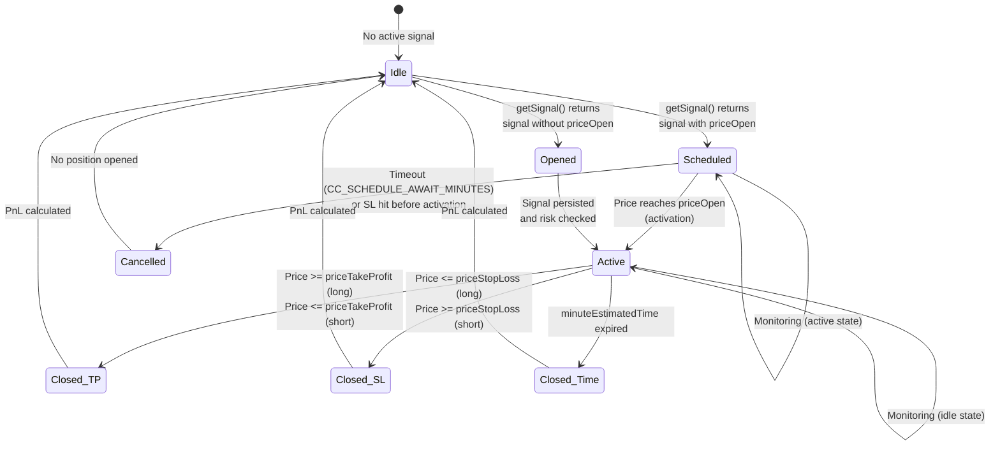
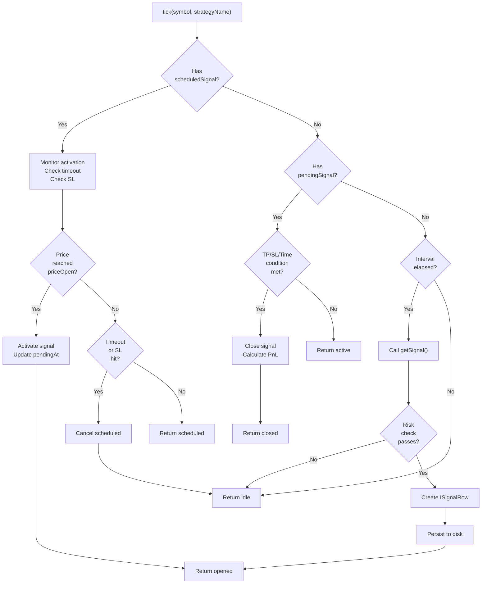
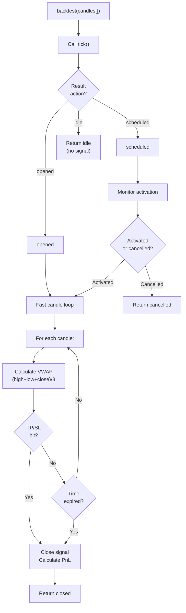
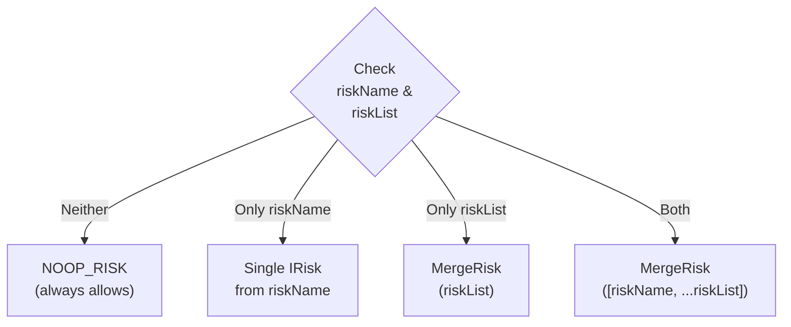
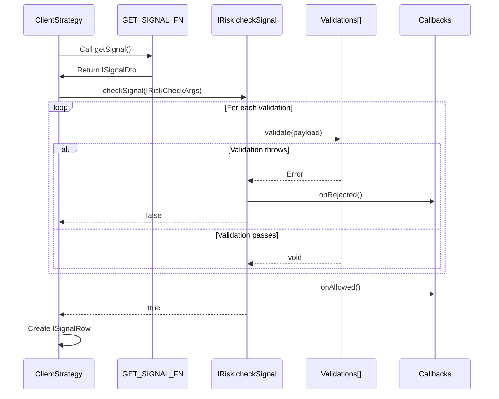
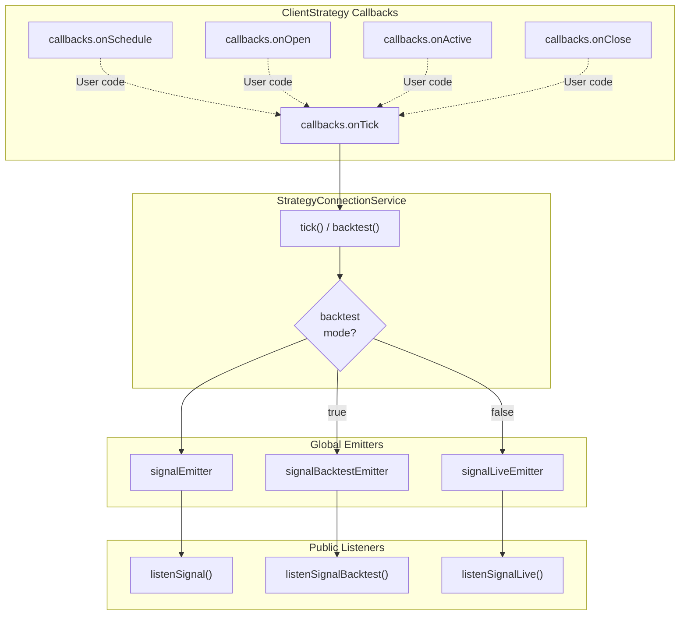
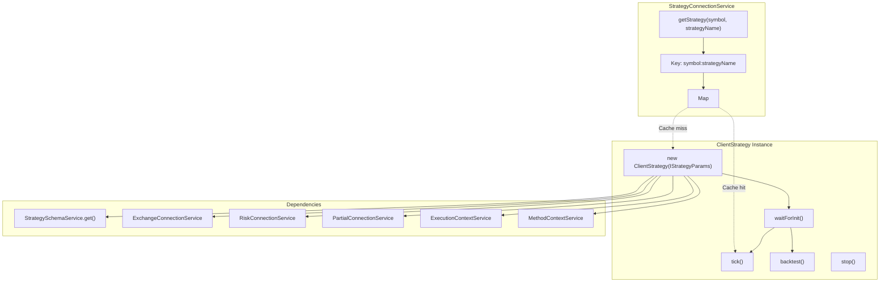
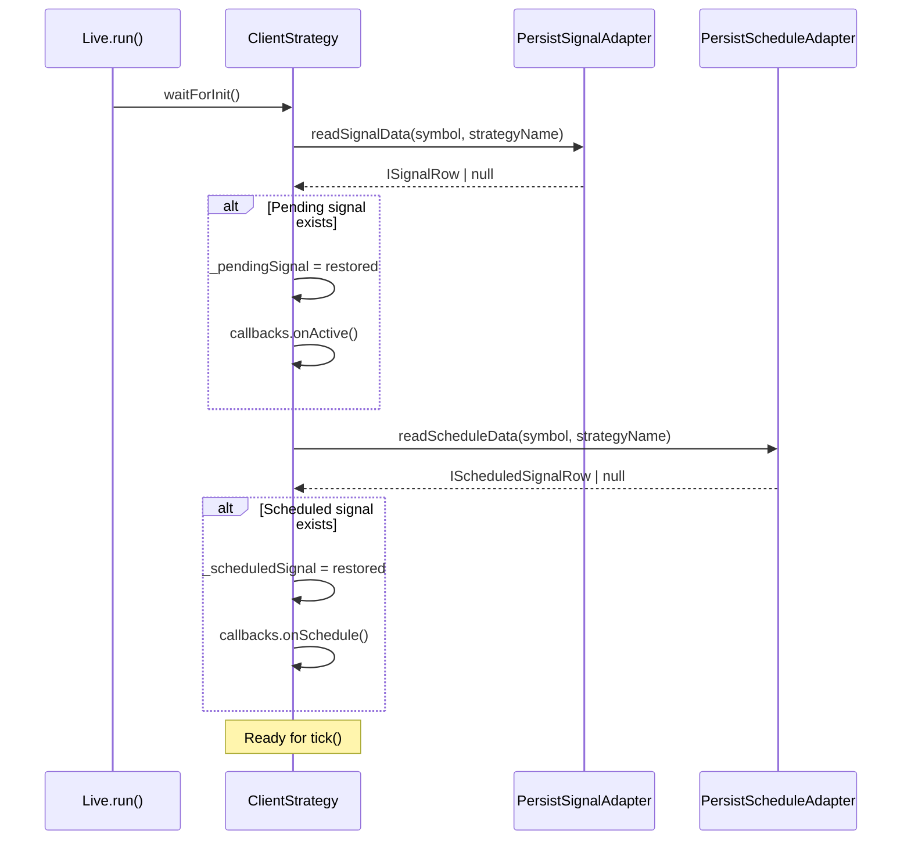

# Strategy System

## Purpose and Scope

The Strategy System is the core mechanism for defining, registering, and executing trading strategies in the backtest-kit framework. This system handles signal generation, lifecycle management, risk validation, and execution across both backtest and live trading modes.

This page covers strategy schema definition, signal types, execution flow, and integration with risk management. For details on specific execution modes, see Backtest Mode ([#5.1](./17-backtest-mode.md)), Live Trading Mode ([#5.2](./18-live-trading-mode.md)), and Walker Mode ([#5.3](./19-walker-mode.md)). For risk validation rules, see Risk Management ([#4.3](./14-risk-management.md)). For position sizing calculations, see Position Sizing ([#4.4](./15-position-sizing.md)).

---

## Core Architecture

### Strategy System Component Hierarchy

```mermaid
graph TB
    subgraph "Public API"
        ADD_STRATEGY["addStrategy(IStrategySchema)"]
        LIST_STRATEGIES["listStrategies()"]
    end
    
    subgraph "Schema Registry"
        STRATEGY_SCHEMA["StrategySchemaService"]
        STRATEGY_VALIDATION["StrategyValidationService"]
        STORAGE["Map<StrategyName, IStrategySchema>"]
    end
    
    subgraph "Connection Layer"
        STRATEGY_CONNECTION["StrategyConnectionService"]
        MEMOIZE["memoize(symbol:strategyName)"]
    end
    
    subgraph "Client Implementation"
        CLIENT_STRATEGY["ClientStrategy"]
        PENDING_SIGNAL["_pendingSignal: ISignalRow | null"]
        SCHEDULED_SIGNAL["_scheduledSignal: IScheduledSignalRow | null"]
        LAST_TIMESTAMP["_lastSignalTimestamp: number | null"]
        IS_STOPPED["_isStopped: boolean"]
    end
    
    subgraph "Signal Lifecycle"
        TICK["tick(): IStrategyTickResult"]
        BACKTEST["backtest(): IStrategyBacktestResult"]
        GET_SIGNAL_FN["GET_SIGNAL_FN()"]
        VALIDATE_SIGNAL["VALIDATE_SIGNAL_FN()"]
    end
    
    subgraph "Risk Integration"
        RISK_CHECK["IRisk.checkSignal()"]
        RISK_ADD["IRisk.addSignal()"]
        RISK_REMOVE["IRisk.removeSignal()"]
        MERGE_RISK["MergeRisk"]
    end
    
    subgraph "Persistence"
        PERSIST_SIGNAL["PersistSignalAdapter"]
        PERSIST_SCHEDULE["PersistScheduleAdapter"]
        WAIT_INIT["waitForInit()"]
    end
    
    subgraph "Event System"
        SIGNAL_EMITTER["signalEmitter"]
        SIGNAL_BACKTEST["signalBacktestEmitter"]
        SIGNAL_LIVE["signalLiveEmitter"]
        CALLBACKS["IStrategyCallbacks"]
    end
    
    ADD_STRATEGY --> STRATEGY_VALIDATION
    STRATEGY_VALIDATION --> STRATEGY_SCHEMA
    STRATEGY_SCHEMA --> STORAGE
    
    STRATEGY_CONNECTION --> MEMOIZE
    MEMOIZE --> CLIENT_STRATEGY
    
    CLIENT_STRATEGY --> PENDING_SIGNAL
    CLIENT_STRATEGY --> SCHEDULED_SIGNAL
    CLIENT_STRATEGY --> LAST_TIMESTAMP
    CLIENT_STRATEGY --> IS_STOPPED
    
    CLIENT_STRATEGY --> TICK
    CLIENT_STRATEGY --> BACKTEST
    TICK --> GET_SIGNAL_FN
    BACKTEST --> GET_SIGNAL_FN
    GET_SIGNAL_FN --> VALIDATE_SIGNAL
    
    GET_SIGNAL_FN --> RISK_CHECK
    CLIENT_STRATEGY --> RISK_ADD
    CLIENT_STRATEGY --> RISK_REMOVE
    RISK_CHECK --> MERGE_RISK
    
    CLIENT_STRATEGY --> WAIT_INIT
    WAIT_INIT --> PERSIST_SIGNAL
    WAIT_INIT --> PERSIST_SCHEDULE
    
    CLIENT_STRATEGY --> CALLBACKS
    STRATEGY_CONNECTION --> SIGNAL_EMITTER
    STRATEGY_CONNECTION --> SIGNAL_BACKTEST
    STRATEGY_CONNECTION --> SIGNAL_LIVE
```



---

## Strategy Schema and Registration

### IStrategySchema Interface

Strategies are registered via `addStrategy()` with an `IStrategySchema` object. The schema defines signal generation logic, throttling interval, lifecycle callbacks, and risk management configuration.

| Property | Type | Required | Description |
|----------|------|----------|-------------|
| `strategyName` | `StrategyName` | ✓ | Unique identifier for strategy registration |
| `interval` | `SignalInterval` | ✓ | Minimum time between `getSignal()` calls |
| `getSignal` | `function` | ✓ | Signal generation callback function |
| `note` | `string` | ✗ | Optional developer documentation |
| `callbacks` | `Partial<IStrategyCallbacks>` | ✗ | Lifecycle event hooks |
| `riskName` | `RiskName` | ✗ | Single risk profile identifier |
| `riskList` | `RiskName[]` | ✗ | Multiple risk profiles (combined) |

### Signal Generation Intervals

The `interval` property enforces throttling to prevent excessive `getSignal()` calls:

| Interval | Minutes | Use Case |
|----------|---------|----------|
| `"1m"` | 1 | High-frequency scalping |
| `"3m"` | 3 | Short-term momentum |
| `"5m"` | 5 | Standard intraday |
| `"15m"` | 15 | Medium-term swing |
| `"30m"` | 30 | Position trading |
| `"1h"` | 60 | Long-term strategies |

Throttling is enforced by `_lastSignalTimestamp` tracking in ClientStrategy. If less than the interval has elapsed since the last call, `getSignal()` is skipped.

### Registration Example

```typescript
addStrategy({
  strategyName: "momentum-scalper",
  interval: "5m",
  riskName: "conservative",
  note: "5-minute momentum strategy with 2% risk per trade",
  getSignal: async (symbol: string, when: Date) => {
    // Signal generation logic
    if (shouldEnter) {
      return {
        position: "long",
        priceTakeProfit: 43500,
        priceStopLoss: 41500,
        minuteEstimatedTime: 120,
        note: "Momentum breakout"
      };
    }
    return null; // No signal
  },
  callbacks: {
    onOpen: (symbol, data, currentPrice, backtest) => {
      console.log(`Signal opened: ${data.id}`);
    },
    onClose: (symbol, data, priceClose, backtest) => {
      console.log(`Signal closed: ${data.id}`);
    }
  }
});
```

---

## Signal Types and State Machine

### Signal Type Hierarchy

```mermaid
graph TB
    subgraph "User-Provided DTO"
        DTO["ISignalDto"]
        DTO_ID["id?: string"]
        DTO_POSITION["position: long | short"]
        DTO_OPEN["priceOpen?: number"]
        DTO_TP["priceTakeProfit: number"]
        DTO_SL["priceStopLoss: number"]
        DTO_TIME["minuteEstimatedTime: number"]
        DTO_NOTE["note?: string"]
        
        DTO --> DTO_ID
        DTO --> DTO_POSITION
        DTO --> DTO_OPEN
        DTO --> DTO_TP
        DTO --> DTO_SL
        DTO --> DTO_TIME
        DTO --> DTO_NOTE
    end
    
    subgraph "System-Augmented Row"
        ROW["ISignalRow"]
        ROW_ID["id: string (UUID v4)"]
        ROW_OPEN["priceOpen: number (required)"]
        ROW_EXCHANGE["exchangeName: ExchangeName"]
        ROW_STRATEGY["strategyName: StrategyName"]
        ROW_SYMBOL["symbol: string"]
        ROW_SCHEDULED["scheduledAt: number (ms)"]
        ROW_PENDING["pendingAt: number (ms)"]
        ROW_FLAG["_isScheduled: boolean"]
        
        ROW --> ROW_ID
        ROW --> ROW_OPEN
        ROW --> ROW_EXCHANGE
        ROW --> ROW_STRATEGY
        ROW --> ROW_SYMBOL
        ROW --> ROW_SCHEDULED
        ROW --> ROW_PENDING
        ROW --> ROW_FLAG
    end
    
    subgraph "Scheduled Variant"
        SCHEDULED["IScheduledSignalRow"]
        SCHEDULED_EXTENDS["extends ISignalRow"]
        SCHEDULED_OPEN["priceOpen: number (entry price)"]
        SCHEDULED_FLAG["_isScheduled: true"]
        
        SCHEDULED --> SCHEDULED_EXTENDS
        SCHEDULED --> SCHEDULED_OPEN
        SCHEDULED --> SCHEDULED_FLAG
    end
    
    DTO -.->|"validated + augmented"| ROW
    ROW -.->|"if priceOpen specified"| SCHEDULED
```



### Signal State Machine



**Key Transitions**:

1. **Idle → Scheduled**: `priceOpen` specified in `ISignalDto`
2. **Idle → Opened**: `priceOpen` omitted (uses current VWAP)
3. **Scheduled → Active**: Price crosses `priceOpen` (long: price ≤ priceOpen, short: price ≥ priceOpen)
4. **Scheduled → Cancelled**: Timeout or SL hit before activation
5. **Opened → Active**: Signal validated and persisted
6. **Active → Closed**: TP/SL/Time condition met

### Timestamp Semantics

| Field | Meaning | Set When |
|-------|---------|----------|
| `scheduledAt` | Signal creation time | `getSignal()` returns non-null |
| `pendingAt` | Position entry time | Scheduled: activation time<br/>Immediate: same as `scheduledAt` |

For scheduled signals, `pendingAt` is initially set to `scheduledAt` but updated to the activation timestamp when price reaches `priceOpen`.

---

## Strategy Execution Flow

### Execution Methods

ClientStrategy provides two execution methods:

| Method | Mode | Returns | Use Case |
|--------|------|---------|----------|
| `tick()` | Live/Backtest | `IStrategyTickResult` | Single tick with VWAP monitoring |
| `backtest()` | Backtest only | `IStrategyBacktestResult` | Fast candle-by-candle processing |

### tick() Execution Flow



**Key Steps**:

1. **Scheduled Signal Monitoring**: Check for activation, timeout, or cancellation
2. **Pending Signal Monitoring**: Check TP/SL/Time conditions
3. **Idle State**: Check interval throttling, call `getSignal()`, validate risk
4. **Signal Creation**: Generate UUID, augment with context, persist to disk
5. **Result Emission**: Emit to `signalEmitter`, `signalBacktestEmitter`, or `signalLiveEmitter`

### backtest() Fast Processing

The `backtest()` method optimizes historical simulation by skipping to signal close timestamps:



**Optimization**: Skip directly to `closeTimestamp` instead of processing every intermediate timeframe.

---

## Risk Management Integration

### Risk Profile Assignment

Strategies integrate risk management through two properties:

| Property | Type | Behavior |
|----------|------|----------|
| `riskName` | `RiskName` | Single risk profile |
| `riskList` | `RiskName[]` | Multiple risk profiles (combined) |

**Combination Logic** (from `GET_RISK_FN`):



### Risk Check Flow



**IRiskCheckArgs Payload**:

```typescript
{
  symbol: string,
  pendingSignal: ISignalDto,
  strategyName: StrategyName,
  exchangeName: ExchangeName,
  currentPrice: number,
  timestamp: number
}
```

---

## Signal Validation Rules

### Built-in Validation (VALIDATE_SIGNAL_FN)

ClientStrategy enforces comprehensive validation before signal creation:

| Category | Rule | Long | Short |
|----------|------|------|-------|
| **Price Logic** | TP direction | TP > priceOpen | TP < priceOpen |
| | SL direction | SL < priceOpen | SL > priceOpen |
| **Distance Checks** | Min TP distance | `CC_MIN_TAKEPROFIT_DISTANCE_PERCENT` | Same |
| | Min SL distance | `CC_MIN_STOPLOSS_DISTANCE_PERCENT` | Same |
| | Max SL distance | `CC_MAX_STOPLOSS_DISTANCE_PERCENT` | Same |
| **Time Limits** | Max lifetime | `CC_MAX_SIGNAL_LIFETIME_MINUTES` | Same |
| **Immediate Close Prevention** | SL not hit | currentPrice > SL | currentPrice < SL |
| | TP not hit | currentPrice < TP | currentPrice > TP |

### Global Configuration Parameters

| Parameter | Default | Purpose |
|-----------|---------|---------|
| `CC_MIN_TAKEPROFIT_DISTANCE_PERCENT` | 0.5% | Ensure TP covers fees + slippage |
| `CC_MIN_STOPLOSS_DISTANCE_PERCENT` | 0.5% | Prevent instant stop-out on volatility |
| `CC_MAX_STOPLOSS_DISTANCE_PERCENT` | 20% | Limit catastrophic losses |
| `CC_MAX_SIGNAL_LIFETIME_MINUTES` | 1440 (1 day) | Prevent eternal signals blocking risk limits |
| `CC_PERCENT_SLIPPAGE` | 0.1% | Slippage per transaction |
| `CC_PERCENT_FEE` | 0.1% | Fee per transaction |

**Economic Viability Check**:

```
Minimum TP Distance = (slippage × 2) + (fees × 2) + buffer
                    = (0.1% × 2) + (0.1% × 2) + 0.1%
                    = 0.5%
```

### Validation Error Examples

```typescript
// ❌ TP too close (covers fees + slippage)
{
  position: "long",
  priceOpen: 42000,
  priceTakeProfit: 42100,  // Only 0.24% - fails
  priceStopLoss: 41000,
  minuteEstimatedTime: 60
}

// ❌ SL in wrong direction
{
  position: "long",
  priceOpen: 42000,
  priceTakeProfit: 43000,
  priceStopLoss: 43500,  // SL > priceOpen for long - fails
  minuteEstimatedTime: 60
}

// ❌ Immediate close (already hit TP)
{
  position: "long",
  priceOpen: 42000,
  priceTakeProfit: 41500,  // currentPrice=42000 already > TP - fails
  priceStopLoss: 41000,
  minuteEstimatedTime: 60
}
```

---

## Lifecycle Callbacks and Events

### IStrategyCallbacks Interface

Strategies can register lifecycle hooks via the `callbacks` property:

| Callback | Trigger | Parameters |
|----------|---------|------------|
| `onTick` | Every tick (all results) | `(symbol, result, backtest)` |
| `onIdle` | No active signal | `(symbol, currentPrice, backtest)` |
| `onSchedule` | Scheduled signal created | `(symbol, data, currentPrice, backtest)` |
| `onOpen` | Signal activated/opened | `(symbol, data, currentPrice, backtest)` |
| `onActive` | Signal being monitored | `(symbol, data, currentPrice, backtest)` |
| `onClose` | Signal closed (TP/SL/Time) | `(symbol, data, priceClose, backtest)` |
| `onCancel` | Scheduled signal cancelled | `(symbol, data, currentPrice, backtest)` |
| `onPartialProfit` | Profit milestone reached | `(symbol, data, currentPrice, revenuePercent, backtest)` |
| `onPartialLoss` | Loss milestone reached | `(symbol, data, currentPrice, lossPercent, backtest)` |
| `onWrite` | Signal persisted (testing) | `(symbol, data, backtest)` |

### Event Emission Flow



### Callback Usage Example

```typescript
addStrategy({
  strategyName: "monitored-strategy",
  interval: "5m",
  getSignal: async (symbol, when) => {
    // Signal generation logic
    return signal;
  },
  callbacks: {
    onOpen: (symbol, data, currentPrice, backtest) => {
      console.log(`[${backtest ? 'BT' : 'LIVE'}] Signal opened: ${data.id}`);
      console.log(`  Position: ${data.position}`);
      console.log(`  Entry: ${data.priceOpen}`);
      console.log(`  TP: ${data.priceTakeProfit}, SL: ${data.priceStopLoss}`);
    },
    
    onActive: (symbol, data, currentPrice, backtest) => {
      console.log(`[${backtest ? 'BT' : 'LIVE'}] Monitoring: ${data.id}`);
      console.log(`  Current: ${currentPrice}`);
    },
    
    onPartialProfit: (symbol, data, currentPrice, revenuePercent, backtest) => {
      console.log(`[${backtest ? 'BT' : 'LIVE'}] Profit milestone: ${revenuePercent.toFixed(1)}%`);
    },
    
    onClose: (symbol, data, priceClose, backtest) => {
      console.log(`[${backtest ? 'BT' : 'LIVE'}] Signal closed: ${data.id}`);
      console.log(`  Close price: ${priceClose}`);
    }
  }
});
```

---

## Implementation Details

### StrategyConnectionService

The connection layer routes strategy operations to memoized `ClientStrategy` instances:



**Memoization Key**: `${symbol}:${strategyName}` (e.g., `"BTCUSDT:momentum-scalper"`)

**Cache Clearing**: Use `clear()` method to force re-initialization or release resources.

### ClientStrategy Internal State

| Field | Type | Purpose |
|-------|------|---------|
| `_pendingSignal` | `ISignalRow \| null` | Currently active position (monitoring TP/SL) |
| `_scheduledSignal` | `IScheduledSignalRow \| null` | Scheduled signal awaiting activation |
| `_lastSignalTimestamp` | `number \| null` | Last `getSignal()` call time (for throttling) |
| `_isStopped` | `boolean` | Stop flag (prevents new signals) |

**State Transitions**:

1. **Idle**: Both `_pendingSignal` and `_scheduledSignal` are `null`
2. **Scheduled**: `_scheduledSignal` is set, `_pendingSignal` is `null`
3. **Active**: `_pendingSignal` is set, `_scheduledSignal` is `null`

### Persistence and Recovery

ClientStrategy integrates with `PersistSignalAdapter` and `PersistScheduleAdapter` for crash-safe state recovery:



**File Paths**:
- Pending: `./dump/signal_${symbol}_${strategyName}.json`
- Scheduled: `./dump/schedule_${symbol}_${strategyName}.json`

**Atomic Writes**: Uses `singleshot()` pattern to prevent write race conditions.

---

## Summary

The Strategy System provides a complete framework for defining, validating, executing, and monitoring trading strategies:

1. **Registration**: `addStrategy()` with `IStrategySchema` defines signal generation logic
2. **Throttling**: `SignalInterval` prevents excessive `getSignal()` calls
3. **Validation**: Comprehensive checks for TP/SL logic, distances, and economic viability
4. **Risk Integration**: `riskName`/`riskList` combine risk profiles via `MergeRisk`
5. **Lifecycle**: State machine (idle → scheduled → active → closed) with callbacks
6. **Execution**: `tick()` for live monitoring, `backtest()` for fast historical simulation
7. **Persistence**: Crash-safe state recovery via `PersistSignalAdapter` and `PersistScheduleAdapter`
8. **Events**: Global emitters (`signalEmitter`, `signalBacktestEmitter`, `signalLiveEmitter`) for monitoring

For execution mode details, see Backtest Mode ([#5.1](./17-backtest-mode.md)), Live Trading Mode ([#5.2](./18-live-trading-mode.md)), and Walker Mode ([#5.3](./19-walker-mode.md)).

