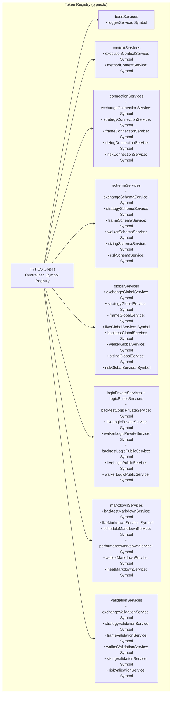
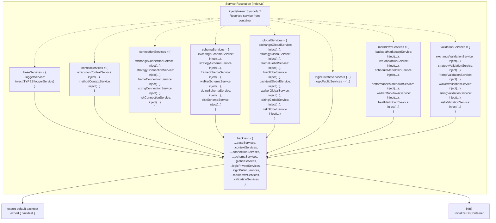
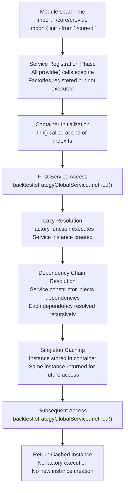
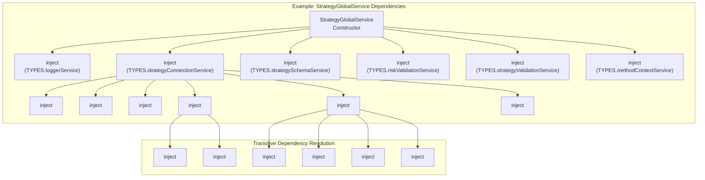
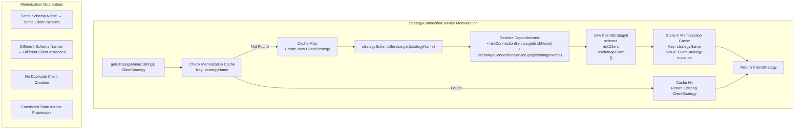
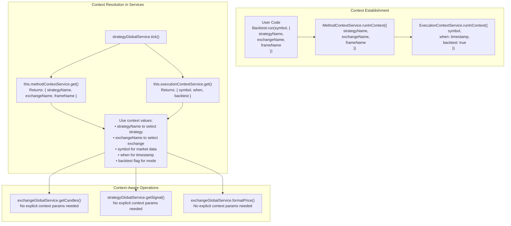
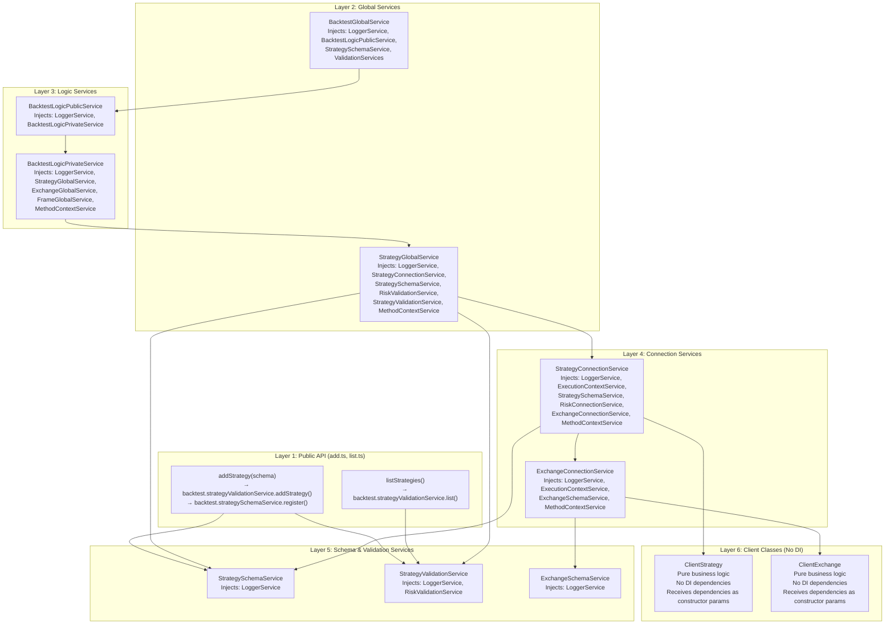

# Dependency Injection System

Relevant source files

The following files were used as context for generating this wiki page:

- [assets/uml.svg](assets/uml.svg)
- [docs/internals.md](docs/internals.md)
- [docs/uml.puml](docs/uml.puml)
- [scripts/_convert-md-mermaid-to-svg.cjs](scripts/_convert-md-mermaid-to-svg.cjs)
- [scripts/gpt-docs.mjs](scripts/gpt-docs.mjs)
- [scripts/uml.mjs](scripts/uml.mjs)
- [src/function/add.ts](src/function/add.ts)
- [src/function/list.ts](src/function/list.ts)
- [src/lib/core/provide.ts](src/lib/core/provide.ts)
- [src/lib/core/types.ts](src/lib/core/types.ts)
- [src/lib/index.ts](src/lib/index.ts)

This document describes the dependency injection (DI) container architecture used throughout backtest-kit. The DI system provides type-safe service resolution, singleton lifecycle management, and context propagation for all framework services. For information about the context propagation mechanism itself, see [Context Propagation](#3.3). For details on specific service layers, see [Layer Responsibilities](#3.1).

## Overview

The DI system in backtest-kit is based on Symbol-based service tokens, factory-based service registration, and lazy singleton initialization. All services are registered at module load time and resolved on first access. The system enables clean separation of concerns, testability, and predictable service lifecycle management.

**Sources:** [docs/internals.md:66-77](), [src/lib/index.ts:1-170]()

## Service Token System

Service tokens are JavaScript Symbols that uniquely identify each service type in the container. Tokens are organized by service category and defined in a centralized registry.

The token registry groups related services by their architectural layer. Each token is a unique Symbol created with a descriptive name matching the service's purpose.

**Token Categories:**

| Category | Purpose | Example Tokens |
|----------|---------|----------------|
| `baseServices` | Core infrastructure | `loggerService` |
| `contextServices` | Execution context management | `executionContextService`, `methodContextService` |
| `connectionServices` | Memoized client instance factories | `strategyConnectionService`, `exchangeConnectionService` |
| `schemaServices` | Schema storage and retrieval | `strategySchemaService`, `exchangeSchemaService` |
| `globalServices` | Public API entry points | `backtestGlobalService`, `liveGlobalService` |
| `logicPrivateServices` / `logicPublicServices` | Core orchestration logic | `backtestLogicPrivateService`, `backtestLogicPublicService` |
| `markdownServices` | Report generation | `backtestMarkdownService`, `liveMarkdownService` |
| `validationServices` | Runtime validation | `strategyValidationService`, `exchangeValidationService` |

**Sources:** [src/lib/core/types.ts:1-81]()

## Service Registration

Service registration occurs at module load time via the `provide()` function. Each service is bound to its token with a factory function that creates a new instance. Registration is organized by service category in separate code blocks.

```mermaid
graph LR
    subgraph "provide.ts - Registration Phase"
        Block1["Base Services Block<br/>provide(TYPES.loggerService, () => new LoggerService())"]
        Block2["Context Services Block<br/>provide(TYPES.executionContextService, () => new ExecutionContextService())<br/>provide(TYPES.methodContextService, () => new MethodContextService())"]
        Block3["Connection Services Block<br/>provide(TYPES.exchangeConnectionService, () => new ExchangeConnectionService())<br/>provide(TYPES.strategyConnectionService, () => new StrategyConnectionService())<br/>..."]
        Block4["Schema Services Block<br/>provide(TYPES.exchangeSchemaService, () => new ExchangeSchemaService())<br/>..."]
        Block5["Global Services Block<br/>provide(TYPES.exchangeGlobalService, () => new ExchangeGlobalService())<br/>..."]
        Block6["Logic Services Blocks<br/>provide(TYPES.backtestLogicPrivateService, () => new BacktestLogicPrivateService())<br/>..."]
        Block7["Markdown Services Block<br/>provide(TYPES.backtestMarkdownService, () => new BacktestMarkdownService())<br/>..."]
        Block8["Validation Services Block<br/>provide(TYPES.exchangeValidationService, () => new ExchangeValidationService())<br/>..."]
        
        Block1 --> Block2
        Block2 --> Block3
        Block3 --> Block4
        Block4 --> Block5
        Block5 --> Block6
        Block6 --> Block7
        Block7 --> Block8
    end
    
    Block8 --> Container["DI Container<br/>Ready for Resolution"]
```

The registration pattern follows a consistent structure:

1. Import service class
2. Call `provide(token, factory)` with token from TYPES and factory function
3. Factory returns new instance of the service class

All services are registered as singletons - the factory is only called once per token, and the same instance is returned on all subsequent resolutions.

**Sources:** [src/lib/core/provide.ts:1-111]()

## Service Resolution and Aggregation

Services are resolved from the DI container using the `inject()` function and aggregated into typed service collections. The main backtest object exports all services grouped by category.

The `inject()` function performs lazy resolution - services are only instantiated when first accessed. The aggregated `backtest` object serves as the central service locator used throughout the framework.

**Sources:** [src/lib/index.ts:1-170]()

## Service Lifecycle and Initialization

All services follow a singleton lifecycle pattern. Once a service is resolved from the container, the same instance is reused for all subsequent requests.

Key lifecycle characteristics:

| Phase | Behavior | Example |
|-------|----------|---------|
| Registration | Factory functions stored, not executed | `provide(TYPES.loggerService, () => new LoggerService())` |
| Initialization | Container prepared for resolution | `init()` at module load |
| First Access | Factory executes, dependencies resolved | `backtest.loggerService` triggers creation |
| Subsequent Access | Cached instance returned | Same `LoggerService` instance every time |

**Sources:** [src/lib/index.ts:164](), [src/lib/core/provide.ts:44-111]()

## Dependency Injection in Service Constructors

Services declare their dependencies by importing and using the DI system within their constructors. Dependencies are resolved at construction time through recursive DI resolution.

This pattern enables:
- **Automatic Dependency Resolution**: Services don't need to manually pass dependencies
- **Type Safety**: TypeScript enforces correct service types at compile time
- **Testability**: Services can be replaced with mocks by rebinding tokens
- **Decoupling**: Services depend on abstractions (tokens) not concrete implementations

**Sources:** [docs/uml.puml:29-99]()

## Memoization Pattern in Connection Services

Connection services use the memoization pattern to ensure that only one client instance exists per schema name. This prevents duplicate client creation and ensures consistent state across the framework.

**Memoized Connection Services:**

| Service | Client Created | Memoization Key | Purpose |
|---------|----------------|-----------------|---------|
| `StrategyConnectionService` | `ClientStrategy` | `strategyName` | Memoizes strategy instances with risk/exchange dependencies |
| `ExchangeConnectionService` | `ClientExchange` | `exchangeName` | Memoizes exchange instances for market data |
| `FrameConnectionService` | `ClientFrame` | `frameName` | Memoizes timeframe generators for backtesting |
| `RiskConnectionService` | `ClientRisk` | `riskName` | Memoizes risk managers shared across strategies |
| `SizingConnectionService` | `ClientSizing` | `sizingName` | Memoizes position sizing calculators |

The memoization is implemented using the `singleshot` decorator from `functools-kit`, which ensures the factory function only executes once per unique key combination.

**Sources:** [docs/internals.md:46-47](), [src/lib/core/provide.ts:54-59]()

## Context Propagation via DI-Scoped

The DI system integrates with `di-scoped` to provide context propagation throughout the framework. Two context types flow through the service layer: `ExecutionContext` and `MethodContext`.

**Context Types:**

| Context Type | Purpose | Fields | Established By |
|--------------|---------|--------|----------------|
| `MethodContext` | Identifies which components to use | `strategyName`, `exchangeName`, `frameName` | `MethodContextService.runInContext()` |
| `ExecutionContext` | Provides runtime parameters | `symbol`, `when`, `backtest` | `ExecutionContextService.runInContext()` |

**Benefits:**
- Services access context without parameter drilling
- User code provides context once at execution boundary
- Internal services automatically resolve correct components
- Context scoped to async execution flow via `di-scoped`

For detailed information on context propagation mechanics, see [Context Propagation](#3.3).

**Sources:** [docs/internals.md:70-77](), [src/lib/index.ts:10-15]()

## DI Flow Through Service Layers

The dependency injection system enables clean separation of the six architectural layers. Each layer depends on services from the same or lower layers via DI.

**Layer Dependency Rules:**

| Layer | May Depend On | Cannot Depend On |
|-------|---------------|------------------|
| Public API Functions | All Service Layers | Client Classes (directly) |
| Global Services | Logic Services, Connection Services, Schema Services, Validation Services | Client Classes (directly) |
| Logic Services | Global Services, Connection Services, Schema Services, Context Services | Client Classes (directly) |
| Connection Services | Schema Services, Other Connection Services, Context Services | Client Classes receive them as params |
| Schema Services | Base Services only | Any higher layer |
| Validation Services | Schema Services, Base Services | Any higher layer |
| Client Classes | Nothing (DI-free) | All service layers |

The DI system enforces this layering through constructor injection - each layer only has access to the tokens it needs, preventing architectural violations.

**Sources:** [docs/internals.md:28-40](), [src/lib/index.ts:49-162](), [src/function/add.ts:1-342]()