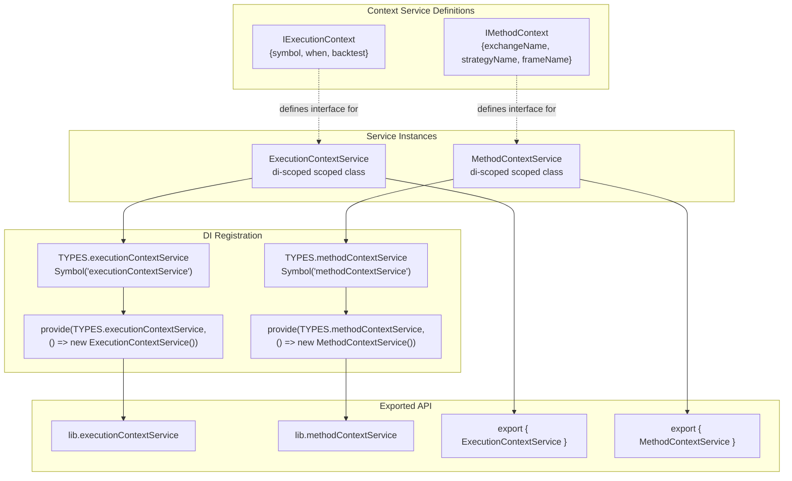
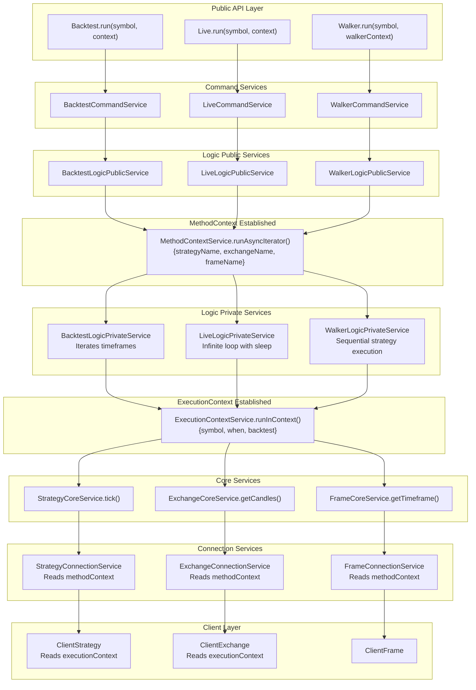
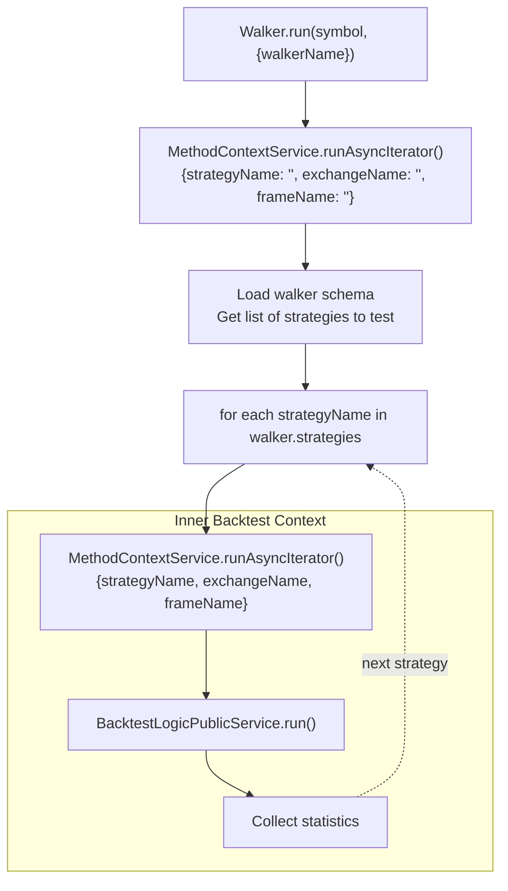

# Execution Contexts

## Purpose and Scope

This page explains the execution context system in backtest-kit, which provides ambient context propagation throughout the framework without explicit parameter passing. Two context types exist: **ExecutionContext** (runtime parameters like symbol, timestamp, mode) and **MethodContext** (schema routing identifiers like strategyName, exchangeName). For information about the broader service architecture that consumes these contexts, see [4.1 Service Layer & Dependency Injection](./14_architecture-deep-dive.md). For details on how strategies and exchanges use this context, see [3.2 Strategies](./08_core-concepts.md) and [8.1 Exchange Configuration](./36_exchanges-data-sources.md).

## Overview

Execution contexts solve the parameter drilling problem in deeply nested call stacks. Instead of passing `symbol`, `when`, `backtest`, `strategyName`, `exchangeName`, and `frameName` through every function call from the public API down to client implementations, these values are stored in scoped context objects that can be accessed anywhere in the call hierarchy.

The framework uses the `di-scoped` library to implement lexical scoping for context values. When a context is set using `runInContext()` or `runAsyncIterator()`, all code executed within that scope can access the context via the `.context` property without it being passed as an explicit parameter.

**Sources:** [types.d.ts:5-18](), [types.d.ts:296-309]()

## The Two Context Types

### ExecutionContext

**IExecutionContext** contains runtime parameters that change on every tick or operation:

| Field | Type | Purpose |
|-------|------|---------|
| `symbol` | `string` | Trading pair symbol (e.g., "BTCUSDT") |
| `when` | `Date` | Current timestamp for operation (historical for backtest, current for live) |
| `backtest` | `boolean` | Execution mode: `true` for historical simulation, `false` for live trading |

The `ExecutionContext` is set at the innermost execution loop level where individual ticks are processed. It provides temporal context that prevents look-ahead bias by ensuring all operations use the correct "current time."

**Sources:** [types.d.ts:11-18]()

### MethodContext

**IMethodContext** contains schema routing identifiers that remain constant throughout an execution session:

| Field | Type | Purpose |
|-------|------|---------|
| `exchangeName` | `ExchangeName` | Identifies which exchange schema to use for data fetching |
| `strategyName` | `StrategyName` | Identifies which strategy schema to execute |
| `frameName` | `FrameName` | Identifies which timeframe generator to use (empty string for live mode) |

The `MethodContext` is set at the orchestration layer (backtest/live/walker logic services) and determines which memoized client instances are retrieved from connection services.

**Sources:** [types.d.ts:302-309]()

## Context Services Architecture



**Sources:** [src/lib/core/types.ts:5-8](), [src/lib/core/provide.ts:60-63](), [src/lib/index.ts:66-71]()

## Context Propagation with di-scoped

The `di-scoped` library provides two key methods for establishing context scope:

### runInContext

Used for synchronous or promise-based async operations:

```typescript
ExecutionContextService.runInContext(
  async () => {
    // Inside this callback, context is automatically available
    // via executionContextService.context.symbol, .when, .backtest
    return await someOperation();
  },
  { symbol: "BTCUSDT", when: new Date(), backtest: true }
);
```

### runAsyncIterator

Used for async generator functions (streams):

```typescript
MethodContextService.runAsyncIterator(
  backtestGenerator,
  {
    strategyName: "my-strategy",
    exchangeName: "binance",
    frameName: "1d-backtest"
  }
);
```

This establishes context for the entire generator lifetime, allowing all yielded values to access the same schema routing information.

**Sources:** [types.d.ts:27-36](), [types.d.ts:318-328]()

## Context Flow Through Execution Layers



**Sources:** [src/lib/index.ts:131-163](), [src/index.ts:162-163]()

## Context Access Patterns

### Accessing ExecutionContext in Client Classes

Client classes (ClientExchange, ClientStrategy, ClientFrame) receive context services via constructor dependency injection:

```typescript
interface IExchangeParams extends IExchangeSchema {
  logger: ILogger;
  execution: TExecutionContextService; // ExecutionContext injected here
}
```

Inside client methods, context is accessed via the `.context` property:

```typescript
async getCandles(symbol: string, interval: CandleInterval, limit: number) {
  const { when, backtest } = this.execution.context;
  // Use when as the reference timestamp for fetching historical data
  // Use backtest flag to adjust behavior for simulation vs live
}
```

**Sources:** [types.d.ts:105-110]()

### Accessing MethodContext in Connection Services

Connection services use MethodContext to retrieve the correct schema names for memoized client instantiation:

```typescript
// Inside StrategyConnectionService
const { strategyName } = this.methodContext.context;
const schema = this.strategySchemaService.get(strategyName);
// Create or retrieve memoized ClientStrategy instance
```

This pattern allows connection services to route operations to the correct client instances without schema names being passed through every function call.

**Sources:** [types.d.ts:330-336]()

## Context Propagation in Backtest vs Live

```mermaid
graph TB
    subgraph "Backtest Mode"
        BT_FRAME["Generate timeframes<br/>[t1, t2, t3, ..., tn]"]
        BT_LOOP["for each timeframe"]
        BT_EC["ExecutionContextService.runInContext()<br/>{symbol, when: timeframe[i], backtest: true}"]
        BT_TICK["StrategyCoreService.tick()"]
        BT_CLIENT["ClientStrategy reads context<br/>when = historical timestamp<br/>backtest = true"]
    end
    
    subgraph "Live Mode"
        LIVE_SLEEP["sleep(TICK_TTL = 1 minute)"]
        LIVE_LOOP["while(true)"]
        LIVE_EC["ExecutionContextService.runInContext()<br/>{symbol, when: new Date(), backtest: false}"]
        LIVE_TICK["StrategyCoreService.tick()"]
        LIVE_CLIENT["ClientStrategy reads context<br/>when = current timestamp<br/>backtest = false"]
    end
    
    BT_FRAME --> BT_LOOP
    BT_LOOP --> BT_EC
    BT_EC --> BT_TICK
    BT_TICK --> BT_CLIENT
    BT_CLIENT -.->|"next timeframe"| BT_LOOP
    
    LIVE_SLEEP --> LIVE_LOOP
    LIVE_LOOP --> LIVE_EC
    LIVE_EC --> LIVE_TICK
    LIVE_TICK --> LIVE_CLIENT
    LIVE_CLIENT -.->|"sleep and repeat"| LIVE_SLEEP
```



The key difference:
- **Backtest**: `when` is set to each historical timeframe timestamp, advancing deterministically
- **Live**: `when` is set to `new Date()` on each iteration, tracking real-time

Both modes use the same `StrategyCoreService.tick()` and `ClientStrategy` implementations, but behavior differs based on the `backtest` flag in the context.

**Sources:** Diagram 2 from high-level architecture

## MethodContext Propagation in Walker Mode

Walker mode demonstrates nested context usage:



Walker establishes an outer MethodContext with empty schema names, then for each strategy creates a nested inner MethodContext with the specific strategyName/exchangeName/frameName. This allows each backtest to run in isolated context.

**Sources:** Diagram 2 from high-level architecture

## Benefits of Context Propagation

### Eliminates Parameter Drilling

Without contexts, every function in the call stack would need these parameters:

```typescript
// Without contexts (hypothetical)
async tick(
  symbol: string,
  when: Date,
  backtest: boolean,
  strategyName: string,
  exchangeName: string,
  frameName: string
) {
  await this.getCandles(symbol, when, backtest, exchangeName, ...);
}
```

With contexts, function signatures are clean:

```typescript
// With contexts (actual)
async tick() {
  await this.getCandles();
}
```

### Enforces Temporal Correctness

By making `when` available via context, the framework ensures all operations use the correct temporal reference. ClientExchange uses `when` as the cutoff point for historical data fetching, preventing look-ahead bias.

### Enables Shared Client Instances

MethodContext allows connection services to retrieve the correct schema and instantiate clients once per strategyName:exchangeName combination. Without MethodContext, each service would need to explicitly pass schema names through the call hierarchy.

**Sources:** [types.d.ts:6-18](), [types.d.ts:297-309]()

## Integration with Dependency Injection

Context services are registered in the DI container like other services:

| Service | Symbol | Constructor | Injection Type |
|---------|--------|-------------|----------------|
| ExecutionContextService | `TYPES.executionContextService` | `new ExecutionContextService()` | Singleton per application |
| MethodContextService | `TYPES.methodContextService` | `new MethodContextService()` | Singleton per application |

However, unlike typical services, context services manage **scoped state** using `di-scoped`. The service instances themselves are singletons, but the `.context` property value is scoped to the current execution context established by `runInContext()` or `runAsyncIterator()`.

**Sources:** [src/lib/core/types.ts:5-8](), [src/lib/core/provide.ts:60-63]()

## Code Reference Table

| Component | File Path | Lines |
|-----------|-----------|-------|
| IExecutionContext interface | [types.d.ts]() | 11-18 |
| IMethodContext interface | [types.d.ts]() | 302-309 |
| ExecutionContextService declaration | [types.d.ts]() | 38-49 |
| MethodContextService declaration | [types.d.ts]() | 330-336 |
| Context service DI registration | [src/lib/core/provide.ts]() | 60-63 |
| Context service TYPES symbols | [src/lib/core/types.ts]() | 5-8 |
| Context services export | [src/lib/index.ts]() | 66-71, 162-163 |
| IExchangeParams using ExecutionContext | [types.d.ts]() | 105-110 |

**Sources:** [types.d.ts:11-18](), [types.d.ts:302-309](), [types.d.ts:38-49](), [types.d.ts:330-336](), [src/lib/core/provide.ts:60-63](), [src/lib/core/types.ts:5-8](), [src/lib/index.ts:66-71](), [src/lib/index.ts:162-163](), [types.d.ts:105-110]()