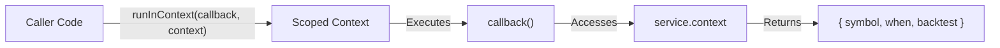
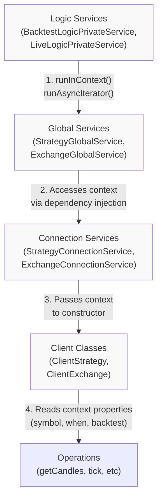
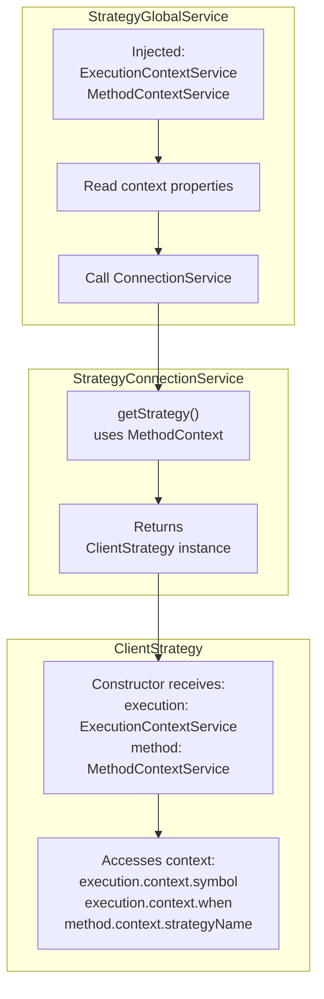
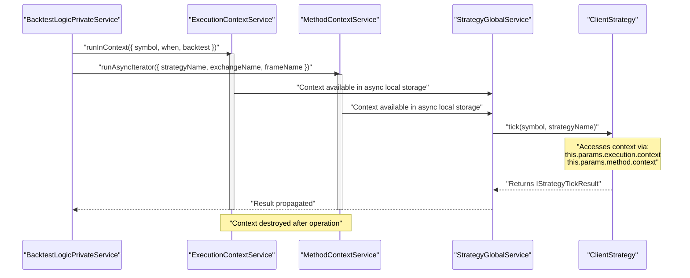
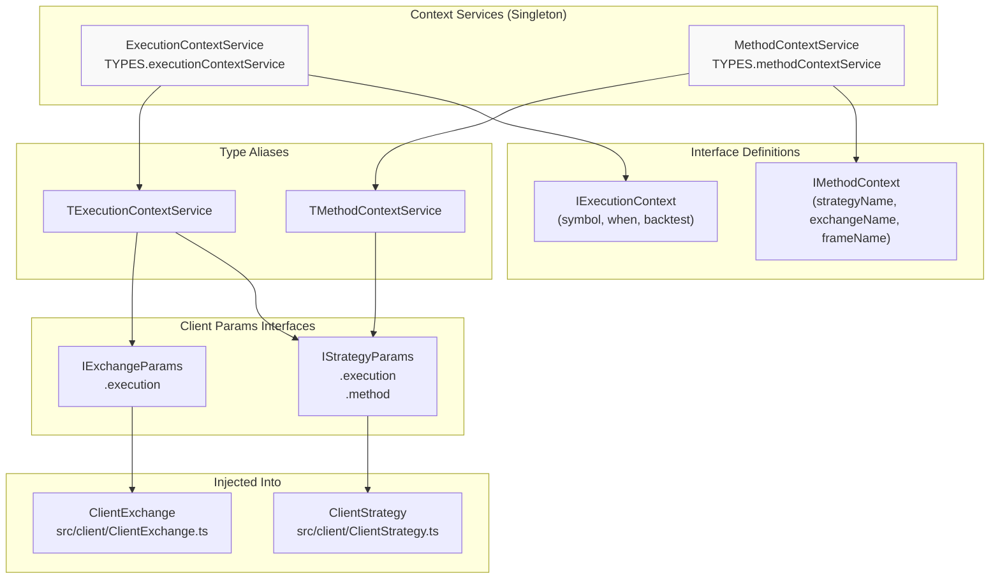
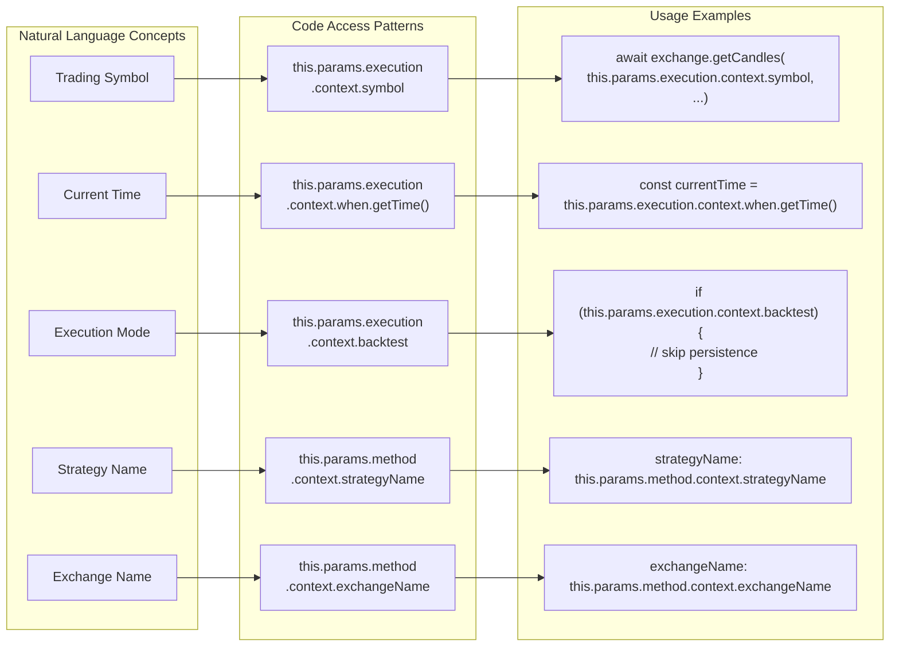

# Context Propagation

This page explains how runtime context (symbol, timestamp, execution mode, component names) is propagated through the system without explicit parameter passing. Context propagation enables operations to access execution parameters implicitly, reducing coupling and simplifying function signatures.

For information about dependency injection of services, see [3.2](#3.2). For information about how Global services orchestrate operations, see [7.5](#7.5).

## Overview

The framework uses two scoped context services to propagate runtime parameters throughout the execution stack:

1. **ExecutionContextService** - Runtime execution parameters (symbol, timestamp, mode)
2. **MethodContextService** - Component routing parameters (schema names)

Both services leverage the `di-scoped` library to provide implicit context access without passing parameters through every function call. Context is established at operation boundaries (Logic services) and consumed by leaf components (Client classes).

**Sources:** [types.d.ts:138-181](), [types.d.ts:401-440]()

## Context Services

### ExecutionContextService

The `ExecutionContextService` provides runtime execution parameters that change on every operation:

| Property | Type | Purpose |
|----------|------|---------|
| `symbol` | `string` | Trading pair symbol (e.g., "BTCUSDT") |
| `when` | `Date` | Current timestamp for the operation |
| `backtest` | `boolean` | True for backtest mode, false for live mode |

```typescript
interface IExecutionContext {
    symbol: string;
    when: Date;
    backtest: boolean;
}
```

This context determines which data to fetch (symbol), what time to query (when), and whether to use persistence (backtest flag).

**Sources:** [types.d.ts:138-150](), [types.d.ts:170-181]()

### MethodContextService

The `MethodContextService` provides component routing parameters that determine which registered schemas to use:

| Property | Type | Purpose |
|----------|------|---------|
| `strategyName` | `StrategyName` | Which strategy schema to execute |
| `exchangeName` | `ExchangeName` | Which exchange schema to use for data |
| `frameName` | `FrameName` | Which frame schema to use (empty for live) |

```typescript
interface IMethodContext {
    exchangeName: ExchangeName;
    strategyName: StrategyName;
    frameName: FrameName;
}
```

This context routes operations to the correct registered components via ConnectionServices.

**Sources:** [types.d.ts:401-413](), [types.d.ts:434-440]()

## Context Scope Mechanism

### di-scoped Integration

Both context services extend the `di-scoped` library's scoped class pattern, providing two key methods:

1. **`runInContext(callback, context)`** - Executes synchronous or async callback with context
2. **`runAsyncIterator(generator, context)`** - Wraps async generator with context

The context is stored in async local storage, making it accessible to all code within the callback/generator without explicit passing.



**Diagram: di-scoped Context Establishment**

**Sources:** [types.d.ts:159-176]()

### Context Registration

The context services are registered in the dependency injection container as singleton services:

```typescript
// Service registration
provide(TYPES.executionContextService, () => new ExecutionContextService());
provide(TYPES.methodContextService, () => new MethodContextService());

// Service injection
inject<TExecutionContextService>(TYPES.executionContextService);
inject<TMethodContextService>(TYPES.methodContextService);
```

**Sources:** [src/lib/core/provide.ts:57-58](), [src/lib/index.ts:62-67](), [src/lib/core/types.ts:6-7]()

## Context Flow Architecture

### Layer-by-Layer Propagation

Context flows through the architecture layers in a cascade pattern:



**Diagram: Context Propagation Through Layers**

**Sources:** [src/client/ClientStrategy.ts:270-286](), [src/client/ClientStrategy.ts:423-426]()

### Establishing Context

Logic services establish context at the beginning of operations:

1. **BacktestLogicPrivateService** - Sets context for each timeframe iteration
2. **LiveLogicPrivateService** - Sets context on each tick with current timestamp
3. **WalkerLogicPrivateService** - Sets context for each strategy iteration

The context wraps the entire operation, ensuring all downstream code has access.

**Example Context Establishment (Conceptual):**

```typescript
// BacktestLogicPrivateService establishes ExecutionContext
ExecutionContextService.runInContext(
  async () => {
    // All code here can access context
    await strategyGlobalService.tick(symbol, strategyName);
  },
  { symbol: "BTCUSDT", when: timeframe, backtest: true }
);

// Also establishes MethodContext
MethodContextService.runAsyncIterator(
  backtestGenerator,
  { strategyName, exchangeName, frameName }
);
```

**Sources:** [types.d.ts:159-168](), [types.d.ts:422-432]()

## Context Injection Points

### Global Services as Wrappers

Global services inject context into operations by accessing the context services via dependency injection and calling operations within the context scope:



**Diagram: Context Injection Through Global Services**

**Sources:** [src/interfaces/Strategy.interface.ts:79-94](), [src/client/ClientStrategy.ts:270](), [src/client/ClientStrategy.ts:423-426]()

### Constructor Parameters

Client classes receive context services through their constructor parameters:

| Client Class | Context Parameters |
|--------------|-------------------|
| `ClientStrategy` | `execution: TExecutionContextService`<br/>`method: TMethodContextService` |
| `ClientExchange` | `execution: TExecutionContextService` |
| `ClientFrame` | (No context - uses parameters directly) |
| `ClientRisk` | (No context - uses parameters directly) |

The `IStrategyParams` interface defines the complete parameter structure:

```typescript
interface IStrategyParams extends IStrategySchema {
  symbol: string;
  partial: IPartial;
  logger: ILogger;
  exchange: IExchange;
  risk: IRisk;
  execution: TExecutionContextService;  // ExecutionContext
  method: TMethodContextService;        // MethodContext
}
```

**Sources:** [src/interfaces/Strategy.interface.ts:79-94](), [types.d.ts:206-214]()

## Context Consumption

### Accessing Context Properties

Client classes access context through the injected services:

**ExecutionContext Access Pattern:**

```typescript
// In ClientStrategy methods
const symbol = this.params.execution.context.symbol;
const when = this.params.execution.context.when;
const backtest = this.params.execution.context.backtest;
const currentTime = this.params.execution.context.when.getTime();
```

**MethodContext Access Pattern:**

```typescript
// In ClientStrategy methods
const strategyName = this.params.method.context.strategyName;
const exchangeName = this.params.method.context.exchangeName;
const frameName = this.params.method.context.frameName;
```

**Sources:** [src/client/ClientStrategy.ts:270](), [src/client/ClientStrategy.ts:286-287](), [src/client/ClientStrategy.ts:292-293](), [src/client/ClientStrategy.ts:334-335]()

### Context Usage Examples

The following table shows common context usage patterns in ClientStrategy:

| Operation | Context Property | Usage |
|-----------|------------------|-------|
| Signal generation throttling | `execution.context.when.getTime()` | Check elapsed time since last signal |
| VWAP calculation | `execution.context.symbol` | Fetch candles for the correct symbol |
| Risk validation | `execution.context.symbol`<br/>`method.context.strategyName`<br/>`method.context.exchangeName` | Route risk check to correct risk instance |
| Persistence | `execution.context.backtest`<br/>`execution.context.symbol`<br/>`method.context.strategyName` | Skip persistence in backtest mode, use symbol+strategy for file path |
| Signal metadata | `method.context.exchangeName`<br/>`method.context.strategyName` | Populate signal row fields |
| Callbacks | `execution.context.symbol`<br/>`execution.context.backtest` | Pass context to user callbacks |

**Sources:** [src/client/ClientStrategy.ts:270-284](), [src/client/ClientStrategy.ts:285-309](), [src/client/ClientStrategy.ts:332-337](), [src/client/ClientStrategy.ts:423-426]()

## Context Lifecycle

### Context Boundaries

Context is established and torn down at specific architectural boundaries:



**Diagram: Context Lifecycle in Single Operation**

**Sources:** [types.d.ts:159-168](), [types.d.ts:422-432]()

### Multiple Context Scopes

The framework supports nested context scopes:

1. **Outer Scope (MethodContext)** - Set once per operation mode (backtest/live/walker)
   - Remains constant throughout the entire execution
   - Determines which strategy/exchange/frame schemas to use

2. **Inner Scope (ExecutionContext)** - Set for each operation (tick, backtest)
   - Changes with each timeframe iteration or live tick
   - Updates `when` timestamp and potentially `symbol`

This nesting allows logic services to maintain stable routing while updating temporal parameters.

**Sources:** [types.d.ts:422-432]()

## Code Entity Mapping

### Context Service to Code Entities



**Diagram: Context Service Code Entity Relationships**

**Sources:** [types.d.ts:138-181](), [types.d.ts:401-440](), [src/interfaces/Strategy.interface.ts:79-94](), [types.d.ts:206-214]()

### Context Access Points in ClientStrategy

The following diagram maps natural language concepts to actual code access patterns in `ClientStrategy`:



**Diagram: Context Access in ClientStrategy (Natural Language to Code)**

**Sources:** [src/client/ClientStrategy.ts:270](), [src/client/ClientStrategy.ts:285-287](), [src/client/ClientStrategy.ts:292-293](), [src/client/ClientStrategy.ts:332-337](), [src/client/ClientStrategy.ts:411-442]()

## Benefits and Tradeoffs

### Benefits of Context Propagation

1. **Reduced Parameter Passing** - Operations don't need to pass symbol/timestamp through every function call
2. **Simplified Function Signatures** - Client methods like `tick()` take minimal parameters
3. **Centralized Context Management** - Logic services control when and how context is established
4. **Type Safety** - TypeScript interfaces ensure correct context structure
5. **Testability** - Context can be mocked by wrapping test code in `runInContext()`

### Tradeoffs

1. **Implicit Dependencies** - Code depends on context being established by caller
2. **Debugging Complexity** - Context access failures may be unclear without understanding scoping
3. **Library Dependency** - Requires `di-scoped` for async local storage implementation

**Sources:** [types.d.ts:138-181](), [types.d.ts:401-440]()