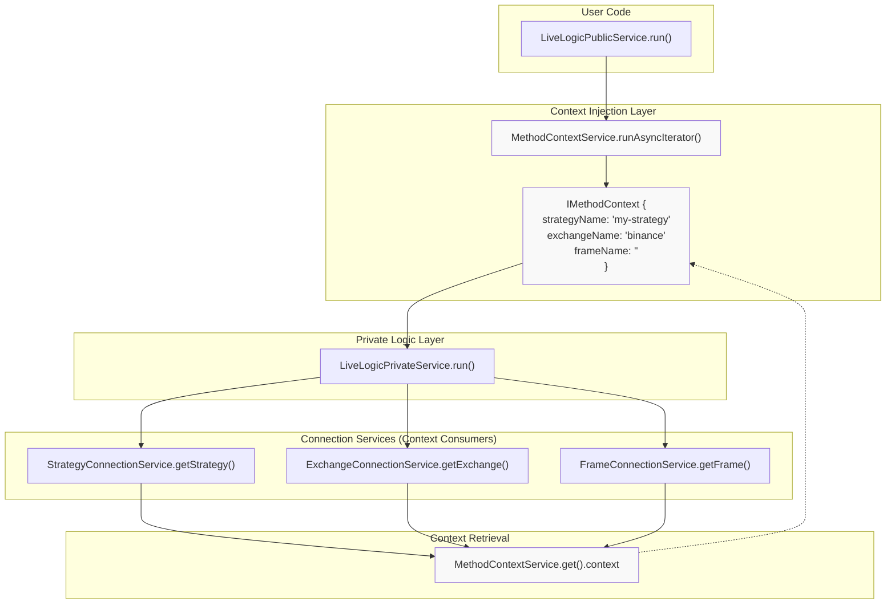
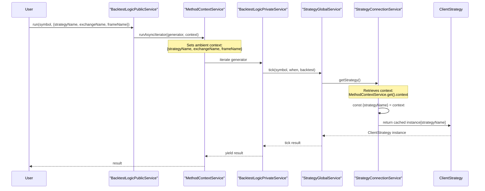
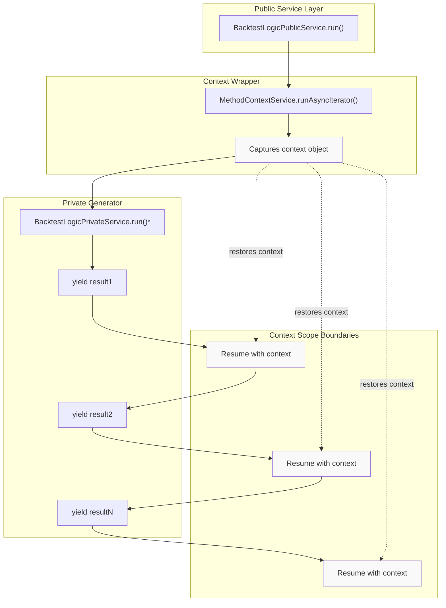
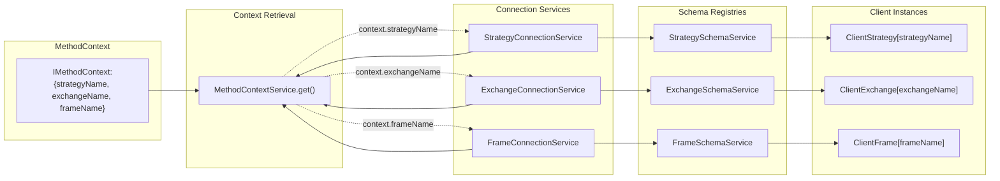
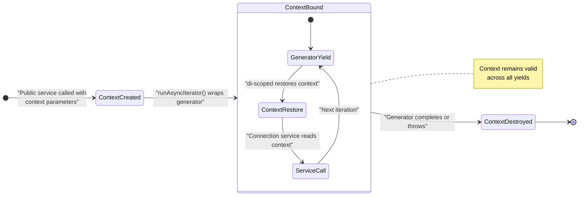
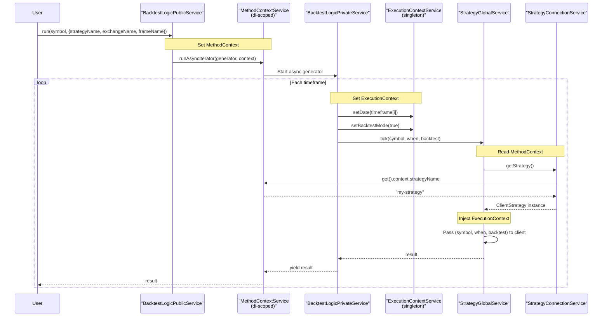

# Context Propagation

<details>
<summary>Relevant source files</summary>

The following files were used as context for generating this wiki page:

- [assets/uml.svg](assets/uml.svg)
- [docs/internals.md](docs/internals.md)
- [docs/uml.puml](docs/uml.puml)
- [scripts/_convert-md-mermaid-to-svg.cjs](scripts/_convert-md-mermaid-to-svg.cjs)
- [scripts/gpt-docs.mjs](scripts/gpt-docs.mjs)
- [scripts/uml.mjs](scripts/uml.mjs)
- [src/index.ts](src/index.ts)
- [src/lib/services/logic/private/BacktestLogicPrivateService.ts](src/lib/services/logic/private/BacktestLogicPrivateService.ts)
- [src/lib/services/logic/private/LiveLogicPrivateService.ts](src/lib/services/logic/private/LiveLogicPrivateService.ts)
- [src/lib/services/logic/public/BacktestLogicPublicService.ts](src/lib/services/logic/public/BacktestLogicPublicService.ts)
- [src/lib/services/logic/public/LiveLogicPublicService.ts](src/lib/services/logic/public/LiveLogicPublicService.ts)
- [test/e2e/timing.test.mjs](test/e2e/timing.test.mjs)
- [test/index.mjs](test/index.mjs)
- [types.d.ts](types.d.ts)

</details>


## Purpose and Scope

Context propagation in backtest-kit enables implicit passing of runtime parameters through the service call stack without explicit function arguments. The system uses two context types: **MethodContext** for schema routing (which strategy/exchange/frame to use) and **ExecutionContext** for runtime state (backtest mode, current date). This eliminates manual parameter threading across dozens of function calls while maintaining type safety.

For dependency injection mechanics, see [Dependency Injection System](#2.2). For how services use context to route to specific implementations, see [Connection Services](#5.1).

---

## Context Types Overview

The framework maintains two distinct context scopes that serve different purposes in the execution pipeline:

| Context Type | Scope | Purpose | Key Properties |
|-------------|-------|---------|----------------|
| **MethodContext** | Per-operation | Routes to correct schema instances | `strategyName`, `exchangeName`, `frameName` |
| **ExecutionContext** | Per-tick | Provides runtime execution state | `date`, `backtestMode`, `symbol` |

**Sources:** [src/lib/services/context/MethodContextService.ts:12-19](), [src/lib/index.ts:8-13]()

---

## MethodContextService: Schema Routing

### Architecture

`MethodContextService` uses the `di-scoped` library to create ambient context that flows through async operations without explicit parameters. The service contains an `IMethodContext` object with three schema names that determine which registered implementations to use.



**Diagram: MethodContextService propagates schema names through async generator execution**

**Sources:** [src/lib/services/context/MethodContextService.ts:1-56](), [src/lib/services/logic/public/LiveLogicPublicService.ts:66-73]()

---

### IMethodContext Interface

The `IMethodContext` interface defines the schema routing parameters:

```typescript
interface IMethodContext {
  exchangeName: ExchangeName;  // Which exchange schema to use
  strategyName: StrategyName;  // Which strategy schema to use
  frameName: FrameName;        // Which frame schema to use (empty for live)
}
```

Each property corresponds to a schema registered via `addStrategy()`, `addExchange()`, or `addFrame()`. Connection services retrieve this context to determine which cached client instance to return.

**Sources:** [src/lib/services/context/MethodContextService.ts:12-19]()

---

### Context Propagation Flow

The following sequence shows how context flows from public API to connection services:



**Diagram: Context propagation through service layers using di-scoped ambient context**

**Sources:** [src/lib/services/logic/public/BacktestLogicPublicService.ts:46-66](), [src/lib/services/logic/public/LiveLogicPublicService.ts:55-74]()

---

## ExecutionContextService: Runtime State

### Purpose

`ExecutionContextService` provides execution-specific state such as the current timestamp (for backtest simulation or live trading) and the execution mode (backtest vs. live). Unlike `MethodContext`, which remains constant for an entire run, `ExecutionContext` can change per tick.

### Context Properties

| Property | Type | Purpose | Set By |
|----------|------|---------|--------|
| `date` | `Date` | Current execution timestamp | `BacktestLogicPrivateService` or `LiveLogicPrivateService` |
| `backtestMode` | `boolean` | Whether running in backtest mode | Logic services |
| `symbol` | `string` | Current trading pair | Logic services |

**Sources:** [src/lib/index.ts:8-10](), [src/lib/core/types.ts:5-8]()

---

### Usage in Logic Services

The private logic services set execution context before each tick operation:

**Backtest Mode:**
```typescript
// BacktestLogicPrivateService iterates through historical timeframes
const when = timeframes[i];  // Historical timestamp
const result = await this.strategyGlobalService.tick(symbol, when, true);
```

**Live Mode:**
```typescript
// LiveLogicPrivateService uses real-time dates
const when = new Date();  // Current timestamp
const result = await this.strategyGlobalService.tick(symbol, when, false);
```

Global services inject this context into client instances, allowing functions like `getCandles()` to fetch data for the correct timestamp without receiving explicit date parameters.

**Sources:** [src/lib/services/logic/private/BacktestLogicPrivateService.ts:57-61](), [src/lib/services/logic/private/LiveLogicPrivateService.ts:58-61]()

---

## Context Propagation in Async Generators

### Challenge

JavaScript async generators introduce complexity for context propagation because each `yield` pauses execution and resumes later. Standard dependency injection would lose context across these boundaries.

### Solution: runAsyncIterator

The `MethodContextService.runAsyncIterator()` method wraps async generators to maintain context across yields:



**Diagram: runAsyncIterator maintains context across async generator yields**

**Sources:** [src/lib/services/logic/public/BacktestLogicPublicService.ts:58-65](), [src/lib/services/logic/public/LiveLogicPublicService.ts:66-73]()

---

### Implementation Pattern

Both public logic services follow the same pattern:

```typescript
public run = (symbol: string, context: { strategyName, exchangeName, frameName }) => {
  return MethodContextService.runAsyncIterator(
    this.privateLogicService.run(symbol),  // Async generator
    {
      exchangeName: context.exchangeName,
      strategyName: context.strategyName,
      frameName: context.frameName,
    }
  );
};
```

The `runAsyncIterator` method:
1. Captures the provided context object
2. Wraps the async generator
3. Re-injects context on each iteration
4. Returns a new async generator with transparent context propagation

**Sources:** [src/lib/services/logic/public/BacktestLogicPublicService.ts:46-66](), [src/lib/services/logic/public/LiveLogicPublicService.ts:55-74]()

---

## Service Context Consumption

### Connection Services Pattern

Connection services are the primary consumers of `MethodContext`. They use the context to determine which cached client instance to return:



**Diagram: Connection services consume MethodContext to route to correct client instances**

**Sources:** [src/lib/services/context/MethodContextService.ts:41-45](), [src/lib/index.ts:42-52]()

---

### Context-Free Client Layer

A key architectural principle: **client classes never access context services**. This keeps business logic pure and testable:

| Layer | Context Access | Reason |
|-------|---------------|---------|
| **Public Logic Services** | Sets context via `runAsyncIterator()` | Provides user-facing API with explicit parameters |
| **Private Logic Services** | No context access | Pure orchestration logic |
| **Global Services** | Injects `ExecutionContext` | Bridges context to clients |
| **Connection Services** | Reads `MethodContext` | Routes to correct schema |
| **Client Classes** | **No context access** | Pure business logic, fully testable |

This separation enables unit testing clients without mocking the DI system.

**Sources:** [src/lib/services/logic/public/BacktestLogicPublicService.ts:1-70](), [src/lib/services/logic/public/LiveLogicPublicService.ts:1-78]()

---

## Implementation Details

### di-scoped Library

The framework uses the `di-scoped` library for ambient context management. The `scoped()` function creates context-aware service classes:

```typescript
export const MethodContextService = scoped(
  class {
    constructor(readonly context: IMethodContext) {}
  }
);
```

Key features:
- **Static methods**: `MethodContextService.run()`, `MethodContextService.runAsyncIterator()`
- **Instance retrieval**: `MethodContextService.get()` returns current instance
- **Type safety**: `TMethodContextService` type helper for injection

**Sources:** [src/lib/services/context/MethodContextService.ts:41-53]()

---

### Context Lifecycle



**Diagram: Context lifecycle from creation through generator completion**

**Sources:** [src/lib/services/context/MethodContextService.ts:41-45](), [src/lib/services/logic/public/LiveLogicPublicService.ts:66-73]()

---

## Service Registration and Context

The DI system registers context services as singletons but their scoped instances vary per operation:

| Service | Registration Type | Instance Scope | Purpose |
|---------|------------------|----------------|---------|
| `ExecutionContextService` | Singleton | Global | Stores current execution state |
| `MethodContextService` | Scoped constructor | Per-operation | Provides schema routing |

**Sources:** [src/lib/core/provide.ts:28-31](), [src/lib/core/types.ts:5-8](), [src/lib/index.ts:33-40]()

---

## Context in Logic Flow

The complete flow showing both context types in action:



**Diagram: Interaction between MethodContext and ExecutionContext during execution**

**Sources:** [src/lib/services/logic/public/BacktestLogicPublicService.ts:46-66](), [src/lib/services/logic/private/BacktestLogicPrivateService.ts:48-119]()

---

## Benefits and Trade-offs

### Benefits

1. **Reduced Parameter Pollution**: Functions don't need 3-5 extra parameters threaded through every call
2. **Type Safety**: `MethodContextService.get()` returns typed context with IDE autocomplete
3. **Async-Safe**: Works correctly with async generators and Promises
4. **Testability**: Client layer remains pure without DI dependencies
5. **Flexibility**: Context can be changed per-operation without modifying signatures

### Trade-offs

1. **Implicit Dependencies**: Context access is not visible in function signatures
2. **Debugging Complexity**: Stack traces don't show context propagation
3. **Learning Curve**: Developers must understand ambient context patterns
4. **Runtime Dependency**: Requires `di-scoped` library for scoped context

**Sources:** [src/lib/services/context/MethodContextService.ts:24-38]()

---

## Related Patterns

For information about:
- Service instantiation and caching: See [Connection Services](#5.1)
- Schema registration: See [Schema Services](#5.2)
- DI container configuration: See [Dependency Injection System](#2.2)
- How global services inject context into clients: See [Global Services](#5.3)