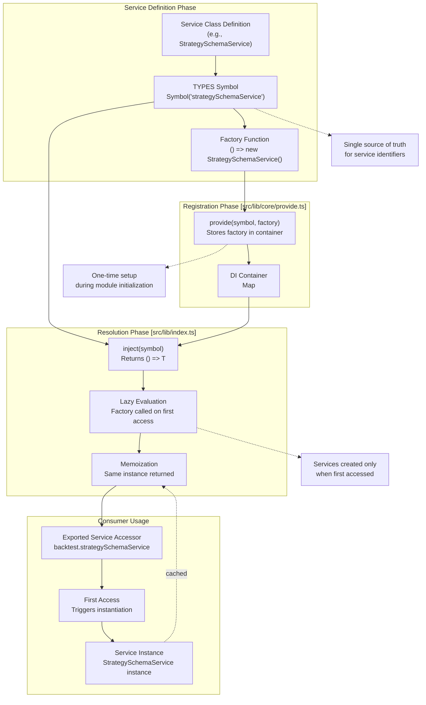
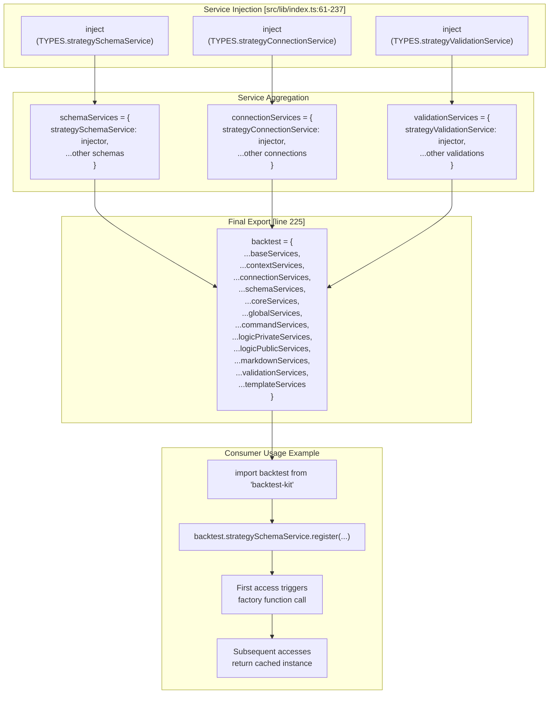
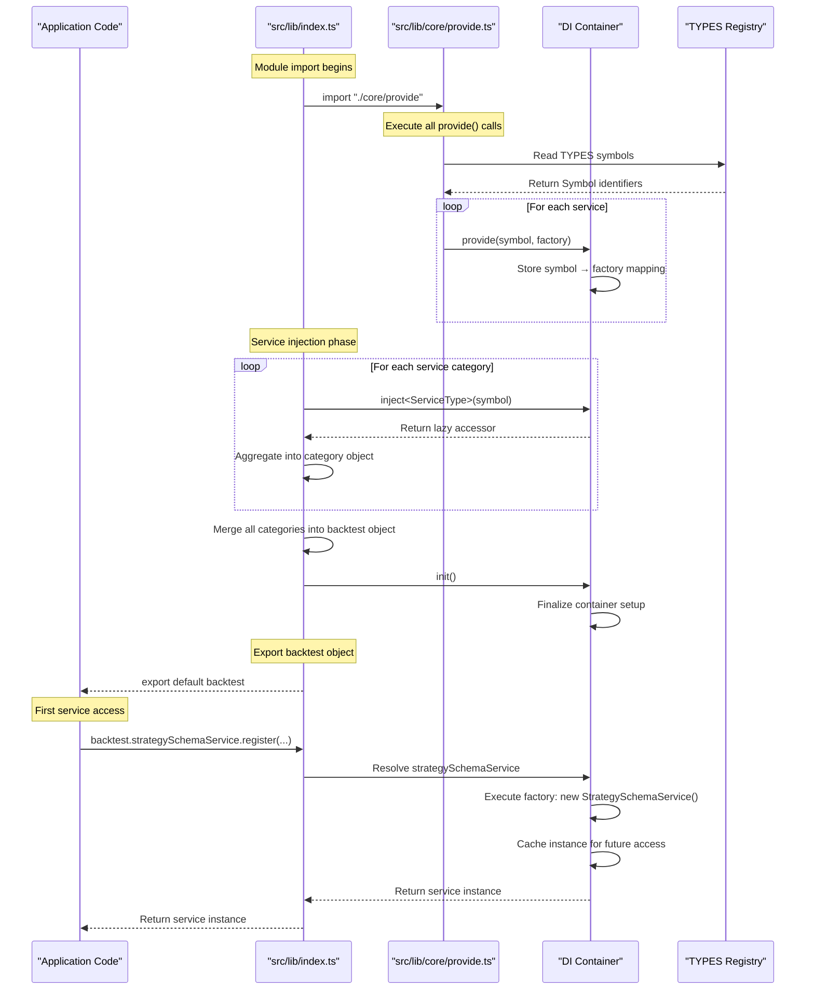
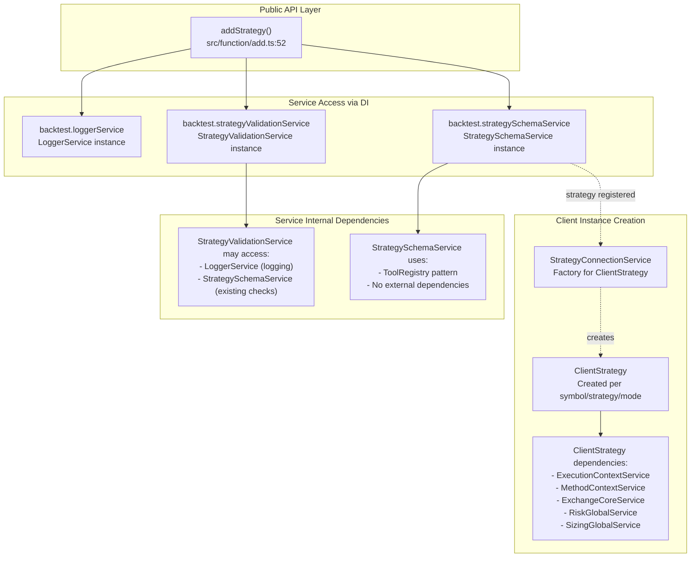

# Dependency Injection System

<details>
<summary>Relevant source files</summary>

The following files were used as context for generating this wiki page:

- [src/function/add.ts](src/function/add.ts)
- [src/lib/core/provide.ts](src/lib/core/provide.ts)
- [src/lib/core/types.ts](src/lib/core/types.ts)
- [src/lib/index.ts](src/lib/index.ts)

</details>


This document describes the dependency injection (DI) system used throughout backtest-kit to manage service instantiation and dependencies. The DI system provides a centralized mechanism for service registration, lazy initialization, and singleton management across 50+ services organized into distinct categories.

For information about how services use context propagation, see [Context Propagation](#3.3). For details on the service layer architecture and responsibilities, see [Layer Responsibilities](#3.1).

---

## Purpose and Architecture

The DI system in backtest-kit uses a Symbol-based registry pattern with factory functions to manage service lifecycle. The core mechanism consists of three components:

1. **TYPES symbols** - Unique identifiers for each service type
2. **provide()** - Registers factory functions for service instantiation
3. **inject()** - Resolves and memoizes service instances

This approach enables loose coupling between services, simplifies testing through mockability, and ensures singleton behavior for stateful services like schema registries and connection managers.

### DI Flow Architecture



**Sources**: [src/lib/core/types.ts:1-105](), [src/lib/core/provide.ts:1-143](), [src/lib/index.ts:1-246]()

---

## TYPES Symbol Registry

The `TYPES` object contains Symbol-based identifiers for all services in the system. Symbols provide globally unique, collision-free identifiers that cannot be accidentally overridden.

### TYPES Structure

```mermaid
graph LR
    subgraph "src/lib/core/types.ts"
        TYPES["TYPES Object<br/>Aggregates all symbols"]
        
        subgraph "Base Services"
            BS1["Symbol('loggerService')"]
        end
        
        subgraph "Context Services"
            CS1["Symbol('executionContextService')"]
            CS2["Symbol('methodContextService')"]
        end
        
        subgraph "Connection Services"
            CON1["Symbol('exchangeConnectionService')"]
            CON2["Symbol('strategyConnectionService')"]
            CON3["Symbol('frameConnectionService')"]
            CON4["Symbol('sizingConnectionService')"]
            CON5["Symbol('riskConnectionService')"]
            CON6["Symbol('optimizerConnectionService')"]
            CON7["Symbol('partialConnectionService')"]
        end
        
        subgraph "Schema Services"
            SCH1["Symbol('exchangeSchemaService')"]
            SCH2["Symbol('strategySchemaService')"]
            SCH3["Symbol('frameSchemaService')"]
            SCH4["Symbol('walkerSchemaService')"]
            SCH5["Symbol('sizingSchemaService')"]
            SCH6["Symbol('riskSchemaService')"]
            SCH7["Symbol('optimizerSchemaService')"]
        end
        
        subgraph "Core Services"
            COR1["Symbol('exchangeCoreService')"]
            COR2["Symbol('strategyCoreService')"]
            COR3["Symbol('frameCoreService')"]
        end
        
        TYPES --> BS1
        TYPES --> CS1
        TYPES --> CS2
        TYPES --> CON1
        TYPES --> CON2
        TYPES --> CON3
        TYPES --> CON4
        TYPES --> CON5
        TYPES --> CON6
        TYPES --> CON7
        TYPES --> SCH1
        TYPES --> SCH2
        TYPES --> SCH3
        TYPES --> SCH4
        TYPES --> SCH5
        TYPES --> SCH6
        TYPES --> SCH7
        TYPES --> COR1
        TYPES --> COR2
        TYPES --> COR3
    end
```



The TYPES registry is divided into logical categories matching the service layer architecture. Each symbol is created using JavaScript's `Symbol()` constructor with a descriptive string identifier for debugging purposes.

**Sources**: [src/lib/core/types.ts:1-105]()

---

## Service Registration with provide()

Service registration occurs in [src/lib/core/provide.ts:1-143]() during module initialization. Each service class is registered with a factory function that instantiates it.

### Registration Pattern

The registration follows a consistent pattern across all service categories:

```typescript
// Schema Services Registration (lines 75-83)
provide(TYPES.exchangeSchemaService, () => new ExchangeSchemaService());
provide(TYPES.strategySchemaService, () => new StrategySchemaService());
provide(TYPES.frameSchemaService, () => new FrameSchemaService());
provide(TYPES.walkerSchemaService, () => new WalkerSchemaService());
provide(TYPES.sizingSchemaService, () => new SizingSchemaService());
provide(TYPES.riskSchemaService, () => new RiskSchemaService());
provide(TYPES.optimizerSchemaService, () => new OptimizerSchemaService());
```

### Service Registration Table

| Service Category | Registration Lines | Number of Services | Purpose |
|-----------------|-------------------|-------------------|---------|
| Base Services | [56-58]() | 1 | Logging infrastructure |
| Context Services | [60-63]() | 2 | Execution and method context propagation |
| Connection Services | [65-73]() | 7 | Client instance factory and caching |
| Schema Services | [75-83]() | 7 | Configuration storage and retrieval |
| Core Services | [85-89]() | 3 | Domain logic for strategies, exchanges, frames |
| Global Services | [91-96]() | 4 | Entry point facades for subsystems |
| Command Services | [98-102]() | 3 | Workflow orchestration for execution modes |
| Logic Private Services | [104-108]() | 3 | Internal algorithms for backtest, live, walker |
| Logic Public Services | [110-114]() | 3 | Public API wrappers for logic services |
| Markdown Services | [116-126]() | 9 | Report generation for various aspects |
| Validation Services | [128-138]() | 9 | Registration-time validation |
| Template Services | [140-142]() | 1 | Code generation for optimizer |

**Sources**: [src/lib/core/provide.ts:1-143]()

---

## Service Resolution with inject()

Service resolution uses the `inject<T>()` function to create lazy, memoized accessors for service instances. The accessor pattern ensures services are instantiated only when first accessed and reused thereafter.

### Injection and Export Pattern



### Service Access Example

The following demonstrates how a public API function accesses services through the DI container:

```typescript
// From src/function/add.ts:52-64
export function addStrategy(strategySchema: IStrategySchema) {
  backtest.loggerService.info(ADD_STRATEGY_METHOD_NAME, {
    strategySchema,
  });
  backtest.strategyValidationService.addStrategy(
    strategySchema.strategyName,
    strategySchema
  );
  backtest.strategySchemaService.register(
    strategySchema.strategyName,
    strategySchema
  );
}
```

In this example:
1. `backtest.loggerService` - First access triggers `LoggerService` instantiation
2. `backtest.strategyValidationService` - Lazy instantiation of validation service
3. `backtest.strategySchemaService` - Lazy instantiation of schema service
4. All subsequent accesses return the same singleton instances

**Sources**: [src/lib/index.ts:61-246](), [src/function/add.ts:52-64]()

---

## Service Categories and Organization

Services are organized into 12 distinct categories, each serving a specific architectural layer. The following table provides a comprehensive mapping of all 50+ services:

| Category | Services | Files | Responsibility |
|----------|----------|-------|----------------|
| **Base** | `LoggerService` | [src/lib/services/base/LoggerService.ts]() | Centralized logging with configurable logger injection |
| **Context** | `ExecutionContextService`<br/>`MethodContextService` | [src/lib/services/context/]() | AsyncLocalStorage-based context propagation for temporal isolation |
| **Schema** | `ExchangeSchemaService`<br/>`StrategySchemaService`<br/>`FrameSchemaService`<br/>`WalkerSchemaService`<br/>`SizingSchemaService`<br/>`RiskSchemaService`<br/>`OptimizerSchemaService` | [src/lib/services/schema/]() | ToolRegistry-based storage for registered configurations |
| **Validation** | `ExchangeValidationService`<br/>`StrategyValidationService`<br/>`FrameValidationService`<br/>`WalkerValidationService`<br/>`SizingValidationService`<br/>`RiskValidationService`<br/>`OptimizerValidationService`<br/>`ConfigValidationService`<br/>`ColumnValidationService` | [src/lib/services/validation/]() | Registration-time validation with memoized results |
| **Connection** | `ExchangeConnectionService`<br/>`StrategyConnectionService`<br/>`FrameConnectionService`<br/>`SizingConnectionService`<br/>`RiskConnectionService`<br/>`OptimizerConnectionService`<br/>`PartialConnectionService` | [src/lib/services/connection/]() | Factory pattern with memoization for client instances |
| **Core** | `ExchangeCoreService`<br/>`StrategyCoreService`<br/>`FrameCoreService` | [src/lib/services/core/]() | Domain logic for fundamental operations |
| **Global** | `SizingGlobalService`<br/>`RiskGlobalService`<br/>`OptimizerGlobalService`<br/>`PartialGlobalService` | [src/lib/services/global/]() | Entry point facades with logging and delegation |
| **Command** | `LiveCommandService`<br/>`BacktestCommandService`<br/>`WalkerCommandService` | [src/lib/services/command/]() | Workflow orchestration for execution modes |
| **Logic Private** | `BacktestLogicPrivateService`<br/>`LiveLogicPrivateService`<br/>`WalkerLogicPrivateService` | [src/lib/services/logic/private/]() | Internal algorithms not exposed externally |
| **Logic Public** | `BacktestLogicPublicService`<br/>`LiveLogicPublicService`<br/>`WalkerLogicPublicService` | [src/lib/services/logic/public/]() | Controlled wrappers with additional validation |
| **Markdown** | `BacktestMarkdownService`<br/>`LiveMarkdownService`<br/>`ScheduleMarkdownService`<br/>`PerformanceMarkdownService`<br/>`WalkerMarkdownService`<br/>`HeatMarkdownService`<br/>`PartialMarkdownService`<br/>`OutlineMarkdownService`<br/>`RiskMarkdownService` | [src/lib/services/markdown/]() | Event-driven report generation with bounded queues |
| **Template** | `OptimizerTemplateService` | [src/lib/services/template/]() | Code generation for LLM-based strategy optimization |

**Sources**: [src/lib/index.ts:61-237](), [src/lib/core/types.ts:1-105]()

---

## Initialization Flow

The DI system initialization occurs in [src/lib/index.ts:240]() via the `init()` function call. This initializes the DI container and prepares it for lazy service instantiation.

### Module Initialization Sequence



**Key Points**:

1. **Registration Phase** - All `provide()` calls execute during [src/lib/core/provide.ts]() module initialization
2. **Injection Phase** - All `inject()` calls in [src/lib/index.ts:61-223]() create lazy accessors but do not instantiate services
3. **Initialization Call** - [src/lib/index.ts:240]() finalizes the container
4. **Lazy Instantiation** - Services are created only when first accessed by application code
5. **Singleton Behavior** - Once created, the same instance is returned for all subsequent accesses

**Sources**: [src/lib/index.ts:1-246](), [src/lib/core/provide.ts:1-143]()

---

## Service Dependency Graph

Services depend on each other through constructor injection or method calls. The DI system manages these dependencies transparently through lazy evaluation.

### Typical Dependency Chain Example



### Cross-Service Dependencies

Connection services demonstrate the most complex dependency patterns, as they create client instances that depend on multiple other services:

| Client Type | Created By | Key Dependencies |
|-------------|-----------|------------------|
| `ClientStrategy` | `StrategyConnectionService` | `ExecutionContextService`, `MethodContextService`, `ExchangeCoreService`, `RiskGlobalService`, `SizingGlobalService`, `PartialGlobalService` |
| `ClientExchange` | `ExchangeConnectionService` | `ExecutionContextService`, `MethodContextService`, `ExchangeSchemaService` |
| `ClientRisk` | `RiskConnectionService` | `ExecutionContextService`, `MethodContextService`, `RiskSchemaService`, `PersistRiskAdapter` |
| `ClientSizing` | `SizingConnectionService` | `ExecutionContextService`, `MethodContextService`, `SizingSchemaService` |
| `ClientFrame` | `FrameConnectionService` | `MethodContextService`, `FrameSchemaService`, `FrameCoreService` |
| `ClientPartial` | `PartialConnectionService` | `ExecutionContextService`, `MethodContextService`, `PersistPartialAdapter` |

**Sources**: [src/function/add.ts:52-64](), [src/lib/services/connection/]()

---

## Memoization Strategy

The DI system implements memoization at two levels:

### Container-Level Memoization

The `inject()` function returns a lazy accessor that, when called, executes the factory function once and caches the result. This ensures singleton behavior for all services:

```typescript
// Conceptual implementation (actual code in src/lib/core/di.ts)
function inject<T>(symbol: Symbol): () => T {
  let cached: T | undefined;
  return () => {
    if (cached === undefined) {
      const factory = container.get(symbol);
      cached = factory();
    }
    return cached;
  };
}
```

### Connection-Level Memoization

Connection services use the `memoize()` utility from `functools-kit` to cache client instances with composite keys:

```typescript
// Example from StrategyConnectionService
private _memoized = memoize(
  (symbol: string, strategyName: string, backtest: boolean) => {
    // Complex client instantiation logic
    return new ClientStrategy(...);
  }
);

getClient(symbol: string, strategyName: string, backtest: boolean) {
  return this._memoized(symbol, strategyName, backtest);
}
```

This pattern ensures:
- Same `ClientStrategy` instance for `symbol="BTC/USDT", strategyName="my-strategy", backtest=true`
- Different instance for `symbol="BTC/USDT", strategyName="my-strategy", backtest=false` (live mode)
- Different instance for `symbol="ETH/USDT", strategyName="my-strategy", backtest=true` (different symbol)

**Sources**: [src/lib/services/connection/]()

---

## Benefits and Design Rationale

The DI system provides several key benefits for the backtest-kit architecture:

### Testability

Services can be mocked or stubbed during testing by replacing the factory function:

```typescript
// Test setup example
provide(TYPES.exchangeSchemaService, () => createMockExchangeSchema());
```

### Lazy Initialization

Services are created only when first accessed, reducing startup time and memory usage. This is particularly important for:
- **Markdown services** that subscribe to event emitters (only instantiated if reports are needed)
- **Connection services** that create client instances (only instantiated per active symbol/strategy)
- **Core services** with complex initialization logic

### Singleton Management

The DI system guarantees singleton behavior for stateful services without requiring manual singleton implementation:
- **Schema services** maintain single registries of configurations
- **Context services** use AsyncLocalStorage that must be shared across the application
- **Global services** coordinate cross-cutting concerns

### Separation of Concerns

The DI system enforces clear boundaries between service layers:
- **Public API functions** access services through the DI container, not direct imports
- **Services** declare dependencies through the inject pattern, not constructor parameters
- **Client classes** receive services via connection service factories

### Extensibility

New services can be added by:
1. Adding a Symbol to [src/lib/core/types.ts]()
2. Adding a `provide()` call to [src/lib/core/provide.ts]()
3. Adding an `inject()` call to [src/lib/index.ts]()
4. Exporting the service accessor in the appropriate category object

No existing code requires modification when adding new services.

**Sources**: [src/lib/index.ts:1-246](), [src/lib/core/types.ts:1-105](), [src/lib/core/provide.ts:1-143]()