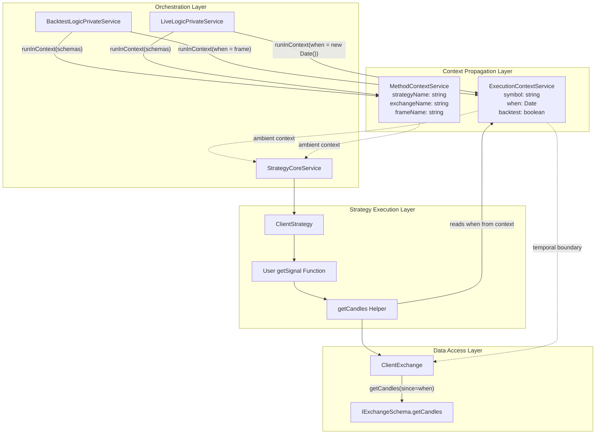
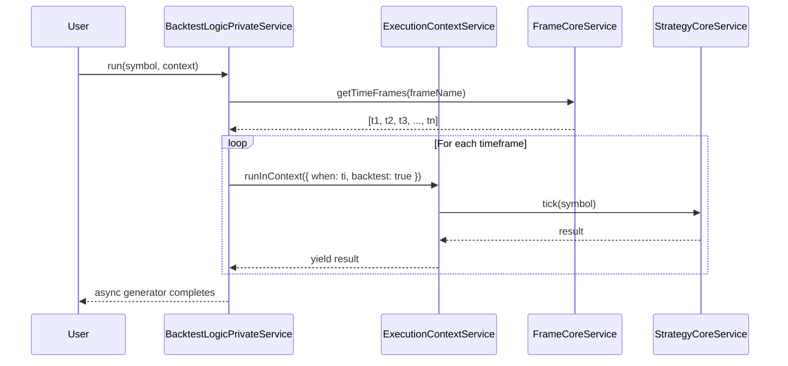
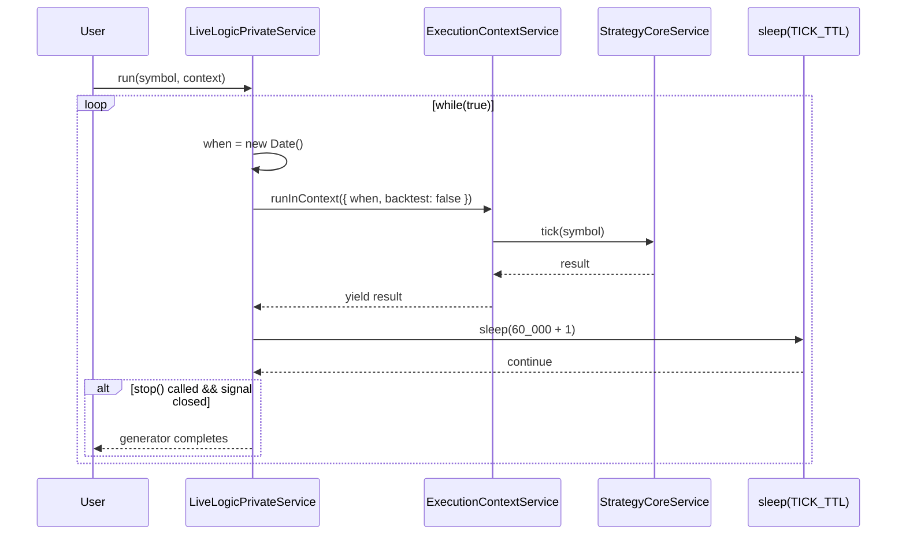
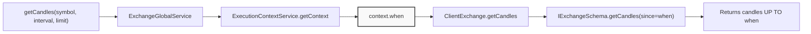
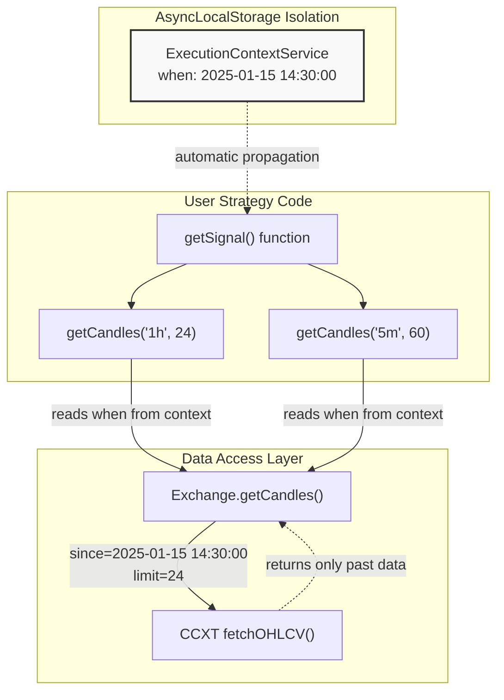
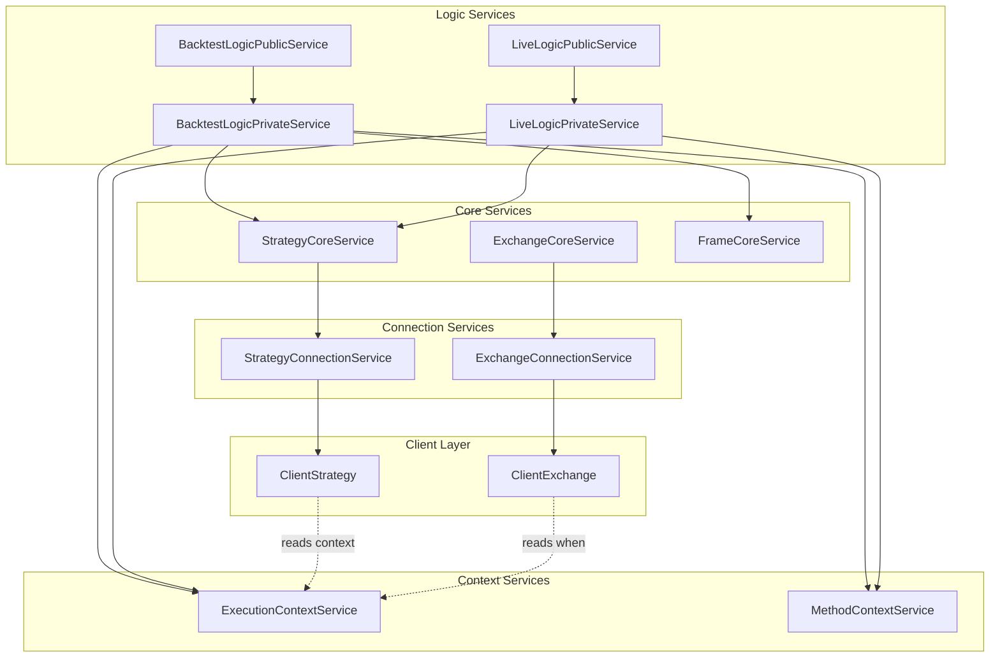

# Time Execution Engine

## Purpose and Scope

This document explains the Time Execution Engine, the core architectural pattern that powers Backtest Kit. The Time Execution Engine treats market data processing as an **async stream of time**, where strategies are evaluated step-by-step with strict temporal context. This architecture makes look-ahead bias architecturally impossible by controlling what data is visible at each point in time.

For details about how strategies generate signals within this time stream, see [Strategies](./08_core-concepts.md). For information about execution modes (Backtest, Live, Walker), see [Execution Modes](./20_execution-modes.md).

---

## Core Concept: Time as Ambient Context

The Time Execution Engine operates on a fundamental principle: **time is propagated as ambient context throughout the entire call stack**. When your strategy's `getSignal()` function executes, it doesn't receive the current timestamp as a parameter. Instead, the timestamp exists as ambient context that all data access functions automatically respect.

This is implemented using Node.js `AsyncLocalStorage` via the `di-scoped` library, which provides two context services:

| Context Service | Stores | Lifecycle | Purpose |
|-----------------|--------|-----------|---------|
| `ExecutionContextService` | `symbol`, `when`, `backtest` | Per tick | Controls temporal data visibility |
| `MethodContextService` | `strategyName`, `exchangeName`, `frameName` | Per execution | Routes to correct schema configuration |

The `when` field in `ExecutionContextService` is the key to the entire time execution model. Every data access operation reads this value to determine "what time is it right now?" and returns only data up to that point.

**Sources:** [README.md:185-198](), [docs/internals.md:42-52]()

---

## Execution Context Architecture



**Execution Context Flow**

The diagram shows how temporal context flows from orchestration through strategy execution to data access. The dashed lines represent ambient context propagation via `AsyncLocalStorage`, while solid lines represent direct function calls.

**Sources:** [docs/internals.md:54-81](), High-level architecture diagrams (Diagram 1, 3, 4)

---

## Time Iteration Patterns

### Backtest Mode: Discrete Time Steps

In backtest mode, time moves forward in discrete steps defined by the frame interval. The `BacktestLogicPrivateService` generates a sequence of timestamps and processes each one sequentially:



**Backtest Time Flow**

The backtest engine iterates through pre-generated timeframes, setting the execution context for each tick. Strategies see a deterministic progression of time.

**Key implementation characteristics:**

- Time is **deterministic** - always processes the same timestamps in the same order
- Time moves at **frame interval** - typically 1 minute, 5 minutes, etc.
- Strategies can **skip timeframes** after signal opens using fast backtest optimization
- The `when` value is always **in the past** relative to real-world time

**Sources:** [docs/internals.md:54-67](), Diagram 2 from high-level architecture

---

### Live Mode: Continuous Time Flow

In live mode, time moves continuously with the real-world clock. The `LiveLogicPrivateService` runs an infinite loop that sleeps between ticks:



**Live Time Flow**

The live engine continuously polls at regular intervals, setting the execution context to the current real-world time for each tick.

**Key implementation characteristics:**

- Time is **non-deterministic** - follows real-world clock
- Time moves at **~1 minute intervals** - `TICK_TTL = 60_000 + 1` milliseconds
- Strategies must handle **graceful shutdown** - waits for signals to close
- The `when` value is always **now** relative to real-world time
- Implements **crash recovery** via persistence between ticks

**Sources:** [docs/internals.md:69-82](), Diagram 2 from high-level architecture

---

## Temporal Data Access: getCandles()

The `getCandles()` helper function is the primary interface for strategies to access historical market data. It automatically respects the temporal context:

```typescript
// User code - no timestamp parameter needed
const candles = await getCandles(symbol, "1h", 24);
```

Internally, this maps to:



**Temporal Data Access Flow**

The temporal boundary is enforced at the `ClientExchange` level, which reads `when` from context and passes it as the `since` parameter to the exchange schema.

### Multi-Timeframe Synchronization

When strategies request multiple timeframes, all are automatically synchronized to the same temporal context:

```typescript
// All candles respect the SAME "when" timestamp
const candles1h = await getCandles(symbol, "1h", 24);
const candles15m = await getCandles(symbol, "15m", 48);
const candles5m = await getCandles(symbol, "5m", 60);
const candles1m = await getCandles(symbol, "1m", 60);
```

In backtest mode, if `when = "2025-01-15 14:30:00"`:
- `candles1h` contains data up to `2025-01-15 14:00:00`
- `candles15m` contains data up to `2025-01-15 14:15:00`
- `candles5m` contains data up to `2025-01-15 14:25:00`
- `candles1m` contains data up to `2025-01-15 14:29:00`

Each timeframe respects the **same temporal boundary** but rounds down to its interval.

**Sources:** [README.md:123-134](), [README.md:189-198]()

---

## Look-Ahead Bias Prevention

The Time Execution Engine makes look-ahead bias **architecturally impossible** through three mechanisms:

### 1. Temporal Context Isolation

The `when` timestamp is stored in `AsyncLocalStorage`, making it impossible for user code to access future data:



**Temporal Isolation Architecture**

User code cannot bypass the temporal boundary because it has no direct access to the current timestamp or future data.

### 2. Schema-Level Enforcement

The `IExchangeSchema.getCandles()` contract requires implementations to respect the `since` parameter:

| Parameter | Type | Purpose |
|-----------|------|---------|
| `symbol` | string | Trading pair identifier |
| `interval` | SignalInterval | Candle timeframe |
| `since` | Date | **Temporal boundary** - only return data before this |
| `limit` | number | Maximum candles to return |

Implementations must ensure `candle.timestamp <= since.getTime()` for all returned candles.

### 3. Same Code, Same Guarantees

The temporal context mechanism works identically in backtest and live modes:

| Mode | `when` Value | Data Returned |
|------|--------------|---------------|
| Backtest | Historical timestamp from frame | Historical data up to that timestamp |
| Live | `new Date()` | Historical data up to current time |

This means strategies tested in backtest mode will behave identically in live mode, with the same temporal guarantees.

**Sources:** [README.md:185-198](), [docs/internals.md:54-81]()

---

## Implementation Components

### Core Services

The following services implement the Time Execution Engine:



**Service Component Architecture**

The time execution engine is implemented through a layered service architecture with clear separation of concerns.

### Key Service Responsibilities

| Service | Responsibility | Location |
|---------|---------------|----------|
| `ExecutionContextService` | Stores and propagates `when` timestamp via `AsyncLocalStorage` | Context layer |
| `MethodContextService` | Stores and propagates schema names via `AsyncLocalStorage` | Context layer |
| `BacktestLogicPrivateService` | Generates timeframes and iterates through them | Orchestration layer |
| `LiveLogicPrivateService` | Runs infinite loop with real-time timestamps | Orchestration layer |
| `StrategyCoreService` | Orchestrates strategy execution within temporal context | Core layer |
| `ClientStrategy` | Executes user's `getSignal()` function with ambient context | Client layer |
| `ClientExchange` | Fetches candles respecting temporal boundary from context | Client layer |

**Sources:** [docs/internals.md:28-40](), Diagram 4 from high-level architecture

---

## Async Generator Pattern

The Time Execution Engine uses async generators to stream time progression as events:

### Backtest Generator (Finite)

```typescript
async function* backtestGenerator() {
  const frames = getTimeFrames(frameName);
  
  for (const when of frames) {
    // Set temporal context
    const result = await ExecutionContextService.runInContext(
      () => StrategyCoreService.tick(symbol),
      { symbol, when, backtest: true }
    );
    
    // Stream result
    yield result;
  }
  
  // Generator completes when frames exhausted
}
```

### Live Generator (Infinite)

```typescript
async function* liveGenerator() {
  while (!stopped) {
    // Set temporal context to NOW
    const when = new Date();
    const result = await ExecutionContextService.runInContext(
      () => StrategyCoreService.tick(symbol),
      { symbol, when, backtest: false }
    );
    
    // Stream result
    yield result;
    
    // Wait for next tick
    await sleep(TICK_TTL);
    
    // Check for graceful shutdown
    if (stopped && result.action === 'closed') {
      break;
    }
  }
}
```

### Generator Consumption

Users can consume the time stream in two ways:

**Pull-based (Iterator):**
```typescript
for await (const event of Backtest.run('BTCUSDT', config)) {
  // Process each time step
}
```

**Push-based (Events):**
```typescript
Backtest.background('BTCUSDT', config);
listenSignalBacktest(event => {
  // React to each time step
});
```

Both consumption patterns receive the same time-ordered stream of events.

**Sources:** [README.md:201-224](), [docs/internals.md:42-52]()

---

## Temporal Guarantees

The Time Execution Engine provides the following architectural guarantees:

### 1. Sequential Time Processing

Time always moves forward. In backtest mode, timestamps are strictly increasing. In live mode, each tick uses `new Date()` which is monotonically increasing.

### 2. Deterministic Backtest Execution

Given the same:
- Strategy code
- Exchange data
- Frame configuration
- Random seed (if used)

A backtest will always produce the same results when run multiple times.

### 3. Live-Backtest Equivalence

A strategy tested in backtest mode will exhibit the same logical behavior in live mode because:
- The same `ClientStrategy` code executes
- The same temporal context mechanism applies
- The same data access patterns work
- Only the `backtest` flag differs

### 4. No Future Data Leakage

It is architecturally impossible to access data from beyond the current `when` timestamp because:
- User code has no direct access to timestamps
- All data access goes through context-aware helpers
- The `IExchangeSchema` contract enforces the temporal boundary
- AsyncLocalStorage prevents context bypass

### 5. Multi-Timeframe Consistency

When requesting multiple timeframes in the same tick, all are synchronized to the same temporal boundary, preventing data misalignment between timeframes.

**Sources:** [README.md:185-198](), [docs/internals.md:91-102]()

---

## Usage Example

This example demonstrates how the Time Execution Engine works from a user's perspective:

```typescript
import { addStrategy, getCandles } from 'backtest-kit';

addStrategy({
  strategyName: 'temporal-demo',
  interval: '5m',
  
  getSignal: async (symbol) => {
    // No timestamp parameter - context is ambient
    
    // All these calls respect the SAME temporal boundary
    const candles1h = await getCandles(symbol, '1h', 24);
    const candles5m = await getCandles(symbol, '5m', 60);
    
    // Calculate indicators using synchronized data
    const sma1h = calculateSMA(candles1h, 20);
    const rsi5m = calculateRSI(candles5m, 14);
    
    // Generate signal based on current market state
    if (crossover(rsi5m, 70) && sma1h.trend === 'up') {
      return {
        id: uuid(),
        position: 'long',
        priceOpen: candles5m[candles5m.length - 1].close,
        priceTakeProfit: candles5m[candles5m.length - 1].close * 1.02,
        priceStopLoss: candles5m[candles5m.length - 1].close * 0.99,
      };
    }
    
    return null;
  },
});
```

In backtest mode, `getCandles()` returns historical data up to the current frame timestamp. In live mode, it returns historical data up to `new Date()`. The same code works in both modes with identical temporal guarantees.

**Sources:** [README.md:111-142]()

---

## Related Architecture

The Time Execution Engine interacts with other architectural components:

- **Execution Contexts** ([#3.3](./08_core-concepts.md)) - Detailed explanation of context propagation mechanisms
- **Execution Modes** ([#5](./20_execution-modes.md)) - How time flows differently in Backtest/Live/Walker modes
- **VWAP Pricing** ([#3.5](./08_core-concepts.md)) - How realistic pricing integrates with temporal context
- **Signal Lifecycle** ([#3.1](./08_core-concepts.md)) - How signals evolve through time-bound state transitions

**Sources:** High-level architecture diagrams, [docs/internals.md:1-131]()