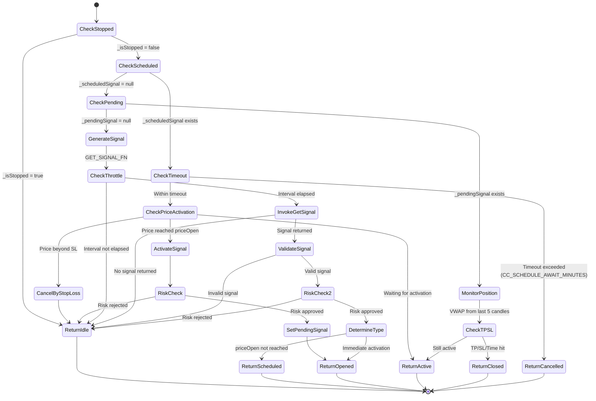
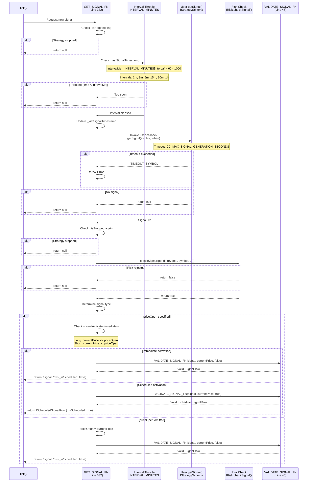
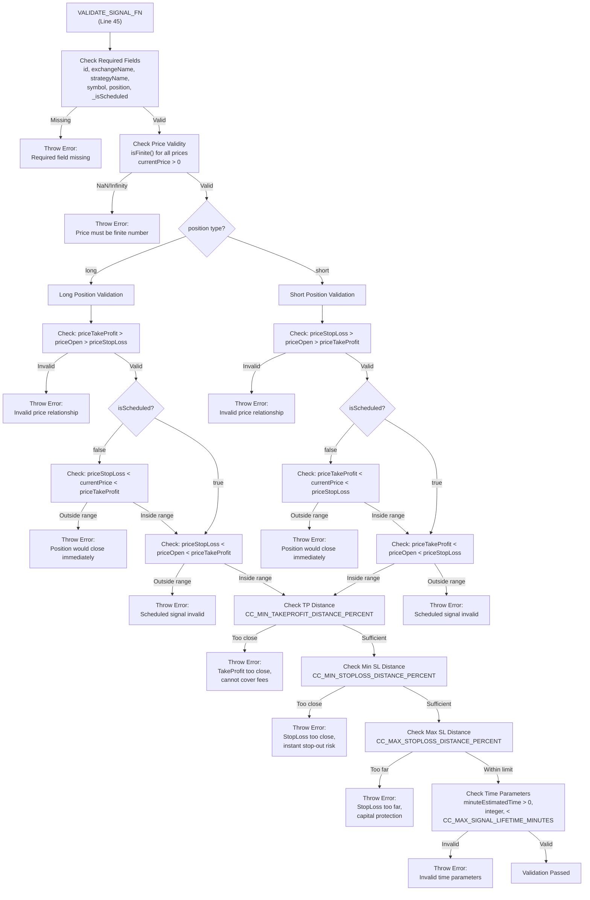
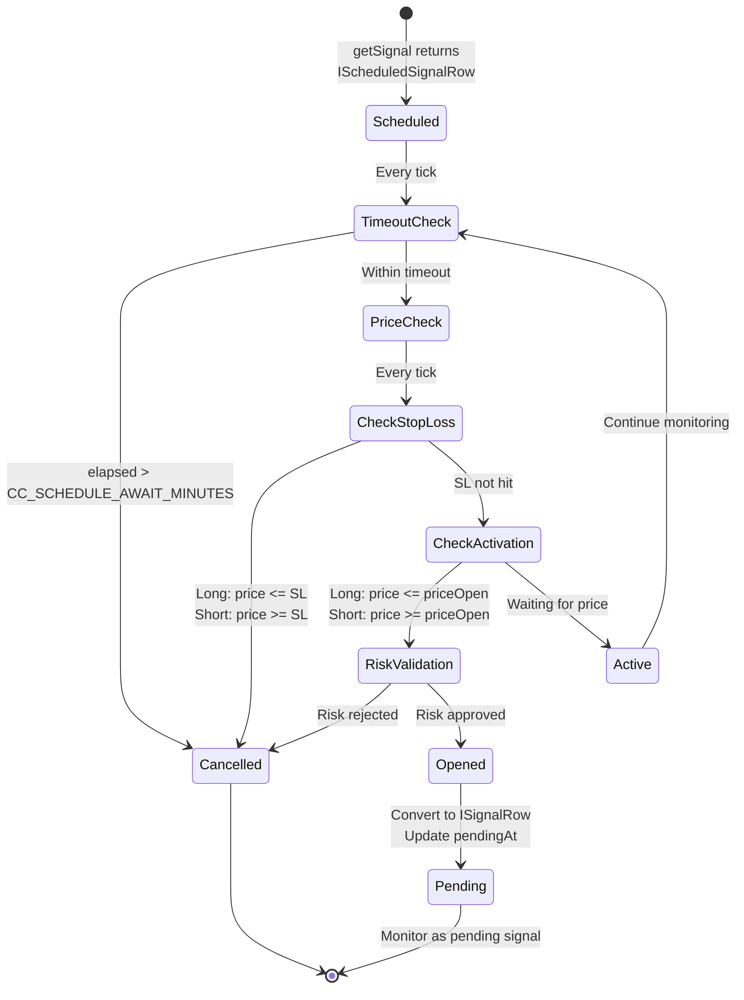
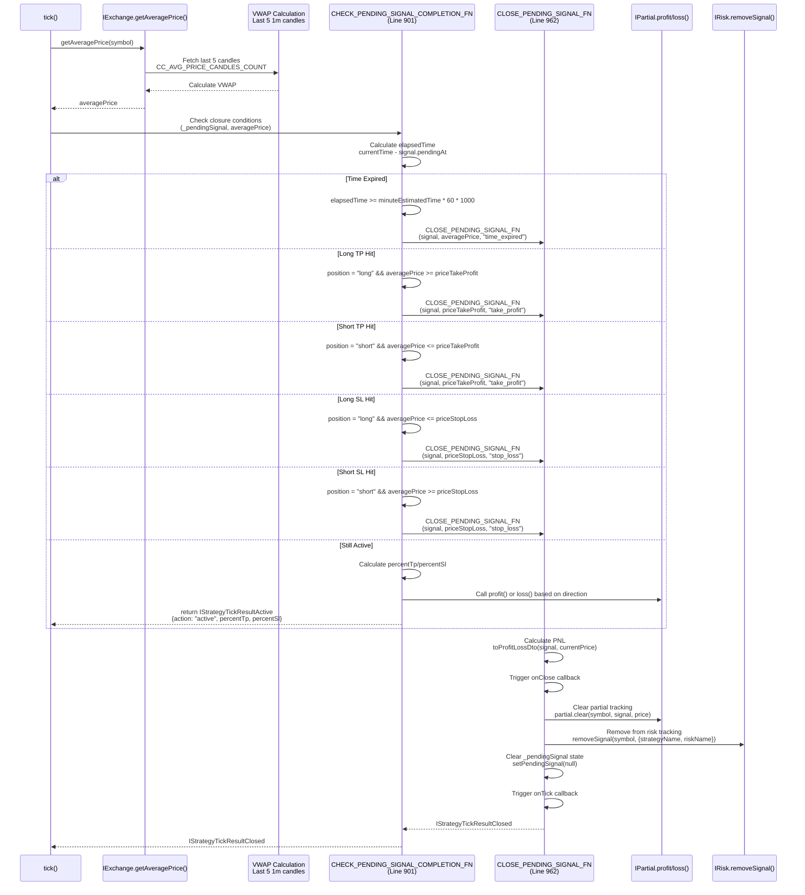
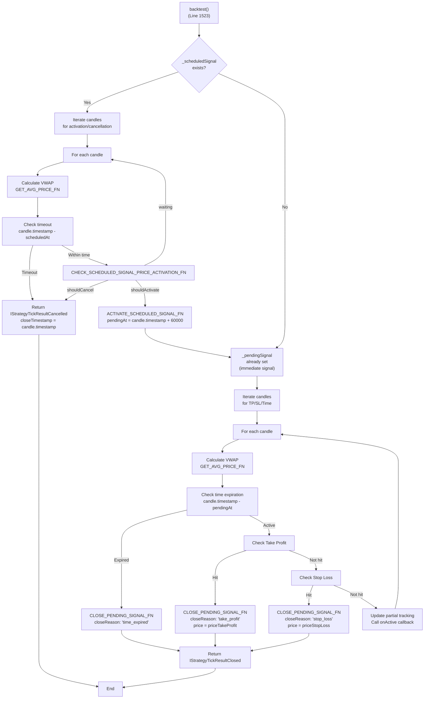
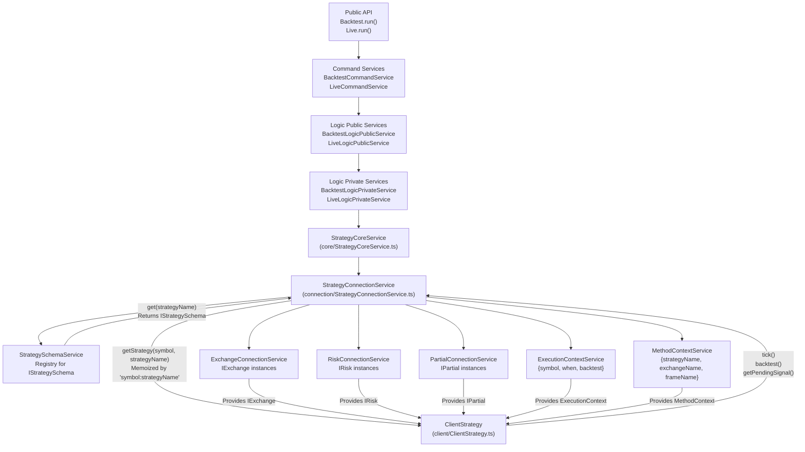

# Strategy Execution Flow

# Strategy Execution Flow

<details>
<summary>Relevant source files</summary>

The following files were used as context for generating this wiki page:

- [assets/uml.svg](assets/uml.svg)
- [docs/classes/StrategyConnectionService.md](docs/classes/StrategyConnectionService.md)
- [docs/classes/WalkerCommandService.md](docs/classes/WalkerCommandService.md)
- [docs/index.md](docs/index.md)
- [docs/interfaces/BacktestStatistics.md](docs/interfaces/BacktestStatistics.md)
- [docs/interfaces/IStrategy.md](docs/interfaces/IStrategy.md)
- [docs/interfaces/IStrategyCallbacks.md](docs/interfaces/IStrategyCallbacks.md)
- [docs/interfaces/IStrategySchema.md](docs/interfaces/IStrategySchema.md)
- [docs/interfaces/LiveStatistics.md](docs/interfaces/LiveStatistics.md)
- [docs/internals.md](docs/internals.md)
- [docs/types/IStrategyBacktestResult.md](docs/types/IStrategyBacktestResult.md)
- [docs/types/IStrategyTickResult.md](docs/types/IStrategyTickResult.md)
- [docs/uml.puml](docs/uml.puml)
- [scripts/uml.mjs](scripts/uml.mjs)
- [src/client/ClientStrategy.ts](src/client/ClientStrategy.ts)
- [src/interfaces/Strategy.interface.ts](src/interfaces/Strategy.interface.ts)
- [src/lib/services/connection/StrategyConnectionService.ts](src/lib/services/connection/StrategyConnectionService.ts)

</details>


## Purpose and Scope

This page documents how trading strategies execute within the backtest-kit framework, focusing on the runtime behavior of the `ClientStrategy` class. It covers signal generation throttling, the `tick()` method for live execution, the `backtest()` method for historical simulation, VWAP-based monitoring, TP/SL condition checking, and scheduled signal activation.

For information about defining strategy schemas and registration, see [Defining Strategies](./12-defining-strategies.md). For risk validation that occurs during execution, see [Risk Management](./14-risk-management.md). For detailed execution mode orchestration, see [Backtest Mode](./17-backtest-mode.md) and [Live Trading Mode](./18-live-trading-mode.md).

---

## ClientStrategy Architecture

The `ClientStrategy` class implements the `IStrategy` interface and serves as the core execution engine for trading strategies. It maintains internal state, handles signal lifecycle transitions, and integrates with exchange, risk, and persistence services.

**Key Responsibilities:**
- Signal generation with configurable interval throttling
- State management for pending and scheduled signals
- VWAP-based price monitoring for TP/SL conditions
- Lifecycle callbacks (onOpen, onClose, onTick, etc.)
- Crash-safe persistence via `PersistSignalAdapter`
- Scheduled signal price activation logic

**Diagram: ClientStrategy Class Structure**

```mermaid
graph TB
    IStrategy["IStrategy Interface<br/>(Strategy.interface.ts:318-388)"]
    ClientStrategy["ClientStrategy<br/>(ClientStrategy.ts:1285-1564)"]
    
    subgraph "Public Methods"
        tick["tick()<br/>Line 1333"]
        backtest["backtest()<br/>Line 1523"]
        getPending["getPendingSignal()<br/>Line 1462"]
        stop["stop()<br/>Line 1480"]
        waitForInit["waitForInit()<br/>Line 1299"]
    end
    
    subgraph "Internal State"
        _pending["_pendingSignal: ISignalRow | null"]
        _scheduled["_scheduledSignal: IScheduledSignalRow | null"]
        _lastSignalTimestamp["_lastSignalTimestamp: number | null"]
        _isStopped["_isStopped: boolean"]
    end
    
    subgraph "Helper Functions"
        GET_SIGNAL["GET_SIGNAL_FN<br/>Line 332-476<br/>Signal generation + throttling"]
        VALIDATE["VALIDATE_SIGNAL_FN<br/>Line 45-330<br/>Comprehensive validation"]
        CHECK_TIMEOUT["CHECK_SCHEDULED_SIGNAL_TIMEOUT_FN<br/>Line 554-608"]
        CHECK_ACTIVATION["CHECK_SCHEDULED_SIGNAL_PRICE_ACTIVATION_FN<br/>Line 610-644"]
        ACTIVATE["ACTIVATE_SCHEDULED_SIGNAL_FN<br/>Line 681-774"]
        CHECK_COMPLETE["CHECK_PENDING_SIGNAL_COMPLETION_FN<br/>Line 901-960"]
        CLOSE["CLOSE_PENDING_SIGNAL_FN<br/>Line 962-1023"]
    end
    
    subgraph "Dependencies (IStrategyParams)"
        exchange["exchange: IExchange<br/>VWAP calculation"]
        risk["risk: IRisk<br/>Signal validation"]
        partial["partial: IPartial<br/>Milestone tracking"]
        persistence["PersistSignalAdapter<br/>Crash-safe storage"]
        logger["logger: ILogger"]
    end
    
    IStrategy --> ClientStrategy
    ClientStrategy --> tick
    ClientStrategy --> backtest
    ClientStrategy --> getPending
    ClientStrategy --> stop
    ClientStrategy --> waitForInit
    
    ClientStrategy --> _pending
    ClientStrategy --> _scheduled
    ClientStrategy --> _lastSignalTimestamp
    ClientStrategy --> _isStopped
    
    tick --> GET_SIGNAL
    tick --> CHECK_TIMEOUT
    tick --> CHECK_ACTIVATION
    tick --> CHECK_COMPLETE
    
    GET_SIGNAL --> VALIDATE
    ACTIVATE --> VALIDATE
    CHECK_COMPLETE --> CLOSE
    
    ClientStrategy --> exchange
    ClientStrategy --> risk
    ClientStrategy --> partial
    ClientStrategy --> persistence
    ClientStrategy --> logger
```



**Sources:** [src/client/ClientStrategy.ts:1-1564](), [src/interfaces/Strategy.interface.ts:318-388]()

---

## The tick() Method: Live Execution

The `tick()` method implements a single iteration of strategy execution. It is called repeatedly in live mode (every 61 seconds) and once per timeframe in backtest mode. The method implements a state machine that handles idle, scheduled, opened, active, and closed states.

**Diagram: tick() Execution Flow and State Transitions**



**Key Implementation Details:**

1. **Stop Check** ([ClientStrategy.ts:1336-1344]()): Returns idle if `_isStopped` flag is set, allowing graceful shutdown without force-closing positions.

2. **Scheduled Signal Handling** ([ClientStrategy.ts:1345-1374]()): 
   - Timeout check: `CC_SCHEDULE_AWAIT_MINUTES` (default 4320 minutes = 3 days)
   - Price activation: Long activates when `currentPrice <= priceOpen`, Short when `currentPrice >= priceOpen`
   - Stop loss cancellation: Prevents activation if price already beyond SL

3. **Pending Signal Monitoring** ([ClientStrategy.ts:1379-1412]()): 
   - VWAP calculation from last 5 1-minute candles via `exchange.getAveragePrice()`
   - TP check: Long closes when `averagePrice >= priceTakeProfit`
   - SL check: Long closes when `averagePrice <= priceStopLoss`
   - Time check: Closes when `elapsedTime >= minuteEstimatedTime * 60 * 1000`

4. **Signal Generation** ([ClientStrategy.ts:1413-1433]()): 
   - Calls `GET_SIGNAL_FN` which implements throttling and validation
   - Returns null if strategy stopped during generation
   - Immediate activation if `priceOpen` already reached
   - Scheduled signal creation if waiting for price

**Sources:** [src/client/ClientStrategy.ts:1333-1460](), [src/interfaces/Strategy.interface.ts:174-307]()

---

## Signal Generation and Interval Throttling

The `GET_SIGNAL_FN` helper implements signal generation with configurable interval throttling to prevent excessive API calls and strategy spam. It enforces minimum time between `getSignal()` invocations based on the strategy's `interval` setting.

**Diagram: Signal Generation Flow with Throttling**



**Throttling Configuration:**

| Interval | Minutes | Use Case |
|----------|---------|----------|
| `"1m"` | 1 | High-frequency scalping strategies |
| `"3m"` | 3 | Short-term momentum strategies |
| `"5m"` | 5 | Standard intraday strategies |
| `"15m"` | 15 | Swing trading strategies |
| `"30m"` | 30 | Position trading strategies |
| `"1h"` | 60 | Long-term strategies |

**Key Implementation Details:**

1. **Timestamp Tracking** ([ClientStrategy.ts:340-353]()): 
   - `_lastSignalTimestamp` stores last successful generation time
   - Current time compared against `_lastSignalTimestamp + intervalMs`
   - Early return null if throttled

2. **Timeout Protection** ([ClientStrategy.ts:357-367]()): 
   - Uses `Promise.race()` to enforce `CC_MAX_SIGNAL_GENERATION_SECONDS`
   - Prevents hanging user callbacks from blocking execution
   - Throws error with strategy name and symbol for debugging

3. **Immediate vs Scheduled** ([ClientStrategy.ts:388-443]()): 
   - If `priceOpen` provided and already reached → immediate `ISignalRow`
   - If `priceOpen` provided and not reached → `IScheduledSignalRow` with `_isScheduled: true`
   - If `priceOpen` omitted → immediate `ISignalRow` with `priceOpen = currentPrice`

**Sources:** [src/client/ClientStrategy.ts:332-476](), [src/interfaces/Strategy.interface.ts:8-39]()

---

## Signal Validation

The `VALIDATE_SIGNAL_FN` helper performs comprehensive validation of signal fields and price relationships to prevent impossible trades, instant closures, and unprofitable configurations. It enforces constraints from `GLOBAL_CONFIG` parameters.

**Validation Categories:**

| Category | Checks | Config Parameters |
|----------|--------|-------------------|
| **Required Fields** | id, exchangeName, strategyName, symbol, position, _isScheduled | N/A |
| **Price Validity** | Finite numbers, positive values, NaN/Infinity protection | N/A |
| **Long Position Logic** | `priceTakeProfit > priceOpen > priceStopLoss` | N/A |
| **Short Position Logic** | `priceStopLoss > priceOpen > priceTakeProfit` | N/A |
| **Instant Closure Prevention** | Current price between SL and TP for immediate signals | N/A |
| **Scheduled Validity** | priceOpen between SL and TP for scheduled signals | N/A |
| **Minimum TP Distance** | Sufficient distance to cover fees and slippage | `CC_MIN_TAKEPROFIT_DISTANCE_PERCENT` |
| **Minimum SL Distance** | Buffer to avoid instant stop-out on volatility | `CC_MIN_STOPLOSS_DISTANCE_PERCENT` |
| **Maximum SL Distance** | Capital protection from extreme losses | `CC_MAX_STOPLOSS_DISTANCE_PERCENT` |
| **Time Validity** | Positive integer minutes, max lifetime limit | `CC_MAX_SIGNAL_LIFETIME_MINUTES` |

**Diagram: Signal Validation Decision Tree**



**Key Validation Logic:**

1. **Instant Closure Prevention** ([ClientStrategy.ts:124-160]()): 
   - Long immediate: Rejects if `currentPrice <= priceStopLoss` or `currentPrice >= priceTakeProfit`
   - Short immediate: Rejects if `currentPrice >= priceStopLoss` or `currentPrice <= priceTakeProfit`
   - Prevents opening positions that are already stopped out or already profitable

2. **Economic Viability** ([ClientStrategy.ts:163-199]()): 
   - TP distance must exceed `CC_MIN_TAKEPROFIT_DISTANCE_PERCENT` to cover fees (default 0.2%)
   - SL distance must exceed `CC_MIN_STOPLOSS_DISTANCE_PERCENT` to avoid instant stop-out (default 0.1%)
   - SL distance must not exceed `CC_MAX_STOPLOSS_DISTANCE_PERCENT` for capital protection (default 10%)

3. **Lifetime Limits** ([ClientStrategy.ts:306-316]()): 
   - `CC_MAX_SIGNAL_LIFETIME_MINUTES` prevents eternal signals that block risk limits
   - Default 43200 minutes (30 days)
   - Ensures portfolio turnover and risk slot availability

**Sources:** [src/client/ClientStrategy.ts:45-330](), [src/config/params.ts]()

---

## Scheduled Signal Activation

Scheduled signals implement delayed entry at specific price levels. The framework monitors price movement and activates signals when the target `priceOpen` is reached, or cancels them if stop loss is hit first or timeout expires.

**Diagram: Scheduled Signal State Machine**



**Implementation Functions:**

1. **Timeout Check** ([ClientStrategy.ts:554-608]()): 
   ```typescript
   // CHECK_SCHEDULED_SIGNAL_TIMEOUT_FN
   const maxTimeToWait = GLOBAL_CONFIG.CC_SCHEDULE_AWAIT_MINUTES * 60 * 1000;
   const elapsedTime = currentTime - scheduled.scheduledAt;
   if (elapsedTime >= maxTimeToWait) {
     // Cancel signal and return IStrategyTickResultCancelled
   }
   ```

2. **Price Activation Check** ([ClientStrategy.ts:610-644]()): 
   ```typescript
   // CHECK_SCHEDULED_SIGNAL_PRICE_ACTIVATION_FN
   if (scheduled.position === "long") {
     if (currentPrice <= scheduled.priceStopLoss) {
       shouldCancel = true; // Stop loss hit before activation
     } else if (currentPrice <= scheduled.priceOpen) {
       shouldActivate = true; // Entry price reached
     }
   }
   // Similar logic for short positions
   ```

3. **Activation** ([ClientStrategy.ts:681-774]()): 
   ```typescript
   // ACTIVATE_SCHEDULED_SIGNAL_FN
   // 1. Check _isStopped flag
   // 2. Risk validation with IRisk.checkSignal()
   // 3. Convert IScheduledSignalRow to ISignalRow
   // 4. Update pendingAt to activation timestamp
   // 5. Persist via setPendingSignal()
   // 6. Add to risk tracking
   // 7. Trigger onOpen callback
   // 8. Return IStrategyTickResultOpened
   ```

**Critical Timestamp Handling:**

- `scheduledAt`: Set when signal first created, never changes
- `pendingAt`: Initially equals `scheduledAt`, updated to activation timestamp when activated
- Duration calculations for pending signals use `pendingAt`, not `scheduledAt`

**Sources:** [src/client/ClientStrategy.ts:554-801]()

---

## Position Monitoring and Closure

Once a signal transitions to the pending state (either immediately or after scheduled activation), `ClientStrategy` monitors VWAP price against TP/SL/time conditions on every tick.

**Diagram: Position Monitoring Flow**



**Closure Conditions:**

| Close Reason | Long Condition | Short Condition | Price Used |
|--------------|---------------|-----------------|------------|
| `"take_profit"` | `averagePrice >= priceTakeProfit` | `averagePrice <= priceTakeProfit` | `priceTakeProfit` (exact TP price) |
| `"stop_loss"` | `averagePrice <= priceStopLoss` | `averagePrice >= priceStopLoss` | `priceStopLoss` (exact SL price) |
| `"time_expired"` | `elapsedTime >= minuteEstimatedTime * 60 * 1000` | Same | `averagePrice` (current market price) |

**Partial Profit/Loss Tracking:**

For active signals, the framework calculates progress towards TP or SL as percentages:

- **Long Position Moving Up**: `percentTp = ((currentPrice - priceOpen) / (priceTakeProfit - priceOpen)) * 100`
- **Long Position Moving Down**: `percentSl = ((priceOpen - currentPrice) / (priceOpen - priceStopLoss)) * 100`
- **Short Position Moving Down**: `percentTp = ((priceOpen - currentPrice) / (priceOpen - priceTakeProfit)) * 100`
- **Short Position Moving Up**: `percentSl = ((currentPrice - priceOpen) / (priceStopLoss - priceOpen)) * 100`

These percentages trigger milestone events (10%, 20%, 30%, etc.) via `IPartial.profit()` and `IPartial.loss()` for tracking and callbacks.

**Sources:** [src/client/ClientStrategy.ts:901-1129](), [src/helpers/toProfitLossDto.ts]()

---

## The backtest() Method: Fast Historical Simulation

The `backtest()` method provides optimized historical simulation by processing candle data directly rather than iterating individual ticks. It's called when `tick()` returns an "opened" signal during backtest mode.

**Diagram: backtest() Execution Flow**



**Key Optimizations:**

1. **Direct Candle Processing**: No individual tick() calls, processes candles in batch
2. **VWAP per Candle**: Calculates volume-weighted average for each candle using `GET_AVG_PRICE_FN`
3. **Immediate Closure Detection**: Exits loop as soon as TP/SL/time condition met
4. **Activation Timestamp**: For scheduled signals, sets `pendingAt = candle.timestamp + 60000` (next candle)

**Critical Timestamp Handling in Backtest:**

```typescript
// For scheduled signal activation in backtest
const activationTime = candle.timestamp + 60_000; // Next candle start
activatedSignal.pendingAt = activationTime;

// For closure
result.closeTimestamp = candle.timestamp; // Current candle timestamp
```

This ensures that duration calculations accurately reflect candle boundaries rather than arbitrary intermediate times.

**VWAP Calculation** ([ClientStrategy.ts:478-489]()):

```typescript
const GET_AVG_PRICE_FN = (candles: ICandleData[]): number => {
  const sumPriceVolume = candles.reduce((acc, c) => {
    const typicalPrice = (c.high + c.low + c.close) / 3;
    return acc + typicalPrice * c.volume;
  }, 0);
  
  const totalVolume = candles.reduce((acc, c) => acc + c.volume, 0);
  
  return totalVolume === 0
    ? candles.reduce((acc, c) => acc + c.close, 0) / candles.length
    : sumPriceVolume / totalVolume;
};
```

**Sources:** [src/client/ClientStrategy.ts:1523-1564](), [src/client/ClientStrategy.ts:478-489]()

---

## State Persistence and Recovery

`ClientStrategy` implements crash-safe state persistence for live trading mode. Pending and scheduled signals are atomically written to disk after each state change, enabling recovery after process crashes.

**Persistence Points:**

1. **setPendingSignal()** ([ClientStrategy.ts:1304-1318]()): 
   - Writes via `PersistSignalAdapter.writeSignalData()`
   - Atomic write ensures consistency
   - Triggers `onWrite` callback for testing

2. **setScheduledSignal()** ([ClientStrategy.ts:1320-1330]()): 
   - Writes via `PersistScheduleAdapter.writeScheduleData()`
   - Separate storage from pending signals
   - Enables concurrent scheduled and pending signals

3. **waitForInit()** ([ClientStrategy.ts:491-552]()): 
   - Called before first tick in live mode
   - Reads both pending and scheduled signal state
   - Triggers `onActive` and `onSchedule` callbacks for restored signals
   - Only runs in non-backtest mode (`backtest = false`)

**Recovery Guarantees:**

- **Pending signals**: Restored with exact price levels and timestamps
- **Scheduled signals**: Restored and continue monitoring for activation
- **No double-execution**: State cleared before persistence prevents duplication
- **Risk state**: Risk tracking re-initialized via callbacks, not persisted

**Sources:** [src/client/ClientStrategy.ts:491-552](), [src/client/ClientStrategy.ts:1304-1330](), [src/classes/Persist.ts]()

---

## Integration with Service Layer

`ClientStrategy` is instantiated and managed by `StrategyConnectionService`, which implements memoization and routing. The service layer provides dependency injection and context management.

**Diagram: Service Layer Integration**



**StrategyConnectionService Methods** ([src/lib/services/connection/StrategyConnectionService.ts:89-306]()):

| Method | Purpose | Key Implementation |
|--------|---------|-------------------|
| `getStrategy()` | Memoized factory for ClientStrategy instances | Cache key: `${symbol}:${strategyName}`, creates new instance on first call |
| `tick()` | Routes to ClientStrategy.tick(), emits events | Calls `waitForInit()`, emits to `signalEmitter`, `signalLiveEmitter`, `signalBacktestEmitter` |
| `backtest()` | Routes to ClientStrategy.backtest(), emits events | Calls `waitForInit()`, emits to `signalEmitter`, `signalBacktestEmitter` |
| `getPendingSignal()` | Routes to ClientStrategy.getPendingSignal() | Direct delegation, no side effects |
| `stop()` | Routes to ClientStrategy.stop() | Sets `_isStopped` flag |
| `clear()` | Clears memoization cache | Optional context parameter for selective clearing |

**Context Services:**

- **ExecutionContextService** ([src/lib/services/context/ExecutionContextService.ts]()): Provides `{symbol, when, backtest}` for current execution
- **MethodContextService** ([src/lib/services/context/MethodContextService.ts]()): Provides `{strategyName, exchangeName, frameName}` for routing

These contexts are injected via dependency injection and accessed throughout ClientStrategy via `this.params.execution.context` and `this.params.method.context`.

**Sources:** [src/lib/services/connection/StrategyConnectionService.ts:89-306](), [src/lib/services/core/StrategyCoreService.ts](), [src/lib/services/context/ExecutionContextService.ts](), [src/lib/services/context/MethodContextService.ts]()

---

## Summary

The strategy execution flow in backtest-kit is implemented by `ClientStrategy`, which provides two primary execution modes:

1. **tick() mode**: Real-time or timeframe-by-timeframe execution with state persistence, scheduled signal activation, and VWAP monitoring
2. **backtest() mode**: Fast historical simulation with direct candle processing and optimized closure detection

Key design patterns:
- **State Machine**: Clear transitions between idle/scheduled/opened/active/closed/cancelled states
- **Throttling**: Configurable interval-based signal generation to prevent spam
- **Validation**: Comprehensive pre-execution checks ensuring economic viability and logical consistency
- **Persistence**: Crash-safe atomic writes for live trading recovery
- **Memoization**: Service-layer caching for performance optimization
- **Context Injection**: Dependency injection for testability and modularity

The execution flow integrates with risk management, position sizing, partial tracking, and exchange services through well-defined interfaces, enabling modular composition and extensibility.

**Sources:** [src/client/ClientStrategy.ts:1-1564](), [src/interfaces/Strategy.interface.ts:1-394](), [src/lib/services/connection/StrategyConnectionService.ts:1-309]()