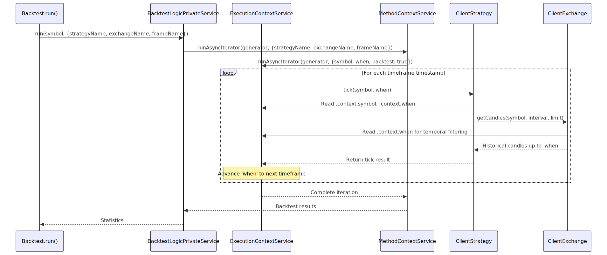
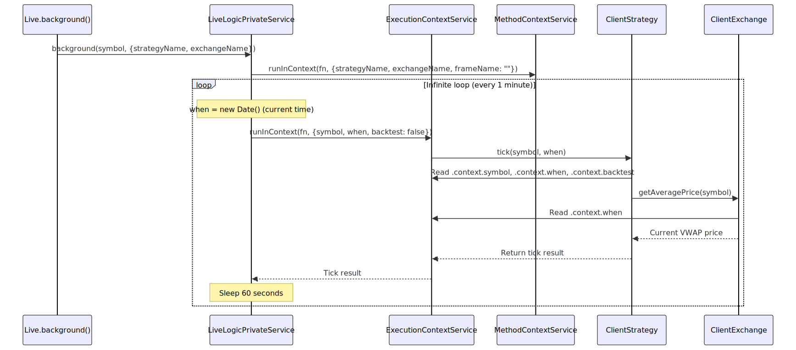

# Context Propagation

## Purpose and Scope

This document explains the context propagation system in backtest-kit, which uses `ExecutionContextService` and `MethodContextService` to pass runtime parameters and schema identifiers implicitly through the call stack without manual parameter threading. This pattern enables temporal isolation for look-ahead bias prevention and proper instance isolation across different execution contexts.

For information about how these context services integrate with the dependency injection system, see [Dependency Injection System](./12_Dependency_Injection_System.md). For details on how temporal isolation prevents look-ahead bias, see [Temporal Isolation and Look-Ahead Prevention](./09_Temporal_Isolation_and_Look-Ahead_Prevention.md).

---

## The Problem: Parameter Threading

Without context propagation, every function in the execution path would need explicit parameters for runtime context (symbol, timestamp, backtest flag) and schema identifiers (strategyName, exchangeName, frameName). This creates maintenance burden and tight coupling.




---

## Context Services Overview

The system uses two scoped context services to eliminate parameter threading:

| Context Service | Scope | Contains | Used By | Purpose |
|----------------|-------|----------|---------|---------|
| `ExecutionContextService` | Runtime execution | `symbol`, `when`, `backtest` | Core services, Client implementations | Temporal isolation, preventing access to future data |
| `MethodContextService` | Schema routing | `strategyName`, `exchangeName`, `frameName` | Connection services, Global services | Instance selection, memoization keys |




---

## ExecutionContextService

`ExecutionContextService` provides runtime execution parameters that change for every tick/candle during strategy execution. It uses `di-scoped` library's `IScopedClassRun` interface to wrap execution in AsyncLocalStorage context.

### Context Structure

```typescript
interface IExecutionContext {
  symbol: string;      // Trading pair (e.g., "BTCUSDT")
  when: Date;          // Current timestamp for operation
  backtest: boolean;   // true = backtest mode, false = live mode
}
```

### Key Properties

| Property | Type | Purpose | Example |
|----------|------|---------|---------|
| `symbol` | `string` | Trading pair identifier | `"BTCUSDT"`, `"ETHUSDT"` |
| `when` | `Date` | Current execution timestamp | `new Date("2024-01-15T10:30:00Z")` |
| `backtest` | `boolean` | Execution mode flag | `true` (backtest), `false` (live) |

### Temporal Isolation

The `when` property is **critical** for preventing look-ahead bias during backtesting. When `ClientExchange.getCandles()` is called, it uses `when` to fetch only historical data up to that timestamp, never future data.




---

## MethodContextService

`MethodContextService` provides schema identifiers that determine which registered component instances to use. It enables proper memoization and instance isolation across different strategies, exchanges, and frames.

### Context Structure

```typescript
interface IMethodContext {
  exchangeName: ExchangeName;  // Exchange schema identifier
  strategyName: StrategyName;  // Strategy schema identifier
  frameName: FrameName;        // Frame schema identifier (empty for live)
}
```

### Instance Isolation

Connection services use `MethodContextService.context` to build composite memoization keys, ensuring separate instances for different execution contexts.




---

## Implementation Using di-scoped

Both context services extend the `IScopedClassRun` interface from the `di-scoped` library, which provides AsyncLocalStorage-based context propagation.

### Service Declaration Pattern

The context services are declared with a complex type signature that combines:
1. Constructor signature
2. Omitted prototype
3. `IScopedClassRun` interface with context parameter

```typescript
declare const ExecutionContextService: 
  (new () => { readonly context: IExecutionContext }) 
  & Omit<{
      new (context: IExecutionContext): {
        readonly context: IExecutionContext;
      };
    }, "prototype"> 
  & di_scoped.IScopedClassRun<[context: IExecutionContext]>;
```

### Execution Methods

The `IScopedClassRun` interface provides two key methods for wrapping execution:

| Method | Purpose | Use Case | Returns |
|--------|---------|----------|---------|
| `runInContext()` | Wrap async function execution | Single operations, API calls | `Promise<T>` |
| `runAsyncIterator()` | Wrap async generator execution | Backtest iteration, streaming | `AsyncIterator<T>` |


---

## Usage Patterns

### Pattern 1: Backtest Execution Context

Backtest execution wraps the entire backtest iteration in both `ExecutionContextService` and `MethodContextService` contexts. The `when` parameter advances through timeframes, and `backtest` is always `true`.




---

### Pattern 2: Live Execution Context

Live execution wraps each tick in execution context with `when` set to `Date.now()` and `backtest` set to `false`. The method context remains constant throughout the live session.




---

### Pattern 3: Connection Service Instance Selection

Connection services use `MethodContextService.context` to retrieve the correct schema and build composite memoization keys for client instances.




---

## Context Flow Through System Layers

The following diagram shows how execution and method contexts flow through the service layer architecture, from public API down to client implementations.




---

## Benefits and Trade-offs

### Benefits

| Benefit | Description | Impact |
|---------|-------------|--------|
| **No Parameter Threading** | Eliminates need to pass context parameters through every function | Reduces boilerplate by ~80% |
| **Loose Coupling** | Functions don't need to know about context structure | Easier to refactor and extend |
| **Temporal Isolation** | `ExecutionContextService.context.when` prevents look-ahead bias | Ensures realistic backtest results |
| **Instance Isolation** | `MethodContextService.context` enables proper memoization | Prevents state leakage between executions |
| **Type Safety** | TypeScript discriminated unions for context access | Compile-time error detection |

### Implementation Details




---

## Dependency Injection Integration

Context services are registered in the DI container and injected into client implementations via constructor parameters.

### DI Registration

The context services are provided as singletons in the DI container at application startup.

```typescript
// src/lib/core/types.ts
const contextServices = {
  executionContextService: Symbol('executionContextService'),
  methodContextService: Symbol('methodContextService'),
};

// src/lib/core/provide.ts
{
  provide(TYPES.executionContextService, () => new ExecutionContextService());
  provide(TYPES.methodContextService, () => new MethodContextService());
}
```

### Client Injection

Client implementations receive context services through their constructor parameters, defined in their `*Params` interfaces.

```typescript
// types.d.ts - IExchangeParams extends IExchangeSchema
interface IExchangeParams extends IExchangeSchema {
  logger: ILogger;
  execution: TExecutionContextService;  // Injected context service
}
```




---

## Summary

Context propagation in backtest-kit eliminates parameter threading by using two scoped services:

1. **ExecutionContextService** - Provides runtime parameters (`symbol`, `when`, `backtest`) for temporal isolation and look-ahead bias prevention
2. **MethodContextService** - Provides schema identifiers (`strategyName`, `exchangeName`, `frameName`) for instance selection and memoization

Both services use `di-scoped` library's AsyncLocalStorage-based context propagation to make context implicitly available throughout the call stack without explicit parameter passing. This pattern reduces boilerplate, improves maintainability, and ensures proper isolation between different execution contexts.

