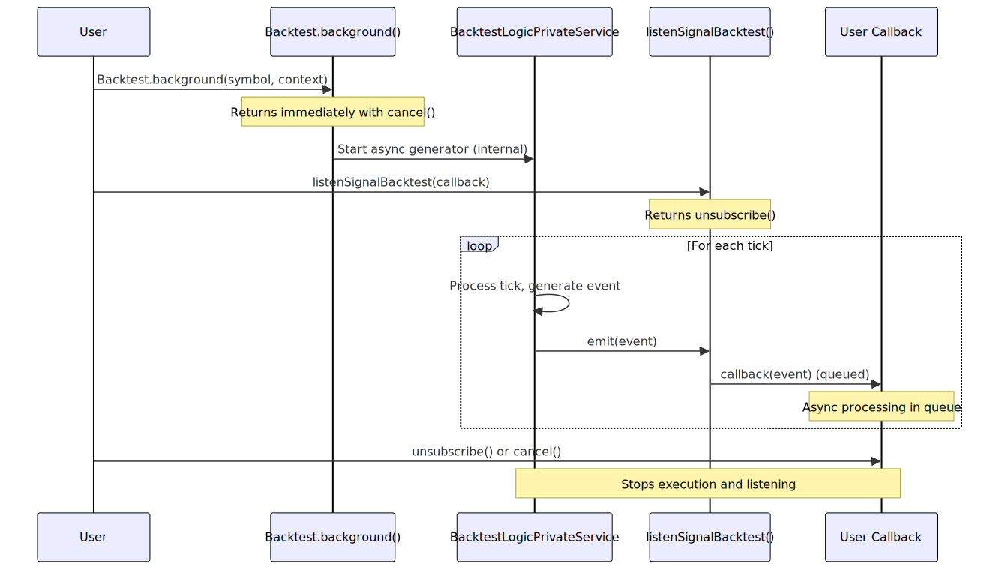

# Event Listeners

This page documents the event listener system for subscribing to signal events. Event listeners allow users to react to strategy signals asynchronously as they occur, enabling patterns like background execution monitoring, conditional early termination, and event-driven workflows.

For information about running strategies, see [Backtest API](10_Backtest_API.md) and [Live Trading API](11_Live_Trading_API.md). For information about signal states and transitions, see [Signal States](24_Signal_States.md).

---

## Purpose and Scope

The event listener system provides six public functions for subscribing to `IStrategyTickResult` events emitted during strategy execution:

- **All events**: `listenSignal()`, `listenSignalOnce()`
- **Backtest events only**: `listenSignalBacktest()`, `listenSignalBacktestOnce()`
- **Live events only**: `listenSignalLive()`, `listenSignalLiveOnce()`

Event listeners use queued async processing to ensure sequential execution, preventing race conditions. All listener functions return an unsubscribe function that removes the listener when called.


---

## Event Listener Functions Overview



**Diagram: Event Listener Architecture**

The event listener system bridges strategy execution to user code. Events originate from `BacktestLogicPrivateService` and `LiveLogicPrivateService`, which emit `IStrategyTickResult` events during `tick()` execution. The six listener functions filter and route events to user-provided callbacks based on execution mode (backtest/live) and subscription type (continuous/once).


---

## Listener Function Variants

| Function | Mode Filter | Execution | Filter Predicate | Auto-Unsubscribe |
|----------|-------------|-----------|------------------|------------------|
| `listenSignal` | All (backtest + live) | Continuous | No | Manual only |
| `listenSignalOnce` | All (backtest + live) | One-time | Yes | After first match |
| `listenSignalBacktest` | Backtest only | Continuous | No | Manual only |
| `listenSignalBacktestOnce` | Backtest only | One-time | Yes | After first match |
| `listenSignalLive` | Live only | Continuous | No | Manual only |
| `listenSignalLiveOnce` | Live only | One-time | Yes | After first match |

### Continuous Listeners

Continuous listeners (`listenSignal`, `listenSignalBacktest`, `listenSignalLive`) execute the callback for every matching event until manually unsubscribed.

```typescript
// Listen to all events continuously
const unsubscribe = listenSignal((event) => {
  console.log("Event:", event.action, event.strategyName);
});

// Later: stop listening
unsubscribe();
```

### One-Time Listeners

One-time listeners (`listenSignalOnce`, `listenSignalBacktestOnce`, `listenSignalLiveOnce`) accept a filter predicate and execute the callback once when an event matches the filter, then automatically unsubscribe.

```typescript
// Wait for first take profit event
listenSignalBacktestOnce(
  (event) => event.action === "closed" && event.closeReason === "take_profit",
  (event) => {
    console.log("Take profit hit:", event.pnl.pnlPercentage);
    // Automatically unsubscribed after this
  }
);
```


---

## Event Types

All event listeners receive `IStrategyTickResult` discriminated union events. The discriminated union has four possible states based on the `action` field:



**Diagram: IStrategyTickResult Discriminated Union**

Each event contains the full state information for type-safe handling:

| State | Description | Fields | Common in Backtest | Common in Live |
|-------|-------------|--------|-------------------|----------------|
| `idle` | No active signal exists | `signal: null` | ✓ | ✓ |
| `opened` | New signal created and validated | `signal: ISignalRow` | ✓ | ✓ |
| `active` | Signal monitored, TP/SL not hit | `signal: ISignalRow`, `currentPrice` | ✗ (filtered) | ✓ |
| `closed` | Signal completed with PNL | `signal: ISignalRow`, `currentPrice`, `closeReason`, `pnl`, `closeTimestamp` | ✓ | ✓ |

**Note**: In backtest mode, `active` events are filtered and not yielded to optimize throughput. Live mode yields all states for real-time monitoring.


---

## Background Execution Pattern

Event listeners are designed for use with `Backtest.background()` and `Live.background()`, which execute strategies without yielding results. This pattern decouples strategy execution from result consumption.



**Diagram: Background Execution with Event Listener**

### Example: Background Backtest with Listener

```typescript
import { Backtest, listenSignalBacktest } from "backtest-kit";

// Start backtest in background (doesn't block)
const cancel = await Backtest.background("BTCUSDT", {
  strategyName: "my-strategy",
  exchangeName: "binance",
  frameName: "1d-backtest"
});

// Subscribe to backtest events
const unsubscribe = listenSignalBacktest((event) => {
  if (event.action === "closed") {
    console.log("PNL:", event.pnl.pnlPercentage, "%");
  }
});

// Later: stop execution and listening
cancel();
unsubscribe();
```


---

## Queued Async Processing

All event listener callbacks use queued async processing via `functools-kit` to ensure sequential execution. Even if callbacks are async, they execute one at a time in the order events are emitted.

This guarantees:
- **No race conditions**: Callbacks cannot run concurrently
- **Order preservation**: Events processed in emission order
- **Async support**: Callbacks can perform async operations (API calls, file I/O)

```typescript
// Even with async operations, callbacks execute sequentially
listenSignal(async (event) => {
  if (event.action === "closed") {
    // These operations execute in order, one at a time
    await saveToDatabase(event);
    await sendNotification(event);
    await updateDashboard(event);
  }
});
```


---

## Unsubscribe Mechanism

All listener functions return an unsubscribe function that removes the listener from the internal registry. Calling unsubscribe prevents future events from triggering the callback.

```typescript
// Subscribe to events
const unsubscribe1 = listenSignal((event) => {
  console.log("Listener 1:", event.action);
});

const unsubscribe2 = listenSignalBacktest((event) => {
  console.log("Listener 2:", event.action);
});

// Remove specific listener
unsubscribe1();

// Remove another listener
unsubscribe2();
```

### Automatic Unsubscribe (Once Variants)

The "Once" variants automatically unsubscribe after the first matching event:

```typescript
// Automatically unsubscribes after first match
listenSignalOnce(
  (event) => event.action === "closed" && event.pnl.pnlPercentage > 5,
  (event) => {
    console.log("Large profit detected:", event.pnl.pnlPercentage);
    // No manual unsubscribe needed
  }
);
```

If you need to cancel a "Once" listener before it fires:

```typescript
const cancel = listenSignalOnce(
  (event) => event.action === "closed",
  (event) => console.log("Closed")
);

// Cancel before event fires
cancel();
```


---

## Multiple Listeners

Multiple listeners can coexist simultaneously. Each listener receives all matching events independently.

```typescript
import { listenSignal, listenSignalLive } from "backtest-kit";

// Listener 1: Log all events
const unsub1 = listenSignal((event) => {
  console.log("Logger:", event.action);
});

// Listener 2: Track live signals only
const unsub2 = listenSignalLive((event) => {
  if (event.action === "opened") {
    // Send alert
  }
});

// Listener 3: Wait for first stop loss (auto-unsubscribes)
listenSignalOnce(
  (event) => event.action === "closed" && event.closeReason === "stop_loss",
  (event) => {
    console.error("Stop loss hit!");
    // Generate emergency report
  }
);

// All three listeners receive events independently
```


---

## Usage Patterns

### Pattern 1: Real-Time Monitoring

Monitor live trading in real-time while strategy runs in background:

```typescript
import { Live, listenSignalLive } from "backtest-kit";

// Start live trading
const cancel = await Live.background("BTCUSDT", {
  strategyName: "my-strategy",
  exchangeName: "binance"
});

// Monitor in real-time
listenSignalLive(async (event) => {
  if (event.action === "opened") {
    console.log("Signal opened:", event.signal.id);
    await sendNotification("New signal opened");
  }
  if (event.action === "closed") {
    console.log("Signal closed:", event.pnl.pnlPercentage);
    await Live.dump("my-strategy");
  }
});
```

### Pattern 2: Conditional Early Termination

Stop execution when specific condition is met:

```typescript
import { Backtest, listenSignalBacktestOnce } from "backtest-kit";

// Start backtest
const cancel = await Backtest.background("BTCUSDT", {
  strategyName: "my-strategy",
  exchangeName: "binance",
  frameName: "1d-backtest"
});

// Stop on first stop loss
listenSignalBacktestOnce(
  (event) => event.action === "closed" && event.closeReason === "stop_loss",
  async (event) => {
    console.error("Stop loss hit - terminating backtest");
    await Backtest.dump("my-strategy");
    cancel(); // Stop backtest execution
  }
);
```

### Pattern 3: Multi-Mode Monitoring

Listen to both backtest and live events simultaneously:

```typescript
import { listenSignal, Backtest, Live } from "backtest-kit";

// Listen to all events from both modes
listenSignal((event) => {
  const mode = event.strategyName.includes("backtest") ? "BT" : "LIVE";
  console.log(`[${mode}] ${event.action}`);
  
  if (event.action === "closed") {
    console.log(`PNL: ${event.pnl.pnlPercentage}%`);
  }
});

// Run backtest and live in parallel
Backtest.background("BTCUSDT", {
  strategyName: "my-strategy-backtest",
  exchangeName: "binance",
  frameName: "1d-backtest"
});

Live.background("BTCUSDT", {
  strategyName: "my-strategy-live",
  exchangeName: "binance"
});
```

### Pattern 4: Filtered Analytics

Collect specific events for analysis:

```typescript
import { listenSignalBacktest, Backtest } from "backtest-kit";

const takeProfits: number[] = [];
const stopLosses: number[] = [];

// Collect PNL data
listenSignalBacktest((event) => {
  if (event.action === "closed") {
    if (event.closeReason === "take_profit") {
      takeProfits.push(event.pnl.pnlPercentage);
    } else if (event.closeReason === "stop_loss") {
      stopLosses.push(event.pnl.pnlPercentage);
    }
  }
});

// Run backtest
await Backtest.background("BTCUSDT", {
  strategyName: "my-strategy",
  exchangeName: "binance",
  frameName: "1d-backtest"
});

// Analyze results
console.log("Avg TP:", takeProfits.reduce((a, b) => a + b, 0) / takeProfits.length);
console.log("Avg SL:", stopLosses.reduce((a, b) => a + b, 0) / stopLosses.length);
```


---

## Best Practices

### 1. Always Unsubscribe

Prevent memory leaks by unsubscribing when listeners are no longer needed:

```typescript
// ✓ Good: Store unsubscribe function
const unsubscribe = listenSignal((event) => {
  console.log(event.action);
});

// Clean up when done
process.on("SIGINT", () => {
  unsubscribe();
  process.exit(0);
});
```

### 2. Use Once Variants for Single Events

Prefer `listenSignalOnce` for one-time actions to avoid manual unsubscribe:

```typescript
// ✓ Good: Automatic cleanup
listenSignalOnce(
  (event) => event.action === "closed",
  (event) => console.log("First close")
);

// ✗ Bad: Manual cleanup required
const unsub = listenSignal((event) => {
  if (event.action === "closed") {
    console.log("First close");
    unsub(); // Easy to forget
  }
});
```

### 3. Filter Events in Callbacks

For continuous listeners, filter events in the callback to reduce processing:

```typescript
// ✓ Good: Early return for unwanted events
listenSignal((event) => {
  if (event.action !== "closed") return;
  if (event.pnl.pnlPercentage < 5) return;
  
  console.log("Large profit:", event.pnl.pnlPercentage);
});
```

### 4. Use Mode-Specific Listeners

Use `listenSignalBacktest` and `listenSignalLive` instead of `listenSignal` when you only care about one mode:

```typescript
// ✓ Good: Backtest-specific listener
listenSignalBacktest((event) => {
  // Only receives backtest events
});

// ✗ Bad: Manual filtering
listenSignal((event) => {
  // Need to check if backtest manually
  if (event.strategyName.includes("backtest")) {
    // ...
  }
});
```

### 5. Handle Errors in Callbacks

Wrap callback logic in try-catch to prevent uncaught errors:

```typescript
listenSignal(async (event) => {
  try {
    if (event.action === "closed") {
      await saveToDatabase(event);
      await sendNotification(event);
    }
  } catch (error) {
    console.error("Error processing event:", error);
  }
});
```


---

## Summary

Event listeners provide a flexible mechanism for subscribing to strategy signals:

- **Six functions**: All/Backtest/Live × Continuous/Once
- **Queued processing**: Sequential async execution prevents race conditions
- **Type-safe events**: Discriminated union `IStrategyTickResult` with four states
- **Background pattern**: Decouples execution from monitoring
- **Automatic cleanup**: "Once" variants auto-unsubscribe

Event listeners enable patterns like real-time monitoring, conditional early termination, and event-driven analytics without blocking strategy execution.
