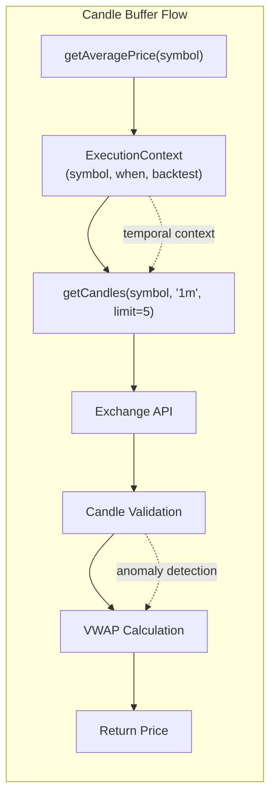
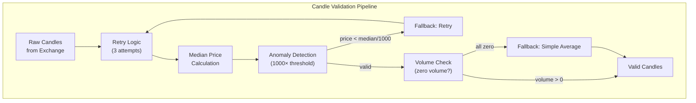
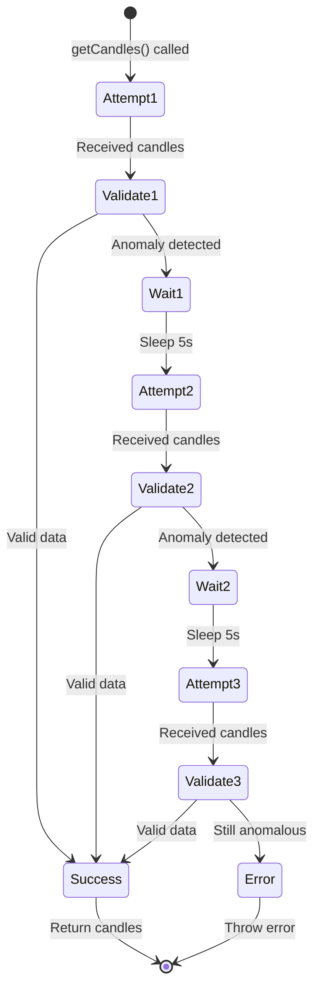
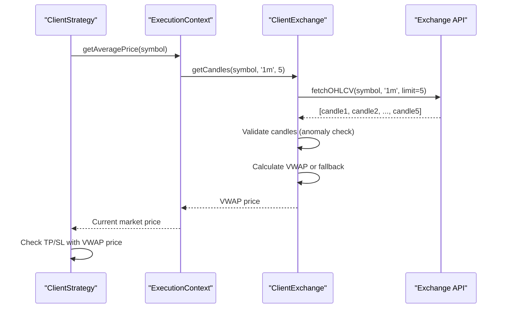
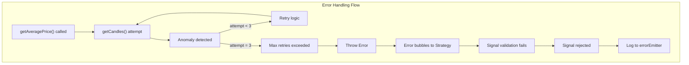

# VWAP Pricing & Data Handling

## Purpose and Scope

This page explains how Backtest Kit calculates Volume Weighted Average Price (VWAP) for realistic entry and exit prices, manages candle data buffers, detects price anomalies from exchange APIs, and implements fallback mechanisms for edge cases. This system ensures that backtests simulate real-world execution conditions with slippage and market depth.

For information about how VWAP integrates with the time execution engine and signal lifecycle, see [Time Execution Engine](./08_core-concepts.md). For exchange configuration and the `getCandles` contract, see [Exchange Configuration](./36_exchanges-data-sources.md).

---

## VWAP Calculation Overview

VWAP (Volume Weighted Average Price) is used to simulate realistic order execution prices. Instead of using a single candle's close price, the system calculates a volume-weighted average across multiple recent candles to account for market depth and order book dynamics.

**Why VWAP?**
- **Realism**: Simulates market impact of large orders
- **Slippage**: Accounts for price movement during order execution
- **Reproducibility**: Deterministic calculation across backtest and live modes
- **Bias Prevention**: Prevents cherry-picking best prices from individual candles

### VWAP Formula

```
VWAP = Σ(price_i × volume_i) / Σ(volume_i)
```

Where `price_i` is typically the candle's close price and `volume_i` is the trading volume for that candle.

**Fallback for Zero Volume**:
```
Simple Average = Σ(price_i) / n
```

When all candles have zero volume (low-liquidity assets), the system falls back to a simple arithmetic mean.


---

## Candle Buffer Management

The system maintains a configurable buffer of recent candles for VWAP calculation. By default, **5 candles** are used, representing the last 5 minutes of data when using a 1-minute interval.

### Buffer Size Configuration

| Parameter | Default | Purpose |
|-----------|---------|---------|
| `CC_AVG_PRICE_CANDLES_COUNT` | 5 | Number of candles for VWAP calculation |

**Buffer Behavior**:
1. Each call to `getAveragePrice()` fetches the last N candles
2. Candles are requested from the exchange via `getCandles()` method
3. VWAP is calculated across all returned candles
4. Buffer size is constant regardless of market volatility

### Temporal Context Guarantee

The `getCandles()` function is time-aware via `AsyncLocalStorage` context propagation. In backtest mode, it **always** returns candles up to the current simulation timestamp, preventing look-ahead bias.



**Diagram: Candle Buffer Data Flow**


---

## Data Validation Pipeline

Candle data undergoes multi-stage validation to detect incomplete or anomalous data from exchange APIs. This is critical because exchanges like Binance occasionally return candles with prices near zero (e.g., $0.01) when data is incomplete.

### Validation Stages



**Diagram: Candle Validation Pipeline**


---

## Anomaly Detection

The system detects incomplete or corrupted candle data using a **median-based threshold**. If any candle's price is more than 1000× lower than the median price, it's flagged as anomalous.

### Price Anomaly Threshold

| Parameter | Default | Purpose |
|-----------|---------|---------|
| `CC_GET_CANDLES_PRICE_ANOMALY_THRESHOLD_FACTOR` | 1000 | Maximum deviation factor for anomaly detection |
| `CC_GET_CANDLES_MIN_CANDLES_FOR_MEDIAN` | 5 | Minimum candles required for reliable median calculation |

**Detection Algorithm**:

1. **Collect all price points** from candles (open, high, low, close)
2. **Calculate median price** (if ≥5 candles) or average (if <5 candles)
3. **Check each candle**: If any price < `median / 1000`, flag as anomaly
4. **Reject batch**: If anomaly detected, trigger retry logic

### Example Scenario

```
BTC median price: $50,000
Anomaly threshold: $50,000 / 1000 = $50
Incomplete candle: close = $0.01

Result: Anomaly detected → Retry fetch
```

**Why 1000× Factor?**

From the configuration comments:
- Incomplete candles from Binance typically have prices near $0.01-$1
- Normal BTC price range: $20,000-$100,000
- Factor 1000 catches anomalies below $20-$100 when median is $20,000-$100,000
- Factor 100 would be too permissive (allows $200 when median is $20,000)
- Factor 10,000 might be too strict for low-cap altcoins

### Median vs Average

| Dataset Size | Method Used | Reason |
|-------------|-------------|---------|
| < 5 candles | Simple Average | Median unstable with small datasets |
| ≥ 5 candles | Median | More robust against outliers (anomalies) |

With 5 candles × 4 price points (OHLC) = **20 data points**, the median is statistically reliable.


---

## Retry Logic

The system implements exponential backoff retry logic for `getCandles()` calls to handle transient network failures or rate limits.

### Retry Configuration

| Parameter | Default | Purpose |
|-----------|---------|---------|
| `CC_GET_CANDLES_RETRY_COUNT` | 3 | Maximum number of retry attempts |
| `CC_GET_CANDLES_RETRY_DELAY_MS` | 5000 | Delay between retries (5 seconds) |

### Retry Flow



**Diagram: Retry State Machine**

**Retry Trigger Conditions**:
1. Network error (timeout, connection refused)
2. Exchange API error (rate limit, 500 error)
3. Anomaly detection failure (price < threshold)
4. Empty candle array returned

**No Retry Conditions**:
- Zero volume candles (valid, triggers fallback)
- Small dataset (<5 candles, uses average)
- Valid data on first attempt


---

## Fallback Mechanisms

The system implements multiple fallback strategies to handle edge cases where normal VWAP calculation is impossible.

### Zero Volume Fallback

When all candles in the buffer have `volume = 0` (low-liquidity assets), the VWAP denominator becomes zero. The system automatically falls back to a **simple arithmetic mean** of close prices.

**Example from Tests**:
```javascript
// Test case: test/e2e/edge.test.mjs:148-283
// All candles have volume=0
candles.push({
  timestamp,
  open: 42000,
  close: 42000,
  volume: 0,  // Zero volume!
});

// System uses fallback: (42000 + 42000 + ...) / n
const price = await getAveragePrice("BTCUSDT");
// Returns: 42000 (simple average)
```

### Small Dataset Fallback

When fewer than 5 candles are available (e.g., newly listed asset, beginning of timeframe), the system uses **simple average** instead of median for anomaly detection.

| Candles Available | Anomaly Detection Method |
|-------------------|-------------------------|
| < 5 candles | Simple average of prices |
| ≥ 5 candles | Median of prices (more robust) |

**Rationale**: Median requires minimum 7-10 data points for statistical stability. With <5 candles (20 price points), average is more stable.


---

## Integration with Signal Lifecycle

VWAP pricing is used at critical points in the signal lifecycle to ensure realistic execution simulation:

### Entry Price (Scheduled → Opened)

When a scheduled signal activates (price reaches `priceOpen`), the system calculates VWAP to determine the **actual entry price**, which may differ from `priceOpen` due to:
- Volume-weighted slippage
- Market depth simulation
- Order book pressure

### Exit Price (Opened → Closed)

When a signal closes (TP/SL/time), VWAP is recalculated to determine the **actual exit price**. This accounts for:
- Exit order execution slippage
- Market conditions at close time
- Volume at exit point

### Price Discovery Flow



**Diagram: VWAP Price Discovery Sequence**


---

## Configuration Reference

All VWAP and data handling parameters are defined in `GLOBAL_CONFIG`.

### Complete Parameter Table

| Parameter | Type | Default | Description |
|-----------|------|---------|-------------|
| `CC_AVG_PRICE_CANDLES_COUNT` | `number` | 5 | Number of candles for VWAP calculation |
| `CC_GET_CANDLES_RETRY_COUNT` | `number` | 3 | Maximum retry attempts for failed requests |
| `CC_GET_CANDLES_RETRY_DELAY_MS` | `number` | 5000 | Delay between retries (milliseconds) |
| `CC_GET_CANDLES_PRICE_ANOMALY_THRESHOLD_FACTOR` | `number` | 1000 | Price deviation threshold (median/factor) |
| `CC_GET_CANDLES_MIN_CANDLES_FOR_MEDIAN` | `number` | 5 | Minimum candles for median calculation |

### Customizing Configuration

```typescript
import { setConfig } from 'backtest-kit';

setConfig({
  CC_AVG_PRICE_CANDLES_COUNT: 10,  // Use 10 candles for VWAP
  CC_GET_CANDLES_RETRY_COUNT: 5,   // More retries for unstable connection
  CC_GET_CANDLES_PRICE_ANOMALY_THRESHOLD_FACTOR: 500,  // Stricter anomaly detection
}, true);  // true = replace all config
```

**Warning**: Changing `CC_AVG_PRICE_CANDLES_COUNT` affects execution realism. Larger buffers smooth out price volatility but may miss short-term opportunities. Smaller buffers are more responsive but may be affected by single-candle anomalies.


---

## VWAP vs Simple Pricing Comparison

### Impact on Backtest Results

| Pricing Method | Pros | Cons | Use Case |
|---------------|------|------|----------|
| **Single Candle Close** | Fast, simple | Unrealistic, cherry-picks prices | Not recommended |
| **VWAP (5 candles)** | Realistic slippage, accounts for volume | Slightly more complex | **Default, recommended** |
| **VWAP (20+ candles)** | Smooths volatility, reduces noise | May miss short-term signals | Low-frequency strategies |

### Example: Price Difference

```
Candle 1: close=42000, volume=100
Candle 2: close=42010, volume=200
Candle 3: close=42020, volume=150
Candle 4: close=42030, volume=50
Candle 5: close=42040, volume=100

Simple Average: (42000 + 42010 + 42020 + 42030 + 42040) / 5 = 42020

VWAP: (42000×100 + 42010×200 + 42020×150 + 42030×50 + 42040×100) / (100+200+150+50+100)
    = 25,217,000 / 600
    = 42,028.33

Difference: 8.33 points (0.02%)
```

Over hundreds of trades, this difference compounds significantly.


---

## Anomaly Detection Examples

### Case Study: Binance Incomplete Candles

**Problem**: Binance API occasionally returns incomplete candles with prices near $0.01 when data is still being aggregated.

**Without Anomaly Detection**:
```
Signal: LONG at priceOpen=$42,000, TP=$43,000
VWAP calculation includes anomalous candle: $0.01
Calculated VWAP: $8,400 (average of [$42k, $42k, $0.01, $42k, $42k])
Result: Signal immediately triggers TP (thinks price jumped to $43k)
```

**With Anomaly Detection**:
```
Median price: $42,000
Anomaly threshold: $42,000 / 1000 = $42
Candle with $0.01 detected: $0.01 < $42 → Anomaly!
Action: Retry getCandles() (up to 3 attempts)
Result: Fetch valid data, calculate correct VWAP=$42,015
```

### Test Coverage

The test suite includes comprehensive anomaly detection coverage:

**Test File**: `test/e2e/edge.test.mjs:148-283`
- Zero volume handling
- Large profit scenarios (>100%)
- Price skip scenarios (scheduled signal cancellation)

**Test File**: `test/e2e/sanitize.test.mjs`
- Negative price rejection
- NaN/Infinity price rejection
- Extreme price validation


---

## Performance Considerations

### Optimization Strategies

1. **Candle Count**: Default 5 candles balances realism vs. API call overhead
2. **Retry Logic**: 3 retries with 5s delay prevents excessive API calls
3. **Median Calculation**: O(n log n) complexity, fast for small datasets
4. **Volume Check**: Early detection of zero-volume edge case avoids division by zero

### Memory Usage

- **Per Symbol**: 5 candles × ~200 bytes/candle = ~1KB per VWAP calculation
- **No Persistent Cache**: Candles are fetched fresh on each call (prevents stale data)
- **Temporal Context**: Leverages `AsyncLocalStorage` for zero-copy context propagation

### API Call Frequency

- **Backtest Mode**: One `getCandles()` call per signal generation (throttled by `interval`)
- **Live Mode**: One `getCandles()` call per tick (~1 minute with default config)
- **Retry Impact**: Failed calls trigger 3× more requests, mitigated by 5s delay


---

## Edge Cases and Error Handling

### Comprehensive Edge Case Matrix

| Scenario | Detection | Handling | Test Coverage |
|----------|-----------|----------|---------------|
| **Zero volume** | Volume sum = 0 | Fallback to simple average | `test/e2e/edge.test.mjs:148-283` |
| **Negative prices** | price < 0 | Reject signal, log error | `test/e2e/sanitize.test.mjs:351-443` |
| **NaN prices** | !isFinite(price) | Reject signal, log error | `test/e2e/sanitize.test.mjs:455-542` |
| **Anomalous prices** | price < median/1000 | Retry fetch (3×) | Config + retry logic |
| **Empty candle array** | candles.length = 0 | Retry or throw error | Retry logic |
| **Incomplete candles** | Missing OHLC fields | Validate schema, retry | Exchange validation |
| **API timeout** | Network error | Retry with backoff | Retry logic |
| **Rate limit** | 429 HTTP error | Retry with 5s delay | Retry logic |

### Error Propagation



**Diagram: Error Propagation Path**

**Critical Principle**: Anomalies in candle data **never** cause signal execution. They either retry or fail the signal entirely, preventing trades based on bad data.


---

## Summary

VWAP Pricing & Data Handling in Backtest Kit provides:

1. **Realistic Execution**: Volume-weighted pricing simulates market depth
2. **Robust Validation**: Multi-stage anomaly detection prevents bad data
3. **Fallback Mechanisms**: Zero-volume and small-dataset edge cases handled
4. **Retry Logic**: Transient failures don't crash backtests
5. **Configuration**: Tunable parameters for different asset classes
6. **Test Coverage**: Comprehensive edge case testing ensures reliability

**Key Takeaway**: The system prioritizes **data integrity** over speed. If data cannot be validated, the signal is rejected rather than executed with potentially incorrect prices.

For implementation details of the `getCandles` interface, see [Exchange Configuration](./36_exchanges-data-sources.md). For how VWAP integrates with signal pricing, see [Signals & Signal Lifecycle](./08_core-concepts.md).
