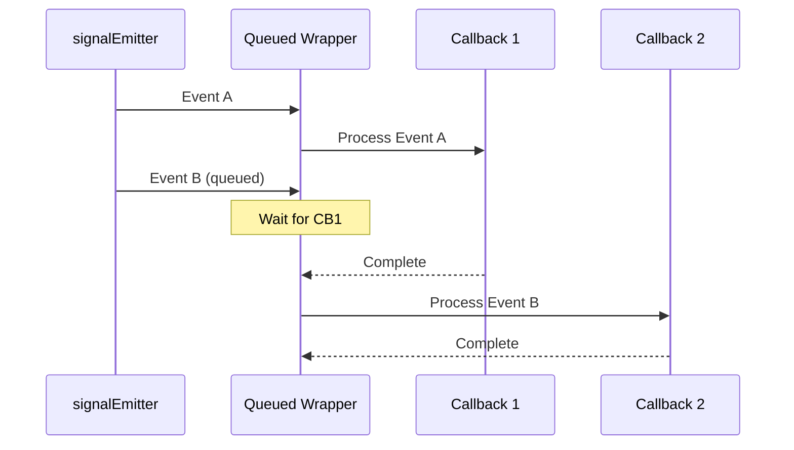
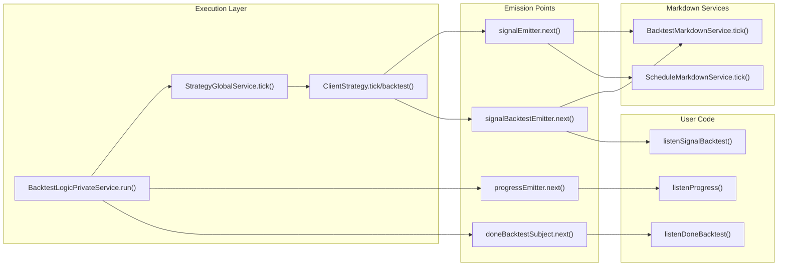
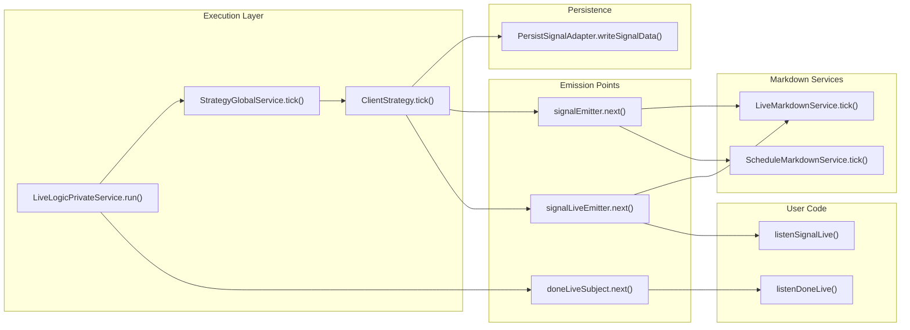
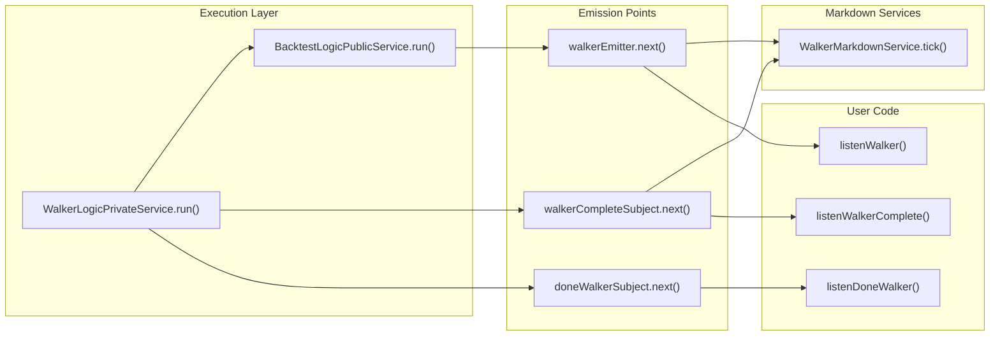

# Event System

<details>
<summary>Relevant source files</summary>

The following files were used as context for generating this wiki page:

- [demo/backtest/package-lock.json](demo/backtest/package-lock.json)
- [demo/backtest/package.json](demo/backtest/package.json)
- [demo/backtest/src/index.mjs](demo/backtest/src/index.mjs)
- [demo/live/package-lock.json](demo/live/package-lock.json)
- [demo/live/package.json](demo/live/package.json)
- [demo/live/src/index.mjs](demo/live/src/index.mjs)
- [demo/optimization/package-lock.json](demo/optimization/package-lock.json)
- [demo/optimization/package.json](demo/optimization/package.json)
- [package-lock.json](package-lock.json)
- [package.json](package.json)
- [src/config/emitters.ts](src/config/emitters.ts)
- [src/function/event.ts](src/function/event.ts)
- [src/index.ts](src/index.ts)
- [types.d.ts](types.d.ts)

</details>


## Purpose and Scope

The Event System provides observability and monitoring capabilities for backtest-kit through a publish-subscribe architecture. It enables external code to react to strategy execution events, errors, and progress updates without coupling to internal execution logic.

This document covers event emitters, listener functions, queued processing, and event flow patterns. For signal lifecycle states, see [Signal Lifecycle](#8). For execution mode details, see [Execution Modes](#2.1). For callback configuration, see [Strategy Schemas](#5.1).

---

## Architecture Overview

The event system uses `Subject` instances from `functools-kit` as event emitters. All listener functions wrap callbacks with the `queued` utility to ensure sequential processing even when callbacks are asynchronous.

**Core Pattern:**
```
Event Source → Subject.next() → Queued Listener → User Callback
```

**Event Emitter Diagram**

```mermaid
graph TB
    subgraph "Event Sources"
        BT[BacktestLogicPrivateService]
        LV[LiveLogicPrivateService]
        WK[WalkerLogicPrivateService]
        ST[ClientStrategy]
        RS[ClientRisk]
    end
    
    subgraph "Emitters (src/config/emitters.ts)"
        SE["signalEmitter"]
        SBE["signalBacktestEmitter"]
        SLE["signalLiveEmitter"]
        EE["errorEmitter"]
        DBE["doneBacktestSubject"]
        DLE["doneLiveSubject"]
        DWE["doneWalkerSubject"]
        PE["progressEmitter"]
        PFE["performanceEmitter"]
        WE["walkerEmitter"]
        WCE["walkerCompleteSubject"]
        VE["validationSubject"]
    end
    
    subgraph "Listener Functions (src/function/event.ts)"
        LS["listenSignal()"]
        LSB["listenSignalBacktest()"]
        LSL["listenSignalLive()"]
        LE["listenError()"]
        LDB["listenDoneBacktest()"]
        LDL["listenDoneLive()"]
        LDW["listenDoneWalker()"]
        LP["listenProgress()"]
        LPF["listenPerformance()"]
        LW["listenWalker()"]
        LWC["listenWalkerComplete()"]
        LV2["listenValidation()"]
    end
    
    BT --> SE
    BT --> SBE
    BT --> DBE
    BT --> PE
    BT --> PFE
    LV --> SE
    LV --> SLE
    LV --> DLE
    WK --> WE
    WK --> WCE
    WK --> DWE
    ST --> EE
    RS --> VE
    
    SE --> LS
    SBE --> LSB
    SLE --> LSL
    EE --> LE
    DBE --> LDB
    DLE --> LDL
    DWE --> LDW
    PE --> LP
    PFE --> LPF
    WE --> LW
    WCE --> LWC
    VE --> LV2
```



**Sources:** [src/config/emitters.ts:1-81](), [src/function/event.ts:1-647]()

---

## Event Categories

### Signal Events

Signal events represent strategy execution state changes. Three emitters handle different execution contexts:

| Emitter | Purpose | Event Type |
|---------|---------|------------|
| `signalEmitter` | All signal events (live + backtest) | `IStrategyTickResult` |
| `signalBacktestEmitter` | Backtest-only signals | `IStrategyTickResult` |
| `signalLiveEmitter` | Live-only signals | `IStrategyTickResult` |

The `IStrategyTickResult` discriminated union includes:
- `IStrategyTickResultIdle` - No active position
- `IStrategyTickResultScheduled` - Delayed entry signal created
- `IStrategyTickResultOpened` - New position opened
- `IStrategyTickResultActive` - Position being monitored
- `IStrategyTickResultClosed` - Position closed with PnL
- `IStrategyTickResultCancelled` - Scheduled signal cancelled

**Sources:** [src/config/emitters.ts:9-25](), [types.d.ts:653-770]()

### Completion Events

Completion events signal when background execution finishes:

| Emitter | Purpose | Event Type | Trigger |
|---------|---------|------------|---------|
| `doneBacktestSubject` | Backtest completion | `DoneContract` | `Backtest.background()` ends |
| `doneLiveSubject` | Live trading completion | `DoneContract` | `Live.background()` ends |
| `doneWalkerSubject` | Walker completion | `DoneContract` | `Walker.background()` ends |

**Sources:** [src/config/emitters.ts:33-49]()

### Progress Events

Progress events track execution advancement:

| Emitter | Purpose | Event Type | Frequency |
|---------|---------|------------|-----------|
| `progressEmitter` | Backtest progress | `ProgressContract` | Per timeframe batch |
| `walkerEmitter` | Walker strategy progress | `WalkerContract` | Per strategy completion |
| `walkerCompleteSubject` | Walker final results | `IWalkerResults` | Once at end |

**Sources:** [src/config/emitters.ts:51-73]()

### Error and Validation Events

| Emitter | Purpose | Event Type | Trigger |
|---------|---------|------------|---------|
| `errorEmitter` | Background execution errors | `Error` | Caught exceptions in `.background()` |
| `validationSubject` | Risk validation failures | `Error` | Risk validation function throws |

**Sources:** [src/config/emitters.ts:28-31](), [src/config/emitters.ts:76-79]()

### Performance Events

| Emitter | Purpose | Event Type | Usage |
|---------|---------|------------|-------|
| `performanceEmitter` | Timing metrics | `PerformanceContract` | Profiling and bottleneck detection |

**Sources:** [src/config/emitters.ts:57-61]()

---

## Listener Functions

All listener functions follow a consistent pattern:

```typescript
function listen*(fn: (event: EventType) => void): () => void
```

Returns an unsubscribe function to stop listening.

### Standard Listeners

| Function | Emitter | Queued | Description |
|----------|---------|--------|-------------|
| `listenSignal()` | `signalEmitter` | Yes | All signal events |
| `listenSignalBacktest()` | `signalBacktestEmitter` | Yes | Backtest signals only |
| `listenSignalLive()` | `signalLiveEmitter` | Yes | Live signals only |
| `listenError()` | `errorEmitter` | Yes | Background errors |
| `listenDoneBacktest()` | `doneBacktestSubject` | Yes | Backtest completion |
| `listenDoneLive()` | `doneLiveSubject` | Yes | Live completion |
| `listenDoneWalker()` | `doneWalkerSubject` | Yes | Walker completion |
| `listenProgress()` | `progressEmitter` | Yes | Backtest progress |
| `listenPerformance()` | `performanceEmitter` | Yes | Performance metrics |
| `listenWalker()` | `walkerEmitter` | Yes | Walker progress |
| `listenWalkerComplete()` | `walkerCompleteSubject` | Yes | Walker final results |
| `listenValidation()` | `validationSubject` | Yes | Risk validation errors |

**Sources:** [src/function/event.ts:56-623]()

### Once Listeners

Once listeners use `.filter().once()` pattern for one-time execution:

```typescript
function listen*Once(
  filterFn: (event: EventType) => boolean,
  fn: (event: EventType) => void
): () => void
```

| Function | Emitter | Pattern |
|----------|---------|---------|
| `listenSignalOnce()` | `signalEmitter` | Filter + auto-unsubscribe |
| `listenSignalBacktestOnce()` | `signalBacktestEmitter` | Filter + auto-unsubscribe |
| `listenSignalLiveOnce()` | `signalLiveEmitter` | Filter + auto-unsubscribe |
| `listenDoneBacktestOnce()` | `doneBacktestSubject` | Filter + auto-unsubscribe |
| `listenDoneLiveOnce()` | `doneLiveSubject` | Filter + auto-unsubscribe |
| `listenDoneWalkerOnce()` | `doneWalkerSubject` | Filter + auto-unsubscribe |
| `listenWalkerOnce()` | `walkerEmitter` | Filter + auto-unsubscribe |

**Sources:** [src/function/event.ts:93-587]()

---

## Queued Processing Pattern

All continuous listeners wrap callbacks with `queued()` from `functools-kit` to ensure sequential execution:

```typescript
export function listenSignal(fn: (event: IStrategyTickResult) => void) {
  backtest.loggerService.log(LISTEN_SIGNAL_METHOD_NAME);
  return signalEmitter.subscribe(queued(async (event) => fn(event)));
}
```

**Guarantees:**
1. Events processed in order received
2. Next event waits for previous callback to complete
3. No concurrent callback execution
4. Prevents race conditions in async handlers

**Queued Processing Flow**



**Sources:** [src/function/event.ts:58](), [src/function/event.ts:9]()

---

## Event Flow Through System

### Backtest Event Flow

**Backtest Signal Event Flow**



**Key Emission Points:**

1. **Signal Events**: Emitted by `BacktestLogicPrivateService.run()` for each tick result
2. **Progress Events**: Emitted periodically during timeframe iteration
3. **Completion Events**: Emitted when `Backtest.background()` finishes

**Sources:** [src/classes/Backtest.ts:102-114]()

### Live Event Flow

**Live Signal Event Flow**



**Key Emission Points:**

1. **Signal Events**: Emitted by `LiveLogicPrivateService.run()` for each tick result
2. **Persistence**: State saved before events emitted
3. **Completion Events**: Emitted when `Live.background()` stops and last position closes

**Sources:** [src/classes/Live.ts:117-129]()

### Walker Event Flow

**Walker Progress Event Flow**



**Key Emission Points:**

1. **Progress Events**: Emitted after each strategy backtest completes
2. **Completion Events**: Emitted when all strategies tested
3. **Final Results**: Emitted with best strategy selection

**Sources:** [src/classes/Walker.ts:122-134]()

---

## Event Contracts

Event payloads are defined as TypeScript interfaces:

### DoneContract

```typescript
interface DoneContract {
  exchangeName: string;
  strategyName: string;
  backtest: boolean;
  symbol: string;
}
```

Emitted by completion subjects (`doneBacktestSubject`, `doneLiveSubject`, `doneWalkerSubject`).

**Sources:** [src/contract/Done.contract.ts]()

### ProgressContract

```typescript
interface ProgressContract {
  strategyName: string;
  exchangeName: string;
  frameName: string;
  symbol: string;
  processedFrames: number;
  totalFrames: number;
  progress: number; // 0-1 float
}
```

Emitted by `progressEmitter` during backtest execution.

**Sources:** [src/contract/Progress.contract.ts]()

### PerformanceContract

```typescript
interface PerformanceContract {
  metricType: PerformanceMetricType;
  duration: number; // milliseconds
  strategyName?: string;
  exchangeName?: string;
  symbol?: string;
}
```

Emitted by `performanceEmitter` for profiling.

**Sources:** [src/contract/Performance.contract.ts]()

### WalkerContract

```typescript
interface WalkerContract {
  walkerName: string;
  strategyName: string;
  exchangeName: string;
  frameName: string;
  symbol: string;
  strategiesTested: number;
  totalStrategies: number;
  metricValue: number;
  bestStrategy: string;
  bestMetric: number;
}
```

Emitted by `walkerEmitter` after each strategy completes.

**Sources:** [src/contract/Walker.contract.ts]()

---

## Integration Points

### Emitting Events from Services

Events are emitted by logic services and client classes:

**BacktestLogicPrivateService:**
```typescript
// Emit signal events
await signalEmitter.next(result);
await signalBacktestEmitter.next(result);

// Emit progress
await progressEmitter.next({...});
```

**Backtest.background():**
```typescript
// Emit completion
await doneBacktestSubject.next({
  exchangeName: context.exchangeName,
  strategyName: context.strategyName,
  backtest: true,
  symbol,
});
```

**Sources:** [src/classes/Backtest.ts:108-113]()

### Using Listeners in Application Code

**Basic Listener:**
```typescript
import { listenSignalBacktest } from "backtest-kit";

const unsubscribe = listenSignalBacktest((event) => {
  if (event.action === "closed") {
    console.log(`PnL: ${event.pnl.pnlPercentage}%`);
  }
});

// Later: stop listening
unsubscribe();
```

**Once Listener:**
```typescript
import { listenDoneBacktestOnce } from "backtest-kit";

listenDoneBacktestOnce(
  (event) => event.symbol === "BTCUSDT",
  (event) => {
    console.log("BTCUSDT backtest completed");
  }
);
```

**Error Handling:**
```typescript
import { listenError } from "backtest-kit";

listenError((error) => {
  console.error("Background error:", error.message);
  // Send to monitoring service
});
```

**Sources:** [src/function/event.ts:40-91](), [src/function/event.ts:93-99](), [src/function/event.ts:232-235]()

---

## Markdown Service Integration

Markdown services automatically subscribe to event emitters to accumulate data for report generation:

**BacktestMarkdownService:**
- Subscribes to `signalBacktestEmitter` 
- Accumulates closed signals
- Generates statistics and markdown reports

**LiveMarkdownService:**
- Subscribes to `signalLiveEmitter`
- Maintains bounded queue (MAX_EVENTS = 25)
- Prevents memory leaks in long-running processes

**WalkerMarkdownService:**
- Subscribes to `walkerEmitter` and `walkerCompleteSubject`
- Tracks strategy comparison results

**Sources:** [types.d.ts:899-1008](), [src/index.ts:126]()

---

## Event System Summary Table

| Event Type | Emitter | Listener | Contract | Queued | Once Variant |
|------------|---------|----------|----------|--------|--------------|
| All signals | `signalEmitter` | `listenSignal()` | `IStrategyTickResult` | Yes | Yes |
| Backtest signals | `signalBacktestEmitter` | `listenSignalBacktest()` | `IStrategyTickResult` | Yes | Yes |
| Live signals | `signalLiveEmitter` | `listenSignalLive()` | `IStrategyTickResult` | Yes | Yes |
| Backtest done | `doneBacktestSubject` | `listenDoneBacktest()` | `DoneContract` | Yes | Yes |
| Live done | `doneLiveSubject` | `listenDoneLive()` | `DoneContract` | Yes | Yes |
| Walker done | `doneWalkerSubject` | `listenDoneWalker()` | `DoneContract` | Yes | Yes |
| Progress | `progressEmitter` | `listenProgress()` | `ProgressContract` | Yes | No |
| Performance | `performanceEmitter` | `listenPerformance()` | `PerformanceContract` | Yes | No |
| Walker progress | `walkerEmitter` | `listenWalker()` | `WalkerContract` | Yes | Yes |
| Walker complete | `walkerCompleteSubject` | `listenWalkerComplete()` | `IWalkerResults` | Yes | No |
| Errors | `errorEmitter` | `listenError()` | `Error` | Yes | No |
| Validation | `validationSubject` | `listenValidation()` | `Error` | Yes | No |

**Sources:** [src/config/emitters.ts:1-81](), [src/function/event.ts:1-647]()