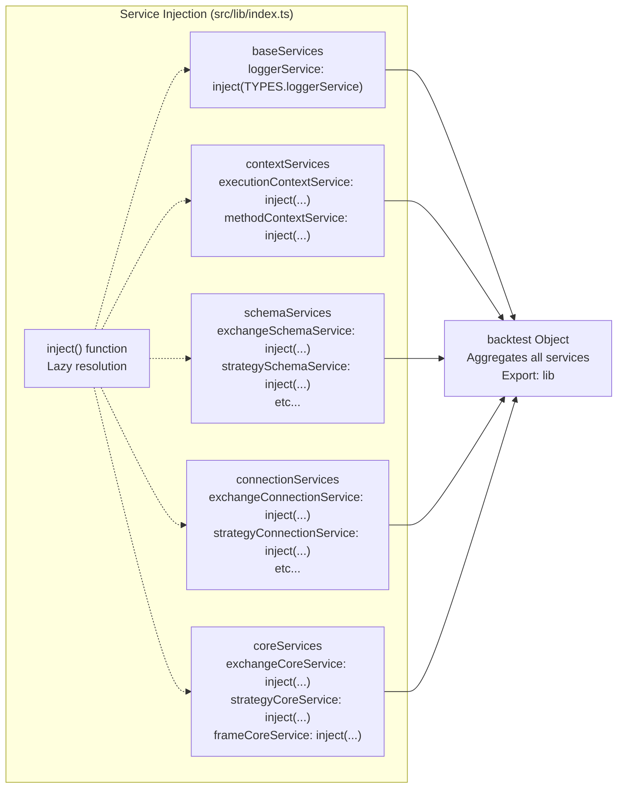
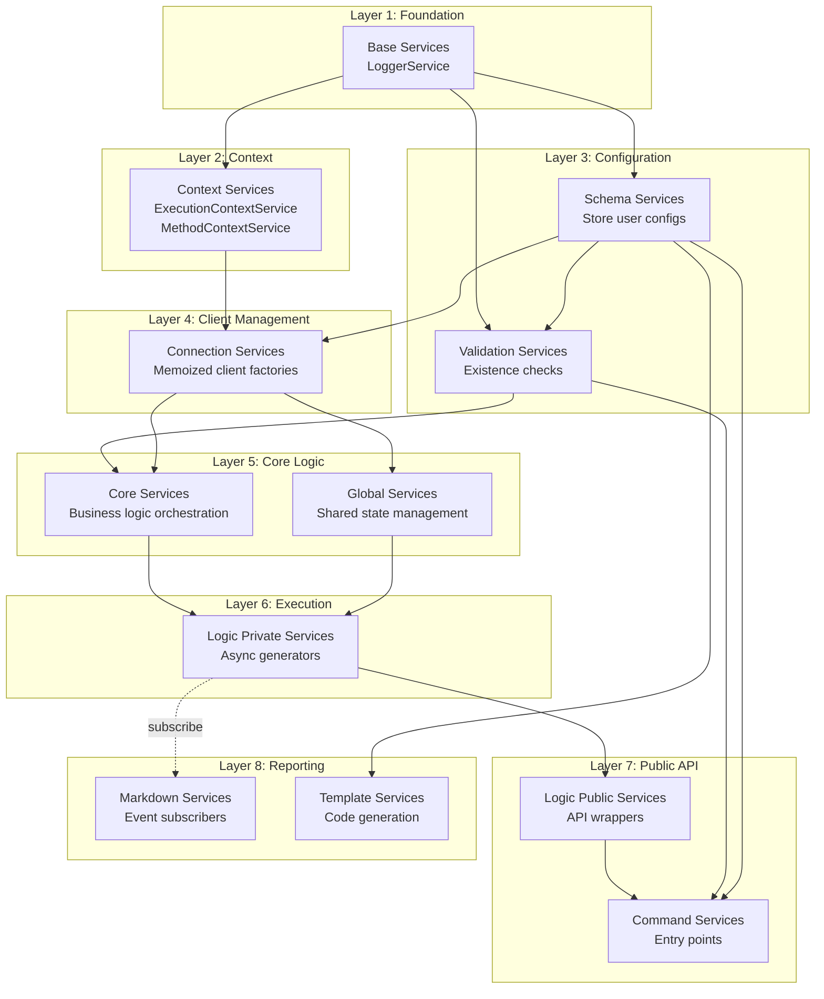
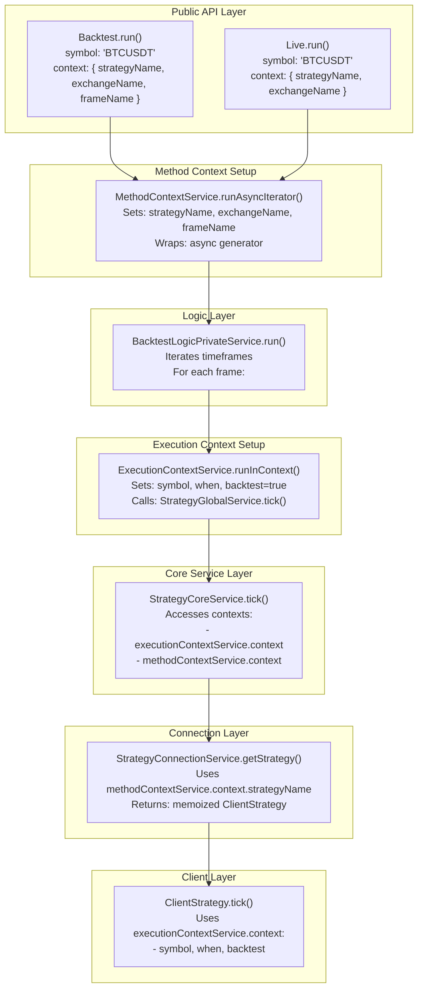
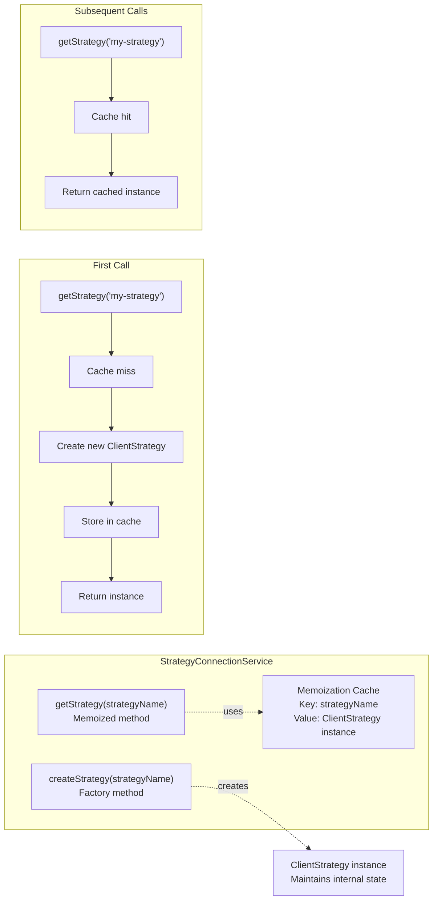
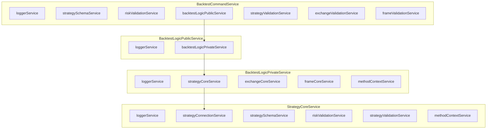
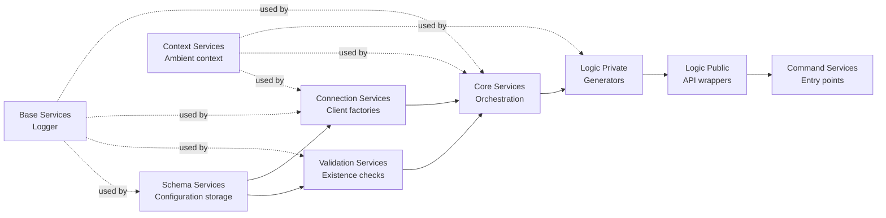
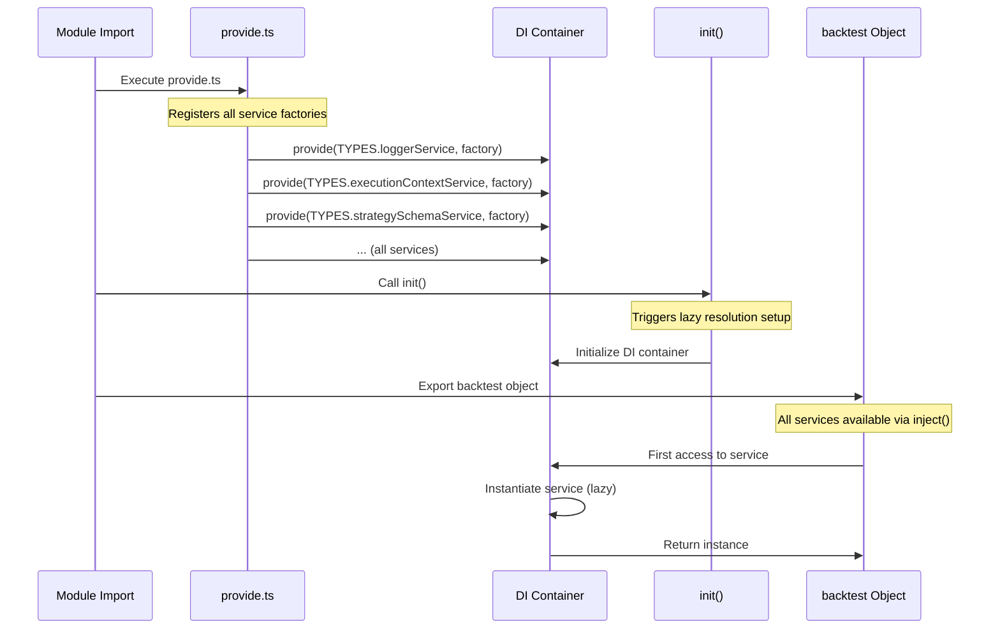
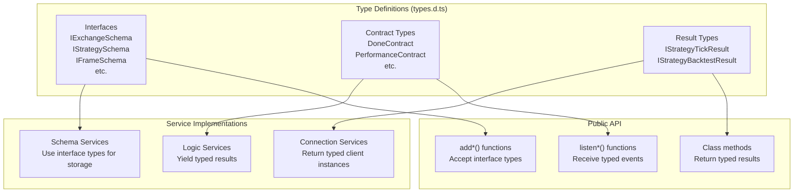

# Architecture Deep Dive

## Purpose and Scope

This document provides a detailed technical exploration of Backtest Kit's internal architecture, focusing on the dependency injection system, service layer organization, context propagation mechanisms, and architectural patterns. This material is intended for developers who need to understand the framework's internal design, extend its functionality, or troubleshoot complex issues.

For information about the public API and usage patterns, see [Getting Started](./04_getting-started.md). For details on strategy development and signal generation, see [Strategy Development](./25_strategy-development.md). For client-layer implementation specifics, see [Client Layer](./14_architecture-deep-dive.md).

## The Dependency Injection Container

Backtest Kit implements a custom dependency injection container using Symbol-based tokens for type-safe service resolution. The DI system consists of three core components:

1. **TYPES Registry** - Symbol-based tokens for each service
2. **Service Providers** - Factory functions that instantiate services
3. **Service Injectors** - Lazy dependency resolution functions
4. **Backtest Aggregator** - Central object exposing all services

### TYPES Symbol Registry

The framework defines unique Symbol tokens for each service, organized by category. These symbols serve as dependency injection keys that prevent naming collisions and enable type-safe resolution.

**TYPES Symbol Structure**

```mermaid
graph TB
    subgraph "TYPES Registry (src/lib/core/types.ts)"
        BASE["baseServices<br/>loggerService"]
        CONTEXT["contextServices<br/>executionContextService<br/>methodContextService"]
        SCHEMA["schemaServices<br/>exchangeSchemaService<br/>strategySchemaService<br/>frameSchemaService<br/>walkerSchemaService<br/>sizingSchemaService<br/>riskSchemaService<br/>optimizerSchemaService"]
        VALIDATION["validationServices<br/>exchangeValidationService<br/>strategyValidationService<br/>frameValidationService<br/>walkerValidationService<br/>sizingValidationService<br/>riskValidationService<br/>optimizerValidationService<br/>configValidationService<br/>columnValidationService"]
        CONNECTION["connectionServices<br/>exchangeConnectionService<br/>strategyConnectionService<br/>frameConnectionService<br/>sizingConnectionService<br/>riskConnectionService<br/>optimizerConnectionService<br/>partialConnectionService"]
        CORE["coreServices<br/>exchangeCoreService<br/>strategyCoreService<br/>frameCoreService"]
        GLOBAL["globalServices<br/>sizingGlobalService<br/>riskGlobalService<br/>optimizerGlobalService<br/>partialGlobalService"]
        COMMAND["commandServices<br/>liveCommandService<br/>backtestCommandService<br/>walkerCommandService"]
        LOGIC_PRIV["logicPrivateServices<br/>backtestLogicPrivateService<br/>liveLogicPrivateService<br/>walkerLogicPrivateService"]
        LOGIC_PUB["logicPublicServices<br/>backtestLogicPublicService<br/>liveLogicPublicService<br/>walkerLogicPublicService"]
        MARKDOWN["markdownServices<br/>backtestMarkdownService<br/>liveMarkdownService<br/>scheduleMarkdownService<br/>performanceMarkdownService<br/>walkerMarkdownService<br/>heatMarkdownService<br/>partialMarkdownService<br/>outlineMarkdownService<br/>riskMarkdownService"]
        TEMPLATE["templateServices<br/>optimizerTemplateService"]
    end
    
    BASE --> TYPES_EXPORT["TYPES Object<br/>Exported from<br/>src/lib/core/types.ts"]
    CONTEXT --> TYPES_EXPORT
    SCHEMA --> TYPES_EXPORT
    VALIDATION --> TYPES_EXPORT
    CONNECTION --> TYPES_EXPORT
    CORE --> TYPES_EXPORT
    GLOBAL --> TYPES_EXPORT
    COMMAND --> TYPES_EXPORT
    LOGIC_PRIV --> TYPES_EXPORT
    LOGIC_PUB --> TYPES_EXPORT
    MARKDOWN --> TYPES_EXPORT
    TEMPLATE --> TYPES_EXPORT
```




### Service Provider Registration

Service factories are registered via the `provide()` function, which associates each TYPES symbol with a constructor function. The registration happens in `src/lib/core/provide.ts`, organized by service category.

**Service Registration Pattern**

| Category | Registration Example | Constructor |
|----------|---------------------|-------------|
| Base Services | `provide(TYPES.loggerService, () => new LoggerService())` | `LoggerService` |
| Context Services | `provide(TYPES.executionContextService, () => new ExecutionContextService())` | `ExecutionContextService` |
| Schema Services | `provide(TYPES.strategySchemaService, () => new StrategySchemaService())` | `StrategySchemaService` |
| Validation Services | `provide(TYPES.strategyValidationService, () => new StrategyValidationService())` | `StrategyValidationService` |
| Connection Services | `provide(TYPES.strategyConnectionService, () => new StrategyConnectionService())` | `StrategyConnectionService` |
| Core Services | `provide(TYPES.strategyCoreService, () => new StrategyCoreService())` | `StrategyCoreService` |
| Command Services | `provide(TYPES.backtestCommandService, () => new BacktestCommandService())` | `BacktestCommandService` |
| Logic Private Services | `provide(TYPES.backtestLogicPrivateService, () => new BacktestLogicPrivateService())` | `BacktestLogicPrivateService` |
| Logic Public Services | `provide(TYPES.backtestLogicPublicService, () => new BacktestLogicPublicService())` | `BacktestLogicPublicService` |
| Markdown Services | `provide(TYPES.backtestMarkdownService, () => new BacktestMarkdownService())` | `BacktestMarkdownService` |
| Template Services | `provide(TYPES.optimizerTemplateService, () => new OptimizerTemplateService())` | `OptimizerTemplateService` |


### Service Injection and the Backtest Aggregator

The `inject()` function performs lazy dependency resolution. Services are instantiated only when first accessed, enabling circular dependency resolution and reducing initialization overhead.

The `backtest` object aggregates all injected services into a single namespace, providing a centralized access point for the entire service layer.

**Backtest Object Structure**



The aggregation structure allows services to access other services through the same namespace:

```typescript
// Inside a service class
const strategySchema = backtest.strategySchemaService.get(strategyName);
const logger = backtest.loggerService;
const context = backtest.executionContextService.context;
```


## Service Layer Organization

The service layer is organized into 11 distinct categories, each with specific responsibilities. This categorization enforces separation of concerns and prevents circular dependencies through careful layering.

### Service Category Overview

| Category | Purpose | Key Characteristics | Example Services |
|----------|---------|---------------------|------------------|
| **Base Services** | Fundamental services used throughout the system | No dependencies on other services | `LoggerService` |
| **Context Services** | Ambient context propagation using `di-scoped` | Provide implicit context without explicit parameters | `ExecutionContextService`, `MethodContextService` |
| **Schema Services** | Configuration storage using `ToolRegistry` pattern | Immutable schema registration and retrieval | `StrategySchemaService`, `ExchangeSchemaService` |
| **Validation Services** | Runtime existence checks with memoization | Fast repeated validation through caching | `StrategyValidationService`, `ExchangeValidationService` |
| **Connection Services** | Memoized client instance factories | Cache clients by unique keys to prevent redundant instantiation | `StrategyConnectionService`, `ExchangeConnectionService` |
| **Core Services** | Business logic orchestration | Coordinate execution flow and delegate to clients | `StrategyCoreService`, `ExchangeCoreService` |
| **Global Services** | Shared state management across strategies | Manage portfolio-wide concerns | `RiskGlobalService`, `PartialGlobalService` |
| **Logic Private Services** | Internal async generator implementations | Stream results with backpressure control | `BacktestLogicPrivateService`, `LiveLogicPrivateService` |
| **Logic Public Services** | External API wrappers for logic services | Public interface delegation to private implementations | `BacktestLogicPublicService`, `LiveLogicPublicService` |
| **Command Services** | Top-level API entry points | Handle validation and delegate to logic services | `BacktestCommandService`, `LiveCommandService` |
| **Markdown Services** | Event-driven report generation | Subscribe to emitters, accumulate data, generate reports | `BacktestMarkdownService`, `LiveMarkdownService` |
| **Template Services** | Code generation for optimizer | Generate executable strategy code from schemas | `OptimizerTemplateService` |

### Service Dependency Layers

The service architecture follows a strict layering principle to prevent circular dependencies. Lower layers have no knowledge of higher layers.

**Service Dependency Hierarchy**




### Service Category Implementation Details

Each service category follows specific patterns and conventions:

**1. Base Services** - Provide fundamental capabilities without dependencies:
```typescript
// LoggerService has no dependencies
class LoggerService {
    log(topic: string, ...args: any[]): void;
    debug(topic: string, ...args: any[]): void;
    info(topic: string, ...args: any[]): void;
    warn(topic: string, ...args: any[]): void;
}
```

**2. Context Services** - Use `di-scoped` for context propagation:
- `ExecutionContextService` contains: `{ symbol, when, backtest }`
- `MethodContextService` contains: `{ strategyName, exchangeName, frameName }`
- Both extend `di-scoped.IScopedClassRun` for `runInContext()` method

**3. Schema Services** - Implement registry pattern with `ToolRegistry`:
- `register(name: string, schema: ISchema): void`
- `get(name: string): ISchema`
- `has(name: string): boolean`
- `list(): ISchema[]`

**4. Validation Services** - Provide memoized existence checks:
- `addStrategy(name: string, schema: ISchema): void` (validates no duplicates)
- `strategyExists(name: string): boolean` (memoized)
- `list(): ISchema[]` (returns all schemas)

**5. Connection Services** - Create and cache client instances:
- Use `functools-kit` `memoize()` decorator
- Cache key: unique identifier (e.g., `strategyName`, `exchangeName`)
- Return cached instance on subsequent calls with same key

**6. Core Services** - Orchestrate execution:
- Retrieve clients from connection services
- Delegate method calls to client instances
- Handle execution context propagation

**7. Global Services** - Manage shared state:
- Track portfolio-wide metrics
- Coordinate cross-strategy concerns
- Provide centralized state access

**8. Logic Private Services** - Implement async generators:
- `async *run(symbol: string)` yields results progressively
- Handle timeframe iteration (backtest) or infinite loop (live)
- Skip frames based on signal state

**9. Logic Public Services** - Wrap private implementations:
- Validate parameters before delegation
- Provide public-facing API surface
- Simplify complex private logic

**10. Command Services** - Entry points for public API:
- Validate all required schemas exist
- Set up contexts via `MethodContextService`
- Delegate to logic services

**11. Markdown Services** - Generate reports from events:
- Subscribe to relevant emitters
- Accumulate events in `ReportStorage`
- Calculate statistics on demand
- Generate formatted markdown tables


## Context Propagation Architecture

Backtest Kit uses the `di-scoped` library to propagate ambient context throughout the execution stack without explicit parameter passing. This approach eliminates parameter drilling while maintaining type safety.

### Context Services

Two context services provide different levels of ambient information:

**ExecutionContextService** - Runtime execution parameters:
```typescript
interface IExecutionContext {
    symbol: string;        // Trading pair (e.g., "BTCUSDT")
    when: Date;           // Current timestamp for operation
    backtest: boolean;    // true = backtest mode, false = live mode
}
```

**MethodContextService** - Schema routing information:
```typescript
interface IMethodContext {
    exchangeName: ExchangeName;   // Which exchange schema to use
    strategyName: StrategyName;   // Which strategy schema to use
    frameName: FrameName;         // Which frame schema to use (empty for live)
}
```

### Context Propagation Flow



### Context Access Pattern

Services access context through the context services without receiving context as parameters:

```typescript
// Inside StrategyCoreService
class StrategyCoreService {
    async tick() {
        // Access execution context (symbol, when, backtest)
        const execCtx = this.executionContextService.context;
        const { symbol, when, backtest } = execCtx;
        
        // Access method context (strategyName, exchangeName, frameName)
        const methodCtx = this.methodContextService.context;
        const { strategyName, exchangeName } = methodCtx;
        
        // Use contexts without explicit parameters
        const strategy = this.strategyConnectionService.getStrategy(strategyName);
        return await strategy.tick(symbol, when, backtest);
    }
}
```

The `di-scoped` library manages context scope boundaries:
- `runInContext(callback, context)` - Execute callback with specific context
- `runAsyncIterator(generator, context)` - Execute async generator with context
- Context automatically available to all code within callback/generator scope


## Memoization Strategy

Connection services use memoization to cache client instances, preventing redundant instantiation and improving performance. This pattern is critical for maintaining consistent state across multiple calls.

### Connection Service Memoization Pattern

**StrategyConnectionService Example**



### Memoization Benefits

| Benefit | Description | Impact |
|---------|-------------|--------|
| **Performance** | Avoids repeated instantiation of expensive client objects | Reduces CPU and memory overhead |
| **State Consistency** | Same instance returned for same key ensures consistent state | Prevents duplicate signals, maintains accurate tracking |
| **Memory Efficiency** | Single instance per unique key rather than per call | Reduces memory footprint for long-running processes |
| **Deterministic Behavior** | Predictable instance resolution simplifies debugging | Easier to reason about system state |

### Memoization Cache Keys

Different connection services use different cache key strategies:

| Connection Service | Cache Key | Example |
|-------------------|-----------|---------|
| `StrategyConnectionService` | `strategyName` | `"my-strategy"` |
| `ExchangeConnectionService` | `exchangeName` | `"binance"` |
| `FrameConnectionService` | `frameName` | `"1d-backtest"` |
| `RiskConnectionService` | `riskName` | `"conservative"` |
| `PartialConnectionService` | `symbol` | `"BTCUSDT"` |
| `OptimizerConnectionService` | `optimizerName` | `"llm-generator"` |

### Implementation Details

Connection services implement a consistent pattern:

1. **Schema Retrieval** - Get schema from schema service
2. **Parameter Assembly** - Build client constructor parameters
3. **Client Instantiation** - Create new client with parameters
4. **Memoized Getter** - Cache instance by unique key

Example pseudo-pattern:
```typescript
class ConnectionService {
    // Memoized getter (implemented via functools-kit memoize decorator)
    getClient(name: string) {
        const schema = this.schemaService.get(name);
        return this.createClient(schema);
    }
    
    // Factory method (non-memoized)
    private createClient(schema: ISchema) {
        return new Client({
            ...schema,
            logger: this.loggerService,
            execution: this.executionContextService,
            // ... other dependencies
        });
    }
}
```


## Service Dependency Graph

The service layer exhibits a carefully designed dependency structure that avoids circular dependencies while enabling rich functionality. Dependencies flow from lower layers to higher layers, with context services providing cross-cutting concerns.

### Key Service Dependencies

**Command Service Dependencies**



### Cross-Service Communication Patterns

Services communicate through well-defined patterns:

**1. Direct Dependency Injection**
- Service A injects Service B via TYPES symbol
- Service A calls methods on Service B
- Example: `StrategyCoreService` → `StrategyConnectionService`

**2. Context-Based Communication**
- Services read ambient context without direct coupling
- Example: All services access `ExecutionContextService.context`

**3. Event-Based Communication**
- Services emit events to subjects
- Other services subscribe to subjects
- Example: `ClientStrategy` emits to `signalEmitter`, `MarkdownService` subscribes

**4. Schema Registry Pattern**
- Services store configurations in schema services
- Other services retrieve configurations by name
- Example: `StrategySchemaService.register()` → `StrategyConnectionService.get()`

### Acyclic Dependency Enforcement

The architecture prevents circular dependencies through:

| Mechanism | Description | Example |
|-----------|-------------|---------|
| **Layered Architecture** | Higher layers depend on lower layers, never reverse | Command → Logic → Core → Connection |
| **Context Services** | Provide cross-cutting concerns without coupling | Services access context without depending on setter |
| **Event System** | Decouple producers from consumers | Strategy emits signal, markdown subscribes (no direct dependency) |
| **Registry Pattern** | Schemas stored centrally, accessed by name | Strategy registers schema, connection service retrieves it |

**Dependency Flow Direction**




## Initialization Flow

The framework initialization follows a specific sequence to ensure all services are properly configured before execution begins.

### Initialization Sequence



### Lazy Dependency Resolution

Services are instantiated only when first accessed, not during module import. This enables:

1. **Circular Dependency Handling** - Services can depend on each other if resolution is lazy
2. **Reduced Startup Time** - Only used services are instantiated
3. **Memory Efficiency** - Unused services never allocate memory
4. **Configuration Flexibility** - Services can be configured before first use

**Lazy Resolution Example:**

```typescript
// src/lib/index.ts
import "./core/provide";  // Registers all factories (no instantiation)
import { inject, init } from "./core/di";

// Services are injected but not yet instantiated
const backtest = {
    loggerService: inject(TYPES.loggerService),  // Returns getter function
    strategyCoreService: inject(TYPES.strategyCoreService),  // Returns getter function
    // ... all other services
};

init();  // Initialize DI container

export { backtest };  // Export service accessors

// When backtest.loggerService is first accessed:
// 1. DI container calls factory: () => new LoggerService()
// 2. Instance is cached for future access
// 3. Same instance returned on subsequent access
```

### Service Access Patterns

| Access Pattern | Use Case | Example |
|----------------|----------|---------|
| **Direct Property Access** | Internal service communication | `this.loggerService.log(...)` |
| **inject() Function** | Service injection in constructors | `inject(TYPES.loggerService)` |
| **backtest Object** | External API implementation | `backtest.strategySchemaService.get(name)` |


## Type Safety and IntelliSense

The framework maintains full TypeScript type safety across the entire service layer through carefully designed type exports and declarations.

### Service Type Exports

The `types.d.ts` file declares all service interfaces and their relationships, enabling IDE IntelliSense and compile-time type checking:

```typescript
// Context service types
declare const ExecutionContextService: (new () => {
    readonly context: IExecutionContext;
}) & IScopedClassRun<[context: IExecutionContext]>;

type TExecutionContextService = InstanceType<typeof ExecutionContextService>;
```

### Type Flow Through Layers



Full type safety is maintained from user-facing API through internal service layer to client implementations, ensuring compile-time error detection and rich IDE support.
