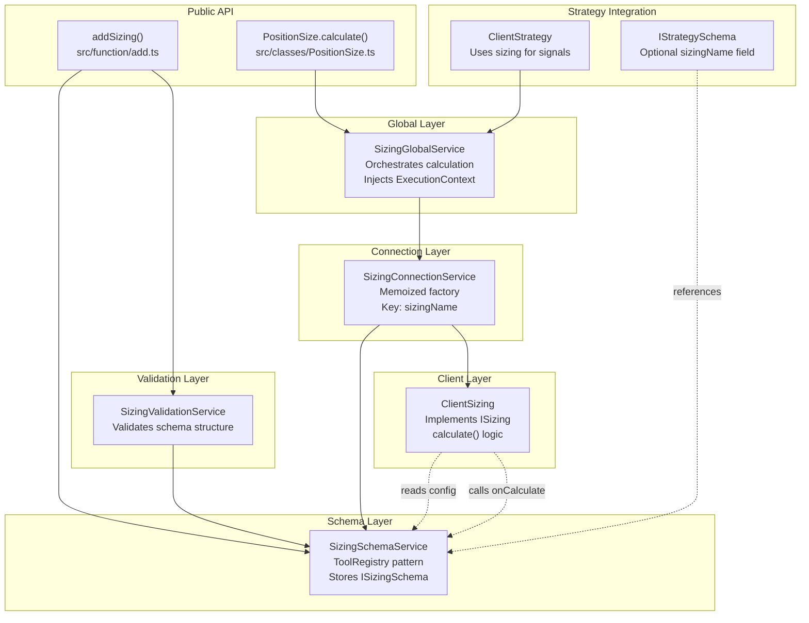
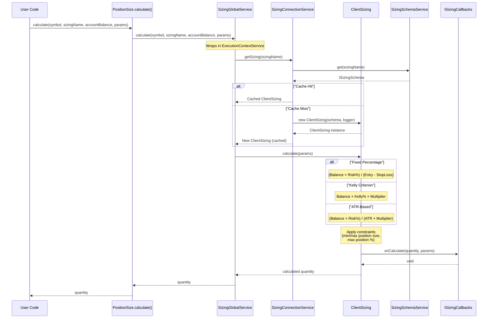

# Position Sizing

# Position Sizing

<details>
<summary>Relevant source files</summary>

The following files were used as context for generating this wiki page:

- [src/config/emitters.ts](src/config/emitters.ts)
- [src/function/add.ts](src/function/add.ts)
- [src/function/event.ts](src/function/event.ts)
- [src/function/list.ts](src/function/list.ts)
- [src/index.ts](src/index.ts)
- [src/lib/core/provide.ts](src/lib/core/provide.ts)
- [src/lib/core/types.ts](src/lib/core/types.ts)
- [src/lib/index.ts](src/lib/index.ts)
- [types.d.ts](types.d.ts)

</details>


Position sizing determines how much capital to allocate to each trading signal. This page documents the position sizing system, including the three built-in sizing methods (fixed-percentage, Kelly Criterion, ATR-based), schema registration, calculation flow, and service architecture.

For information about risk management and portfolio-level position limits, see [Risk Management](./14-risk-management.md). For strategy configuration that uses position sizing, see [Defining Strategies](./12-defining-strategies.md).

---

## Purpose and Scope

The position sizing system calculates the quantity of an asset to trade based on:
- Account balance
- Risk tolerance
- Market volatility (for ATR-based sizing)
- Historical performance (for Kelly Criterion)
- Price levels (for fixed-percentage sizing)

Position sizing is configured via `ISizingSchema` and registered using `addSizing()`. Each sizing configuration defines a calculation method and constraints (min/max position size, max position percentage). The framework provides three built-in methods as a discriminated union based on the `method` field.

**Sources:** [types.d.ts:849-1085]()

---

## Position Sizing Methods

The framework provides three position sizing methods, each suited for different risk management philosophies:

### Method Comparison

| Method | Description | Formula | Best For |
|--------|-------------|---------|----------|
| `fixed-percentage` | Risk fixed % of account per trade | `(Balance × Risk%) / (Entry - StopLoss)` | Conservative, consistent risk |
| `kelly-criterion` | Optimal sizing based on edge | `Balance × Kelly% × Multiplier` | Statistical edge exploitation |
| `atr-based` | Volatility-adjusted sizing | `(Balance × Risk%) / (ATR × Multiplier)` | Adapting to market conditions |

### Fixed Percentage Sizing

Risks a fixed percentage of account balance per trade. Position size is calculated based on the distance between entry price and stop loss.

**Formula:**
```
Position Size = (Account Balance × Risk %) / (Entry Price - Stop Loss Price)
```

**Parameters:**
- `riskPercentage`: Percentage of account to risk (e.g., `1` = 1%)
- `maxPositionPercentage`: Optional cap on position size
- `minPositionSize` / `maxPositionSize`: Optional absolute constraints

**Example:**
```
Account: $10,000
Risk: 1%
Entry: $50,000
Stop Loss: $49,000
Position Size = ($10,000 × 0.01) / ($50,000 - $49,000) = 0.1 BTC
```

**Sources:** [types.d.ts:875-897]()

### Kelly Criterion Sizing

Calculates optimal position size based on historical win rate and risk/reward ratio. Uses a multiplier (typically 0.25 for quarter-Kelly) to reduce variance.

**Formula:**
```
Kelly % = (Win Rate × Win Size - Loss Rate × Loss Size) / Win Size
Position Size = Account Balance × Kelly % × Kelly Multiplier
```

**Parameters:**
- `kellyMultiplier`: Conservative multiplier (default: `0.25` for quarter-Kelly)
- `maxPositionPercentage`: Optional cap on position size
- `minPositionSize` / `maxPositionSize`: Optional absolute constraints

**Calculation requires:**
- `winRate`: Historical win rate (0.0-1.0)
- `averageWin`: Average win size multiplier
- `averageLoss`: Average loss size multiplier

**Example:**
```
Account: $10,000
Win Rate: 60% (0.6)
Average Win: 1.5x
Average Loss: 1.0x
Kelly Multiplier: 0.25 (quarter-Kelly)

Kelly % = (0.6 × 1.5 - 0.4 × 1.0) / 1.5 = 0.333
Position = $10,000 × 0.333 × 0.25 = $833
```

**Sources:** [types.d.ts:899-922]()

### ATR-Based Sizing

Sizes positions based on Average True Range (volatility indicator). Higher volatility results in smaller positions, lower volatility in larger positions.

**Formula:**
```
Position Size = (Account Balance × Risk %) / (ATR × ATR Multiplier)
```

**Parameters:**
- `riskPercentage`: Percentage of account to risk per trade
- `atrMultiplier`: Stop loss distance in ATRs (default: `2`)
- `maxPositionPercentage`: Optional cap on position size
- `minPositionSize` / `maxPositionSize`: Optional absolute constraints

**Example:**
```
Account: $10,000
Risk: 2%
ATR: $500
ATR Multiplier: 2× (stop loss at 2× ATR)

Position Size = ($10,000 × 0.02) / ($500 × 2) = 0.2 BTC
```

**Sources:** [types.d.ts:924-949]()

---

## Schema Definition and Registration

### ISizingSchema Discriminated Union

The sizing schema uses a discriminated union based on the `method` field. TypeScript enforces type safety, ensuring only valid parameters are provided for each method.

```mermaid
graph TB
    subgraph "ISizingSchema Discriminated Union"
        SCHEMA["ISizingSchema<br/>(Union Type)"]
        FIXED["ISizingSchemaFixedPercentage<br/>method: 'fixed-percentage'"]
        KELLY["ISizingSchemaKelly<br/>method: 'kelly-criterion'"]
        ATR["ISizingSchemaATR<br/>method: 'atr-based'"]
    end
    
    subgraph "Fixed Percentage Fields"
        F_NAME["sizingName: SizingName"]
        F_METHOD["method: 'fixed-percentage'"]
        F_RISK["riskPercentage: number"]
        F_MAX["maxPositionPercentage?: number"]
        F_MIN["minPositionSize?: number"]
        F_MAX_ABS["maxPositionSize?: number"]
        F_CB["callbacks?: Partial&lt;ISizingCallbacks&gt;"]
    end
    
    subgraph "Kelly Criterion Fields"
        K_NAME["sizingName: SizingName"]
        K_METHOD["method: 'kelly-criterion'"]
        K_MULT["kellyMultiplier?: number<br/>default: 0.25"]
        K_MAX["maxPositionPercentage?: number"]
        K_MIN["minPositionSize?: number"]
        K_MAX_ABS["maxPositionSize?: number"]
        K_CB["callbacks?: Partial&lt;ISizingCallbacks&gt;"]
    end
    
    subgraph "ATR-Based Fields"
        A_NAME["sizingName: SizingName"]
        A_METHOD["method: 'atr-based'"]
        A_RISK["riskPercentage: number"]
        A_MULT["atrMultiplier?: number<br/>default: 2"]
        A_MAX["maxPositionPercentage?: number"]
        A_MIN["minPositionSize?: number"]
        A_MAX_ABS["maxPositionSize?: number"]
        A_CB["callbacks?: Partial&lt;ISizingCallbacks&gt;"]
    end
    
    SCHEMA --> FIXED
    SCHEMA --> KELLY
    SCHEMA --> ATR
    
    FIXED --> F_NAME
    FIXED --> F_METHOD
    FIXED --> F_RISK
    FIXED --> F_MAX
    FIXED --> F_MIN
    FIXED --> F_MAX_ABS
    FIXED --> F_CB
    
    KELLY --> K_NAME
    KELLY --> K_METHOD
    KELLY --> K_MULT
    KELLY --> K_MAX
    KELLY --> K_MIN
    KELLY --> K_MAX_ABS
    KELLY --> K_CB
    
    ATR --> A_NAME
    ATR --> A_METHOD
    ATR --> A_RISK
    ATR --> A_MULT
    ATR --> A_MAX
    ATR --> A_MIN
    ATR --> A_MAX_ABS
    ATR --> A_CB
```



**Sources:** [types.d.ts:849-949]()

### Registration with addSizing()

Sizing configurations are registered via `addSizing()`, which validates the schema and stores it in `SizingSchemaService`.

**Function Signature:**
```typescript
function addSizing(sizingSchema: ISizingSchema): void
```

**Validation Steps:**
1. `SizingValidationService.addSizing()` validates schema structure
2. `SizingSchemaService.register()` stores configuration for retrieval

**Example Registrations:**

```typescript
// Fixed percentage: Risk 1% per trade
addSizing({
  sizingName: "conservative",
  method: "fixed-percentage",
  riskPercentage: 1,
  maxPositionPercentage: 10,
  minPositionSize: 0.001,
  callbacks: {
    onCalculate: (quantity, params) => {
      console.log(`Conservative sizing: ${quantity}`);
    }
  }
});

// Kelly Criterion: Quarter-Kelly with 20% max position
addSizing({
  sizingName: "kelly-optimal",
  method: "kelly-criterion",
  kellyMultiplier: 0.25,
  maxPositionPercentage: 20,
});

// ATR-based: 2% risk with 2× ATR stop
addSizing({
  sizingName: "atr-dynamic",
  method: "atr-based",
  riskPercentage: 2,
  atrMultiplier: 2,
  maxPositionSize: 1.0,
});
```

**Sources:** [src/function/add.ts:256-268](), [types.d.ts:849-949]()

---

## Calculation Parameters

### ISizingCalculateParams

The `calculate()` method accepts `ISizingCalculateParams`, which contains:
- `symbol`: Trading pair (e.g., `"BTCUSDT"`)
- `accountBalance`: Current account balance in quote currency
- `params`: Method-specific parameters (discriminated union)

### Method-Specific Parameters

Each sizing method requires different calculation inputs:

#### Fixed Percentage Parameters

```typescript
interface ISizingCalculateParamsFixedPercentage {
  method: "fixed-percentage";
  entryPrice: number;      // Entry price for position
  stopLossPrice: number;   // Stop loss price
}
```

**Used for:** Risk-per-trade calculation based on price distance

#### Kelly Criterion Parameters

```typescript
interface ISizingCalculateParamsKelly {
  method: "kelly-criterion";
  winRate: number;         // Historical win rate (0.0-1.0)
  averageWin: number;      // Average win multiplier
  averageLoss: number;     // Average loss multiplier
}
```

**Used for:** Statistical edge-based sizing

#### ATR-Based Parameters

```typescript
interface ISizingCalculateParamsATR {
  method: "atr-based";
  atr: number;             // Current Average True Range
}
```

**Used for:** Volatility-adjusted sizing

**Sources:** [types.d.ts:951-1007]()

---

## Service Architecture

### Position Sizing Service Dependencies



**Sources:** [src/lib/index.ts:1-242](), [src/lib/core/types.ts:1-104](), [src/lib/core/provide.ts:1-141]()

### Memoization in SizingConnectionService

`SizingConnectionService` caches `ClientSizing` instances by `sizingName` to avoid redundant instantiation:

**Memoization Key:**
```
sizingName (e.g., "conservative", "kelly-optimal")
```

**Cache Behavior:**
- First call creates new `ClientSizing` instance
- Subsequent calls with same `sizingName` return cached instance
- Each instance reads configuration from `SizingSchemaService`

**Sources:** [src/lib/core/types.ts:14](), [src/lib/core/provide.ts:68]()

---

## Calculation Flow

### Position Size Calculation Sequence



**Sources:** [types.d.ts:1009-1085]()

### Constraint Application

After calculating the base position size, `ClientSizing` applies constraints in this order:

1. **Max Position Percentage:**
   ```typescript
   if (maxPositionPercentage) {
     maxAllowed = accountBalance * (maxPositionPercentage / 100);
     quantity = Math.min(quantity, maxAllowed);
   }
   ```

2. **Min Position Size:**
   ```typescript
   if (minPositionSize && quantity < minPositionSize) {
     quantity = minPositionSize;
   }
   ```

3. **Max Position Size:**
   ```typescript
   if (maxPositionSize && quantity > maxPositionSize) {
     quantity = maxPositionSize;
   }
   ```

**Sources:** [types.d.ts:875-949]()

---

## Integration with Strategy System

### Strategy Schema Configuration

Strategies can optionally reference a sizing configuration:

```typescript
interface IStrategySchema {
  strategyName: StrategyName;
  interval: SignalInterval;
  getSignal: (symbol: string, when: Date) => Promise<ISignalDto | null>;
  
  // Optional sizing configuration
  sizingName?: SizingName;
  
  // Alternative: multiple sizing configs
  sizingList?: SizingName[];
  
  // Other fields...
}
```

**Usage Pattern:**
- If `sizingName` is specified, strategy uses that sizing config
- If `sizingList` is specified, strategy can select from multiple configs
- If neither specified, strategy must calculate position size manually

**Sources:** [types.d.ts:932-955]()

### Position Size Calculation in Strategy

Strategies typically calculate position size during signal generation or validation:

```typescript
// In getSignal callback
const sizing = await PositionSize.calculate(
  symbol,
  "conservative", // sizingName
  accountBalance,
  {
    method: "fixed-percentage",
    entryPrice: 50000,
    stopLossPrice: 49000
  }
);

// Return signal with calculated quantity
return {
  position: "long",
  priceOpen: 50000,
  priceTakeProfit: 51000,
  priceStopLoss: 49000,
  minuteEstimatedTime: 60,
  quantity: sizing  // Use calculated quantity
};
```

**Sources:** [types.d.ts:849-1085]()

---

## PositionSize Class API

### Public Methods

The `PositionSize` class provides a high-level API for position size calculation:

**Method Signature:**
```typescript
class PositionSize {
  static calculate(
    symbol: string,
    sizingName: SizingName,
    accountBalance: number,
    params: ISizingCalculateParamsFixedPercentage | 
           ISizingCalculateParamsKelly | 
           ISizingCalculateParamsATR
  ): Promise<number>
}
```

**Parameters:**
- `symbol`: Trading pair (e.g., `"BTCUSDT"`)
- `sizingName`: Registered sizing configuration name
- `accountBalance`: Current account balance in quote currency
- `params`: Method-specific calculation parameters

**Returns:** Calculated position size in base currency units

**Example Usage:**

```typescript
import { PositionSize, addSizing } from "backtest-kit";

// Register sizing configuration
addSizing({
  sizingName: "my-sizing",
  method: "fixed-percentage",
  riskPercentage: 1,
  maxPositionPercentage: 10
});

// Calculate position size
const quantity = await PositionSize.calculate(
  "BTCUSDT",
  "my-sizing",
  10000, // $10,000 account
  {
    method: "fixed-percentage",
    entryPrice: 50000,
    stopLossPrice: 49000
  }
);

console.log(`Position size: ${quantity} BTC`);
// Position size: 0.1 BTC
```

**Sources:** [src/index.ts:184](), [types.d.ts:849-1085]()

---

## Complete Example

### Full Position Sizing Configuration

```typescript
import { 
  addSizing, 
  addStrategy,
  PositionSize,
  ISizingCalculateParams 
} from "backtest-kit";

// 1. Register multiple sizing configurations
addSizing({
  sizingName: "conservative",
  method: "fixed-percentage",
  riskPercentage: 1,
  maxPositionPercentage: 5,
  minPositionSize: 0.001,
  callbacks: {
    onCalculate: (quantity, params) => {
      console.log(`[Conservative] Size: ${quantity} for ${params.symbol}`);
    }
  }
});

addSizing({
  sizingName: "aggressive-kelly",
  method: "kelly-criterion",
  kellyMultiplier: 0.5, // Half-Kelly (more aggressive than quarter-Kelly)
  maxPositionPercentage: 25,
  callbacks: {
    onCalculate: (quantity, params) => {
      console.log(`[Kelly] Size: ${quantity}`);
    }
  }
});

addSizing({
  sizingName: "volatility-adjusted",
  method: "atr-based",
  riskPercentage: 2,
  atrMultiplier: 1.5,
  maxPositionSize: 0.5,
});

// 2. Use in strategy
addStrategy({
  strategyName: "my-strategy",
  interval: "5m",
  sizingName: "conservative", // Reference sizing config
  
  getSignal: async (symbol, when) => {
    // Fetch data for decision making
    const candles = await getCandles(symbol, "1h", 100);
    const atr = calculateATR(candles);
    const entryPrice = candles[candles.length - 1].close;
    const stopLossPrice = entryPrice - (atr * 2);
    
    // Calculate position size
    const accountBalance = 10000;
    const quantity = await PositionSize.calculate(
      symbol,
      "conservative",
      accountBalance,
      {
        method: "fixed-percentage",
        entryPrice,
        stopLossPrice
      }
    );
    
    // Generate signal with calculated size
    if (shouldEnterLong(candles)) {
      return {
        position: "long",
        priceOpen: entryPrice,
        priceTakeProfit: entryPrice + (atr * 3),
        priceStopLoss: stopLossPrice,
        minuteEstimatedTime: 60,
        quantity, // Use calculated quantity
        note: `ATR: ${atr}, Quantity: ${quantity}`
      };
    }
    
    return null;
  }
});

// 3. Alternative: Calculate at runtime without strategy reference
async function calculatePositionForTrade(
  symbol: string,
  accountBalance: number,
  historicalStats: { winRate: number, avgWin: number, avgLoss: number }
) {
  // Use Kelly Criterion for sizing
  const quantity = await PositionSize.calculate(
    symbol,
    "aggressive-kelly",
    accountBalance,
    {
      method: "kelly-criterion",
      winRate: historicalStats.winRate,
      averageWin: historicalStats.avgWin,
      averageLoss: historicalStats.avgLoss
    }
  );
  
  return quantity;
}
```

**Sources:** [src/function/add.ts:256-268](), [types.d.ts:849-1085]()

---

## Summary

The position sizing system provides three calculation methods through a discriminated union interface:

| Component | Purpose | Key Files |
|-----------|---------|-----------|
| `ISizingSchema` | Schema definition (discriminated union) | [types.d.ts:849-949]() |
| `addSizing()` | Registration function | [src/function/add.ts:256-268]() |
| `SizingValidationService` | Schema validation | [src/lib/core/types.ts:78]() |
| `SizingSchemaService` | Configuration storage | [src/lib/core/types.ts:25]() |
| `SizingConnectionService` | Memoized client factory | [src/lib/core/types.ts:14]() |
| `ClientSizing` | Calculation implementation | Referenced in architecture |
| `SizingGlobalService` | Orchestration with context | [src/lib/core/types.ts:37]() |
| `PositionSize` | Public API class | [src/index.ts:184]() |

**Key Features:**
- Three sizing methods: fixed-percentage, kelly-criterion, atr-based
- Discriminated union ensures type-safe parameter passing
- Constraint application (min/max size, max position %)
- Memoized client instances by `sizingName`
- Optional callbacks for calculation events
- Integration with strategy system via `sizingName` field

**Sources:** [types.d.ts:849-1085](), [src/index.ts:89-101,184](), [src/function/add.ts:256-268]()