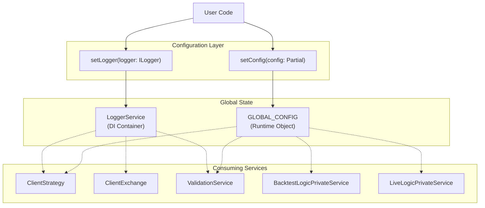
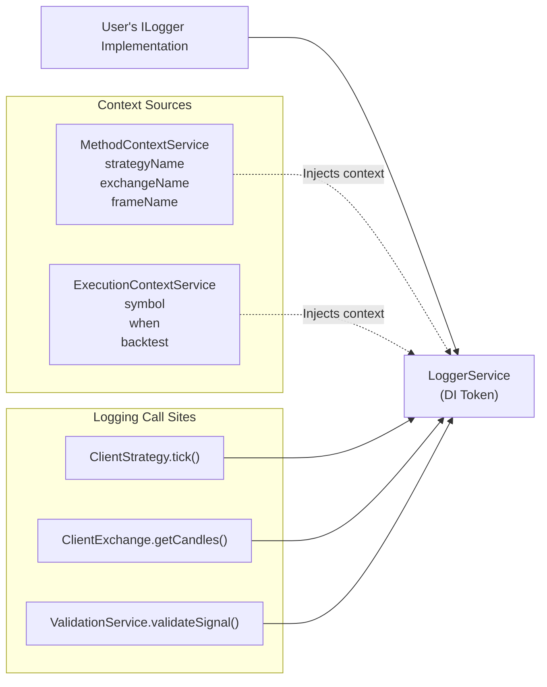
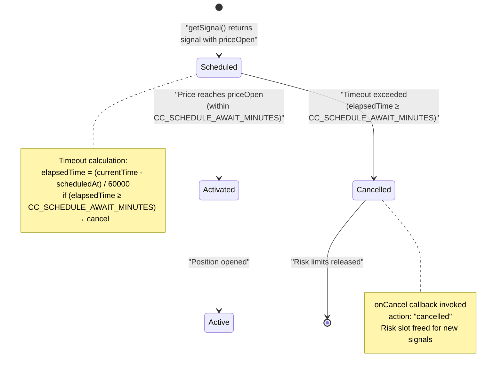
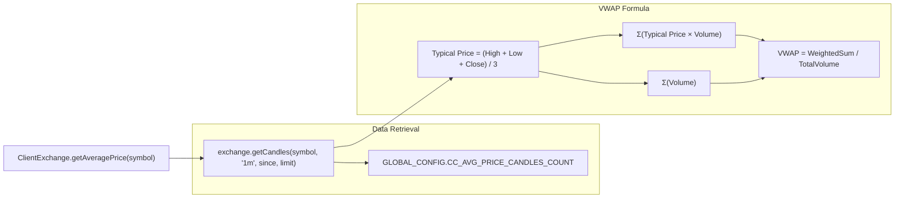
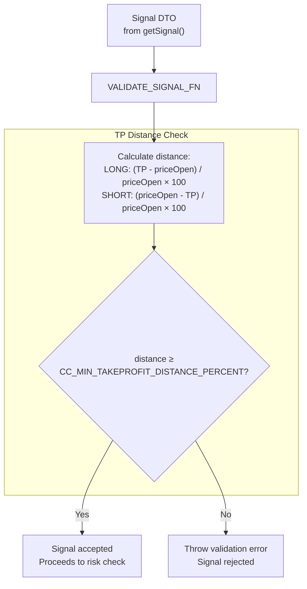
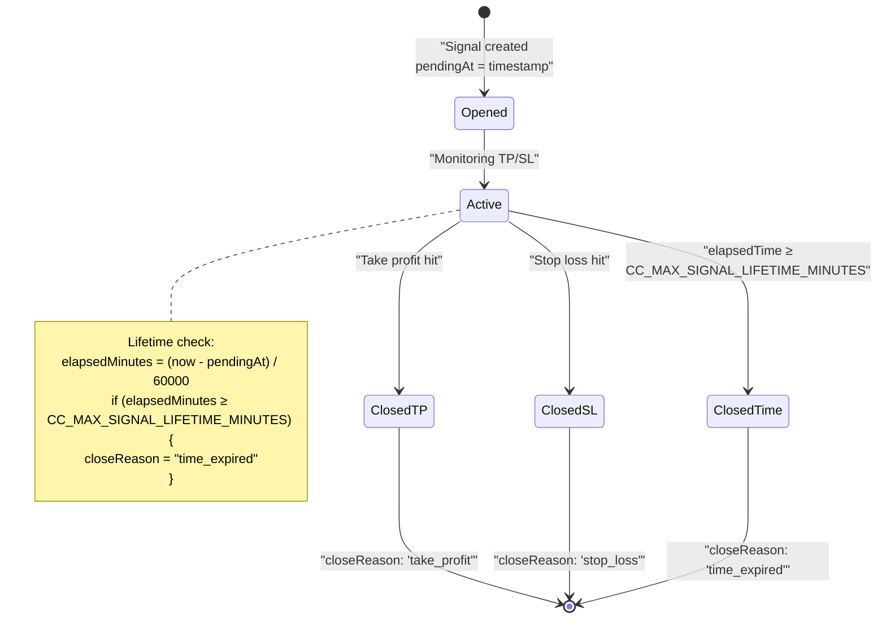
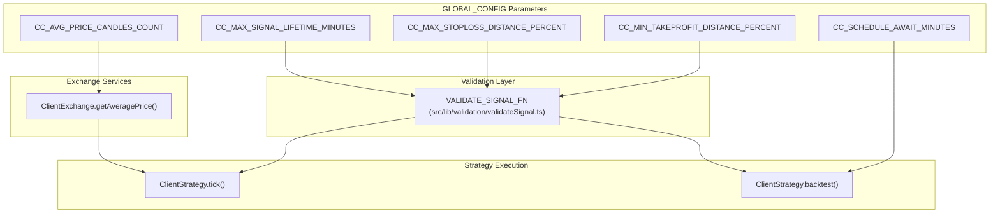

# Configuration Functions

## Purpose and Scope

This page documents the two primary configuration functions exposed by the framework: `setLogger` and `setConfig`. These functions allow users to customize logging behavior and tune global runtime parameters that affect signal validation, timing constraints, and price monitoring.

For information about component registration functions (`addStrategy`, `addExchange`, etc.), see [Component Registration Functions](#4.2). For execution mode APIs, see [Backtest API](#4.3), [Live Trading API](#4.4), and [Walker API](#4.5).

---

## Overview: Configuration Architecture

The framework provides two distinct configuration mechanisms that operate independently:



**Sources:** [src/config/params.ts:1-35](), [types.d.ts:5-97](), [src/index.ts:1]()

---

## setLogger Function

### Function Signature

```typescript
declare function setLogger(logger: ILogger): Promise<void>;
```

### ILogger Interface

The `ILogger` interface defines four logging severity levels. All methods accept a topic string followed by variadic arguments:

| Method | Purpose | Usage Context |
|--------|---------|---------------|
| `log(topic, ...args)` | General-purpose messages | Strategy execution, signal generation |
| `debug(topic, ...args)` | Detailed diagnostic output | Intermediate states, context resolution |
| `info(topic, ...args)` | Informational updates | Successful operations, completions |
| `warn(topic, ...args)` | Potentially problematic situations | Missing data, unexpected conditions |

**Sources:** [types.d.ts:45-66]()

### Automatic Context Injection

When a logger is registered, the framework automatically injects contextual metadata into all log calls:



**Sources:** [types.d.ts:69-84](), [src/lib/services/context/ExecutionContextService.ts](), [src/lib/services/context/MethodContextService.ts]()

### Usage Example

```typescript
import { setLogger } from 'backtest-kit';

// Basic console logger
await setLogger({
  log: (topic, ...args) => console.log(`[LOG] ${topic}`, ...args),
  debug: (topic, ...args) => console.debug(`[DEBUG] ${topic}`, ...args),
  info: (topic, ...args) => console.info(`[INFO] ${topic}`, ...args),
  warn: (topic, ...args) => console.warn(`[WARN] ${topic}`, ...args),
});

// Custom structured logger
await setLogger({
  log: (topic, ...args) => {
    const timestamp = new Date().toISOString();
    console.log(JSON.stringify({ timestamp, level: 'log', topic, data: args }));
  },
  debug: (topic, ...args) => { /* similar */ },
  info: (topic, ...args) => { /* similar */ },
  warn: (topic, ...args) => { /* similar */ },
});
```

**Sources:** [types.d.ts:76-83](), [test/config/setup.mjs:1-5]()

---

## setConfig Function

### Function Signature

```typescript
declare function setConfig(config: Partial<GlobalConfig>): Promise<void>;

type GlobalConfig = {
  CC_SCHEDULE_AWAIT_MINUTES: number;
  CC_AVG_PRICE_CANDLES_COUNT: number;
  CC_MIN_TAKEPROFIT_DISTANCE_PERCENT: number;
  CC_MAX_STOPLOSS_DISTANCE_PERCENT: number;
  CC_MAX_SIGNAL_LIFETIME_MINUTES: number;
};
```

### Partial Update Semantics

The `setConfig` function accepts a `Partial<GlobalConfig>` object, allowing selective parameter overrides without modifying unspecified values. This enables targeted tuning for specific behaviors:

```typescript
import { setConfig } from 'backtest-kit';

// Override only scheduled signal timeout
await setConfig({
  CC_SCHEDULE_AWAIT_MINUTES: 90,
});

// Override multiple validation parameters
await setConfig({
  CC_MIN_TAKEPROFIT_DISTANCE_PERCENT: 0.5,
  CC_MAX_STOPLOSS_DISTANCE_PERCENT: 15,
});
```

**Sources:** [types.d.ts:86-97](), [src/config/params.ts:1-35]()

### Runtime Modification Warning

Configuration changes apply immediately to all subsequent operations. Modifying parameters mid-execution (e.g., during a backtest) may cause inconsistent behavior. **Best practice:** Call `setConfig` once during application initialization, before any component registration or execution.

**Sources:** [test/config/setup.mjs:36-41]()

---

## Global Configuration Parameters

### Parameter Reference Table

| Parameter | Default | Type | Category | Validated By |
|-----------|---------|------|----------|--------------|
| `CC_SCHEDULE_AWAIT_MINUTES` | `120` | `number` | Timing | `ClientStrategy.backtest()` |
| `CC_AVG_PRICE_CANDLES_COUNT` | `5` | `number` | Monitoring | `ClientExchange.getAveragePrice()` |
| `CC_MIN_TAKEPROFIT_DISTANCE_PERCENT` | `0.1` | `number` | Validation | `VALIDATE_SIGNAL_FN` |
| `CC_MAX_STOPLOSS_DISTANCE_PERCENT` | `20` | `number` | Validation | `VALIDATE_SIGNAL_FN` |
| `CC_MAX_SIGNAL_LIFETIME_MINUTES` | `1440` | `number` | Validation | `VALIDATE_SIGNAL_FN` |

**Sources:** [src/config/params.ts:1-30](), [types.d.ts:5-34]()

---

## CC_SCHEDULE_AWAIT_MINUTES

**Default:** `120` minutes (2 hours)

**Purpose:** Maximum time a scheduled signal (with `priceOpen` specified) will wait for price activation before cancellation.

### Behavior Flow



### Impact on Risk Management

Scheduled signals occupy risk slots (counted against `maxConcurrentPositions`) even before activation. If `CC_SCHEDULE_AWAIT_MINUTES` is too high, strategies may experience deadlock where all risk slots are blocked by stale scheduled signals.

### Example: Adjusting Timeout

```typescript
// Conservative: short timeout to free risk slots quickly
await setConfig({
  CC_SCHEDULE_AWAIT_MINUTES: 30, // 30 minutes
});

// Aggressive: long timeout for volatile markets
await setConfig({
  CC_SCHEDULE_AWAIT_MINUTES: 240, // 4 hours
});
```

**Sources:** [src/config/params.ts:2-6](), [types.d.ts:5-10](), [test/e2e/defend.test.mjs:445-536]()

---

## CC_AVG_PRICE_CANDLES_COUNT

**Default:** `5` candles

**Purpose:** Number of recent 1-minute candles used to calculate Volume-Weighted Average Price (VWAP) for real-time price monitoring.

### VWAP Calculation Flow



### Trade-offs

| Value | Responsiveness | Noise Reduction | Use Case |
|-------|----------------|-----------------|----------|
| `1-3` | High | Low | Scalping, high-frequency strategies |
| `5-10` | Medium | Medium | Standard strategies (default) |
| `15+` | Low | High | Swing trading, low-frequency strategies |

### Example: Sensitivity Tuning

```typescript
// High-frequency strategy: react to recent price changes
await setConfig({
  CC_AVG_PRICE_CANDLES_COUNT: 2,
});

// Swing trading: smooth out noise
await setConfig({
  CC_AVG_PRICE_CANDLES_COUNT: 20,
});
```

**Sources:** [src/config/params.ts:7-10](), [types.d.ts:11-15](), [types.d.ts:262-270]()

---

## CC_MIN_TAKEPROFIT_DISTANCE_PERCENT

**Default:** `0.1%`

**Purpose:** Minimum distance between `priceOpen` and `priceTakeProfit` as a percentage. Prevents signals where profit would be consumed by trading fees and slippage.

### Fee Calculation Context

The framework applies **0.1% fee** + **0.1% slippage** = **0.2% total cost** on both entry and exit. Therefore, minimum profitable distance is `0.2% × 2 = 0.4%`. Default `0.1%` is **dangerously low** and exists for legacy compatibility.

### Validation Logic



### Recommended Settings

```typescript
// Conservative: ensure profitable trades after fees
await setConfig({
  CC_MIN_TAKEPROFIT_DISTANCE_PERCENT: 0.5, // 0.5% minimum
});

// Aggressive: allow tighter TPs (risky)
await setConfig({
  CC_MIN_TAKEPROFIT_DISTANCE_PERCENT: 0.3, // 0.3% minimum
});

// Disable validation (not recommended)
await setConfig({
  CC_MIN_TAKEPROFIT_DISTANCE_PERCENT: 0,
});
```

**Sources:** [src/config/params.ts:11-17](), [types.d.ts:16-21](), [test/e2e/sanitize.test.mjs:17-131]()

---

## CC_MAX_STOPLOSS_DISTANCE_PERCENT

**Default:** `20%`

**Purpose:** Maximum distance between `priceOpen` and `priceStopLoss` as a percentage. Prevents catastrophic losses from extreme StopLoss values.

### Risk Protection Mechanism

```mermaid
graph TB
    Signal["Signal DTO<br/>from getSignal()"]
    
    ValidateSignal["VALIDATE_SIGNAL_FN"]
    
    subgraph "SL Distance Check"
        CalcDistance["Calculate distance:<br/>LONG: (priceOpen - SL) / priceOpen × 100<br/>SHORT: (SL - priceOpen) / priceOpen × 100"]
        
        CompareMax{"distance ≤<br/>CC_MAX_STOPLOSS_DISTANCE_PERCENT?"}
    end
    
    Accept["Signal accepted<br/>Maximum 20% loss per signal"]
    Reject["Throw validation error<br/>Signal rejected<br/>(risk too high)"]
    
    Signal --> ValidateSignal
    ValidateSignal --> CalcDistance
    CalcDistance --> CompareMax
    
    CompareMax -->|"Yes"| Accept
    CompareMax -->|"No"| Reject
    
    note right of Reject
        Prevents scenarios like:
        priceOpen=42000, SL=20000
        = 52% loss on single signal
    end note
```

### Portfolio Impact

If using 10% position sizing and `CC_MAX_STOPLOSS_DISTANCE_PERCENT = 20`:
- Maximum single-trade loss: `10% × 20% = 2%` of total portfolio
- 5 consecutive losses: `5 × 2% = 10%` portfolio drawdown

### Example: Tightening Risk Controls

```typescript
// Conservative: limit max loss to 10% per signal
await setConfig({
  CC_MAX_STOPLOSS_DISTANCE_PERCENT: 10,
});

// Very aggressive: allow up to 30% loss (dangerous)
await setConfig({
  CC_MAX_STOPLOSS_DISTANCE_PERCENT: 30,
});

// Disable validation (highly dangerous)
await setConfig({
  CC_MAX_STOPLOSS_DISTANCE_PERCENT: 100,
});
```

**Sources:** [src/config/params.ts:18-23](), [types.d.ts:22-27](), [test/e2e/sanitize.test.mjs:133-238]()

---

## CC_MAX_SIGNAL_LIFETIME_MINUTES

**Default:** `1440` minutes (1 day)

**Purpose:** Maximum duration a signal can remain active before forced closure via `time_expired` reason. Prevents "eternal signals" that block risk limits indefinitely.

### Lifetime Tracking and Enforcement



### Risk Slot Deadlock Prevention

Without lifetime limits, a single signal with unreachable TP/SL could occupy a risk slot forever, preventing the strategy from generating new signals. This is critical for strategies with low `maxConcurrentPositions` values.

### Example: Adjusting Lifetime Limits

```typescript
// Day trading: force closure after 4 hours
await setConfig({
  CC_MAX_SIGNAL_LIFETIME_MINUTES: 240, // 4 hours
});

// Swing trading: allow multi-day positions
await setConfig({
  CC_MAX_SIGNAL_LIFETIME_MINUTES: 7200, // 5 days
});

// Disable validation (testing only, not production)
await setConfig({
  CC_MAX_SIGNAL_LIFETIME_MINUTES: 999999,
});
```

**Sources:** [src/config/params.ts:24-30](), [types.d.ts:28-34](), [test/e2e/sanitize.test.mjs:240-348]()

---

## Configuration Dependencies Map

The following diagram shows which framework components consume each configuration parameter:



**Sources:** [src/config/params.ts:1-35](), [types.d.ts:5-34]()

---

## Testing Configuration Changes

Configuration parameters are thoroughly tested in the test suite:

| Test File | Parameters Tested | Purpose |
|-----------|------------------|---------|
| `test/e2e/config.test.mjs` | All 5 parameters | End-to-end configuration validation |
| `test/e2e/sanitize.test.mjs` | `CC_MIN_TAKEPROFIT_DISTANCE_PERCENT`<br/>`CC_MAX_STOPLOSS_DISTANCE_PERCENT`<br/>`CC_MAX_SIGNAL_LIFETIME_MINUTES` | Signal sanitization edge cases |
| `test/e2e/defend.test.mjs` | `CC_SCHEDULE_AWAIT_MINUTES` | Scheduled signal timeout behavior |
| `test/config/setup.mjs` | Global setup | Test environment configuration |

**Sources:** [test/e2e/config.test.mjs:1](), [test/e2e/sanitize.test.mjs:1-660](), [test/e2e/defend.test.mjs:1-950](), [test/config/setup.mjs:36-41]()

---

## Best Practices

### 1. Initialize Early

```typescript
import { setLogger, setConfig } from 'backtest-kit';

// Configure BEFORE registering components
await setLogger(myLogger);
await setConfig(myConfig);

// Then register strategies/exchanges
addStrategy({ /* ... */ });
addExchange({ /* ... */ });
```

### 2. Validate Configuration Combinations

Ensure `CC_MIN_TAKEPROFIT_DISTANCE_PERCENT` accounts for total fees:

```typescript
const TOTAL_FEES_PERCENT = 0.2; // 0.1% fee + 0.1% slippage, both directions

await setConfig({
  // Minimum TP distance should exceed total fees
  CC_MIN_TAKEPROFIT_DISTANCE_PERCENT: TOTAL_FEES_PERCENT * 1.5, // 0.3%
});
```

### 3. Match Configuration to Strategy Type

```typescript
// Scalping strategy
await setConfig({
  CC_AVG_PRICE_CANDLES_COUNT: 2, // Fast response
  CC_MAX_SIGNAL_LIFETIME_MINUTES: 60, // 1-hour max
  CC_SCHEDULE_AWAIT_MINUTES: 15, // Short activation window
});

// Swing trading strategy
await setConfig({
  CC_AVG_PRICE_CANDLES_COUNT: 15, // Smooth noise
  CC_MAX_SIGNAL_LIFETIME_MINUTES: 10080, // 7 days max
  CC_SCHEDULE_AWAIT_MINUTES: 480, // 8-hour activation window
});
```

### 4. Disable Validations for Testing Only

```typescript
// Development/testing environment
if (process.env.NODE_ENV === 'test') {
  await setConfig({
    CC_MIN_TAKEPROFIT_DISTANCE_PERCENT: 0,
    CC_MAX_STOPLOSS_DISTANCE_PERCENT: 100,
    CC_MAX_SIGNAL_LIFETIME_MINUTES: 999999,
  });
}
```

**Sources:** [test/config/setup.mjs:36-41](), [test/e2e/sanitize.test.mjs:17-131]()