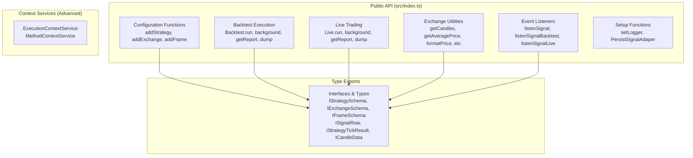
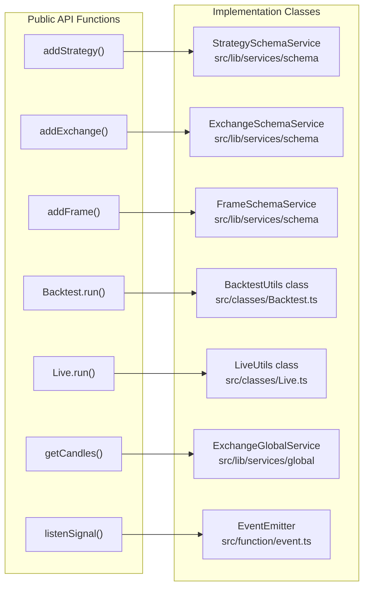

# Public API Reference

<details>
<summary>Relevant source files</summary>

The following files were used as context for generating this wiki page:

- [docs/classes/BacktestUtils.md](docs/classes/BacktestUtils.md)
- [docs/classes/LiveUtils.md](docs/classes/LiveUtils.md)
- [docs/classes/StrategyConnectionService.md](docs/classes/StrategyConnectionService.md)
- [docs/classes/WalkerUtils.md](docs/classes/WalkerUtils.md)
- [docs/index.md](docs/index.md)
- [docs/interfaces/IStrategySchema.md](docs/interfaces/IStrategySchema.md)
- [docs/interfaces/WalkerStopContract.md](docs/interfaces/WalkerStopContract.md)
- [docs/types/IStrategyBacktestResult.md](docs/types/IStrategyBacktestResult.md)
- [docs/types/TPersistBaseCtor.md](docs/types/TPersistBaseCtor.md)
- [src/config/emitters.ts](src/config/emitters.ts)
- [src/function/event.ts](src/function/event.ts)
- [src/index.ts](src/index.ts)
- [types.d.ts](types.d.ts)

</details>


This page provides a comprehensive reference for all public-facing functions and utilities exposed by the backtest-kit framework. These are the functions users directly interact with to configure strategies, execute backtests/live trading, and monitor results.

For detailed implementation details of the underlying service architecture, see [Architecture](#2). For specific execution patterns, see [Backtest API](#3.2) and [Live Trading API](#3.3).

## Public API Structure

The public API is organized into six functional groups, all exported from the main entry point:



**Public API Groups:**

| Group | Purpose | Key Functions |
|-------|---------|---------------|
| **Configuration** | Register strategies, exchanges, and timeframes | `addStrategy()`, `addExchange()`, `addFrame()` |
| **Backtest Execution** | Run historical backtests and generate reports | `Backtest.run()`, `Backtest.background()`, `Backtest.getReport()`, `Backtest.dump()` |
| **Live Trading** | Execute live trading with crash recovery | `Live.run()`, `Live.background()`, `Live.getReport()`, `Live.dump()` |
| **Exchange Utilities** | Access market data and execution context | `getCandles()`, `getAveragePrice()`, `getDate()`, `getMode()`, `formatPrice()`, `formatQuantity()` |
| **Event Listeners** | Subscribe to signal lifecycle events | `listenSignal()`, `listenSignalBacktest()`, `listenSignalLive()`, and `Once` variants |
| **Setup Functions** | Configure framework behavior | `setLogger()`, `PersistSignalAdaper.usePersistSignalAdapter()` |

**Sources:** [src/index.ts:1-56](), [types.d.ts:1-1410]()

## API Function Mapping

This diagram maps public API functions to their concrete implementations in the codebase:



**Sources:** [src/index.ts:1-56](), [src/function/add.ts](), [src/classes/Backtest.ts](), [src/classes/Live.ts](), [src/function/exchange.ts](), [src/function/event.ts]()

## Configuration Functions

Functions for registering strategies, exchanges, and timeframes. These must be called before execution begins. See [Configuration Functions](#3.1) for detailed documentation.

### addStrategy()

Registers a trading strategy in the framework with signal generation logic, validation, and lifecycle callbacks.

```typescript
function addStrategy(strategySchema: IStrategySchema): void
```

**Parameters:**

| Parameter | Type | Description |
|-----------|------|-------------|
| `strategySchema` | `IStrategySchema` | Strategy configuration object |
| `strategySchema.strategyName` | `string` | Unique strategy identifier |
| `strategySchema.interval` | `SignalInterval` | Throttling interval: `"1m"` \| `"3m"` \| `"5m"` \| `"15m"` \| `"30m"` \| `"1h"` |
| `strategySchema.getSignal` | `(symbol: string) => Promise<ISignalDto \| null>` | Signal generation function |
| `strategySchema.callbacks` | `Partial<IStrategyCallbacks>` | Optional lifecycle callbacks (`onTick`, `onOpen`, `onActive`, `onIdle`, `onClose`) |

**Returns:** `void` (throws error if validation fails)

**Example:**

```typescript
addStrategy({
  strategyName: "momentum-strategy",
  interval: "5m",
  getSignal: async (symbol) => {
    // Signal generation logic
    return {
      position: "long",
      priceOpen: 50000,
      priceTakeProfit: 51000,
      priceStopLoss: 49000,
      minuteEstimatedTime: 60,
    };
  },
  callbacks: {
    onOpen: (symbol, signal, currentPrice, backtest) => {
      console.log(`Signal opened: ${signal.id}`);
    },
  },
});
```

**Sources:** [types.d.ts:409-422](), [types.d.ts:546-579](), [src/function/add.ts]()

### addExchange()

Registers an exchange data source with candle fetching and price formatting capabilities.

```typescript
function addExchange(exchangeSchema: IExchangeSchema): void
```

**Parameters:**

| Parameter | Type | Description |
|-----------|------|-------------|
| `exchangeSchema` | `IExchangeSchema` | Exchange configuration object |
| `exchangeSchema.exchangeName` | `string` | Unique exchange identifier |
| `exchangeSchema.getCandles` | `(symbol: string, interval: CandleInterval, since: Date, limit: number) => Promise<ICandleData[]>` | Historical candle fetching function |
| `exchangeSchema.formatPrice` | `(symbol: string, price: number) => Promise<string>` | Price formatting function |
| `exchangeSchema.formatQuantity` | `(symbol: string, quantity: number) => Promise<string>` | Quantity formatting function |
| `exchangeSchema.callbacks` | `Partial<IExchangeCallbacks>` | Optional callback for `onCandleData` events |

**Returns:** `void` (throws error if validation fails)

**Example:**

```typescript
addExchange({
  exchangeName: "binance",
  getCandles: async (symbol, interval, since, limit) => {
    // Fetch from API or database
    return [{
      timestamp: Date.now(),
      open: 50000,
      high: 51000,
      low: 49000,
      close: 50500,
      volume: 1000,
    }];
  },
  formatPrice: async (symbol, price) => price.toFixed(2),
  formatQuantity: async (symbol, quantity) => quantity.toFixed(8),
});
```

**Sources:** [types.d.ts:137-171](), [types.d.ts:580-615](), [src/function/add.ts]()

### addFrame()

Registers a timeframe generator for backtest period definition with interval-based timestamp generation.

```typescript
function addFrame(frameSchema: IFrameSchema): void
```

**Parameters:**

| Parameter | Type | Description |
|-----------|------|-------------|
| `frameSchema` | `IFrameSchema` | Frame configuration object |
| `frameSchema.frameName` | `string` | Unique frame identifier |
| `frameSchema.interval` | `FrameInterval` | Timeframe interval: `"1m"` \| `"3m"` \| `"5m"` \| `"15m"` \| `"30m"` \| `"1h"` \| `"2h"` \| `"4h"` \| `"6h"` \| `"8h"` \| `"12h"` \| `"1d"` \| `"3d"` |
| `frameSchema.startDate` | `Date` | Start of backtest period (inclusive) |
| `frameSchema.endDate` | `Date` | End of backtest period (inclusive) |
| `frameSchema.callbacks` | `Partial<IFrameCallbacks>` | Optional callback for `onTimeframe` events |

**Returns:** `void` (throws error if validation fails)

**Example:**

```typescript
addFrame({
  frameName: "week-backtest",
  interval: "1m",
  startDate: new Date("2024-01-01T00:00:00Z"),
  endDate: new Date("2024-01-07T23:59:59Z"),
  callbacks: {
    onTimeframe: (timeframe, startDate, endDate, interval) => {
      console.log(`Generated ${timeframe.length} timestamps`);
    },
  },
});
```

**Sources:** [types.d.ts:259-289](), [types.d.ts:617-646](), [src/function/add.ts]()

## Backtest Execution API

The `Backtest` singleton provides methods for running backtests and generating reports. See [Backtest API](#3.2) for detailed documentation.

### Backtest.run()

Executes a backtest as an async generator, yielding closed signals as they complete. Memory-efficient streaming architecture.

```typescript
Backtest.run(
  symbol: string,
  context: {
    strategyName: string;
    exchangeName: string;
    frameName: string;
  }
): AsyncGenerator<IStrategyTickResultClosed>
```

**Parameters:**

| Parameter | Type | Description |
|-----------|------|-------------|
| `symbol` | `string` | Trading pair symbol (e.g., `"BTCUSDT"`) |
| `context.strategyName` | `string` | Registered strategy name |
| `context.exchangeName` | `string` | Registered exchange name |
| `context.frameName` | `string` | Registered frame name |

**Returns:** `AsyncGenerator<IStrategyTickResultClosed>` - Generator yielding closed signals with PNL

**Example:**

```typescript
for await (const result of Backtest.run("BTCUSDT", {
  strategyName: "momentum-strategy",
  exchangeName: "binance",
  frameName: "week-backtest"
})) {
  console.log({
    action: result.action,          // "closed"
    reason: result.closeReason,     // "take_profit" | "stop_loss" | "time_expired"
    pnl: result.pnl.pnlPercentage,  // e.g., +2.5%
  });
  
  // Early termination
  if (result.pnl.pnlPercentage < -5) break;
}
```

**Sources:** [types.d.ts:1127-1233](), [src/classes/Backtest.ts]()

### Backtest.background()

Runs a backtest in background without yielding results. Useful for executing backtests for side effects only (callbacks, logging). Returns a cancellation function.

```typescript
Backtest.background(
  symbol: string,
  context: {
    strategyName: string;
    exchangeName: string;
    frameName: string;
  }
): Promise<() => void>
```

**Parameters:** Same as `Backtest.run()`

**Returns:** `Promise<() => void>` - Promise resolving to a cancellation function

**Example:**

```typescript
const cancel = await Backtest.background("BTCUSDT", {
  strategyName: "momentum-strategy",
  exchangeName: "binance",
  frameName: "week-backtest"
});

// Cancel execution if needed
setTimeout(() => cancel(), 10000);
```

**Sources:** [types.d.ts:1165-1185](), [src/classes/Backtest.ts]()

### Backtest.getReport()

Generates a markdown-formatted report with all closed signals and performance statistics.

```typescript
Backtest.getReport(strategyName: string): Promise<string>
```

**Parameters:**

| Parameter | Type | Description |
|-----------|------|-------------|
| `strategyName` | `string` | Strategy name to generate report for |

**Returns:** `Promise<string>` - Markdown-formatted report

**Example:**

```typescript
const markdown = await Backtest.getReport("momentum-strategy");
console.log(markdown);
```

**Sources:** [types.d.ts:1186-1197](), [src/classes/Backtest.ts]()

### Backtest.dump()

Saves the strategy report to disk at the specified path (default: `./logs/backtest/`).

```typescript
Backtest.dump(strategyName: string, path?: string): Promise<void>
```

**Parameters:**

| Parameter | Type | Description |
|-----------|------|-------------|
| `strategyName` | `string` | Strategy name to save report for |
| `path` | `string` (optional) | Directory path (default: `"./logs/backtest"`) |

**Returns:** `Promise<void>`

**Example:**

```typescript
// Save to default path: ./logs/backtest/momentum-strategy.md
await Backtest.dump("momentum-strategy");

// Save to custom path
await Backtest.dump("momentum-strategy", "./reports");
```

**Sources:** [types.d.ts:1198-1214](), [src/classes/Backtest.ts]()

## Live Trading API

The `Live` singleton provides methods for live trading execution with crash recovery. See [Live Trading API](#3.3) for detailed documentation.

### Live.run()

Executes live trading as an infinite async generator, yielding opened and closed signals. Process can crash and restart—state is recovered from disk.

```typescript
Live.run(
  symbol: string,
  context: {
    strategyName: string;
    exchangeName: string;
  }
): AsyncGenerator<IStrategyTickResultOpened | IStrategyTickResultClosed>
```

**Parameters:**

| Parameter | Type | Description |
|-----------|------|-------------|
| `symbol` | `string` | Trading pair symbol (e.g., `"BTCUSDT"`) |
| `context.strategyName` | `string` | Registered strategy name |
| `context.exchangeName` | `string` | Registered exchange name |

**Returns:** `AsyncGenerator<IStrategyTickResultOpened | IStrategyTickResultClosed>` - Infinite generator yielding signal events

**Example:**

```typescript
// Infinite loop - use Ctrl+C to stop
for await (const result of Live.run("BTCUSDT", {
  strategyName: "momentum-strategy",
  exchangeName: "binance"
})) {
  if (result.action === "opened") {
    console.log("Signal opened:", result.signal.id);
  }
  if (result.action === "closed") {
    console.log("PNL:", result.pnl.pnlPercentage);
  }
}
```

**Sources:** [types.d.ts:1236-1349](), [src/classes/Live.ts]()

### Live.background()

Runs live trading in background without yielding results. Infinite loop runs until process stops or crashes. Returns a cancellation function.

```typescript
Live.background(
  symbol: string,
  context: {
    strategyName: string;
    exchangeName: string;
  }
): Promise<() => void>
```

**Parameters:** Same as `Live.run()`

**Returns:** `Promise<() => void>` - Promise resolving to a cancellation function

**Example:**

```typescript
const cancel = await Live.background("BTCUSDT", {
  strategyName: "momentum-strategy",
  exchangeName: "binance"
});

// Cancel when needed
process.on('SIGTERM', () => cancel());
```

**Sources:** [types.d.ts:1280-1303](), [src/classes/Live.ts]()

### Live.getReport()

Generates a markdown-formatted report with all live trading events and performance statistics (win rate, average PNL).

```typescript
Live.getReport(strategyName: string): Promise<string>
```

**Parameters:**

| Parameter | Type | Description |
|-----------|------|-------------|
| `strategyName` | `string` | Strategy name to generate report for |

**Returns:** `Promise<string>` - Markdown-formatted report

**Example:**

```typescript
const markdown = await Live.getReport("momentum-strategy");
console.log(markdown);
```

**Sources:** [types.d.ts:1304-1316](), [src/classes/Live.ts]()

### Live.dump()

Saves the live trading report to disk at the specified path (default: `./logs/live/`).

```typescript
Live.dump(strategyName: string, path?: string): Promise<void>
```

**Parameters:**

| Parameter | Type | Description |
|-----------|------|-------------|
| `strategyName` | `string` | Strategy name to save report for |
| `path` | `string` (optional) | Directory path (default: `"./logs/live"`) |

**Returns:** `Promise<void>`

**Example:**

```typescript
// Save to default path: ./logs/live/momentum-strategy.md
await Live.dump("momentum-strategy");

// Save to custom path
await Live.dump("momentum-strategy", "./live-reports");
```

**Sources:** [types.d.ts:1317-1333](), [src/classes/Live.ts]()

## Exchange Utility Functions

Utility functions for accessing market data and execution context. These functions use the current `ExecutionContextService` and `MethodContextService` for implicit context propagation. See [Exchange Functions](#3.4) for detailed documentation.

### getCandles()

Fetches historical candle data backwards from the current execution context time. Uses the registered exchange's `getCandles` implementation.

```typescript
function getCandles(
  symbol: string,
  interval: CandleInterval,
  limit: number
): Promise<ICandleData[]>
```

**Parameters:**

| Parameter | Type | Description |
|-----------|------|-------------|
| `symbol` | `string` | Trading pair symbol (e.g., `"BTCUSDT"`) |
| `interval` | `CandleInterval` | Candle interval: `"1m"` \| `"3m"` \| `"5m"` \| `"15m"` \| `"30m"` \| `"1h"` \| `"2h"` \| `"4h"` \| `"6h"` \| `"8h"` |
| `limit` | `number` | Number of candles to fetch |

**Returns:** `Promise<ICandleData[]>` - Array of OHLCV candle data

**Example:**

```typescript
const candles = await getCandles("BTCUSDT", "1h", 100);
candles.forEach(candle => {
  console.log({
    timestamp: candle.timestamp,
    close: candle.close,
    volume: candle.volume
  });
});
```

**Sources:** [types.d.ts:794-811](), [src/function/exchange.ts]()

### getAveragePrice()

Calculates VWAP (Volume Weighted Average Price) from the last 5 1-minute candles using the formula:
- Typical Price = (high + low + close) / 3
- VWAP = Σ(typical_price × volume) / Σ(volume)

If volume is zero, returns simple average of close prices.

```typescript
function getAveragePrice(symbol: string): Promise<number>
```

**Parameters:**

| Parameter | Type | Description |
|-----------|------|-------------|
| `symbol` | `string` | Trading pair symbol (e.g., `"BTCUSDT"`) |

**Returns:** `Promise<number>` - VWAP price

**Example:**

```typescript
const vwap = await getAveragePrice("BTCUSDT");
console.log("Current VWAP:", vwap);
```

**Sources:** [types.d.ts:812-830](), [src/function/exchange.ts]()

### formatPrice()

Formats a price value according to the exchange's precision rules. Uses the registered exchange's `formatPrice` implementation.

```typescript
function formatPrice(symbol: string, price: number): Promise<string>
```

**Parameters:**

| Parameter | Type | Description |
|-----------|------|-------------|
| `symbol` | `string` | Trading pair symbol (e.g., `"BTCUSDT"`) |
| `price` | `number` | Raw price value |

**Returns:** `Promise<string>` - Formatted price string

**Example:**

```typescript
const formatted = await formatPrice("BTCUSDT", 50000.123456);
console.log(formatted); // "50000.12"
```

**Sources:** [types.d.ts:831-846](), [src/function/exchange.ts]()

### formatQuantity()

Formats a quantity value according to the exchange's precision rules. Uses the registered exchange's `formatQuantity` implementation.

```typescript
function formatQuantity(symbol: string, quantity: number): Promise<string>
```

**Parameters:**

| Parameter | Type | Description |
|-----------|------|-------------|
| `symbol` | `string` | Trading pair symbol (e.g., `"BTCUSDT"`) |
| `quantity` | `number` | Raw quantity value |

**Returns:** `Promise<string>` - Formatted quantity string

**Example:**

```typescript
const formatted = await formatQuantity("BTCUSDT", 0.123456789);
console.log(formatted); // "0.12345678"
```

**Sources:** [types.d.ts:847-862](), [src/function/exchange.ts]()

### getDate()

Gets the current date from the execution context. In backtest mode, returns the current timeframe date being processed. In live mode, returns the current real-time date.

```typescript
function getDate(): Promise<Date>
```

**Returns:** `Promise<Date>` - Current execution context date

**Example:**

```typescript
const date = await getDate();
console.log("Execution date:", date.toISOString());
```

**Sources:** [types.d.ts:863-877](), [src/function/exchange.ts]()

### getMode()

Gets the current execution mode (backtest or live).

```typescript
function getMode(): Promise<"backtest" | "live">
```

**Returns:** `Promise<"backtest" | "live">` - Current execution mode

**Example:**

```typescript
const mode = await getMode();
if (mode === "backtest") {
  console.log("Running historical simulation");
} else {
  console.log("Running live trading");
}
```

**Sources:** [types.d.ts:878-893](), [src/function/exchange.ts]()

## Event Listeners

Functions for subscribing to signal lifecycle events. All callbacks are processed sequentially using queued async execution. See [Event Listeners](#3.5) for detailed documentation.

### Event Listener Functions

| Function | Description | Returns |
|----------|-------------|---------|
| `listenSignal(fn)` | Subscribe to all signal events (backtest + live) | `() => void` (unsubscribe function) |
| `listenSignalOnce(filterFn, fn)` | Subscribe once with filter predicate | `() => void` (unsubscribe function) |
| `listenSignalBacktest(fn)` | Subscribe to backtest signals only | `() => void` (unsubscribe function) |
| `listenSignalBacktestOnce(filterFn, fn)` | Subscribe to backtest signals once | `() => void` (unsubscribe function) |
| `listenSignalLive(fn)` | Subscribe to live signals only | `() => void` (unsubscribe function) |
| `listenSignalLiveOnce(filterFn, fn)` | Subscribe to live signals once | `() => void` (unsubscribe function) |

### listenSignal()

Subscribes to all signal events with queued async processing. Receives events from both backtest and live execution.

```typescript
function listenSignal(
  fn: (event: IStrategyTickResult) => void
): () => void
```

**Parameters:**

| Parameter | Type | Description |
|-----------|------|-------------|
| `fn` | `(event: IStrategyTickResult) => void` | Callback function to handle signal events |

**Returns:** `() => void` - Unsubscribe function

**Example:**

```typescript
const unsubscribe = listenSignal((event) => {
  if (event.action === "opened") {
    console.log("New signal:", event.signal.id);
  }
  if (event.action === "closed") {
    console.log("PNL:", event.pnl.pnlPercentage);
  }
});

// Stop listening later
unsubscribe();
```

**Sources:** [types.d.ts:648-673](), [src/function/event.ts]()

### listenSignalOnce()

Subscribes to filtered signal events with one-time execution. Executes callback once when filter predicate matches, then automatically unsubscribes.

```typescript
function listenSignalOnce(
  filterFn: (event: IStrategyTickResult) => boolean,
  fn: (event: IStrategyTickResult) => void
): () => void
```

**Parameters:**

| Parameter | Type | Description |
|-----------|------|-------------|
| `filterFn` | `(event: IStrategyTickResult) => boolean` | Predicate to filter which events trigger the callback |
| `fn` | `(event: IStrategyTickResult) => void` | Callback function (called only once) |

**Returns:** `() => void` - Unsubscribe function (to cancel before event fires)

**Example:**

```typescript
// Wait for first take profit hit
listenSignalOnce(
  (event) => event.action === "closed" && event.closeReason === "take_profit",
  (event) => {
    console.log("Take profit hit! PNL:", event.pnl.pnlPercentage);
  }
);
```

**Sources:** [types.d.ts:674-706](), [src/function/event.ts]()

### listenSignalBacktest()

Subscribes to backtest signal events only. Only receives events from `Backtest.run()` execution.

```typescript
function listenSignalBacktest(
  fn: (event: IStrategyTickResult) => void
): () => void
```

**Example:**

```typescript
const unsubscribe = listenSignalBacktest((event) => {
  if (event.action === "closed") {
    console.log("Backtest signal closed:", event.closeReason);
  }
});
```

**Sources:** [types.d.ts:750-770](), [src/function/event.ts]()

### listenSignalBacktestOnce()

Subscribes to filtered backtest signal events with one-time execution.

```typescript
function listenSignalBacktestOnce(
  filterFn: (event: IStrategyTickResult) => boolean,
  fn: (event: IStrategyTickResult) => void
): () => void
```

**Example:**

```typescript
// Wait for first backtest stop loss
listenSignalBacktestOnce(
  (event) => event.action === "closed" && event.closeReason === "stop_loss",
  (event) => console.log("Stop loss:", event.pnl.pnlPercentage)
);
```

**Sources:** [types.d.ts:771-792](), [src/function/event.ts]()

### listenSignalLive()

Subscribes to live trading signal events only. Only receives events from `Live.run()` execution.

```typescript
function listenSignalLive(
  fn: (event: IStrategyTickResult) => void
): () => void
```

**Example:**

```typescript
const unsubscribe = listenSignalLive((event) => {
  if (event.action === "closed") {
    console.log("Live signal closed:", event.pnl.pnlPercentage);
  }
});
```

**Sources:** [types.d.ts:707-727](), [src/function/event.ts]()

### listenSignalLiveOnce()

Subscribes to filtered live signal events with one-time execution.

```typescript
function listenSignalLiveOnce(
  filterFn: (event: IStrategyTickResult) => boolean,
  fn: (event: IStrategyTickResult) => void
): () => void
```

**Example:**

```typescript
// Wait for first live take profit
listenSignalLiveOnce(
  (event) => event.action === "closed" && event.closeReason === "take_profit",
  (event) => console.log("Live take profit:", event.pnl.pnlPercentage)
);
```

**Sources:** [types.d.ts:728-749](), [src/function/event.ts]()

## Setup Functions

Functions for configuring framework behavior and customizing implementations.

### setLogger()

Sets a custom logger implementation for the framework. All log messages from internal services are forwarded to the provided logger with automatic context injection (strategyName, exchangeName, symbol, etc.).

```typescript
function setLogger(logger: ILogger): Promise<void>
```

**Parameters:**

| Parameter | Type | Description |
|-----------|------|-------------|
| `logger` | `ILogger` | Custom logger implementing `ILogger` interface |

**ILogger Interface:**

```typescript
interface ILogger {
  log(topic: string, ...args: any[]): void;
  debug(topic: string, ...args: any[]): void;
  info(topic: string, ...args: any[]): void;
  warn(topic: string, ...args: any[]): void;
}
```

**Returns:** `Promise<void>`

**Example:**

```typescript
setLogger({
  log: (topic, ...args) => console.log(`[LOG] ${topic}`, ...args),
  debug: (topic, ...args) => console.debug(`[DEBUG] ${topic}`, ...args),
  info: (topic, ...args) => console.info(`[INFO] ${topic}`, ...args),
  warn: (topic, ...args) => console.warn(`[WARN] ${topic}`, ...args),
});
```

**Sources:** [types.d.ts:32-49](), [src/function/setup.ts]()

### PersistSignalAdaper.usePersistSignalAdapter()

Registers a custom persistence adapter for signal state storage. Default implementation uses file-based atomic writes. Can be replaced with Redis, PostgreSQL, or any custom storage.

```typescript
PersistSignalAdaper.usePersistSignalAdapter(
  Ctor: TPersistBaseCtor<StrategyName, ISignalData>
): void
```

**Parameters:**

| Parameter | Type | Description |
|-----------|------|-------------|
| `Ctor` | `TPersistBaseCtor<StrategyName, ISignalData>` | Custom PersistBase constructor |

**Example:**

```typescript
import { PersistSignalAdaper, PersistBase } from "backtest-kit";

class RedisPersist extends PersistBase {
  async readValue(id) {
    return JSON.parse(await redis.get(id));
  }
  async writeValue(id, entity) {
    await redis.set(id, JSON.stringify(entity));
  }
}

PersistSignalAdaper.usePersistSignalAdapter(RedisPersist);
```

**Sources:** [types.d.ts:1057-1125](), [src/classes/Persist.ts]()

## Type Exports

All TypeScript interfaces and types are exported for type-safe usage. See individual interface documentation for details.

### Core Interfaces

| Interface | Purpose | Documentation |
|-----------|---------|---------------|
| `IStrategySchema` | Strategy configuration schema | [Configuration Functions](#3.1) |
| `IExchangeSchema` | Exchange configuration schema | [Configuration Functions](#3.1) |
| `IFrameSchema` | Frame configuration schema | [Configuration Functions](#3.1) |
| `ISignalDto` | Signal data transfer object | [Signal Generation and Validation](#6.2) |
| `ISignalRow` | Complete signal with auto-generated ID | [Signal States](#6.1) |
| `IStrategyTickResult` | Discriminated union of all tick results | [Signal States](#6.1) |
| `IStrategyPnL` | Profit/loss calculation with fees and slippage | [PnL Calculation](#6.4) |
| `ICandleData` | OHLCV candle data point | [Exchange Functions](#3.4) |

### Type Aliases

| Type | Values | Purpose |
|------|--------|---------|
| `CandleInterval` | `"1m"` \| `"3m"` \| `"5m"` \| `"15m"` \| `"30m"` \| `"1h"` \| `"2h"` \| `"4h"` \| `"6h"` \| `"8h"` | Candle time intervals |
| `SignalInterval` | `"1m"` \| `"3m"` \| `"5m"` \| `"15m"` \| `"30m"` \| `"1h"` | Signal generation throttling intervals |
| `FrameInterval` | `"1m"` \| `"3m"` \| `"5m"` \| `"15m"` \| `"30m"` \| `"1h"` \| `"2h"` \| `"4h"` \| `"6h"` \| `"8h"` \| `"12h"` \| `"1d"` \| `"3d"` | Timeframe generation intervals |
| `StrategyCloseReason` | `"time_expired"` \| `"take_profit"` \| `"stop_loss"` | Signal close reasons |

**Sources:** [types.d.ts:1-1410](), [src/index.ts:20-39]()

## Complete API Usage Example

This example demonstrates the complete lifecycle of using the public API:

```typescript
import {
  addStrategy,
  addExchange,
  addFrame,
  Backtest,
  Live,
  listenSignalBacktest,
  setLogger,
} from "backtest-kit";

// 1. Setup custom logger
setLogger({
  log: (topic, ...args) => console.log(topic, ...args),
  debug: (topic, ...args) => {},
  info: (topic, ...args) => console.info(topic, ...args),
  warn: (topic, ...args) => console.warn(topic, ...args),
});

// 2. Register exchange
addExchange({
  exchangeName: "binance",
  getCandles: async (symbol, interval, since, limit) => {
    // Fetch from Binance API
    return [...];
  },
  formatPrice: async (symbol, price) => price.toFixed(2),
  formatQuantity: async (symbol, quantity) => quantity.toFixed(8),
});

// 3. Register strategy
addStrategy({
  strategyName: "momentum-strategy",
  interval: "5m",
  getSignal: async (symbol) => {
    // Signal generation logic
    return {
      position: "long",
      priceOpen: 50000,
      priceTakeProfit: 51000,
      priceStopLoss: 49000,
      minuteEstimatedTime: 60,
    };
  },
});

// 4. Register frame
addFrame({
  frameName: "week-backtest",
  interval: "1m",
  startDate: new Date("2024-01-01"),
  endDate: new Date("2024-01-07"),
});

// 5. Listen to backtest events
listenSignalBacktest((event) => {
  if (event.action === "closed") {
    console.log("PNL:", event.pnl.pnlPercentage);
  }
});

// 6. Run backtest
for await (const result of Backtest.run("BTCUSDT", {
  strategyName: "momentum-strategy",
  exchangeName: "binance",
  frameName: "week-backtest",
})) {
  console.log("Closed signal:", result.closeReason);
}

// 7. Generate report
const markdown = await Backtest.getReport("momentum-strategy");
await Backtest.dump("momentum-strategy");

// 8. Run live trading
for await (const result of Live.run("BTCUSDT", {
  strategyName: "momentum-strategy",
  exchangeName: "binance",
})) {
  if (result.action === "opened") {
    console.log("Signal opened:", result.signal.id);
  }
  if (result.action === "closed") {
    await Live.dump("momentum-strategy");
  }
}
```

**Sources:** [src/index.ts:1-56](), [README.md:22-194]()