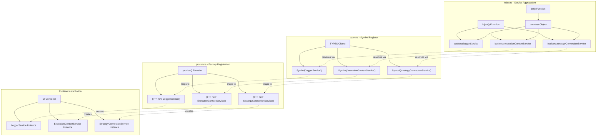
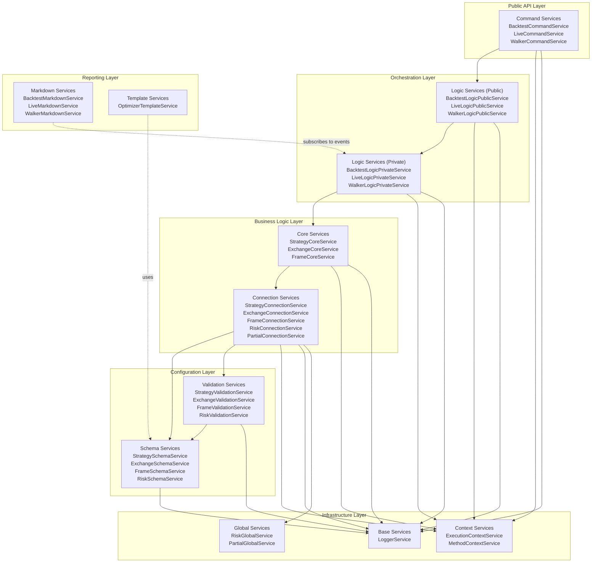
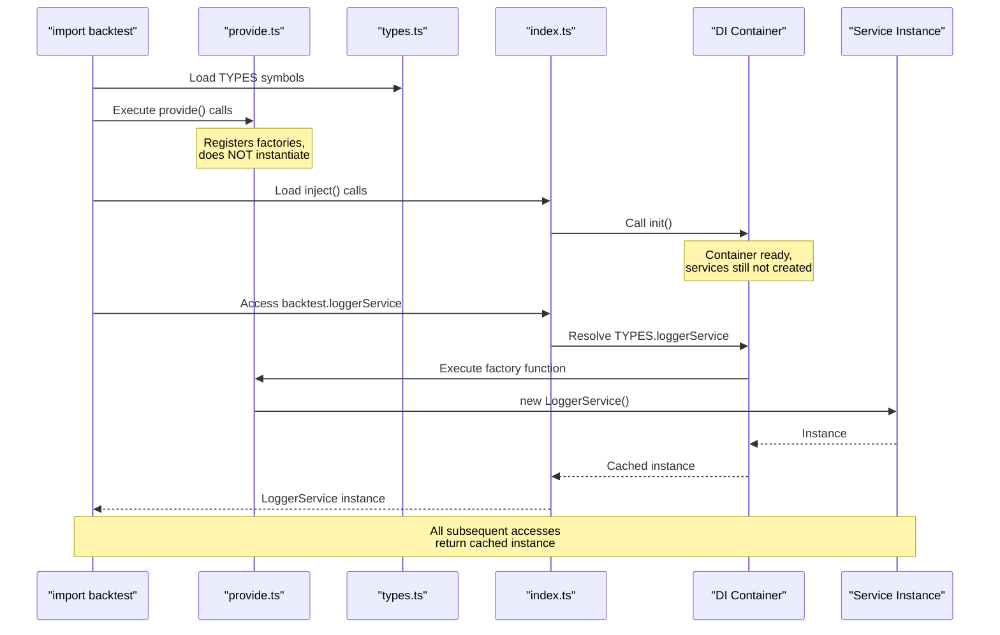

# Service Layer & Dependency Injection

This page documents the service layer architecture and dependency injection (DI) system that powers the backtest-kit framework. The service layer provides a structured approach to organizing business logic, managing dependencies, and enabling testability through inversion of control.

**Scope**: This page covers the DI container implementation, the 11 service categories, and how services are registered and resolved. For details on the actual client business logic (ClientStrategy, ClientExchange, etc.), see [Client Layer](./14_architecture-deep-dive.md). For memoization patterns used by connection services, see [Connection Services & Memoization](./14_architecture-deep-dive.md).

---

## Overview & Purpose

The service layer acts as the glue between the public API (addStrategy, Backtest.run, etc.) and the core business logic (ClientStrategy, ClientExchange). It provides:

- **Dependency Injection**: Symbol-based tokens enable lazy instantiation and testability
- **Separation of Concerns**: 11 distinct service categories organize responsibilities
- **Context Propagation**: ExecutionContext and MethodContext flow through the call stack
- **Memoization**: Connection services cache client instances by schema name
- **Acyclic Dependencies**: Careful layering prevents circular dependency issues

The framework uses a custom DI container rather than a third-party library to maintain zero runtime dependencies and optimize for the specific patterns needed (memoization, context services, lazy initialization).


---

## Dependency Injection Container

The DI container consists of three core mechanisms defined across three files:

### TYPES Symbol Registry

The `TYPES` object in `src/lib/core/types.ts:1-105` defines unique Symbol identifiers for every service in the framework:

```typescript
const baseServices = {
    loggerService: Symbol('loggerService'),
};

const contextServices = {
    executionContextService: Symbol('executionContextService'),
    methodContextService: Symbol('methodContextService'),
};

const connectionServices = {
    exchangeConnectionService: Symbol('exchangeConnectionService'),
    strategyConnectionService: Symbol('strategyConnectionService'),
    frameConnectionService: Symbol('frameConnectionService'),
    // ... 4 more
};

// ... 8 more service categories

export const TYPES = {
    ...baseServices,
    ...contextServices,
    ...connectionServices,
    ...schemaServices,
    ...coreServices,
    ...globalServices,
    ...commandServices,
    ...logicPrivateServices,
    ...logicPublicServices,
    ...markdownServices,
    ...validationServices,
    ...templateServices,
}
```

The Symbol-based approach ensures:
- **Type Safety**: TypeScript can enforce correct usage
- **No Name Collisions**: Symbols are globally unique
- **IDE Support**: Autocomplete works across the codebase

### Registration with `provide()`

The `src/lib/core/provide.ts:1-143` file registers factory functions for each service:

```typescript
// Base Services
{
    provide(TYPES.loggerService, () => new LoggerService());
}

// Context Services
{
    provide(TYPES.executionContextService, () => new ExecutionContextService());
    provide(TYPES.methodContextService, () => new MethodContextService());
}

// Connection Services
{
    provide(TYPES.exchangeConnectionService, () => new ExchangeConnectionService());
    provide(TYPES.strategyConnectionService, () => new StrategyConnectionService());
    // ... 5 more
}

// ... 8 more categories
```

Each `provide()` call maps a Symbol token to a factory function. The factory is not invoked immediately—services are lazily instantiated on first use.

### Resolution with `inject()` and `init()`

The `src/lib/index.ts:1-246` file uses `inject()` to create lazy resolvers for each service:

```typescript
const baseServices = {
  loggerService: inject<LoggerService>(TYPES.loggerService),
};

const contextServices = {
  executionContextService: inject<TExecutionContextService>(
    TYPES.executionContextService
  ),
  methodContextService: inject<TMethodContextService>(
    TYPES.methodContextService
  ),
};

// ... more categories

export const backtest = {
  ...baseServices,
  ...contextServices,
  ...connectionServices,
  ...schemaServices,
  ...coreServices,
  ...globalServices,
  ...commandServices,
  ...logicPrivateServices,
  ...logicPublicServices,
  ...markdownServices,
  ...validationServices,
  ...templateServices,
};

init();
```

The `init()` call at the end triggers initialization of the DI container. After this point, any access to `backtest.loggerService` will instantiate the service (if not already created) and return the singleton instance.


---

## DI Container Architecture

The following diagram shows how the three DI mechanisms work together:




---

## The 11 Service Categories

The framework organizes services into 11 distinct categories, each with a specific responsibility. This structure is reflected in both `src/lib/core/types.ts` and `src/lib/index.ts`.

### Category Summary Table

| Category | Count | Responsibility | Example Services |
|----------|-------|----------------|------------------|
| **Base Services** | 1 | Centralized logging with context | LoggerService |
| **Context Services** | 2 | Ambient context propagation | ExecutionContextService, MethodContextService |
| **Schema Services** | 7 | Configuration storage (ToolRegistry pattern) | StrategySchemaService, ExchangeSchemaService |
| **Validation Services** | 9 | Existence checks and shallow validation | StrategyValidationService, ConfigValidationService |
| **Connection Services** | 7 | Memoized client instance factories | StrategyConnectionService, ExchangeConnectionService |
| **Core Services** | 3 | Business logic orchestration | StrategyCoreService, ExchangeCoreService |
| **Global Services** | 4 | Shared state management | RiskGlobalService, PartialGlobalService |
| **Logic Services (Private)** | 3 | Internal execution implementation | BacktestLogicPrivateService, LiveLogicPrivateService |
| **Logic Services (Public)** | 3 | External API wrappers | BacktestLogicPublicService, LiveLogicPublicService |
| **Command Services** | 3 | Top-level API entry points | BacktestCommandService, LiveCommandService |
| **Markdown Services** | 9 | Event-driven report generation | BacktestMarkdownService, LiveMarkdownService |
| **Template Services** | 1 | Code generation for optimizers | OptimizerTemplateService |

**Total Services**: 52


---

## Service Category Details

### 1. Base Services

**Purpose**: Provide foundational infrastructure needed by all other services.

**Services**:
- `LoggerService`: Centralized logging with automatic context injection (symbol, strategyName, timestamp). Wraps user-provided ILogger implementation.

**Location**: `src/lib/index.ts:61-63`

**Usage Pattern**:
```typescript
backtest.loggerService.info('methodName', { data });
backtest.loggerService.log('simple message');
```

### 2. Context Services

**Purpose**: Propagate ambient information throughout the call stack without explicit parameter passing.

**Services**:
- `ExecutionContextService`: Manages `symbol`, `when` (timestamp), and `backtest` flag. Used by ClientStrategy to determine execution mode.
- `MethodContextService`: Manages `strategyName`, `exchangeName`, `frameName`. Used by connection services to route operations.

**Location**: `src/lib/index.ts:65-72`

**Context Flow Pattern**:
```typescript
// Set method context at API boundary
MethodContextService.runInContext(() => {
  // Set execution context per tick
  ExecutionContextService.runInContext(() => {
    // All services can now access context without parameters
    strategyCoreService.tick(); // knows symbol, when, strategyName
  }, { symbol, when, backtest });
}, { strategyName, exchangeName, frameName });
```


### 3. Schema Services

**Purpose**: Store immutable user-provided configurations using the ToolRegistry pattern.

**Services**:
- `StrategySchemaService`: Stores IStrategySchema objects
- `ExchangeSchemaService`: Stores IExchangeSchema objects  
- `FrameSchemaService`: Stores IFrameSchema objects
- `WalkerSchemaService`: Stores IWalkerSchema objects
- `SizingSchemaService`: Stores ISizingSchema objects
- `RiskSchemaService`: Stores IRiskSchema objects
- `OptimizerSchemaService`: Stores IOptimizerSchema objects

**Location**: `src/lib/index.ts:98-112`

**Registration Pattern**:
```typescript
// From addStrategy function
backtest.strategySchemaService.register(
  strategySchema.strategyName,
  strategySchema
);
```

**Retrieval Pattern**:
```typescript
const schema = backtest.strategySchemaService.get(strategyName);
```


### 4. Validation Services

**Purpose**: Perform memoized existence checks and shallow validation of schema references.

**Services**:
- `StrategyValidationService`: Validates strategy names exist
- `ExchangeValidationService`: Validates exchange names exist
- `FrameValidationService`: Validates frame names exist
- `WalkerValidationService`: Validates walker names exist
- `SizingValidationService`: Validates sizing names exist
- `RiskValidationService`: Validates risk names exist and checks circular dependencies in riskList
- `OptimizerValidationService`: Validates optimizer names exist
- `ConfigValidationService`: Validates GLOBAL_CONFIG parameters
- `ColumnValidationService`: Validates report column configurations

**Location**: `src/lib/index.ts:189-217`

**Usage Pattern**:
```typescript
// Before executing backtest, validate all required schemas exist
await backtest.strategyValidationService.assertExist(strategyName);
await backtest.exchangeValidationService.assertExist(exchangeName);
await backtest.frameValidationService.assertExist(frameName);
```

**List Pattern**:
```typescript
// Used by listStrategies() function
const strategies = await backtest.strategyValidationService.list();
```


### 5. Connection Services

**Purpose**: Create and cache (memoize) client instances by unique keys to prevent redundant instantiation.

**Services**:
- `StrategyConnectionService`: Creates ClientStrategy instances per `symbol:strategyName`
- `ExchangeConnectionService`: Creates ClientExchange instances per `exchangeName`
- `FrameConnectionService`: Creates ClientFrame instances per `frameName`
- `SizingConnectionService`: Creates ClientSizing instances per `sizingName`
- `RiskConnectionService`: Creates ClientRisk or MergeRisk instances per `riskName` or `riskList`
- `OptimizerConnectionService`: Creates ClientOptimizer instances per `optimizerName`
- `PartialConnectionService`: Creates ClientPartial instances per `symbol`

**Location**: `src/lib/index.ts:74-96`

**Memoization Pattern**: See [Connection Services & Memoization](./14_architecture-deep-dive.md) for details.


### 6. Core Services

**Purpose**: Orchestrate business logic by coordinating between connection services and context services.

**Services**:
- `StrategyCoreService`: Main orchestration for strategy execution. Coordinates ClientStrategy.tick() and ClientStrategy.backtest() calls.
- `ExchangeCoreService`: Orchestrates candle fetching and VWAP calculation via ClientExchange.
- `FrameCoreService`: Orchestrates timeframe generation via ClientFrame.

**Location**: `src/lib/index.ts:114-118`

**Orchestration Example** (StrategyCoreService):
```typescript
// Called by BacktestLogicPrivateService
strategyCoreService.tick() {
  // 1. Gets context from ExecutionContextService
  const { symbol, when } = executionContext.get();
  
  // 2. Routes to correct ClientStrategy via StrategyConnectionService
  const client = strategyConnectionService.get(symbol);
  
  // 3. Executes business logic
  return client.tick(when);
}
```


### 7. Global Services

**Purpose**: Manage shared state that spans multiple strategies or symbols.

**Services**:
- `RiskGlobalService`: Tracks portfolio-wide risk across all strategies
- `SizingGlobalService`: Manages position sizing calculations
- `OptimizerGlobalService`: Coordinates optimizer execution state
- `PartialGlobalService`: Tracks partial profit/loss events across strategies

**Location**: `src/lib/index.ts:120-129`

**State Sharing Example** (RiskGlobalService):
```typescript
// Multiple ClientStrategy instances share the same ClientRisk instance
// which has access to RiskGlobalService for portfolio-wide limits
```


### 8. Logic Services (Private)

**Purpose**: Implement internal execution logic using async generators for streaming results.

**Services**:
- `BacktestLogicPrivateService`: Implements timeframe iteration loop for historical simulation
- `LiveLogicPrivateService`: Implements infinite loop with sleep intervals for real-time trading
- `WalkerLogicPrivateService`: Implements strategy comparison by running multiple backtests sequentially

**Location**: `src/lib/index.ts:141-151`

**Async Generator Pattern**:
```typescript
async *run(symbol: string) {
  // Backtest: finite loop through timeframes
  for (const timeframe of timeframes) {
    const result = await strategyCoreService.tick();
    if (result.action === 'closed') {
      yield result; // Stream results incrementally
    }
  }
}
```


### 9. Logic Services (Public)

**Purpose**: Wrap private logic services to provide clean external API with validation and error handling.

**Services**:
- `BacktestLogicPublicService`: Public wrapper for BacktestLogicPrivateService
- `LiveLogicPublicService`: Public wrapper for LiveLogicPrivateService
- `WalkerLogicPublicService`: Public wrapper for WalkerLogicPrivateService

**Location**: `src/lib/index.ts:153-163`

**Wrapper Pattern**:
```typescript
// Public service validates inputs before delegating to private service
async *run(symbol: string, context: IMethodContext) {
  await this.validate(context); // Validation layer
  return yield* privateService.run(symbol); // Delegate to private
}
```


### 10. Command Services

**Purpose**: Provide top-level entry points for the public API (Backtest, Live, Walker classes).

**Services**:
- `BacktestCommandService`: Entry point for Backtest.run() and Backtest.background()
- `LiveCommandService`: Entry point for Live.run() and Live.background()
- `WalkerCommandService`: Entry point for Walker.run() and Walker.background()

**Location**: `src/lib/index.ts:131-139`

**Command Pattern**:
```typescript
// Command service handles method context and delegates to logic service
run(symbol: string, context: IMethodContext) {
  return methodContextService.runInContext(() => {
    return backtestLogicPublicService.run(symbol);
  }, context);
}
```


### 11. Markdown Services

**Purpose**: Subscribe to event emitters, accumulate data, and generate formatted reports on demand.

**Services**:
- `BacktestMarkdownService`: Generates reports from signalBacktestEmitter
- `LiveMarkdownService`: Generates reports from signalLiveEmitter
- `ScheduleMarkdownService`: Tracks scheduled/opened/cancelled signals
- `PerformanceMarkdownService`: Tracks execution timing metrics
- `WalkerMarkdownService`: Generates strategy comparison reports
- `HeatMarkdownService`: Generates portfolio-wide heatmaps
- `PartialMarkdownService`: Tracks partial profit/loss events
- `OutlineMarkdownService`: Generates outline/summary reports
- `RiskMarkdownService`: Tracks risk rejection events

**Location**: `src/lib/index.ts:165-187`

**Event Subscription Pattern**:
```typescript
// Markdown services subscribe to relevant emitters
signalBacktestEmitter.subscribe((event) => {
  storage.append(key, event); // Max 250 events per key
});

// Generate report on demand
getReport() {
  const events = storage.get(key);
  return this.formatMarkdown(events);
}
```


### 12. Template Services

**Purpose**: Generate executable code from optimizer schemas.

**Services**:
- `OptimizerTemplateService`: Generates .mjs files with strategy code, LLM integration, and backtest execution logic

**Location**: `src/lib/index.ts:219-223`

**Code Generation Pattern**: See [Code Generation & Templates](./46_advanced-features.md) for details.


---

## Service Dependency Graph

This diagram maps the dependencies between major service categories, showing how the acyclic architecture prevents circular dependencies:



**Key Architectural Principles**:

1. **Layered Dependencies**: Services only depend on services in the same layer or layers below
2. **No Circular Dependencies**: The graph is acyclic (DAG)
3. **Context Propagation**: Context services are used by all layers but don't depend on them
4. **Infrastructure Services**: Base and Context services have no dependencies (except each other)
5. **Reporting Independence**: Markdown services subscribe to events but don't block execution


---

## The Central `backtest` Object

The `src/lib/index.ts:225-238` file exports a single `backtest` object that aggregates all 52 services:

```typescript
export const backtest = {
  ...baseServices,           // 1 service
  ...contextServices,        // 2 services
  ...connectionServices,     // 7 services
  ...schemaServices,         // 7 services
  ...coreServices,           // 3 services
  ...globalServices,         // 4 services
  ...commandServices,        // 3 services
  ...logicPrivateServices,   // 3 services
  ...logicPublicServices,    // 3 services
  ...markdownServices,       // 9 services
  ...validationServices,     // 9 services
  ...templateServices,       // 1 service
};

init();

export default backtest;
```

### Service Access Patterns

Internal code accesses services through this object:

```typescript
// From any internal module
import backtest from "../lib/index";

// Access any service
backtest.loggerService.info('method', { data });
backtest.strategyValidationService.assertExist(strategyName);
backtest.strategyConnectionService.get(symbol);
```

### Testability

The `backtest` object enables easy mocking for unit tests:

```typescript
// In tests, replace specific services
const mockLogger = { info: jest.fn(), log: jest.fn() };
backtest.loggerService = mockLogger;

// Run code under test
await someFunction();

// Verify mock was called
expect(mockLogger.info).toHaveBeenCalledWith(...);
```


---

## Service Initialization Lifecycle

The initialization sequence follows this pattern:



### Lazy Instantiation

Services are created only when first accessed:

```typescript
// 1. Loading the module does NOT create services
import backtest from "backtest-kit";

// 2. First access creates the service
const logger = backtest.loggerService; // LoggerService() constructor runs here

// 3. Subsequent accesses return cached instance
const logger2 = backtest.loggerService; // Same instance, no new construction

console.assert(logger === logger2); // true
```

### Service Constructor Pattern

Services receive dependencies via constructor injection:

```typescript
// Example: BacktestCommandService constructor
class BacktestCommandService {
  private loggerService: LoggerService;
  private backtestLogicPublicService: BacktestLogicPublicService;
  
  constructor() {
    // Inject dependencies via backtest object
    this.loggerService = backtest.loggerService;
    this.backtestLogicPublicService = backtest.backtestLogicPublicService;
  }
}
```

This pattern enables:
- **Circular dependency detection**: Constructor injection makes cycles impossible
- **Clear dependency graph**: Dependencies are explicit in constructor
- **Easy testing**: Can mock dependencies by replacing them on `backtest` object


---

## Service Type Definitions and Interfaces

While the DI container uses concrete classes, the framework also defines interfaces for major service categories to enable flexibility and testing.

### Internal Service Access Pattern

Services access each other through the `backtest` object, which provides concrete instances:

```typescript
class StrategyCoreService {
  constructor() {
    this.loggerService = backtest.loggerService;
    this.strategyConnectionService = backtest.strategyConnectionService;
    this.strategySchemaService = backtest.strategySchemaService;
    // ... etc
  }
}
```

### Type-Safe Resolution

The `inject<T>()` function provides type safety:

```typescript
// From index.ts
const baseServices = {
  loggerService: inject<LoggerService>(TYPES.loggerService),
};
```

TypeScript ensures:
- `TYPES.loggerService` maps to correct factory in `provide.ts`
- Factory returns type compatible with `LoggerService`
- Access via `backtest.loggerService` returns correct type


---

## Summary

The service layer architecture provides:

| Aspect | Implementation | Benefit |
|--------|----------------|---------|
| **Dependency Injection** | Symbol-based tokens + provide/inject | Testability, lazy loading, clear dependencies |
| **Service Categories** | 11 distinct categories | Separation of concerns, clear responsibilities |
| **Context Propagation** | ExecutionContext + MethodContext | Avoid parameter drilling, clean APIs |
| **Memoization** | Connection services cache clients | Performance optimization, single instances |
| **Acyclic Dependencies** | Layered architecture | No circular dependencies, maintainability |
| **Central Object** | `backtest` aggregates all services | Single import point, easy mocking |
| **Lazy Instantiation** | Services created on first access | Fast startup, low memory footprint |

The combination of these patterns creates a maintainable, testable, and performant architecture that scales from simple backtests to complex multi-strategy live trading systems.
