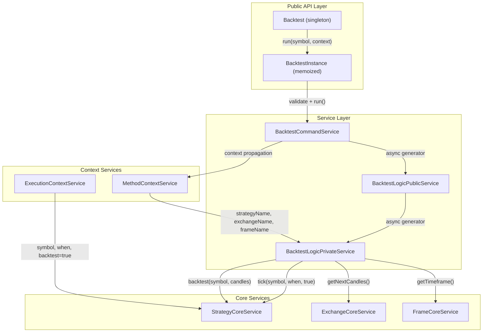
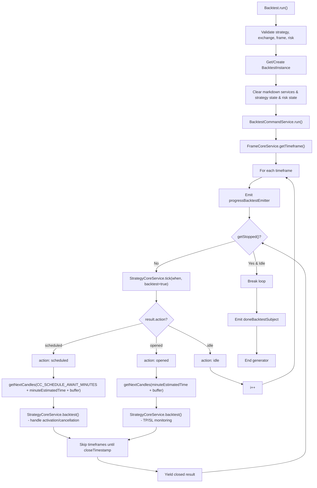
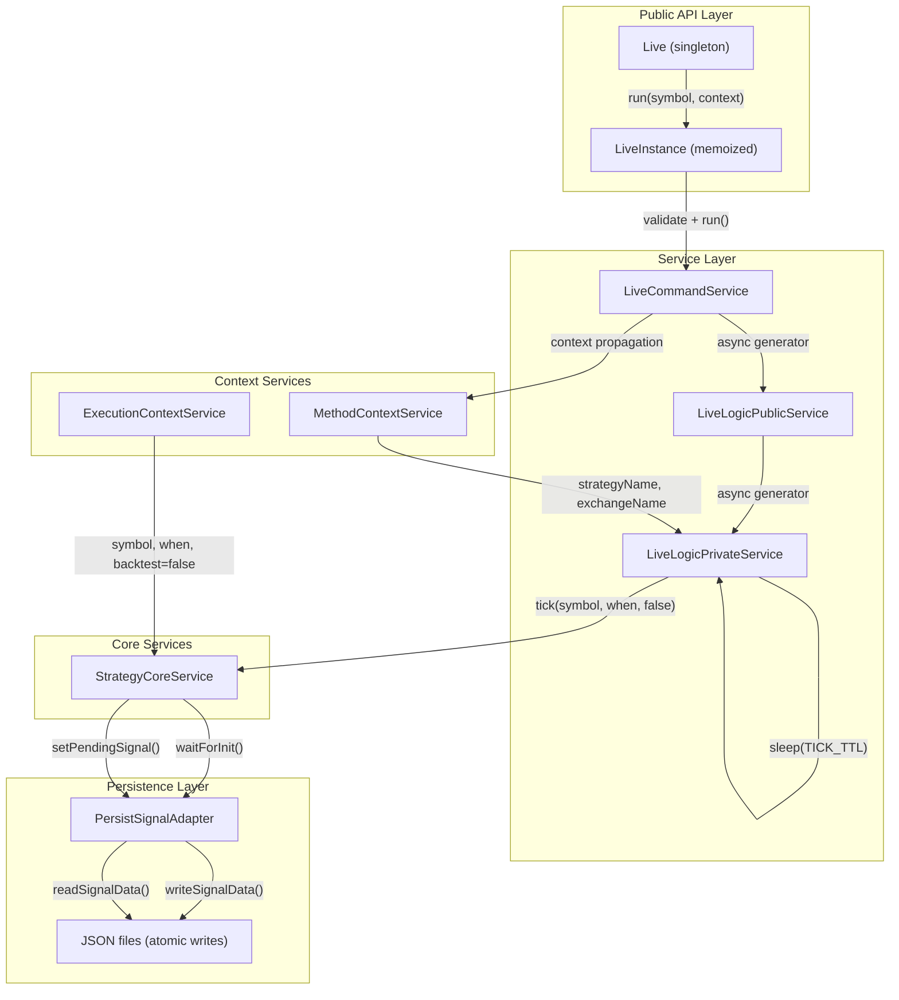
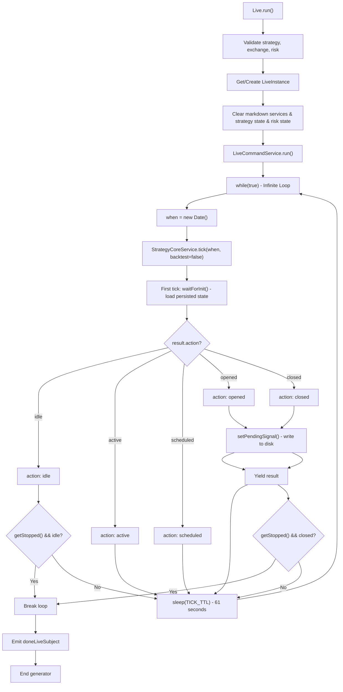
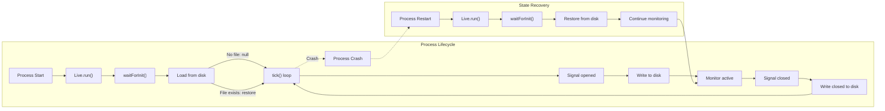
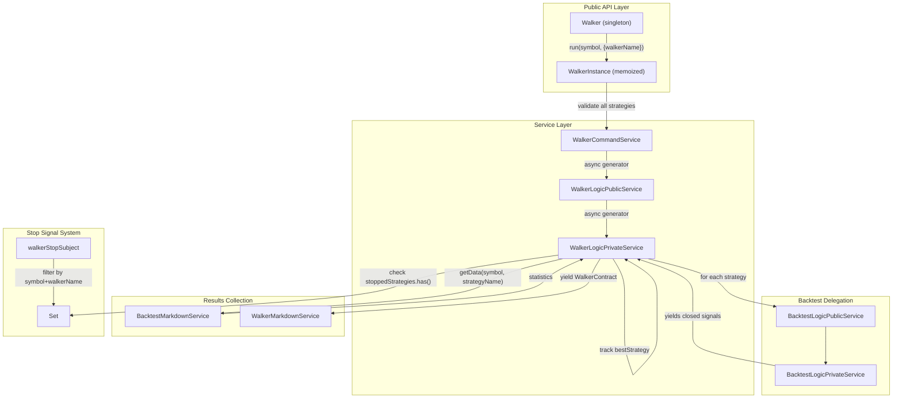
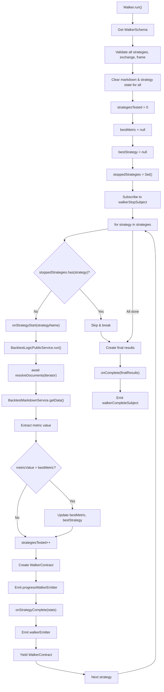
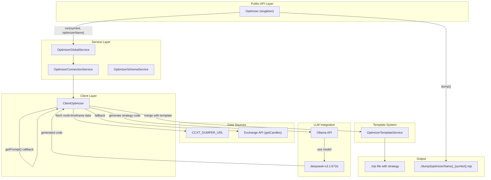
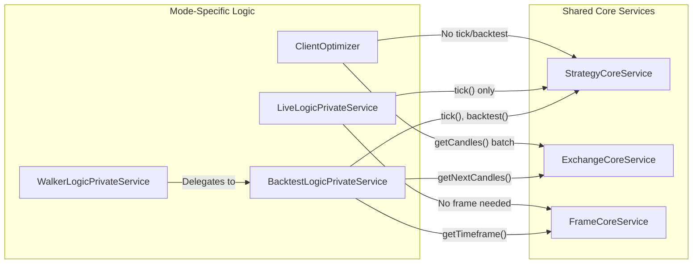

# Execution Modes (Detailed)

## Purpose and Scope

This page provides comprehensive documentation of the four execution modes implemented in backtest-kit: **Backtest**, **Live**, **Walker**, and **Optimizer**. Each mode orchestrates trading strategy execution with distinct architectural patterns, data flows, and performance characteristics. This document details the internal implementation of each mode, including the service layer architecture, async generator patterns, and state management.

For a high-level comparison of when to use each mode, see [Execution Modes Overview](./04-execution-modes-overview.md). For strategy definition and signal lifecycle concepts, see [Signal Lifecycle and State Machine](./03-signal-lifecycle-and-state-machine.md).

## Execution Mode Architecture

All four execution modes follow a consistent architectural pattern with three primary layers:

| Layer | Components | Responsibilities |
|-------|-----------|------------------|
| **Public API** | `Backtest`, `Live`, `Walker`, `Optimizer` classes | User-facing singleton instances with validation |
| **Instance Management** | `BacktestInstance`, `LiveInstance`, `WalkerInstance` | Memoized per-symbol execution contexts |
| **Command Services** | `BacktestCommandService`, `LiveCommandService`, `WalkerCommandService` | Dependency injection and context propagation |
| **Logic Services** | `BacktestLogicPublicService/Private`, `LiveLogicPublicService/Private`, `WalkerLogicPublicService/Private` | Core execution logic with async generators |
| **Core Services** | `StrategyCoreService`, `ExchangeCoreService`, `FrameCoreService` | Domain business logic |

---

## Backtest Mode

### Architecture Overview



**Diagram: Backtest Mode Service Dependencies**

### Public API Entry Points

The `Backtest` singleton provides the primary interface for backtest operations:

```typescript
// From Backtest.ts
Backtest.run(symbol: string, context: {
  strategyName: string,
  exchangeName: string,
  frameName: string
}) -> AsyncGenerator<IStrategyBacktestResult>

Backtest.background(symbol, context) -> CancellationFunction
Backtest.stop(symbol, strategyName) -> Promise<void>
Backtest.getData(symbol, strategyName) -> Promise<BacktestStatistics>
```

Each symbol-strategy pair is managed by a memoized `BacktestInstance` (keyed by `"${symbol}:${strategyName}"`), ensuring isolated state and preventing duplicate executions.

### Execution Flow



**Diagram: Backtest Execution Flow with Signal Type Handling**

### Timeframe Iteration and Skip Optimization

The backtest mode uses pre-generated timeframes from `FrameCoreService.getTimeframe()`, which returns an array of `Date` objects based on the frame configuration. The main optimization technique is **skip-to-close**:

1. **Initial tick:** Call `StrategyCoreService.tick(when, backtest=true)` at each timeframe
2. **Signal opened/scheduled:** When a signal opens, fetch all required candles at once:
   - For scheduled signals: `CC_SCHEDULE_AWAIT_MINUTES + minuteEstimatedTime + buffer` candles
   - For opened signals: `minuteEstimatedTime + buffer` candles
   - Buffer = `CC_AVG_PRICE_CANDLES_COUNT - 1` for VWAP calculation
3. **Fast processing:** Call `backtest(candles)` which processes all candles in memory without individual ticks
4. **Skip timeframes:** Advance loop counter `i` to skip all timeframes before `closeTimestamp`
5. **Yield result:** Emit closed signal result immediately

This pattern eliminates redundant tick calls during active signal monitoring, reducing execution time by orders of magnitude for strategies with long signal lifetimes.

### BacktestLogicPrivateService Implementation

The core logic is implemented as an async generator in `BacktestLogicPrivateService.run()`:

```typescript
// From BacktestLogicPrivateService.ts:62-477
public async *run(symbol: string) {
  const timeframes = await this.frameCoreService.getTimeframe(symbol, frameName);
  let i = 0;
  
  while (i < timeframes.length) {
    const when = timeframes[i];
    
    // Emit progress event
    await progressBacktestEmitter.next({...});
    
    // Check stop flag before processing
    if (await this.strategyCoreService.getStopped(symbol, strategyName)) {
      break;
    }
    
    const result = await this.strategyCoreService.tick(symbol, when, true);
    
    // Handle scheduled signals
    if (result.action === "scheduled") {
      const candles = await this.exchangeCoreService.getNextCandles(...);
      const backtestResult = await this.strategyCoreService.backtest(symbol, candles, when, true);
      
      // Skip to close timestamp
      while (i < timeframes.length && timeframes[i].getTime() < backtestResult.closeTimestamp) {
        i++;
      }
      
      yield backtestResult;
    }
    
    // Handle opened signals (similar pattern)
    if (result.action === "opened") { ... }
    
    i++;
  }
}
```

Key implementation details:

- **Error handling:** Tick and backtest failures emit to `errorEmitter` and skip the timeframe
- **Performance tracking:** Emits to `performanceEmitter` for signal and timeframe durations
- **Stop checks:** Multiple stop points (before tick, after idle, after closed) for graceful shutdown
- **Progress reporting:** Emits `progressBacktestEmitter` with `processedFrames / totalFrames`

### Scheduled Signal Handling

Scheduled signals (delayed entry orders) require special handling in backtest mode:

```typescript
// From BacktestLogicPrivateService.ts:154-301
if (result.action === "scheduled") {
  const signal = result.signal;
  
  // Calculate candles needed:
  // - Buffer for VWAP (CC_AVG_PRICE_CANDLES_COUNT - 1)
  // - Await period (CC_SCHEDULE_AWAIT_MINUTES)
  // - Signal lifetime (minuteEstimatedTime)
  const bufferMinutes = GLOBAL_CONFIG.CC_AVG_PRICE_CANDLES_COUNT - 1;
  const bufferStartTime = new Date(when.getTime() - bufferMinutes * 60 * 1000);
  const candlesNeeded = bufferMinutes + GLOBAL_CONFIG.CC_SCHEDULE_AWAIT_MINUTES + signal.minuteEstimatedTime + 1;
  
  const candles = await this.exchangeCoreService.getNextCandles(
    symbol, "1m", candlesNeeded, bufferStartTime, true
  );
  
  // backtest() handles activation/cancellation monitoring internally
  const backtestResult = await this.strategyCoreService.backtest(symbol, candles, when, true);
}
```

The `backtest()` method internally monitors for:
1. **Activation conditions:** Price reaches `priceOpen` within `CC_SCHEDULE_AWAIT_MINUTES`
2. **Cancellation conditions:** Time expires without activation
3. **Post-activation:** Normal TP/SL/time monitoring if activated

### State Management and Memory Efficiency

Backtest mode is stateless by design:
- **No persistence:** Signals are not written to disk
- **Streaming results:** Async generator yields results without accumulation
- **Clear on start:** Each `run()` clears previous markdown service data and strategy state
- **Early termination:** Consumer can `break` from the async generator at any point
- **Memoized instances:** Each symbol-strategy pair reuses the same `BacktestInstance`

The clear operations ensure isolation between runs:

```typescript
// From Backtest.ts:161-174
backtest.backtestMarkdownService.clear({ symbol, strategyName });
backtest.scheduleMarkdownService.clear({ symbol, strategyName });
backtest.strategyCoreService.clear({ symbol, strategyName });

const { riskName, riskList } = backtest.strategySchemaService.get(strategyName);
riskName && backtest.riskGlobalService.clear(riskName);
riskList?.forEach((riskName) => backtest.riskGlobalService.clear(riskName));
```

---

## Live Trading Mode

### Architecture Overview



**Diagram: Live Mode Service Dependencies with Persistence**

### Public API Entry Points

The `Live` singleton provides crash-safe real-time trading:

```typescript
// From Live.ts
Live.run(symbol: string, context: {
  strategyName: string,
  exchangeName: string
}) -> AsyncGenerator<IStrategyTickResultOpened | IStrategyTickResultClosed>

Live.background(symbol, context) -> CancellationFunction
Live.stop(symbol, strategyName) -> Promise<void>
Live.getData(symbol, strategyName) -> Promise<LiveStatistics>
```

Key differences from Backtest:
- **No frameName:** Live mode uses real-time progression (`new Date()`)
- **Filtered output:** Generator only yields `opened` and `closed` results (not `idle`/`active`)
- **Infinite loop:** Generator never completes unless explicitly stopped
- **Crash recovery:** State restored from disk on restart

### Execution Flow



**Diagram: Live Mode Infinite Loop with Crash-Safe Persistence**

### Infinite Loop Architecture

The core difference between live and backtest is the infinite loop structure:

```typescript
// From LiveLogicPrivateService.ts:63-175
public async *run(symbol: string) {
  let previousEventTimestamp: number | null = null;
  
  while (true) {  // Infinite loop
    const tickStartTime = performance.now();
    const when = new Date();  // Real-time date
    
    const result = await this.strategyCoreService.tick(symbol, when, false);
    
    // Track performance
    await performanceEmitter.next({
      timestamp: Date.now(),
      previousTimestamp: previousEventTimestamp,
      metricType: "live_tick",
      duration: performance.now() - tickStartTime,
      strategyName, exchangeName, symbol,
      backtest: false
    });
    
    // Check stop conditions
    if (result.action === "idle") {
      if (await this.strategyCoreService.getStopped(symbol, strategyName)) {
        break;  // Exit when idle
      }
      await sleep(TICK_TTL);
      continue;
    }
    
    if (result.action === "active" || result.action === "scheduled") {
      await sleep(TICK_TTL);
      continue;  // Skip yielding, just continue loop
    }
    
    // Yield opened/closed only
    yield result as IStrategyTickResultOpened | IStrategyTickResultClosed;
    
    // Check stop after closed
    if (result.action === "closed") {
      if (await this.strategyCoreService.getStopped(symbol, strategyName)) {
        break;
      }
    }
    
    await sleep(TICK_TTL);  // 61 seconds between ticks
  }
}
```

Key characteristics:
- **`TICK_TTL = 61000ms`:** Slightly over 1 minute to ensure fresh candle data
- **Real-time dates:** `new Date()` called each iteration
- **No frame skipping:** Every tick is processed (no optimization like backtest)
- **Filtered yield:** Only `opened` and `closed` emitted to consumer

### Crash-Safe Persistence

Live mode achieves crash safety through atomic file writes and state recovery:

#### Write Path (Persistence)

```typescript
// StrategyCoreService calls PersistSignalAdapter
// From StrategyCoreService (not shown in files, but documented)
await this.persistSignalAdapter.writeSignalData(symbol, strategyName, signal);
```

The `PersistSignalAdapter` writes JSON atomically:
1. Serialize signal object to JSON
2. Write to temporary file
3. Atomic rename to final path: `./persist/${symbol}_${strategyName}.json`

#### Read Path (Recovery)

```typescript
// From ClientStrategy (referenced but not in provided files)
async waitForInit() {
  if (this._initialized) return;
  const persistedSignal = await this.persistSignalAdapter.readSignalData(
    this.symbol, 
    this.strategyName
  );
  if (persistedSignal) {
    this._pendingSignal = persistedSignal;
  }
  this._initialized = true;
}
```

The `waitForInit()` is called on first tick:
- Loads persisted signal from disk
- Restores `_pendingSignal` state
- Continues monitoring from last known position
- If file doesn't exist, starts fresh

### Graceful Shutdown

Live mode implements graceful shutdown to avoid interrupting active positions:

```typescript
// From Live.ts:221-240
return () => {  // Cancellation function returned by background()
  // Set stop flag
  backtest.strategyCoreService.stop({symbol, strategyName}, false);
  
  // Wait for position to close
  backtest.strategyCoreService
    .getPendingSignal(symbol, strategyName)
    .then(async (pendingSignal) => {
      if (pendingSignal) {
        return;  // Position still open, don't emit done
      }
      if (!this._isDone) {
        await doneLiveSubject.next({
          exchangeName, strategyName,
          backtest: false, symbol
        });
      }
      this._isDone = true;
    });
  
  this._isStopped = true;
};
```

Stop flow:
1. **User calls** `Live.stop()` or cancellation function
2. **Stop flag set:** `strategyCoreService.stop(symbol, strategyName, false)` where `false` means "don't force immediate stop"
3. **Loop checks:**
   - If idle: breaks immediately
   - If active: continues monitoring until closed
4. **Position closes:** Loop breaks after `action === "closed"` and `getStopped()` returns true
5. **Done event:** Emits `doneLiveSubject` only when no pending signal

This prevents orphaned positions by waiting for natural close (TP/SL/time).

### State Management and Persistence Lifecycle



**Diagram: Live Mode Crash Recovery Lifecycle**

The persistence layer ensures:
- **Atomic writes:** No corrupted state files
- **Singleshot initialization:** `waitForInit()` called once per instance
- **Stateless process:** All state in JSON files, not in-memory
- **Crash recovery:** Process can restart anytime and resume monitoring

---

## Walker Mode

### Architecture Overview



**Diagram: Walker Mode Architecture with Sequential Backtest Delegation**

### Public API Entry Points

The `Walker` singleton orchestrates strategy comparison:

```typescript
// From Walker.ts
Walker.run(symbol: string, context: {
  walkerName: string
}) -> AsyncGenerator<WalkerContract>

Walker.background(symbol, context) -> CancellationFunction
Walker.stop(symbol, walkerName) -> Promise<void>
Walker.getData(symbol, walkerName) -> Promise<WalkerData>
```

Configuration is pulled from `WalkerSchemaService`:

```typescript
interface IWalkerSchema {
  walkerName: string;
  strategies: StrategyName[];  // List of strategies to compare
  exchangeName: string;
  frameName: string;
  metric?: WalkerMetric;  // Default: "sharpeRatio"
  callbacks?: {
    onStrategyStart?: (strategyName, symbol) => void;
    onStrategyComplete?: (strategyName, symbol, stats, metricValue) => Promise<void>;
    onStrategyError?: (strategyName, symbol, error) => void;
    onComplete?: (finalResults) => void;
  };
}
```

### Sequential Backtest Execution

Walker mode runs one backtest per strategy sequentially:



**Diagram: Walker Sequential Execution Flow**

### WalkerLogicPrivateService Implementation

The core logic runs backtests sequentially and compares results:

```typescript
// From WalkerLogicPrivateService.ts:68-259
public async *run(
  symbol: string,
  strategies: StrategyName[],
  metric: WalkerMetric,
  context: {
    exchangeName: string,
    frameName: string,
    walkerName: string
  }
): AsyncGenerator<WalkerContract> {
  
  let strategiesTested = 0;
  let bestMetric: number | null = null;
  let bestStrategy: StrategyName | null = null;
  
  // Track stopped strategies
  const stoppedStrategies = new Set<StrategyName>();
  
  // Subscribe to stop signals (filtered by symbol AND walkerName)
  const unsubscribe = walkerStopSubject
    .filter((data) => data.symbol === symbol && data.walkerName === context.walkerName)
    .connect((data) => {
      stoppedStrategies.add(data.strategyName);
    });
  
  try {
    // Sequential backtest for each strategy
    for (const strategyName of strategies) {
      // Check if stopped
      if (stoppedStrategies.has(strategyName)) {
        break;
      }
      
      // Run backtest
      const iterator = this.backtestLogicPublicService.run(symbol, {
        strategyName, exchangeName, frameName
      });
      
      await resolveDocuments(iterator);  // Consume all results
      
      // Get statistics
      const stats = await this.backtestMarkdownService.getData(symbol, strategyName);
      
      // Extract metric value
      const value = stats[metric];
      const metricValue = (
        value !== null && 
        value !== undefined && 
        typeof value === "number" &&
        !isNaN(value) &&
        isFinite(value)
      ) ? value : null;
      
      // Update best if better
      if (bestMetric === null || (metricValue !== null && metricValue > bestMetric)) {
        bestMetric = metricValue;
        bestStrategy = strategyName;
      }
      
      strategiesTested++;
      
      // Create progress contract
      const walkerContract: WalkerContract = {
        walkerName, exchangeName, frameName, symbol,
        strategyName, stats, metricValue, metric,
        bestMetric, bestStrategy,
        strategiesTested, totalStrategies: strategies.length
      };
      
      await walkerEmitter.next(walkerContract);
      yield walkerContract;
    }
  } finally {
    unsubscribe();  // Clean up subscription
  }
  
  // Emit final results
  await walkerCompleteSubject.next({ bestStrategy, bestMetric, ... });
}
```

### Metric Evaluation System

Walker supports multiple comparison metrics:

| Metric | Type | Formula | Interpretation |
|--------|------|---------|----------------|
| `sharpeRatio` | Risk-adjusted return | `avgPnl / stdDev` | Higher is better - reward per unit risk |
| `annualizedSharpeRatio` | Annualized risk-adj. | `sharpeRatio × √365` | Higher is better - yearly normalized |
| `winRate` | Win probability | `winCount / totalSignals × 100` | Higher is better - % winning trades |
| `avgPnl` | Average return | `sum(pnl) / count` | Higher is better - expected profit per trade |
| `totalPnl` | Cumulative return | `sum(pnl)` | Higher is better - total profit |
| `certaintyRatio` | Win/loss ratio | `avgWin / |avgLoss|` | Higher is better - reward/risk asymmetry |
| `expectedYearlyReturns` | Annualized profit | Based on avg duration | Higher is better - yearly expected gain |

Metric comparison logic:

```typescript
// From WalkerLogicPrivateService.ts:182-190
const isBetter = 
  bestMetric === null ||
  (metricValue !== null && metricValue > bestMetric);

if (isBetter && metricValue !== null) {
  bestMetric = metricValue;
  bestStrategy = strategyName;
}
```

All metrics follow "higher is better" convention (including `stdDev` as inverse in Sharpe).

### Stop Signal System and Multiple Walkers

Walker mode supports concurrent walker instances on the same symbol through filtered stop signals:

```typescript
// From WalkerLogicPrivateService.ts:98-111
const unsubscribe = walkerStopSubject
  .filter((data) => 
    data.symbol === symbol && 
    data.walkerName === context.walkerName  // Filter by walker name
  )
  .connect((data) => {
    stoppedStrategies.add(data.strategyName);
    this.loggerService.info(
      "walkerLogicPrivateService received stop signal for strategy",
      { symbol, walkerName, strategyName: data.strategyName }
    );
  });
```

Stop flow:
1. **User calls** `Walker.stop(symbol, walkerName)`
2. **Iterate strategies:** For each strategy in walker schema
3. **Emit stop signal:** `walkerStopSubject.next({ symbol, strategyName, walkerName })`
4. **Set internal flag:** `strategyCoreService.stop({ symbol, strategyName }, true)`
5. **Filter in loop:** `WalkerLogicPrivateService` checks `stoppedStrategies.has()`
6. **Break loop:** Current strategy finishes, next is skipped

The `walkerName` filter enables multiple walker instances on the same symbol without interference.

### Lifecycle Callbacks

Walker schema supports callback hooks for progress monitoring:

```typescript
callbacks: {
  // Called before each strategy backtest
  onStrategyStart(strategyName: string, symbol: string): void
  
  // Called after each strategy completes successfully
  onStrategyComplete(
    strategyName: string, 
    symbol: string, 
    stats: BacktestStatistics, 
    metricValue: number | null
  ): Promise<void>
  
  // Called if strategy backtest fails
  onStrategyError(
    strategyName: string, 
    symbol: string, 
    error: Error
  ): void
  
  // Called once at end with final best results
  onComplete(finalResults: {
    walkerName, symbol, exchangeName, frameName,
    metric, totalStrategies, bestStrategy, bestMetric, bestStats
  }): void
}
```

Callback execution points:

```typescript
// From WalkerLogicPrivateService.ts:129-160
if (walkerSchema.callbacks?.onStrategyStart) {
  walkerSchema.callbacks.onStrategyStart(strategyName, symbol);
}

// ... run backtest ...

if (walkerSchema.callbacks?.onStrategyComplete) {
  await walkerSchema.callbacks.onStrategyComplete(
    strategyName, symbol, stats, metricValue
  );
}
```

---

## Optimizer Mode

### Architecture Overview

Optimizer mode is distinct from the other execution modes - it does not execute strategies but generates them using LLM technology. The architecture is documented in the high-level diagrams but implementation files are not included in the provided sources.



**Diagram: Optimizer Mode Architecture (High-Level)**

Based on the provided diagrams, the Optimizer mode follows this pattern:
1. **Data Source Iteration:** Fetches historical data at multiple timeframes (1h, 30m, 15m, 1m)
2. **Data Formatting:** Converts candles to markdown tables for LLM consumption
3. **Prompt Construction:** Calls user-provided `getPrompt()` callback with formatted data
4. **LLM Generation:** Sends prompt to Ollama API with deepseek model
5. **Template Merging:** Combines generated strategy logic with framework boilerplate
6. **Code Export:** Outputs executable `.mjs` file with complete strategy

(Diagram 2 section on Optimizer)

### Key Differences from Other Modes

| Aspect | Backtest/Live/Walker | Optimizer |
|--------|---------------------|-----------|
| **Purpose** | Execute strategies | Generate strategies |
| **Output** | Signal results | Source code |
| **Execution** | Async generator loop | Single-shot code generation |
| **Data usage** | Real-time tick/candles | Historical multi-timeframe batch |
| **State** | Signal lifecycle | Stateless |
| **Duration** | Long-running | Completes after generation |

The Optimizer mode is not an execution mode in the traditional sense - it's a **code generation tool** that produces strategies which can then be executed via Backtest/Live/Walker modes.

(Diagram 1 and 2 sections)

---

## Execution Mode Comparison

### Feature Matrix

| Feature | Backtest | Live | Walker | Optimizer |
|---------|----------|------|--------|-----------|
| **Loop Type** | Finite (timeframes) | Infinite (while true) | Sequential (strategies) | Single-shot |
| **Date Source** | Frame-generated | `new Date()` | Frame-delegated | Historical batch |
| **Persistence** | None | JSON atomic writes | None | File output |
| **Output Type** | `IStrategyBacktestResult` | `IStrategyTickResultOpened\|Closed` | `WalkerContract` | Code string |
| **Crash Recovery** | Not needed | `waitForInit()` | Not needed | N/A |
| **Stop Behavior** | Graceful at idle/closed | Graceful at idle/closed | Filtered by walkerName | N/A |
| **Performance Optimization** | Skip-to-close | None (real-time) | Parallel not supported | Data fetching |
| **State Management** | Cleared on start | Persisted to disk | Cleared per strategy | Stateless |
| **Primary Use Case** | Historical validation | Production trading | Strategy comparison | Strategy generation |

(Data Flow sections)

### Performance Characteristics

| Mode | Execution Speed | Memory Usage | Disk I/O |
|------|----------------|--------------|----------|
| **Backtest** | Very fast (skip-to-close) | Low (streaming) | None |
| **Live** | Real-time (61s ticks) | Low (streaming) | Atomic writes per tick |
| **Walker** | Slow (sequential backtests) | Moderate (accumulated stats) | None |
| **Optimizer** | Depends on LLM latency | Moderate (multi-timeframe data) | File output |

### Service Layer Dependencies

All modes share core services but use them differently:



**Diagram: Execution Mode Service Dependencies**

---

## Summary

The four execution modes provide complementary capabilities:

- **Backtest:** Optimized historical validation with skip-to-close for fast signal processing
- **Live:** Crash-safe real-time trading with atomic persistence and graceful shutdown
- **Walker:** Sequential strategy comparison with metric-based ranking and progress callbacks
- **Optimizer:** LLM-powered strategy code generation using multi-timeframe historical data

All modes leverage the same core service architecture (Strategy, Exchange, Frame) but implement distinct orchestration patterns via Logic services. The async generator pattern enables memory-efficient streaming, early termination, and consistent error handling across all execution modes.

