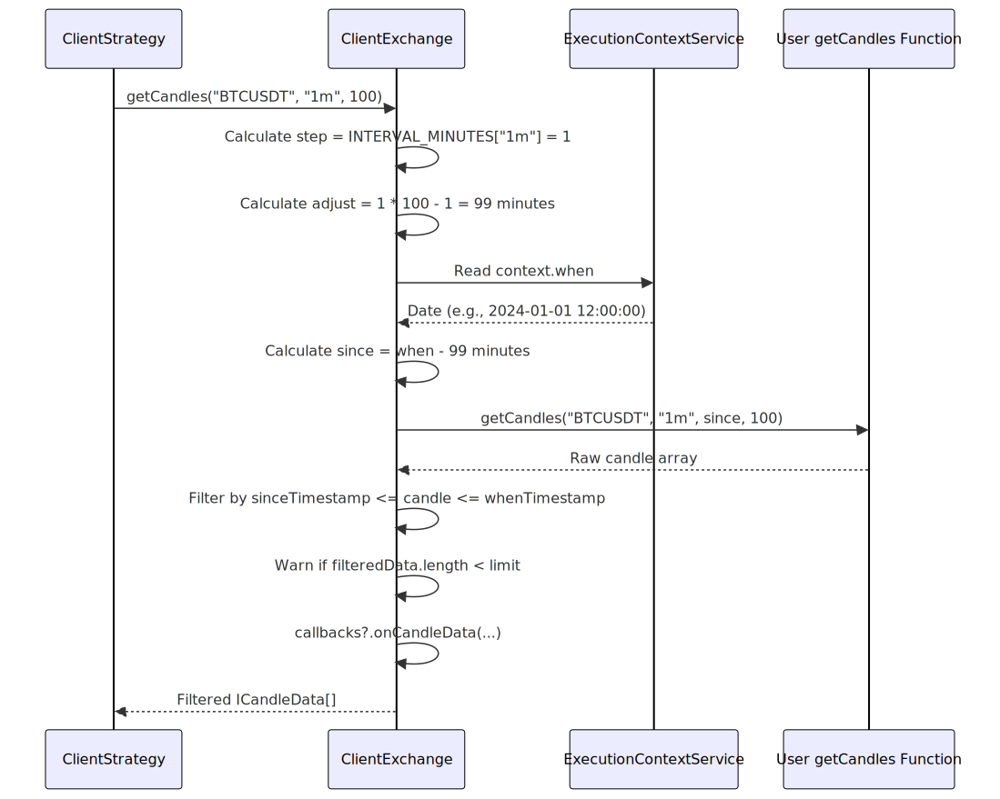
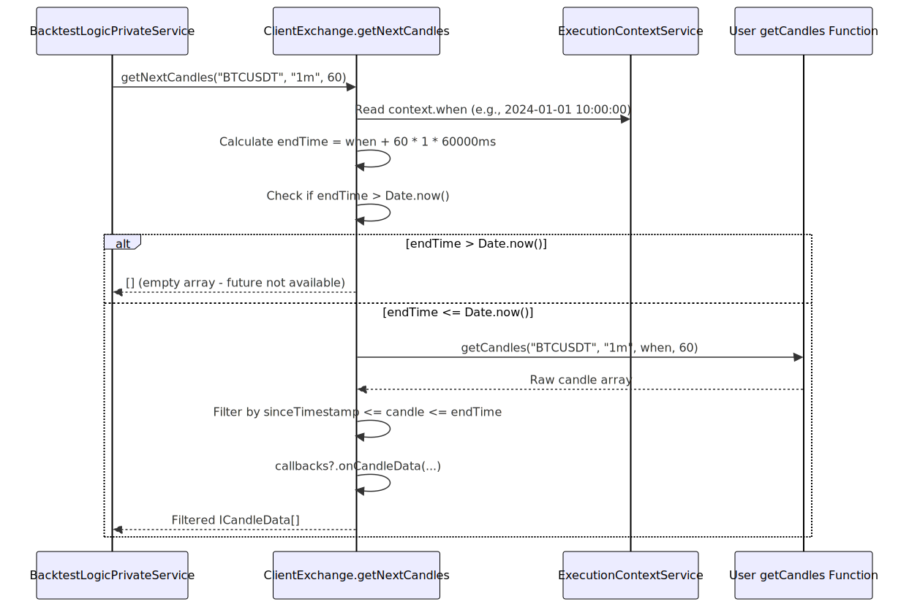

# ClientExchange

## Purpose and Scope

The `ClientExchange` class is a pure business logic component responsible for fetching and processing exchange data within the backtest-kit framework. It provides three core capabilities: historical candle fetching (backwards from execution context), future candle fetching (forwards for backtest simulation), and VWAP (Volume Weighted Average Price) calculation from recent 1-minute candles.

ClientExchange operates in the **Business Logic Layer** without dependency injection concerns, delegating DI orchestration to `ExchangeConnectionService` (see [Connection Services](19_Connection_Services.md)) and `ExchangeGlobalService` (see [Global Services](21_Global_Services.md)). For public API wrappers that user code calls directly, see [Exchange Functions](12_Exchange_Functions.md).


---

## Architecture Context

ClientExchange sits in the Business Logic Layer and is instantiated by `ExchangeConnectionService` using schema configurations registered via `addExchange()`. The execution context (date/time and mode) is injected through `IExchangeParams`, enabling the same code to work in both backtest and live modes.

**Diagram: ClientExchange Position in Architecture**




---

## Class Structure and Dependencies

ClientExchange implements the `IExchange` interface and receives all dependencies through the `IExchangeParams` constructor parameter. This design enables testability and context injection.

**Diagram: ClientExchange Class Structure**




| Property | Type | Purpose |
|----------|------|---------|
| `exchangeName` | `string` | Identifier for logging and routing |
| `getCandles` | `Function` | User-provided data fetching implementation |
| `formatPrice` | `Function` | Exchange-specific price formatting |
| `formatQuantity` | `Function` | Exchange-specific quantity formatting |
| `execution` | `ExecutionContextService` | Provides `context.when` date for time-based queries |
| `logger` | `LoggerService` | Debug/warn logging with automatic context enrichment |
| `callbacks.onCandleData` | `Function?` | Optional callback after candle data fetched |


---

## Historical Candle Fetching

The `getCandles()` method fetches historical candles **backwards** from the execution context's `when` timestamp. This is the primary method used during both backtest and live execution to obtain recent market data.

**Diagram: Historical Candle Fetching Flow**




### Time Calculation Logic

The `since` timestamp is calculated by subtracting `(step * limit - step)` minutes from `context.when`:

```
step = INTERVAL_MINUTES[interval]
adjust = step * limit - step
since = context.when - adjust * 60 * 1000 milliseconds
```

For example, requesting 100 candles of "1m" interval at 12:00:00 calculates:
- `step = 1 minute`
- `adjust = 1 * 100 - 1 = 99 minutes`
- `since = 12:00:00 - 99 minutes = 10:21:00`

This returns candles from 10:21:00 to 12:00:00 (inclusive), totaling approximately 100 candles.


### Filtering and Validation

After fetching raw candles from the user-provided function, ClientExchange filters them to strictly match the requested time range [src/client/ClientExchange.ts:83-90]():

1. Convert `since` and `when` to millisecond timestamps
2. Filter candles where `candle.timestamp >= sinceTimestamp && candle.timestamp <= whenTimestamp`
3. Log warning if `filteredData.length < limit` [src/client/ClientExchange.ts:92-94]()
4. Invoke `callbacks.onCandleData` if configured [src/client/ClientExchange.ts:96-98]()

This filtering handles edge cases where the user-provided `getCandles` function returns extra or incomplete data.


---

## Future Candle Fetching (Backtest Only)

The `getNextCandles()` method fetches candles **forwards** from the execution context, used exclusively in backtest mode to simulate signal outcomes without iterating every timestamp (see [Fast-Forward Simulation](31_Fast-Forward_Simulation.md)).

**Diagram: Future Candle Fetching with Safety Check**




### Safety Mechanism

The critical safety check at [src/client/ClientExchange.ts:132-134]() prevents requesting future data that doesn't exist yet:

```
since = context.when
endTime = since + limit * INTERVAL_MINUTES[interval] * 60 * 1000
if (endTime > Date.now()) {
  return []
}
```

This ensures backtest cannot "see the future" beyond the actual historical data available. In live mode, this method would always return `[]` since `Date.now()` equals `context.when`.


---

## VWAP Calculation

The `getAveragePrice()` method calculates Volume Weighted Average Price (VWAP) from the last 5 one-minute candles. This provides a more accurate price representation than simple averages, accounting for trading volume.

**Diagram: VWAP Calculation Flow**




### Formula Breakdown

1. **Typical Price**: For each candle, calculate `(high + low + close) / 3` [src/client/ClientExchange.ts:188]()
2. **Weighted Sum**: `sumPriceVolume = Σ(typicalPrice * volume)` [src/client/ClientExchange.ts:187-190]()
3. **Total Volume**: `totalVolume = Σ(volume)` [src/client/ClientExchange.ts:192]()
4. **VWAP**: `vwap = sumPriceVolume / totalVolume` [src/client/ClientExchange.ts:200]()

If total volume is zero (rare edge case), fallback to simple average of close prices [src/client/ClientExchange.ts:194-198]().

| Scenario | Price Calculation |
|----------|-------------------|
| Normal | VWAP = Σ(typical_price × volume) / Σ(volume) |
| Zero Volume | Simple Average = Σ(close) / count |
| No Candles | Throws Error |


---

## Price and Quantity Formatting

Exchange-specific formatting methods delegate to user-provided functions while adding logging and standardized error handling.

**Method Signatures:**

```typescript
formatQuantity(symbol: string, quantity: number): Promise<string>
formatPrice(symbol: string, price: number): Promise<string>
```

These methods are thin wrappers that:
1. Log the formatting request with `logger.debug()` [src/client/ClientExchange.ts:206-209](), [src/client/ClientExchange.ts:214-217]()
2. Delegate to `params.formatQuantity()` or `params.formatPrice()` [src/client/ClientExchange.ts:210](), [src/client/ClientExchange.ts:218]()
3. Return the formatted string

**Example Usage:**

```typescript
// User registration in addExchange()
addExchange({
  exchangeName: "binance",
  formatPrice: async (symbol, price) => {
    if (symbol === "BTCUSDT") return price.toFixed(2);
    return price.toFixed(8);
  },
  formatQuantity: async (symbol, quantity) => quantity.toFixed(8),
  // ... other params
});

// Later usage in ClientExchange
const formattedPrice = await exchange.formatPrice("BTCUSDT", 50123.456);
// Returns "50123.46"
```


---

## Time Interval Mapping

The `INTERVAL_MINUTES` constant maps `CandleInterval` string literals to numeric minute values, used for timestamp arithmetic in both `getCandles()` and `getNextCandles()`.

**Table: Supported Intervals**

| Interval | Minutes | Use Case |
|----------|---------|----------|
| `"1m"` | 1 | Tick-level analysis, VWAP calculation |
| `"3m"` | 3 | Short-term patterns |
| `"5m"` | 5 | Common strategy interval |
| `"15m"` | 15 | Medium-term swings |
| `"30m"` | 30 | Half-hour analysis |
| `"1h"` | 60 | Hourly trends |
| `"2h"` | 120 | Multi-hour patterns |
| `"4h"` | 240 | Quarter-day analysis |
| `"6h"` | 360 | Six-hour cycles |
| `"8h"` | 480 | Third-day analysis |


The mapping is used to calculate the number of milliseconds to offset from `context.when`:

```typescript
const step = INTERVAL_MINUTES[interval]; // e.g., 5 for "5m"
const adjust = step * limit - step;      // e.g., 5 * 100 - 5 = 495 minutes
const since = new Date(context.when.getTime() - adjust * 60 * 1000);
```

If an unknown interval is provided, the methods throw descriptive errors [src/client/ClientExchange.ts:71-75]().


---

## Execution Context Integration

ClientExchange is **stateless** and **context-aware**. All temporal logic uses `params.execution.context.when` rather than `Date.now()`, enabling the same code to work in both backtest (historical dates) and live (current date) modes.

**Diagram: Context-Aware Time Handling**




### Key Context Usage Points

| Method | Context Usage |
|--------|---------------|
| `getCandles()` | Calculates `since` by subtracting from `context.when` [src/client/ClientExchange.ts:77-79]() |
| `getNextCandles()` | Uses `context.when` as start, checks against `Date.now()` [src/client/ClientExchange.ts:124-134]() |
| `getAveragePrice()` | Indirectly via `getCandles("1m", 5)` [src/client/ClientExchange.ts:177]() |

This design eliminates conditional logic for backtest vs. live modes—the behavior is unified through context injection.


---

## Callbacks and Observability

The optional `callbacks.onCandleData` callback provides observability into candle fetching operations without coupling ClientExchange to specific monitoring implementations.

**Callback Signature:**

```typescript
interface IExchangeCallbacks {
  onCandleData?: (
    symbol: string,
    interval: CandleInterval,
    since: Date,
    limit: number,
    candles: ICandleData[]
  ) => void;
}
```

**Invocation Points:**

1. After `getCandles()` filtering [src/client/ClientExchange.ts:96-98]()
2. After `getNextCandles()` filtering [src/client/ClientExchange.ts:152-154]()

**Use Cases:**

- **Data Validation**: Verify candle counts match expectations
- **Metrics Collection**: Track API call frequencies and data volumes
- **Debugging**: Log problematic time ranges during backtest
- **Testing**: Mock verification in unit tests


---

## Memory Efficiency

ClientExchange uses prototype methods rather than arrow functions to share method implementations across all instances, reducing memory overhead when multiple exchanges are registered.

**Pattern Comparison:**

```typescript
// ❌ Arrow functions (each instance gets new function)
class ClientExchange {
  public getCandles = async (symbol, interval, limit) => { ... }
}

// ✅ Prototype methods (shared across instances)
class ClientExchange {
  public async getCandles(symbol, interval, limit) { ... }
}
```

This design is explicitly documented in the file header [src/client/ClientExchange.ts:29]():

> All methods use prototype functions for memory efficiency.

When combined with `ExchangeConnectionService` memoization (see [Connection Services](19_Connection_Services.md)), the framework minimizes allocations while supporting multiple exchange configurations.


---

## Relationship with PNL Calculation

While ClientExchange provides price data, it does **not** calculate profit/loss. PNL calculation occurs in `ClientStrategy` using the `toProfitLossDto()` helper (see [PnL Calculation](27_PnL_Calculation.md)), which applies slippage and fees to the close price obtained from `getAveragePrice()`.

**Data Flow:**


ClientExchange's responsibility ends at providing the raw VWAP; `ClientStrategy` owns signal lifecycle and PNL calculation.


---

## Error Handling

ClientExchange throws descriptive errors for invalid states, enabling early failure detection:

| Error Condition | Error Message | Location |
|-----------------|---------------|----------|
| Unknown interval in `getCandles()` | `"ClientExchange unknown time adjust for interval={interval}"` | [src/client/ClientExchange.ts:72-75]() |
| No candles for VWAP | `"ClientExchange getAveragePrice: no candles data for symbol={symbol}"` | [src/client/ClientExchange.ts:180-182]() |
| Fewer candles than expected | Warning logged (not thrown) | [src/client/ClientExchange.ts:92-94](), [src/client/ClientExchange.ts:146-150]() |

All errors include contextual information (symbol, interval) for debugging. Warnings are logged for non-fatal issues like partial candle data.

