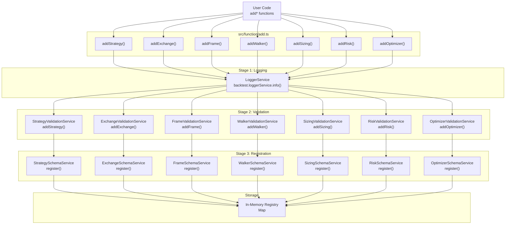
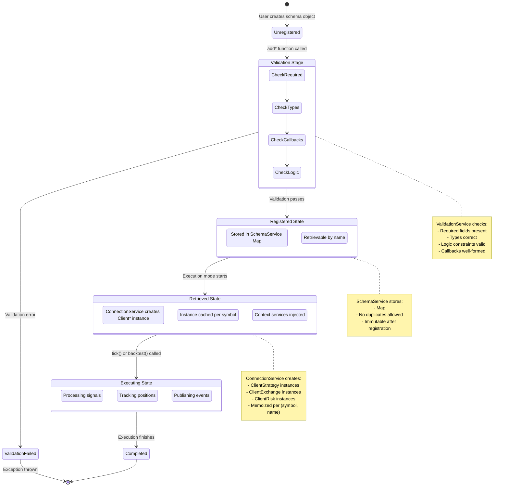
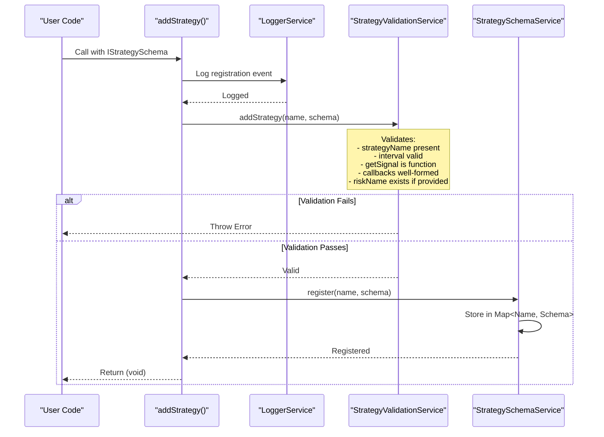
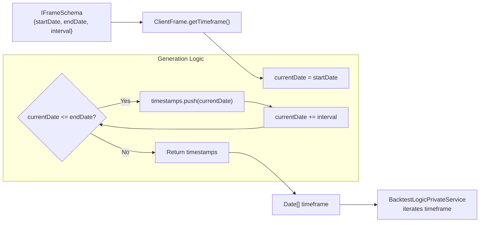
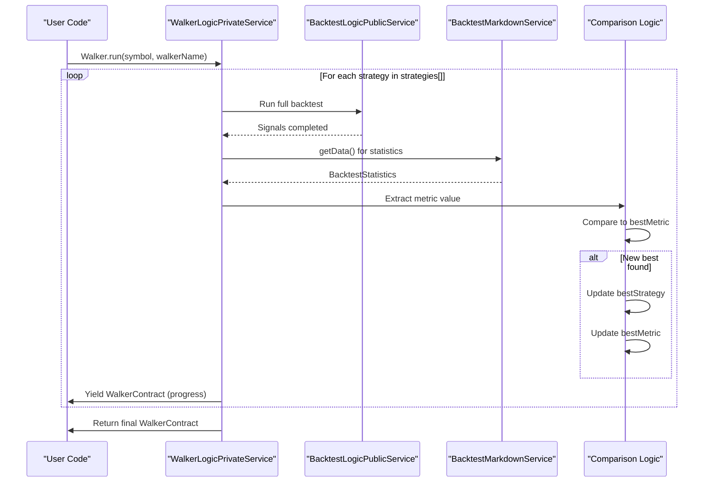
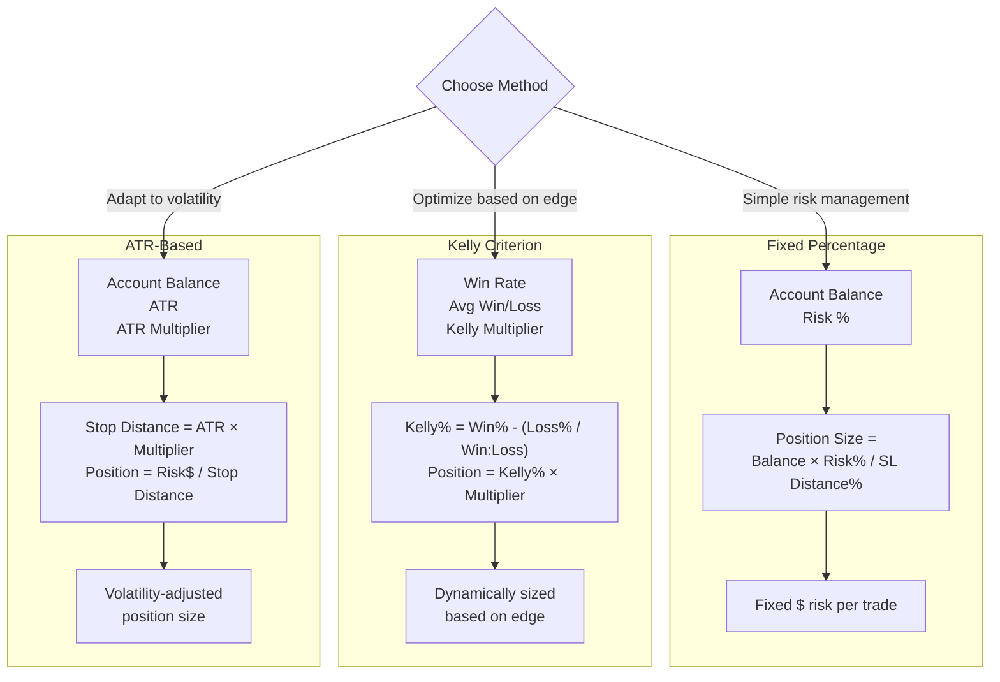
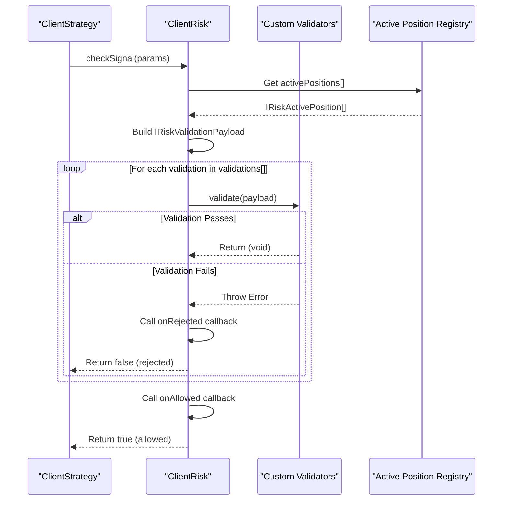
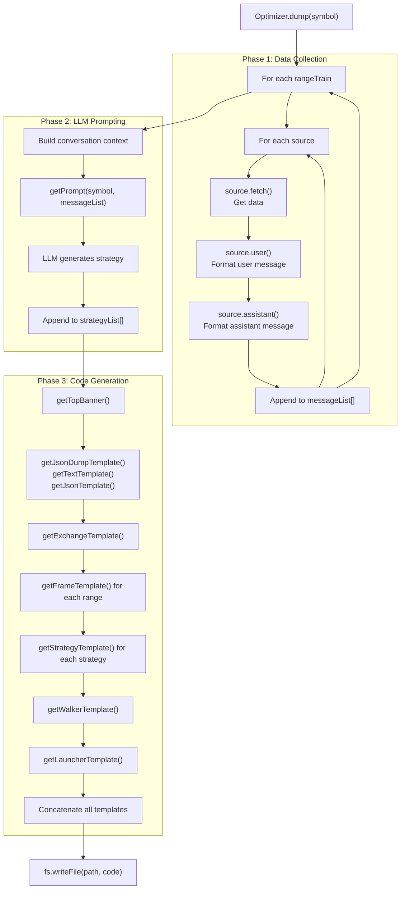
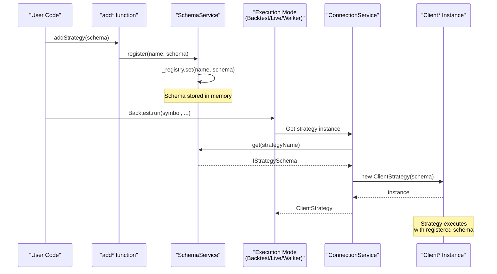

# Component Registration Functions

<details>
<summary>Relevant source files</summary>

The following files were used as context for generating this wiki page:

- [src/client/ClientStrategy.ts](src/client/ClientStrategy.ts)
- [src/function/add.ts](src/function/add.ts)
- [src/interfaces/Strategy.interface.ts](src/interfaces/Strategy.interface.ts)
- [src/lib/core/provide.ts](src/lib/core/provide.ts)
- [src/lib/core/types.ts](src/lib/core/types.ts)
- [src/lib/index.ts](src/lib/index.ts)
- [types.d.ts](types.d.ts)

</details>


## Purpose and Scope

This page documents the seven component registration functions that configure the backtest-kit framework. These functions (`addStrategy`, `addExchange`, `addFrame`, `addWalker`, `addSizing`, `addRisk`, `addOptimizer`) provide the primary user-facing API for defining trading strategies, data sources, backtesting parameters, comparison logic, position sizing, risk management, and AI-driven optimization.

Each registration function validates its input schema, stores it in a schema service, and makes it available for retrieval during execution. For details on the schema interfaces themselves, see [Component Types](#5). For information on how registered components are instantiated during execution, see [Service Layer](#7).

---

## Registration Architecture

The component registration system implements a three-stage pipeline that transforms user-provided configuration into executable framework components.

### Registration Flow Diagram



**Sources:** [src/function/add.ts:1-444]()

### Component Lifecycle



**Sources:** [src/function/add.ts:52-444](), [src/lib/services/schema/*](), [src/lib/services/validation/*](), [src/lib/services/connection/*]()

---

## Registration Functions

### Function Summary Table

| Function | Schema Type | Validation Service | Schema Service | Purpose |
|----------|-------------|-------------------|----------------|---------|
| `addStrategy` | `IStrategySchema` | `StrategyValidationService` | `StrategySchemaService` | Register signal generation logic |
| `addExchange` | `IExchangeSchema` | `ExchangeValidationService` | `ExchangeSchemaService` | Register data source for candles |
| `addFrame` | `IFrameSchema` | `FrameValidationService` | `FrameSchemaService` | Register backtest time period |
| `addWalker` | `IWalkerSchema` | `WalkerValidationService` | `WalkerSchemaService` | Register strategy comparison logic |
| `addSizing` | `ISizingSchema` | `SizingValidationService` | `SizingSchemaService` | Register position sizing method |
| `addRisk` | `IRiskSchema` | `RiskValidationService` | `RiskSchemaService` | Register risk management rules |
| `addOptimizer` | `IOptimizerSchema` | `OptimizerValidationService` | `OptimizerSchemaService` | Register AI strategy generator |

**Sources:** [src/function/add.ts:10-16]()

---

## addStrategy

Registers a trading strategy that generates buy/sell signals based on market conditions. The strategy defines signal generation logic, interval throttling, and optional lifecycle callbacks.

### Function Signature

```typescript
function addStrategy(strategySchema: IStrategySchema): void
```

### Schema Interface

```typescript
interface IStrategySchema {
  strategyName: StrategyName;           // Unique identifier
  interval: SignalInterval;             // Throttling interval
  getSignal: (symbol: string, when: Date) => Promise<ISignalDto | null>;
  callbacks?: Partial<IStrategyCallbacks>;
  riskName?: RiskName;                  // Optional risk profile
  note?: string;                        // Optional documentation
}
```

**Sources:** [types.d.ts:816-833](), [src/interfaces/Strategy.interface.ts:129-149]()

### Signal Intervals

Valid throttling intervals that enforce minimum time between `getSignal` calls:

| Interval | Duration | Use Case |
|----------|----------|----------|
| `"1m"` | 1 minute | High-frequency scalping |
| `"3m"` | 3 minutes | Short-term momentum |
| `"5m"` | 5 minutes | Standard intraday |
| `"15m"` | 15 minutes | Swing trading |
| `"30m"` | 30 minutes | Position trading |
| `"1h"` | 1 hour | Long-term strategies |

**Sources:** [src/client/ClientStrategy.ts:32-39]()

### Lifecycle Callbacks

Optional callbacks invoked during signal lifecycle transitions:

| Callback | Trigger | Parameters |
|----------|---------|------------|
| `onTick` | Every tick execution | `symbol`, `result`, `backtest` |
| `onIdle` | No active signal | `symbol`, `currentPrice`, `backtest` |
| `onSchedule` | Scheduled signal created | `symbol`, `data`, `currentPrice`, `backtest` |
| `onOpen` | Signal activated | `symbol`, `data`, `currentPrice`, `backtest` |
| `onActive` | Signal being monitored | `symbol`, `data`, `currentPrice`, `backtest` |
| `onPartialProfit` | Milestone profit reached | `symbol`, `data`, `currentPrice`, `revenuePercent`, `backtest` |
| `onPartialLoss` | Milestone loss reached | `symbol`, `data`, `currentPrice`, `lossPercent`, `backtest` |
| `onClose` | Signal completed | `symbol`, `data`, `priceClose`, `backtest` |
| `onCancel` | Scheduled signal cancelled | `symbol`, `data`, `currentPrice`, `backtest` |
| `onWrite` | Signal persisted | `symbol`, `data`, `backtest` |

**Sources:** [types.d.ts:789-811](), [src/interfaces/Strategy.interface.ts:100-126]()

### Registration Process



**Sources:** [src/function/add.ts:52-64]()

### Example Usage

```typescript
addStrategy({
  strategyName: "rsi-oversold",
  interval: "5m",
  note: "Buy when RSI < 30, sell at resistance",
  riskName: "conservative",
  getSignal: async (symbol, when) => {
    const rsi = await calculateRSI(symbol, when, 14);
    
    if (rsi < 30) {
      const currentPrice = await getCurrentPrice(symbol);
      return {
        position: "long",
        priceOpen: currentPrice,
        priceTakeProfit: currentPrice * 1.02,
        priceStopLoss: currentPrice * 0.99,
        minuteEstimatedTime: 60,
        note: `RSI oversold at ${rsi.toFixed(2)}`
      };
    }
    
    return null;
  },
  callbacks: {
    onOpen: (symbol, data, currentPrice, backtest) => {
      console.log(`[OPEN] ${symbol} ${data.position} @ ${currentPrice}`);
    },
    onClose: (symbol, data, priceClose, backtest) => {
      console.log(`[CLOSE] ${symbol} @ ${priceClose}`);
    }
  }
});
```

**Sources:** [src/function/add.ts:32-50]()

---

## addExchange

Registers a data source that provides historical candle data and price formatting. The exchange implementation can connect to CCXT, custom APIs, databases, or any other data provider.

### Function Signature

```typescript
function addExchange(exchangeSchema: IExchangeSchema): void
```

### Schema Interface

```typescript
interface IExchangeSchema {
  exchangeName: ExchangeName;          // Unique identifier
  getCandles: (
    symbol: string,
    interval: CandleInterval,
    since: Date,
    limit: number
  ) => Promise<ICandleData[]>;
  formatPrice: (symbol: string, price: number) => Promise<string>;
  formatQuantity: (symbol: string, quantity: number) => Promise<string>;
  callbacks?: Partial<IExchangeCallbacks>;
  note?: string;                       // Optional documentation
}
```

**Sources:** [types.d.ts:223-259](), [src/interfaces/Exchange.interface.ts:223-259]()

### Candle Data Structure

```typescript
interface ICandleData {
  timestamp: number;    // Unix timestamp in milliseconds
  open: number;         // Opening price
  high: number;         // Highest price in period
  low: number;          // Lowest price in period
  close: number;        // Closing price
  volume: number;       // Trading volume in period
}
```

**Sources:** [types.d.ts:191-204]()

### Candle Intervals

Valid intervals for candle data fetching:

| Interval | Duration | Purpose |
|----------|----------|---------|
| `"1m"` | 1 minute | VWAP calculation, fine-grained backtesting |
| `"3m"` | 3 minutes | Short-term pattern detection |
| `"5m"` | 5 minutes | Intraday analysis |
| `"15m"` | 15 minutes | Standard technical analysis |
| `"30m"` | 30 minutes | Swing trading indicators |
| `"1h"` | 1 hour | Hourly trends |
| `"2h"` | 2 hours | Extended timeframe analysis |
| `"4h"` | 4 hours | Multi-hour patterns |
| `"6h"` | 6 hours | Daily cycle analysis |
| `"8h"` | 8 hours | Three-shift patterns |

**Sources:** [types.d.ts:186]()

### Registration Process

The `addExchange` function follows the same three-stage pipeline as other registration functions:

1. **Logging**: Records the exchange schema in LoggerService
2. **Validation**: ExchangeValidationService checks required methods and data structure
3. **Registration**: ExchangeSchemaService stores schema in Map

**Sources:** [src/function/add.ts:101-113]()

### Example Usage

```typescript
// CCXT Integration
import ccxt from 'ccxt';

const exchange = new ccxt.binance();

addExchange({
  exchangeName: "binance",
  note: "Binance via CCXT",
  getCandles: async (symbol, interval, since, limit) => {
    const ohlcv = await exchange.fetchOHLCV(
      symbol,
      interval,
      since.getTime(),
      limit
    );
    
    return ohlcv.map(([timestamp, open, high, low, close, volume]) => ({
      timestamp,
      open,
      high,
      low,
      close,
      volume
    }));
  },
  formatPrice: async (symbol, price) => {
    const market = exchange.market(symbol);
    return exchange.priceToPrecision(symbol, price);
  },
  formatQuantity: async (symbol, quantity) => {
    const market = exchange.market(symbol);
    return exchange.amountToPrecision(symbol, quantity);
  }
});

// Database Integration
addExchange({
  exchangeName: "historical-db",
  note: "PostgreSQL historical data",
  getCandles: async (symbol, interval, since, limit) => {
    const rows = await db.query(
      `SELECT * FROM candles 
       WHERE symbol = $1 AND interval = $2 
       AND timestamp >= $3 
       ORDER BY timestamp ASC 
       LIMIT $4`,
      [symbol, interval, since, limit]
    );
    return rows.map(row => ({
      timestamp: row.timestamp,
      open: parseFloat(row.open),
      high: parseFloat(row.high),
      low: parseFloat(row.low),
      close: parseFloat(row.close),
      volume: parseFloat(row.volume)
    }));
  },
  formatPrice: async (symbol, price) => price.toFixed(2),
  formatQuantity: async (symbol, quantity) => quantity.toFixed(8)
});
```

**Sources:** [src/function/add.ts:83-99]()

---

## addFrame

Registers a timeframe definition for backtesting. The frame specifies the date range and interval for generating timestamps that drive backtest execution.

### Function Signature

```typescript
function addFrame(frameSchema: IFrameSchema): void
```

### Schema Interface

```typescript
interface IFrameSchema {
  frameName: FrameName;              // Unique identifier
  interval: FrameInterval;           // Timestamp generation interval
  startDate: Date;                   // Backtest start (inclusive)
  endDate: Date;                     // Backtest end (inclusive)
  callbacks?: Partial<IFrameCallbacks>;
  note?: string;                     // Optional documentation
}
```

**Sources:** [types.d.ts:366-379](), [src/interfaces/Frame.interface.ts:347-379]()

### Frame Intervals

Valid intervals for timeframe generation:

| Interval | Duration | Timestamps Generated |
|----------|----------|---------------------|
| `"1m"` | 1 minute | Every minute in range |
| `"3m"` | 3 minutes | Every 3rd minute |
| `"5m"` | 5 minutes | Every 5th minute |
| `"15m"` | 15 minutes | Every 15th minute |
| `"30m"` | 30 minutes | Every 30th minute |
| `"1h"` | 1 hour | Every hour |
| `"2h"` | 2 hours | Every 2nd hour |
| `"4h"` | 4 hours | Every 4th hour |
| `"6h"` | 6 hours | Every 6th hour |
| `"8h"` | 8 hours | Every 8th hour |
| `"12h"` | 12 hours | Every 12th hour |
| `"1d"` | 1 day | Daily at midnight UTC |
| `"3d"` | 3 days | Every 3rd day |

**Sources:** [types.d.ts:323]()

### Timeframe Generation Process



**Sources:** [src/function/add.ts:145-151]()

### Example Usage

```typescript
// Single day backtest with 1-minute granularity
addFrame({
  frameName: "1d-minute",
  interval: "1m",
  startDate: new Date("2024-01-01T00:00:00Z"),
  endDate: new Date("2024-01-02T00:00:00Z"),
  note: "24 hours at 1-minute intervals = 1440 ticks",
  callbacks: {
    onTimeframe: (timeframe, startDate, endDate, interval) => {
      console.log(`Generated ${timeframe.length} timestamps`);
      console.log(`First: ${timeframe[0].toISOString()}`);
      console.log(`Last: ${timeframe[timeframe.length - 1].toISOString()}`);
    }
  }
});

// Monthly backtest with 1-hour granularity
addFrame({
  frameName: "jan-2024",
  interval: "1h",
  startDate: new Date("2024-01-01T00:00:00Z"),
  endDate: new Date("2024-01-31T23:59:59Z"),
  note: "January 2024 at hourly intervals"
});

// Training period for optimizer
addFrame({
  frameName: "training-q1",
  interval: "15m",
  startDate: new Date("2024-01-01T00:00:00Z"),
  endDate: new Date("2024-03-31T23:59:59Z"),
  note: "Q1 2024 training data"
});
```

**Sources:** [src/function/add.ts:130-143]()

---

## addWalker

Registers a walker configuration that compares multiple strategies on the same historical data. Walkers execute strategies sequentially and rank them by a specified metric.

### Function Signature

```typescript
function addWalker(walkerSchema: IWalkerSchema): void
```

### Schema Interface

```typescript
interface IWalkerSchema {
  walkerName: WalkerName;              // Unique identifier
  exchangeName: ExchangeName;          // Exchange for all strategies
  frameName: FrameName;                // Frame for all strategies
  strategies: StrategyName[];          // Strategies to compare
  metric?: WalkerMetric;               // Ranking metric (default: sharpeRatio)
  callbacks?: Partial<IWalkerCallbacks>;
  note?: string;                       // Optional documentation
}
```

**Sources:** [types.d.ts (Walker section)]()

### Walker Metrics

Metrics available for strategy comparison:

| Metric | Full Name | Description | Formula |
|--------|-----------|-------------|---------|
| `sharpeRatio` | Sharpe Ratio | Risk-adjusted returns | `mean(returns) / stddev(returns)` |
| `annualizedSharpe` | Annualized Sharpe | Annualized risk-adjusted returns | `sharpeRatio * sqrt(periods_per_year)` |
| `winRate` | Win Rate | Percentage of profitable signals | `wins / total_signals * 100` |
| `avgPnl` | Average PnL | Mean profit/loss per signal | `sum(pnl) / total_signals` |
| `totalPnl` | Total PnL | Cumulative profit/loss | `sum(all_pnl)` |
| `certaintyRatio` | Certainty Ratio | Win rate weighted by magnitude | `(wins - losses) / total_signals` |

**Sources:** [types.d.ts (statistics section)]()

### Walker Execution Flow



**Sources:** [src/function/add.ts:190-202]()

### Example Usage

```typescript
// Compare 3 RSI variants
addWalker({
  walkerName: "rsi-optimization",
  exchangeName: "binance",
  frameName: "jan-2024",
  strategies: [
    "rsi-14-oversold",
    "rsi-21-oversold",
    "rsi-28-oversold"
  ],
  metric: "sharpeRatio",
  note: "Find optimal RSI period",
  callbacks: {
    onStrategyComplete: (strategyName, symbol, stats, metric) => {
      console.log(`${strategyName}: Sharpe=${metric.toFixed(3)}`);
    },
    onComplete: (results) => {
      console.log(`Winner: ${results.bestStrategy}`);
      console.log(`Best Sharpe: ${results.bestMetric.toFixed(3)}`);
    }
  }
});

// Compare different strategy types
addWalker({
  walkerName: "strategy-comparison",
  exchangeName: "binance",
  frameName: "1d-minute",
  strategies: [
    "mean-reversion",
    "momentum-breakout",
    "bollinger-bands",
    "macd-crossover"
  ],
  metric: "winRate",
  note: "Compare strategy families"
});
```

**Sources:** [src/function/add.ts:168-188]()

---

## addSizing

Registers a position sizing configuration that calculates trade quantities based on account balance, risk parameters, and market conditions. Supports fixed-percentage, Kelly criterion, and ATR-based methods.

### Function Signature

```typescript
function addSizing(sizingSchema: ISizingSchema): void
```

### Schema Interface (Discriminated Union)

```typescript
type ISizingSchema =
  | ISizingSchemaFixedPercentage
  | ISizingSchemaKellyCriterion
  | ISizingSchemaATRBased;

interface ISizingSchemaFixedPercentage {
  sizingName: SizingName;
  method: "fixed-percentage";
  riskPercentage: number;              // % of account to risk per trade
  maxPositionPercentage?: number;      // Max % of account per position
  minPositionSize?: number;
  maxPositionSize?: number;
  callbacks?: Partial<ISizingCallbacks>;
  note?: string;
}

interface ISizingSchemaKellyCriterion {
  sizingName: SizingName;
  method: "kelly-criterion";
  kellyMultiplier?: number;            // Fraction of Kelly (default: 0.25)
  maxPositionPercentage?: number;
  minPositionSize?: number;
  maxPositionSize?: number;
  callbacks?: Partial<ISizingCallbacks>;
  note?: string;
}

interface ISizingSchemaATRBased {
  sizingName: SizingName;
  method: "atr-based";
  riskPercentage: number;
  atrMultiplier?: number;              // ATR multiplier for stop distance (default: 2)
  maxPositionPercentage?: number;
  minPositionSize?: number;
  maxPositionSize?: number;
  callbacks?: Partial<ISizingCallbacks>;
  note?: string;
}
```

**Sources:** [types.d.ts (Sizing section)]()

### Sizing Method Comparison



**Sources:** [src/function/add.ts:256-268]()

### Example Usage

```typescript
// Fixed percentage risk
addSizing({
  sizingName: "fixed-2pct",
  method: "fixed-percentage",
  riskPercentage: 2,
  maxPositionPercentage: 10,
  note: "Risk 2% per trade, max 10% position"
});

// Kelly criterion with fractional Kelly
addSizing({
  sizingName: "quarter-kelly",
  method: "kelly-criterion",
  kellyMultiplier: 0.25,
  maxPositionPercentage: 20,
  note: "Conservative Kelly sizing",
  callbacks: {
    onCalculate: (quantity, params) => {
      console.log(`Kelly size: ${quantity} for ${params.symbol}`);
    }
  }
});

// ATR-based dynamic sizing
addSizing({
  sizingName: "atr-dynamic",
  method: "atr-based",
  riskPercentage: 1.5,
  atrMultiplier: 2,
  minPositionSize: 0.001,
  maxPositionSize: 10,
  note: "Use 2×ATR for stop distance"
});
```

**Sources:** [src/function/add.ts:223-254]()

---

## addRisk

Registers a risk management profile that validates signals before execution. Supports maximum concurrent position limits and custom validation functions with access to portfolio state.

### Function Signature

```typescript
function addRisk(riskSchema: IRiskSchema): void
```

### Schema Interface

```typescript
interface IRiskSchema {
  riskName: RiskName;                  // Unique identifier
  validations: (IRiskValidation | IRiskValidationFn)[];
  callbacks?: Partial<IRiskCallbacks>;
  note?: string;
}

interface IRiskValidation {
  validate: IRiskValidationFn;
  note?: string;                       // Documentation for validation
}

type IRiskValidationFn = (
  payload: IRiskValidationPayload
) => void | Promise<void>;             // Throws error on rejection

interface IRiskValidationPayload {
  symbol: string;
  strategyName: StrategyName;
  exchangeName: ExchangeName;
  currentPrice: number;
  timestamp: number;
  activePositionCount: number;
  activePositions: IRiskActivePosition[];
}
```

**Sources:** [types.d.ts:443-526](), [src/interfaces/Risk.interface.ts:443-526]()

### Risk Validation Flow



**Sources:** [src/function/add.ts:331-343]()

### Example Usage

```typescript
// Simple concurrent position limit
addRisk({
  riskName: "basic-limit",
  validations: [
    ({ activePositionCount }) => {
      if (activePositionCount >= 5) {
        throw new Error("Maximum 5 concurrent positions");
      }
    }
  ],
  callbacks: {
    onRejected: (symbol, params) => {
      console.log(`[RISK] Rejected ${symbol}: Too many positions`);
    }
  }
});

// Advanced portfolio risk management
addRisk({
  riskName: "advanced-portfolio",
  validations: [
    // Max concurrent positions
    {
      validate: ({ activePositionCount }) => {
        if (activePositionCount >= 10) {
          throw new Error("Max 10 positions");
        }
      },
      note: "Global position limit"
    },
    
    // Max exposure per symbol
    {
      validate: ({ symbol, activePositions }) => {
        const symbolPositions = activePositions.filter(
          pos => pos.signal.symbol === symbol
        );
        if (symbolPositions.length >= 2) {
          throw new Error(`Max 2 positions for ${symbol}`);
        }
      },
      note: "Symbol concentration limit"
    },
    
    // Portfolio drawdown check
    {
      validate: async ({ activePositions, currentPrice }) => {
        const unrealizedPnL = activePositions.reduce((sum, pos) => {
          const pnl = calculatePnL(pos.signal, currentPrice);
          return sum + pnl;
        }, 0);
        
        if (unrealizedPnL < -5000) {
          throw new Error("Portfolio drawdown exceeds $5,000");
        }
      },
      note: "Drawdown circuit breaker"
    },
    
    // Time-based filter
    {
      validate: ({ timestamp }) => {
        const hour = new Date(timestamp).getUTCHours();
        // Avoid trading during low liquidity hours
        if (hour >= 0 && hour < 6) {
          throw new Error("No trading during 00:00-06:00 UTC");
        }
      },
      note: "Avoid low liquidity periods"
    }
  ]
});
```

**Sources:** [src/function/add.ts:288-329]()

---

## addOptimizer

Registers an AI-powered optimizer that generates trading strategies by analyzing historical data with LLM assistance. The optimizer collects multi-timeframe data, builds conversation history, and generates executable strategy code.

### Function Signature

```typescript
function addOptimizer(optimizerSchema: IOptimizerSchema): void
```

### Schema Interface

```typescript
interface IOptimizerSchema {
  optimizerName: OptimizerName;
  rangeTrain: IOptimizerRange[];       // Training periods
  rangeTest: IOptimizerRange;          // Validation period
  source: (IOptimizerSource | IOptimizerSourceFn)[];
  getPrompt: (
    symbol: string,
    messages: IOptimizerMessage[]
  ) => Promise<string>;                // Generate strategy prompt
  template?: Partial<IOptimizerTemplate>;
  callbacks?: Partial<IOptimizerCallbacks>;
  note?: string;
}

interface IOptimizerRange {
  note?: string;
  startDate: Date;
  endDate: Date;
}

interface IOptimizerSource {
  name: string;
  fetch: IOptimizerFetchFn;
  user: IOptimizerMessageFormatterFn;
  assistant: IOptimizerMessageFormatterFn;
}

type IOptimizerSourceFn = (
  symbol: string,
  startDate: Date,
  endDate: Date
) => Promise<IOptimizerMessage[]>;
```

**Sources:** [types.d.ts (Optimizer section)]()

### Optimizer Data Collection Pipeline



**Sources:** [src/function/add.ts:432-444]()

### Example Usage

```typescript
// Basic optimizer with single source
addOptimizer({
  optimizerName: "rsi-generator",
  rangeTrain: [
    {
      note: "Bull market training",
      startDate: new Date("2024-01-01"),
      endDate: new Date("2024-01-31")
    },
    {
      note: "Bear market training",
      startDate: new Date("2024-02-01"),
      endDate: new Date("2024-02-28")
    }
  ],
  rangeTest: {
    note: "Validation period",
    startDate: new Date("2024-03-01"),
    endDate: new Date("2024-03-31")
  },
  source: [
    async (symbol, startDate, endDate) => {
      const data = await fetchCandleData(symbol, "1h", startDate, endDate);
      const rsi = calculateRSI(data, 14);
      
      return [
        {
          role: "user",
          content: `Analyze ${symbol} RSI data from ${startDate} to ${endDate}:\n${formatRSIData(rsi)}`
        },
        {
          role: "assistant",
          content: "RSI data analyzed. Ready for strategy generation."
        }
      ];
    }
  ],
  getPrompt: async (symbol, messages) => {
    return `Generate a trading strategy for ${symbol} based on RSI indicator. 
            Use RSI < 30 for buy signals and RSI > 70 for sell signals.
            Set take profit at 2% and stop loss at 1%.`;
  },
  callbacks: {
    onData: (symbol, strategyData) => {
      console.log(`Generated ${strategyData.length} strategies`);
    },
    onCode: (symbol, code) => {
      console.log(`Generated ${code.length} chars of code`);
    },
    onDump: (symbol, filepath) => {
      console.log(`Saved to ${filepath}`);
    }
  }
});

// Advanced optimizer with multiple sources
addOptimizer({
  optimizerName: "multi-timeframe-llm",
  rangeTrain: [
    { startDate: new Date("2024-01-01"), endDate: new Date("2024-01-15") },
    { startDate: new Date("2024-01-16"), endDate: new Date("2024-01-31") }
  ],
  rangeTest: {
    startDate: new Date("2024-02-01"),
    endDate: new Date("2024-02-29")
  },
  source: [
    {
      name: "1h-candles",
      fetch: async ({ symbol, startDate, endDate, limit, offset }) => {
        return await fetchCandles(symbol, "1h", startDate, endDate);
      },
      user: async (symbol, data, name) => {
        return `1-hour candles for ${symbol}:\n${formatCandles(data)}`;
      },
      assistant: async (symbol, data, name) => {
        return "1-hour data processed.";
      }
    },
    {
      name: "15m-candles",
      fetch: async ({ symbol, startDate, endDate, limit, offset }) => {
        return await fetchCandles(symbol, "15m", startDate, endDate);
      },
      user: async (symbol, data, name) => {
        return `15-minute candles for ${symbol}:\n${formatCandles(data)}`;
      },
      assistant: async (symbol, data, name) => {
        return "15-minute data processed.";
      }
    }
  ],
  getPrompt: async (symbol, messages) => {
    const llmResponse = await callLLM({
      model: "gpt-4",
      messages: [
        { role: "system", content: "You are a trading strategy expert." },
        ...messages,
        { role: "user", content: `Generate a trading strategy for ${symbol}` }
      ]
    });
    return llmResponse.content;
  }
});
```

**Sources:** [src/function/add.ts:364-430]()

---

## Service Dependencies

The registration functions depend on two service categories that are injected via the dependency injection container.

### Service Dependency Diagram

```mermaid
graph TB
    subgraph "src/function/add.ts"
        AddStrategy["addStrategy()"]
        AddExchange["addExchange()"]
        AddFrame["addFrame()"]
        AddWalker["addWalker()"]
        AddSizing["addSizing()"]
        AddRisk["addRisk()"]
        AddOptimizer["addOptimizer()"]
    end
    
    subgraph "Validation Services (src/lib/services/validation/)"
        StratVal["StrategyValidationService"]
        ExchVal["ExchangeValidationService"]
        FrameVal["FrameValidationService"]
        WalkerVal["WalkerValidationService"]
        SizingVal["SizingValidationService"]
        RiskVal["RiskValidationService"]
        OptimizerVal["OptimizerValidationService"]
    end
    
    subgraph "Schema Services (src/lib/services/schema/)"
        StratSchema["StrategySchemaService"]
        ExchSchema["ExchangeSchemaService"]
        FrameSchema["FrameSchemaService"]
        WalkerSchema["WalkerSchemaService"]
        SizingSchema["SizingSchemaService"]
        RiskSchema["RiskSchemaService"]
        OptimizerSchema["OptimizerSchemaService"]
    end
    
    subgraph "backtest Object (src/lib/index.ts)"
        Logger["loggerService"]
        ValidationAgg["*ValidationService"]
        SchemaAgg["*SchemaService"]
    end
    
    AddStrategy --> Logger
    AddStrategy --> StratVal
    AddStrategy --> StratSchema
    
    AddExchange --> Logger
    AddExchange --> ExchVal
    AddExchange --> ExchSchema
    
    AddFrame --> Logger
    AddFrame --> FrameVal
    AddFrame --> FrameSchema
    
    AddWalker --> Logger
    AddWalker --> WalkerVal
    AddWalker --> WalkerSchema
    
    AddSizing --> Logger
    AddSizing --> SizingVal
    AddSizing --> SizingSchema
    
    AddRisk --> Logger
    AddRisk --> RiskVal
    AddRisk --> RiskSchema
    
    AddOptimizer --> Logger
    AddOptimizer --> OptimizerVal
    AddOptimizer --> OptimizerSchema
    
    Logger --> ValidationAgg
    StratVal --> ValidationAgg
    ExchVal --> ValidationAgg
    FrameVal --> ValidationAgg
    WalkerVal --> ValidationAgg
    SizingVal --> ValidationAgg
    RiskVal --> ValidationAgg
    OptimizerVal --> ValidationAgg
    
    StratSchema --> SchemaAgg
    ExchSchema --> SchemaAgg
    FrameSchema --> SchemaAgg
    WalkerSchema --> SchemaAgg
    SizingSchema --> SchemaAgg
    RiskSchema --> SchemaAgg
    OptimizerSchema --> SchemaAgg
```



**Sources:** [src/function/add.ts:1-444](), [src/lib/index.ts:1-232](), [src/lib/core/provide.ts:1-132](), [src/lib/core/types.ts:1-97]()

### Dependency Injection Registration

All services used by registration functions are registered in the DI container at startup:

| Service Category | Registration Location | Service Count |
|-----------------|---------------------|---------------|
| Validation Services | [src/lib/core/provide.ts:119-127]() | 7 services |
| Schema Services | [src/lib/core/provide.ts:71-79]() | 7 services |
| Logger Service | [src/lib/core/provide.ts:53]() | 1 service |

**Sources:** [src/lib/core/provide.ts:1-132](), [src/lib/core/types.ts:1-97]()

---

## Validation Process

Each registration function invokes a corresponding validation service that checks schema integrity before storage. Validation failures throw descriptive errors that prevent registration.

### Validation Service Methods

All validation services implement an `add*` method that performs schema validation:

```typescript
class StrategyValidationService {
  addStrategy(strategyName: StrategyName, schema: IStrategySchema): void {
    // Throws error if validation fails
  }
}

class ExchangeValidationService {
  addExchange(exchangeName: ExchangeName, schema: IExchangeSchema): void {
    // Throws error if validation fails
  }
}

// Similar pattern for Frame, Walker, Sizing, Risk, Optimizer
```

**Sources:** [src/lib/services/validation/*]()

### Common Validation Checks

| Check Type | Validation | Example Error |
|-----------|-----------|---------------|
| Required Fields | Name, interval, functions present | `"strategyName is required"` |
| Type Validation | Functions are functions, dates are dates | `"getSignal must be a function"` |
| Value Constraints | Intervals valid, dates chronological | `"interval must be one of: 1m, 3m, 5m, ..."` |
| Cross-Reference | Referenced names exist | `"riskName 'advanced' not found"` |
| Logic Validation | TP/SL relationships, time ranges | `"startDate must be before endDate"` |
| Duplicate Prevention | No duplicate names | `"strategyName 'my-strategy' already registered"` |

**Sources:** [src/lib/services/validation/*]()

---

## Schema Storage and Retrieval

After successful validation, schemas are stored in schema services that maintain in-memory registries. These registries are queried during execution to retrieve component configurations.

### Schema Service Interface

All schema services implement a consistent interface:

```typescript
class SchemaService<T> {
  private _registry: Map<string, T> = new Map();
  
  register(name: string, schema: T): void {
    this._registry.set(name, schema);
  }
  
  get(name: string): T | undefined {
    return this._registry.get(name);
  }
  
  has(name: string): boolean {
    return this._registry.has(name);
  }
  
  getAll(): T[] {
    return Array.from(this._registry.values());
  }
}
```

**Sources:** [src/lib/services/schema/*]()

### Registry Access Pattern



**Sources:** [src/lib/services/schema/*](), [src/lib/services/connection/*]()

### Registration Summary Table

| Component | Add Function | Schema Service | Connection Service | Client Class |
|-----------|--------------|----------------|-------------------|--------------|
| Strategy | `addStrategy()` | `StrategySchemaService` | `StrategyConnectionService` | `ClientStrategy` |
| Exchange | `addExchange()` | `ExchangeSchemaService` | `ExchangeConnectionService` | `ClientExchange` |
| Frame | `addFrame()` | `FrameSchemaService` | `FrameConnectionService` | `ClientFrame` |
| Walker | `addWalker()` | `WalkerSchemaService` | N/A (logic service) | N/A |
| Sizing | `addSizing()` | `SizingSchemaService` | `SizingConnectionService` | `ClientSizing` |
| Risk | `addRisk()` | `RiskSchemaService` | `RiskConnectionService` | `ClientRisk` |
| Optimizer | `addOptimizer()` | `OptimizerSchemaService` | `OptimizerConnectionService` | `ClientOptimizer` |

**Sources:** [src/function/add.ts:1-444](), [src/lib/services/schema/*](), [src/lib/services/connection/*](), [src/client/*]()