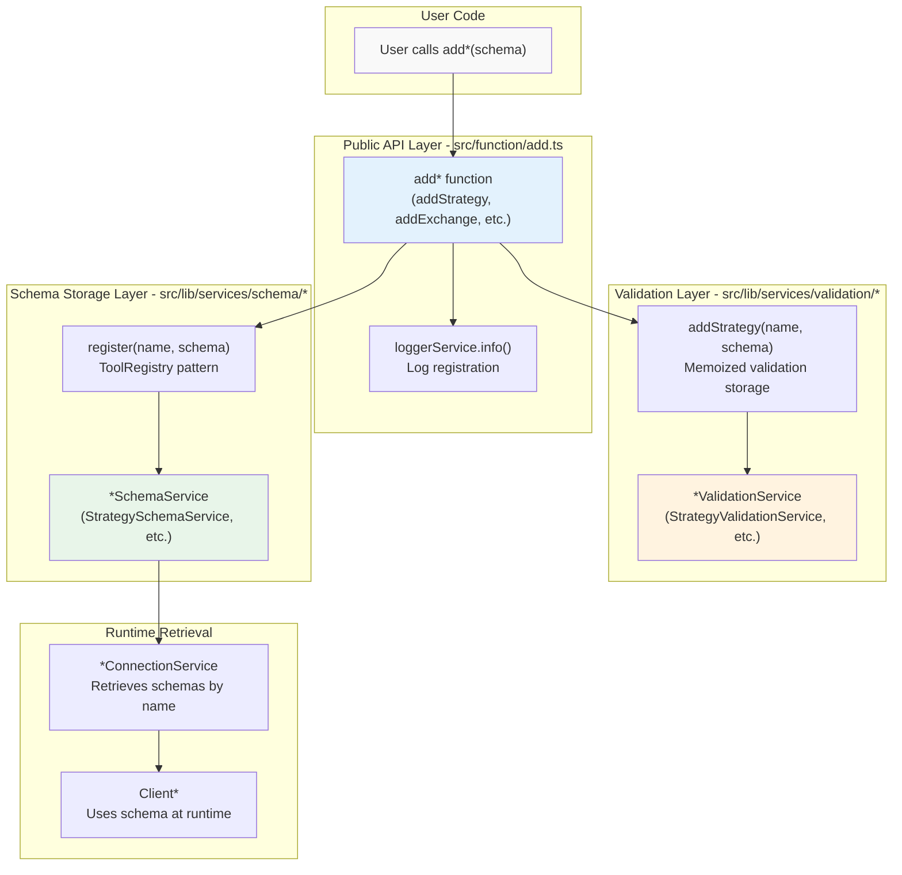
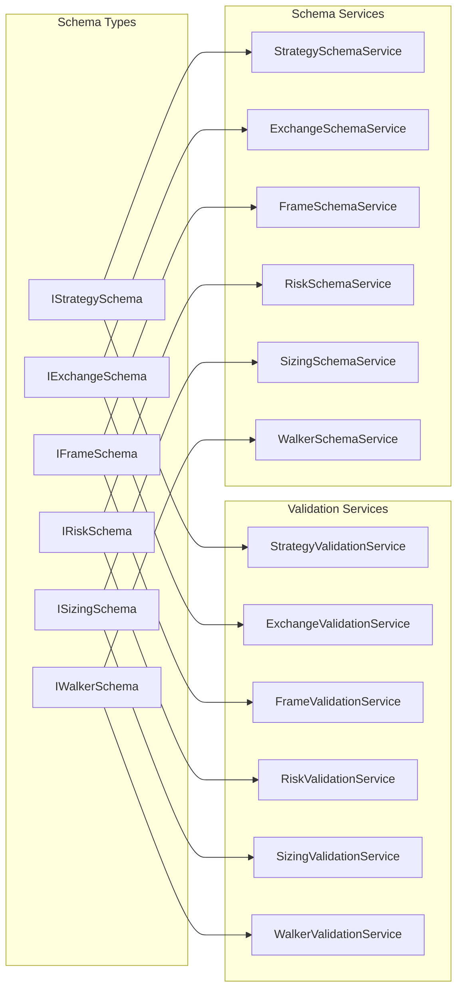
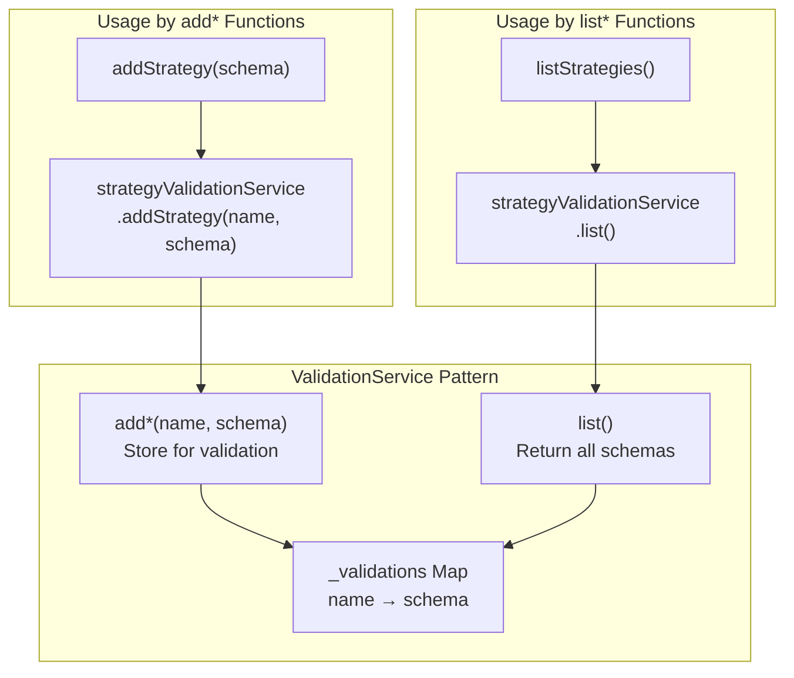
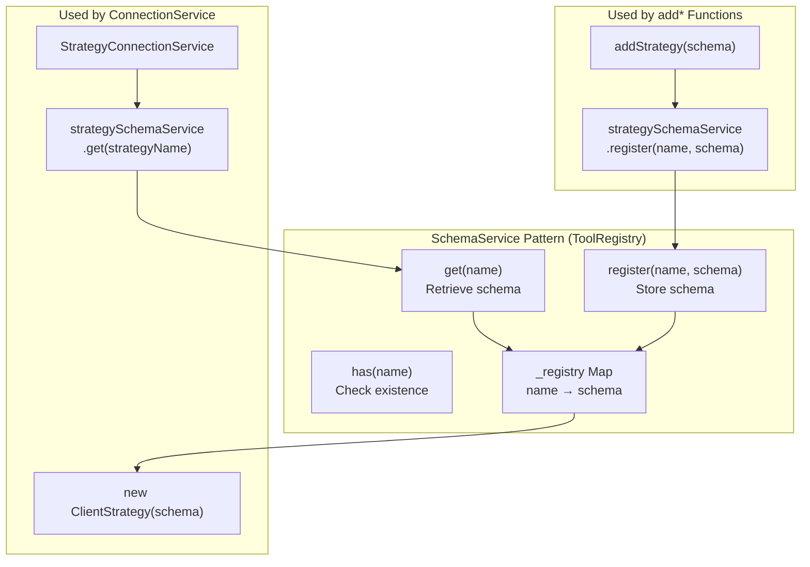

# Component Registration Functions

<details>
<summary>Relevant source files</summary>

The following files were used as context for generating this wiki page:

- [src/function/add.ts](src/function/add.ts)
- [src/function/list.ts](src/function/list.ts)
- [src/index.ts](src/index.ts)
- [src/lib/core/provide.ts](src/lib/core/provide.ts)
- [src/lib/core/types.ts](src/lib/core/types.ts)
- [src/lib/index.ts](src/lib/index.ts)
- [test/index.mjs](test/index.mjs)
- [types.d.ts](types.d.ts)

</details>


This page documents the public API functions for registering and retrieving component schemas in the framework. These functions enable users to define strategies, exchanges, frames, risk profiles, sizing methods, and walkers that the framework uses during execution.

For conceptual information about component registration, see [Component Registration](#2.3). For detailed schema interfaces and their properties, see [Component Types](#5).

---

## Overview

The framework provides six registration functions (`add*`) and corresponding listing functions (`list*`) that manage component schemas:

| Registration Function | Listing Function | Schema Type | Purpose |
|----------------------|------------------|-------------|---------|
| `addStrategy()` | `listStrategies()` | `IStrategySchema` | Register signal generation logic |
| `addExchange()` | `listExchanges()` | `IExchangeSchema` | Register market data source |
| `addFrame()` | `listFrames()` | `IFrameSchema` | Register backtest timeframe |
| `addRisk()` | `listRisks()` | `IRiskSchema` | Register risk management rules |
| `addSizing()` | `listSizings()` | `ISizingSchema` | Register position sizing method |
| `addWalker()` | `listWalkers()` | `IWalkerSchema` | Register multi-strategy comparison |

All registration functions perform two operations:
1. **Validation**: Store schema in `*ValidationService` for runtime validation checks
2. **Storage**: Store schema in `*SchemaService` for retrieval by name

Sources: [src/function/add.ts:1-342](), [src/function/list.ts:1-218](), [src/index.ts:2-3]()

---

## Registration Flow Architecture



**Registration Flow**:
1. User calls `addStrategy()`, `addExchange()`, etc. with schema object
2. Function logs operation via `backtest.loggerService`
3. Schema stored in `*ValidationService` for runtime validation
4. Schema stored in `*SchemaService` for retrieval by name
5. During execution, `*ConnectionService` retrieves schema from `*SchemaService`
6. `Client*` class instantiated with retrieved schema

Sources: [src/function/add.ts:50-62](), [src/lib/core/provide.ts:102-109](), [src/lib/core/types.ts:59-66]()

---

## Service Architecture Mapping



Sources: [src/lib/core/types.ts:18-66](), [src/lib/index.ts:22-27](), [src/lib/index.ts:80-91]()

---

## addStrategy()

Registers a trading strategy schema defining signal generation logic, interval throttling, and lifecycle callbacks.

**Signature**:
```typescript
function addStrategy(strategySchema: IStrategySchema): void
```

**Parameters**:
- `strategySchema.strategyName` (string): Unique strategy identifier
- `strategySchema.interval` (SignalInterval): Throttling interval ("1m" | "3m" | "5m" | "15m" | "30m" | "1h")
- `strategySchema.getSignal` (function): Async function returning `ISignalDto | null`
- `strategySchema.riskName` (string, optional): Risk profile to use
- `strategySchema.callbacks` (object, optional): Lifecycle callbacks (onOpen, onClose, onTick, etc.)
- `strategySchema.note` (string, optional): Developer documentation

For detailed `IStrategySchema` documentation, see [Strategy Schemas](#5.1).

**Example**:
```typescript
addStrategy({
  strategyName: "momentum-long",
  interval: "5m",
  riskName: "conservative",
  getSignal: async (symbol) => {
    const candles = await getCandles(symbol, "5m", 20);
    // Signal generation logic...
    return {
      position: "long",
      priceTakeProfit: 51000,
      priceStopLoss: 49000,
      minuteEstimatedTime: 60,
    };
  },
  callbacks: {
    onOpen: (symbol, signal, price, backtest) => {
      console.log(`Signal opened: ${signal.id}`);
    },
  },
});
```

**Internal Flow**:
1. Log via `backtest.loggerService.info()`
2. Store in `StrategyValidationService` via `addStrategy(name, schema)`
3. Store in `StrategySchemaService` via `register(name, schema)`

Sources: [src/function/add.ts:16-62](), [types.d.ts:616-633]()

---

## listStrategies()

Returns array of all registered strategy schemas.

**Signature**:
```typescript
async function listStrategies(): Promise<IStrategySchema[]>
```

**Returns**: Array of strategy schemas with all properties (strategyName, interval, getSignal, callbacks, etc.)

**Example**:
```typescript
const strategies = await listStrategies();
console.log(strategies.map(s => s.strategyName));
// ["momentum-long", "mean-reversion", "breakout-v2"]
```

**Internal Flow**: Delegates to `backtest.strategyValidationService.list()` which returns all registered schemas.

Sources: [src/function/list.ts:76-79](), [types.d.ts:616-633]()

---

## addExchange()

Registers an exchange data source providing candle data, price formatting, and quantity formatting.

**Signature**:
```typescript
function addExchange(exchangeSchema: IExchangeSchema): void
```

**Parameters**:
- `exchangeSchema.exchangeName` (string): Unique exchange identifier
- `exchangeSchema.getCandles` (function): Fetch historical candle data
- `exchangeSchema.formatPrice` (function): Format price for exchange precision
- `exchangeSchema.formatQuantity` (function): Format quantity for exchange precision
- `exchangeSchema.callbacks` (object, optional): Lifecycle callbacks (onCandleData)
- `exchangeSchema.note` (string, optional): Developer documentation

For detailed `IExchangeSchema` documentation, see [Exchange Schemas](#5.2).

**Example**:
```typescript
addExchange({
  exchangeName: "binance-spot",
  getCandles: async (symbol, interval, since, limit) => {
    // Fetch from Binance API or database
    return [{
      timestamp: Date.now(),
      open: 50000,
      high: 51000,
      low: 49000,
      close: 50500,
      volume: 100.5,
    }];
  },
  formatPrice: async (symbol, price) => {
    return price.toFixed(2);
  },
  formatQuantity: async (symbol, quantity) => {
    return quantity.toFixed(8);
  },
});
```

**Internal Flow**:
1. Log via `backtest.loggerService.info()`
2. Store in `ExchangeValidationService` via `addExchange(name, schema)`
3. Store in `ExchangeSchemaService` via `register(name, schema)`

Sources: [src/function/add.ts:64-111](), [types.d.ts:188-221]()

---

## listExchanges()

Returns array of all registered exchange schemas.

**Signature**:
```typescript
async function listExchanges(): Promise<IExchangeSchema[]>
```

**Returns**: Array of exchange schemas with all properties (exchangeName, getCandles, formatPrice, formatQuantity, callbacks)

**Example**:
```typescript
const exchanges = await listExchanges();
exchanges.forEach(ex => {
  console.log(`Exchange: ${ex.exchangeName}`);
  if (ex.note) console.log(`  Note: ${ex.note}`);
});
```

Sources: [src/function/list.ts:41-44](), [types.d.ts:188-221]()

---

## addFrame()

Registers a timeframe generator for backtesting, defining start/end dates and interval for timestamp generation.

**Signature**:
```typescript
function addFrame(frameSchema: IFrameSchema): void
```

**Parameters**:
- `frameSchema.frameName` (string): Unique frame identifier
- `frameSchema.interval` (FrameInterval): Timeframe interval ("1m" | "3m" | "5m" | "15m" | "30m" | "1h" | "2h" | "4h" | "6h" | "8h" | "12h" | "1d" | "3d")
- `frameSchema.startDate` (Date): Backtest period start (inclusive)
- `frameSchema.endDate` (Date): Backtest period end (inclusive)
- `frameSchema.callbacks` (object, optional): Lifecycle callbacks (onTimeframe)
- `frameSchema.note` (string, optional): Developer documentation

For detailed `IFrameSchema` documentation, see [Frame Schemas](#5.3).

**Example**:
```typescript
addFrame({
  frameName: "jan-2024",
  interval: "1m",
  startDate: new Date("2024-01-01T00:00:00Z"),
  endDate: new Date("2024-01-31T23:59:59Z"),
  callbacks: {
    onTimeframe: (timeframe, start, end, interval) => {
      console.log(`Generated ${timeframe.length} timestamps`);
    },
  },
});
```

**Internal Flow**:
1. Log via `backtest.loggerService.info()`
2. Store in `FrameValidationService` via `addFrame(name, schema)`
3. Store in `FrameSchemaService` via `register(name, schema)`

Sources: [src/function/add.ts:113-149](), [types.d.ts:309-341]()

---

## listFrames()

Returns array of all registered frame schemas.

**Signature**:
```typescript
async function listFrames(): Promise<IFrameSchema[]>
```

**Returns**: Array of frame schemas with all properties (frameName, interval, startDate, endDate, callbacks)

**Example**:
```typescript
const frames = await listFrames();
frames.forEach(frame => {
  console.log(`Frame: ${frame.frameName}`);
  console.log(`  Period: ${frame.startDate} to ${frame.endDate}`);
  console.log(`  Interval: ${frame.interval}`);
});
```

Sources: [src/function/list.ts:106-109](), [types.d.ts:309-341]()

---

## addRisk()

Registers a risk management configuration with custom validation functions and portfolio-level position limits.

**Signature**:
```typescript
function addRisk(riskSchema: IRiskSchema): void
```

**Parameters**:
- `riskSchema.riskName` (string): Unique risk profile identifier
- `riskSchema.validations` (array): Custom validation functions with access to active positions
- `riskSchema.callbacks` (object, optional): Lifecycle callbacks (onRejected, onAllowed)
- `riskSchema.note` (string, optional): Developer documentation

For detailed `IRiskSchema` documentation and validation patterns, see [Risk Schemas](#5.4).

**Example**:
```typescript
addRisk({
  riskName: "advanced",
  validations: [
    {
      validate: async ({ activePositionCount, activePositions }) => {
        // Check portfolio-level constraints
        if (activePositionCount >= 10) {
          throw new Error("Max 10 concurrent positions");
        }
        
        // Check correlation between active positions
        const symbols = activePositions.map(p => p.signal.symbol);
        if (hasHighCorrelation(symbols)) {
          throw new Error("High correlation between positions");
        }
      },
      note: "Limit concurrent positions and correlation",
    },
    async ({ currentPrice, symbol }) => {
      // Quick validation without note
      if (currentPrice < 1000) {
        throw new Error("Price too low for this risk profile");
      }
    },
  ],
  callbacks: {
    onRejected: (symbol, params) => {
      console.log(`Signal rejected for ${symbol}`);
    },
  },
});
```

**Internal Flow**:
1. Log via `backtest.loggerService.info()`
2. Store in `RiskValidationService` via `addRisk(name, schema)`
3. Store in `RiskSchemaService` via `register(name, schema)`

**Cross-Strategy Risk Sharing**: Multiple strategies can reference the same `riskName`. The framework creates a single `ClientRisk` instance per `riskName`, enabling portfolio-level risk management across strategies.

Sources: [src/function/add.ts:268-341](), [types.d.ts:478-488]()

---

## listRisks()

Returns array of all registered risk schemas.

**Signature**:
```typescript
async function listRisks(): Promise<IRiskSchema[]>
```

**Returns**: Array of risk schemas with all properties (riskName, validations, callbacks)

**Example**:
```typescript
const risks = await listRisks();
risks.forEach(risk => {
  console.log(`Risk profile: ${risk.riskName}`);
  console.log(`  Validations: ${risk.validations.length}`);
});
```

Sources: [src/function/list.ts:214-217](), [types.d.ts:478-488]()

---

## addSizing()

Registers a position sizing configuration using fixed-percentage, Kelly Criterion, or ATR-based methods.

**Signature**:
```typescript
function addSizing(sizingSchema: ISizingSchema): void
```

**Parameters** (discriminated union by `method`):
- `sizingSchema.sizingName` (string): Unique sizing identifier
- `sizingSchema.method` (string): "fixed-percentage" | "kelly-criterion" | "atr-based"
- `sizingSchema.riskPercentage` (number, for fixed/ATR): Risk % per trade
- `sizingSchema.kellyMultiplier` (number, for Kelly): Fraction of Kelly to use (default: 0.25)
- `sizingSchema.atrMultiplier` (number, for ATR): ATR multiplier for stop distance (default: 2)
- `sizingSchema.maxPositionPercentage` (number, optional): Max position as % of account
- `sizingSchema.minPositionSize` (number, optional): Minimum position size
- `sizingSchema.maxPositionSize` (number, optional): Maximum position size
- `sizingSchema.callbacks` (object, optional): Lifecycle callbacks (onCalculate)
- `sizingSchema.note` (string, optional): Developer documentation

For detailed `ISizingSchema` documentation, see [Sizing Schemas](#5.5).

**Example**:
```typescript
// Fixed percentage sizing
addSizing({
  sizingName: "conservative-fixed",
  method: "fixed-percentage",
  riskPercentage: 1,
  maxPositionPercentage: 10,
  note: "Risk 1% per trade, max 10% per position",
});

// Kelly Criterion sizing
addSizing({
  sizingName: "kelly-quarter",
  method: "kelly-criterion",
  kellyMultiplier: 0.25,
  maxPositionPercentage: 20,
  note: "Quarter-Kelly with 20% position limit",
});

// ATR-based dynamic sizing
addSizing({
  sizingName: "atr-dynamic",
  method: "atr-based",
  riskPercentage: 2,
  atrMultiplier: 2,
  callbacks: {
    onCalculate: (quantity, params) => {
      console.log(`Calculated ${quantity} for ${params.symbol}`);
    },
  },
});
```

**Internal Flow**:
1. Log via `backtest.loggerService.info()`
2. Store in `SizingValidationService` via `addSizing(name, schema)`
3. Store in `SizingSchemaService` via `register(name, schema)`

Sources: [src/function/add.ts:202-266](), [types.d.ts:59-70]()

---

## listSizings()

Returns array of all registered sizing schemas.

**Signature**:
```typescript
async function listSizings(): Promise<ISizingSchema[]>
```

**Returns**: Array of sizing schemas with all properties (method-specific parameters)

**Example**:
```typescript
const sizings = await listSizings();
sizings.forEach(sizing => {
  console.log(`Sizing: ${sizing.sizingName} (${sizing.method})`);
  if (sizing.method === "fixed-percentage") {
    console.log(`  Risk: ${sizing.riskPercentage}%`);
  }
});
```

Sources: [src/function/list.ts:177-180](), [types.d.ts:59-70]()

---

## addWalker()

Registers a walker for multi-strategy comparison, executing backtests on multiple strategies and selecting the best by a specified metric.

**Signature**:
```typescript
function addWalker(walkerSchema: IWalkerSchema): void
```

**Parameters**:
- `walkerSchema.walkerName` (string): Unique walker identifier
- `walkerSchema.exchangeName` (string): Exchange to use for all strategies
- `walkerSchema.frameName` (string): Frame to use for all strategies
- `walkerSchema.strategies` (array): Array of strategy names to compare
- `walkerSchema.metric` (WalkerMetric): Optimization metric ("sharpeRatio" | "annualizedSharpeRatio" | "winRate" | "totalPnl" | "certaintyRatio" | "avgPnl" | "expectedYearlyReturns")
- `walkerSchema.callbacks` (object, optional): Lifecycle callbacks (onStrategyComplete, onComplete)
- `walkerSchema.note` (string, optional): Developer documentation

For detailed `IWalkerSchema` documentation, see [Walker Schemas](#5.6).

**Example**:
```typescript
addWalker({
  walkerName: "llm-prompt-optimizer",
  exchangeName: "binance-spot",
  frameName: "jan-2024",
  strategies: [
    "momentum-long-v1",
    "momentum-long-v2",
    "momentum-long-v3",
  ],
  metric: "sharpeRatio",
  callbacks: {
    onStrategyComplete: (strategyName, symbol, stats, metric) => {
      console.log(`${strategyName}: Sharpe=${metric}`);
    },
    onComplete: (results) => {
      console.log(`Best: ${results.bestStrategy}`);
    },
  },
});
```

**Internal Flow**:
1. Log via `backtest.loggerService.info()`
2. Store in `WalkerValidationService` via `addWalker(name, schema)`
3. Store in `WalkerSchemaService` via `register(name, schema)`

Sources: [src/function/add.ts:151-200](), [types.d.ts:1019-1030]()

---

## listWalkers()

Returns array of all registered walker schemas.

**Signature**:
```typescript
async function listWalkers(): Promise<IWalkerSchema[]>
```

**Returns**: Array of walker schemas with all properties (walkerName, strategies, metric, exchangeName, frameName)

**Example**:
```typescript
const walkers = await listWalkers();
walkers.forEach(walker => {
  console.log(`Walker: ${walker.walkerName}`);
  console.log(`  Strategies: ${walker.strategies.join(", ")}`);
  console.log(`  Metric: ${walker.metric}`);
});
```

Sources: [src/function/list.ts:137-140](), [types.d.ts:1019-1030]()

---

## Validation Service Pattern

All `*ValidationService` classes follow the same pattern for schema validation and memoization:



**ValidationService Responsibilities**:
1. **Registration-time storage**: Store schemas in `Map<name, schema>` for validation
2. **Runtime validation**: Validate schemas during execution (e.g., checking strategy exists)
3. **Listing**: Return all registered schemas via `list()` method
4. **Memoization**: Cache validation results to avoid redundant checks

**Key Methods**:
- `add*(name: string, schema: I*Schema): void` - Store schema for validation
- `list(): Promise<I*Schema[]>` - Return all registered schemas
- `validate*(name: string): boolean` - Runtime check if schema exists (memoized)

Sources: [src/lib/core/types.ts:59-66](), [src/function/add.ts:54-57](), [src/function/list.ts:42-44]()

---

## Schema Service Pattern

All `*SchemaService` classes follow the ToolRegistry pattern for schema storage and retrieval:



**SchemaService Responsibilities**:
1. **Storage**: Store schemas in `ToolRegistry` (Map-based) by name
2. **Retrieval**: Return schema by name via `get(name)`
3. **Existence check**: Check if schema exists via `has(name)`

**Key Methods**:
- `register(name: string, schema: I*Schema): void` - Store schema
- `get(name: string): I*Schema` - Retrieve schema (throws if not found)
- `has(name: string): boolean` - Check if schema exists

**ToolRegistry Pattern**: Each `SchemaService` extends a base `ToolRegistry` class that provides generic `Map<name, schema>` storage with get/has/register methods.

Sources: [src/lib/core/types.ts:18-25](), [src/function/add.ts:58-61](), [src/lib/index.ts:22-27]()

---

## Registration vs Runtime Validation

The framework performs validation at two distinct phases:

| Validation Phase | When | Where | What |
|------------------|------|-------|------|
| **Registration** | `add*()` call | `*ValidationService.add*()` | Stores schema for future validation |
| **Runtime** | Execution start | `*ValidationService.validate*()` | Checks schema exists (memoized) |

**Registration Phase** ([src/function/add.ts:54-57]()):
```typescript
// Store schema in ValidationService
backtest.strategyValidationService.addStrategy(
  strategySchema.strategyName,
  strategySchema
);
```

**Runtime Phase** (used by `*GlobalService` classes):
```typescript
// Check if strategy was registered (memoized)
const isValid = await strategyValidationService.validateStrategy(strategyName);
if (!isValid) {
  throw new Error(`Strategy ${strategyName} not registered`);
}
```

**Memoization**: Validation results are cached using `singlerun` from `functools-kit` to avoid repeated schema lookups during execution.

Sources: [src/function/add.ts:50-62](), [src/lib/core/provide.ts:102-109]()

---

## Registration Error Handling

Registration functions do not throw errors during the `add*()` call itself. Instead:

1. **Immediate operations**: Logging and storage always succeed
2. **Schema validation**: Deferred until runtime execution
3. **Missing dependencies**: Detected when execution attempts to retrieve schema

**Example Error Flow**:
```typescript
// This succeeds (no validation yet)
addStrategy({
  strategyName: "my-strategy",
  interval: "5m",
  riskName: "non-existent-risk", // <-- Error not caught here
  getSignal: async (symbol) => ({ /* ... */ }),
});

// Error thrown here when ClientStrategy tries to get ClientRisk
await Backtest.run("BTCUSDT", {
  strategyName: "my-strategy",
  exchangeName: "binance",
  frameName: "jan-2024",
});
// Error: Risk profile "non-existent-risk" not registered
```

This design allows:
- **Flexible registration order**: Can register strategies before risks, exchanges before strategies, etc.
- **Deferred validation**: Schema existence checked only when needed
- **Clear error messages**: Runtime errors indicate exactly which component is missing

Sources: [src/function/add.ts:50-62]()