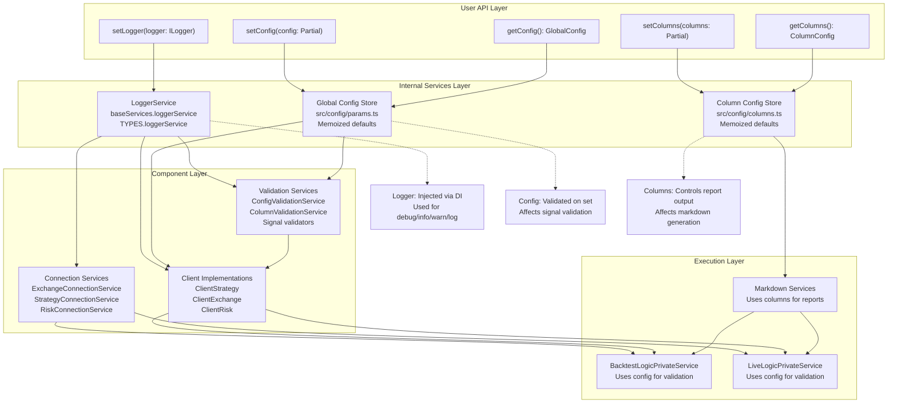
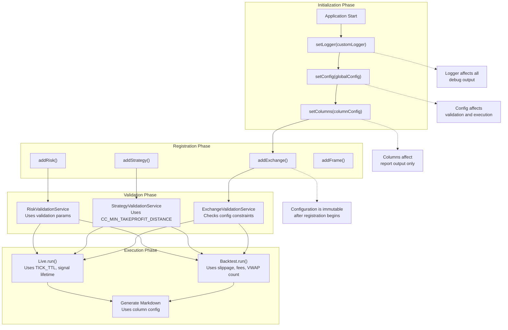
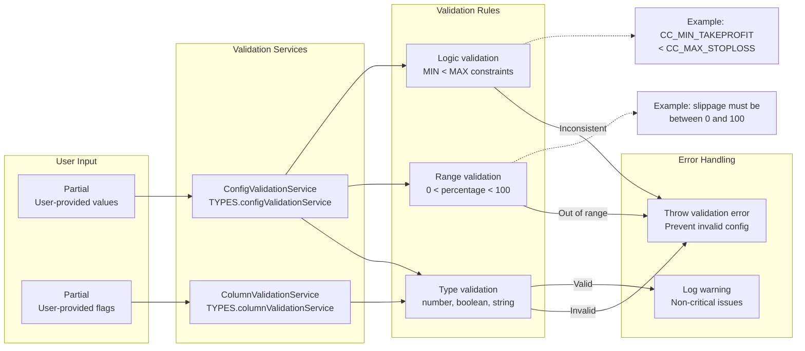

# Configuration Functions

<details>
<summary>Relevant source files</summary>

The following files were used as context for generating this wiki page:

- [src/config/emitters.ts](src/config/emitters.ts)
- [src/function/add.ts](src/function/add.ts)
- [src/function/event.ts](src/function/event.ts)
- [src/index.ts](src/index.ts)
- [src/lib/core/provide.ts](src/lib/core/provide.ts)
- [src/lib/core/types.ts](src/lib/core/types.ts)
- [src/lib/index.ts](src/lib/index.ts)
- [types.d.ts](types.d.ts)

</details>


This page documents the global configuration functions that control system-wide behavior across all execution modes (Backtest, Live, Walker). These functions must be called before registering components or executing strategies.

For component registration (strategies, exchanges, risk profiles), see [Component Registration Functions](#4.2). For global configuration parameters and defaults, see [Global Configuration](#14.1).

---

## Purpose and Scope

Configuration functions provide three categories of system-wide settings:

1. **Logger Configuration**: Custom logging implementation for debug output and monitoring
2. **Global Configuration**: System parameters (fees, slippage, VWAP calculation, validation thresholds)
3. **Column Configuration**: Report column visibility and formatting for markdown output

All configuration functions are idempotent and can be called multiple times. The last call before component registration takes precedence. Configuration changes after component registration do not affect already-registered components.

**Sources**: [src/index.ts:1-9](), [types.d.ts:52-77]()

---

## Configuration Flow Architecture



**Analysis**: Configuration functions operate at the topmost layer of the system. `setLogger()` injects a custom logger into the DI container, replacing the default `LoggerService` implementation. `setConfig()` and `setColumns()` update memoized stores that are read by validation and markdown services. All configuration is immutable after initial setup.

**Sources**: [src/lib/index.ts:1-246](), [src/lib/core/provide.ts:1-143](), [src/lib/core/types.ts:1-105]()

---

## Logger Configuration

### setLogger

```typescript
function setLogger(logger: ILogger): void
```

Replaces the default logger with a custom implementation. Must be called before any component registration or execution.

#### ILogger Interface

The logger interface defines four severity levels used throughout the system:

| Method | Purpose | Usage Context |
|--------|---------|---------------|
| `log(topic, ...args)` | General-purpose logging | Component lifecycle events, state transitions |
| `debug(topic, ...args)` | Detailed diagnostic information | Intermediate states, detailed execution flow |
| `info(topic, ...args)` | Informational updates | Successful operations, high-level status |
| `warn(topic, ...args)` | Potentially problematic situations | Unexpected conditions, non-fatal errors |

#### Parameters

- **logger**: `ILogger` - Custom logger implementation conforming to the interface

#### Interface Definition

```typescript
interface ILogger {
  log(topic: string, ...args: any[]): void;
  debug(topic: string, ...args: any[]): void;
  info(topic: string, ...args: any[]): void;
  warn(topic: string, ...args: any[]): void;
}
```

#### Example Usage

```typescript
import { setLogger } from "backtest-kit";

// Custom logger with structured output
setLogger({
  log: (topic, ...args) => console.log(`[LOG] ${topic}:`, ...args),
  debug: (topic, ...args) => console.debug(`[DEBUG] ${topic}:`, ...args),
  info: (topic, ...args) => console.info(`[INFO] ${topic}:`, ...args),
  warn: (topic, ...args) => console.warn(`[WARN] ${topic}:`, ...args),
});

// Logger with external monitoring service
import winston from "winston";

const winstonLogger = winston.createLogger({
  level: "info",
  format: winston.format.json(),
  transports: [new winston.transports.File({ filename: "backtest.log" })],
});

setLogger({
  log: (topic, ...args) => winstonLogger.log("info", topic, { args }),
  debug: (topic, ...args) => winstonLogger.debug(topic, { args }),
  info: (topic, ...args) => winstonLogger.info(topic, { args }),
  warn: (topic, ...args) => winstonLogger.warn(topic, { args }),
});
```

#### Logging Topics

The system uses structured topic strings for log filtering:

| Pattern | Example | Source |
|---------|---------|--------|
| `service.method` | `strategy.addStrategy` | Validation services |
| `event.listener` | `event.listenSignal` | Event subscription |
| `command.execution` | `backtest.run` | Execution commands |
| `connection.factory` | `connection.getStrategy` | Connection services |

**Sources**: [types.d.ts:52-77](), [src/index.ts:1-9](), [src/lib/services/base/LoggerService.ts]()

---

## Global Configuration

### setConfig

```typescript
function setConfig(config: Partial<GlobalConfig>): void
```

Updates global configuration parameters. Partial updates merge with existing defaults. Must be called before component registration to affect validation behavior.

#### Parameters

- **config**: `Partial<GlobalConfig>` - Configuration object with optional properties to override

#### GlobalConfig Structure

The `GlobalConfig` type defines system-wide parameters affecting:

1. **Pricing and Execution**
   - `slippage`: Percentage slippage applied to entry/exit prices (default: 0.1%)
   - `fees`: Trading fee percentage per trade (default: 0.1%)
   - `CC_VWAP_CANDLE_COUNT`: Number of 1-minute candles for VWAP calculation (default: 5)

2. **Validation Thresholds**
   - `CC_MIN_TAKEPROFIT_DISTANCE_PERCENT`: Minimum distance between entry and take profit (default: 0.5%)
   - `CC_MIN_STOPLOSS_DISTANCE_PERCENT`: Minimum distance between entry and stop loss (default: 0.5%)
   - `CC_MAX_STOPLOSS_DISTANCE_PERCENT`: Maximum distance between entry and stop loss (default: 50%)

3. **Signal Lifecycle**
   - `CC_SCHEDULE_AWAIT_MINUTES`: Maximum time to wait for scheduled signal activation (default: 1440 minutes / 24 hours)
   - `CC_MAX_SIGNAL_LIFETIME_MINUTES`: Maximum time a signal can remain active (default: 10080 minutes / 7 days)

4. **Execution Timing**
   - `TICK_TTL`: Sleep interval between ticks in live mode (default: 60000ms / 1 minute)

#### Example Usage

```typescript
import { setConfig } from "backtest-kit";

// Conservative configuration with higher fees
setConfig({
  slippage: 0.2,          // 0.2% slippage
  fees: 0.15,             // 0.15% trading fees
  CC_MIN_TAKEPROFIT_DISTANCE_PERCENT: 1.0,  // Require 1% minimum profit target
});

// Aggressive configuration with tighter validation
setConfig({
  CC_MAX_STOPLOSS_DISTANCE_PERCENT: 20,     // Limit stop loss to 20%
  CC_MAX_SIGNAL_LIFETIME_MINUTES: 4320,     // 3 days max signal lifetime
});

// Fast live mode for testing
setConfig({
  TICK_TTL: 5000,         // Check every 5 seconds
});
```

**Sources**: [src/index.ts:1-9](), [src/config/params.ts](), [types.d.ts:1-900]()

---

### getConfig

```typescript
function getConfig(): GlobalConfig
```

Retrieves the current global configuration, including defaults for unset properties.

#### Returns

- **GlobalConfig** - Complete configuration object with all properties set

#### Example Usage

```typescript
import { getConfig } from "backtest-kit";

const config = getConfig();

console.log(`Current slippage: ${config.slippage}%`);
console.log(`Current fees: ${config.fees}%`);
console.log(`VWAP candle count: ${config.CC_VWAP_CANDLE_COUNT}`);
console.log(`Min TP distance: ${config.CC_MIN_TAKEPROFIT_DISTANCE_PERCENT}%`);
```

**Sources**: [src/index.ts:1-9](), [src/config/params.ts]()

---

### getDefaultConfig

```typescript
function getDefaultConfig(): GlobalConfig
```

Retrieves the default configuration without user modifications. Useful for resetting configuration or comparing against defaults.

#### Returns

- **GlobalConfig** - Default configuration object

#### Example Usage

```typescript
import { getDefaultConfig, setConfig } from "backtest-kit";

// Reset to defaults
const defaults = getDefaultConfig();
setConfig(defaults);

// Compare current vs defaults
const current = getConfig();
const diff = Object.keys(current).filter(
  (key) => current[key] !== defaults[key]
);
console.log("Modified config keys:", diff);
```

**Sources**: [src/index.ts:1-9](), [src/config/params.ts]()

---

## Column Configuration

### setColumns

```typescript
function setColumns(columns: Partial<ColumnConfig>): void
```

Configures which columns appear in generated markdown reports. Affects `BacktestMarkdownService`, `LiveMarkdownService`, `WalkerMarkdownService`, and related report generation.

#### Parameters

- **columns**: `Partial<ColumnConfig>` - Column visibility configuration

#### ColumnConfig Structure

The `ColumnConfig` type defines boolean flags for report columns:

| Column Group | Properties | Description |
|--------------|------------|-------------|
| Signal Details | `signalId`, `position`, `note` | Signal identification and direction |
| Prices | `priceOpen`, `priceClose`, `priceTakeProfit`, `priceStopLoss` | Entry, exit, and target prices |
| Timestamps | `scheduledAt`, `pendingAt`, `closeTimestamp` | Signal lifecycle timestamps |
| Performance | `pnl`, `pnlPercentage`, `closeReason` | Profit/loss and exit reason |
| Progress | `percentTp`, `percentSl` | Progress towards TP/SL during active state |
| Strategy Context | `strategyName`, `exchangeName`, `symbol` | Execution context |

#### Example Usage

```typescript
import { setColumns } from "backtest-kit";

// Minimal report with only PNL
setColumns({
  signalId: true,
  position: true,
  pnlPercentage: true,
  closeReason: true,
  // All other columns false by default
});

// Detailed report with all columns
setColumns({
  signalId: true,
  position: true,
  note: true,
  priceOpen: true,
  priceClose: true,
  priceTakeProfit: true,
  priceStopLoss: true,
  scheduledAt: true,
  pendingAt: true,
  closeTimestamp: true,
  pnl: true,
  pnlPercentage: true,
  closeReason: true,
  percentTp: true,
  percentSl: true,
  strategyName: true,
  exchangeName: true,
  symbol: true,
});

// Performance-focused report
setColumns({
  signalId: true,
  pnlPercentage: true,
  closeReason: true,
  percentTp: true,
  percentSl: true,
});
```

**Sources**: [src/index.ts:1-9](), [src/config/columns.ts](), [src/model/Column.model.ts]()

---

### getColumns

```typescript
function getColumns(): ColumnConfig
```

Retrieves the current column configuration.

#### Returns

- **ColumnConfig** - Current column visibility settings

#### Example Usage

```typescript
import { getColumns } from "backtest-kit";

const columns = getColumns();

// Check which columns are enabled
if (columns.pnlPercentage) {
  console.log("PNL percentage column is visible");
}

// Count enabled columns
const enabledCount = Object.values(columns).filter(Boolean).length;
console.log(`${enabledCount} columns enabled`);
```

**Sources**: [src/index.ts:1-9](), [src/config/columns.ts]()

---

### getDefaultColumns

```typescript
function getDefaultColumns(): ColumnConfig
```

Retrieves the default column configuration without user modifications.

#### Returns

- **ColumnConfig** - Default column visibility settings

#### Example Usage

```typescript
import { getDefaultColumns, setColumns } from "backtest-kit";

// Reset to defaults
const defaults = getDefaultColumns();
setColumns(defaults);

// Identify modified columns
const current = getColumns();
const modified = Object.keys(current).filter(
  (key) => current[key] !== defaults[key]
);
console.log("Modified columns:", modified);
```

**Sources**: [src/index.ts:1-9](), [src/config/columns.ts]()

---

## Configuration Lifecycle



**Analysis**: Configuration functions must be called in order during initialization phase, before any component registration. Once components are registered, configuration changes do not affect them. This ensures consistent behavior across execution modes and prevents unexpected runtime changes.

**Lifecycle Rules**:

1. **Order Independence**: `setLogger()`, `setConfig()`, and `setColumns()` can be called in any order
2. **Idempotency**: Multiple calls are allowed; last call wins
3. **Immutability**: Configuration is frozen at first component registration
4. **Defaults**: Unset properties use memoized defaults from `getDefaultConfig()` and `getDefaultColumns()`

**Sources**: [src/function/add.ts:1-445](), [src/lib/services/validation/ConfigValidationService.ts](), [src/lib/services/validation/ColumnValidationService.ts]()

---

## Configuration Validation



**Analysis**: Both `setConfig()` and `setColumns()` invoke validation services before accepting changes. `ConfigValidationService` enforces type safety, range constraints, and logical consistency. `ColumnValidationService` validates boolean flags and column name spelling. Invalid configurations throw errors immediately, preventing silent failures during execution.

**Validation Examples**:

```typescript
// INVALID: Slippage out of range
setConfig({ slippage: 150 }); // Throws: "slippage must be between 0 and 100"

// INVALID: Logical inconsistency
setConfig({
  CC_MIN_TAKEPROFIT_DISTANCE_PERCENT: 10,
  CC_MAX_STOPLOSS_DISTANCE_PERCENT: 5,  // MAX < MIN
}); // Throws: "CC_MAX_STOPLOSS_DISTANCE_PERCENT must be >= CC_MIN_TAKEPROFIT_DISTANCE_PERCENT"

// VALID: Partial update merges with defaults
setConfig({
  slippage: 0.5,  // Only override slippage
});

// VALID: Column configuration
setColumns({
  pnlPercentage: true,
  unknownColumn: true,  // Ignored, logged as warning
});
```

**Sources**: [src/lib/services/validation/ConfigValidationService.ts](), [src/lib/services/validation/ColumnValidationService.ts](), [src/lib/core/types.ts:81-83]()

---

## Configuration Impact on System Behavior

### VWAP Pricing

The `CC_VWAP_CANDLE_COUNT` parameter controls how many 1-minute candles are used for Volume Weighted Average Price calculation. This affects entry and exit prices for all signals.

```typescript
setConfig({ CC_VWAP_CANDLE_COUNT: 10 }); // Use last 10 candles instead of default 5
```

**Impact**:
- **Lower values** (e.g., 3): More responsive to recent price movements, higher variance
- **Higher values** (e.g., 10): More stable pricing, less affected by short-term volatility
- **Used by**: `ClientExchange.getAveragePrice()` ([src/client/ClientExchange.ts]())

---

### Validation Thresholds

Minimum and maximum distance parameters prevent unrealistic signal targets:

```typescript
setConfig({
  CC_MIN_TAKEPROFIT_DISTANCE_PERCENT: 2.0,   // Require 2% minimum profit
  CC_MIN_STOPLOSS_DISTANCE_PERCENT: 1.0,     // Require 1% minimum stop loss
  CC_MAX_STOPLOSS_DISTANCE_PERCENT: 25.0,    // Limit stop loss to 25%
});
```

**Impact**:
- **Validation**: `StrategyValidationService` rejects signals violating these constraints
- **Signal rejection**: Invalid signals transition to `cancelled` state without opening positions
- **Used by**: `ClientStrategy.tick()` during signal validation ([src/client/ClientStrategy.ts]())

---

### Signal Lifetime

Lifetime parameters control how long signals remain active:

```typescript
setConfig({
  CC_SCHEDULE_AWAIT_MINUTES: 720,          // Wait 12 hours for scheduled signals
  CC_MAX_SIGNAL_LIFETIME_MINUTES: 2880,    // Force close after 2 days
});
```

**Impact**:
- **Scheduled signals**: Cancelled if price doesn't reach `priceOpen` within `CC_SCHEDULE_AWAIT_MINUTES`
- **Active signals**: Force closed with `time_expired` reason after `CC_MAX_SIGNAL_LIFETIME_MINUTES`
- **Used by**: `ClientStrategy.tick()` and `ClientStrategy.backtest()` ([src/client/ClientStrategy.ts]())

---

### Live Mode Tick Interval

The `TICK_TTL` parameter controls sleep duration between strategy ticks in live mode:

```typescript
setConfig({
  TICK_TTL: 30000,  // Check every 30 seconds
});
```

**Impact**:
- **Responsiveness**: Lower values check more frequently, higher CPU usage
- **Efficiency**: Higher values reduce API calls, lower monitoring overhead
- **Used by**: `LiveLogicPrivateService` infinite loop ([src/lib/services/logic/private/LiveLogicPrivateService.ts]())

---

### Fees and Slippage

Fees and slippage affect PnL calculations for all closed signals:

```typescript
setConfig({
  fees: 0.075,      // 0.075% maker/taker fees (Binance VIP level)
  slippage: 0.15,   // 0.15% slippage (market volatility)
});
```

**Impact**:
- **Entry price**: Adjusted by `(1 + slippage/100) * (1 + fees/100)` for long, opposite for short
- **Exit price**: Adjusted by `(1 - slippage/100) * (1 - fees/100)` for long, opposite for short
- **Used by**: `ClientStrategy._calculatePnL()` ([src/client/ClientStrategy.ts]())

**Sources**: [src/config/params.ts](), [src/client/ClientStrategy.ts](), [src/client/ClientExchange.ts](), [src/lib/services/logic/private/LiveLogicPrivateService.ts]()

---

## Summary Table

| Function | Category | Affects | When to Call |
|----------|----------|---------|--------------|
| `setLogger()` | Logging | All services | Before any operations |
| `setConfig()` | Global Config | Validation, execution, pricing | Before component registration |
| `getConfig()` | Global Config | N/A (read-only) | Anytime |
| `getDefaultConfig()` | Global Config | N/A (read-only) | Anytime |
| `setColumns()` | Report Config | Markdown generation | Before execution |
| `getColumns()` | Report Config | N/A (read-only) | Anytime |
| `getDefaultColumns()` | Report Config | N/A (read-only) | Anytime |

**Sources**: [src/index.ts:1-9](), [src/function/setup.ts](), [types.d.ts:1-900]()