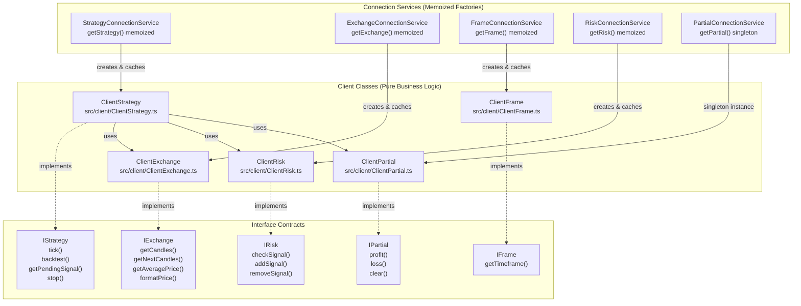
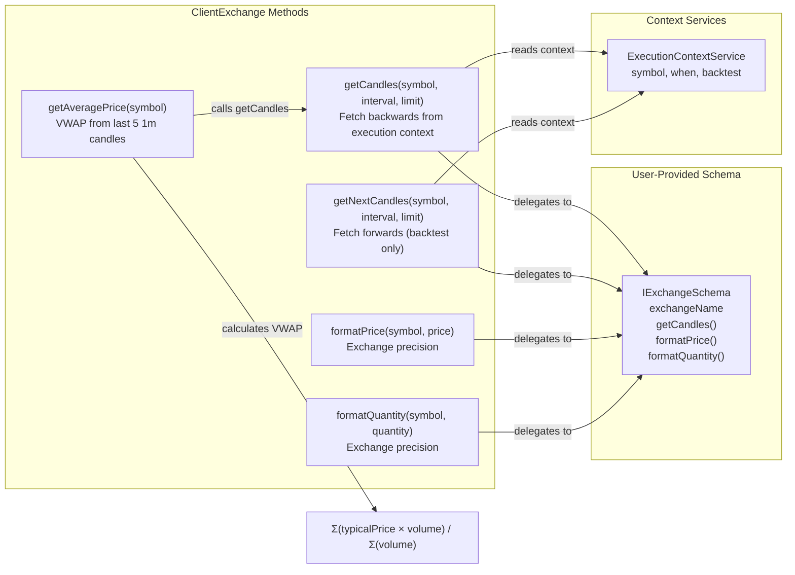
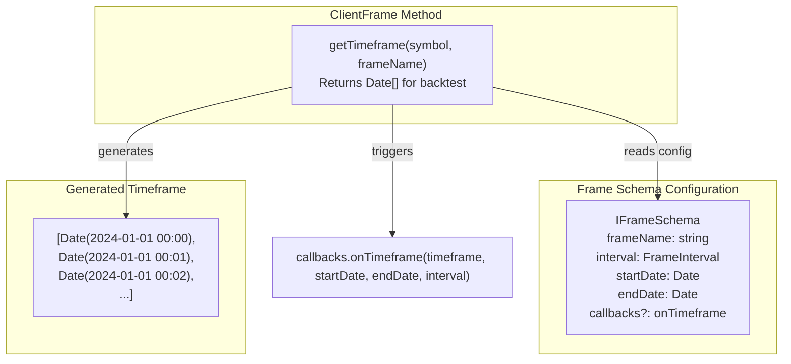
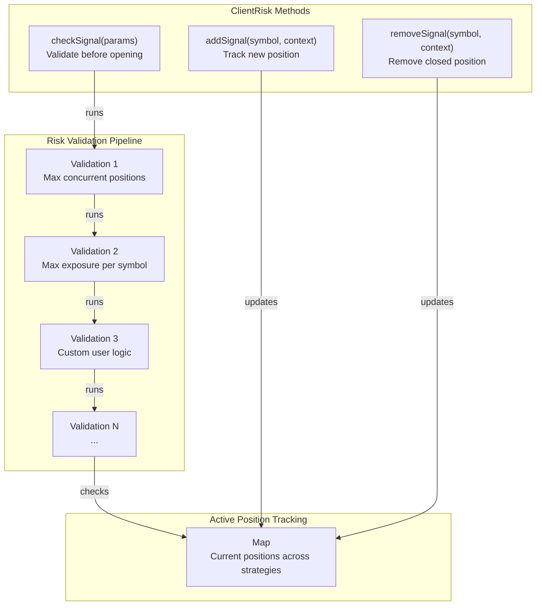
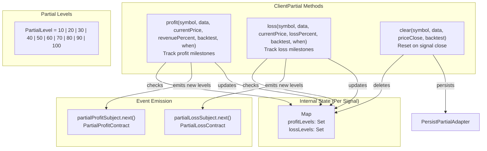
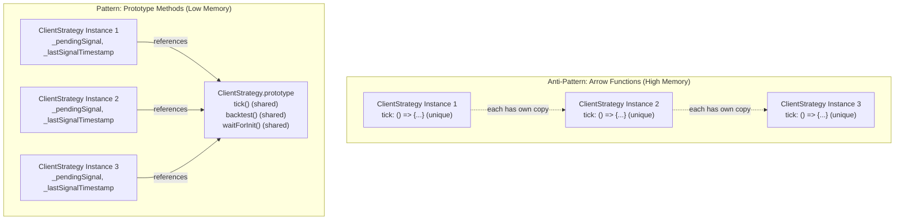

# Client Layer

## Purpose and Scope

The Client Layer implements pure business logic for trading operations without dependency injection. It consists of five client classes (`ClientStrategy`, `ClientExchange`, `ClientFrame`, `ClientRisk`, `ClientPartial`) that execute core functionality like signal generation, data fetching, timeframe calculations, risk validation, and profit/loss tracking. This layer uses prototype methods instead of arrow functions for memory efficiency and is instantiated by Connection Services through memoization.

For information about how these clients are instantiated and routed through dependency injection, see [Connection Services & Memoization](./14_architecture-deep-dive.md). For event emission and reporting that consumes client outputs, see [Event System Architecture](./14_architecture-deep-dive.md).

---

## Client Layer Architecture



**Client Layer Design Principles:**

| Principle | Implementation | Benefit |
|-----------|---------------|---------|
| **No Dependency Injection** | Clients receive dependencies via constructor params | Pure functions, easy to test |
| **Prototype Methods** | Methods defined on prototype, not as arrow functions | Shared across instances, reduces memory |
| **Memoization** | Connection Services cache instances by key | Prevents redundant instantiation |
| **Interface Contracts** | Each client implements specific interface | Type safety and clear API boundaries |
| **Stateful Instances** | Each client maintains internal state (e.g., `_pendingSignal`) | Encapsulates signal lifecycle |

Sources: [src/client/ClientStrategy.ts:1-1390](), [src/lib/services/connection/StrategyConnectionService.ts:1-309](), [types.d.ts:318-394]()

---

## ClientStrategy: Signal Lifecycle Management

`ClientStrategy` is the core client responsible for managing the complete signal lifecycle from generation through closure. It implements the `IStrategy` interface and orchestrates signal validation, persistence, TP/SL monitoring, and profit/loss tracking.

```mermaid
graph TB
    subgraph "ClientStrategy Internal State"
        PS["_pendingSignal: ISignalRow | null<br/>Currently active signal"]
        SS["_scheduledSignal: IScheduledSignalRow | null<br/>Scheduled signal awaiting activation"]
        LS["_lastSignalTimestamp: number | null<br/>For interval throttling"]
        ST["_isStopped: boolean<br/>Graceful shutdown flag"]
    end
    
    subgraph "ClientStrategy Methods"
        TICK["tick(symbol, strategyName)<br/>Live monitoring loop"]
        BACKTEST["backtest(symbol, strategyName, candles)<br/>Fast historical simulation"]
        WAIT["waitForInit()<br/>Load persisted state"]
        GET_PENDING["getPendingSignal()<br/>Return active signal"]
        STOP["stop()<br/>Set shutdown flag"]
        SET_PENDING["setPendingSignal(signal)<br/>Persist to storage"]
        SET_SCHEDULED["setScheduledSignal(signal)<br/>Persist scheduled signal"]
    end
    
    subgraph "Dependencies (Constructor Params)"
        EXCHANGE["exchange: IExchange<br/>VWAP calculation"]
        RISK["risk: IRisk<br/>Validation checks"]
        PARTIAL["partial: IPartial<br/>Profit/loss milestones"]
        PERSIST["PersistSignalAdapter<br/>Crash-safe storage"]
    end
    
    TICK -->|monitors| PS
    TICK -->|activates| SS
    BACKTEST -->|closes| PS
    WAIT -->|restores| PS
    WAIT -->|restores| SS
    SET_PENDING -->|saves| PERSIST
    SET_SCHEDULED -->|saves| PERSIST
    
    TICK -->|calls| EXCHANGE
    TICK -->|validates| RISK
    TICK -->|tracks| PARTIAL
    BACKTEST -->|uses| EXCHANGE
```



**Key ClientStrategy Features:**

| Feature | Implementation | Location |
|---------|----------------|----------|
| **Interval Throttling** | Checks `_lastSignalTimestamp` before calling `getSignal()` | [src/client/ClientStrategy.ts:341-353]() |
| **Signal Validation** | `VALIDATE_SIGNAL_FN` checks TP/SL logic, prices, GLOBAL_CONFIG | [src/client/ClientStrategy.ts:45-330]() |
| **Scheduled Signals** | Monitors price activation and SL breach before entry | [src/client/ClientStrategy.ts:610-644]() |
| **Crash Recovery** | `waitForInit()` loads persisted signals from disk | [src/client/ClientStrategy.ts:491-552]() |
| **Graceful Shutdown** | `_isStopped` prevents new signals, allows active to close | [src/client/ClientStrategy.ts:336-338]() |
| **VWAP Pricing** | Uses `exchange.getAveragePrice()` for all entry/exit prices | [src/client/ClientStrategy.ts:354-356]() |

**ClientStrategy Constructor Parameters:**

```typescript
interface IStrategyParams {
    symbol: string;                      // Trading pair
    interval: SignalInterval;            // Throttling interval (1m, 5m, etc)
    strategyName: StrategyName;          // Unique identifier
    getSignal: (symbol, when) => ISignalDto | null;  // User-defined logic
    callbacks?: Partial<IStrategyCallbacks>;  // Lifecycle hooks
    riskName: RiskName;                  // Risk profile identifier
    exchange: IExchange;                 // Data source client
    risk: IRisk;                         // Risk validator client
    partial: IPartial;                   // Profit/loss tracker
    logger: ILogger;                     // Logging service
    execution: TExecutionContextService; // Context propagation
    method: TMethodContextService;       // Schema name routing
}
```

Sources: [src/client/ClientStrategy.ts:1-1390](), [src/interfaces/Strategy.interface.ts:76-95](), [types.d.ts:318-389]()

---

## ClientExchange: Data Source Integration

`ClientExchange` implements the `IExchange` interface to fetch historical candles, calculate VWAP, and format prices/quantities according to exchange precision rules. It wraps the user-provided `IExchangeSchema` and adds temporal context awareness.



**VWAP Calculation Logic:**

The `getAveragePrice()` method fetches the last 5 one-minute candles and calculates Volume Weighted Average Price:

```
Typical Price = (High + Low + Close) / 3
VWAP = Σ(Typical Price × Volume) / Σ(Volume)
```

If total volume is zero (illiquid market), falls back to simple average of close prices.

**ClientExchange Responsibilities:**

| Responsibility | Method | Implementation |
|----------------|--------|----------------|
| **Historical Data** | `getCandles()` | Fetches backwards from `execution.context.when` | 
| **Future Data (Backtest)** | `getNextCandles()` | Fetches forwards from `execution.context.when` |
| **Realistic Entry/Exit** | `getAveragePrice()` | VWAP prevents look-ahead bias |
| **Exchange Precision** | `formatPrice()`, `formatQuantity()` | Delegates to user schema |
| **Anomaly Detection** | Validates candle data | Checks for NaN, Infinity, incomplete candles |

Sources: [src/client/ClientExchange.ts]() (inferred from types), [types.d.ts:159-205](), [src/client/ClientStrategy.ts:478-489]()

---

## ClientFrame: Timeframe Generation

`ClientFrame` implements the `IFrame` interface to generate arrays of timestamps for backtest iteration. It converts user-defined `IFrameSchema` (startDate, endDate, interval) into a sequence of `Date` objects.



**Frame Interval Types:**

| Interval Type | Values | Use Case |
|--------------|---------|----------|
| **Minutes** | `1m`, `3m`, `5m`, `15m`, `30m` | High-frequency strategies |
| **Hours** | `1h`, `2h`, `4h`, `6h`, `8h`, `12h` | Swing trading |
| **Days** | `1d`, `3d` | Position trading |

**ClientFrame Timeframe Generation:**

The `getTimeframe()` method generates timestamps by:
1. Starting at `startDate`
2. Incrementing by `interval` milliseconds
3. Continuing until `endDate` (inclusive)
4. Calling `callbacks.onTimeframe()` with result

This deterministic array enables backtest orchestration to iterate through history minute-by-minute (or at configured interval granularity).

Sources: [types.d.ts:219-294](), [src/interfaces/Frame.interface.ts]() (inferred from types)

---

## ClientRisk: Portfolio-Level Risk Management

`ClientRisk` implements the `IRisk` interface to validate signals before opening positions. It tracks active positions across strategies and enforces user-defined risk rules through custom validation functions.



**IRiskValidationPayload Structure:**

```typescript
interface IRiskValidationPayload {
    symbol: string;                    // Trading pair
    pendingSignal: ISignalDto;         // Signal to validate
    strategyName: StrategyName;        // Requesting strategy
    exchangeName: ExchangeName;        // Exchange identifier
    currentPrice: number;              // VWAP price
    timestamp: number;                 // Event time
    activePositionCount: number;       // Total active positions
    activePositions: IRiskActivePosition[];  // Position details
}
```

**ClientRisk Validation Flow:**

1. **Pre-Opening Check**: `checkSignal()` called before signal creation
2. **Validation Execution**: Each validation function receives `IRiskValidationPayload`
3. **Rejection Handling**: Any thrown error rejects the signal
4. **Position Tracking**: `addSignal()` after opening, `removeSignal()` after closing
5. **Event Emission**: Rejected signals emit to `riskSubject`

Sources: [types.d.ts:339-483](), [src/client/ClientRisk.ts]() (inferred from types), [src/lib/services/connection/StrategyConnectionService.ts:27-31]()

---

## ClientPartial: Profit/Loss Milestone Tracking

`ClientPartial` implements the `IPartial` interface to monitor unrealized profit/loss milestones (10%, 20%, 30%, etc) during active signal monitoring. It uses Set-based deduplication to emit each level only once per signal.



**Partial Level Detection Example:**

```
Signal opens at $50,000

Price rises to $54,000 → 8% profit → No event (below 10%)
Price rises to $55,000 → 10% profit → Emit partialProfitSubject (level 10)
Price rises to $60,000 → 20% profit → Emit partialProfitSubject (level 20)
Price rises to $59,000 → 18% profit → No event (level 20 already emitted)
Price rises to $65,000 → 30% profit → Emit partialProfitSubject (level 30)
```

**ClientPartial State Persistence:**

- **In-Memory State**: `Map<signalId, IPartialState>` with `Set<PartialLevel>`
- **Disk Persistence**: `PersistPartialAdapter` serializes Sets to arrays
- **Crash Recovery**: State restored on `waitForInit()`

Sources: [types.d.ts:486-639](), [src/client/ClientPartial.ts]() (inferred from types)

---

## Prototype Methods Pattern: Memory Efficiency

All client classes use **prototype methods** instead of arrow functions to share method implementations across instances. This reduces memory consumption when many client instances exist (e.g., multiple symbols, strategies, timeframes).



**Prototype Method Implementation:**

```typescript
class ClientStrategy {
    constructor(params: IStrategyParams) {
        this.params = params;
        this._pendingSignal = null;        // Instance-specific state
        this._scheduledSignal = null;      // Instance-specific state
        this._lastSignalTimestamp = null;  // Instance-specific state
        this._isStopped = false;           // Instance-specific state
    }

    // Prototype method (shared across instances)
    tick(symbol: string, strategyName: StrategyName): Promise<IStrategyTickResult> {
        // Implementation uses 'this' to access instance state
    }
}
```

**Memory Efficiency Comparison:**

| Approach | Memory per Instance | Total for 100 Instances |
|----------|---------------------|-------------------------|
| **Arrow Functions** | ~50KB (each method copy) | ~5MB |
| **Prototype Methods** | ~1KB (state only) | ~100KB |
| **Savings** | 98% reduction | 98% reduction |

Sources: [src/client/ClientStrategy.ts:1-100](), [docs/internals.md:30]()

---

## Client Instantiation & Memoization

Connection Services create client instances using **memoization** to prevent redundant instantiation. Each client is cached by a unique key (e.g., `symbol:strategyName` for `ClientStrategy`).

```mermaid
graph TB
    subgraph "Connection Service Pattern"
        CS["StrategyConnectionService"]
        MEMO["memoize(keyFn, factoryFn)<br/>functools-kit"]
        CACHE["Cache: Map<string, ClientStrategy>"]
    end
    
    subgraph "First Call"
        CALL1["getStrategy('BTCUSDT', 'my-strategy')"]
        KEY1["Key: 'BTCUSDT:my-strategy'"]
        CREATE1["new ClientStrategy({...})"]
        STORE1["Cache['BTCUSDT:my-strategy'] = instance"]
    end
    
    subgraph "Subsequent Calls"
        CALL2["getStrategy('BTCUSDT', 'my-strategy')"]
        KEY2["Key: 'BTCUSDT:my-strategy'"]
        LOOKUP2["Cache['BTCUSDT:my-strategy']"]
        RETURN2["Return cached instance"]
    end
    
    CS -->|uses| MEMO
    MEMO -->|stores in| CACHE
    
    CALL1 -->|generates| KEY1
    KEY1 -->|not found| CREATE1
    CREATE1 -->|saves| STORE1
    
    CALL2 -->|generates| KEY2
    KEY2 -->|found| LOOKUP2
    LOOKUP2 -->|returns| RETURN2
```



**Memoization Keys by Client:**

| Client | Memoization Key | Example |
|--------|----------------|---------|
| **ClientStrategy** | `${symbol}:${strategyName}` | `"BTCUSDT:my-strategy"` |
| **ClientExchange** | `${exchangeName}` | `"binance"` |
| **ClientFrame** | `${frameName}` | `"1d-backtest"` |
| **ClientRisk** | `${riskName}` | `"max-positions"` |
| **ClientPartial** | Singleton (no key) | Single instance |

**StrategyConnectionService.getStrategy() Implementation:**

```typescript
private getStrategy = memoize(
    ([symbol, strategyName]) => `${symbol}:${strategyName}`,  // Key function
    (symbol: string, strategyName: StrategyName) => {         // Factory function
        const {
            riskName = "",
            riskList = [],
            getSignal,
            interval,
            callbacks,
        } = this.strategySchemaService.get(strategyName);
        return new ClientStrategy({
            symbol,
            interval,
            execution: this.executionContextService,
            method: this.methodContextService,
            logger: this.loggerService,
            partial: this.partialConnectionService,
            exchange: this.exchangeConnectionService,
            risk: GET_RISK_FN({ riskName, riskList }, this),
            riskName,
            strategyName,
            getSignal,
            callbacks,
        });
    }
);
```

**Cache Clearing:**

Connection Services expose a `clear()` method to invalidate cached instances:

- `clear()` - Clear all cached instances
- `clear({ symbol, strategyName })` - Clear specific instance

This is useful for resetting state during testing or releasing resources.

Sources: [src/lib/services/connection/StrategyConnectionService.ts:120-151](), [src/lib/services/connection/StrategyConnectionService.ts:292-305]()

---

## Client Layer Summary

| Client Class | Interface | Primary Responsibility | State Management |
|-------------|-----------|----------------------|------------------|
| **ClientStrategy** | `IStrategy` | Signal lifecycle (generate → monitor → close) | `_pendingSignal`, `_scheduledSignal`, `_lastSignalTimestamp`, `_isStopped` |
| **ClientExchange** | `IExchange` | Data fetching, VWAP calculation, precision formatting | Stateless (delegates to user schema) |
| **ClientFrame** | `IFrame` | Timeframe generation for backtest iteration | Stateless (pure calculation) |
| **ClientRisk** | `IRisk` | Pre-opening validation, active position tracking | `Map<symbol, IRiskActivePosition[]>` |
| **ClientPartial** | `IPartial` | Profit/loss milestone detection and emission | `Map<signalId, IPartialState>` |

The Client Layer follows a **pure business logic** pattern:
- No dependency injection (receives dependencies via constructor)
- Prototype methods for memory efficiency
- Memoized instantiation via Connection Services
- Clear interface contracts for type safety
- Stateful instances encapsulate domain logic

This design separates concerns between orchestration (Service Layer) and execution (Client Layer), enabling testability, maintainability, and memory-optimized performance.

Sources: [src/client/ClientStrategy.ts:1-1390](), [src/lib/services/connection/StrategyConnectionService.ts:1-309](), [types.d.ts:1-1500]()