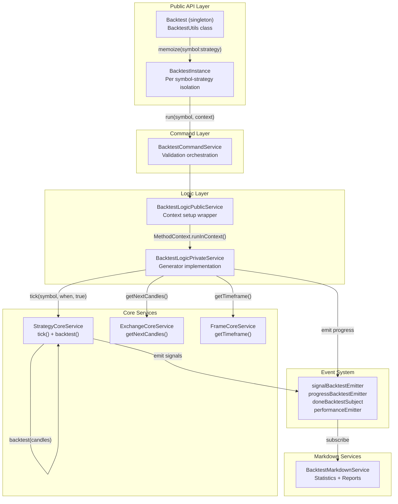
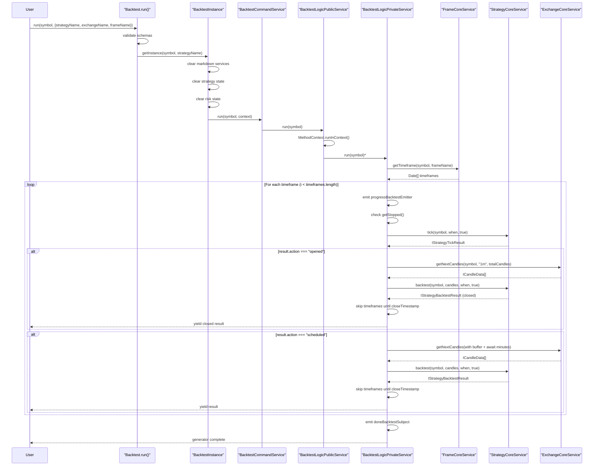
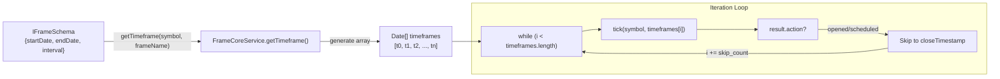
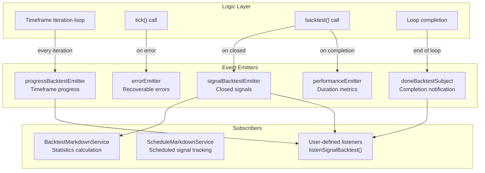
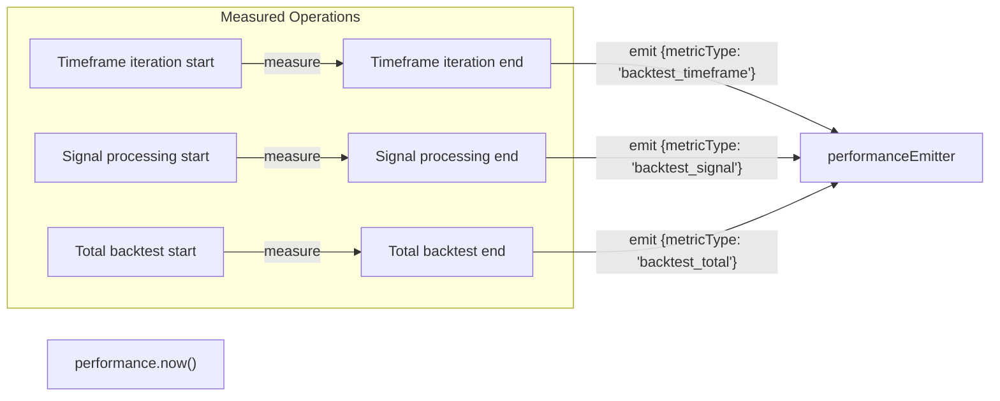

# Backtest Mode

## Purpose and Scope

This document describes the **Backtest Mode** execution system in backtest-kit, which simulates historical trading by iterating through pre-generated timeframes and processing trading signals against historical market data. Backtest Mode enables strategy validation and performance analysis without real-time market interaction.

For real-time trading execution with crash recovery, see [Live Trading Mode](./18-live-trading-mode.md). For comparing multiple strategies, see [Walker Mode](./19-walker-mode.md). For strategy lifecycle and signal generation, see [Strategy Execution Flow](./13-strategy-execution-flow.md).

---

## Overview

Backtest Mode processes historical market data by generating a fixed array of timeframes (e.g., every 1 minute for 30 days) and iterating through them sequentially. When a signal opens, the system fetches historical candle data and applies fast candle processing to determine the close reason (take profit, stop loss, or time expiration). A key optimization is skipping timeframes after signal closure until the `closeTimestamp`, significantly reducing computation time.

The system uses async generators for memory efficiency, yielding closed signals without accumulating results in memory. This enables early termination via loop breaks and streaming processing of large historical datasets.

**Key Characteristics:**

| Feature | Description |
|---------|-------------|
| **Data Source** | Historical market data via ExchangeCoreService |
| **Iteration** | Sequential timeframe array from FrameCoreService |
| **Signal Processing** | Fast candle processing with TP/SL/time monitoring |
| **Optimization** | Skip-to-close timestamp after signal completion |
| **Memory Model** | Async generator yielding closed signals only |
| **Completion** | Finite - ends when all timeframes processed |
| **State Persistence** | None - stateless execution |

---

## Architecture Components



**Component Responsibilities:**

| Component | File | Responsibility |
|-----------|------|----------------|
| `BacktestUtils` | [src/classes/Backtest.ts:355-593]() | Singleton API with validation and instance management |
| `BacktestInstance` | [src/classes/Backtest.ts:73-334]() | Isolated execution context per symbol-strategy pair |
| `BacktestCommandService` | Service layer | Validates schemas and delegates to logic layer |
| `BacktestLogicPublicService` | Logic layer | Sets up MethodContext and ExecutionContext |
| `BacktestLogicPrivateService` | [src/lib/services/logic/private/BacktestLogicPrivateService.ts:33-480]() | Core async generator orchestrating timeframe iteration |
| `StrategyCoreService` | Core services | Executes `tick()` and `backtest()` methods on strategies |
| `ExchangeCoreService` | Core services | Fetches historical candle data with buffering |
| `FrameCoreService` | Core services | Generates timeframe array for iteration |

---

## Execution Flow



**Execution Phases:**

| Phase | Description | Key Operations |
|-------|-------------|----------------|
| **1. Initialization** | Setup and validation | Validate schemas, clear state, create instance |
| **2. Timeframe Generation** | Create iteration array | `FrameCoreService.getTimeframe()` returns `Date[]` |
| **3. Sequential Iteration** | Loop through timeframes | `while (i < timeframes.length)` at [BacktestLogicPrivateService.ts:78]() |
| **4. Tick Processing** | Check signal status | `StrategyCoreService.tick(symbol, when, true)` |
| **5. Signal Opening** | Handle new signal | Fetch candles, call `backtest()`, yield closed result |
| **6. Timeframe Skipping** | Optimization | Skip to `closeTimestamp` via [BacktestLogicPrivateService.ts:403-409]() |
| **7. Progress Emission** | Monitoring | Emit events at [BacktestLogicPrivateService.ts:84-92]() |
| **8. Completion** | Finalize | Emit `doneBacktestSubject` at [BacktestLogicPrivateService.ts:452-461]() |

---

## Timeframe Iteration and Skip Optimization

The backtest generator iterates through a pre-generated array of `Date` objects representing discrete time points. The `FrameCoreService` generates this array based on the frame configuration (e.g., every 1 minute from startDate to endDate).

**Timeframe Generation:**



**Skip-to-Close Optimization:**

When a signal closes at timestamp `closeTimestamp`, the iterator skips all intermediate timeframes until reaching or passing that timestamp. This is implemented at [BacktestLogicPrivateService.ts:403-409]():

```typescript
// Skip timeframes until closeTimestamp
while (
  i < timeframes.length &&
  timeframes[i].getTime() < backtestResult.closeTimestamp
) {
  i++;
}
```

**Performance Impact:**

For a signal with `minuteEstimatedTime = 60` (1 hour), instead of calling `tick()` 60 times (once per minute), the system:
1. Calls `tick()` once (signal opens)
2. Fetches 60 candles in one request
3. Processes all candles via `backtest()` method
4. Skips 60 timeframe iterations
5. Resumes iteration after the signal closes

This reduces computational overhead by ~60x for typical signals.

---

## Signal Processing: tick() and backtest()

Backtest Mode uses two distinct methods for signal processing:

### tick() Method

Called once per timeframe to determine signal state. Returns a discriminated union `IStrategyTickResult` with possible actions: `idle`, `opened`, `active`, `scheduled`, `closed`, `cancelled`.

**Invocation:**
[BacktestLogicPrivateService.ts:115]() calls:
```typescript
result = await this.strategyCoreService.tick(symbol, when, true);
```

The third parameter `true` indicates backtest mode, affecting:
- VWAP calculation uses historical data
- No persistence to disk
- ExecutionContext has `backtest: true`

### backtest() Method

Called once per signal (after `opened` or `scheduled`) to process all candles until signal closes. This method:
1. Iterates through candle array sequentially
2. Calculates VWAP for each candle
3. Checks TP/SL/time conditions
4. Returns `IStrategyBacktestResult` (always `action: "closed"` or `action: "cancelled"`)

**Invocation for Opened Signals:**
[BacktestLogicPrivateService.ts:361-366]():
```typescript
backtestResult = await this.strategyCoreService.backtest(
  symbol,
  candles,
  when,
  true
);
```

**Invocation for Scheduled Signals:**
[BacktestLogicPrivateService.ts:223-228]():
```typescript
backtestResult = await this.strategyCoreService.backtest(
  symbol,
  candles,
  when,
  true
);
```

The `backtest()` method handles both regular and scheduled signals, automatically detecting activation conditions for scheduled signals before proceeding to TP/SL monitoring.

---

## Fast Candle Processing and Buffering

When a signal opens, the system must fetch sufficient historical candles to:
1. Provide VWAP calculation buffer (preceding candles)
2. Process the entire signal duration (until TP/SL/time)

### Buffer Calculation for Opened Signals

[BacktestLogicPrivateService.ts:315-328]():

```typescript
const bufferMinutes = GLOBAL_CONFIG.CC_AVG_PRICE_CANDLES_COUNT - 1;
const bufferStartTime = new Date(when.getTime() - bufferMinutes * 60 * 1000);
const totalCandles = signal.minuteEstimatedTime + bufferMinutes;

candles = await this.exchangeCoreService.getNextCandles(
  symbol,
  "1m",
  totalCandles,
  bufferStartTime,
  true
);
```

**Example:** 
- `when = 2024-01-15 10:00:00`
- `CC_AVG_PRICE_CANDLES_COUNT = 5` (need 5 candles for VWAP)
- `minuteEstimatedTime = 60` (signal duration)

The system fetches:
- Buffer: 4 candles before `when` (09:56, 09:57, 09:58, 09:59)
- Signal: 60 candles from `when` onward (10:00 through 10:59)
- Total: 64 candles in one request

### Buffer Calculation for Scheduled Signals

[BacktestLogicPrivateService.ts:174-176]():

```typescript
const bufferMinutes = GLOBAL_CONFIG.CC_AVG_PRICE_CANDLES_COUNT - 1;
const bufferStartTime = new Date(when.getTime() - bufferMinutes * 60 * 1000);
const candlesNeeded = bufferMinutes + GLOBAL_CONFIG.CC_SCHEDULE_AWAIT_MINUTES + signal.minuteEstimatedTime + 1;
```

Scheduled signals require additional candles for the await period (`CC_SCHEDULE_AWAIT_MINUTES`) before potential activation.

### VWAP Calculation

The buffer ensures that when processing the first candle at timestamp `when`, there are already 4 preceding candles in memory to calculate VWAP using the last 5 candles (including the current one). This maintains consistency with live mode, where VWAP always uses the most recent `CC_AVG_PRICE_CANDLES_COUNT` candles.

---

## Generator Pattern and Memory Efficiency

Backtest Mode uses async generators to stream results without accumulating them in memory. This enables:

1. **Early Termination:** Consumers can break out of the loop at any point
2. **Memory Bounds:** Only current signal data held in memory, not entire backtest history
3. **Progressive Processing:** Results available as soon as each signal closes

### Generator Implementation

[BacktestLogicPrivateService.ts:62-477]() defines:
```typescript
public async *run(symbol: string) {
  // ... initialization
  
  while (i < timeframes.length) {
    // ... process timeframe
    
    if (result.action === "opened") {
      // ... fetch candles, call backtest()
      yield backtestResult; // Yield point
    }
    
    i++;
  }
}
```

### Consumer Patterns

**Pattern 1: Process All Results**
```typescript
for await (const result of Backtest.run(symbol, context)) {
  console.log(result.closeReason, result.pnl.pnlPercentage);
}
```

**Pattern 2: Early Termination**
```typescript
for await (const result of Backtest.run(symbol, context)) {
  if (result.pnl.pnlPercentage < -10) {
    break; // Stop backtest if cumulative loss exceeds 10%
  }
}
```

**Pattern 3: Background Execution**
[Backtest.ts:199-234]() implements `background()` which consumes the generator internally:
```typescript
public background = (symbol: string, context: {...}) => {
  this.task(symbol, context).catch((error) =>
    exitEmitter.next(new Error(getErrorMessage(error)))
  );
  return () => { /* cancellation logic */ };
};
```

### Memory Comparison

| Approach | Memory Usage | Implementation |
|----------|--------------|----------------|
| **Array Accumulation** | O(n) where n = total signals | `results = []` then `results.push(signal)` |
| **Generator (Current)** | O(1) constant per signal | `yield signal` without storage |

For a 30-day backtest with 100 signals, the generator approach uses ~99% less memory for result storage.

---

## Event System Integration

Backtest Mode emits events throughout execution for monitoring and reporting:



### Event Types and Timing

| Event | Emitted By | Timing | Payload |
|-------|-----------|--------|---------|
| `progressBacktestEmitter` | [BacktestLogicPrivateService.ts:84-92]() | Every timeframe | `{processedFrames, totalFrames, progress, symbol, strategyName, exchangeName}` |
| `signalBacktestEmitter` | `StrategyCoreService` (indirectly) | Signal closes | `IStrategyTickResultClosed` |
| `performanceEmitter` | [BacktestLogicPrivateService.ts:391-401]() | Signal/timeframe/total | `{duration, metricType, timestamp, strategyName, exchangeName, symbol, backtest: true}` |
| `doneBacktestSubject` | [BacktestLogicPrivateService.ts:452-461]() or [Backtest.ts:44-50]() | Completion | `{symbol, strategyName, exchangeName, backtest: true}` |
| `errorEmitter` | [BacktestLogicPrivateService.ts:126]() | Recoverable errors | `Error` object |

### Listening to Events

Users can subscribe via public API functions:

```typescript
listenSignalBacktest((result) => {
  console.log(`Signal closed: ${result.signal.id}`);
});

listenBacktestProgress((progress) => {
  console.log(`Progress: ${progress.processedFrames}/${progress.totalFrames}`);
});

listenDoneBacktest((done) => {
  console.log(`Backtest complete for ${done.strategyName}`);
});
```

---

## Public API Methods

### run()

Returns an async generator that yields closed signals. Intended for direct consumption by user code.

**Signature:**
```typescript
public run = (
  symbol: string,
  context: {
    strategyName: string;
    exchangeName: string;
    frameName: string;
  }
) => AsyncGenerator<IStrategyBacktestResult>
```

**Usage:**
```typescript
for await (const result of Backtest.run("BTCUSDT", {
  strategyName: "my-strategy",
  exchangeName: "binance",
  frameName: "1d-backtest"
})) {
  console.log(result.closeReason, result.pnl.pnlPercentage);
}
```

### background()

Consumes the generator internally without exposing results. Returns a cancellation function. Useful for running backtests for side effects (callbacks, event listeners, report generation).

**Signature:**
```typescript
public background = (
  symbol: string,
  context: {
    strategyName: string;
    exchangeName: string;
    frameName: string;
  }
) => () => void
```

**Usage:**
```typescript
const cancel = Backtest.background("BTCUSDT", {
  strategyName: "my-strategy",
  exchangeName: "binance",
  frameName: "1d-backtest"
});

// Later, to stop:
cancel();
```

### stop()

Sets internal flag to prevent strategy from generating new signals. Current active signal completes normally. Backtest stops at next safe point (idle state or after signal closes).

**Signature:**
```typescript
public stop = async (
  symbol: string,
  strategyName: StrategyName
) => Promise<void>
```

### getData()

Retrieves statistical data calculated from all closed signals.

**Signature:**
```typescript
public getData = async (
  symbol: string,
  strategyName: StrategyName
) => Promise<BacktestStatistics>
```

**Returns:** `BacktestStatistics` object with metrics like `sharpeRatio`, `winRate`, `totalPnl`, etc.

### getReport()

Generates markdown-formatted report with signal table and statistics.

**Signature:**
```typescript
public getReport = async (
  symbol: string,
  strategyName: StrategyName
) => Promise<string>
```

### dump()

Saves markdown report to disk at specified path (default: `./dump/backtest/`).

**Signature:**
```typescript
public dump = async (
  symbol: string,
  strategyName: StrategyName,
  path?: string
) => Promise<void>
```

### list()

Lists all active backtest instances with their current status (`idle`, `running`, or `done`).

**Signature:**
```typescript
public list = async () => Promise<Array<{
  id: string;
  symbol: string;
  strategyName: StrategyName;
  status: 'idle' | 'running' | 'done';
}>>
```

---

## Instance Management and Isolation

The `Backtest` singleton uses memoization to create isolated `BacktestInstance` objects per symbol-strategy pair. This ensures that multiple concurrent backtests don't interfere with each other.

### Memoization Pattern

[Backtest.ts:360-365]():
```typescript
private _getInstance = memoize<
  (symbol: string, strategyName: StrategyName) => BacktestInstance
>(
  ([symbol, strategyName]) => `${symbol}:${strategyName}`,
  (symbol: string, strategyName: StrategyName) => new BacktestInstance(symbol, strategyName)
);
```

**Key:** `"${symbol}:${strategyName}"` (e.g., `"BTCUSDT:my-strategy"`)

**Result:** Each unique symbol-strategy combination gets exactly one `BacktestInstance`, cached for the lifetime of the process.

### State Isolation

Each `BacktestInstance` maintains isolated state:

[Backtest.ts:161-174]():
```typescript
// Clear markdown services
backtest.backtestMarkdownService.clear({ symbol, strategyName: context.strategyName });
backtest.scheduleMarkdownService.clear({ symbol, strategyName: context.strategyName });

// Clear strategy state
backtest.strategyCoreService.clear({ symbol, strategyName: context.strategyName });

// Clear risk state
const { riskName, riskList } = backtest.strategySchemaService.get(context.strategyName);
riskName && backtest.riskGlobalService.clear(riskName);
riskList && riskList.forEach((riskName) => backtest.riskGlobalService.clear(riskName));
```

This clearing happens at the start of each `run()` call, ensuring clean state for repeated backtests.

### Concurrent Execution

The memoization pattern enables:
```typescript
// These run independently without interference
const gen1 = Backtest.run("BTCUSDT", { strategyName: "strategy-1", ... });
const gen2 = Backtest.run("ETHUSDT", { strategyName: "strategy-1", ... });
const gen3 = Backtest.run("BTCUSDT", { strategyName: "strategy-2", ... });
```

Each generator maintains its own iteration state (`i` variable in `BacktestLogicPrivateService`).

---

## Performance Optimizations

Backtest Mode implements several optimizations for fast execution:

| Optimization | Implementation | Impact |
|--------------|----------------|--------|
| **Skip-to-Close** | [BacktestLogicPrivateService.ts:403-409]() | Reduces iterations by ~60x per signal |
| **Single Candle Fetch** | [BacktestLogicPrivateService.ts:323-329]() | Fetches entire signal duration in one request |
| **Fast Candle Processing** | `backtest()` method replaces repeated `tick()` calls | O(n) instead of O(n²) for monitoring |
| **Async Generator** | Streaming results without accumulation | O(1) memory per signal vs O(n) total |
| **Memoized Clients** | Connection services cache instances | Avoids repeated object creation |
| **VWAP Buffer** | Pre-fetch buffer candles | Eliminates additional requests during signal |
| **Early Termination** | User can break generator loop | Stops computation immediately |
| **Progress Tracking** | [BacktestLogicPrivateService.ts:84-92]() | Enables progress bars without overhead |

### Performance Metrics

The system tracks duration metrics via `performanceEmitter`:



Metrics emitted at:
- [BacktestLogicPrivateService.ts:436-446]() - Timeframe duration
- [BacktestLogicPrivateService.ts:391-401]() - Signal duration
- [BacktestLogicPrivateService.ts:466-476]() - Total backtest duration

---

## Validation and Error Handling

Before execution, Backtest Mode validates all schema references:

### Validation Sequence

[Backtest.ts:382-392]():
```typescript
// Validate strategy exists
backtest.strategyValidationService.validate(context.strategyName, BACKTEST_METHOD_NAME_RUN);

// Validate exchange exists
backtest.exchangeValidationService.validate(context.exchangeName, BACKTEST_METHOD_NAME_RUN);

// Validate frame exists
backtest.frameValidationService.validate(context.frameName, BACKTEST_METHOD_NAME_RUN);

// Validate risk profiles if specified
const { riskName, riskList } = backtest.strategySchemaService.get(context.strategyName);
riskName && backtest.riskValidationService.validate(riskName, BACKTEST_METHOD_NAME_RUN);
riskList && riskList.forEach((riskName) => backtest.riskValidationService.validate(riskName, BACKTEST_METHOD_NAME_RUN));
```

### Error Handling During Execution

Errors during timeframe iteration are caught and handled gracefully:

[BacktestLogicPrivateService.ts:114-129]():
```typescript
try {
  result = await this.strategyCoreService.tick(symbol, when, true);
} catch (error) {
  console.warn(`backtestLogicPrivateService tick failed, skipping timeframe...`);
  this.loggerService.warn("backtestLogicPrivateService tick failed, skipping timeframe", {
    symbol,
    when: when.toISOString(),
    error: errorData(error),
    message: getErrorMessage(error),
  });
  await errorEmitter.next(error);
  i++; // Skip this timeframe and continue
  continue;
}
```

**Error Recovery Strategy:**
1. Log warning with context
2. Emit error event for user notification
3. Skip problematic timeframe
4. Continue with next timeframe
5. Backtest completes with available data

Similarly, errors during candle fetching or `backtest()` calls are caught and handled at [BacktestLogicPrivateService.ts:179-202]() and [BacktestLogicPrivateService.ts:367-380]().

---

## Comparison with Live Mode

| Aspect | Backtest Mode | Live Mode |
|--------|---------------|-----------|
| **Data Source** | Historical (pre-generated timeframes) | Real-time (`new Date()` per tick) |
| **Iteration** | Finite loop: `while (i < timeframes.length)` | Infinite loop: `while (true)` |
| **State Persistence** | None (stateless) | Crash-safe persistence via `PersistSignalAdapter` |
| **Signal Processing** | Fast: `backtest()` processes entire signal | Slow: `tick()` called every 61 seconds |
| **Yielded Results** | Closed signals only | Opened and closed signals |
| **Skip Optimization** | Yes (skip to `closeTimestamp`) | No (must check every tick) |
| **Recovery** | Not needed (stateless) | `waitForInit()` loads persisted state |
| **Completion** | Finite (ends when data exhausted) | Infinite (runs until stopped) |
| **Use Case** | Strategy validation, historical analysis | Real-time trading, live monitoring |

**Shared Components:** Both modes use identical validation, schema services, and core strategy/exchange/frame services. The only difference is in the orchestration logic ([BacktestLogicPrivateService.ts]() vs [LiveLogicPrivateService.ts]()).

