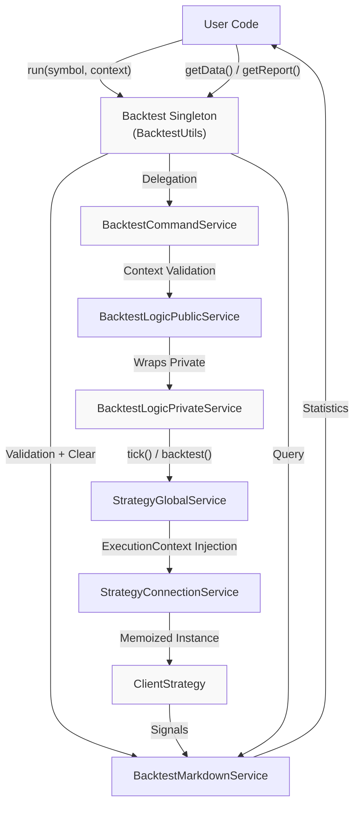
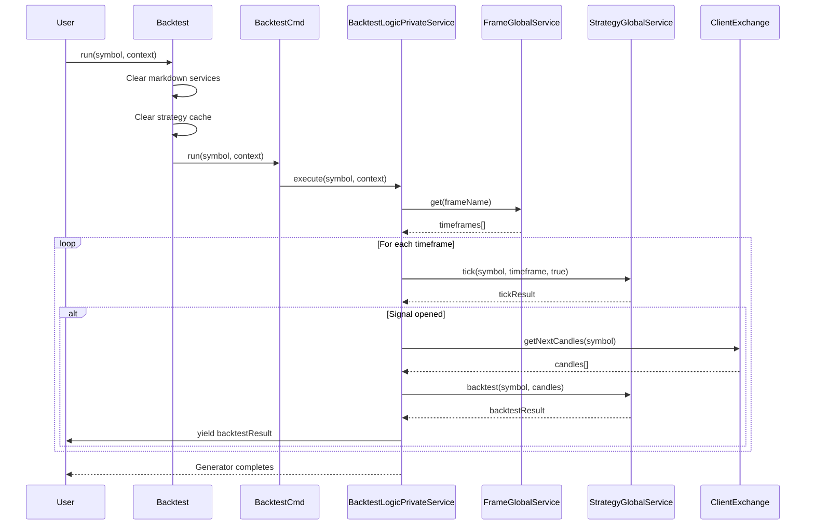
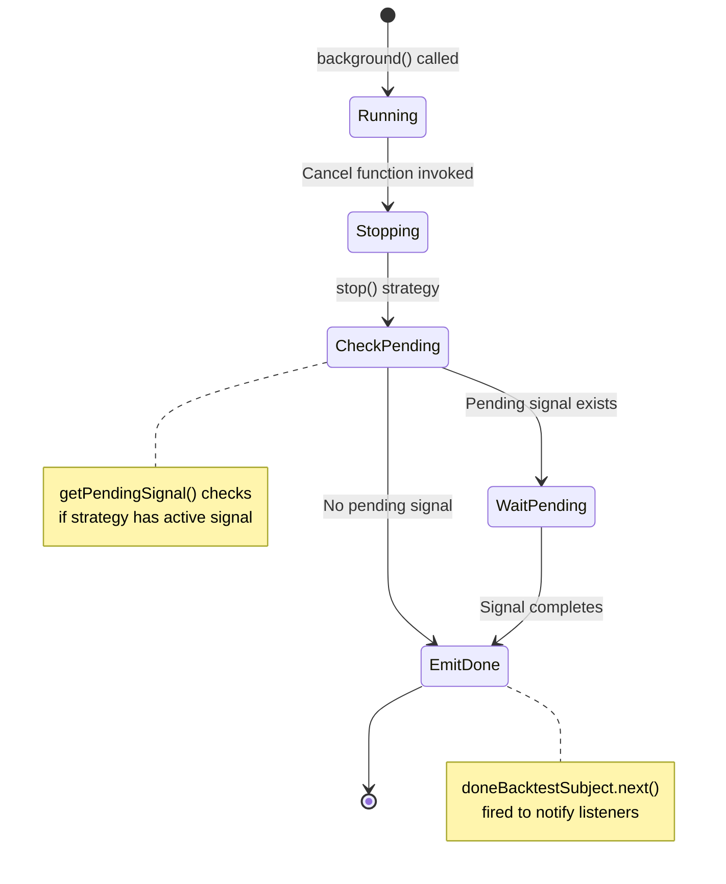
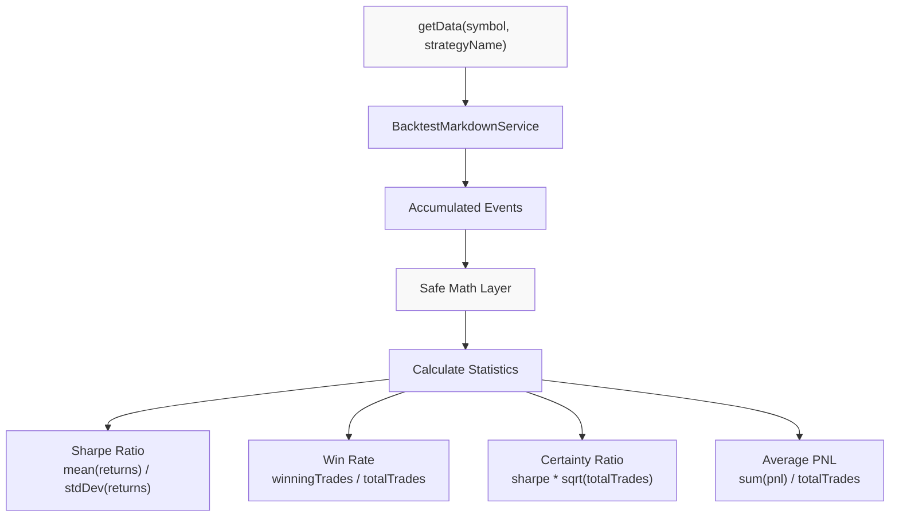
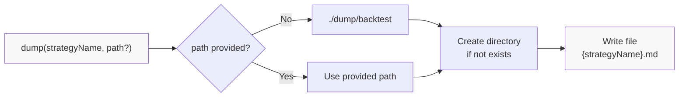
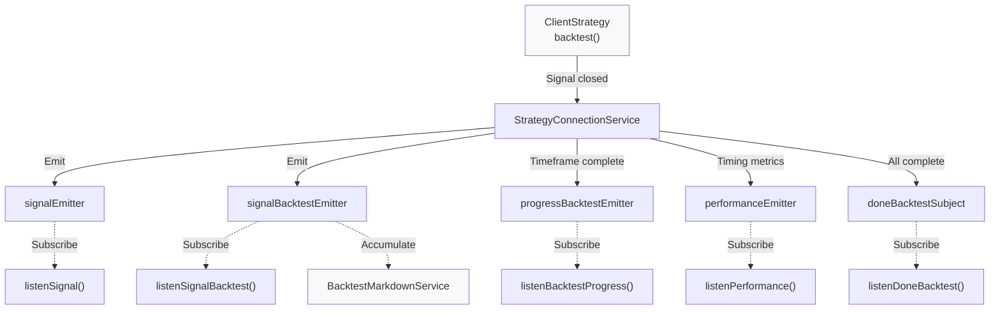

# Backtest API

This document describes the public API for historical backtesting operations provided by the `Backtest` singleton. The Backtest API enables testing trading strategies against historical market data with statistical analysis and markdown report generation.

For live trading operations, see [Live Trading API](#4.4). For strategy comparison across multiple configurations, see [Walker API](#4.5). For component registration, see [Component Registration Functions](#4.2).

## Overview

The Backtest API is implemented as a singleton instance of `BacktestUtils` exported from [src/classes/Backtest.ts:231](). It provides a simplified interface to the underlying backtest execution engine, with five primary methods:

| Method | Purpose | Execution Mode |
|--------|---------|----------------|
| `run()` | Execute backtest and yield results | Foreground AsyncGenerator |
| `background()` | Execute backtest silently | Background with cancellation |
| `getData()` | Retrieve statistics for completed backtest | Post-execution analysis |
| `getReport()` | Generate markdown report | Post-execution analysis |
| `dump()` | Save report to filesystem | Post-execution persistence |

The Backtest API operates on historical data defined by Frame schemas (see [Frame Schemas](#5.3)) and evaluates Strategy schemas (see [Strategy Schemas](#5.1)) sequentially through each timeframe.

Sources: [src/classes/Backtest.ts:1-232](), [docs/classes/BacktestUtils.md:1-63]()

## Architecture and Data Flow

The Backtest API serves as the entry point to a multi-layer execution pipeline:



**Key Flow Characteristics:**

1. **Validation Layer**: [src/classes/Backtest.ts:46-63]() validates components before execution
2. **State Clearing**: Markdown services and strategy instances are cleared to ensure clean runs
3. **Context Propagation**: `symbol`, `strategyName`, `exchangeName`, `frameName` propagate through all layers
4. **AsyncGenerator Streaming**: Results yield progressively as signals close
5. **Event Accumulation**: `BacktestMarkdownService` accumulates signals via `signalBacktestEmitter`

Sources: [src/classes/Backtest.ts:30-142](), [docs/classes/BacktestCommandService.md:1-70](), [src/lib/services/global/StrategyGlobalService.ts:1-204]()

## Method Reference

### Backtest.run()

Executes historical backtest and yields closed signals as an AsyncGenerator.

**Signature:**
```typescript
run(
  symbol: string,
  context: {
    strategyName: string;
    exchangeName: string;
    frameName: string;
  }
): AsyncGenerator<IStrategyBacktestResult, void, unknown>
```

**Parameters:**

| Parameter | Type | Description |
|-----------|------|-------------|
| `symbol` | `string` | Trading pair symbol (e.g., `"BTCUSDT"`) |
| `context.strategyName` | `string` | Registered strategy name from `addStrategy()` |
| `context.exchangeName` | `string` | Registered exchange name from `addExchange()` |
| `context.frameName` | `string` | Registered frame name from `addFrame()` |

**Return Type:** `AsyncGenerator<IStrategyBacktestResult>`

The generator yields `IStrategyBacktestResult` objects for each closed signal. The result is a discriminated union with `action: "closed"` and includes:

```typescript
interface IStrategyBacktestResult {
  action: "closed";
  signal: ISignalRow;
  pnl: IStrategyPnL;
  backtest: true;
}
```

**Execution Flow:**



**Example Usage:**

```typescript
import { Backtest } from "backtest-kit";

for await (const result of Backtest.run("BTCUSDT", {
  strategyName: "rsi-strategy",
  exchangeName: "binance",
  frameName: "2024-backtest"
})) {
  console.log(`Signal ID: ${result.signal.id}`);
  console.log(`PNL: ${result.pnl.pnlPercentage}%`);
  console.log(`Close Reason: ${result.signal.closeReason}`);
}
```

**Implementation Details:**

- [src/classes/Backtest.ts:38-66]() implements the method
- Clears `backtestMarkdownService` and `scheduleMarkdownService` for the strategy [src/classes/Backtest.ts:52-54]()
- Clears strategy instance cache via `strategyGlobalService.clear()` [src/classes/Backtest.ts:57-58]()
- Clears risk instance cache if strategy has `riskName` [src/classes/Backtest.ts:60-63]()
- Delegates to `backtestCommandService.run()` [src/classes/Backtest.ts:65]()

Sources: [src/classes/Backtest.ts:38-66](), [docs/classes/BacktestUtils.md:20-25]()

### Backtest.background()

Executes backtest silently in the background, consuming all results internally. Returns a cancellation function.

**Signature:**
```typescript
background(
  symbol: string,
  context: {
    strategyName: string;
    exchangeName: string;
    frameName: string;
  }
): () => void
```

**Parameters:** Same as `run()` method.

**Return Type:** `() => void` - Cancellation closure

The returned function can be called to stop the backtest early. When cancelled, the backtest will:
1. Set `isStopped` flag to break the iteration loop
2. Wait for any pending signal to complete
3. Emit `doneBacktestSubject` event
4. Call `strategyGlobalService.stop()` to prevent new signals

**Cancellation Flow:**



**Example Usage:**

```typescript
import { Backtest, listenDoneBacktest } from "backtest-kit";

// Start backtest in background
const cancel = Backtest.background("BTCUSDT", {
  strategyName: "rsi-strategy",
  exchangeName: "binance",
  frameName: "2024-backtest"
});

// Listen for completion
listenDoneBacktest((event) => {
  console.log(`Backtest completed for ${event.strategyName}`);
});

// Cancel after 30 seconds
setTimeout(() => {
  console.log("Cancelling backtest...");
  cancel();
}, 30000);
```

**Implementation Details:**

- [src/classes/Backtest.ts:89-142]() implements the method
- Creates async task that consumes `run()` generator [src/classes/Backtest.ts:103-118]()
- Catches errors and emits to `exitEmitter` [src/classes/Backtest.ts:119-121]()
- Cancellation function stops strategy and emits done event [src/classes/Backtest.ts:122-141]()
- Uses `isStopped` flag to break iteration [src/classes/Backtest.ts:101,105-107]()
- Checks for pending signals before emitting done [src/classes/Backtest.ts:124-138]()

Sources: [src/classes/Backtest.ts:89-142](), [docs/classes/BacktestUtils.md:29-38]()

### Backtest.getData()

Retrieves statistical analysis data from completed backtest signals for a symbol-strategy pair.

**Signature:**
```typescript
getData(
  symbol: string,
  strategyName: StrategyName
): Promise<BacktestStatistics>
```

**Parameters:**

| Parameter | Type | Description |
|-----------|------|-------------|
| `symbol` | `string` | Trading pair symbol |
| `strategyName` | `StrategyName` | Strategy name (branded string type) |

**Return Type:** `Promise<BacktestStatistics>`

The `BacktestStatistics` interface contains comprehensive performance metrics:

```typescript
interface BacktestStatistics {
  // Core Metrics
  sharpeRatio: number | null;
  avgPnl: number | null;
  totalPnl: number | null;
  winRate: number | null;
  
  // Risk-Adjusted Metrics
  certaintyRatio: number | null;
  annualizedSharpeRatio: number | null;
  expectedYearlyReturns: number | null;
  
  // Trade Counts
  totalTrades: number;
  winningTrades: number;
  losingTrades: number;
  
  // Signal List
  events: IStrategyBacktestResult[];
  
  // Safety Flags
  isUnsafe: boolean; // true if any metric is NaN/Infinity
}
```

**Calculation Flow:**



**Example Usage:**

```typescript
import { Backtest } from "backtest-kit";

// Run backtest first
for await (const result of Backtest.run("BTCUSDT", {
  strategyName: "rsi-strategy",
  exchangeName: "binance",
  frameName: "2024-backtest"
})) {
  // Consume results...
}

// Get statistics
const stats = await Backtest.getData("BTCUSDT", "rsi-strategy");

console.log(`Sharpe Ratio: ${stats.sharpeRatio}`);
console.log(`Win Rate: ${stats.winRate}%`);
console.log(`Total PNL: ${stats.totalPnl}`);
console.log(`Total Trades: ${stats.totalTrades}`);
console.log(`Certainty Ratio: ${stats.certaintyRatio}`);
```

**Implementation Details:**

- [src/classes/Backtest.ts:157-163]() implements the method
- Delegates to `backtestMarkdownService.getData()` [src/classes/Backtest.ts:162]()
- Statistics calculated from accumulated `signalBacktestEmitter` events
- Safe math checks prevent NaN/Infinity propagation
- Returns `null` for metrics when insufficient data

Sources: [src/classes/Backtest.ts:144-163](), [docs/classes/BacktestUtils.md:40-46]()

### Backtest.getReport()

Generates human-readable markdown report from completed backtest signals.

**Signature:**
```typescript
getReport(
  symbol: string,
  strategyName: StrategyName
): Promise<string>
```

**Parameters:** Same as `getData()` method.

**Return Type:** `Promise<string>` - Markdown formatted report

**Report Structure:**

The generated markdown report includes the following sections:

1. **Header**: Strategy name, symbol, and timestamp
2. **Summary Statistics**: Sharpe ratio, win rate, PNL metrics
3. **Signal Table**: All closed signals with columns:
   - Signal ID
   - Open timestamp
   - Close timestamp
   - Side (LONG/SHORT)
   - Entry price
   - Exit price
   - PNL percentage
   - Close reason (TP/SL/timeout)
4. **Risk Metrics**: If risk management was used
5. **Partial Profit/Loss Events**: If milestone tracking was enabled

**Example Output Structure:**

```markdown
# Backtest Report: rsi-strategy (BTCUSDT)

Generated: 2024-01-15 10:30:00

## Summary Statistics

| Metric | Value |
|--------|-------|
| Total Trades | 42 |
| Win Rate | 65.5% |
| Sharpe Ratio | 1.85 |
| Total PNL | 12.3% |
| Average PNL | 0.29% |
| Certainty Ratio | 11.98 |

## Closed Signals

| ID | Open Time | Close Time | Side | Entry | Exit | PNL | Reason |
|----|-----------|------------|------|-------|------|-----|--------|
| sig_001 | 2024-01-01 00:00 | 2024-01-01 06:00 | LONG | 42000 | 42800 | +1.9% | TP |
| sig_002 | 2024-01-02 00:00 | 2024-01-02 04:00 | SHORT | 42500 | 42200 | +0.7% | TP |
...
```

**Example Usage:**

```typescript
import { Backtest } from "backtest-kit";
import fs from "fs/promises";

// Run backtest
for await (const result of Backtest.run("BTCUSDT", {
  strategyName: "rsi-strategy",
  exchangeName: "binance",
  frameName: "2024-backtest"
})) {
  // Consume results...
}

// Generate and save report
const markdown = await Backtest.getReport("BTCUSDT", "rsi-strategy");
console.log(markdown);

// Or save to file
await fs.writeFile("./backtest-report.md", markdown);
```

**Implementation Details:**

- [src/classes/Backtest.ts:178-184]() implements the method
- Delegates to `backtestMarkdownService.getReport()` [src/classes/Backtest.ts:183]()
- Report generation is synchronous once data is accumulated
- Markdown formatting uses consistent table syntax
- Handles null values gracefully with "N/A" placeholders

Sources: [src/classes/Backtest.ts:165-184](), [docs/classes/BacktestUtils.md:48-54]()

### Backtest.dump()

Saves backtest report to filesystem with automatic path resolution.

**Signature:**
```typescript
dump(
  strategyName: StrategyName,
  path?: string
): Promise<void>
```

**Parameters:**

| Parameter | Type | Description |
|-----------|------|-------------|
| `strategyName` | `StrategyName` | Strategy name for filename generation |
| `path` | `string` (optional) | Directory path (default: `"./dump/backtest"`) |

**File Naming Convention:**

```
{path}/{strategyName}.md
```

**Default Path Resolution:**



**Example Usage:**

```typescript
import { Backtest } from "backtest-kit";

// Run backtest
for await (const result of Backtest.run("BTCUSDT", {
  strategyName: "rsi-strategy",
  exchangeName: "binance",
  frameName: "2024-backtest"
})) {
  // Consume results...
}

// Save to default path: ./dump/backtest/rsi-strategy.md
await Backtest.dump("rsi-strategy");

// Save to custom path: ./reports/2024/rsi-strategy.md
await Backtest.dump("rsi-strategy", "./reports/2024");
```

**Implementation Details:**

- [src/classes/Backtest.ts:201-210]() implements the method
- Delegates to `backtestMarkdownService.dump()` [src/classes/Backtest.ts:209]()
- Creates directory structure if it doesn't exist
- Overwrites existing file without warning
- Uses UTF-8 encoding for markdown files

Sources: [src/classes/Backtest.ts:186-210](), [docs/classes/BacktestUtils.md:56-62]()

## Integration with Event System

The Backtest API emits events throughout execution for monitoring and callbacks:



**Available Event Listeners:**

| Listener Function | Event Type | Description |
|-------------------|------------|-------------|
| `listenSignalBacktest()` | Signal closed | All closed backtest signals |
| `listenBacktestProgress()` | Progress update | Timeframe completion percentage |
| `listenDoneBacktest()` | Completion | Backtest execution finished |
| `listenPerformance()` | Performance metrics | Timing and bottleneck data |

**Example with Event Listeners:**

```typescript
import { 
  Backtest, 
  listenSignalBacktest, 
  listenBacktestProgress,
  listenDoneBacktest 
} from "backtest-kit";

// Monitor progress
listenBacktestProgress((progress) => {
  console.log(`Progress: ${progress.current}/${progress.total} timeframes`);
  console.log(`Percentage: ${progress.percentage}%`);
});

// Monitor closed signals
listenSignalBacktest((result) => {
  console.log(`Signal closed: ${result.signal.id}`);
  console.log(`PNL: ${result.pnl.pnlPercentage}%`);
});

// Monitor completion
listenDoneBacktest((event) => {
  console.log(`Backtest completed: ${event.strategyName}`);
});

// Run backtest
await Backtest.background("BTCUSDT", {
  strategyName: "rsi-strategy",
  exchangeName: "binance",
  frameName: "2024-backtest"
});
```

Sources: [src/lib/services/connection/StrategyConnectionService.ts:138-146](), [src/classes/Backtest.ts:103-118]()

## Execution Constraints

The Backtest API operates under several constraints inherited from the underlying execution engine:

### Required Pre-Registration

All components must be registered before calling `run()` or `background()`:

```typescript
import { addStrategy, addExchange, addFrame, Backtest } from "backtest-kit";

// 1. Register strategy
addStrategy({
  strategyName: "rsi-strategy",
  interval: "1h",
  getSignal: async (context) => {
    // Strategy logic...
  }
});

// 2. Register exchange
addExchange({
  exchangeName: "binance",
  getCandles: async (params) => {
    // Fetch candles...
  }
});

// 3. Register frame
addFrame({
  frameName: "2024-backtest",
  interval: "1h",
  startDate: new Date("2024-01-01"),
  endDate: new Date("2024-12-31")
});

// 4. Now run backtest
for await (const result of Backtest.run("BTCUSDT", {
  strategyName: "rsi-strategy",
  exchangeName: "binance",
  frameName: "2024-backtest"
})) {
  // Process results...
}
```

### Symbol-Strategy Isolation

Each backtest execution is isolated by symbol-strategy pair. The memoization key used internally is `${symbol}:${strategyName}` [src/lib/services/connection/StrategyConnectionService.ts:79](). This means:

- Multiple symbols can run concurrently with the same strategy
- Same symbol cannot run multiple strategies concurrently (requires separate processes)
- State is isolated per symbol-strategy pair

### Frame Interval Alignment

The frame `interval` must be compatible with the strategy `interval`:

| Strategy Interval | Compatible Frame Intervals |
|-------------------|----------------------------|
| `1m` | `1m` |
| `5m` | `1m`, `5m` |
| `15m` | `1m`, `5m`, `15m` |
| `1h` | `1m`, `5m`, `15m`, `1h` |
| `1d` | Any interval |

Misalignment will cause validation errors at runtime [src/classes/Backtest.ts:60-63]().

Sources: [src/classes/Backtest.ts:38-66](), [src/lib/services/connection/StrategyConnectionService.ts:78-98]()

## Performance Considerations

The Backtest API includes several optimizations for efficient historical simulation:

### Skip-Ahead Optimization

When a signal opens, the backtest engine skips all intermediate timeframes until the signal closes. This is implemented in `BacktestLogicPrivateService` and dramatically reduces computation time:

```
Without skip-ahead: Process every timeframe
Timeframes: T1 T2 T3 T4 T5 T6 T7 T8 T9 T10
Processing:  ✓  ✓  ✓  ✓  ✓  ✓  ✓  ✓  ✓  ✓

With skip-ahead: Skip during active signal
Timeframes: T1 T2 T3 T4 T5 T6 T7 T8 T9 T10
Processing:  ✓  ✓  ⊗  ⊗  ⊗  ⊗  ⊗  ✓  ✓  ✓
                    ^-Signal Opens    ^-Signal Closes
```

This optimization is transparent to the user and does not affect result accuracy.

### ClientStrategy Memoization

Strategy instances are memoized by `${symbol}:${strategyName}` to avoid redundant instantiation [src/lib/services/connection/StrategyConnectionService.ts:78-98](). The cache persists across multiple `run()` calls unless explicitly cleared.

To clear the cache:

```typescript
import backtest from "backtest-kit/lib";

// Clear specific strategy
await backtest.strategyGlobalService.clear({
  symbol: "BTCUSDT",
  strategyName: "rsi-strategy"
});

// Or clear all strategies
await backtest.strategyGlobalService.clear();
```

### Event Accumulation Limit

The `BacktestMarkdownService` has a configurable maximum event count (default: no limit). For very long backtests with thousands of signals, memory usage can grow. Consider using `background()` without collecting statistics for memory-constrained environments.

Sources: [src/lib/services/connection/StrategyConnectionService.ts:78-98](), [src/lib/services/global/StrategyGlobalService.ts:192-200]()

## Complete Usage Example

```typescript
import {
  addStrategy,
  addExchange,
  addFrame,
  Backtest,
  listenSignalBacktest,
  listenBacktestProgress,
  listenDoneBacktest,
} from "backtest-kit";

// 1. Register components
addStrategy({
  strategyName: "rsi-strategy",
  interval: "1h",
  getSignal: async (context) => {
    const rsi = await context.getRSI(14);
    if (rsi < 30) {
      return {
        side: "LONG",
        priceOpen: context.currentPrice,
        takeProfit: context.currentPrice * 1.02,
        stopLoss: context.currentPrice * 0.98,
      };
    }
    return null;
  },
});

addExchange({
  exchangeName: "binance",
  getCandles: async (params) => {
    // Fetch from database or API
    return candles;
  },
});

addFrame({
  frameName: "2024-q1-backtest",
  interval: "1h",
  startDate: new Date("2024-01-01"),
  endDate: new Date("2024-03-31"),
});

// 2. Setup event listeners
listenBacktestProgress((progress) => {
  console.log(`${progress.percentage}% complete`);
});

listenSignalBacktest((result) => {
  console.log(`Signal: ${result.signal.side} | PNL: ${result.pnl.pnlPercentage}%`);
});

listenDoneBacktest((event) => {
  console.log(`Backtest completed: ${event.strategyName}`);
});

// 3. Run backtest and consume results
for await (const result of Backtest.run("BTCUSDT", {
  strategyName: "rsi-strategy",
  exchangeName: "binance",
  frameName: "2024-q1-backtest",
})) {
  console.log(`Closed at ${result.signal.closeTimestamp}`);
}

// 4. Get statistics
const stats = await Backtest.getData("BTCUSDT", "rsi-strategy");
console.log(`Sharpe Ratio: ${stats.sharpeRatio}`);
console.log(`Win Rate: ${stats.winRate}%`);
console.log(`Total Trades: ${stats.totalTrades}`);

// 5. Generate report
const markdown = await Backtest.getReport("BTCUSDT", "rsi-strategy");
console.log(markdown);

// 6. Save to disk
await Backtest.dump("rsi-strategy", "./reports");
```

Sources: [src/classes/Backtest.ts:1-232](), [docs/classes/BacktestUtils.md:1-63]()