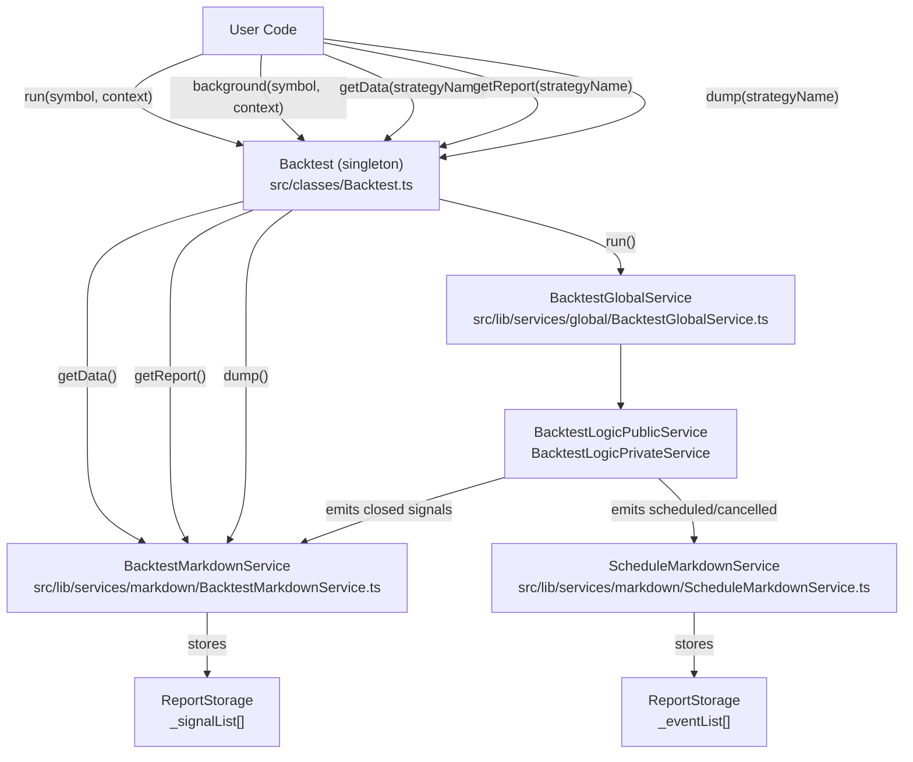
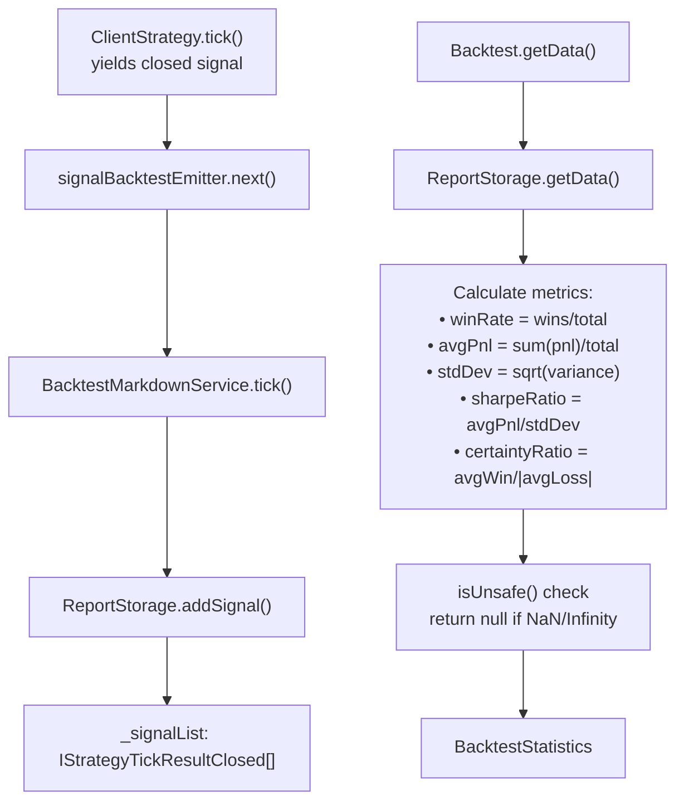
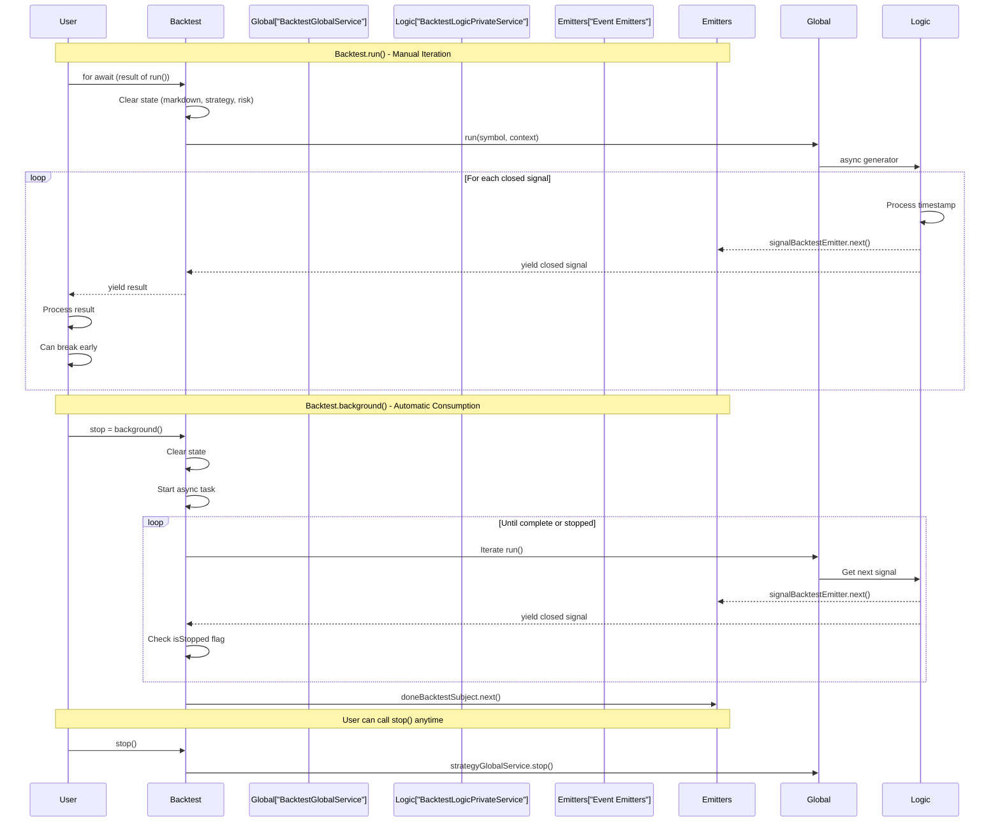
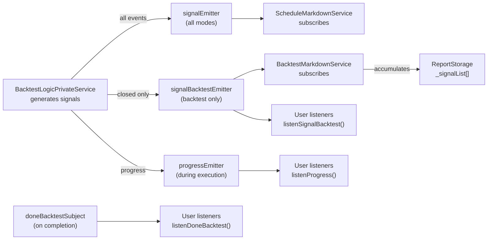

# Backtest API

<details>
<summary>Relevant source files</summary>

The following files were used as context for generating this wiki page:

- [README.md](README.md)
- [docs/classes/BacktestUtils.md](docs/classes/BacktestUtils.md)
- [docs/classes/LiveUtils.md](docs/classes/LiveUtils.md)
- [docs/index.md](docs/index.md)
- [src/classes/Backtest.ts](src/classes/Backtest.ts)
- [src/classes/Live.ts](src/classes/Live.ts)
- [src/classes/Schedule.ts](src/classes/Schedule.ts)
- [src/classes/Walker.ts](src/classes/Walker.ts)
- [src/config/emitters.ts](src/config/emitters.ts)
- [src/function/event.ts](src/function/event.ts)
- [src/lib/services/global/WalkerGlobalService.ts](src/lib/services/global/WalkerGlobalService.ts)
- [src/lib/services/markdown/BacktestMarkdownService.ts](src/lib/services/markdown/BacktestMarkdownService.ts)
- [src/lib/services/markdown/LiveMarkdownService.ts](src/lib/services/markdown/LiveMarkdownService.ts)
- [src/lib/services/markdown/ScheduleMarkdownService.ts](src/lib/services/markdown/ScheduleMarkdownService.ts)
- [test/spec/scheduled.test.mjs](test/spec/scheduled.test.mjs)

</details>


This page documents the public API for running backtests via the `Backtest` utility class. The Backtest API provides methods for executing historical strategy simulations and retrieving performance statistics.

For live trading operations, see [Live Trading API](#4.4). For multi-strategy comparison, see [Walker API](#4.5). For event subscription patterns, see [Event Listeners](#4.8).

## Overview

The `Backtest` class is a singleton utility that provides simplified access to backtest execution and report generation. It delegates to `BacktestGlobalService` for execution and `BacktestMarkdownService` for statistics and reporting.

**Backtest API Service Architecture**



**Sources**: [src/classes/Backtest.ts:1-208](), [src/lib/services/markdown/BacktestMarkdownService.ts:1-533]()

## Backtest Class Methods

The `Backtest` class exposes five public methods organized into two categories: execution methods and reporting methods.

| Method | Return Type | Purpose |
|--------|-------------|---------|
| `run(symbol, context)` | `AsyncGenerator<IStrategyBacktestResult>` | Execute backtest with manual iteration control |
| `background(symbol, context)` | `() => void` | Execute backtest in background, return cancel function |
| `getData(strategyName)` | `Promise<BacktestStatistics>` | Retrieve statistical data for completed backtest |
| `getReport(strategyName)` | `Promise<string>` | Generate markdown report with all signals |
| `dump(strategyName, path?)` | `Promise<void>` | Save markdown report to disk |

**Sources**: [src/classes/Backtest.ts:30-187](), [docs/classes/BacktestUtils.md:1-63]()

### Backtest.run()

The `run()` method executes a backtest for a symbol and returns an async generator that yields closed signals. This provides fine-grained control over iteration and allows early termination.

```typescript
public run = (
  symbol: string,
  context: {
    strategyName: string;
    exchangeName: string;
    frameName: string;
  }
) => AsyncGenerator<IStrategyBacktestResult>
```

**Execution Context**: The method requires three context parameters:
- `strategyName` - Must reference a strategy registered via `addStrategy()` (see [Component Registration](#2.3))
- `exchangeName` - Must reference an exchange registered via `addExchange()` (see [Exchange Schemas](#5.2))
- `frameName` - Must reference a frame registered via `addFrame()` (see [Frame Schemas](#5.3))

**State Clearing**: Before execution, `run()` clears accumulated state for the strategy:
1. Clears `BacktestMarkdownService` accumulated signals for the strategy [src/classes/Backtest.ts:52]()
2. Clears `ScheduleMarkdownService` accumulated scheduled signals [src/classes/Backtest.ts:53]()
3. Clears `StrategyGlobalService` internal strategy state [src/classes/Backtest.ts:57]()
4. Clears `RiskGlobalService` active positions if strategy has a `riskName` [src/classes/Backtest.ts:61-63]()

**Yielded Results**: Each iteration yields a closed signal of type `IStrategyTickResultClosed`:

```typescript
interface IStrategyTickResultClosed {
  action: "closed";
  strategyName: string;
  signal: ISignalRow;
  currentPrice: number;
  closeTimestamp: number;
  closeReason: "take_profit" | "stop_loss" | "max_lifetime";
  pnl: IStrategyPnL;
}
```

**Sources**: [src/classes/Backtest.ts:38-66](), [README.md:339-369]()

### Backtest.background()

The `background()` method executes a backtest in the background without yielding results. It consumes all results internally and emits completion events via `doneBacktestSubject`.

```typescript
public background = (
  symbol: string,
  context: {
    strategyName: string;
    exchangeName: string;
    frameName: string;
  }
) => () => void
```

**Cancellation Pattern**: The method returns a cancellation function that can be called to stop execution. The cancellation function:
1. Calls `strategyGlobalService.stop(strategyName)` [src/classes/Backtest.ts:119]()
2. Sets `isStopped` flag to break iteration loop [src/classes/Backtest.ts:101-106]()

**Completion Event**: When iteration completes (normally or via cancellation), the method emits a completion event to `doneBacktestSubject` [src/classes/Backtest.ts:108-113]():

```typescript
await doneBacktestSubject.next({
  exchangeName: context.exchangeName,
  strategyName: context.strategyName,
  backtest: true,
  symbol,
});
```

**Error Handling**: Errors during background execution are caught and emitted to `errorEmitter` [src/classes/Backtest.ts:115-117]().

**Sources**: [src/classes/Backtest.ts:89-122](), [src/config/emitters.ts:40-49]()

### Backtest.getData()

The `getData()` method retrieves statistical data for a strategy after backtest execution. It delegates to `BacktestMarkdownService.getData()`.

```typescript
public getData = async (strategyName: StrategyName) => Promise<BacktestStatistics>
```

**BacktestStatistics Interface**: Returns an object with comprehensive performance metrics:

```typescript
interface BacktestStatistics {
  signalList: IStrategyTickResultClosed[];
  totalSignals: number;
  winCount: number;
  lossCount: number;
  winRate: number | null;           // Percentage (0-100), higher is better
  avgPnl: number | null;             // Percentage, higher is better
  totalPnl: number | null;           // Cumulative percentage, higher is better
  stdDev: number | null;             // Volatility metric, lower is better
  sharpeRatio: number | null;        // Risk-adjusted return, higher is better
  annualizedSharpeRatio: number | null;  // Sharpe × √365, higher is better
  certaintyRatio: number | null;     // avgWin / |avgLoss|, higher is better
  expectedYearlyReturns: number | null;  // Projected annual return, higher is better
}
```

**Safe Math**: All numeric metrics return `null` if calculation produces `NaN` or `Infinity` [src/lib/services/markdown/BacktestMarkdownService.ts:33-44]().

**Sources**: [src/classes/Backtest.ts:136-141](), [src/lib/services/markdown/BacktestMarkdownService.ts:66-102]()

### Backtest.getReport()

The `getReport()` method generates a markdown-formatted report with all closed signals and statistics.

```typescript
public getReport = async (strategyName: StrategyName) => Promise<string>
```

**Report Structure**: The generated markdown includes:
1. Report title with strategy name [src/lib/services/markdown/BacktestMarkdownService.ts:299]()
2. Markdown table with columns defined in `columns` array [src/lib/services/markdown/BacktestMarkdownService.ts:104-177]():
   - Signal ID, Symbol, Position, Note
   - Open Price, Close Price, Take Profit, Stop Loss
   - PNL (net), Close Reason, Duration (minutes)
   - Open Time, Close Time
3. Statistical summary with all metrics [src/lib/services/markdown/BacktestMarkdownService.ts:303-312]()

**Empty State**: Returns message "No signals closed yet" if no data [src/lib/services/markdown/BacktestMarkdownService.ts:282-286]().

**Sources**: [src/classes/Backtest.ts:155-160](), [src/lib/services/markdown/BacktestMarkdownService.ts:278-314]()

### Backtest.dump()

The `dump()` method saves the markdown report to disk in the specified directory.

```typescript
public dump = async (
  strategyName: StrategyName,
  path?: string  // Default: "./logs/backtest"
) => Promise<void>
```

**File Structure**: The method:
1. Creates directory recursively if it doesn't exist [src/lib/services/markdown/BacktestMarkdownService.ts:330]()
2. Generates filename as `{strategyName}.md` [src/lib/services/markdown/BacktestMarkdownService.ts:332]()
3. Writes markdown content to file [src/lib/services/markdown/BacktestMarkdownService.ts:335]()

**Default Path**: If `path` parameter is omitted, reports are saved to `./logs/backtest/` directory [src/lib/services/markdown/BacktestMarkdownService.ts:324]().

**Sources**: [src/classes/Backtest.ts:177-186](), [src/lib/services/markdown/BacktestMarkdownService.ts:322-340]()

## Statistics Calculation Details

The `BacktestMarkdownService` calculates statistics using the `ReportStorage` class which accumulates closed signals.

**Statistics Calculation Flow**



**Sources**: [src/lib/services/markdown/BacktestMarkdownService.ts:183-270]()

### Metric Calculations

The following formulas are used for statistical calculations:

**Basic Metrics**:
- `winRate = (winCount / totalSignals) × 100`
- `avgPnl = sum(pnl) / totalSignals`
- `totalPnl = sum(pnl)`

**Risk Metrics**:
- `variance = sum((pnl - avgPnl)²) / totalSignals`
- `stdDev = sqrt(variance)`
- `sharpeRatio = avgPnl / stdDev` (assuming risk-free rate = 0)
- `annualizedSharpeRatio = sharpeRatio × sqrt(365)`

**Win/Loss Analysis**:
- `avgWin = sum(wins) / winCount`
- `avgLoss = sum(losses) / lossCount`
- `certaintyRatio = avgWin / |avgLoss|`

**Projected Returns**:
- `avgDurationDays = avgDurationMs / (1000 × 60 × 60 × 24)`
- `tradesPerYear = 365 / avgDurationDays`
- `expectedYearlyReturns = avgPnl × tradesPerYear`

**Sources**: [src/lib/services/markdown/BacktestMarkdownService.ts:224-254]()

## Execution Flow Comparison

The following diagram contrasts the execution patterns of `run()` and `background()` methods:

**run() vs background() Execution Flow**



**Sources**: [src/classes/Backtest.ts:38-122]()

## State Management

The Backtest API clears multiple service states before execution to ensure clean runs:

| Service | Cleared Data | Purpose |
|---------|--------------|---------|
| `BacktestMarkdownService` | `_signalList[]` per strategy | Remove accumulated closed signals |
| `ScheduleMarkdownService` | `_eventList[]` per strategy | Remove accumulated scheduled/cancelled events |
| `StrategyGlobalService` | Strategy internal state | Reset `_lastSignalTimestamp`, signal cache |
| `RiskGlobalService` | `_activePositions` Map | Clear portfolio position tracking |

**Clearing Implementation**: The clearing sequence is executed in `Backtest.run()`:

```typescript
// Clear markdown services
backtest.backtestMarkdownService.clear(context.strategyName);
backtest.scheduleMarkdownService.clear(context.strategyName);

// Clear strategy state
backtest.strategyGlobalService.clear(context.strategyName);

// Clear risk state if strategy has risk profile
const { riskName } = backtest.strategySchemaService.get(context.strategyName);
riskName && backtest.riskGlobalService.clear(riskName);
```

**Sources**: [src/classes/Backtest.ts:51-63]()

## Event Integration

The Backtest API integrates with the event system through multiple emitters:

**Backtest Event Emission Flow**



**Emitter Initialization**: Event emitters are initialized in [src/config/emitters.ts:1-80]():
- `signalEmitter` - All signal events (live + backtest)
- `signalBacktestEmitter` - Backtest-only signal events
- `doneBacktestSubject` - Backtest completion events
- `progressEmitter` - Progress updates during execution

**Sources**: [src/config/emitters.ts:1-80](), [src/classes/Backtest.ts:108-122]()

## Usage Examples

### Example 1: Manual Iteration with Early Termination

```typescript
import { Backtest } from "backtest-kit";

for await (const result of Backtest.run("BTCUSDT", {
  strategyName: "my-strategy",
  exchangeName: "binance",
  frameName: "1d-backtest"
})) {
  console.log("Signal closed:", result.signal.id);
  console.log("PNL:", result.pnl.pnlPercentage);
  
  // Early termination on large loss
  if (result.pnl.pnlPercentage < -5) {
    console.log("Stopping due to large loss");
    break;
  }
}

// Get final statistics
const stats = await Backtest.getData("my-strategy");
console.log("Final Sharpe Ratio:", stats.sharpeRatio);
```

### Example 2: Background Execution with Event Listeners

```typescript
import { Backtest, listenSignalBacktest, listenDoneBacktest } from "backtest-kit";

// Subscribe to events before starting
listenSignalBacktest((event) => {
  if (event.action === "closed") {
    console.log("PNL:", event.pnl.pnlPercentage);
  }
});

listenDoneBacktest((event) => {
  console.log("Backtest completed for:", event.symbol);
  Backtest.dump(event.strategyName);  // Auto-save report
});

// Run in background
const stop = Backtest.background("BTCUSDT", {
  strategyName: "my-strategy",
  exchangeName: "binance",
  frameName: "1d-backtest"
});

// Can cancel anytime
// stop();
```

### Example 3: Multi-Symbol Portfolio Analysis

```typescript
import { Backtest } from "backtest-kit";

const symbols = ["BTCUSDT", "ETHUSDT", "SOLUSDT"];

for (const symbol of symbols) {
  for await (const _ of Backtest.run(symbol, {
    strategyName: "my-strategy",
    exchangeName: "binance",
    frameName: "2024-backtest"
  })) {
    // Consume results
  }
  
  // Generate report per symbol
  await Backtest.dump("my-strategy", `./logs/backtest/${symbol}`);
}

// Get aggregated statistics
const stats = await Backtest.getData("my-strategy");
console.log("Portfolio metrics:", {
  totalSignals: stats.totalSignals,
  winRate: stats.winRate,
  sharpeRatio: stats.sharpeRatio
});
```

**Sources**: [README.md:339-369](), [src/classes/Backtest.ts:1-208]()

## Related APIs

For scheduled signals tracking, use the `Schedule` utility class documented in [Schedule API](#4.6). The Schedule API tracks `priceOpen` scheduled signals that may be cancelled before activation.

For live trading execution, see [Live Trading API](#4.4). The Live API provides crash-safe persistence and real-time monitoring with a similar interface pattern.

For comparing multiple strategies in parallel, see [Walker API](#4.5). The Walker API internally uses `Backtest.run()` to execute each strategy and rank results by selected metrics.

**Sources**: [src/classes/Schedule.ts:1-135](), [src/classes/Live.ts:1-220](), [src/classes/Walker.ts:1-274]()