# Component Registration Functions

## Purpose and Scope

This page documents the public API functions used to register components in backtest-kit. These functions (`addStrategy`, `addExchange`, `addFrame`, `addRisk`, `addSizing`, `addWalker`, `addOptimizer`) provide the primary interface for configuring trading strategies, data sources, risk management, and optimization workflows.

For detailed schema interface definitions, see [Component Schemas](./24_Component_Schemas.md). For information about the registration pattern and schema storage mechanism, see [Component Registration](./08_Component_Registration.md). For the underlying schema service implementations, see [Schema Services](./43_Schema_Services.md).

**Sources:** [src/function/add.ts:1-445]()

---

## Registration Flow Architecture

All component registration functions follow a uniform three-step pattern: logging, validation, and schema storage. This ensures consistent behavior and error handling across all component types.

### Common Registration Pattern


**Sources:** [src/function/add.ts:52-64](), [src/function/add.ts:101-113](), [src/lib/index.ts:1-246]()

---

## Component Registration Functions

### addStrategy

Registers a trading strategy that generates signals at specified intervals. Strategies are validated for signal correctness, interval throttling, and persistence configuration.

**Function Signature:**
```typescript
function addStrategy(strategySchema: IStrategySchema): void
```

**Parameters:**

| Parameter | Type | Description |
|-----------|------|-------------|
| `strategySchema.strategyName` | `string` | Unique identifier for the strategy |
| `strategySchema.interval` | `"1m" \| "3m" \| "5m" \| "15m" \| "30m" \| "1h"` | Signal generation interval (throttling) |
| `strategySchema.getSignal` | `(symbol: string) => Promise<ISignalDto>` | Async function that generates trading signals |
| `strategySchema.riskName` | `string` (optional) | Single risk profile to apply |
| `strategySchema.riskList` | `string[]` (optional) | Multiple risk profiles (all must pass) |
| `strategySchema.callbacks` | `IStrategyCallbacks` (optional) | Lifecycle event handlers |

**Registration Flow:**

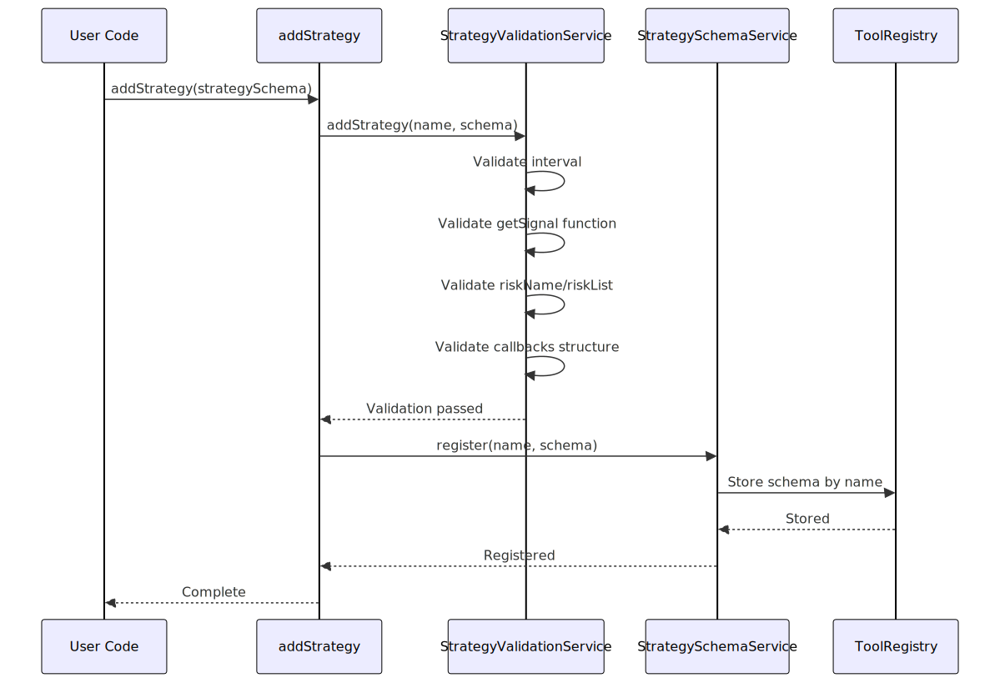

**Usage Example:**
```typescript
addStrategy({
  strategyName: "test_strategy",
  interval: "5m",
  riskName: "demo_risk",
  getSignal: async (symbol) => ({
    position: "long",
    priceOpen: 50000,
    priceTakeProfit: 51000,
    priceStopLoss: 49000,
    minuteEstimatedTime: 60,
    timestamp: Date.now(),
  }),
  callbacks: {
    onOpen: (symbol, signal, currentPrice, backtest) => {
      console.log("Position opened");
    },
    onClose: (symbol, signal, priceClose, backtest) => {
      console.log("Position closed");
    },
  },
});
```

**Validation Performed:**
- Strategy name uniqueness
- Valid interval value
- `getSignal` is an async function
- Either `riskName` or `riskList` provided (not both)
- Callback functions have correct signatures

**Sources:** [src/function/add.ts:52-64](), [demo/backtest/src/index.mjs:91-107](), [demo/live/src/index.mjs:87-103]()

---

### addExchange

Registers an exchange data source that provides candle data and price formatting. Exchanges must implement temporal isolation to prevent look-ahead bias in backtesting.

**Function Signature:**
```typescript
function addExchange(exchangeSchema: IExchangeSchema): void
```

**Parameters:**

| Parameter | Type | Description |
|-----------|------|-------------|
| `exchangeSchema.exchangeName` | `string` | Unique identifier for the exchange |
| `exchangeSchema.getCandles` | `(symbol: string, interval: string, since: Date, limit: number) => Promise<ICandle[]>` | Fetches historical candle data |
| `exchangeSchema.formatPrice` | `(symbol: string, price: number) => Promise<string>` | Formats prices for display |
| `exchangeSchema.formatQuantity` | `(symbol: string, quantity: number) => Promise<string>` | Formats quantities for display |
| `exchangeSchema.callbacks` | `IExchangeCallbacks` (optional) | Event handlers for candle fetching |

**Integration with CCXT:**


**Usage Example:**
```typescript
addExchange({
  exchangeName: "test_exchange",
  getCandles: async (symbol, interval, since, limit) => {
    const exchange = new ccxt.binance();
    const ohlcv = await exchange.fetchOHLCV(
      symbol, 
      interval, 
      since.getTime(), 
      limit
    );
    return ohlcv.map(([timestamp, open, high, low, close, volume]) => ({
      timestamp, open, high, low, close, volume
    }));
  },
  formatPrice: async (symbol, price) => price.toFixed(2),
  formatQuantity: async (symbol, quantity) => quantity.toFixed(8),
});
```

**Validation Performed:**
- Exchange name uniqueness
- `getCandles` is an async function
- `formatPrice` is an async function
- `formatQuantity` is an async function
- Callback functions have correct signatures

**Sources:** [src/function/add.ts:101-113](), [demo/backtest/src/index.mjs:24-35](), [demo/live/src/index.mjs:24-35]()

---

### addFrame

Registers a timeframe generator for backtesting. Frames define the start/end dates and interval for historical simulation.

**Function Signature:**
```typescript
function addFrame(frameSchema: IFrameSchema): void
```

**Parameters:**

| Parameter | Type | Description |
|-----------|------|-------------|
| `frameSchema.frameName` | `string` | Unique identifier for the frame |
| `frameSchema.interval` | `string` | Timeframe generation interval (`"1m"`, `"5m"`, `"1h"`, `"1d"`, etc.) |
| `frameSchema.startDate` | `Date` | Beginning of backtest period |
| `frameSchema.endDate` | `Date` | End of backtest period |
| `frameSchema.callbacks` | `IFrameCallbacks` (optional) | Event handlers for timeframe generation |

**Timeframe Generation Flow:**


**Usage Example:**
```typescript
addFrame({
  frameName: "test_frame",
  interval: "1m",
  startDate: new Date("2025-12-01T00:00:00.000Z"),
  endDate: new Date("2025-12-01T23:59:59.000Z"),
  callbacks: {
    onTimeframe: (timeframe, startDate, endDate, interval) => {
      console.log(`Generated ${timeframe.length} timeframes`);
    },
  },
});
```

**Validation Performed:**
- Frame name uniqueness
- Valid interval format
- `startDate` is before `endDate`
- Dates are valid Date objects
- Callback functions have correct signatures

**Sources:** [src/function/add.ts:145-151](), [demo/backtest/src/index.mjs:84-89](), [demo/live/src/index.mjs:80-85]()

---

### addRisk

Registers a risk management profile with portfolio-level constraints and custom validation functions. Risk profiles are shared across multiple strategies.

**Function Signature:**
```typescript
function addRisk(riskSchema: IRiskSchema): void
```

**Parameters:**

| Parameter | Type | Description |
|-----------|------|-------------|
| `riskSchema.riskName` | `string` | Unique identifier for risk profile |
| `riskSchema.maxConcurrentPositions` | `number` (optional) | Maximum open positions across all strategies |
| `riskSchema.validations` | `IRiskValidation[]` (optional) | Custom validation functions |
| `riskSchema.callbacks` | `IRiskCallbacks` (optional) | Event handlers for risk events |

**Risk Validation Structure:**


**IRiskValidation Types:**

| Type | Structure | Description |
|------|-----------|-------------|
| Function | `(payload: IRiskValidationPayload) => void \| Promise<void>` | Inline validation function |
| Object | `{ validate: Function, note?: string }` | Validation with documentation |

**Usage Example:**
```typescript
addRisk({
  riskName: "demo_risk",
  maxConcurrentPositions: 5,
  validations: [
    {
      validate: ({ pendingSignal, currentPrice }) => {
        const { priceOpen = currentPrice, priceTakeProfit, position } = pendingSignal;
        const tpDistance = position === "long"
          ? ((priceTakeProfit - priceOpen) / priceOpen) * 100
          : ((priceOpen - priceTakeProfit) / priceOpen) * 100;
        if (tpDistance < 1) {
          throw new Error(`TP distance ${tpDistance.toFixed(2)}% < 1%`);
        }
      },
      note: "TP distance must be at least 1%",
    },
    ({ pendingSignal, currentPrice }) => {
      const { priceOpen = currentPrice, priceTakeProfit, priceStopLoss, position } = pendingSignal;
      const reward = position === "long"
        ? priceTakeProfit - priceOpen
        : priceOpen - priceTakeProfit;
      const risk = position === "long"
        ? priceOpen - priceStopLoss
        : priceStopLoss - priceOpen;
      const rrRatio = reward / risk;
      if (rrRatio < 2) {
        throw new Error(`RR ratio ${rrRatio.toFixed(2)} < 2:1`);
      }
    },
  ],
  callbacks: {
    onRejected: (symbol, reason, limit, params) => {
      console.log(`[RISK] Signal rejected: ${reason}`);
    },
    onAllowed: (symbol, params) => {
      console.log(`[RISK] Signal allowed`);
    },
  },
});
```

**Validation Performed:**
- Risk name uniqueness
- `maxConcurrentPositions` is positive integer (if provided)
- Validation functions have correct signatures
- Callback functions have correct signatures

**Sources:** [src/function/add.ts:331-343](), [demo/backtest/src/index.mjs:37-82](), [demo/live/src/index.mjs:37-78]()

---

### addSizing

Registers a position sizing configuration. Sizing schemas are discriminated unions based on the `method` field.

**Function Signature:**
```typescript
function addSizing(sizingSchema: ISizingSchema): void
```

**Discriminated Union Structure:**


**Parameters by Method:**

| Method | Required Fields | Optional Fields |
|--------|----------------|-----------------|
| `fixed-percentage` | `sizingName`, `method`, `riskPercentage` | `maxPositionPercentage`, `minPositionSize`, `maxPositionSize`, `callbacks` |
| `kelly-criterion` | `sizingName`, `method` | `kellyMultiplier` (default: 0.25), `maxPositionPercentage`, `minPositionSize`, `maxPositionSize`, `callbacks` |
| `atr-based` | `sizingName`, `method`, `riskPercentage` | `atrMultiplier` (default: 2), `maxPositionPercentage`, `minPositionSize`, `maxPositionSize`, `callbacks` |

**Usage Example:**
```typescript
// Fixed percentage sizing
addSizing({
  sizingName: "conservative",
  method: "fixed-percentage",
  riskPercentage: 1,
  maxPositionPercentage: 10,
  minPositionSize: 0.001,
});

// Kelly Criterion sizing
addSizing({
  sizingName: "kelly",
  method: "kelly-criterion",
  kellyMultiplier: 0.25,
  maxPositionPercentage: 20,
});

// ATR-based sizing
addSizing({
  sizingName: "atr-dynamic",
  method: "atr-based",
  riskPercentage: 2,
  atrMultiplier: 2,
  callbacks: {
    onCalculate: (quantity, params) => {
      console.log(`Calculated size: ${quantity}`);
    },
  },
});
```

**Validation Performed:**
- Sizing name uniqueness
- Valid method value
- Method-specific required fields present
- Numeric fields are positive
- Callback functions have correct signatures

**Sources:** [src/function/add.ts:256-268]()

---

### addWalker

Registers a walker configuration for comparing multiple strategies on the same historical data. Walkers orchestrate sequential backtests and rank results by a specified metric.

**Function Signature:**
```typescript
function addWalker(walkerSchema: IWalkerSchema): void
```

**Parameters:**

| Parameter | Type | Description |
|-----------|------|-------------|
| `walkerSchema.walkerName` | `string` | Unique identifier for walker |
| `walkerSchema.exchangeName` | `string` | Exchange to use for all strategies |
| `walkerSchema.frameName` | `string` | Timeframe to use for all strategies |
| `walkerSchema.strategies` | `string[]` | Array of strategy names to compare |
| `walkerSchema.metric` | `string` (optional) | Metric for ranking (default: `"sharpeRatio"`) |
| `walkerSchema.callbacks` | `IWalkerCallbacks` (optional) | Event handlers for walker progress |

**Walker Execution Flow:**

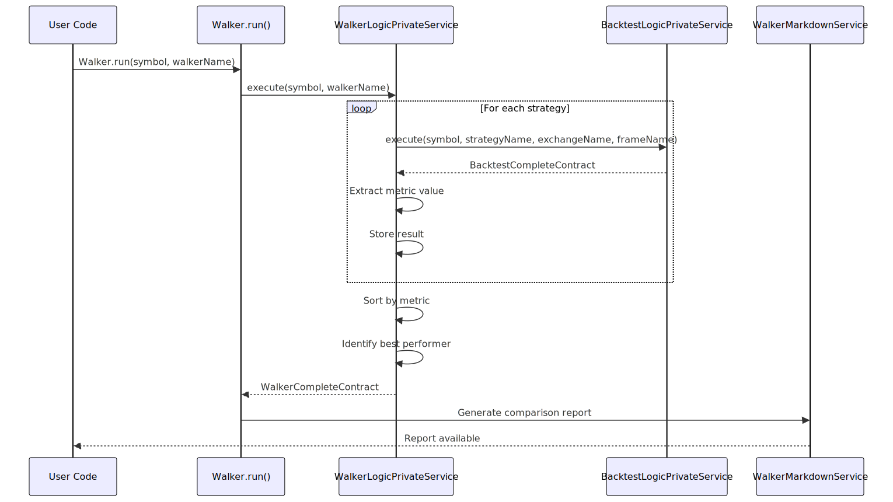

**Available Metrics:**

| Metric | Description |
|--------|-------------|
| `sharpeRatio` | Risk-adjusted return (default) |
| `totalPnl` | Total profit/loss |
| `winRate` | Percentage of profitable trades |
| `maxDrawdown` | Maximum portfolio decline |
| `totalTrades` | Number of completed trades |

**Usage Example:**
```typescript
addWalker({
  walkerName: "llm-prompt-optimizer",
  exchangeName: "binance",
  frameName: "1d-backtest",
  strategies: [
    "my-strategy-v1",
    "my-strategy-v2",
    "my-strategy-v3"
  ],
  metric: "sharpeRatio",
  callbacks: {
    onStrategyComplete: (strategyName, symbol, stats, metric) => {
      console.log(`${strategyName}: Sharpe ${metric.toFixed(2)}`);
    },
    onComplete: (results) => {
      console.log(`Best: ${results.bestStrategy}`);
    },
  },
});
```

**Validation Performed:**
- Walker name uniqueness
- Exchange exists in registry
- Frame exists in registry
- All strategy names exist in registry
- Strategies array is non-empty
- Callback functions have correct signatures

**Sources:** [src/function/add.ts:190-202]()

---

### addOptimizer

Registers an optimizer configuration for LLM-based strategy generation. Optimizers collect historical data, build conversation history, generate strategy prompts, and produce executable code.

**Function Signature:**
```typescript
function addOptimizer(optimizerSchema: IOptimizerSchema): void
```

**Parameters:**

| Parameter | Type | Description |
|-----------|------|-------------|
| `optimizerSchema.optimizerName` | `string` | Unique identifier for optimizer |
| `optimizerSchema.rangeTrain` | `IOptimizerRange[]` | Training time ranges (each generates a strategy variant) |
| `optimizerSchema.rangeTest` | `IOptimizerRange` | Testing time range for validation |
| `optimizerSchema.source` | `IOptimizerSource[]` | Data sources for LLM context |
| `optimizerSchema.getPrompt` | `(symbol: string, messages: MessageModel[]) => Promise<string>` | Generates strategy prompt from conversation |
| `optimizerSchema.template` | `IOptimizerTemplate` (optional) | Custom code generation templates |
| `optimizerSchema.callbacks` | `IOptimizerCallbacks` (optional) | Event handlers for optimizer stages |

**Optimizer Data Collection Flow:**


**IOptimizerSource Types:**

| Type | Structure | Description |
|------|-----------|-------------|
| Function | `(params: IOptimizerSourceParams) => Promise<any[]>` | Simple data fetcher |
| Object | `{ name, fetch, user?, assistant? }` | Data fetcher with custom message formatters |

**Usage Example:**
```typescript
addOptimizer({
  optimizerName: "llm-strategy-generator",
  rangeTrain: [
    {
      note: "Bull market period",
      startDate: new Date("2024-01-01"),
      endDate: new Date("2024-01-31"),
    },
    {
      note: "Bear market period",
      startDate: new Date("2024-02-01"),
      endDate: new Date("2024-02-28"),
    },
  ],
  rangeTest: {
    note: "Validation period",
    startDate: new Date("2024-03-01"),
    endDate: new Date("2024-03-31"),
  },
  source: [
    {
      name: "historical-backtests",
      fetch: async ({ symbol, startDate, endDate, limit, offset }) => {
        return await db.backtests.find({
          symbol,
          date: { $gte: startDate, $lte: endDate },
        })
        .skip(offset)
        .limit(limit);
      },
      user: async (symbol, data, name) => {
        return `Analyze ${data.length} backtests for ${symbol}:\n${JSON.stringify(data)}`;
      },
      assistant: async (symbol, data, name) => {
        return "Historical data analyzed successfully";
      },
    },
  ],
  getPrompt: async (symbol, messages) => {
    return `Analyze ${symbol} using RSI and MACD. Enter LONG when RSI < 30.`;
  },
  callbacks: {
    onData: (symbol, strategyData) => {
      console.log(`Generated ${strategyData.length} strategies`);
    },
    onCode: (symbol, code) => {
      console.log(`Generated ${code.length} chars of code`);
    },
  },
});
```

**Validation Performed:**
- Optimizer name uniqueness
- `rangeTrain` array is non-empty
- All date ranges are valid
- `rangeTest` has valid dates
- `source` array is non-empty
- `getPrompt` is an async function
- Callback functions have correct signatures

**Sources:** [src/function/add.ts:432-444]()

---

## Registration Dependencies

Components must be registered in a specific order due to inter-component references. The dependency graph ensures that referenced components exist before dependent components are registered.


**Registration Order Requirements:**

| Component | Must Register Before | Reason |
|-----------|---------------------|--------|
| Exchange | Strategy (if used) | Strategy may reference exchange for data |
| Frame | Walker | Walker references frame for timeframe |
| Risk | Strategy | Strategy requires risk profile |
| Sizing | Strategy (if used) | Strategy may reference sizing configuration |
| Strategy | Walker | Walker references strategies for comparison |

**Sources:** [src/function/add.ts:1-445](), [demo/backtest/src/index.mjs:24-113](), [demo/live/src/index.mjs:24-109]()

---

## Validation Pipeline

Component registration performs validation in two phases: **registration-time validation** (immediate) and **runtime validation** (during execution).

### Registration-Time Validation


**Registration-Time Checks:**

| Component | Validation Performed |
|-----------|---------------------|
| Strategy | `strategyName` unique, valid `interval`, `getSignal` is async function, risk profile exists |
| Exchange | `exchangeName` unique, `getCandles` is async function, format functions are async |
| Frame | `frameName` unique, valid `interval`, `startDate < endDate` |
| Risk | `riskName` unique, `maxConcurrentPositions > 0`, validation functions are functions |
| Sizing | `sizingName` unique, valid `method`, method-specific fields present |
| Walker | `walkerName` unique, exchange/frame exist, all strategies exist |
| Optimizer | `optimizerName` unique, non-empty `rangeTrain`, `getPrompt` is async function |

### Runtime Validation


**Runtime Checks:**

| Stage | Validation Performed |
|-------|---------------------|
| Type | `position` is valid enum, prices are numbers, timestamps valid |
| Price | TP/SL direction correct for position type, TP ≠ SL |
| Distance | TP distance ≥ `CC_MIN_TAKEPROFIT_DISTANCE_PERCENT`, SL within bounds |
| Time | `minuteEstimatedTime` within limits, signal not expired |
| Risk | Custom validation functions pass, concurrent position limit not exceeded |

**Sources:** [src/function/add.ts:1-445](), [src/lib/core/provide.ts:128-138]()

---

## Schema Storage Mechanism

All registered schemas are stored in `ToolRegistry` instances within their respective schema services. The registry provides in-memory storage with validation and override capabilities.

### ToolRegistry Pattern


**ToolRegistry Methods:**

| Method | Purpose |
|--------|---------|
| `register(name, tool)` | Store schema by unique name |
| `has(name)` | Check if schema exists |
| `get(name)` | Retrieve schema by name |
| `keys()` | Get all registered names |
| `values()` | Get all registered schemas |

**Schema Service Implementation Pattern:**

All schema services follow identical structure:

```typescript
class *SchemaService {
  private registry = new ToolRegistry<*Schema>();
  
  register(name: string, schema: *Schema): void {
    this.registry.register(name, schema);
  }
  
  has(name: string): boolean {
    return this.registry.has(name);
  }
  
  get(name: string): *Schema {
    return this.registry.get(name);
  }
}
```

**Schema Service Instances:**

| Service | Stores | Injected As |
|---------|--------|-------------|
| `StrategySchemaService` | `IStrategySchema` | `TYPES.strategySchemaService` |
| `ExchangeSchemaService` | `IExchangeSchema` | `TYPES.exchangeSchemaService` |
| `FrameSchemaService` | `IFrameSchema` | `TYPES.frameSchemaService` |
| `RiskSchemaService` | `IRiskSchema` | `TYPES.riskSchemaService` |
| `SizingSchemaService` | `ISizingSchema` | `TYPES.sizingSchemaService` |
| `WalkerSchemaService` | `IWalkerSchema` | `TYPES.walkerSchemaService` |
| `OptimizerSchemaService` | `IOptimizerSchema` | `TYPES.optimizerSchemaService` |

**Sources:** [src/lib/index.ts:98-112](), [src/lib/core/types.ts:20-28](), [src/lib/core/provide.ts:75-83]()