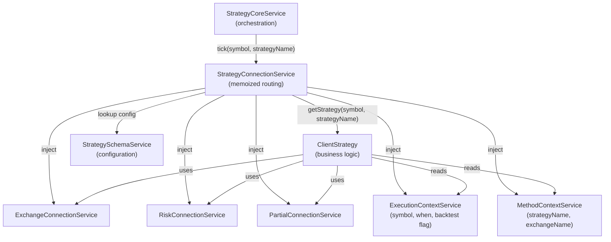
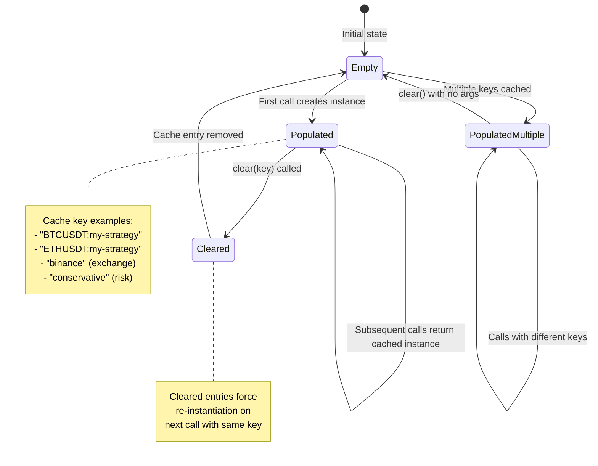
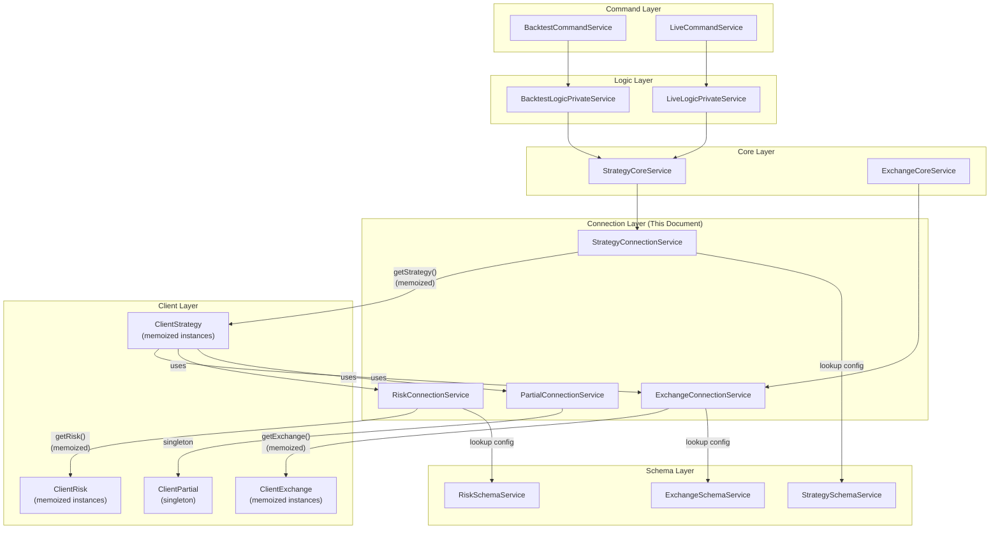

# Connection Services & Memoization

## Purpose and Scope

Connection Services implement a **memoized factory pattern** that sits between the Core Services layer and the Client Layer. They cache client instances (ClientStrategy, ClientExchange, etc.) by unique keys and route method calls to the appropriate cached instance. This architecture prevents redundant instantiation, ensures proper initialization, and centralizes event emission after operations complete.

For information about the Client Layer implementations that Connection Services instantiate, see [Client Layer](./14_architecture-deep-dive.md). For the overall service architecture and dependency injection, see [Service Layer & Dependency Injection](./14_architecture-deep-dive.md).

---

## Connection Services Overview

The framework defines six connection services, each responsible for managing a specific domain client:

| Connection Service | Client Managed | Cache Key | Primary Purpose |
|-------------------|----------------|-----------|-----------------|
| `StrategyConnectionService` | `ClientStrategy` | `symbol:strategyName` | Routes strategy execution (tick, backtest, signal monitoring) |
| `ExchangeConnectionService` | `ClientExchange` | `exchangeName` | Routes data fetching (candles, VWAP, price formatting) |
| `FrameConnectionService` | `ClientFrame` | `frameName` | Routes timeframe generation for backtesting |
| `RiskConnectionService` | `ClientRisk` | `riskName` | Routes risk validation and position tracking |
| `PartialConnectionService` | `ClientPartial` | (singleton) | Routes partial profit/loss monitoring |
| `OptimizerConnectionService` | `ClientOptimizer` | `optimizerName` | Routes LLM-based strategy generation |

All connection services follow the same pattern:
1. **Schema Lookup**: Retrieve configuration from corresponding SchemaService
2. **Memoization**: Cache client instances using `functools-kit` `memoize()`
3. **Routing**: Delegate method calls to cached client
4. **Event Emission**: Broadcast results to event system


---

## Memoization Pattern

Connection Services use **memoization** to prevent creating duplicate client instances for the same context. The `memoize()` function from `functools-kit` caches function results based on a computed cache key.

```mermaid
graph TB
    subgraph "First Call Sequence"
        Call1["strategyCoreService.tick(symbol, strategyName)"]
        ConnCheck1["strategyConnectionService.getStrategy(symbol, strategyName)"]
        CacheMiss1["Cache miss: key not found"]
        Create1["new ClientStrategy(params)"]
        Store1["Store in cache with key 'symbol:strategyName'"]
        Return1["Return ClientStrategy instance"]
    end
    
    subgraph "Subsequent Calls"
        Call2["strategyCoreService.tick(symbol, strategyName)"]
        ConnCheck2["strategyConnectionService.getStrategy(symbol, strategyName)"]
        CacheHit2["Cache hit: key found"]
        Return2["Return cached ClientStrategy instance"]
    end
    
    Call1 --> ConnCheck1
    ConnCheck1 --> CacheMiss1
    CacheMiss1 --> Create1
    Create1 --> Store1
    Store1 --> Return1
    
    Call2 --> ConnCheck2
    ConnCheck2 --> CacheHit2
    CacheHit2 --> Return2
    
    style CacheMiss1 fill:#ffeeee
    style CacheHit2 fill:#eeffee
```



**Memoization Benefits:**

1. **Performance**: Avoid re-instantiating clients with complex initialization
2. **State Preservation**: Maintain client internal state across calls (e.g., `_pendingSignal`, `_lastSignalTimestamp`)
3. **Memory Efficiency**: Single instance per unique key instead of creating instances per call
4. **Consistency**: Same client instance guarantees consistent behavior for a given context

**Cache Key Strategy:**

- **StrategyConnectionService**: `${symbol}:${strategyName}` (one instance per symbol-strategy pair)
- **ExchangeConnectionService**: `exchangeName` (one instance per exchange)
- **FrameConnectionService**: `frameName` (one instance per timeframe configuration)
- **RiskConnectionService**: `riskName` (one instance per risk profile)


---

## StrategyConnectionService Deep Dive

`StrategyConnectionService` is the most complex connection service, demonstrating all key patterns used across connection services.

### Architecture




### Key Methods

#### getStrategy (Memoized Factory)

The private `getStrategy` method is the core of the memoization pattern:

```typescript
private getStrategy = memoize(
  ([symbol, strategyName]) => `${symbol}:${strategyName}`,
  (symbol: string, strategyName: StrategyName) => {
    const {
      riskName = "",
      riskList = [],
      getSignal,
      interval,
      callbacks,
    } = this.strategySchemaService.get(strategyName);
    return new ClientStrategy({
      symbol,
      interval,
      execution: this.executionContextService,
      method: this.methodContextService,
      logger: this.loggerService,
      partial: this.partialConnectionService,
      exchange: this.exchangeConnectionService,
      risk: GET_RISK_FN({ riskName, riskList }, this),
      riskName,
      strategyName,
      getSignal,
      callbacks,
    });
  }
);
```

**Implementation Details:**

1. **Cache Key Function**: First parameter to `memoize()` computes `symbol:strategyName` string
2. **Factory Function**: Second parameter creates `ClientStrategy` with injected dependencies
3. **Schema Lookup**: Retrieves strategy configuration via `strategySchemaService.get()`
4. **Dependency Injection**: Passes all required services to ClientStrategy constructor
5. **Risk Merging**: Uses `GET_RISK_FN` to handle single `riskName` or multiple `riskList` profiles


#### tick (Live Execution Router)

Routes live trading ticks to the appropriate ClientStrategy instance:

```typescript
public tick = async (
  symbol: string,
  strategyName: StrategyName
): Promise<IStrategyTickResult> => {
  this.loggerService.log("strategyConnectionService tick", {
    symbol,
    strategyName,
  });
  const strategy = this.getStrategy(symbol, strategyName);
  await strategy.waitForInit();
  const tick = await strategy.tick(symbol, strategyName);
  {
    if (this.executionContextService.context.backtest) {
      await signalBacktestEmitter.next(tick);
    }
    if (!this.executionContextService.context.backtest) {
      await signalLiveEmitter.next(tick);
    }
    await signalEmitter.next(tick);
  }
  return tick;
};
```

**Execution Flow:**

1. **Logging**: Records method invocation for debugging
2. **Retrieval**: Gets cached ClientStrategy via `getStrategy()`
3. **Initialization**: Ensures strategy is ready via `waitForInit()` (restores persisted signals in live mode)
4. **Delegation**: Calls `strategy.tick()` to execute business logic
5. **Event Emission**: Broadcasts result to mode-specific and global emitters
6. **Return**: Passes result back to caller


#### backtest (Backtest Router)

Routes backtest execution to the appropriate ClientStrategy instance:

```typescript
public backtest = async (
  symbol: string,
  strategyName: StrategyName,
  candles: ICandleData[]
): Promise<IStrategyBacktestResult> => {
  this.loggerService.log("strategyConnectionService backtest", {
    symbol,
    strategyName,
    candleCount: candles.length,
  });
  const strategy = this.getStrategy(symbol, strategyName);
  await strategy.waitForInit();
  const tick = await strategy.backtest(symbol, strategyName, candles);
  {
    if (this.executionContextService.context.backtest) {
      await signalBacktestEmitter.next(tick);
    }
    await signalEmitter.next(tick);
  }
  return tick;
};
```

**Key Differences from tick():**

- Accepts `candles` array for fast backtesting
- Only emits to `signalBacktestEmitter` and `signalEmitter` (no live emitter)
- Returns `IStrategyBacktestResult` (always closed or cancelled, never idle/active)


#### clear (Cache Management)

Clears cached ClientStrategy instances to force re-initialization:

```typescript
public clear = async (ctx?: {
  symbol: string;
  strategyName: StrategyName;
}): Promise<void> => {
  this.loggerService.log("strategyConnectionService clear", {
    ctx,
  });
  if (ctx) {
    const key = `${ctx.symbol}:${ctx.strategyName}`;
    this.getStrategy.clear(key);
  } else {
    this.getStrategy.clear();
  }
};
```

**Use Cases:**

- **Specific Clear**: `clear({ symbol, strategyName })` removes single instance
- **Global Clear**: `clear()` removes all cached instances
- **Reset State**: Forces fresh ClientStrategy on next call (useful for testing)
- **Memory Management**: Release resources for strategies no longer needed


---

## Other Connection Services

### ExchangeConnectionService

Manages `ClientExchange` instances for fetching market data.

**Cache Key:** `exchangeName`

**Routed Methods:**
- `getCandles(symbol, interval, since, limit)` - Fetch historical candle data
- `getAveragePrice(symbol)` - Calculate VWAP from last 5 1m candles
- `formatPrice(symbol, price)` - Format price for exchange
- `formatQuantity(symbol, quantity)` - Format quantity for exchange

**Implementation Notes:**
- Uses `CANDLES_BUFFER_SIZE` to maintain rolling window of recent candles
- Detects anomalous prices using median calculation
- Retries failed requests with `retry()` from `functools-kit`
- Validates candle completeness (detects missing timestamps)


### FrameConnectionService

Manages `ClientFrame` instances for timeframe generation.

**Cache Key:** `frameName`

**Routed Methods:**
- `getTimeframes()` - Generate array of timestamps from startDate to endDate at specified interval

**Implementation Notes:**
- Returns immutable array of Date objects
- Validates that endDate > startDate
- Ensures interval divides evenly into total duration


### RiskConnectionService

Manages `ClientRisk` instances for risk validation.

**Cache Key:** `riskName`

**Routed Methods:**
- `checkSignal(args)` - Validate signal against risk limits and custom validations
- `addSignal(symbol, context)` - Track new active position
- `removeSignal(symbol, context)` - Remove closed position

**Implementation Notes:**
- Maintains global state of active positions across all strategies
- Executes custom validation functions from `IRiskSchema.validations`
- Supports `MergeRisk` for combining multiple risk profiles
- Uses `RiskGlobalService` for portfolio-wide tracking


### PartialConnectionService

Manages a singleton `ClientPartial` instance for partial profit/loss tracking.

**Cache Key:** None (singleton pattern)

**Routed Methods:**
- `profit(symbol, signal, currentPrice, percentTp, backtest, when)` - Track profit milestones
- `loss(symbol, signal, currentPrice, percentSl, backtest, when)` - Track loss milestones
- `clear(symbol, signal, currentPrice, backtest)` - Reset tracking on signal close

**Implementation Notes:**
- Emits `partialProfitSubject` and `partialLossSubject` events
- Tracks 10%, 20%, 30%... milestones
- Prevents duplicate emissions for same milestone
- Used by `ClientStrategy.tick()` to monitor unrealized P&L


### OptimizerConnectionService

Manages `ClientOptimizer` instances for LLM-based strategy generation.

**Cache Key:** `optimizerName`

**Routed Methods:**
- `getData(symbol)` - Fetch training data from all sources
- `getCode(symbol, data)` - Generate strategy code using LLM
- `dump(symbol, code)` - Write generated code to file

**Implementation Notes:**
- Integrates with Ollama for LLM inference
- Uses `OptimizerTemplateService` for code generation templates
- Manages conversation history across multiple data sources
- Emits progress events during data collection


---

## Cache Management and Lifecycle

### Cache Lifecycle




### Memory Implications

**Per-Symbol-Strategy Caching:**

For a backtest with 100 symbols and 5 strategies:
- Without memoization: 100 × 5 × iterations = thousands of ClientStrategy instantiations
- With memoization: 100 × 5 = 500 cached instances, reused across all iterations

**Memory Trade-offs:**

- **Cached State**: Each ClientStrategy stores `_pendingSignal`, `_scheduledSignal`, `_lastSignalTimestamp`
- **Service References**: Shared references to injected services (not duplicated)
- **Client Methods**: Prototype methods, not duplicated per instance

**Clearing Strategy:**

- **After Backtest**: No clear needed, let garbage collection handle it
- **Long-Running Live**: Call `clear()` periodically to release unused strategies
- **Testing**: Call `clear()` between tests to ensure clean state


---

## Integration with Service Layer

### Dependency Flow




### Dependency Injection Pattern

Connection Services are injected into Core Services via the DI container:

```typescript
// Core Services depend on Connection Services
class StrategyCoreService {
  private readonly strategyConnectionService = inject<StrategyConnectionService>(
    TYPES.strategyConnectionService
  );
  
  // Routes calls to connection service
  async tick(symbol: string, strategyName: StrategyName) {
    return await this.strategyConnectionService.tick(symbol, strategyName);
  }
}
```

**Injection Flow:**

1. `provide()` registers factory functions in `src/lib/core/provide.ts:66-72`
2. `inject()` retrieves services lazily via TYPES symbols
3. Connection Services inject other services (Schema, Context, etc.)
4. Clients receive fully-configured dependencies via constructor


---

## Comparison: Connection vs Core Services

| Aspect | Connection Services | Core Services |
|--------|-------------------|---------------|
| **Purpose** | Route & cache client instances | Orchestrate business logic |
| **State** | Stateless (delegates to clients) | Stateless (delegates to connections) |
| **Caching** | Memoize client instances | No caching |
| **Dependencies** | Schema, Context, Logger | Connection, Context, Schema |
| **Event Emission** | After client operations | N/A |
| **Examples** | StrategyConnectionService | StrategyCoreService |
| **Method Pattern** | `getClient()` + `client.method()` | `connectionService.method()` |

**Layering Rationale:**

- **Core Services**: High-level orchestration (e.g., iterate through timeframes)
- **Connection Services**: Instance routing and caching
- **Client Layer**: Pure business logic (e.g., signal validation)

This separation enables:
- Testing clients in isolation
- Swapping caching strategies without changing business logic
- Centralizing event emission logic


---

## Summary

Connection Services implement a **memoized factory pattern** that:

1. **Cache client instances** by unique keys (symbol:strategy, exchangeName, etc.)
2. **Route method calls** to the appropriate cached client
3. **Inject dependencies** from Schema and Context services
4. **Ensure initialization** via `waitForInit()` before operations
5. **Emit events** after operations complete

The memoization strategy prevents redundant instantiation, preserves client state across calls, and centralizes event emission. This architecture sits between the Core Services (orchestration) and Client Layer (business logic), providing clean separation of concerns and efficient resource management.

**Key Takeaways:**

- Use `memoize()` from `functools-kit` with computed cache keys
- StrategyConnectionService is the most complex, demonstrating all patterns
- Cache management via `clear()` enables testing and memory control
- Connection Services are stateless routers, not stateful coordinators

