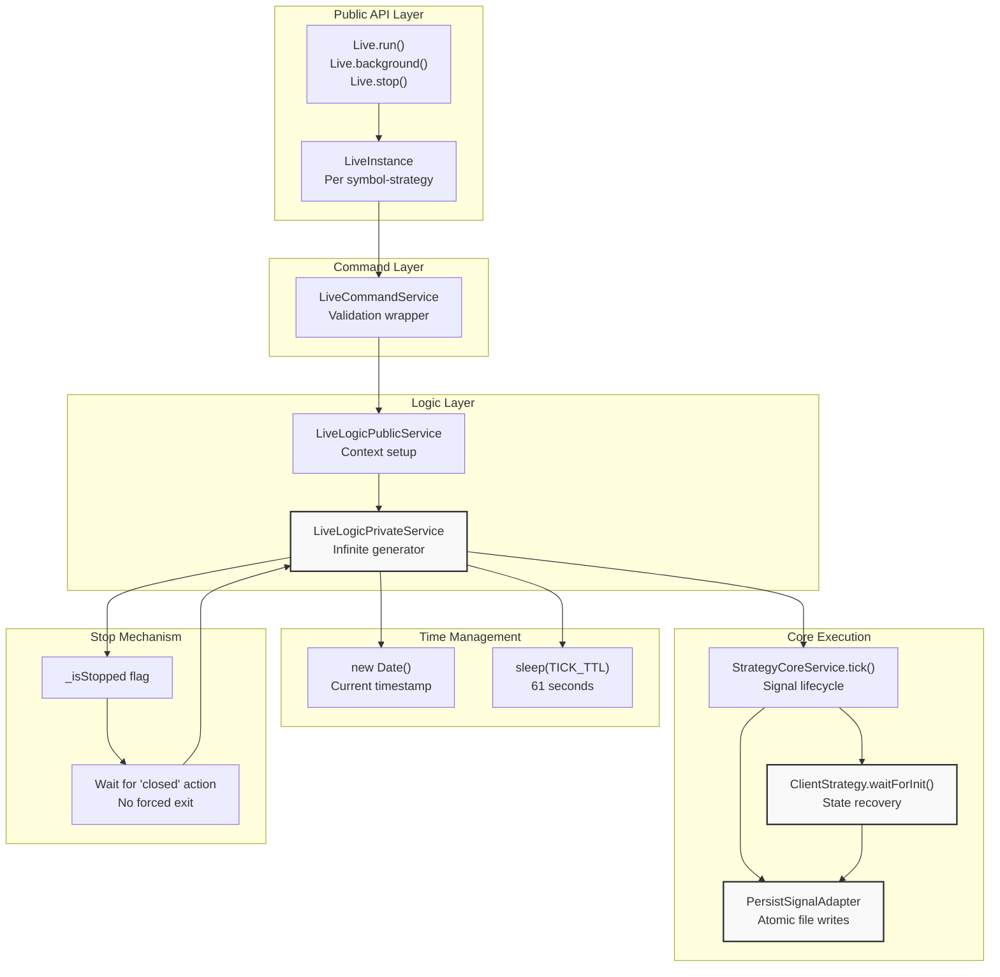
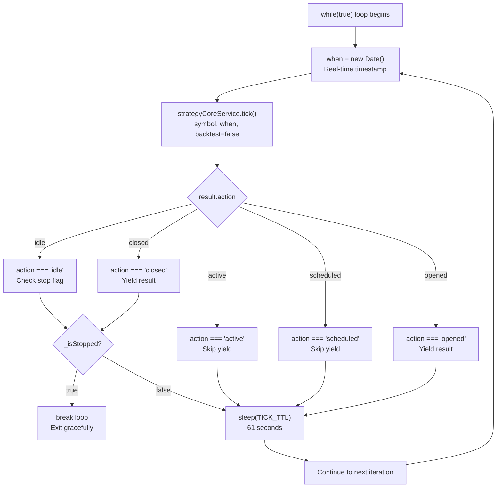
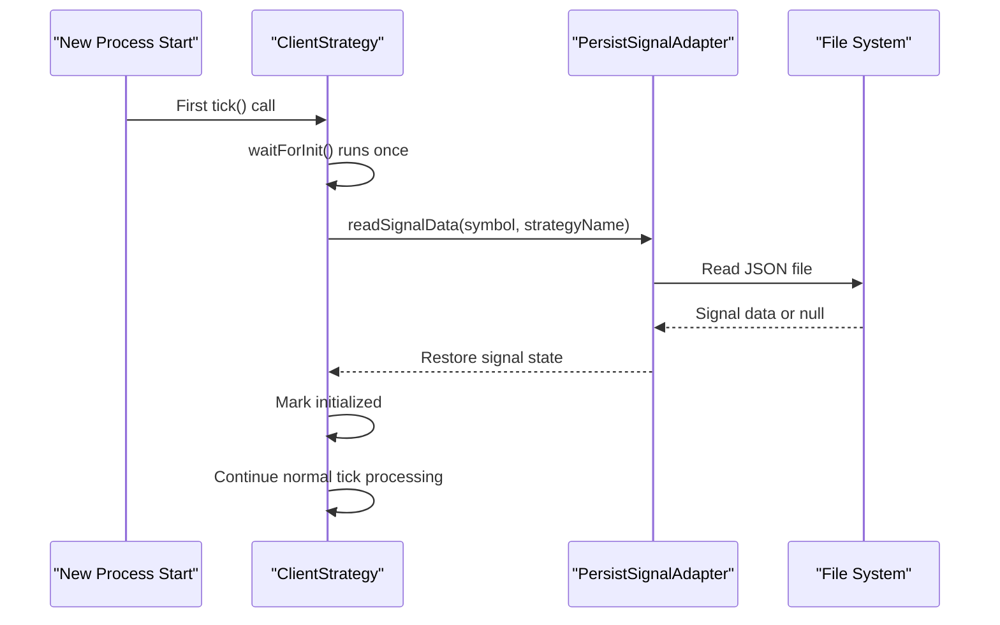
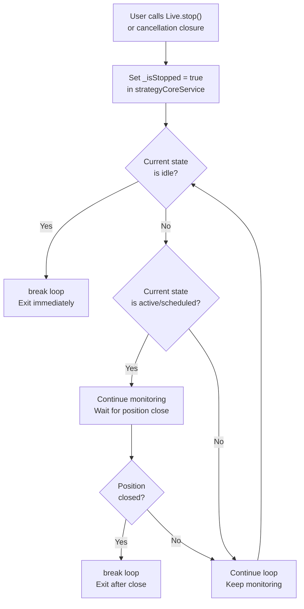
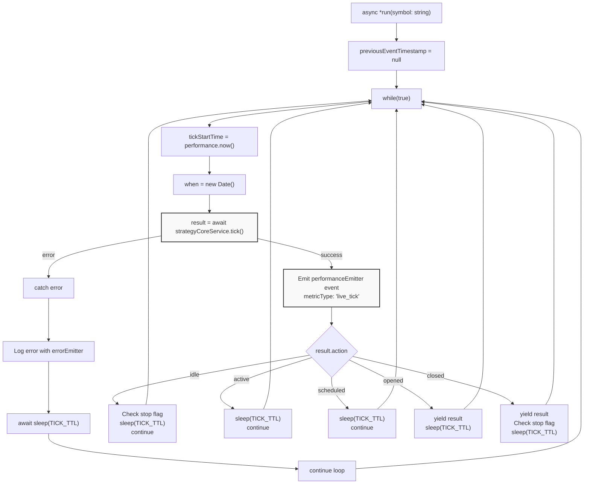

# Live Trading Mode

This page documents the live trading execution mode, which runs trading strategies in real-time against live market data. Live mode features an infinite loop architecture, crash-safe state persistence, automatic recovery after process restarts, and graceful shutdown mechanics.

For an overview of all execution modes and when to use each, see [Execution Modes Overview](./04-execution-modes-overview.md). For detailed information about persistence and crash recovery mechanisms, see [Crash Recovery and Persistence](./34-crash-recovery-and-persistence.md). For backtest simulation mode, see [Backtest Mode](./17-backtest-mode.md).

---

## Architecture Overview

Live mode implements a continuous monitoring system that executes indefinitely until manually stopped. Unlike backtest mode which iterates through pre-generated timeframes, live mode creates real-time dates and sleeps between iterations.



---

## Infinite Loop Execution

Live mode uses an infinite `while(true)` loop in `LiveLogicPrivateService.run()` that never completes naturally. Each iteration processes a single tick at the current real-time moment.

### Loop Structure



### Tick Interval

The constant `TICK_TTL` defines the sleep duration between iterations:

```typescript
const TICK_TTL = 1 * 60 * 1_000 + 1; // 61 seconds
```

This 61-second interval (one minute plus one second buffer) ensures ticks are spaced for minute-based candle monitoring. The logic sleeps after every tick result, regardless of signal state.

### Real-Time Date Creation

Unlike backtest mode which uses pre-generated timeframes, live mode creates timestamps dynamically:

```typescript
const when = new Date(); // Current real-time moment
```

This `when` variable is passed to `strategyCoreService.tick()` as the execution timestamp. This enables `ExecutionContextService` to provide the correct time to strategy callbacks via `getDate()`.

### Yielded Results

The generator yields only `opened` and `closed` results. The `idle`, `active`, and `scheduled` states are not yielded to consumers:

| Action | Yielded | Reason |
|--------|---------|--------|
| `idle` | No | No position exists, nothing to report |
| `scheduled` | No | Delayed entry signal, not yet activated |
| `opened` | Yes | New position opened, consumer needs notification |
| `active` | No | Position monitoring in progress, no state change |
| `closed` | Yes | Position closed with PNL, final result |
| `cancelled` | No | Scheduled signal cancelled without opening |

---

## Crash-Safe Persistence

Live mode persists signal state to disk after every tick, enabling recovery after process crashes or restarts. This "persist-and-restart" architecture ensures no trading data is lost.

### Persistence Flow

```mermaid
graph LR
    Tick["tick() called"]
    GetSignal["getSignal() checks state"]
    WaitInit["waitForInit() loads from disk"]
    ProcessTick["Process signal logic"]
    SetPending["setPendingSignal() saves state"]
    WriteFile["PersistSignalAdapter.writeSignalData()"]
    AtomicWrite["Atomic file write<br/>./dump/persist/"]
    
    Tick --> GetSignal
    GetSignal --> WaitInit
    WaitInit --> ProcessTick
    ProcessTick --> SetPending
    SetPending --> WriteFile
    WriteFile --> AtomicWrite
    
    style WaitInit fill:#f9f9f9,stroke:#333,stroke-width:2px
    style AtomicWrite fill:#f9f9f9,stroke:#333,stroke-width:2px
```



### PersistSignalAdapter

The `PersistSignalAdapter` class handles atomic file writes to prevent corruption during crashes. Each symbol-strategy pair has its own JSON file:

**File Path Pattern**: `./dump/persist/{symbol}_{strategyName}.json`

The adapter performs:
1. Serialization of signal state to JSON
2. Atomic write to temporary file
3. Rename to final filename (atomic operation)


### Persisted Data Structure

The following signal properties are persisted:

| Property | Type | Purpose |
|----------|------|---------|
| `id` | string | Unique signal identifier |
| `type` | "long" \| "short" | Position direction |
| `priceOpen` | number | Entry price (VWAP) |
| `takeProfit` | number | TP target price |
| `stopLoss` | number | SL exit price |
| `quantityOpen` | number | Position size |
| `timestampOpen` | number | Entry timestamp |
| `minuteEstimatedTime` | number | Max duration |


---

## State Recovery with waitForInit

When a live process starts (or restarts after crash), `ClientStrategy.waitForInit()` recovers the persisted state before processing the first tick.

### Recovery Sequence



### Initialization Pattern

The `waitForInit()` method uses the singleshot pattern from `functools-kit` to ensure it runs exactly once per instance:

1. First tick triggers `waitForInit()`
2. Method reads persisted file
3. If file exists, restores signal to in-memory state
4. If file doesn't exist, starts fresh (idle state)
5. Method completes and never runs again

This ensures recovery is transparent - the strategy continues from its exact state before the crash.

---

## Graceful Shutdown

Live mode supports graceful shutdown that waits for open positions to close naturally before stopping the process. This prevents forced exits that could leave positions unmonitored.

### Stop Flag Mechanism

The `LiveInstance` class maintains two internal flags:

```typescript
_isStopped: boolean  // User requested stop
_isDone: boolean     // Process completed
```

Calling `Live.stop()` or the cancellation closure sets `_isStopped = true`. The main loop checks this flag at safe points.

### Safe Stop Points

The loop checks the stop flag at two locations:

1. **Idle state** - No active position exists, safe to exit immediately:
   ```typescript
   if (result.action === "idle") {
     if (await strategyCoreService.getStopped(symbol, strategyName)) {
       break; // Exit loop immediately
     }
   }
   ```

2. **After closed** - Position just closed, safe to exit:
   ```typescript
   if (result.action === "closed") {
     if (await strategyCoreService.getStopped(symbol, strategyName)) {
       break; // Exit after position closed
     }
   }
   ```

### Stop Flow Diagram



### Background Task Completion

The `INSTANCE_TASK_FN` handles cleanup after the loop exits:

```typescript
for await (const signal of self.run(symbol, context)) {
  if (signal?.action === "closed" && self._isStopped) {
    break; // Exit when position closed and stop requested
  }
}
if (!self._isDone) {
  await doneLiveSubject.next({ ... }); // Emit completion event
}
self._isDone = true;
```

This ensures the `doneLiveSubject` event fires exactly once, even if the process crashes during shutdown.

---

## LiveLogicPrivateService Implementation

The `LiveLogicPrivateService` class contains the core implementation of the infinite generator pattern. This service is injected into `LiveLogicPublicService` which wraps it with context management.

### Class Dependencies

| Service | Purpose |
|---------|---------|
| `LoggerService` | Structured logging with context |
| `StrategyCoreService` | Strategy execution (tick calls) |
| `MethodContextService` | Strategy/exchange name context |

### run() Method Implementation

The `run()` method is an async generator that yields `IStrategyTickResultOpened` or `IStrategyTickResultClosed`:



### Error Handling

When `tick()` throws an error, the service:

1. Logs the error with `errorData()` and `getErrorMessage()`
2. Emits to `errorEmitter` for external handling
3. Sleeps for `TICK_TTL` to avoid rapid retry loops
4. Continues to next iteration (doesn't break loop)

This resilient design ensures temporary errors (network issues, API rate limits) don't crash the process.

### Performance Tracking

Each tick duration is tracked and emitted:

```typescript
await performanceEmitter.next({
  timestamp: currentTimestamp,
  previousTimestamp: previousEventTimestamp,
  metricType: "live_tick",
  duration: tickEndTime - tickStartTime,
  strategyName: this.methodContextService.context.strategyName,
  exchangeName: this.methodContextService.context.exchangeName,
  symbol,
  backtest: false
});
```

This enables monitoring of tick execution time for performance analysis.

---

## Live vs Backtest Comparison

The following table highlights key differences between live and backtest execution modes:

| Aspect | Live Mode | Backtest Mode |
|--------|-----------|---------------|
| **Loop Type** | `while(true)` infinite | `for` loop over timeframes |
| **Time Source** | `new Date()` real-time | Pre-generated timeframe array |
| **Completion** | Never (manual stop only) | When timeframes exhausted |
| **Sleep** | `sleep(TICK_TTL)` after each tick | None (fast processing) |
| **Persistence** | Atomic writes after every tick | None (in-memory only) |
| **Recovery** | `waitForInit()` on start | None needed |
| **Yielded Results** | `opened`, `closed` only | `closed` only |
| **Candle Processing** | Tick-by-tick monitoring | `backtest()` fast batch |
| **Stop Mechanism** | Graceful wait for position close | Immediate at idle or after close |
| **Event Emitters** | `signalLiveEmitter` | `signalBacktestEmitter` |
| **Backtest Flag** | `false` | `true` |

---

## Event System

Live mode emits several events during execution for external monitoring and integration.

### Signal Events

| Emitter | Event Type | Trigger | Payload |
|---------|-----------|---------|---------|
| `signalEmitter` | All signals | Every tick result | `IStrategyTickResult` |
| `signalLiveEmitter` | Live signals only | Filtered: backtest=false | `IStrategyTickResult` |
| `doneLiveSubject` | Completion | Loop exits | `DoneContract` |
| `performanceEmitter` | Performance metric | After each tick | `PerformanceContract` |
| `errorEmitter` | Recoverable error | tick() throws | Error object |

### Event Listener Usage

Users can subscribe to events using the public listener API:

```typescript
// Listen to all live signals
listenSignalLive((result) => {
  console.log(result.action, result.symbol);
});

// Listen to live completion
listenDoneLive((contract) => {
  console.log("Live trading stopped:", contract.symbol);
});

// Monitor errors
listenError((error) => {
  console.error("Recoverable error:", error);
});
```

All listeners use queued processing from `functools-kit` to ensure sequential execution even with async callbacks.

---

## API Usage Examples

### Running Live Trading with run()

The `Live.run()` method returns an async generator that yields opened and closed signals:

```typescript
// Infinite generator - use Ctrl+C to stop
for await (const result of Live.run("BTCUSDT", {
  strategyName: "my-strategy",
  exchangeName: "my-exchange"
})) {
  if (result.action === "opened") {
    console.log("Position opened:", result.signal.priceOpen);
  } else if (result.action === "closed") {
    console.log("Position closed, PNL:", result.pnl.pnlPercentage);
  }
}
```

**File Reference**: [src/classes/Live.ts:394-414]()

### Running in Background with background()

The `Live.background()` method runs without yielding, consuming results internally. It returns a cancellation function:

```typescript
// Start live trading in background
const cancel = Live.background("BTCUSDT", {
  strategyName: "my-strategy",
  exchangeName: "my-exchange"
});

// Use event listeners for monitoring
listenSignalLive((result) => {
  console.log("Event:", result.action);
});

// Stop gracefully when needed
// cancel();
```

**File Reference**: [src/classes/Live.ts:437-455]()

### Graceful Stop

Call `Live.stop()` to initiate graceful shutdown:

```typescript
// Request stop - will wait for position to close
await Live.stop("BTCUSDT", "my-strategy");

// Or use cancellation closure from background()
const cancel = Live.background("BTCUSDT", { ... });
cancel(); // Same graceful behavior
```

**File Reference**: [src/classes/Live.ts:474-485]()

### Instance Management

The `LiveUtils` class uses memoization to maintain separate instances per symbol-strategy pair:

```typescript
// Each symbol-strategy gets isolated instance
const btcInstance = Live.run("BTCUSDT", { strategyName: "strat-a", ... });
const ethInstance = Live.run("ETHUSDT", { strategyName: "strat-a", ... });

// List all active instances with status
const statusList = await Live.list();
statusList.forEach(status => {
  console.log(`${status.symbol} - ${status.strategyName}: ${status.status}`);
});
```

**File Reference**: [src/classes/Live.ts:377-382](), [src/classes/Live.ts:585-588]()

### Crash Recovery Example

Live mode automatically recovers after crashes:

```typescript
// First run - process crashes mid-execution
Live.background("BTCUSDT", { strategyName: "my-strategy", ... });
// Position opens, state persisted to disk
// Process crashes...

// Second run - same code, automatic recovery
Live.background("BTCUSDT", { strategyName: "my-strategy", ... });
// waitForInit() reads persisted state
// Continues monitoring from last known state
// Position closes normally
```

No code changes needed - recovery is automatic via `waitForInit()` and `PersistSignalAdapter`.

---

## Reporting and Statistics

Live mode provides statistical analysis of trading performance through `LiveMarkdownService`.

### Statistics Data Structure

The `LiveStatistics` interface provides comprehensive metrics:

| Metric | Type | Description |
|--------|------|-------------|
| `eventList` | `TickEvent[]` | All events (idle, opened, active, closed) |
| `totalEvents` | `number` | Count of all events |
| `totalClosed` | `number` | Count of closed signals |
| `winCount` | `number` | Winning signals (PNL > 0) |
| `lossCount` | `number` | Losing signals (PNL < 0) |
| `winRate` | `number \| null` | Win rate percentage (0-100) |
| `avgPnl` | `number \| null` | Average PNL per signal |
| `totalPnl` | `number \| null` | Cumulative PNL |
| `stdDev` | `number \| null` | Standard deviation of returns |
| `sharpeRatio` | `number \| null` | Risk-adjusted return metric |
| `annualizedSharpeRatio` | `number \| null` | Annualized Sharpe ratio |
| `certaintyRatio` | `number \| null` | avgWin / \|avgLoss\| |
| `expectedYearlyReturns` | `number \| null` | Projected annual returns |

### Accessing Statistics

```typescript
// Get statistical data
const stats = await Live.getData("BTCUSDT", "my-strategy");
console.log("Win rate:", stats.winRate);
console.log("Sharpe ratio:", stats.sharpeRatio);

// Generate markdown report
const report = await Live.getReport("BTCUSDT", "my-strategy");
console.log(report);

// Save report to disk
await Live.dump("BTCUSDT", "my-strategy", "./reports");
```

**File Reference**: [src/classes/Live.ts:500-511](), [src/classes/Live.ts:526-537](), [src/classes/Live.ts:555-570]()

---

