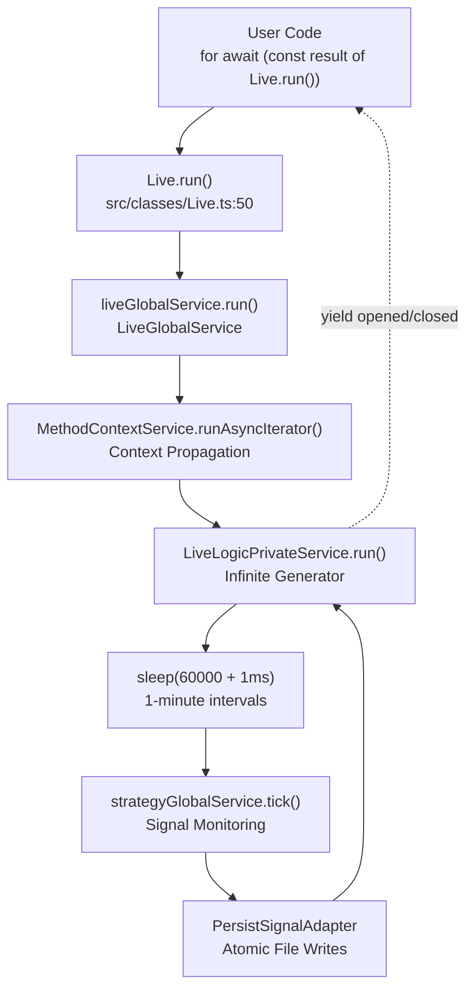
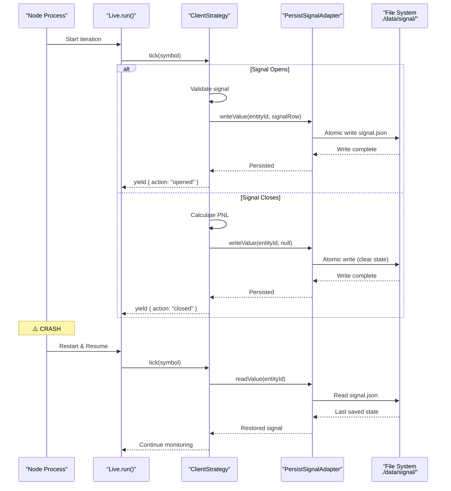
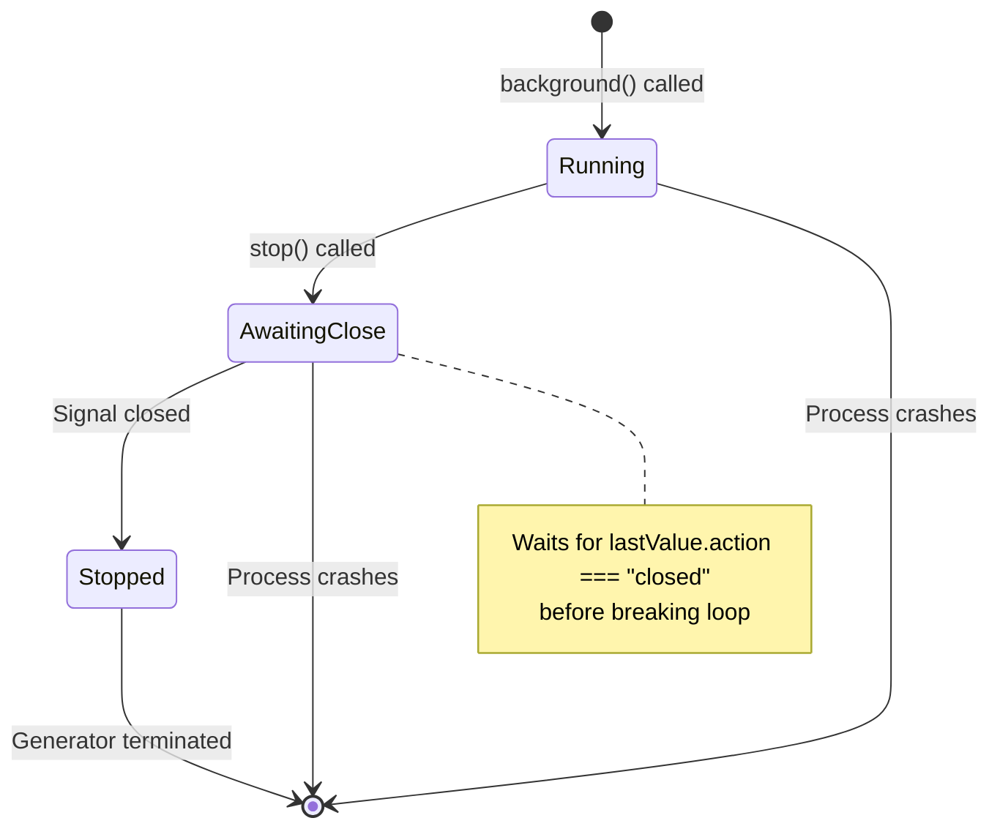
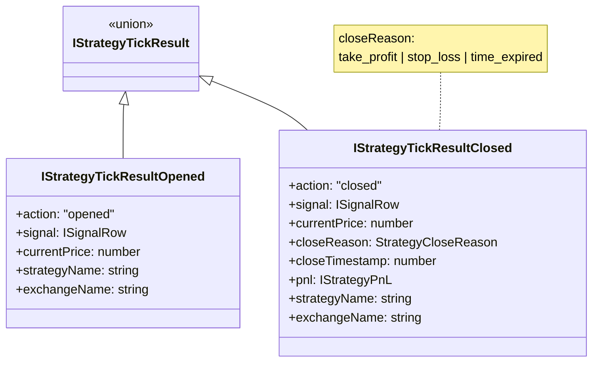
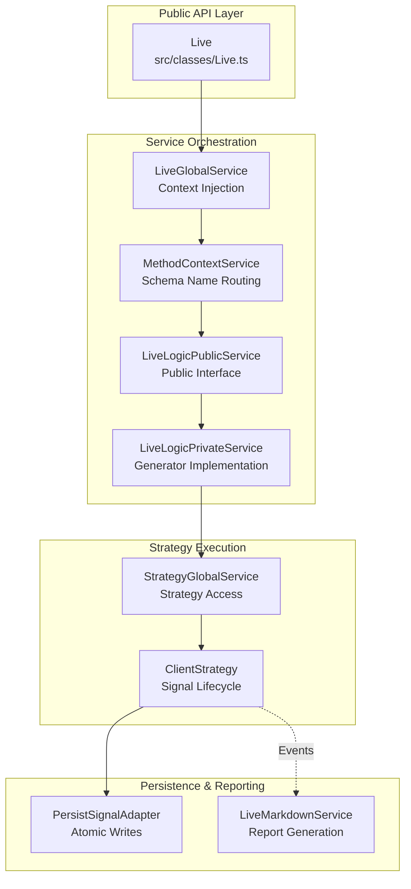

# Live Trading API

<details>
<summary>Relevant source files</summary>

The following files were used as context for generating this wiki page:

- [README.md](README.md)
- [docs/classes/BacktestUtils.md](docs/classes/BacktestUtils.md)
- [docs/classes/LiveUtils.md](docs/classes/LiveUtils.md)
- [docs/index.md](docs/index.md)
- [src/classes/Backtest.ts](src/classes/Backtest.ts)
- [src/classes/Live.ts](src/classes/Live.ts)
- [src/classes/Schedule.ts](src/classes/Schedule.ts)
- [src/classes/Walker.ts](src/classes/Walker.ts)
- [src/config/emitters.ts](src/config/emitters.ts)
- [src/function/event.ts](src/function/event.ts)
- [src/lib/services/global/WalkerGlobalService.ts](src/lib/services/global/WalkerGlobalService.ts)
- [src/lib/services/markdown/BacktestMarkdownService.ts](src/lib/services/markdown/BacktestMarkdownService.ts)
- [src/lib/services/markdown/LiveMarkdownService.ts](src/lib/services/markdown/LiveMarkdownService.ts)
- [src/lib/services/markdown/ScheduleMarkdownService.ts](src/lib/services/markdown/ScheduleMarkdownService.ts)
- [test/spec/scheduled.test.mjs](test/spec/scheduled.test.mjs)

</details>


This page documents the public-facing Live Trading API provided by the `Live` class. This API enables production-ready live trading execution with infinite async generators, crash-safe state persistence, and real-time signal monitoring. The API is designed for production use with automatic state recovery after process crashes.

For backtesting operations, see [Backtest API](#3.2). For detailed implementation of crash recovery mechanisms, see [Crash Recovery](#8.2). For signal persistence internals, see [Signal Persistence](#6.3). For the complete live execution flow including service orchestration, see [Live Execution Flow](#8.1).

**Sources:** [src/classes/Live.ts:1-181](), [types.d.ts:534-561](), [README.md:139-194]()

---

## Overview

The Live Trading API is implemented as a singleton class `LiveUtils` exported as `Live`. It provides four primary methods for live trading operations:

| Method | Return Type | Purpose |
|--------|-------------|---------|
| `run()` | `AsyncIterableIterator<IStrategyTickResult>` | Infinite generator yielding signal events |
| `background()` | `Promise<() => void>` | Background execution with cancellation |
| `getReport()` | `Promise<string>` | Generate markdown report |
| `dump()` | `Promise<void>` | Save report to disk |

Unlike the Backtest API which terminates when the timeframe is exhausted, the Live API runs indefinitely until manually stopped or the process crashes. State is persisted atomically before each signal transition, enabling seamless recovery on restart.

**Sources:** [src/classes/Live.ts:10-117](), [src/index.ts:52-53]()

---

## Live.run Method

### Signature

```typescript
Live.run(
  symbol: string,
  context: {
    strategyName: string;
    exchangeName: string;
  }
): AsyncIterableIterator<IStrategyTickResult>
```

The `run()` method initiates live trading execution for a trading pair. It returns an infinite async generator that yields signal events in real-time. The generator executes with 1-minute intervals, monitoring active signals and checking for new signal generation opportunities.

**Sources:** [src/classes/Live.ts:40-62](), [types.d.ts:534-545]()

### Execution Characteristics



**Diagram: Live.run Execution Path**

The execution flow propagates through dependency injection layers:
1. `Live.run()` logs the request and delegates to `liveGlobalService`
2. `LiveGlobalService` wraps the call with `MethodContextService` for context propagation
3. `LiveLogicPrivateService` implements the infinite generator with 1-minute sleep intervals
4. Each iteration calls `strategyGlobalService.tick()` to check signal state
5. State changes are persisted atomically via `PersistSignalAdapter` before yielding

**Sources:** [src/classes/Live.ts:50-62](), [src/lib/services/logic/private/LiveLogicPrivateService.ts:1-150]()

### Yielded Results

The generator yields only `opened` and `closed` results. The `idle` and `active` states are filtered out to reduce noise in live mode:

| Result Type | When Yielded | Signal State |
|-------------|--------------|--------------|
| `IStrategyTickResultOpened` | New signal created and validated | Just opened |
| `IStrategyTickResultClosed` | Signal hit TP/SL or time expired | Just closed |
| `IStrategyTickResultIdle` | ❌ Not yielded in live mode | No active signal |
| `IStrategyTickResultActive` | ❌ Not yielded in live mode | Monitoring signal |

This filtering is implemented in [src/lib/services/logic/private/LiveLogicPrivateService.ts]() where only `opened` and `closed` actions are yielded to the caller.

**Sources:** [types.d.ts:455-508](), [src/lib/services/logic/private/LiveLogicPrivateService.ts:1-150]()

### State Persistence and Recovery



**Diagram: Crash Recovery Flow**

Every signal state change is persisted atomically before yielding results. This ensures:
- No duplicate signals after restart
- No lost signals during crashes
- Deterministic recovery to last known state

**Sources:** [src/client/ClientStrategy.ts:1-500](), [src/classes/Persist.ts:1-400]()

---

## Live.background Method

### Signature

```typescript
Live.background(
  symbol: string,
  context: {
    strategyName: string;
    exchangeName: string;
  }
): Promise<() => void>
```

The `background()` method runs live trading without yielding results to the caller. It internally consumes all generator values, allowing the strategy to execute for side effects only (callbacks, persistence, logging). Returns a cancellation function to stop execution gracefully.

**Sources:** [src/classes/Live.ts:64-117]()

### Implementation Details

```typescript
// Implementation from src/classes/Live.ts:85-117
public background = async (symbol, context) => {
  const iterator = this.run(symbol, context);
  let isStopped = false;
  let lastValue = null;
  
  const task = async () => {
    while (true) {
      const { value, done } = await iterator.next();
      if (value) {
        lastValue = value;
      }
      if (done) break;
      if (lastValue?.action === "closed" && isStopped) break;
    }
  }
  
  task(); // Fire and forget
  return () => { isStopped = true; }; // Cancellation closure
}
```

The method waits for the next `closed` event before honoring the cancellation flag. This ensures signals are not interrupted mid-lifecycle.

**Sources:** [src/classes/Live.ts:85-117]()

### Cancellation Behavior



**Diagram: Background Cancellation State Machine**

The cancellation mechanism ensures signals are not left in an inconsistent state when stopping live trading.

**Sources:** [src/classes/Live.ts:99-111]()

---

## Reporting Methods

### Live.getReport

```typescript
Live.getReport(strategyName: string): Promise<string>
```

Generates a markdown-formatted report for the specified strategy. The report includes:
- Total event count (idle, opened, active, closed)
- Closed signals count
- Win rate calculation (percentage, wins/losses)
- Average PNL across all closed signals
- Signal-by-signal table with timestamps, prices, and outcomes

The report is generated by `LiveMarkdownService` which accumulates events passively via event listeners.

**Sources:** [src/classes/Live.ts:119-136](), [types.d.ts:549-553]()

### Live.dump

```typescript
Live.dump(
  strategyName: string,
  path?: string
): Promise<void>
```

Saves the markdown report to disk. Default path is `./logs/live/{strategyName}.md`. Custom paths can be specified via the optional `path` parameter.

**Sources:** [src/classes/Live.ts:138-162]()

### Report Output Format

| Section | Content |
|---------|---------|
| Header | Strategy name, total events, closed signals |
| Statistics | Win rate (% and W/L ratio), average PNL |
| Signal Table | Columns: Timestamp, Action, Symbol, Signal ID, Position, Prices (Open/TP/SL), PNL, Close Reason |

**Sources:** [src/lib/services/markdown/LiveMarkdownService.ts:1-300]()

---

## Result Type System

The generator yields a discriminated union `IStrategyTickResult` with the `action` field as the discriminator:



**Diagram: Live Result Type Hierarchy**

Type guards enable safe property access:

```typescript
for await (const result of Live.run("BTCUSDT", context)) {
  if (result.action === "opened") {
    // TypeScript knows: result is IStrategyTickResultOpened
    console.log(result.signal.id);
  } else if (result.action === "closed") {
    // TypeScript knows: result is IStrategyTickResultClosed
    console.log(result.pnl.pnlPercentage);
    console.log(result.closeReason);
  }
}
```

**Sources:** [types.d.ts:441-517](), [src/interfaces/Strategy.interface.ts:1-200]()

---

## Usage Patterns

### Basic Live Trading Loop

```typescript
// Reference: README.md:142-169
import { Live } from "backtest-kit";

for await (const result of Live.run("BTCUSDT", {
  strategyName: "my-strategy",
  exchangeName: "binance"
})) {
  if (result.action === "opened") {
    console.log("Signal opened:", result.signal.id);
    // State already persisted to disk
  }
  
  if (result.action === "closed") {
    console.log("Closed:", {
      reason: result.closeReason,
      pnl: result.pnl.pnlPercentage
    });
    
    // Generate report after each close
    await Live.dump("my-strategy");
  }
}
```

**Sources:** [README.md:142-169]()

### Background Execution with Event Listeners

```typescript
// Reference: README.md:387-418
import { Live, listenSignalLive } from "backtest-kit";

// Start background execution
const cancel = await Live.background("BTCUSDT", {
  strategyName: "my-strategy",
  exchangeName: "binance"
});

// React to events
listenSignalLive((event) => {
  if (event.action === "closed") {
    console.log("PNL:", event.pnl.pnlPercentage);
  }
});

// Stop on condition
setTimeout(() => cancel(), 3600000); // Stop after 1 hour
```

**Sources:** [README.md:387-418]()

### Multi-Symbol Live Trading

```typescript
// Reference: README.md:693-715
import { Live } from "backtest-kit";

const symbols = ["BTCUSDT", "ETHUSDT", "SOLUSDT"];

await Promise.all(
  symbols.map(async (symbol) => {
    for await (const result of Live.run(symbol, {
      strategyName: "my-strategy",
      exchangeName: "binance"
    })) {
      console.log(`[${symbol}]`, result.action);
    }
  })
);
```

Each symbol maintains independent state persistence in separate files: `./data/signal/binance-my-strategy-BTCUSDT.json`, etc.

**Sources:** [README.md:693-715](), [src/classes/Persist.ts:200-300]()

---

## Comparison with Backtest API

| Feature | Live.run() | Backtest.run() |
|---------|-----------|----------------|
| Generator Type | Infinite | Finite (exhausts timeframe) |
| Time Progression | Real-time (Date.now()) | Historical (frame timestamps) |
| Sleep Interval | 1 minute + 1ms | No sleep (fast iteration) |
| Yielded Results | `opened`, `closed` only | `closed` only (after fast-forward) |
| State Persistence | Enabled (crash recovery) | Disabled (stateless) |
| Context Parameter | `{ strategyName, exchangeName }` | `{ strategyName, exchangeName, frameName }` |
| Termination | Manual (break/cancel) | Automatic (frame end) |

**Sources:** [src/classes/Live.ts:1-181](), [src/classes/Backtest.ts:1-169]()

---

## Service Integration



**Diagram: Live API Service Dependencies**

The Live API delegates to service layers which handle:
- **Context Propagation**: `MethodContextService` and `ExecutionContextService` inject implicit context
- **Strategy Execution**: `StrategyGlobalService` routes to correct `ClientStrategy` instance
- **State Management**: `PersistSignalAdapter` handles crash-safe file writes
- **Reporting**: `LiveMarkdownService` accumulates events passively

**Sources:** [src/classes/Live.ts:1-181](), [src/lib/services/global/LiveGlobalService.ts:1-100](), [src/lib/services/logic/private/LiveLogicPrivateService.ts:1-150]()

---

## Error Handling

The Live API does not catch exceptions - they bubble up to the caller. This design enables crash recovery:

1. **Process crashes** → State persisted on disk
2. **Process restarts** → State loaded from disk
3. **Execution resumes** → No duplicate signals

For custom error handling, wrap the generator in try-catch:

```typescript
try {
  for await (const result of Live.run("BTCUSDT", context)) {
    // Process result
  }
} catch (error) {
  console.error("Live trading error:", error);
  // Log, alert, restart, etc.
}
```

**Sources:** [src/classes/Live.ts:50-62](), [src/lib/services/logic/private/LiveLogicPrivateService.ts:1-150]()