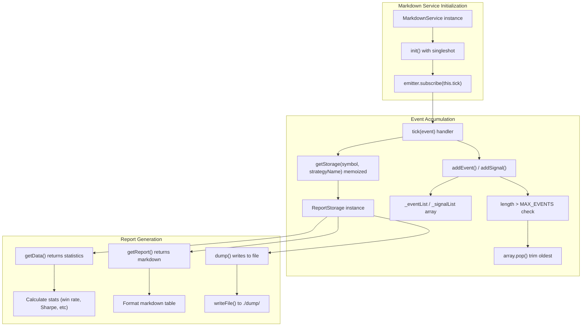
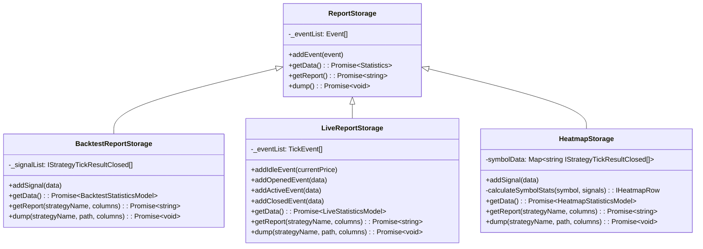
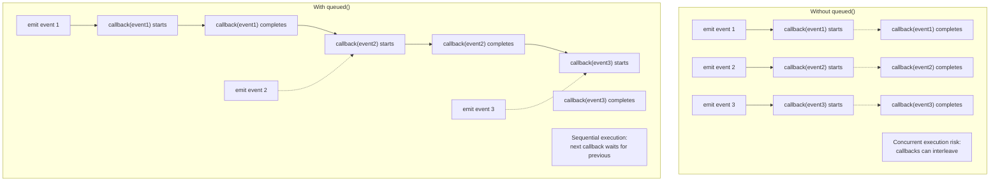
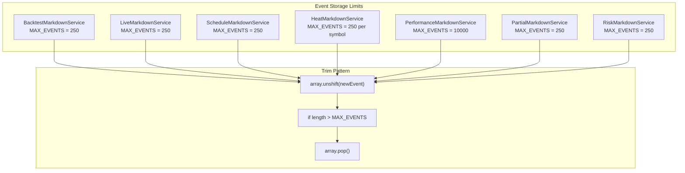
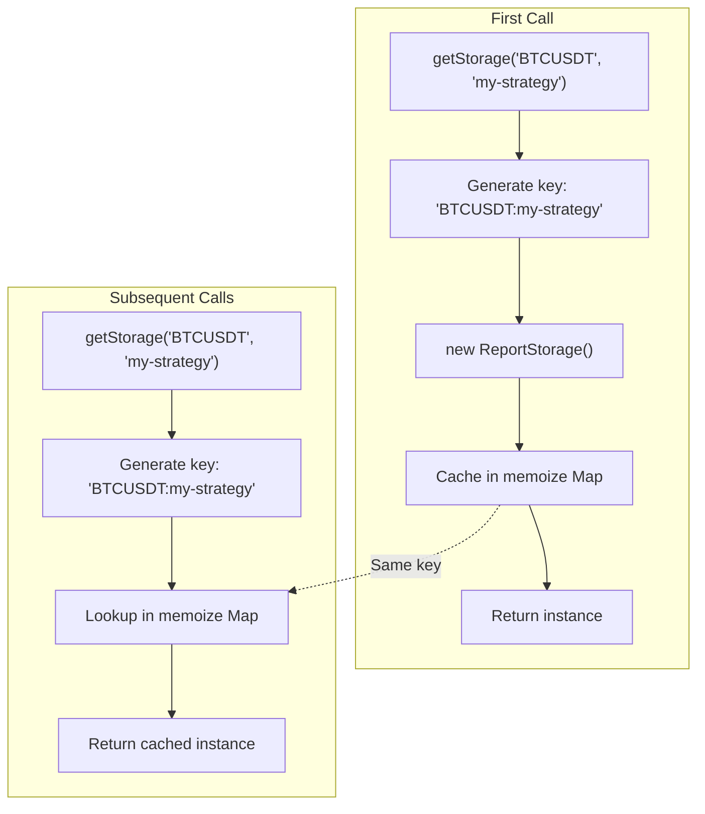

# Event System Architecture

## Purpose and Scope

This document describes the event-driven architecture of Backtest Kit, including the 13+ event emitters, their purposes, event flow patterns, markdown service consumers, public API listeners, and memory management strategies. The event system enables real-time monitoring, reporting, and integration with external systems without coupling producers to consumers.

For information about how strategies generate events, see [3.1 - Signals & Signal Lifecycle](./08_core-concepts.md). For information about execution modes that produce events, see [5 - Execution Modes](./20_execution-modes.md). For information about report generation from accumulated events, see [9 - Reporting & Monitoring](./40_reporting-monitoring.md).

---

## Event Emitter Registry

The framework provides 13 distinct `Subject` emitters organized by functional area. All emitters are defined in [src/config/emitters.ts:1-133]() using the `functools-kit` Subject pattern.

### Signal Event Emitters

| Emitter | Type | Purpose | Emission Source |
|---------|------|---------|-----------------|
| `signalEmitter` | `Subject<IStrategyTickResult>` | Global signal events (all modes) | ClientStrategy.tick() |
| `signalBacktestEmitter` | `Subject<IStrategyTickResult>` | Backtest-only signals | BacktestLogicPrivateService |
| `signalLiveEmitter` | `Subject<IStrategyTickResult>` | Live-only signals | LiveLogicPrivateService |

**Three-Tier Signal Emission**: The system emits each signal event to three subjects simultaneously. This enables consumers to selectively subscribe to all signals (`signalEmitter`), only backtest signals (`signalBacktestEmitter`), or only live signals (`signalLiveEmitter`) without filtering logic.

Sources: [src/config/emitters.ts:15-31](), [types.d.ts:888-892]()

---

### Execution State Emitters

| Emitter | Type | Purpose | Emission Source |
|---------|------|---------|-----------------|
| `doneBacktestSubject` | `Subject<DoneContract>` | Backtest completion | BacktestLogicPublicService |
| `doneLiveSubject` | `Subject<DoneContract>` | Live execution stop | LiveLogicPublicService |
| `doneWalkerSubject` | `Subject<DoneContract>` | Walker completion | WalkerLogicPublicService |
| `progressBacktestEmitter` | `Subject<ProgressBacktestContract>` | Backtest progress % | BacktestLogicPrivateService |

**Completion Events**: Each execution mode has its own completion subject that emits a `DoneContract` containing context about what finished (symbol, strategyName, exchangeName, backtest flag).

Sources: [src/config/emitters.ts:47-68](), [src/function/event.ts:157-249]()

---

### Walker Event Emitters

| Emitter | Type | Purpose | Emission Source |
|---------|------|---------|-----------------|
| `walkerEmitter` | `Subject<WalkerContract>` | Strategy comparison progress | WalkerLogicPrivateService |
| `walkerCompleteSubject` | `Subject<WalkerCompleteContract>` | Walker final results | WalkerLogicPrivateService |
| `walkerStopSubject` | `Subject<WalkerStopContract>` | Walker cancellation | WalkerLogicPublicService.stop() |
| `progressWalkerEmitter` | `Subject<ProgressWalkerContract>` | Walker progress events | WalkerLogicPrivateService |

**Walker Progress**: `walkerEmitter` emits after each strategy completes, providing incremental results. `walkerCompleteSubject` emits once with final aggregated results for all strategies.

Sources: [src/config/emitters.ts:88-106](), [src/lib/services/markdown/WalkerMarkdownService.ts:420-438]()

---

### Risk & Partial Event Emitters

| Emitter | Type | Purpose | Emission Source |
|---------|------|---------|-----------------|
| `riskSubject` | `Subject<RiskContract>` | Risk validation rejections | ClientRisk.checkSignal() |
| `partialProfitSubject` | `Subject<PartialProfitContract>` | Profit level milestones (10%, 20%...) | ClientPartial.profit() |
| `partialLossSubject` | `Subject<PartialLossContract>` | Loss level milestones (10%, 20%...) | ClientPartial.loss() |

**Rejection-Only Emission**: `riskSubject` emits ONLY when signals fail validation, preventing spam from allowed signals.

Sources: [src/config/emitters.ts:114-131](), [types.d.ts:486-497]()

---

### Error & Performance Emitters

| Emitter | Type | Purpose | Emission Source |
|---------|------|---------|-----------------|
| `errorEmitter` | `Subject<Error>` | Recoverable errors | Background execution error handlers |
| `exitEmitter` | `Subject<Error>` | Fatal errors requiring termination | Walker/Optimizer critical failures |
| `performanceEmitter` | `Subject<PerformanceContract>` | Execution timing metrics | PerformanceCoreService |
| `validationSubject` | `Subject<Error>` | Risk validation errors | ClientRisk validation failures |

**Error Severity Distinction**: `errorEmitter` allows execution to continue (e.g., single tick failure in live mode), while `exitEmitter` signals unrecoverable errors that should terminate the process.

Sources: [src/config/emitters.ts:33-86](), [src/function/event.ts:251-282]()

---

## Event Flow Architecture

```mermaid
graph TB
    subgraph "Event Producers"
        ClientStrategy["ClientStrategy.tick()"]
        BacktestLogic["BacktestLogicPrivateService"]
        LiveLogic["LiveLogicPrivateService"]
        WalkerLogic["WalkerLogicPrivateService"]
        ClientRisk["ClientRisk.checkSignal()"]
        ClientPartial["ClientPartial.profit()/loss()"]
    end
    
    subgraph "Event Emitters (Subject Pattern)"
        signalEmitter["signalEmitter"]
        signalBacktestEmitter["signalBacktestEmitter"]
        signalLiveEmitter["signalLiveEmitter"]
        doneBacktestSubject["doneBacktestSubject"]
        doneLiveSubject["doneLiveSubject"]
        progressBacktestEmitter["progressBacktestEmitter"]
        walkerEmitter["walkerEmitter"]
        walkerCompleteSubject["walkerCompleteSubject"]
        riskSubject["riskSubject"]
        partialProfitSubject["partialProfitSubject"]
        partialLossSubject["partialLossSubject"]
        performanceEmitter["performanceEmitter"]
        errorEmitter["errorEmitter"]
        exitEmitter["exitEmitter"]
    end
    
    subgraph "Markdown Service Consumers"
        BacktestMarkdownService["BacktestMarkdownService"]
        LiveMarkdownService["LiveMarkdownService"]
        WalkerMarkdownService["WalkerMarkdownService"]
        ScheduleMarkdownService["ScheduleMarkdownService"]
        HeatMarkdownService["HeatMarkdownService"]
        PerformanceMarkdownService["PerformanceMarkdownService"]
        PartialMarkdownService["PartialMarkdownService"]
        RiskMarkdownService["RiskMarkdownService"]
    end
    
    subgraph "Public API Listeners"
        listenSignal["listenSignal() with queued wrapper"]
        listenSignalBacktest["listenSignalBacktest() with queued wrapper"]
        listenSignalLive["listenSignalLive() with queued wrapper"]
        listenDone["listenDone*() with queued wrapper"]
        listenPartial["listenPartial*() with queued wrapper"]
        listenRisk["listenRisk() with queued wrapper"]
        listenPerformance["listenPerformance() with queued wrapper"]
        listenError["listenError() with queued wrapper"]
    end
    
    ClientStrategy --> signalEmitter
    ClientStrategy --> signalBacktestEmitter
    ClientStrategy --> signalLiveEmitter
    
    BacktestLogic --> signalBacktestEmitter
    BacktestLogic --> doneBacktestSubject
    BacktestLogic --> progressBacktestEmitter
    BacktestLogic --> performanceEmitter
    
    LiveLogic --> signalLiveEmitter
    LiveLogic --> doneLiveSubject
    LiveLogic --> performanceEmitter
    
    WalkerLogic --> walkerEmitter
    WalkerLogic --> walkerCompleteSubject
    
    ClientRisk --> riskSubject
    ClientPartial --> partialProfitSubject
    ClientPartial --> partialLossSubject
    
    signalBacktestEmitter --> BacktestMarkdownService
    signalLiveEmitter --> LiveMarkdownService
    signalEmitter --> ScheduleMarkdownService
    signalEmitter --> HeatMarkdownService
    walkerEmitter --> WalkerMarkdownService
    performanceEmitter --> PerformanceMarkdownService
    partialProfitSubject --> PartialMarkdownService
    partialLossSubject --> PartialMarkdownService
    riskSubject --> RiskMarkdownService
    
    signalEmitter --> listenSignal
    signalBacktestEmitter --> listenSignalBacktest
    signalLiveEmitter --> listenSignalLive
    doneBacktestSubject --> listenDone
    doneLiveSubject --> listenDone
    partialProfitSubject --> listenPartial
    partialLossSubject --> listenPartial
    riskSubject --> listenRisk
    performanceEmitter --> listenPerformance
    errorEmitter --> listenError
```



**Key Flow Characteristics**:

1. **Producer Decoupling**: Event producers never reference consumers directly. They only call `.next()` on subjects.
2. **Selective Subscription**: Consumers choose which emitters to subscribe to based on their needs.
3. **Automatic Initialization**: Markdown services use `singleshot(async () => emitter.subscribe(this.tick))` pattern for lazy subscription.

Sources: [src/config/emitters.ts:1-133](), [src/lib/services/markdown/BacktestMarkdownService.ts:456-460](), [src/lib/services/markdown/LiveMarkdownService.ts:605-608]()

---

## Markdown Service Subscription Pattern

All markdown services follow a consistent subscription pattern using `memoize`, `singleshot`, and `ReportStorage` classes.



**Pattern Implementation**:

| Service | Emitter | Storage Key | Event Type | MAX_EVENTS |
|---------|---------|-------------|------------|------------|
| `BacktestMarkdownService` | `signalBacktestEmitter` | `${symbol}:${strategyName}` | Closed signals only | 250 |
| `LiveMarkdownService` | `signalLiveEmitter` | `${symbol}:${strategyName}` | All tick results | 250 |
| `WalkerMarkdownService` | `walkerEmitter` | `${walkerName}` | Strategy results | N/A |
| `ScheduleMarkdownService` | `signalEmitter` | `${symbol}:${strategyName}` | Scheduled/cancelled | 250 |
| `HeatMarkdownService` | `signalEmitter` | `${strategyName}` | Closed signals by symbol | 250 per symbol |
| `PerformanceMarkdownService` | `performanceEmitter` | `${symbol}:${strategyName}` | Performance metrics | 10000 |
| `PartialMarkdownService` | `partialProfit/LossSubject` | `${symbol}:${strategyName}` | Partial level events | 250 |
| `RiskMarkdownService` | `riskSubject` | `${symbol}:${strategyName}` | Rejection events | 250 |

Sources: [src/lib/services/markdown/BacktestMarkdownService.ts:282-461](), [src/lib/services/markdown/LiveMarkdownService.ts:423-609](), [src/lib/services/markdown/HeatMarkdownService.ts:434-465]()

---

## ReportStorage Pattern

Each markdown service contains an inner `ReportStorage` class that encapsulates event accumulation and report generation logic.



**Responsibilities**:

1. **Event Accumulation**: Maintains bounded arrays with MAX_EVENTS limit via `unshift()` + `pop()` pattern
2. **Statistics Calculation**: Implements metrics (Sharpe ratio, win rate, PNL) with safe math checks
3. **Report Generation**: Formats markdown tables using configurable `ColumnModel<T>[]` arrays
4. **File Persistence**: Writes reports to `./dump/{mode}/` directories

**Idle Event Optimization**: `LiveReportStorage` replaces the last idle event instead of accumulating all idle ticks, preventing memory bloat during long idle periods [src/lib/services/markdown/LiveMarkdownService.ts:88-115]().

Sources: [src/lib/services/markdown/BacktestMarkdownService.ts:72-253](), [src/lib/services/markdown/LiveMarkdownService.ts:78-391](), [src/lib/services/markdown/HeatMarkdownService.ts:82-406]()

---

## Public API Listener Functions

The `src/function/event.ts` module provides 20+ user-facing listener functions that wrap emitters with `queued()` processing.

### Queued Processing Pattern



**Why Queued Processing?**: Without `queued()`, async callbacks can execute concurrently, causing race conditions in database writes, file operations, or shared state mutations. The `queued()` wrapper from `functools-kit` ensures callbacks execute sequentially.

Sources: [src/function/event.ts:14-14](), [src/function/event.ts:70-73]()

---

### Listener Function Signatures

**Basic Listeners**:
```typescript
// Subscribe to all signals (backtest + live)
listenSignal(fn: (event: IStrategyTickResult) => void): () => void

// Subscribe to backtest signals only
listenSignalBacktest(fn: (event: IStrategyTickResult) => void): () => void

// Subscribe to live signals only
listenSignalLive(fn: (event: IStrategyTickResult) => void): () => void
```

**Once Listeners with Filtering**:
```typescript
// Listen once with predicate filter
listenSignalOnce(
  filterFn: (event: IStrategyTickResult) => boolean,
  fn: (event: IStrategyTickResult) => void
): () => void

// Wait for specific done event
listenDoneBacktestOnce(
  filterFn: (contract: DoneContract) => boolean,
  fn: (contract: DoneContract) => void
): () => void
```

**Specialized Listeners**:
```typescript
// Risk rejection events
listenRisk(fn: (contract: RiskContract) => void): () => void

// Partial profit/loss milestones
listenPartialProfit(fn: (contract: PartialProfitContract) => void): () => void
listenPartialLoss(fn: (contract: PartialLossContract) => void): () => void

// Performance metrics
listenPerformance(fn: (contract: PerformanceContract) => void): () => void

// Walker progress
listenWalker(fn: (contract: WalkerContract) => void): () => void
listenWalkerComplete(fn: (contract: WalkerCompleteContract) => void): () => void
```

All listener functions return an unsubscribe function that can be called to stop listening.

Sources: [src/function/event.ts:45-456](), [src/index.ts:28-57]()

---

## Event Contracts

All events use type-safe contracts defined in `src/contract/` directory. Contracts ensure consumers receive properly structured data.

### Signal Event Contracts

**IStrategyTickResult** (Discriminated Union):
```typescript
type IStrategyTickResult = 
  | IStrategyTickResultIdle      // action: "idle"
  | IStrategyTickResultScheduled // action: "scheduled"
  | IStrategyTickResultOpened    // action: "opened"
  | IStrategyTickResultActive    // action: "active"
  | IStrategyTickResultClosed    // action: "closed"
  | IStrategyTickResultCancelled // action: "cancelled"
```

Each variant contains:
- `action`: Discriminator field for type narrowing
- `signal`: Signal data (or null for idle)
- `currentPrice`: Current VWAP price
- `strategyName`, `exchangeName`, `symbol`: Context information

Sources: [types.d.ts:767-888]()

---

### Completion Event Contracts

**DoneContract**:
```typescript
interface DoneContract {
  backtest: boolean;          // Execution mode
  symbol: string;             // Trading pair
  strategyName: StrategyName; // Strategy identifier
  exchangeName: ExchangeName; // Exchange identifier
}
```

Emitted by `doneBacktestSubject`, `doneLiveSubject`, `doneWalkerSubject` to signal completion of background execution.

Sources: [types.d.ts:1000-1019]()

---

### Progress Event Contracts

**ProgressBacktestContract**:
```typescript
interface ProgressBacktestContract {
  symbol: string;
  strategyName: StrategyName;
  exchangeName: ExchangeName;
  frameName: FrameName;
  currentIndex: number;    // Current timeframe index
  totalFrames: number;     // Total timeframes
  percentComplete: number; // 0-100
}
```

**WalkerContract**:
```typescript
interface WalkerContract {
  walkerName: WalkerName;
  symbol: string;
  strategyName: StrategyName;      // Current strategy
  currentStrategy: number;         // Index of current
  totalStrategies: number;         // Total to test
  stats: BacktestStatisticsModel;  // Current results
  metricValue: number | null;      // Current metric
  bestStrategy: StrategyName;      // Best so far
  bestMetric: number | null;       // Best value so far
}
```

Sources: [types.d.ts:1043-1079](), [types.d.ts:1091-1138]()

---

### Risk & Partial Event Contracts

**RiskContract**:
```typescript
interface RiskContract {
  symbol: string;
  strategyName: StrategyName;
  exchangeName: ExchangeName;
  pendingSignal: ISignalDto;
  activePositionCount: number;
  comment: string;          // Rejection reason
  timestamp: number;        // Rejection time
}
```

**PartialProfitContract / PartialLossContract**:
```typescript
interface PartialProfitContract {
  symbol: string;
  data: ISignalRow;
  currentPrice: number;
  level: PartialLevel;      // 10 | 20 | 30 | ... | 100
  backtest: boolean;
  timestamp: number;
}
```

Sources: [types.d.ts:1190-1232]()

---

## Memory Management & Bounded Queues

All markdown services implement bounded event storage to prevent memory leaks during long-running executions.

### MAX_EVENTS Configuration



**Trim Strategy**:
1. New events inserted at array start via `unshift()`
2. Check if length exceeds MAX_EVENTS
3. Remove oldest event via `pop()` if over limit
4. Result: Most recent N events always retained

**Idle Event Deduplication**: `LiveMarkdownService` implements additional optimization by replacing consecutive idle events instead of accumulating them [src/lib/services/markdown/LiveMarkdownService.ts:99-105]().

Sources: [src/lib/services/markdown/BacktestMarkdownService.ts:69-92](), [src/lib/services/markdown/LiveMarkdownService.ts:88-115](), [src/lib/services/markdown/PerformanceMarkdownService.ts:74-96]()

---

## Integration Examples

### Example 1: Real-Time Signal Monitoring

```typescript
import { listenSignalLive } from 'backtest-kit';

const unsubscribe = listenSignalLive((event) => {
  if (event.action === 'opened') {
    console.log(`Signal opened: ${event.signal.position} at ${event.currentPrice}`);
    // Send Telegram notification
  } else if (event.action === 'closed') {
    console.log(`Signal closed: ${event.closeReason}, PNL: ${event.pnl.pnlPercentage}%`);
    // Log to database
  }
});

// Later: stop listening
unsubscribe();
```

### Example 2: Waiting for Specific Event

```typescript
import { listenSignalOnce } from 'backtest-kit';

// Wait for first take profit on BTCUSDT
listenSignalOnce(
  (event) => 
    event.action === 'closed' && 
    event.closeReason === 'take_profit' && 
    event.symbol === 'BTCUSDT',
  (event) => {
    console.log('First TP hit!', event.pnl.pnlPercentage);
  }
);
```

### Example 3: Risk Rejection Monitoring

```typescript
import { listenRisk } from 'backtest-kit';

listenRisk((rejection) => {
  console.error(`Risk rejection for ${rejection.symbol}:`);
  console.error(`  Strategy: ${rejection.strategyName}`);
  console.error(`  Reason: ${rejection.comment}`);
  console.error(`  Active positions: ${rejection.activePositionCount}`);
});
```

Sources: [src/function/event.ts:54-105](), [src/function/event.ts:370-399]()

---

## Memoized Storage Instances

Markdown services use `memoize` from `functools-kit` to create storage instances keyed by symbol and strategy name.



**Isolation Benefits**:
- Each symbol-strategy pair gets isolated storage
- Cross-symbol contamination impossible
- `BTCUSDT:my-strategy` and `ETHUSDT:my-strategy` accumulate separately
- `BTCUSDT:strategy-a` and `BTCUSDT:strategy-b` accumulate separately

Sources: [src/lib/services/markdown/BacktestMarkdownService.ts:286-293](), [src/lib/services/markdown/LiveMarkdownService.ts:427-434](), [src/lib/services/markdown/HeatMarkdownService.ts:438-445]()

---

## Performance Considerations

### Event Emission Cost

**Low Overhead**: Each `Subject.next()` call iterates through subscribers and invokes callbacks. With typical subscriber counts (1-3 markdown services + 0-2 user listeners), overhead is negligible.

**Async Generator Streaming**: Events do not accumulate in framework memory. They flow through emitters to consumers immediately, maintaining constant memory usage.

### Bounded Queue Benefits

**Memory Ceiling**: MAX_EVENTS limits ensure memory usage plateaus after initial ramp-up:
- 250 events × 8 services × 200 bytes/event ≈ 400KB per symbol-strategy pair
- 10,000 performance events × 150 bytes/event ≈ 1.5MB per symbol-strategy pair

**Circular Buffer Pattern**: `unshift()` + `pop()` implements a circular buffer that discards old data automatically, preventing unbounded growth during long-running live trading.

Sources: [src/lib/services/markdown/BacktestMarkdownService.ts:69-70](), [src/lib/services/markdown/PerformanceMarkdownService.ts:75-75]()

---

## Summary

The event system provides:

1. **13+ Emitters**: Covering signals, progress, completion, risk, partial, performance, and errors
2. **Three-Tier Signal Emission**: Global, backtest-only, and live-only subscriptions
3. **Markdown Service Consumers**: 8 services that automatically subscribe, accumulate, and generate reports
4. **Queued Processing**: Sequential async callback execution prevents race conditions
5. **Type-Safe Contracts**: Discriminated unions and explicit interfaces for all events
6. **Bounded Queues**: MAX_EVENTS limits prevent memory leaks
7. **Memoized Storage**: Isolated accumulation per symbol-strategy pair

The architecture decouples event producers from consumers, enabling flexible monitoring, reporting, and integration without modifying core execution logic.

Sources: [src/config/emitters.ts:1-133](), [src/function/event.ts:1-456](), [src/lib/services/markdown/BacktestMarkdownService.ts:1-464](), [src/lib/services/markdown/LiveMarkdownService.ts:1-612]()