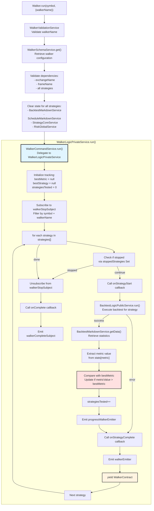
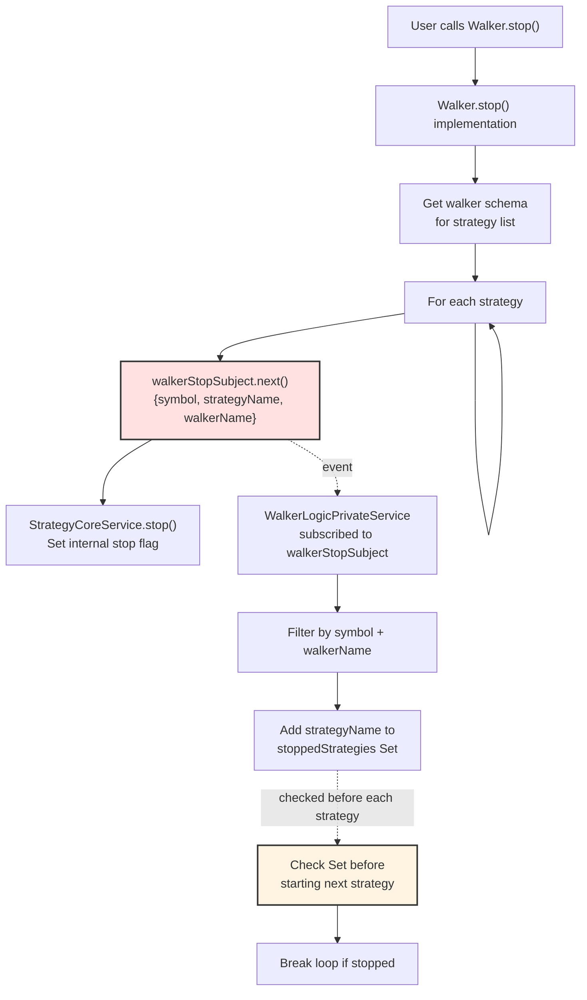

# Walker Mode

Walker Mode provides strategy comparison and A/B testing capabilities by executing multiple backtests sequentially and ranking strategies by a chosen metric. This execution mode automates the process of running the same backtest configuration across different strategies and identifying the best performer.

For general execution mode concepts, see [Execution Modes Overview](./04-execution-modes-overview.md). For individual backtest mechanics, see [Backtest Mode](./17-backtest-mode.md). For LLM-based strategy generation, see [Optimizer Mode](./20-optimizer-mode.md).

## Overview

Walker Mode executes backtests sequentially for a list of strategies, tracking the best-performing strategy in real-time. It yields progress updates after each strategy completes, allowing consumers to monitor comparison progress or terminate early.

### Key Components

| Component | Location | Purpose |
|-----------|----------|---------|
| `WalkerUtils` | [src/classes/Walker.ts:418-660]() | Singleton utility class with validation |
| `WalkerInstance` | [src/classes/Walker.ts:71-397]() | Per-symbol-walker instance with state management |
| `WalkerLogicPrivateService` | [src/lib/services/logic/private/WalkerLogicPrivateService.ts:29-260]() | Core sequential execution and metric comparison |
| `BacktestLogicPublicService` | [src/lib/services/logic/public/BacktestLogicPublicService.ts]() | Delegates to individual backtests |
| `BacktestMarkdownService` | [src/lib/services/markdown/BacktestMarkdownService.ts]() | Retrieves strategy statistics |
| `WalkerMarkdownService` | [src/lib/services/markdown/WalkerMarkdownService.ts]() | Aggregates comparison results |

## Walker Schema Configuration

Walker Mode requires registration via `addWalker()` with an `IWalkerSchema` configuration:

```typescript
interface IWalkerSchema {
  walkerName: WalkerName;
  strategies: StrategyName[];
  metric: WalkerMetric;
  exchangeName: ExchangeName;
  frameName: FrameName;
  note?: string;
  callbacks?: Partial<IWalkerCallbacks>;
}
```

### Available Metrics

The `metric` field determines which strategy statistic is used for comparison:

```typescript
type WalkerMetric = 
  | "sharpeRatio"
  | "winRate" 
  | "profitFactor"
  | "maxDrawdownPercent"
  | "totalPnlPercent"
  | "avgPnlPercent"
  | "totalTrades";
```

Higher values are always considered better. The walker selects the strategy with the maximum metric value.

### Lifecycle Callbacks

```typescript
interface IWalkerCallbacks {
  onStrategyStart: (strategyName: string, symbol: string) => void;
  onStrategyComplete: (strategyName: string, symbol: string, stats: BacktestStatistics, metricValue: number | null) => Promise<void> | void;
  onStrategyError: (strategyName: string, symbol: string, error: unknown) => void;
  onComplete: (results: IWalkerResults) => void;
}
```

Callbacks fire at key points during walker execution: before starting each strategy, after completing each strategy, on strategy errors, and when all strategies finish.

## Execution Flow

### High-Level Walker Execution



### Sequential Backtest Execution

```mermaid
graph LR
    subgraph "Strategy 1"
        S1_START["onStrategyStart"]
        S1_BT["Run Backtest"]
        S1_STATS["Get Statistics"]
        S1_COMPARE["Compare Metric"]
        S1_YIELD["Yield Progress"]
        S1_COMPLETE["onStrategyComplete"]
        
        S1_START --> S1_BT
        S1_BT --> S1_STATS
        S1_STATS --> S1_COMPARE
        S1_COMPARE --> S1_YIELD
        S1_YIELD --> S1_COMPLETE
    end
    
    subgraph "Strategy 2"
        S2_START["onStrategyStart"]
        S2_BT["Run Backtest"]
        S2_STATS["Get Statistics"]
        S2_COMPARE["Compare Metric"]
        S2_YIELD["Yield Progress"]
        S2_COMPLETE["onStrategyComplete"]
        
        S2_START --> S2_BT
        S2_BT --> S2_STATS
        S2_STATS --> S2_COMPARE
        S2_COMPARE --> S2_YIELD
        S2_YIELD --> S2_COMPLETE
    end
    
    subgraph "Strategy N"
        SN_START["onStrategyStart"]
        SN_BT["Run Backtest"]
        SN_STATS["Get Statistics"]
        SN_COMPARE["Compare Metric"]
        SN_YIELD["Yield Progress"]
        SN_COMPLETE["onStrategyComplete"]
        
        SN_START --> SN_BT
        SN_BT --> SN_STATS
        SN_STATS --> SN_COMPARE
        SN_COMPARE --> SN_YIELD
        SN_YIELD --> SN_COMPLETE
    end
    
    S1_COMPLETE --> S2_START
    S2_COMPLETE -.->|...| SN_START
    SN_COMPLETE --> FINAL["onComplete<br/>walkerCompleteSubject"]
```



Each strategy executes a complete backtest before the next strategy begins. Progress is yielded after each strategy completes, not during individual strategy execution.

## Strategy Comparison Logic

### Metric Extraction and Comparison

The walker retrieves statistics from `BacktestMarkdownService` for each completed strategy and extracts the configured metric value:

```typescript
// Get statistics from BacktestMarkdownService
const stats = await this.backtestMarkdownService.getData(symbol, strategyName);

// Extract metric value
const value = stats[metric];
const metricValue = 
  value !== null && 
  value !== undefined && 
  typeof value === "number" && 
  !isNaN(value) && 
  isFinite(value) 
    ? value 
    : null;

// Update best strategy if needed
const isBetter = 
  bestMetric === null || 
  (metricValue !== null && metricValue > bestMetric);

if (isBetter && metricValue !== null) {
  bestMetric = metricValue;
  bestStrategy = strategyName;
}
```

Invalid metric values (null, undefined, NaN, Infinity) are treated as `null` and never considered best. The comparison always uses `>` (greater than), so higher values win.

### WalkerContract Structure

After each strategy completes, the walker yields a `WalkerContract` with progress and current best:

| Field | Type | Description |
|-------|------|-------------|
| `walkerName` | `string` | Walker identifier |
| `exchangeName` | `string` | Exchange used for backtests |
| `frameName` | `string` | Frame used for backtests |
| `symbol` | `string` | Trading pair symbol |
| `strategyName` | `string` | Strategy just completed |
| `stats` | `BacktestStatistics` | Full statistics for completed strategy |
| `metricValue` | `number \| null` | Extracted metric value |
| `metric` | `WalkerMetric` | Metric being compared |
| `bestMetric` | `number \| null` | Best metric value so far |
| `bestStrategy` | `string \| null` | Best strategy name so far |
| `strategiesTested` | `number` | Number of strategies completed |
| `totalStrategies` | `number` | Total strategies to test |

### Final Results Structure

When all strategies complete, the walker emits `IWalkerResults`:

```typescript
interface IWalkerResults {
  walkerName: string;
  symbol: string;
  exchangeName: string;
  frameName: string;
  metric: WalkerMetric;
  totalStrategies: number;
  bestStrategy: string | null;
  bestMetric: number | null;
  bestStats: BacktestStatistics | null;
}
```

The `bestStats` field contains the full statistics object for the winning strategy, retrieved via `BacktestMarkdownService.getData()`.

## Event System

### Walker Event Emitters

```mermaid
graph TB
    subgraph "Event Producers"
        WALKER_LOGIC["WalkerLogicPrivateService"]
    end
    
    subgraph "Event Emitters"
        PROGRESS["progressWalkerEmitter<br/>ProgressWalkerContract<br/>After each strategy"]
        WALKER["walkerEmitter<br/>WalkerContract<br/>After each strategy"]
        COMPLETE["walkerCompleteSubject<br/>IWalkerResults<br/>When all strategies finish"]
        DONE["doneWalkerSubject<br/>DoneContract<br/>Background execution complete"]
        STOP["walkerStopSubject<br/>WalkerStopContract<br/>Bidirectional stop signals"]
    end
    
    subgraph "Event Consumers"
        LISTEN_PROGRESS["listenWalkerProgress()"]
        LISTEN_WALKER["listenWalker()"]
        LISTEN_WALKER_ONCE["listenWalkerOnce()"]
        LISTEN_COMPLETE["listenWalkerComplete()"]
        LISTEN_DONE["listenDoneWalker()"]
        LISTEN_DONE_ONCE["listenDoneWalkerOnce()"]
        MARKDOWN["WalkerMarkdownService"]
    end
    
    WALKER_LOGIC --> PROGRESS
    WALKER_LOGIC --> WALKER
    WALKER_LOGIC --> COMPLETE
    WALKER_LOGIC --> DONE
    
    PROGRESS --> LISTEN_PROGRESS
    WALKER --> LISTEN_WALKER
    WALKER --> LISTEN_WALKER_ONCE
    WALKER --> MARKDOWN
    COMPLETE --> LISTEN_COMPLETE
    DONE --> LISTEN_DONE
    DONE --> LISTEN_DONE_ONCE
    
    LISTEN_WALKER_ONCE -.->|user calls Walker.stop()| STOP
    STOP -.->|filtered by symbol+walkerName| WALKER_LOGIC
    
    style STOP fill:#ffe1e1,stroke:#333,stroke-width:2px
    style WALKER_LOGIC fill:#e1f5ff,stroke:#333,stroke-width:2px
```

### Progress Tracking

The `progressWalkerEmitter` emits after each strategy completes:

```typescript
interface ProgressWalkerContract {
  walkerName: string;
  exchangeName: string;
  frameName: string;
  symbol: string;
  totalStrategies: number;
  processedStrategies: number;
  progress: number; // 0.0 to 1.0
}
```

Progress is calculated as `processedStrategies / totalStrategies`.

## Stop Mechanism

### Multi-Walker Support

Walker Mode supports multiple walkers running on the same symbol simultaneously. The stop mechanism uses both `symbol` and `walkerName` to filter stop signals, preventing cross-walker interference:

```typescript
// Subscribe to stop signals filtered by symbol AND walkerName
const unsubscribe = walkerStopSubject
  .filter((data) => 
    data.symbol === symbol && 
    data.walkerName === context.walkerName
  )
  .connect((data) => {
    stoppedStrategies.add(data.strategyName);
  });
```

The `stoppedStrategies` Set accumulates stop signals for strategies in this walker instance only.

### Stop Propagation



When `Walker.stop()` is called, it:
1. Retrieves the walker schema to get the strategy list
2. Emits a stop signal for each strategy via `walkerStopSubject`
3. Sets the internal stop flag for each strategy via `StrategyCoreService.stop()`

The `WalkerLogicPrivateService` receives stop signals and accumulates them in a Set. Before starting each new strategy, it checks if that strategy is in the stopped Set and breaks the loop if true.

### Graceful Termination

Stop signals do not interrupt currently running backtests. The active strategy completes its backtest normally, then the walker checks the stopped Set before starting the next strategy and terminates gracefully.

## Results and Reporting

### Retrieving Results

The `Walker` class provides methods to access comparison results:

```typescript
// Get structured data
const results = await Walker.getData("BTCUSDT", "my-walker");
// Returns: IWalkerResults with bestStrategy, bestMetric, bestStats

// Get markdown report
const markdown = await Walker.getReport("BTCUSDT", "my-walker");
// Returns: Formatted markdown table with all strategies ranked

// Dump report to disk
await Walker.dump("BTCUSDT", "my-walker");
// Writes to: ./dump/walker/my-walker.md (default)
```

### WalkerMarkdownService

The `WalkerMarkdownService` aggregates walker progress events and generates comparison reports:

```typescript
// Internal structure maintained by WalkerMarkdownService
interface WalkerStatistics {
  walkerName: string;
  symbol: string;
  exchangeName: string;
  frameName: string;
  metric: WalkerMetric;
  strategies: IWalkerStrategyResult[];
  bestStrategy: string | null;
  bestMetric: number | null;
  bestStats: BacktestStatistics | null;
}

interface IWalkerStrategyResult {
  strategyName: string;
  stats: BacktestStatistics;
  metricValue: number | null;
}
```

The service subscribes to `walkerEmitter` and accumulates results for each strategy. When `getData()` or `getReport()` is called, it sorts strategies by metric value (descending) and generates a ranked comparison.

## Instance Management

### Memoized Instance Pattern

The `WalkerUtils` singleton uses memoization to create one `WalkerInstance` per `symbol:walkerName` combination:

```typescript
private _getInstance = memoize<
  (symbol: string, walkerName: WalkerName) => WalkerInstance
>(
  ([symbol, walkerName]) => `${symbol}:${walkerName}`,
  (symbol: string, walkerName: WalkerName) => 
    new WalkerInstance(symbol, walkerName)
);
```

Each instance maintains its own state:
- `_isStopped` flag for manual termination
- `_isDone` flag for completion tracking
- `task` wrapped in `singlerun()` to prevent concurrent execution

This allows multiple walkers to run on the same symbol simultaneously without interference.

### Status Tracking

The `Walker.list()` method returns status for all active walker instances:

```typescript
const statusList = await Walker.list();
// Returns array of:
// {
//   id: string,           // Random UUID
//   symbol: string,
//   walkerName: string,
//   status: "idle" | "running" | "done"
// }
```

The status is determined by the `singlerun` wrapper around the internal task function.

## Usage Example

### Complete Walker Setup and Execution

```typescript
import { 
  addWalker, 
  Walker, 
  listenWalker, 
  listenWalkerComplete 
} from "backtest-kit";

// Register walker configuration
addWalker({
  walkerName: "strategy-comparison",
  strategies: [
    "rsi-strategy",
    "macd-strategy", 
    "bollinger-strategy"
  ],
  metric: "sharpeRatio",
  exchangeName: "binance",
  frameName: "30d-backtest",
  callbacks: {
    onStrategyStart: (strategyName, symbol) => {
      console.log(`Testing ${strategyName} on ${symbol}...`);
    },
    onStrategyComplete: (strategyName, symbol, stats, metricValue) => {
      console.log(`${strategyName}: Sharpe Ratio = ${metricValue}`);
    },
    onComplete: (results) => {
      console.log(`Winner: ${results.bestStrategy}`);
      console.log(`Best Sharpe: ${results.bestMetric}`);
    }
  }
});

// Subscribe to progress events
listenWalker((progress) => {
  console.log(
    `Progress: ${progress.strategiesTested}/${progress.totalStrategies}`
  );
  console.log(`Current best: ${progress.bestStrategy}`);
});

// Subscribe to completion
listenWalkerComplete((results) => {
  console.log("Final results:", results);
});

// Run walker comparison
for await (const update of Walker.run("BTCUSDT", {
  walkerName: "strategy-comparison"
})) {
  console.log(`Completed: ${update.strategyName}`);
  console.log(`Metric: ${update.metricValue}`);
  console.log(`Best so far: ${update.bestStrategy} (${update.bestMetric})`);
}

// After completion, get results
const results = await Walker.getData("BTCUSDT", "strategy-comparison");
console.log("Best strategy:", results.bestStrategy);
console.log("Best stats:", results.bestStats);

// Generate report
await Walker.dump("BTCUSDT", "strategy-comparison");
```

### Background Execution with Cancellation

```typescript
import { Walker } from "backtest-kit";

// Start walker in background
const cancel = Walker.background("BTCUSDT", {
  walkerName: "strategy-comparison"
});

// Cancel after some condition
setTimeout(() => {
  cancel(); // Stops walker gracefully
}, 60000);
```

The `background()` method returns a cancellation closure that:
1. Stops all strategies via `StrategyCoreService.stop()`
2. Emits stop signals via `walkerStopSubject` for each strategy
3. Sets `_isStopped = true` on the instance
4. Emits completion via `doneWalkerSubject` if not already done

## State Cleanup

### Pre-Execution Cleanup

Before starting walker execution, the system clears state for all strategies to prevent data contamination:

```typescript
// Clear backtest/schedule markdown services
for (const strategyName of walkerSchema.strategies) {
  backtest.backtestMarkdownService.clear({ symbol, strategyName });
  backtest.scheduleMarkdownService.clear({ symbol, strategyName });
  
  // Clear strategy core service
  backtest.strategyCoreService.clear({ symbol, strategyName });
  
  // Clear risk state
  const { riskName, riskList } = backtest.strategySchemaService.get(strategyName);
  riskName && backtest.riskGlobalService.clear(riskName);
  riskList && riskList.forEach((riskName) => 
    backtest.riskGlobalService.clear(riskName)
  );
}
```

This ensures each strategy backtest starts from a clean state, preventing cross-contamination between sequential backtests.

### Walker Markdown Cleanup

The walker markdown service is also cleared before execution:

```typescript
backtest.walkerMarkdownService.clear(context.walkerName);
```

This removes any previous walker results for the same walker name, ensuring a fresh comparison.

