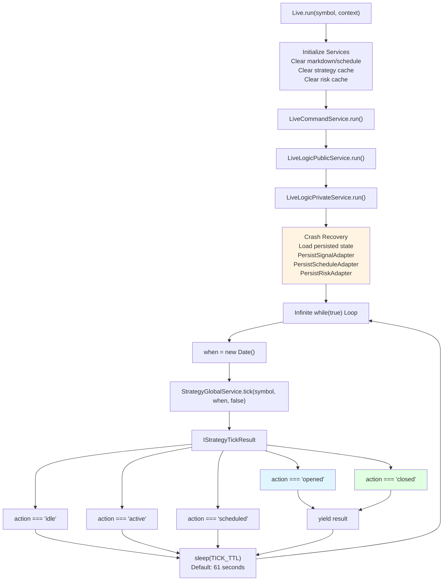
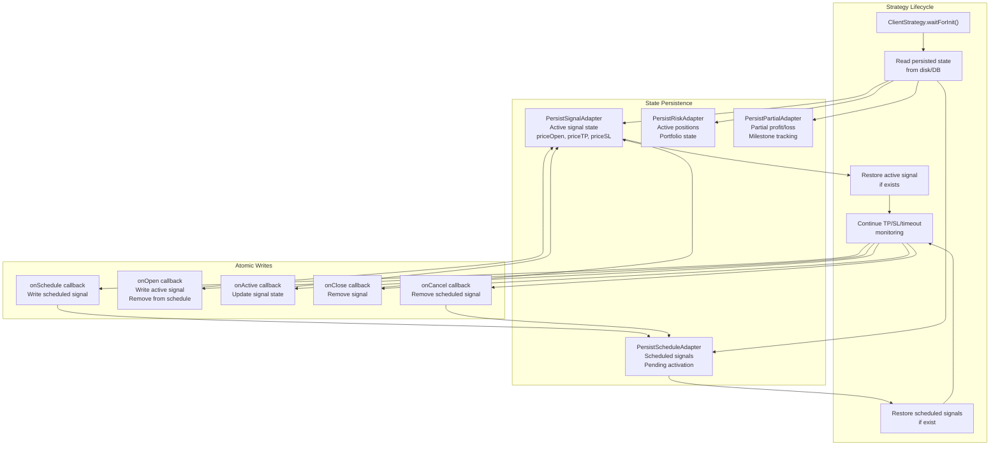

# Live Trading API

<details>
<summary>Relevant source files</summary>

The following files were used as context for generating this wiki page:

- [docs/classes/BacktestUtils.md](docs/classes/BacktestUtils.md)
- [docs/classes/LiveUtils.md](docs/classes/LiveUtils.md)
- [docs/classes/StrategyConnectionService.md](docs/classes/StrategyConnectionService.md)
- [docs/classes/WalkerUtils.md](docs/classes/WalkerUtils.md)
- [docs/index.md](docs/index.md)
- [docs/interfaces/IStrategySchema.md](docs/interfaces/IStrategySchema.md)
- [docs/interfaces/WalkerStopContract.md](docs/interfaces/WalkerStopContract.md)
- [docs/types/IStrategyBacktestResult.md](docs/types/IStrategyBacktestResult.md)
- [docs/types/TPersistBaseCtor.md](docs/types/TPersistBaseCtor.md)
- [src/classes/Backtest.ts](src/classes/Backtest.ts)
- [src/classes/Live.ts](src/classes/Live.ts)
- [src/classes/Walker.ts](src/classes/Walker.ts)
- [src/lib/services/connection/StrategyConnectionService.ts](src/lib/services/connection/StrategyConnectionService.ts)

</details>


This page documents the `Live` utility class and its methods for executing real-time trading operations. The Live Trading API provides an infinite async generator that continuously monitors market conditions and executes strategy signals in real-time, with built-in crash recovery capabilities through state persistence. For historical simulation, see [Backtest API](#4.3). For strategy comparison, see [Walker API](#4.5). For event monitoring, see [Event Listeners](#4.8).

## LiveUtils Class

The `Live` object is a singleton instance of `LiveUtils` that provides five primary methods for live trading operations. Unlike backtesting which iterates through predefined timeframes, live trading runs an infinite loop with real-time timestamps and persists state for crash recovery.

**Sources:** [src/classes/Live.ts:1-246]()

### Method Overview

| Method | Return Type | Purpose |
|--------|-------------|---------|
| `run(symbol, context)` | `AsyncGenerator<IStrategyTickResultOpened \| IStrategyTickResultClosed>` | Yields opened and closed signals in real-time |
| `background(symbol, context)` | `() => void` (cancellation closure) | Runs live trading silently for side effects only |
| `getData(symbol, strategyName)` | `Promise<LiveStatistics>` | Retrieves accumulated statistics from all live events |
| `getReport(symbol, strategyName)` | `Promise<string>` | Generates markdown report with performance metrics |
| `dump(strategyName, path?)` | `Promise<void>` | Saves markdown report to disk |

**Sources:** [src/classes/Live.ts:44-228](), [docs/classes/LiveUtils.md:1-72]()

## Live Execution Model



Live trading executes an infinite polling loop where each iteration calls `tick()` with the current timestamp. The loop sleeps for `TICK_TTL` (61 seconds by default) between iterations to prevent excessive API calls. Only `opened` and `closed` signals are yielded to the consumer; `idle`, `active`, and `scheduled` states trigger sleep without yielding.

**Sources:** [src/classes/Live.ts:55-84](), [src/lib/services/connection/StrategyConnectionService.ts:119-147]()

## API Reference

### Live.run()

Executes live trading with real-time signal streaming. Returns an infinite async generator that yields `IStrategyTickResultOpened` when positions open and `IStrategyTickResultClosed` when positions close with PNL data.

```typescript
Live.run(
  symbol: string,
  context: {
    strategyName: string;
    exchangeName: string;
  }
): AsyncGenerator<IStrategyTickResultOpened | IStrategyTickResultClosed>
```

**Parameters:**
- `symbol` - Trading pair symbol (e.g., `"BTCUSDT"`)
- `context.strategyName` - Registered strategy name from `addStrategy()`
- `context.exchangeName` - Registered exchange name from `addExchange()`

**Key Behaviors:**
- Clears `LiveMarkdownService` and `ScheduleMarkdownService` for the symbol-strategy pair on start [src/classes/Live.ts:68-70]()
- Clears `StrategyGlobalService` cache to force re-initialization [src/classes/Live.ts:73-74]()
- Clears associated `RiskGlobalService` cache if risk profile exists [src/classes/Live.ts:76-81]()
- Never completes naturally (infinite generator) - must be interrupted externally
- Process can crash and restart; state is recovered from persistence layer

**Sources:** [src/classes/Live.ts:55-84](), [docs/classes/LiveUtils.md:26-36]()

### Live.background()

Runs live trading silently without yielding results. Consumes all signals internally for side effects only (callbacks, persistence, logging). Returns a cancellation closure that can be called to gracefully stop execution after the current position closes.

```typescript
Live.background(
  symbol: string,
  context: {
    strategyName: string;
    exchangeName: string;
  }
): () => void
```

**Cancellation Behavior:**
- Calls `StrategyGlobalService.stop()` to prevent new signals [src/classes/Live.ts:140]()
- Checks for pending signal before emitting `doneLiveSubject` [src/classes/Live.ts:141-156]()
- If pending signal exists, waits for position to close naturally
- Emits `doneLiveSubject` with context metadata when complete [src/classes/Live.ts:127-133]()

**Error Handling:**
- Catches errors and emits to `exitEmitter` for fatal error handling [src/classes/Live.ts:136-138]()

**Sources:** [src/classes/Live.ts:107-159](), [docs/classes/LiveUtils.md:37-48]()

### Live.getData()

Retrieves aggregated statistics from all live trading events for a symbol-strategy pair. Returns data accumulated by `LiveMarkdownService` including Sharpe ratio, win rate, PNL, and other performance metrics.

```typescript
Live.getData(
  symbol: string,
  strategyName: StrategyName
): Promise<LiveStatistics>
```

**Returns:** `LiveStatistics` object containing:
- Performance metrics (Sharpe ratio, win rate, certainty ratio)
- PNL statistics (total PNL, average PNL, percentage)
- Trade counts (total trades, winning/losing trades)
- Risk metrics (max drawdown, volatility)

**Sources:** [src/classes/Live.ts:174-180]()

### Live.getReport()

Generates markdown-formatted report with all live trading events, statistics, and signal details for a symbol-strategy pair.

```typescript
Live.getReport(
  symbol: string,
  strategyName: StrategyName
): Promise<string>
```

**Returns:** Markdown string containing:
- Summary statistics table
- Chronological list of all signals with timestamps
- PNL breakdown per trade
- Performance analysis

**Sources:** [src/classes/Live.ts:195-201]()

### Live.dump()

Saves markdown report to disk at specified path. Defaults to `./dump/live/{strategyName}.md` if path not provided.

```typescript
Live.dump(
  strategyName: StrategyName,
  path?: string
): Promise<void>
```

**Parameters:**
- `strategyName` - Strategy name (used as filename)
- `path` - Optional directory path (default: `"./dump/live"`)

**Sources:** [src/classes/Live.ts:218-227]()

## Crash Recovery Architecture



Live trading persists critical state at each lifecycle transition to enable crash recovery. When the process restarts, `ClientStrategy.waitForInit()` blocks until persisted state is loaded from disk. If an active signal exists, monitoring of TP/SL/timeout conditions resumes seamlessly.

**Persistence Points:**
1. **Scheduled signals** - Written when `priceOpen ≠ currentPrice`, enabling recovery of pending limit orders
2. **Active signals** - Written when position opens, updated on each tick with unrealized PNL
3. **Risk state** - Tracks active positions for portfolio-level constraints
4. **Partial milestones** - Records 10%/20%/30% profit/loss thresholds for analytics

**Atomic Operations:**
Each persistence adapter implements `IPersistBase` interface with atomic `writeValue()` operations, ensuring consistency during crashes. Default implementation uses file-based storage with JSON serialization.

**Sources:** [src/classes/Live.ts:49](), [src/lib/services/connection/StrategyConnectionService.ts:96](), [src/lib/services/connection/StrategyConnectionService.ts:135]()

## Comparison with Backtest API

| Aspect | Live Trading | Backtesting |
|--------|-------------|-------------|
| **Execution Model** | Infinite `while(true)` loop | Finite iteration through timeframes |
| **Time Progression** | Real-time `new Date()` | Historical date array |
| **Completion** | Never completes naturally | Completes when last timeframe processed |
| **Context Parameters** | `strategyName`, `exchangeName` | `strategyName`, `exchangeName`, `frameName` |
| **Signal Evaluation** | `tick()` with current timestamp | `backtest()` with candle array |
| **State Persistence** | Required for crash recovery | Not used (deterministic replay) |
| **Sleep Interval** | `TICK_TTL` (61 seconds) between ticks | No sleep (fast-forward through history) |
| **Signal Yielding** | Only `opened` and `closed` | Only `closed` |
| **Service Initialization** | `waitForInit()` loads persisted state | No initialization delay |
| **Signal Emitters** | `signalLiveEmitter`, `signalEmitter` | `signalBacktestEmitter`, `signalEmitter` |
| **Completion Event** | `doneLiveSubject` | `doneBacktestSubject` |

**Sources:** [src/classes/Live.ts:1-246](), [src/classes/Backtest.ts:1-232]()

## Service Delegation Chain

```mermaid
flowchart LR
    LiveUtils["Live.run()<br/>LiveUtils"]
    LiveCmd["LiveCommandService.run()<br/>Validation + Routing"]
    LivePub["LiveLogicPublicService.run()<br/>Context Injection"]
    LivePriv["LiveLogicPrivateService.run()<br/>Infinite Loop Implementation"]
    StratGlobal["StrategyGlobalService.tick()<br/>ExecutionContext Wrapper"]
    StratConn["StrategyConnectionService.tick()<br/>Memoized Instance Routing"]
    ClientStrat["ClientStrategy.tick()<br/>Signal State Machine"]
    
    LiveUtils --> LiveCmd
    LiveCmd --> LivePub
    LivePub --> LivePriv
    LivePriv --> StratGlobal
    StratGlobal --> StratConn
    StratConn --> ClientStrat
    
    Emit["signalLiveEmitter<br/>signalEmitter<br/>doneLiveSubject"]
    
    ClientStrat -.->|emits| Emit
```



The Live API follows a multi-tier service architecture where each layer adds specific functionality:

1. **LiveUtils** - User-facing API with logging and cache clearing [src/classes/Live.ts:44-228]()
2. **LiveCommandService** - Validation layer ensuring components exist [docs/classes/LiveCommandService.md:1-66]()
3. **LiveLogicPublicService** - Context injection for MethodContextService
4. **LiveLogicPrivateService** - Infinite loop implementation with `while(true)` and `sleep(TICK_TTL)`
5. **StrategyGlobalService** - ExecutionContext injection (symbol, when, backtest flag) [src/lib/services/global/StrategyGlobalService.ts:104-126]()
6. **StrategyConnectionService** - Memoized strategy instance routing by `symbol:strategyName` [src/lib/services/connection/StrategyConnectionService.ts:78-98]()
7. **ClientStrategy** - Signal state machine with tick() implementation

**Sources:** [src/classes/Live.ts:55-84](), [src/lib/services/global/StrategyGlobalService.ts:104-126](), [src/lib/services/connection/StrategyConnectionService.ts:129-147]()

## Usage Examples

### Basic Live Trading Loop

```typescript
import { Live } from "backtest-kit";

// Infinite generator - use Ctrl+C to stop
for await (const result of Live.run("BTCUSDT", {
  strategyName: "my-strategy",
  exchangeName: "binance"
})) {
  if (result.action === "opened") {
    console.log("Position opened:", result.signal);
  } else if (result.action === "closed") {
    console.log("Position closed:", result.pnl.pnlPercentage);
  }
}
```

### Background Execution with Cancellation

```typescript
import { Live } from "backtest-kit";

// Run in background, get cancellation closure
const cancel = Live.background("BTCUSDT", {
  strategyName: "my-strategy",
  exchangeName: "binance"
});

// Later: gracefully stop after current position closes
setTimeout(() => {
  cancel();
  console.log("Shutdown requested");
}, 60000 * 60); // 1 hour
```

### Report Generation

```typescript
import { Live } from "backtest-kit";

// Get statistics object
const stats = await Live.getData("BTCUSDT", "my-strategy");
console.log("Sharpe Ratio:", stats.sharpeRatio);
console.log("Win Rate:", stats.winRate);

// Get markdown report
const markdown = await Live.getReport("BTCUSDT", "my-strategy");
console.log(markdown);

// Save to disk
await Live.dump("my-strategy", "./reports");
```

**Sources:** [src/classes/Live.ts:26-42](), [src/classes/Live.ts:98-105](), [docs/classes/LiveUtils.md:1-72]()

## Context Propagation

Live trading uses two context services to propagate parameters implicitly through the call stack:

**MethodContextService:**
- Stores: `strategyName`, `exchangeName`
- Set by: `LiveLogicPublicService` when delegating to `LiveLogicPrivateService`
- Accessed by: `StrategyGlobalService.tick()` to determine which strategy to execute

**ExecutionContextService:**
- Stores: `symbol`, `when` (timestamp), `backtest` (false for live)
- Set by: `StrategyGlobalService.tick()` using `ExecutionContextService.runInContext()`
- Accessed by: `ClientStrategy` to get current symbol and timestamp for signal evaluation

This architecture eliminates the need to pass these parameters through every function call in the service chain.

**Sources:** [src/lib/services/global/StrategyGlobalService.ts:114-126](), [src/lib/services/connection/StrategyConnectionService.ts:52-65]()