# Walker API


This page documents the Walker API for multi-strategy comparison. Walker orchestrates multiple backtest runs across different strategies and ranks them by performance metrics.

For information about running individual backtests, see [Backtest API](./17_Backtest_API.md). For information about walker schemas and registration, see [Walker Schemas](./29_Walker_Schemas.md).

---

## Overview

The Walker API provides functionality to compare multiple trading strategies in parallel by running backtests for each strategy and ranking them by a selected metric (e.g., Sharpe Ratio, win rate, total PNL). Walker is implemented as a singleton utility class that wraps `WalkerGlobalService` with simplified method signatures.

**Key Capabilities:**
- Run multiple strategy backtests sequentially for comparison
- Rank strategies by configurable metrics (sharpeRatio, winRate, avgPnl, totalPnl, certaintyRatio)
- Emit progress events after each strategy completes
- Generate comparison reports with performance metrics for all strategies
- Support both manual iteration and background execution modes

Sources: [src/classes/Walker.ts:1-274](), [README.md:405-459]()

---

## Walker Class Methods

The `Walker` singleton provides five main methods for strategy comparison operations.

### Walker.run()

Runs walker comparison for a symbol with async generator iteration. Yields progress updates after each strategy completes.

**Signature:**
```typescript
Walker.run(
  symbol: string,
  context: {
    walkerName: string;
  }
): AsyncGenerator<WalkerContract>
```

**Parameters:**
- `symbol` - Trading pair symbol (e.g., "BTCUSDT")
- `context.walkerName` - Walker schema name registered via `addWalker()`

**Returns:** Async generator yielding progress updates after each strategy completion

**Behavior:**
1. Validates walker schema exists
2. Validates exchange and frame schemas exist
3. Validates all strategy schemas in walker.strategies array
4. Clears previous walker markdown data
5. Clears backtest data for all strategies
6. Delegates to `WalkerGlobalService.run()` which calls `WalkerLogicPublicService.run()`

**Progress Event Structure:**
```typescript
interface WalkerContract {
  strategiesTested: number;
  totalStrategies: number;
  bestStrategy: string;
  bestMetric: number;
  strategyName: string;
  metricValue: number;
}
```

Sources: [src/classes/Walker.ts:39-87]()

---

### Walker.background()

Runs walker comparison in background without yielding results. Consumes all progress updates internally. Returns cancellation function.

**Signature:**
```typescript
Walker.background(
  symbol: string,
  context: {
    walkerName: string;
  }
): () => void
```

**Parameters:**
- `symbol` - Trading pair symbol (e.g., "BTCUSDT")
- `context.walkerName` - Walker schema name

**Returns:** Cancellation function that stops all strategy backtests

**Behavior:**
1. Runs walker comparison using `Walker.run()`
2. Consumes all progress events internally
3. Emits to `doneWalkerSubject` when all strategies complete
4. Catches and emits errors to `errorEmitter`
5. Returns closure that stops all running strategies when called

Sources: [src/classes/Walker.ts:108-144]()

---

### Walker.getData()

Gets walker results data with all strategy comparison metrics.

**Signature:**
```typescript
Walker.getData(
  symbol: string,
  walkerName: WalkerName
): Promise<IWalkerResults>
```

**Parameters:**
- `symbol` - Trading symbol used in comparison
- `walkerName` - Walker schema name

**Returns:** Promise resolving to walker results data structure

**Result Structure:**
```typescript
interface IWalkerResults {
  bestStrategy: string;
  bestMetric: number;
  strategies: Array<{
    strategyName: string;
    stats: BacktestStatistics;
    metric: number;
  }>;
}
```

**Behavior:**
1. Retrieves walker schema to get configured metric
2. Delegates to `WalkerMarkdownService.getData()` with symbol, walkerName, metric, and context
3. Returns aggregated results with all strategies sorted by metric

Sources: [src/classes/Walker.ts:159-179]()

---

### Walker.getReport()

Generates markdown report with all strategy comparisons.

**Signature:**
```typescript
Walker.getReport(
  symbol: string,
  walkerName: WalkerName
): Promise<string>
```

**Parameters:**
- `symbol` - Trading symbol
- `walkerName` - Walker schema name

**Returns:** Promise resolving to markdown formatted report string

**Report Format:**
- Title with walker name and symbol
- Summary with best strategy and metric value
- Comparison table with all strategies and their metrics
- Individual strategy statistics (win rate, PNL, Sharpe Ratio, etc.)

Sources: [src/classes/Walker.ts:194-214]()

---

### Walker.dump()

Saves walker report to disk as markdown file.

**Signature:**
```typescript
Walker.dump(
  symbol: string,
  walkerName: WalkerName,
  path?: string
): Promise<void>
```

**Parameters:**
- `symbol` - Trading symbol
- `walkerName` - Walker schema name
- `path` - Optional directory path (default: "./logs/walker")

**Behavior:**
1. Generates markdown report via `Walker.getReport()`
2. Creates directory if it doesn't exist
3. Writes report to `{path}/{walkerName}.md`
4. Logs success message or error

Sources: [src/classes/Walker.ts:232-255]()

---

## Walker Execution Flow

The following diagram shows how Walker orchestrates multiple backtest runs and aggregates results.



**Key Points:**
- Walker validates all schemas before starting (walker, exchange, frame, all strategies)
- Clears previous data for walker and all strategies to ensure fresh comparison
- Uses `MethodContextService.runAsyncIterator` for context propagation
- Runs backtests sequentially, not in parallel
- Tracks best strategy as it progresses through the list
- Yields progress after each strategy completes

Sources: [src/classes/Walker.ts:39-87](), [src/lib/services/global/WalkerGlobalService.ts:52-86]()

---

## Event Listeners

Walker provides specialized event listeners for monitoring comparison progress and completion.

### listenWalker()

Subscribes to walker progress events with queued async processing. Emits after each strategy completes.

**Signature:**
```typescript
listenWalker(fn: (event: WalkerContract) => void): () => void
```

**Event Structure:**
```typescript
interface WalkerContract {
  strategiesTested: number;
  totalStrategies: number;
  bestStrategy: string;
  bestMetric: number;
  strategyName: string;
  metricValue: number;
}
```

**Returns:** Unsubscribe function

Sources: [src/function/event.ts:537-536]()

---

### listenWalkerOnce()

Subscribes to filtered walker progress events with one-time execution. Useful for waiting for specific conditions.

**Signature:**
```typescript
listenWalkerOnce(
  filterFn: (event: WalkerContract) => boolean,
  fn: (event: WalkerContract) => void
): () => void
```

**Parameters:**
- `filterFn` - Predicate to filter which events trigger the callback
- `fn` - Callback function (called only once when filter matches)

**Returns:** Unsubscribe function to cancel before it fires

Sources: [src/function/event.ts:552-569]()

---

### listenWalkerComplete()

Subscribes to walker completion events with final results. Emits when all strategies have been tested.

**Signature:**
```typescript
listenWalkerComplete(fn: (results: IWalkerResults) => void): () => void
```

**Event Structure:**
```typescript
interface IWalkerResults {
  bestStrategy: string;
  bestMetric: number;
  strategies: Array<{
    strategyName: string;
    stats: BacktestStatistics;
    metric: number;
  }>;
}
```

**Returns:** Unsubscribe function

Sources: [src/function/event.ts:584-601]()

---

### listenDoneWalker()

Subscribes to walker background execution completion events. Emits when `Walker.background()` completes.

**Signature:**
```typescript
listenDoneWalker(fn: (event: DoneContract) => void): () => void
```

**Event Structure:**
```typescript
interface DoneContract {
  exchangeName: string;
  strategyName: string;  // Actually walkerName
  backtest: boolean;     // Always true for walker
  symbol: string;
}
```

**Returns:** Unsubscribe function

Sources: [src/function/event.ts:397-400]()

---

### listenDoneWalkerOnce()

Subscribes to filtered walker background completion events with one-time execution.

**Signature:**
```typescript
listenDoneWalkerOnce(
  filterFn: (event: DoneContract) => boolean,
  fn: (event: DoneContract) => void
): () => void
```

**Parameters:**
- `filterFn` - Predicate to filter events
- `fn` - Callback function (called only once)

**Returns:** Unsubscribe function

Sources: [src/function/event.ts:427-433]()

---

## Walker Event Flow

The following diagram shows the event emission sequence during walker execution.


**Event Timing:**
1. `walkerEmitter` - Emits after each strategy completes (N times for N strategies)
2. `walkerCompleteSubject` - Emits once when all strategies complete
3. `doneWalkerSubject` - Emits only for `Walker.background()` after completion

Sources: [src/config/emitters.ts:64-73](), [src/classes/Walker.ts:108-144]()

---

## Usage Examples

### Basic Walker Usage with Progress Tracking

```typescript
import { addWalker, Walker, listenWalker } from "backtest-kit";

// Register walker schema
addWalker({
  walkerName: "btc-walker",
  exchangeName: "binance",
  frameName: "1d-backtest",
  strategies: ["strategy-a", "strategy-b", "strategy-c"],
  metric: "sharpeRatio",
  callbacks: {
    onStrategyStart: (strategyName, symbol) => {
      console.log(`Starting: ${strategyName}`);
    },
    onStrategyComplete: (strategyName, symbol, stats) => {
      console.log(`Completed: ${strategyName} - Sharpe: ${stats.sharpeRatio}`);
    },
    onComplete: (results) => {
      console.log(`Best: ${results.bestStrategy}`);
    },
  },
});

// Listen to progress
listenWalker((event) => {
  console.log(`Progress: ${event.strategiesTested}/${event.totalStrategies}`);
  console.log(`Best so far: ${event.bestStrategy} (${event.bestMetric})`);
  console.log(`Current: ${event.strategyName} (${event.metricValue})`);
});

// Run walker
for await (const progress of Walker.run("BTCUSDT", {
  walkerName: "btc-walker"
})) {
  // Progress available here too
  console.log(`Tested ${progress.strategiesTested} strategies`);
}

// Get final results
const results = await Walker.getData("BTCUSDT", "btc-walker");
console.log("Best strategy:", results.bestStrategy);
console.log("Best metric:", results.bestMetric);

// Generate report
const markdown = await Walker.getReport("BTCUSDT", "btc-walker");
console.log(markdown);

// Save to disk
await Walker.dump("BTCUSDT", "btc-walker"); // ./logs/walker/btc-walker.md
```

Sources: [README.md:407-459](), [src/classes/Walker.ts:39-87]()

---

### Background Walker Execution

```typescript
import { Walker, listenWalkerComplete, listenDoneWalker } from "backtest-kit";

// Listen to completion
listenWalkerComplete((results) => {
  console.log("Walker completed!");
  console.log("Best strategy:", results.bestStrategy);
  console.log("Best metric:", results.bestMetric);
  
  // Access all strategy results
  results.strategies.forEach(({ strategyName, stats, metric }) => {
    console.log(`${strategyName}: ${metric}`);
  });
});

// Listen to background task done
listenDoneWalker((event) => {
  console.log("Background walker done:", event.strategyName);
  
  // Auto-save report
  Walker.dump(event.symbol, event.strategyName);
});

// Run in background
const cancel = Walker.background("BTCUSDT", {
  walkerName: "btc-walker"
});

// Later: cancel if needed
// cancel();
```

Sources: [src/classes/Walker.ts:108-144](), [src/function/event.ts:584-601]()

---

### Comparing Strategies by Different Metrics

```typescript
import { addWalker, Walker } from "backtest-kit";

// Walker comparing by Sharpe Ratio (risk-adjusted returns)
addWalker({
  walkerName: "walker-sharpe",
  exchangeName: "binance",
  frameName: "1d-backtest",
  strategies: ["strategy-a", "strategy-b", "strategy-c"],
  metric: "sharpeRatio", // Default, best for risk-adjusted comparison
});

// Walker comparing by win rate
addWalker({
  walkerName: "walker-winrate",
  exchangeName: "binance",
  frameName: "1d-backtest",
  strategies: ["strategy-a", "strategy-b", "strategy-c"],
  metric: "winRate", // Best for consistency
});

// Walker comparing by total PNL
addWalker({
  walkerName: "walker-totalpnl",
  exchangeName: "binance",
  frameName: "1d-backtest",
  strategies: ["strategy-a", "strategy-b", "strategy-c"],
  metric: "totalPnl", // Best for absolute returns
});

// Walker comparing by certainty ratio (avgWin / |avgLoss|)
addWalker({
  walkerName: "walker-certainty",
  exchangeName: "binance",
  frameName: "1d-backtest",
  strategies: ["strategy-a", "strategy-b", "strategy-c"],
  metric: "certaintyRatio", // Best for risk/reward profile
});

// Run each walker
for await (const _ of Walker.run("BTCUSDT", { walkerName: "walker-sharpe" })) {}
for await (const _ of Walker.run("BTCUSDT", { walkerName: "walker-winrate" })) {}
for await (const _ of Walker.run("BTCUSDT", { walkerName: "walker-totalpnl" })) {}
for await (const _ of Walker.run("BTCUSDT", { walkerName: "walker-certainty" })) {}

// Compare results
const sharpeBest = await Walker.getData("BTCUSDT", "walker-sharpe");
const winrateBest = await Walker.getData("BTCUSDT", "walker-winrate");
const pnlBest = await Walker.getData("BTCUSDT", "walker-totalpnl");
const certaintyBest = await Walker.getData("BTCUSDT", "walker-certainty");

console.log("Best by Sharpe:", sharpeBest.bestStrategy);
console.log("Best by Win Rate:", winrateBest.bestStrategy);
console.log("Best by Total PNL:", pnlBest.bestStrategy);
console.log("Best by Certainty:", certaintyBest.bestStrategy);
```

Sources: [README.md:461-467]()

---

### Cancelling Walker Execution

```typescript
import { Walker, listenWalker } from "backtest-kit";

let strategiesTested = 0;

listenWalker((event) => {
  strategiesTested = event.strategiesTested;
});

// Run walker in background
const cancel = Walker.background("BTCUSDT", {
  walkerName: "btc-walker"
});

// Cancel after 10 seconds (or based on some condition)
setTimeout(() => {
  cancel();
  console.log(`Cancelled after testing ${strategiesTested} strategies`);
}, 10000);

// Or cancel based on condition
listenWalkerOnce(
  (event) => event.strategiesTested >= 5,
  (event) => {
    cancel();
    console.log("Cancelled after 5 strategies");
  }
);
```

Sources: [src/classes/Walker.ts:138-143]()

---

## Walker Data Structure

### IWalkerResults

The data structure returned by `Walker.getData()` and emitted by `walkerCompleteSubject`.

```typescript
interface IWalkerResults {
  /** Name of the best performing strategy */
  bestStrategy: string;
  
  /** Metric value for the best strategy */
  bestMetric: number;
  
  /** Array of all tested strategies with their results */
  strategies: Array<{
    /** Strategy name */
    strategyName: string;
    
    /** Complete backtest statistics for this strategy */
    stats: BacktestStatistics;
    
    /** Extracted metric value used for comparison */
    metric: number;
  }>;
}
```

**BacktestStatistics Structure:**
```typescript
interface BacktestStatistics {
  signalList: IStrategyTickResultClosed[];
  totalSignals: number;
  winCount: number;
  lossCount: number;
  winRate: number | null;
  avgPnl: number | null;
  totalPnl: number | null;
  stdDev: number | null;
  sharpeRatio: number | null;
  annualizedSharpeRatio: number | null;
  certaintyRatio: number | null;
  expectedYearlyReturns: number | null;
}
```

**Available Metrics for Comparison:**
- `sharpeRatio` - Risk-adjusted return (avgPnl / stdDev)
- `winRate` - Win percentage (0-100)
- `avgPnl` - Average PNL percentage per trade
- `totalPnl` - Cumulative PNL percentage
- `certaintyRatio` - avgWin / |avgLoss|

Sources: [src/lib/services/markdown/BacktestMarkdownService.ts:46-102]()

---

## Integration with Services

The following diagram shows how Walker integrates with the service layer.


**Service Responsibilities:**
- `WalkerGlobalService` - Validation orchestration and delegation
- `WalkerLogicPublicService` - Context wrapper (MethodContext)
- `WalkerLogicPrivateService` - Core loop through strategies array
- `BacktestLogicPrivateService` - Run each strategy's backtest
- `BacktestMarkdownService` - Collect results per strategy
- `WalkerMarkdownService` - Aggregate results and compute best strategy

Sources: [src/classes/Walker.ts:1-274](), [src/lib/services/global/WalkerGlobalService.ts:1-90]()

---

## Comparison: Walker vs Multiple Backtest Calls

| Aspect | Walker.run() | Multiple Backtest.run() |
|--------|--------------|-------------------------|
| **Orchestration** | Automatic sequential execution | Manual iteration required |
| **Progress Tracking** | Built-in progress events | Must implement manually |
| **Best Strategy Selection** | Automatic based on metric | Must compare manually |
| **Report Generation** | Unified comparison report | Individual reports only |
| **Context Propagation** | Single walker context | Separate context per strategy |
| **Data Clearing** | Automatic clear before run | Must clear manually |
| **Metric Extraction** | Automatic based on metric config | Must extract manually |
| **Event Emission** | Walker-specific events | Backtest-specific events |

**When to Use Walker:**
- Comparing multiple strategies on the same timeframe
- Need automatic ranking by performance metric
- Want unified comparison report
- Need progress tracking for UI/logging

**When to Use Individual Backtests:**
- Testing single strategy
- Need fine-grained control over execution
- Different timeframes per strategy
- Custom comparison logic required

Sources: [src/classes/Walker.ts:39-87](), [src/classes/Backtest.ts:38-66]()

---

## Error Handling

Walker validates all schemas before starting execution. If any validation fails, an error is thrown immediately.

**Validation Checks:**
1. Walker schema exists (`walkerValidationService.validate`)
2. Exchange schema exists (`exchangeValidationService.validate`)
3. Frame schema exists (`frameValidationService.validate`)
4. All strategy schemas exist (`strategyValidationService.validate`)
5. Risk schemas exist for strategies that specify them (`riskValidationService.validate`)

**Background Execution Errors:**
Errors in `Walker.background()` are caught and emitted to `errorEmitter` instead of throwing. Use `listenError()` to handle them.

```typescript
import { Walker, listenError } from "backtest-kit";

listenError((error) => {
  console.error("Walker error:", error.message);
  // Handle error (log, alert, retry, etc.)
});

Walker.background("BTCUSDT", {
  walkerName: "btc-walker"
});
```

Sources: [src/classes/Walker.ts:50-59](), [src/classes/Walker.ts:130-137]()

---

## Walker State Management

Walker clears accumulated data before each run to ensure fresh comparison:

```typescript
// From Walker.run()
backtest.walkerMarkdownService.clear(context.walkerName);

// Clear backtest data for all strategies
for (const strategyName of walkerSchema.strategies) {
  backtest.backtestMarkdownService.clear(strategyName);
  backtest.scheduleMarkdownService.clear(strategyName);
  backtest.strategyGlobalService.clear(strategyName);
  
  const { riskName } = backtest.strategySchemaService.get(strategyName);
  riskName && backtest.riskGlobalService.clear(riskName);
}
```

This ensures:
- No stale data from previous walker runs
- No cross-contamination between strategies
- Fresh risk tracking for each strategy
- Accurate comparison metrics

Sources: [src/classes/Walker.ts:61-79]()