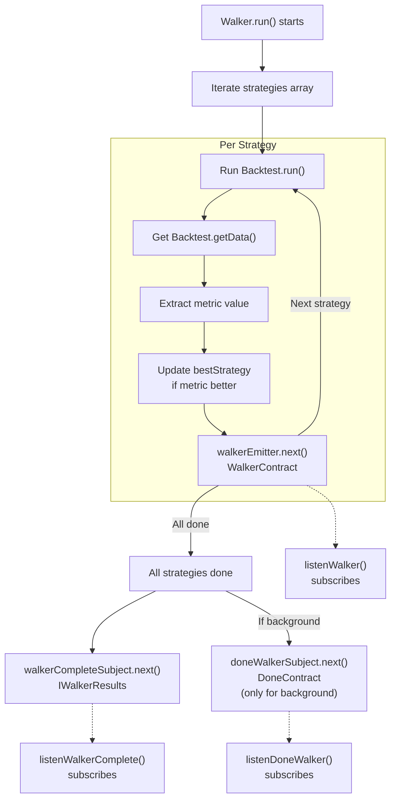

# Walker API

This page documents the Walker API for multi-strategy comparison. Walker orchestrates multiple backtest runs across different strategies and ranks them by performance metrics.

For information about running individual backtests, see [Backtest API](#4.3). For information about walker schemas and registration, see [Walker Schemas](#5.6).

---

## Overview

The Walker API provides functionality to compare multiple trading strategies by running backtests sequentially for each strategy and ranking them by a configurable performance metric. Walker is implemented as the `WalkerUtils` singleton class that delegates to `WalkerCommandService`, which orchestrates validation and execution through the service layer.

**Architecture:**
- `WalkerUtils` - Public API singleton exported as `Walker` [src/classes/Walker.ts:1-274]()
- `WalkerCommandService` - Validation and delegation [src/lib/services/command/WalkerCommandService.ts]()
- `WalkerLogicPublicService` - Context propagation wrapper
- `WalkerLogicPrivateService` - Core strategy iteration loop [src/lib/services/logic/private/WalkerLogicPrivateService.ts:31-254]()
- `BacktestLogicPublicService` - Individual backtest execution
- `WalkerMarkdownService` - Result aggregation and reporting

**Key Capabilities:**
- Sequential backtest execution for multiple strategies (not parallel)
- Automatic ranking by metric: `sharpeRatio`, `winRate`, `avgPnl`, `totalPnl`, `certaintyRatio`
- Progress event emission after each strategy completion via `walkerEmitter`
- Comparative performance report generation with unified statistics
- AsyncGenerator streaming for manual iteration or background execution

Sources: [src/classes/Walker.ts:1-274](), [src/lib/services/logic/private/WalkerLogicPrivateService.ts:31-254]()

---

## Walker Class Methods

The `Walker` singleton provides five main methods for strategy comparison operations.

### Walker.run()

Runs walker comparison for a symbol, yielding `WalkerContract` progress updates after each strategy completes.

**Signature:**
```typescript
Walker.run(
  symbol: string,
  context: {
    walkerName: string;
  }
): AsyncGenerator<WalkerContract>
```

**Parameters:**
- `symbol` - Trading pair symbol (e.g., "BTCUSDT")
- `context.walkerName` - Walker schema name registered via `addWalker()`

**Returns:** AsyncGenerator yielding `WalkerContract` after each strategy backtest completes

**Execution Flow:**
1. **Schema Validation** [src/classes/Walker.ts:50-59]():
   - `walkerValidationService.validate(walkerName)` - Walker schema exists
   - `exchangeValidationService.validate(exchangeName)` - Exchange schema exists
   - `frameValidationService.validate(frameName)` - Frame schema exists
   - `strategyValidationService.validate(strategyName)` - All strategies exist

2. **Data Clearing** [src/classes/Walker.ts:61-79]():
   - `walkerMarkdownService.clear(walkerName)` - Clear previous walker results
   - `backtestMarkdownService.clear(strategyName)` - Clear each strategy's backtest data
   - `scheduleMarkdownService.clear(strategyName)` - Clear scheduled signal data
   - `riskGlobalService.clear(riskName)` - Clear risk tracking state

3. **Execution Delegation** [src/classes/Walker.ts:81-86]():
   - Calls `walkerCommandService.run(symbol, context)` 
   - Streams `WalkerContract` events as they are emitted
   - Each iteration contains current strategy results and running best

**WalkerContract Structure:**
```typescript
interface WalkerContract {
  walkerName: string;
  exchangeName: string;
  frameName: string;
  symbol: string;
  strategyName: string;           // Current strategy being reported
  stats: BacktestStatistics;      // Full backtest stats for current strategy
  metricValue: number | null;     // Extracted metric value for current strategy
  metric: WalkerMetric;           // Metric used for comparison
  bestMetric: number | null;      // Best metric value so far
  bestStrategy: string | null;    // Best strategy name so far
  strategiesTested: number;       // Number completed
  totalStrategies: number;        // Total to test
}
```

Sources: [src/classes/Walker.ts:39-87](), [src/lib/services/logic/private/WalkerLogicPrivateService.ts:70-228]()

---

### Walker.background()

Runs walker comparison in background, consuming all `WalkerContract` events internally. Returns cancellation function.

**Signature:**
```typescript
Walker.background(
  symbol: string,
  context: {
    walkerName: string;
  }
): () => void
```

**Parameters:**
- `symbol` - Trading pair symbol (e.g., "BTCUSDT")
- `context.walkerName` - Walker schema name

**Returns:** Cancellation function to stop execution

**Implementation Details** [src/classes/Walker.ts:108-144]():

1. **Async Generator Consumption:**
   - Calls `Walker.run(symbol, context)` to get AsyncGenerator
   - Iterates through all `WalkerContract` events with `for await`
   - Discards each progress update (no yielding to caller)

2. **Completion Handling:**
   - Emits to `doneWalkerSubject.next()` when iteration completes
   - `DoneContract` structure: `{ exchangeName, strategyName, backtest: true, symbol }`

3. **Error Handling:**
   - Catches all errors in try-catch block
   - Emits to `errorEmitter.next(error)` for recoverable errors
   - Does not throw (silently handles failures)

4. **Cancellation:**
   - Returns `() => void` function stored in closure
   - Calling cancellation function breaks the `for await` loop
   - Stops backtest execution for remaining strategies

**Cancellation Mechanism:**
- Uses `walkerStopSubject.next()` to signal stop [src/lib/services/logic/private/WalkerLogicPrivateService.ts:96-104]()
- `WalkerLogicPrivateService` listens to stop signal with filter on symbol + strategyName
- Breaks iteration loop when `CANCEL_SYMBOL` is received

Sources: [src/classes/Walker.ts:108-144](), [src/lib/services/logic/private/WalkerLogicPrivateService.ts:96-156]()

---

### Walker.getData()

Retrieves aggregated walker results with all strategy comparisons and best strategy selection.

**Signature:**
```typescript
Walker.getData(
  symbol: string,
  walkerName: WalkerName
): Promise<WalkerStatistics>
```

**Parameters:**
- `symbol` - Trading symbol used in comparison
- `walkerName` - Walker schema name

**Returns:** Promise resolving to `WalkerStatistics` with complete comparison data

**Implementation** [src/classes/Walker.ts:159-179]():

1. **Schema Retrieval:**
   - Calls `walkerSchemaService.get(walkerName)` to get walker configuration
   - Extracts `exchangeName`, `frameName`, `metric` from schema

2. **Data Retrieval:**
   - Delegates to `walkerMarkdownService.getData(symbol, walkerName, metric, context)`
   - Context contains: `{ walkerName, exchangeName, frameName }`

3. **Result Structure:**
   ```typescript
   interface WalkerStatistics {
     walkerName: string;
     symbol: string;
     exchangeName: string;
     frameName: string;
     metric: WalkerMetric;
     totalStrategies: number;
     bestStrategy: string | null;
     bestMetric: number | null;
     bestStats: BacktestStatistics | null;  // Full stats for best strategy
     results: Array<{
       strategyName: string;
       stats: BacktestStatistics;          // Complete backtest statistics
       metricValue: number | null;          // Extracted metric for comparison
     }>;
   }
   ```

**Data Source:**
- `WalkerMarkdownService` accumulates events from `walkerEmitter`
- Each emitted `WalkerContract` is stored in internal array
- `getData()` processes array to compute best strategy and aggregate results

Sources: [src/classes/Walker.ts:159-179](), [src/lib/services/markdown/WalkerMarkdownService.ts]()

---

### Walker.getReport()

Generates markdown formatted report with comparative strategy analysis.

**Signature:**
```typescript
Walker.getReport(
  symbol: string,
  walkerName: WalkerName
): Promise<string>
```

**Parameters:**
- `symbol` - Trading symbol
- `walkerName` - Walker schema name

**Returns:** Promise resolving to markdown string with complete comparison report

**Implementation** [src/classes/Walker.ts:194-214]():

1. **Schema Retrieval:**
   - Gets `exchangeName`, `frameName`, `metric` from `walkerSchemaService.get(walkerName)`

2. **Report Generation:**
   - Delegates to `walkerMarkdownService.getReport(symbol, walkerName, metric, context)`
   - Context: `{ walkerName, exchangeName, frameName }`

**Report Structure:**
```markdown
# Walker Results: {walkerName} ({symbol})

## Summary
- **Best Strategy:** {bestStrategy}
- **Best {metric}:** {bestMetric}
- **Total Strategies Tested:** {totalStrategies}

## Strategy Comparison

| Strategy | Metric Value | Win Rate | Total PNL | Sharpe Ratio |
|----------|--------------|----------|-----------|--------------|
| ...      | ...          | ...      | ...       | ...          |

## Individual Strategy Details

### {strategyName}
- Win Rate: {winRate}%
- Total Signals: {totalSignals}
- Average PNL: {avgPnl}%
- Sharpe Ratio: {sharpeRatio}
...
```

**Markdown Generation:**
- Uses `WalkerMarkdownService.getReport()` to format accumulated data
- Includes comparison table sorted by metric value (descending)
- Detailed statistics for each strategy from `BacktestStatistics`

Sources: [src/classes/Walker.ts:194-214](), [src/lib/services/markdown/WalkerMarkdownService.ts]()

---

### Walker.dump()

Saves walker report to disk as markdown file with automatic directory creation.

**Signature:**
```typescript
Walker.dump(
  symbol: string,
  walkerName: WalkerName,
  path?: string
): Promise<void>
```

**Parameters:**
- `symbol` - Trading symbol
- `walkerName` - Walker schema name
- `path` - Optional directory path (default: `"./logs/walker"`)

**Implementation** [src/classes/Walker.ts:232-255]():

1. **Schema Retrieval:**
   - Gets `exchangeName`, `frameName`, `metric` from walker schema

2. **Report Generation:**
   - Delegates to `walkerMarkdownService.dump(symbol, walkerName, metric, context, path)`
   - Uses default path `"./logs/walker"` if not specified

3. **File System Operations:**
   - Creates directory with `mkdirSync(path, { recursive: true })`
   - Writes to `{path}/{walkerName}.md`
   - Uses `writeFileSync()` for synchronous write

4. **Logging:**
   - Success: `console.log("Walker report dumped to: {filePath}")`
   - Error: `console.error("Failed to dump walker report:", error)`

**File Naming:**
- Filename is always `{walkerName}.md`
- Example: `Walker.dump("BTCUSDT", "btc-optimizer")` creates `./logs/walker/btc-optimizer.md`

Sources: [src/classes/Walker.ts:232-255](), [src/lib/services/markdown/WalkerMarkdownService.ts]()

---

## Walker Execution Flow

The following diagram shows the complete execution path from `Walker.run()` through the service layer to backtest orchestration.

```mermaid
graph TB
    User["User Code:<br/>Walker.run(symbol, context)"]
    WalkerUtils["WalkerUtils.run()<br/>[Walker.ts:39-87]"]
    
    subgraph "Validation Phase"
        ValidateWalker["walkerValidationService.validate()<br/>Check walker schema exists"]
        ValidateExchange["exchangeValidationService.validate()<br/>Check exchange schema exists"]
        ValidateFrame["frameValidationService.validate()<br/>Check frame schema exists"]
        ValidateStrategies["strategyValidationService.validate()<br/>Check all strategy schemas exist"]
    end
    
    subgraph "Cleanup Phase"
        GetSchema["walkerSchemaService.get(walkerName)<br/>Extract strategies array and metric"]
        ClearWalker["walkerMarkdownService.clear(walkerName)"]
        ClearBacktests["For each strategy:<br/>backtestMarkdownService.clear()<br/>scheduleMarkdownService.clear()<br/>riskGlobalService.clear()"]
    end
    
    CommandService["walkerCommandService.run(symbol, context)<br/>[WalkerCommandService.ts]"]
    GlobalService["walkerGlobalService.run(symbol, walkerName)<br/>Inject context"]
    LogicPublic["walkerLogicPublicService.run()<br/>MethodContextService wrapper"]
    LogicPrivate["WalkerLogicPrivateService.run()<br/>[WalkerLogicPrivateService.ts:70-251]"]
    
    subgraph "Strategy Loop [WalkerLogicPrivateService:107-228]"
        LoopStart["for (const strategyName of strategies)"]
        CallbackStart["walkerSchema.callbacks?.onStrategyStart()"]
        BacktestPublic["backtestLogicPublicService.run()<br/>[BacktestLogicPublicService.ts]"]
        ResolveDocuments["await resolveDocuments(iterator)<br/>Collect all IStrategyBacktestResult[]"]
        GetStats["backtestMarkdownService.getData()<br/>Returns BacktestStatistics"]
        ExtractMetric["Extract metric value from stats<br/>e.g., stats.sharpeRatio"]
        CompareBest["if (metricValue > bestMetric)<br/>Update bestStrategy, bestMetric"]
        BuildContract["Create WalkerContract:<br/>{ strategyName, stats, metricValue,<br/>bestStrategy, bestMetric, ... }"]
        EmitProgress["progressWalkerEmitter.next()<br/>walkerEmitter.next()<br/>yield walkerContract"]
        CallbackComplete["walkerSchema.callbacks?.onStrategyComplete()"]
    end
    
    FinalResults["Build final results:<br/>{ bestStrategy, bestMetric, bestStats }"]
    EmitComplete["walkerCompleteSubject.next(finalResults)"]
    CallbackDone["walkerSchema.callbacks?.onComplete()"]
    
    User --> WalkerUtils
    WalkerUtils --> ValidateWalker
    ValidateWalker --> ValidateExchange
    ValidateExchange --> ValidateFrame
    ValidateFrame --> ValidateStrategies
    ValidateStrategies --> GetSchema
    GetSchema --> ClearWalker
    ClearWalker --> ClearBacktests
    ClearBacktests --> CommandService
    CommandService --> GlobalService
    GlobalService --> LogicPublic
    LogicPublic --> LogicPrivate
    
    LogicPrivate --> LoopStart
    LoopStart --> CallbackStart
    CallbackStart --> BacktestPublic
    BacktestPublic --> ResolveDocuments
    ResolveDocuments --> GetStats
    GetStats --> ExtractMetric
    ExtractMetric --> CompareBest
    CompareBest --> BuildContract
    BuildContract --> EmitProgress
    EmitProgress --> CallbackComplete
    CallbackComplete --> |Next strategy| LoopStart
    CallbackComplete --> |All complete| FinalResults
    
    FinalResults --> EmitComplete
    EmitComplete --> CallbackDone
    CallbackDone --> User
```



**Execution Characteristics:**
- **Sequential Execution:** Strategies are tested one at a time (lines 107-228)
- **Context Propagation:** `MethodContextService.runAsyncIterator` sets `walkerName`, `exchangeName`, `frameName` in context
- **Backtest Delegation:** Each strategy uses full `BacktestLogicPublicService.run()` flow
- **Metric Extraction:** `metricValue = stats[metric]` with null safety checks (lines 168-176)
- **Best Tracking:** Compares after each strategy completion (lines 179-186)
- **Progress Streaming:** Yields after each strategy, not at end (line 227)

Sources: [src/classes/Walker.ts:39-87](), [src/lib/services/logic/private/WalkerLogicPrivateService.ts:70-251](), [src/lib/services/command/WalkerCommandService.ts]()

---

## Event Listeners

Walker provides specialized event listeners for monitoring comparison progress and completion.

### listenWalker()

Subscribes to walker progress events with queued async processing. Emits after each strategy completes.

**Signature:**
```typescript
listenWalker(fn: (event: WalkerContract) => void): () => void
```

**Event Structure:**
```typescript
interface WalkerContract {
  strategiesTested: number;
  totalStrategies: number;
  bestStrategy: string;
  bestMetric: number;
  strategyName: string;
  metricValue: number;
}
```

**Returns:** Unsubscribe function

Sources: [src/function/event.ts:537-536]()

---

### listenWalkerOnce()

Subscribes to filtered walker progress events with one-time execution. Useful for waiting for specific conditions.

**Signature:**
```typescript
listenWalkerOnce(
  filterFn: (event: WalkerContract) => boolean,
  fn: (event: WalkerContract) => void
): () => void
```

**Parameters:**
- `filterFn` - Predicate to filter which events trigger the callback
- `fn` - Callback function (called only once when filter matches)

**Returns:** Unsubscribe function to cancel before it fires

Sources: [src/function/event.ts:552-569]()

---

### listenWalkerComplete()

Subscribes to walker completion events with final results. Emits when all strategies have been tested.

**Signature:**
```typescript
listenWalkerComplete(fn: (results: IWalkerResults) => void): () => void
```

**Event Structure:**
```typescript
interface IWalkerResults {
  bestStrategy: string;
  bestMetric: number;
  strategies: Array<{
    strategyName: string;
    stats: BacktestStatistics;
    metric: number;
  }>;
}
```

**Returns:** Unsubscribe function

Sources: [src/function/event.ts:584-601]()

---

### listenDoneWalker()

Subscribes to walker background execution completion events. Emits when `Walker.background()` completes.

**Signature:**
```typescript
listenDoneWalker(fn: (event: DoneContract) => void): () => void
```

**Event Structure:**
```typescript
interface DoneContract {
  exchangeName: string;
  strategyName: string;  // Actually walkerName
  backtest: boolean;     // Always true for walker
  symbol: string;
}
```

**Returns:** Unsubscribe function

Sources: [src/function/event.ts:397-400]()

---

### listenDoneWalkerOnce()

Subscribes to filtered walker background completion events with one-time execution.

**Signature:**
```typescript
listenDoneWalkerOnce(
  filterFn: (event: DoneContract) => boolean,
  fn: (event: DoneContract) => void
): () => void
```

**Parameters:**
- `filterFn` - Predicate to filter events
- `fn` - Callback function (called only once)

**Returns:** Unsubscribe function

Sources: [src/function/event.ts:427-433]()

---

## Walker Event Flow

The following diagram shows the event emission sequence during walker execution.



**Event Timing:**
1. `walkerEmitter` - Emits after each strategy completes (N times for N strategies)
2. `walkerCompleteSubject` - Emits once when all strategies complete
3. `doneWalkerSubject` - Emits only for `Walker.background()` after completion

Sources: [src/config/emitters.ts:64-73](), [src/classes/Walker.ts:108-144]()

---

## Usage Examples

### Basic Walker Usage with Progress Tracking

```typescript
import { addWalker, Walker, listenWalker } from "backtest-kit";

// Register walker schema
addWalker({
  walkerName: "btc-walker",
  exchangeName: "binance",
  frameName: "1d-backtest",
  strategies: ["strategy-a", "strategy-b", "strategy-c"],
  metric: "sharpeRatio",
  callbacks: {
    onStrategyStart: (strategyName, symbol) => {
      console.log(`Starting: ${strategyName}`);
    },
    onStrategyComplete: (strategyName, symbol, stats) => {
      console.log(`Completed: ${strategyName} - Sharpe: ${stats.sharpeRatio}`);
    },
    onComplete: (results) => {
      console.log(`Best: ${results.bestStrategy}`);
    },
  },
});

// Listen to progress
listenWalker((event) => {
  console.log(`Progress: ${event.strategiesTested}/${event.totalStrategies}`);
  console.log(`Best so far: ${event.bestStrategy} (${event.bestMetric})`);
  console.log(`Current: ${event.strategyName} (${event.metricValue})`);
});

// Run walker
for await (const progress of Walker.run("BTCUSDT", {
  walkerName: "btc-walker"
})) {
  // Progress available here too
  console.log(`Tested ${progress.strategiesTested} strategies`);
}

// Get final results
const results = await Walker.getData("BTCUSDT", "btc-walker");
console.log("Best strategy:", results.bestStrategy);
console.log("Best metric:", results.bestMetric);

// Generate report
const markdown = await Walker.getReport("BTCUSDT", "btc-walker");
console.log(markdown);

// Save to disk
await Walker.dump("BTCUSDT", "btc-walker"); // ./logs/walker/btc-walker.md
```

Sources: [README.md:407-459](), [src/classes/Walker.ts:39-87]()

---

### Background Walker Execution

```typescript
import { Walker, listenWalkerComplete, listenDoneWalker } from "backtest-kit";

// Listen to completion
listenWalkerComplete((results) => {
  console.log("Walker completed!");
  console.log("Best strategy:", results.bestStrategy);
  console.log("Best metric:", results.bestMetric);
  
  // Access all strategy results
  results.strategies.forEach(({ strategyName, stats, metric }) => {
    console.log(`${strategyName}: ${metric}`);
  });
});

// Listen to background task done
listenDoneWalker((event) => {
  console.log("Background walker done:", event.strategyName);
  
  // Auto-save report
  Walker.dump(event.symbol, event.strategyName);
});

// Run in background
const cancel = Walker.background("BTCUSDT", {
  walkerName: "btc-walker"
});

// Later: cancel if needed
// cancel();
```

Sources: [src/classes/Walker.ts:108-144](), [src/function/event.ts:584-601]()

---

### Comparing Strategies by Different Metrics

```typescript
import { addWalker, Walker } from "backtest-kit";

// Walker comparing by Sharpe Ratio (risk-adjusted returns)
addWalker({
  walkerName: "walker-sharpe",
  exchangeName: "binance",
  frameName: "1d-backtest",
  strategies: ["strategy-a", "strategy-b", "strategy-c"],
  metric: "sharpeRatio", // Default, best for risk-adjusted comparison
});

// Walker comparing by win rate
addWalker({
  walkerName: "walker-winrate",
  exchangeName: "binance",
  frameName: "1d-backtest",
  strategies: ["strategy-a", "strategy-b", "strategy-c"],
  metric: "winRate", // Best for consistency
});

// Walker comparing by total PNL
addWalker({
  walkerName: "walker-totalpnl",
  exchangeName: "binance",
  frameName: "1d-backtest",
  strategies: ["strategy-a", "strategy-b", "strategy-c"],
  metric: "totalPnl", // Best for absolute returns
});

// Walker comparing by certainty ratio (avgWin / |avgLoss|)
addWalker({
  walkerName: "walker-certainty",
  exchangeName: "binance",
  frameName: "1d-backtest",
  strategies: ["strategy-a", "strategy-b", "strategy-c"],
  metric: "certaintyRatio", // Best for risk/reward profile
});

// Run each walker
for await (const _ of Walker.run("BTCUSDT", { walkerName: "walker-sharpe" })) {}
for await (const _ of Walker.run("BTCUSDT", { walkerName: "walker-winrate" })) {}
for await (const _ of Walker.run("BTCUSDT", { walkerName: "walker-totalpnl" })) {}
for await (const _ of Walker.run("BTCUSDT", { walkerName: "walker-certainty" })) {}

// Compare results
const sharpeBest = await Walker.getData("BTCUSDT", "walker-sharpe");
const winrateBest = await Walker.getData("BTCUSDT", "walker-winrate");
const pnlBest = await Walker.getData("BTCUSDT", "walker-totalpnl");
const certaintyBest = await Walker.getData("BTCUSDT", "walker-certainty");

console.log("Best by Sharpe:", sharpeBest.bestStrategy);
console.log("Best by Win Rate:", winrateBest.bestStrategy);
console.log("Best by Total PNL:", pnlBest.bestStrategy);
console.log("Best by Certainty:", certaintyBest.bestStrategy);
```

Sources: [README.md:461-467]()

---

### Cancelling Walker Execution

```typescript
import { Walker, listenWalker } from "backtest-kit";

let strategiesTested = 0;

listenWalker((event) => {
  strategiesTested = event.strategiesTested;
});

// Run walker in background
const cancel = Walker.background("BTCUSDT", {
  walkerName: "btc-walker"
});

// Cancel after 10 seconds (or based on some condition)
setTimeout(() => {
  cancel();
  console.log(`Cancelled after testing ${strategiesTested} strategies`);
}, 10000);

// Or cancel based on condition
listenWalkerOnce(
  (event) => event.strategiesTested >= 5,
  (event) => {
    cancel();
    console.log("Cancelled after 5 strategies");
  }
);
```

Sources: [src/classes/Walker.ts:138-143]()

---

## Walker Data Structure

### IWalkerResults

The data structure returned by `Walker.getData()` and emitted by `walkerCompleteSubject`.

```typescript
interface IWalkerResults {
  /** Name of the best performing strategy */
  bestStrategy: string;
  
  /** Metric value for the best strategy */
  bestMetric: number;
  
  /** Array of all tested strategies with their results */
  strategies: Array<{
    /** Strategy name */
    strategyName: string;
    
    /** Complete backtest statistics for this strategy */
    stats: BacktestStatistics;
    
    /** Extracted metric value used for comparison */
    metric: number;
  }>;
}
```

**BacktestStatistics Structure:**
```typescript
interface BacktestStatistics {
  signalList: IStrategyTickResultClosed[];
  totalSignals: number;
  winCount: number;
  lossCount: number;
  winRate: number | null;
  avgPnl: number | null;
  totalPnl: number | null;
  stdDev: number | null;
  sharpeRatio: number | null;
  annualizedSharpeRatio: number | null;
  certaintyRatio: number | null;
  expectedYearlyReturns: number | null;
}
```

**Available Metrics for Comparison:**
- `sharpeRatio` - Risk-adjusted return (avgPnl / stdDev)
- `winRate` - Win percentage (0-100)
- `avgPnl` - Average PNL percentage per trade
- `totalPnl` - Cumulative PNL percentage
- `certaintyRatio` - avgWin / |avgLoss|

Sources: [src/lib/services/markdown/BacktestMarkdownService.ts:46-102]()

---

## Service Layer Architecture

The following diagram shows the complete service dependency graph for Walker execution.

```mermaid
graph TB
    subgraph "Public API Layer"
        WalkerUtils["WalkerUtils (exported as Walker)<br/>[Walker.ts:1-274]"]
    end
    
    subgraph "Command Layer"
        WalkerCommand["WalkerCommandService<br/>[WalkerCommandService.ts]<br/>Validation + delegation"]
    end
    
    subgraph "Validation Services"
        WalkerValidation["WalkerValidationService<br/>Validate walker schema"]
        StrategyValidation["StrategyValidationService<br/>Validate strategy schemas"]
        ExchangeValidation["ExchangeValidationService<br/>Validate exchange schema"]
        FrameValidation["FrameValidationService<br/>Validate frame schema"]
        RiskValidation["RiskValidationService<br/>Validate risk schemas"]
    end
    
    subgraph "Schema Services"
        WalkerSchema["WalkerSchemaService<br/>Get walker.strategies, walker.metric"]
        StrategySchema["StrategySchemaService<br/>Get strategy configs"]
        ExchangeSchema["ExchangeSchemaService<br/>Get exchange config"]
        FrameSchema["FrameSchemaService<br/>Get frame config"]
        RiskSchema["RiskSchemaService<br/>Get risk config"]
    end
    
    subgraph "Global Services"
        WalkerGlobal["WalkerGlobalService<br/>Context injection wrapper"]
        BacktestGlobal["BacktestGlobalService<br/>Strategy-level wrapper"]
        RiskGlobal["RiskGlobalService<br/>Risk state management"]
    end
    
    subgraph "Logic Services"
        WalkerLogicPublic["WalkerLogicPublicService<br/>MethodContextService.runAsyncIterator"]
        WalkerLogicPrivate["WalkerLogicPrivateService<br/>[WalkerLogicPrivateService.ts:31-254]<br/>for-loop through strategies"]
        BacktestLogicPublic["BacktestLogicPublicService<br/>Per-strategy backtest wrapper"]
        BacktestLogicPrivate["BacktestLogicPrivateService<br/>[BacktestLogicPrivateService.ts:33-387]<br/>Timeframe iteration"]
    end
    
    subgraph "Context Services"
        MethodContext["MethodContextService<br/>Store: walkerName, exchangeName,<br/>frameName, strategyName"]
        ExecContext["ExecutionContextService<br/>Store: symbol, when, backtest flag"]
    end
    
    subgraph "Markdown Services"
        WalkerMarkdown["WalkerMarkdownService<br/>Accumulate walkerEmitter events<br/>Compute best strategy"]
        BacktestMarkdown["BacktestMarkdownService<br/>Accumulate signalBacktestEmitter<br/>Calculate BacktestStatistics"]
        ScheduleMarkdown["ScheduleMarkdownService<br/>Track scheduled signal events"]
    end
    
    subgraph "Business Logic"
        StrategyGlobal["StrategyGlobalService<br/>tick(), backtest() delegation"]
        ExchangeGlobal["ExchangeGlobalService<br/>getCandles(), getNextCandles()"]
        FrameGlobal["FrameGlobalService<br/>getTimeframe() generation"]
    end
    
    WalkerUtils --> WalkerCommand
    WalkerCommand --> WalkerValidation
    WalkerCommand --> StrategyValidation
    WalkerCommand --> ExchangeValidation
    WalkerCommand --> FrameValidation
    WalkerCommand --> RiskValidation
    
    WalkerCommand --> WalkerSchema
    WalkerCommand --> StrategySchema
    
    WalkerCommand --> WalkerGlobal
    WalkerGlobal --> WalkerLogicPublic
    WalkerLogicPublic --> MethodContext
    MethodContext --> WalkerLogicPrivate
    
    WalkerLogicPrivate --> BacktestGlobal
    BacktestGlobal --> BacktestLogicPublic
    BacktestLogicPublic --> MethodContext
    BacktestLogicPublic --> BacktestLogicPrivate
    
    BacktestLogicPrivate --> ExecContext
    BacktestLogicPrivate --> StrategyGlobal
    BacktestLogicPrivate --> ExchangeGlobal
    BacktestLogicPrivate --> FrameGlobal
    
    WalkerLogicPrivate --> BacktestMarkdown
    WalkerLogicPrivate --> WalkerMarkdown
    
    WalkerUtils -.->|getData()| WalkerMarkdown
    WalkerUtils -.->|getReport()| WalkerMarkdown
    WalkerUtils -.->|dump()| WalkerMarkdown
    
    BacktestMarkdown -.->|Per strategy stats| WalkerLogicPrivate
```

**Key Service Interactions:**

| Service | Primary Responsibility | Key Methods |
|---------|----------------------|-------------|
| `WalkerCommandService` | Validation orchestration | `run(symbol, context)` |
| `WalkerLogicPrivateService` | Strategy iteration loop | `run(symbol, strategies, metric, context)` [line 70]() |
| `BacktestLogicPrivateService` | Single strategy backtest | `run(symbol)` [line 62]() - yields closed signals |
| `BacktestMarkdownService` | Per-strategy statistics | `getData(symbol, strategyName)` - returns `BacktestStatistics` |
| `WalkerMarkdownService` | Comparative aggregation | `getData(symbol, walkerName, metric, context)` - returns `WalkerStatistics` |
| `MethodContextService` | Context propagation | `runAsyncIterator(contextObj, asyncGenFn)` |

**Context Flow:**
1. `WalkerLogicPublicService` sets: `{ walkerName, exchangeName, frameName }`
2. `BacktestLogicPublicService` adds: `{ strategyName }`
3. `BacktestLogicPrivateService` uses: All context fields + symbol + when

Sources: [src/classes/Walker.ts:1-274](), [src/lib/services/logic/private/WalkerLogicPrivateService.ts:31-254](), [src/lib/services/logic/private/BacktestLogicPrivateService.ts:33-387](), [src/lib/services/command/WalkerCommandService.ts]()

---

## Comparison: Walker vs Manual Backtest Iteration

| Aspect | Walker.run() | Manual Backtest.run() Calls |
|--------|--------------|----------------------------|
| **Orchestration** | Automatic sequential execution via `WalkerLogicPrivateService` | Manual `for` loop or `Promise.all()` |
| **Progress Tracking** | Built-in `walkerEmitter` and `progressWalkerEmitter` | Must subscribe to `signalBacktestEmitter` manually |
| **Best Strategy Selection** | Automatic metric comparison [line 179-186]() | Must implement comparison logic |
| **Report Generation** | Unified `WalkerMarkdownService` report | Must aggregate `BacktestMarkdownService` reports |
| **Context Propagation** | Single `{ walkerName, exchangeName, frameName }` | Must set context per backtest |
| **Data Clearing** | Automatic `clear()` for all strategies [lines 61-79]() | Must call `clear()` per strategy manually |
| **Metric Extraction** | Automatic `stats[metric]` extraction [lines 168-176]() | Must access `stats` object manually |
| **Event Emission** | `walkerEmitter`, `walkerCompleteSubject`, `progressWalkerEmitter` | `signalBacktestEmitter`, `doneBacktestSubject` |
| **Error Handling** | Catches errors per strategy, continues execution [lines 127-146]() | Must implement try-catch per backtest |
| **Callbacks** | Walker-level callbacks: `onStrategyStart`, `onStrategyComplete`, `onComplete` | Strategy-level callbacks: `onOpen`, `onClose`, etc. |

**When to Use Walker:**
- Comparing 2+ strategies on same exchange/frame
- Need automatic ranking by `sharpeRatio`, `winRate`, `avgPnl`, `totalPnl`, or `certaintyRatio`
- Want comparative markdown report with all strategies
- Need real-time progress updates during comparison
- Want automatic error recovery (skip failed strategies)

**When to Use Manual Backtest Calls:**
- Testing single strategy
- Need fine-grained control over execution order
- Different timeframes per strategy (different `frameName`)
- Custom comparison logic beyond supported metrics
- Need parallel execution (Walker is sequential)

**Parallelization Note:**
- Walker executes backtests **sequentially** (one at a time) [src/lib/services/logic/private/WalkerLogicPrivateService.ts:107-228]()
- For parallel execution, use manual `Promise.all(backtests)` with multiple `Backtest.run()` calls
- Sequential execution simplifies state management and reduces memory pressure

Sources: [src/classes/Walker.ts:39-87](), [src/lib/services/logic/private/WalkerLogicPrivateService.ts:70-251]()

---

## Error Handling

Walker validates all schemas before starting execution. If any validation fails, an error is thrown immediately.

**Validation Checks:**
1. Walker schema exists (`walkerValidationService.validate`)
2. Exchange schema exists (`exchangeValidationService.validate`)
3. Frame schema exists (`frameValidationService.validate`)
4. All strategy schemas exist (`strategyValidationService.validate`)
5. Risk schemas exist for strategies that specify them (`riskValidationService.validate`)

**Background Execution Errors:**
Errors in `Walker.background()` are caught and emitted to `errorEmitter` instead of throwing. Use `listenError()` to handle them.

```typescript
import { Walker, listenError } from "backtest-kit";

listenError((error) => {
  console.error("Walker error:", error.message);
  // Handle error (log, alert, retry, etc.)
});

Walker.background("BTCUSDT", {
  walkerName: "btc-walker"
});
```

Sources: [src/classes/Walker.ts:50-59](), [src/classes/Walker.ts:130-137]()

---

## Walker State Management

Walker clears accumulated data before each run to ensure fresh comparison:

```typescript
// From Walker.run()
backtest.walkerMarkdownService.clear(context.walkerName);

// Clear backtest data for all strategies
for (const strategyName of walkerSchema.strategies) {
  backtest.backtestMarkdownService.clear(strategyName);
  backtest.scheduleMarkdownService.clear(strategyName);
  backtest.strategyGlobalService.clear(strategyName);
  
  const { riskName } = backtest.strategySchemaService.get(strategyName);
  riskName && backtest.riskGlobalService.clear(riskName);
}
```

This ensures:
- No stale data from previous walker runs
- No cross-contamination between strategies
- Fresh risk tracking for each strategy
- Accurate comparison metrics

Sources: [src/classes/Walker.ts:61-79]()