# Data Flow Patterns

## Purpose and Scope

This page documents the end-to-end data flow patterns in Backtest Kit, tracing how data moves from user configuration through validation, execution, signal processing, and finally to reporting. It maps the transformation of data structures at each stage and identifies the specific services, classes, and methods that handle each transformation.

For information about the service layer architecture and dependency injection patterns, see [Service Layer & Dependency Injection](./14_architecture-deep-dive.md). For details on client implementations, see [Client Layer](./14_architecture-deep-dive.md). For the event-driven architecture, see [Event System Architecture](./14_architecture-deep-dive.md). For execution mode specifics, see [Execution Modes](./20_execution-modes.md).

This page focuses on **how data flows** rather than **what components do**. It serves as a reference for understanding the complete journey of trading signals from conception to completion.

---

## Configuration Phase: User Input to Schema Storage

The data flow begins when users call registration functions to define their trading strategies, exchanges, and risk parameters. This phase transforms user-provided JavaScript objects into validated, immutable schema entries stored in registry services.

### Configuration Registration Flow

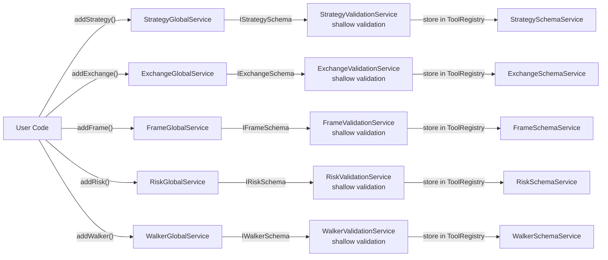

**Sources:** [src/lib/services/global/StrategyGlobalService.ts](), [src/lib/services/schema/StrategySchemaService.ts](), [src/lib/services/validation/StrategyValidationService.ts]()

### Data Transformation: User Objects to Schema Entries

| Input Type | Validation Layer | Storage Format | Registry Key |
|------------|------------------|----------------|--------------|
| `IStrategySchema` | `StrategyValidationService` checks for duplicate names | Stored in `ToolRegistry<IStrategySchema>` | `strategyName: string` |
| `IExchangeSchema` | `ExchangeValidationService` checks for duplicate names | Stored in `ToolRegistry<IExchangeSchema>` | `exchangeName: string` |
| `IFrameSchema` | `FrameValidationService` checks for duplicate names | Stored in `ToolRegistry<IFrameSchema>` | `frameName: string` |
| `IRiskSchema` | `RiskValidationService` checks for duplicate names | Stored in `ToolRegistry<IRiskSchema>` | `riskName: string` |
| `IWalkerSchema` | `WalkerValidationService` validates strategy list | Stored in `ToolRegistry<IWalkerSchema>` | `walkerName: string` |

**Sources:** [src/interfaces/Strategy.interface.ts:132-151](), [src/interfaces/Exchange.interface.ts](), [src/interfaces/Frame.interface.ts](), [src/interfaces/Risk.interface.ts](), [src/interfaces/Walker.interface.ts]()

---

## Execution Initiation: API Call to Context Setup

When users invoke `Backtest.run()`, `Live.run()`, or `Walker.run()`, the framework validates all schema references, establishes execution contexts, and routes operations to the appropriate services. This phase prepares the runtime environment before any signal processing begins.

### Execution Startup Flow (Backtest Mode)

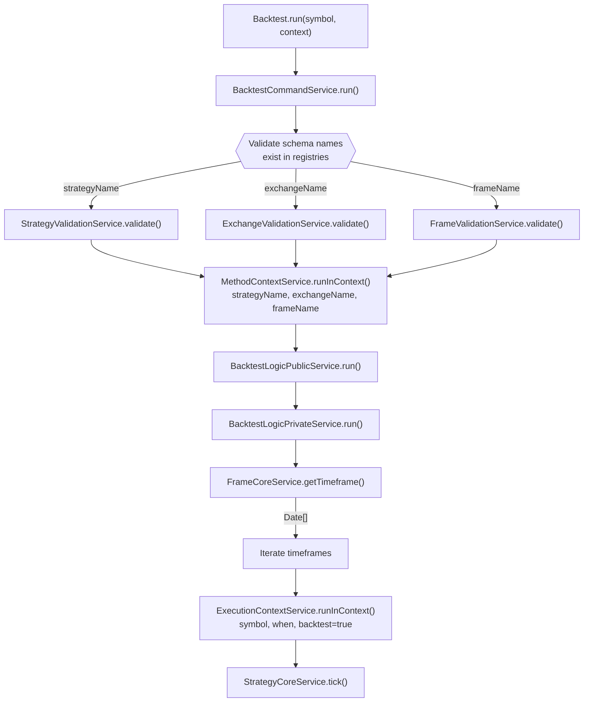

**Sources:** [src/lib/services/command/BacktestCommandService.ts](), [src/lib/services/logic/public/BacktestLogicPublicService.ts](), [src/lib/services/logic/private/BacktestLogicPrivateService.ts:62-78](), [src/lib/services/context/MethodContextService.ts](), [src/lib/services/context/ExecutionContextService.ts]()

### Context Propagation Pattern

The framework uses ambient context services (`MethodContextService` and `ExecutionContextService`) to propagate configuration without explicit parameter passing. This pattern uses the `di-scoped` library to maintain context throughout the call stack.

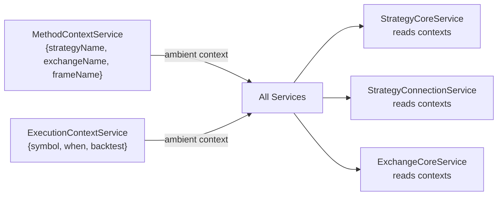

**Sources:** [src/lib/services/context/MethodContextService.ts](), [src/lib/services/context/ExecutionContextService.ts](), [src/lib/services/core/StrategyCoreService.ts]()

---

## Signal Generation: Tick to Signal Creation

During execution, the framework calls `ClientStrategy.tick()` on each timeframe to generate trading signals. This process involves throttling checks, user function invocation, multi-stage validation, risk checks, and persistence decisions.

### Signal Generation Data Flow

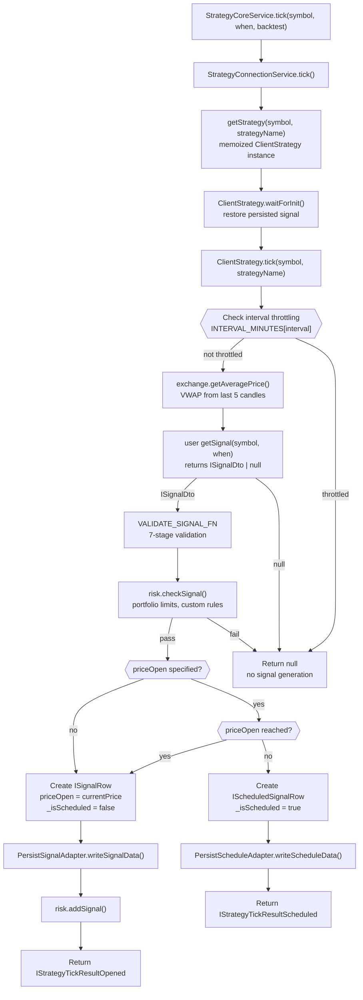

**Sources:** [src/client/ClientStrategy.ts:332-476](), [src/lib/services/connection/StrategyConnectionService.ts:207-228](), [src/lib/services/core/StrategyCoreService.ts]()

### Signal Validation Pipeline

The `VALIDATE_SIGNAL_FN` performs comprehensive validation before any signal activates:

| Validation Stage | Check | GLOBAL_CONFIG Parameter | Failure Reason |
|-----------------|-------|-------------------------|----------------|
| 1. Schema Fields | Required fields present (`id`, `symbol`, `position`, etc.) | N/A | Missing required data |
| 2. Finite Prices | All prices are finite numbers > 0 | N/A | NaN or Infinity detected |
| 3. TP/SL Logic | Long: `TP > open > SL` Short: `SL > open > TP` | N/A | Invalid price relationships |
| 4. TP Distance | TP far enough to cover fees | `CC_MIN_TAKEPROFIT_DISTANCE_PERCENT` | Profit too small (< 0.2%) |
| 5. SL Min Distance | SL not too close (instant stop) | `CC_MIN_STOPLOSS_DISTANCE_PERCENT` | Stop too tight |
| 6. SL Max Distance | SL not too far (risk limit) | `CC_MAX_STOPLOSS_DISTANCE_PERCENT` | Risk too high |
| 7. Signal Lifetime | Duration within limits | `CC_MAX_SIGNAL_LIFETIME_MINUTES` | Signal too long (blocks risk) |

**Sources:** [src/client/ClientStrategy.ts:45-330](), [src/config/params.ts]()

---

## Signal Processing: Active Monitoring to Closure

Once a signal opens, the framework monitors it on every tick, checking for take profit, stop loss, or time expiration conditions. For backtest mode, the `backtest()` method processes multiple candles efficiently.

### Live Mode Monitoring Flow

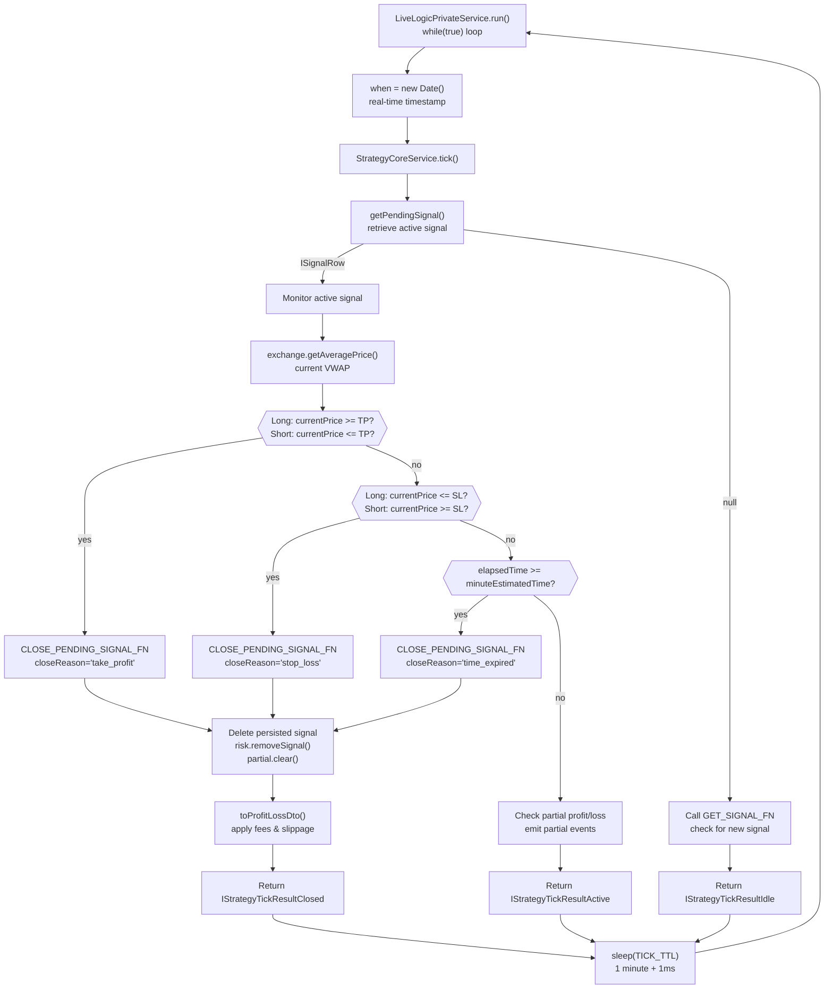

**Sources:** [src/lib/services/logic/private/LiveLogicPrivateService.ts:63-175](), [src/client/ClientStrategy.ts:901-1023](), [src/helpers/toProfitLossDto.ts]()

### Backtest Mode Fast Processing Flow

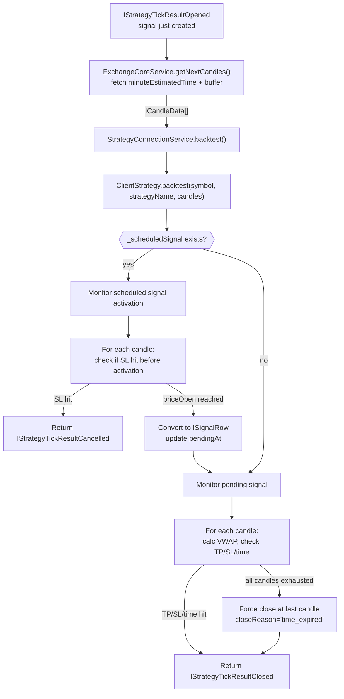

**Sources:** [src/client/ClientStrategy.ts:1190-1484](), [src/lib/services/logic/private/BacktestLogicPrivateService.ts:304-431]()

---

## Event Propagation: Signal Results to Event Consumers

After each tick or signal closure, the framework emits events through RxJS Subject-based emitters. Multiple markdown services subscribe to these events to accumulate data for report generation.

### Event Flow Architecture

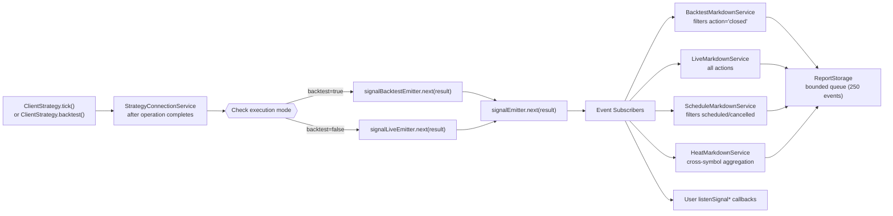

**Sources:** [src/lib/services/connection/StrategyConnectionService.ts:217-227](), [src/config/emitters.ts](), [src/lib/services/markdown/BacktestMarkdownService.ts](), [src/lib/services/markdown/LiveMarkdownService.ts]()

### Event Filtering and Storage Pattern

Each markdown service subscribes to specific events and maintains a bounded event queue:

| Markdown Service | Event Filter | Queue Bound | Storage Key |
|------------------|--------------|-------------|-------------|
| `BacktestMarkdownService` | `action === "closed"` | 250 events | `${symbol}:${strategyName}` |
| `LiveMarkdownService` | All actions (idle, opened, active, closed) | 250 events | `${symbol}:${strategyName}` |
| `ScheduleMarkdownService` | `action === "scheduled" \|\| "cancelled"` | 250 events | `${symbol}:${strategyName}` |
| `HeatMarkdownService` | `action === "closed"` | No bound (portfolio-wide) | `portfolio` |
| `PartialMarkdownService` | Partial profit/loss events | 250 events | `${symbol}:${strategyName}` |
| `RiskMarkdownService` | Risk rejection events | 250 events | `${symbol}:${strategyName}` |

**Sources:** [src/lib/services/markdown/BacktestMarkdownService.ts](), [src/lib/services/markdown/LiveMarkdownService.ts](), [src/classes/ReportStorage.ts]()

---

## Report Generation: Accumulated Events to Statistics

The final stage transforms accumulated event data into statistical models and formatted markdown reports. This process calculates metrics like Sharpe ratio, win rate, and PNL using safe math functions.

### Statistics Calculation Flow

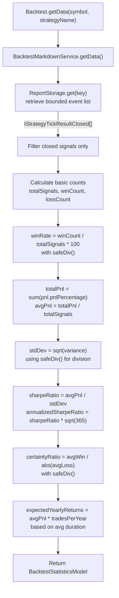

**Sources:** [src/lib/services/markdown/BacktestMarkdownService.ts](), [src/model/BacktestStatisticsModel.ts](), [src/helpers/safeDiv.ts]()

### Report Formatting and Dump

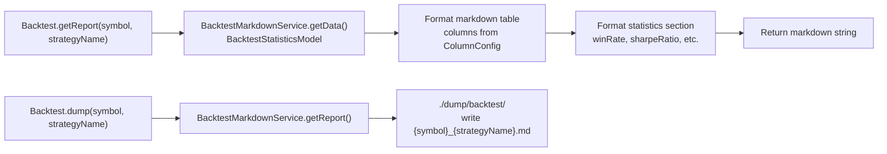

**Sources:** [src/lib/services/markdown/BacktestMarkdownService.ts](), [src/classes/BacktestCommandService.ts]()

---

## Cross-Cutting Data Flows

### Persistence and Recovery Flow

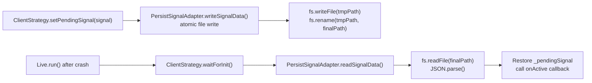

**Sources:** [src/client/ClientStrategy.ts:491-552](), [src/classes/Persist.ts]()

### Memoization and Caching Pattern

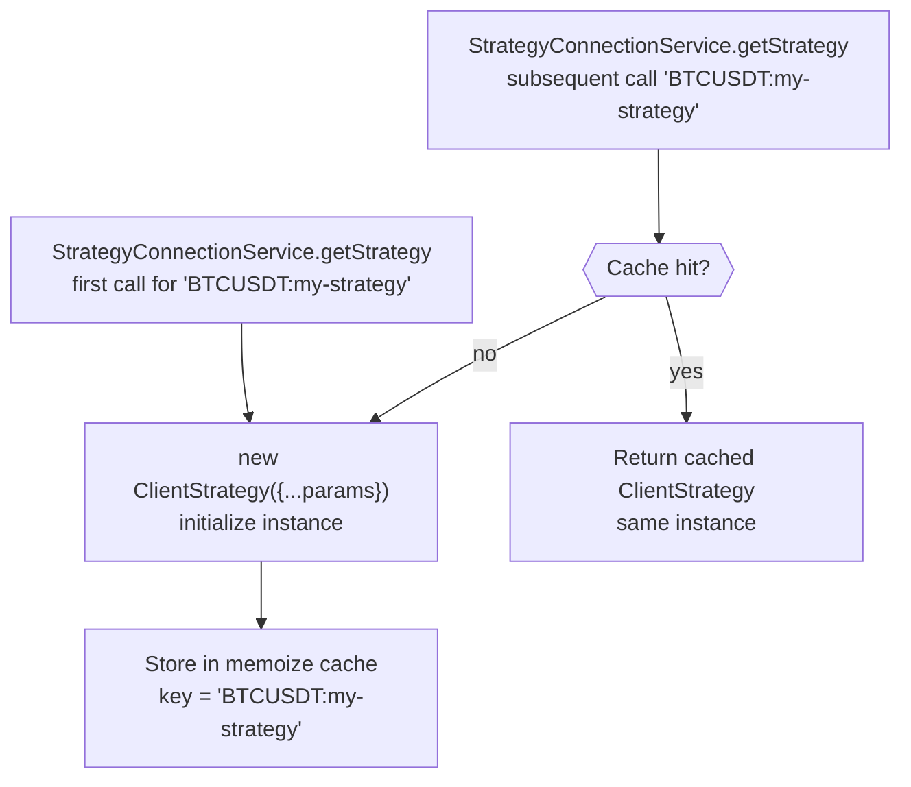

**Sources:** [src/lib/services/connection/StrategyConnectionService.ts:120-151]()

---

## Complete End-to-End Flow Summary

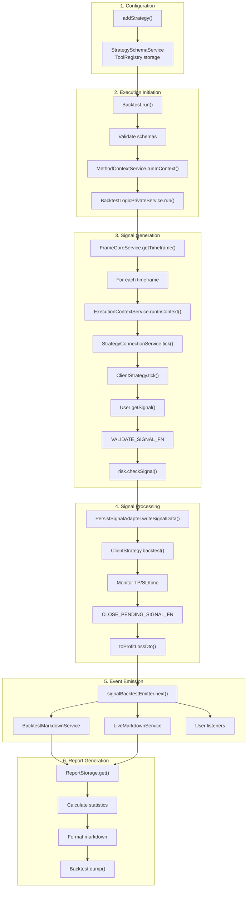

**Sources:** All service files in [src/lib/services/](), [src/client/ClientStrategy.ts](), [src/classes/]()