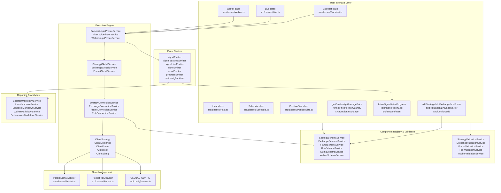
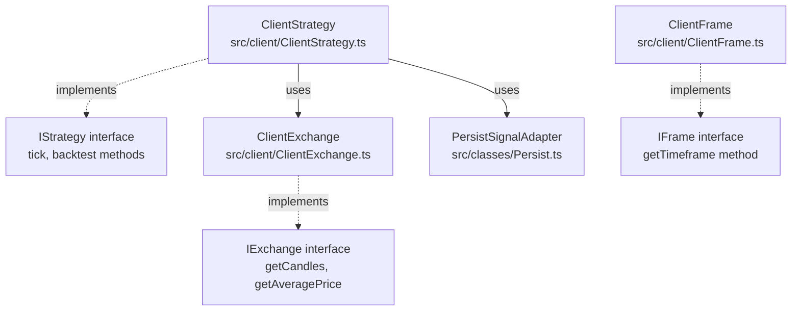
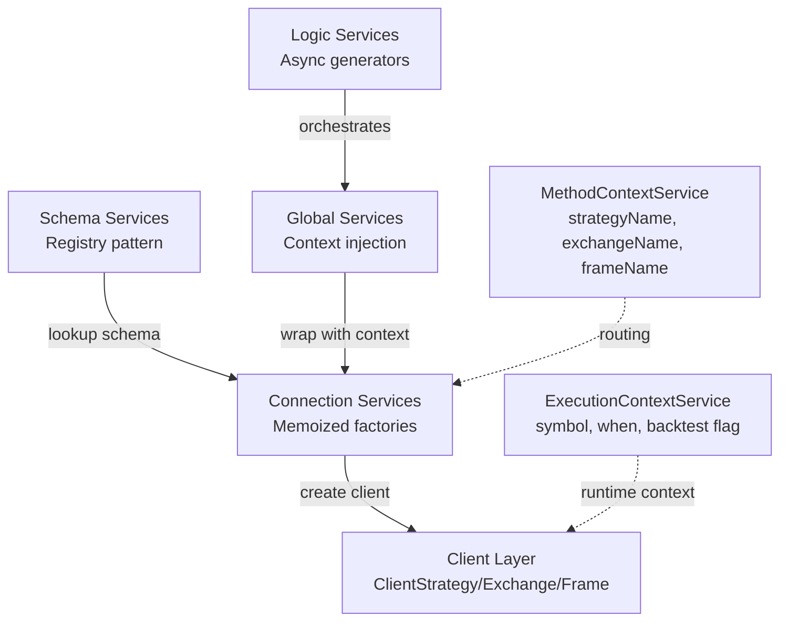
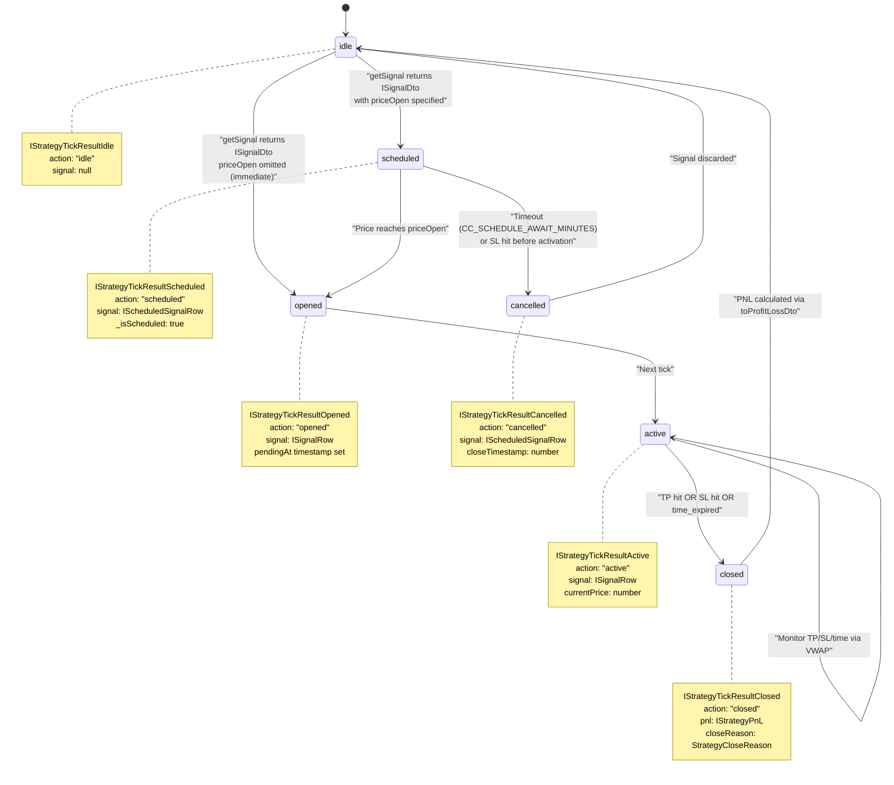
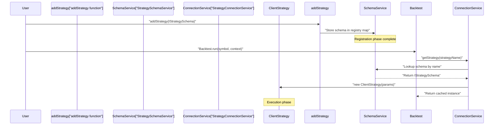
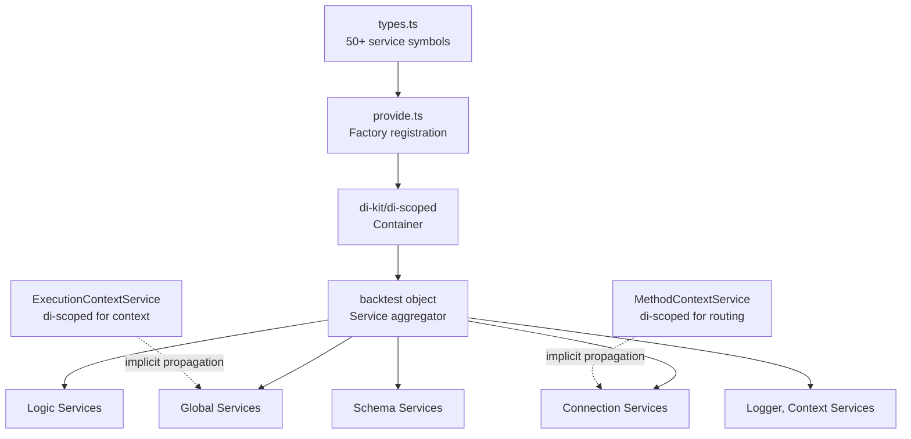
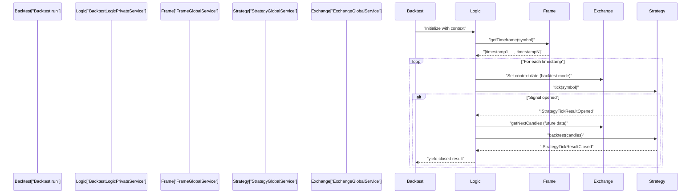
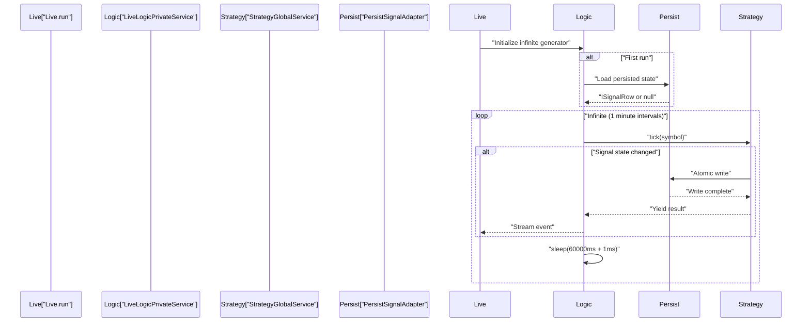

# Overview

<details>
<summary>Relevant source files</summary>

The following files were used as context for generating this wiki page:

- [README.md](README.md)
- [assets/uml.svg](assets/uml.svg)
- [docs/internals.md](docs/internals.md)
- [docs/uml.puml](docs/uml.puml)
- [scripts/_convert-md-mermaid-to-svg.cjs](scripts/_convert-md-mermaid-to-svg.cjs)
- [scripts/gpt-docs.mjs](scripts/gpt-docs.mjs)
- [scripts/uml.mjs](scripts/uml.mjs)
- [src/classes/Schedule.ts](src/classes/Schedule.ts)
- [src/index.ts](src/index.ts)
- [src/lib/services/global/WalkerGlobalService.ts](src/lib/services/global/WalkerGlobalService.ts)
- [src/lib/services/markdown/BacktestMarkdownService.ts](src/lib/services/markdown/BacktestMarkdownService.ts)
- [src/lib/services/markdown/LiveMarkdownService.ts](src/lib/services/markdown/LiveMarkdownService.ts)
- [src/lib/services/markdown/ScheduleMarkdownService.ts](src/lib/services/markdown/ScheduleMarkdownService.ts)
- [test/index.mjs](test/index.mjs)
- [test/spec/scheduled.test.mjs](test/spec/scheduled.test.mjs)
- [types.d.ts](types.d.ts)

</details>


**backtest-kit** is a production-ready TypeScript framework for backtesting and live trading algorithmic strategies. It provides crash-safe state persistence, comprehensive signal validation, memory-optimized async generators, and enterprise-grade reporting capabilities.

## Core Capabilities

The framework enables:

1. **Historical Backtesting** - Memory-efficient streaming execution against historical candle data via `Backtest.run()` and `Backtest.background()`
2. **Live Trading** - Real-time strategy execution with atomic persistence and crash recovery via `Live.run()` and `Live.background()`
3. **Signal Validation** - Automatic validation of TP/SL logic, price relationships, and timestamp constraints in [src/client/ClientStrategy.ts]()
4. **Strategy Comparison** - Multi-strategy A/B testing with metric-based ranking via `Walker.run()` and `Walker.background()`
5. **Portfolio Analytics** - Multi-symbol performance tracking with extended metrics via `Heat.getData()`
6. **Risk Management** - Portfolio-level risk controls with custom validation logic via `addRisk()`
7. **Position Sizing** - Built-in sizing methods (Fixed %, Kelly Criterion, ATR-based) via `PositionSize` class
8. **Scheduled Signals** - Limit order tracking with cancellation rate analytics via `Schedule.getData()`
9. **Pluggable Integration** - Custom exchange data sources and persistence backends via schema registration

**Sources:** [README.md:1-50](), [types.d.ts:1-85](), [src/index.ts:1-131]()

---

## System Architecture

The framework implements a six-layer clean architecture with dependency injection:

### High-Level System Diagram



### Layer Responsibilities

| Layer | Purpose | Key Components | Location |
|-------|---------|----------------|----------|
| **User Interface** | Public API exports and utility classes | `Backtest`, `Live`, `Walker`, `Heat`, `Schedule`, `PositionSize` | [src/classes/](), [src/function/]() |
| **Registry & Validation** | Schema storage and validation logic | `*SchemaService`, `*ValidationService` | [src/lib/services/schema/](), [src/lib/services/validation/]() |
| **Execution Engine** | Core orchestration and business logic | `*LogicPrivateService`, `*GlobalService`, `*ConnectionService`, `Client*` classes | [src/lib/services/logic/](), [src/lib/services/global/](), [src/lib/services/connection/](), [src/client/]() |
| **State Management** | Crash-safe persistence and configuration | `PersistSignalAdapter`, `PersistRiskAdapter`, `GLOBAL_CONFIG` | [src/classes/Persist.ts](), [src/config/params.ts]() |
| **Event System** | Pub-sub for observability | `signalEmitter`, `doneEmitter`, `errorEmitter`, `progressEmitter` | [src/config/emitters.ts]() |
| **Reporting & Analytics** | Performance metrics and markdown generation | `BacktestMarkdownService`, `LiveMarkdownService`, etc. | [src/lib/services/markdown/]() |

**Sources:** [src/index.ts:1-131](), [src/classes/Backtest.ts:1-50](), [src/classes/Live.ts:1-50](), [src/classes/Walker.ts:1-50](), [src/classes/Heat.ts:1-50](), [src/classes/Schedule.ts:1-50](), [src/classes/PositionSize.ts:1-50](), [src/lib/services/]()

---

## Execution Modes

The framework provides three primary execution modes with distinct characteristics:

### Execution Mode Comparison

```mermaid
graph TB
    subgraph Backtest["Backtest Mode - Historical Simulation"]
        BT_Entry["Backtest.run/background<br/>src/classes/Backtest.ts"]
        BT_Logic["BacktestLogicPrivateService<br/>src/lib/services/logic/private"]
        BT_Frame["ClientFrame.getTimeframe<br/>src/client/ClientFrame.ts"]
        BT_Strategy["ClientStrategy.tick<br/>ClientStrategy.backtest<br/>src/client/ClientStrategy.ts"]
        BT_Report["BacktestMarkdownService<br/>src/lib/services/markdown"]
        
        BT_Entry --> BT_Logic
        BT_Logic --> BT_Frame
        BT_Logic --> BT_Strategy
        BT_Strategy --> BT_Report
    end
    
    subgraph Live["Live Mode - Real-time Trading"]
        LV_Entry["Live.run/background<br/>src/classes/Live.ts"]
        LV_Logic["LiveLogicPrivateService<br/>src/lib/services/logic/private"]
        LV_Strategy["ClientStrategy.tick<br/>src/client/ClientStrategy.ts"]
        LV_Persist["PersistSignalAdapter<br/>src/classes/Persist.ts"]
        LV_Report["LiveMarkdownService<br/>src/lib/services/markdown"]
        
        LV_Entry --> LV_Logic
        LV_Logic --> LV_Strategy
        LV_Strategy --> LV_Persist
        LV_Strategy --> LV_Report
    end
    
    subgraph Walker["Walker Mode - Strategy Comparison"]
        WK_Entry["Walker.run/background<br/>src/classes/Walker.ts"]
        WK_Logic["WalkerLogicPrivateService<br/>src/lib/services/logic/private"]
        WK_Backtest["Runs Backtest.run<br/>for each strategy"]
        WK_Compare["Metric-based ranking<br/>Sharpe/WinRate/PnL"]
        WK_Report["WalkerMarkdownService<br/>src/lib/services/markdown"]
        
        WK_Entry --> WK_Logic
        WK_Logic --> WK_Backtest
        WK_Backtest --> WK_Compare
        WK_Compare --> WK_Report
    end
```



| Mode | Entry Point | Execution Pattern | Output | Use Case |
|------|-------------|-------------------|--------|----------|
| **Backtest** | `Backtest.run(symbol, {strategyName, exchangeName, frameName})` | Finite loop over historical timeframes | `IStrategyTickResultClosed` only | Strategy validation with historical data |
| **Live** | `Live.run(symbol, {strategyName, exchangeName})` | Infinite loop with 1-minute intervals | `IStrategyTickResult` (idle/opened/active/closed) | Real-time trading with crash recovery |
| **Walker** | `Walker.run(symbol, {walkerName})` | Iterates strategies, runs Backtest for each | `IWalkerResults` with ranked strategies | A/B testing and strategy selection |

### Key Differences

**Backtest Mode:**
- Uses `ClientStrategy.backtest(candles)` for fast-forward simulation
- Generates timeframes via `ClientFrame.getTimeframe()` based on `IFrameSchema`
- No persistence required (stateless)
- Memory-efficient streaming via async generators

**Live Mode:**
- Uses only `ClientStrategy.tick()` with real-time VWAP from `ClientExchange.getAveragePrice()`
- Atomic persistence via `PersistSignalAdapter.writeValue()` at state transitions
- Crash recovery via `waitForInit()` pattern in [src/client/ClientStrategy.ts]()
- Interval throttling via `_lastSignalTimestamp` checks

**Walker Mode:**
- Orchestrates multiple `Backtest.run()` executions
- Compares strategies using configurable metrics: `sharpeRatio`, `winRate`, `avgPnl`, `totalPnl`, `certaintyRatio`, `expectedYearlyReturns`
- Emits progress events via `progressEmitter` in [src/config/emitters.ts]()
- Generates comparison reports via `WalkerMarkdownService`

**Sources:** [types.d.ts:515-560](), [src/classes/Backtest.ts](), [src/classes/Live.ts](), [src/classes/Walker.ts](), [src/lib/services/logic/private/BacktestLogicPrivateService.ts](), [src/lib/services/logic/private/LiveLogicPrivateService.ts](), [src/lib/services/logic/private/WalkerLogicPrivateService.ts](), [README.md:338-459]()

---

## Core Components

### Client Layer (Business Logic)

The client layer contains pure business logic without dependency injection:



| Component | Responsibility | Key Methods |
|-----------|----------------|-------------|
| `ClientStrategy` | Signal lifecycle, validation, TP/SL monitoring | `tick()`, `backtest()`, `getSignal()` |
| `ClientExchange` | Candle data fetching, VWAP calculation | `getCandles()`, `getAveragePrice()` |
| `ClientFrame` | Timeframe generation for backtesting | `getTimeframe()` |
| `PersistSignalAdapter` | Crash-safe signal persistence | `write()`, `read()` |

**Sources:** [types.d.ts:519-543](), [types.d.ts:173-221](), [types.d.ts:291-308]()

### Service Orchestration Layer

The service layer handles dependency injection and routing:



**Service Types:**

1. **Schema Services** - Registry for user configurations
   - `StrategySchemaService`, `ExchangeSchemaService`, `FrameSchemaService`
   - Store schemas registered via `addStrategy()`, `addExchange()`, `addFrame()`

2. **Connection Services** - Memoized client instance creators
   - `StrategyConnectionService`, `ExchangeConnectionService`, `FrameConnectionService`
   - Create and cache client instances

3. **Global Services** - Context-aware wrappers
   - `StrategyGlobalService`, `ExchangeGlobalService`, `FrameGlobalService`
   - Inject `ExecutionContextService` into operations

4. **Logic Services** - Execution orchestration
   - `BacktestLogicPrivateService`, `LiveLogicPrivateService`
   - Implement async generator loops

**Sources:** [types.d.ts:310-351](), [types.d.ts:84-96]()

For detailed service layer documentation, see [Service Layer](#5).

---

## Signal Lifecycle

Signals transition through six states in a type-safe discriminated union:

### Signal State Machine



### Signal Type Hierarchy

The framework defines signal states as a discriminated union in [types.d.ts:654-770]():

```typescript
type IStrategyTickResult = 
  | IStrategyTickResultIdle         // action: "idle"
  | IStrategyTickResultScheduled    // action: "scheduled" (new in v1.x)
  | IStrategyTickResultOpened       // action: "opened"
  | IStrategyTickResultActive       // action: "active"
  | IStrategyTickResultClosed       // action: "closed"
  | IStrategyTickResultCancelled    // action: "cancelled" (new in v1.x)
```

| State | When Yielded | Key Properties | Lifecycle Callbacks |
|-------|--------------|----------------|---------------------|
| `idle` | Live: always when no signal, Backtest: never | `signal: null`, `currentPrice` | `onIdle()` |
| `scheduled` | Both: when `priceOpen` specified in `ISignalDto` | `signal: IScheduledSignalRow`, `currentPrice` | `onSchedule()` |
| `opened` | Both: when position activated | `signal: ISignalRow`, `currentPrice` | `onOpen()` |
| `active` | Live: every tick while monitoring, Backtest: never | `signal: ISignalRow`, `currentPrice` | `onActive()` |
| `closed` | Both: when TP/SL/time triggered | `pnl: IStrategyPnL`, `closeReason`, `closeTimestamp` | `onClose()` |
| `cancelled` | Both: when scheduled signal times out or SL hit before entry | `signal: IScheduledSignalRow`, `closeTimestamp` | `onCancel()` |

### Scheduled Signal Behavior

When `getSignal()` returns `ISignalDto` with `priceOpen` specified:
1. Signal enters `scheduled` state with `_isScheduled: true` flag
2. Framework monitors `currentPrice` against `priceOpen` each tick
3. **Activation:** If price reaches `priceOpen`, signal transitions to `opened`
4. **Cancellation:** If timeout (`CC_SCHEDULE_AWAIT_MINUTES`) or `priceStopLoss` hit first, signal transitions to `cancelled`
5. **Tracking:** Schedule statistics available via `Schedule.getData()` in [src/classes/Schedule.ts]()

**Sources:** [types.d.ts:542-770](), [src/client/ClientStrategy.ts](), [src/classes/Schedule.ts:1-135](), [README.md:54-82]()

---

## Configuration System

The framework uses a registration-then-execution pattern:



### Registration APIs

| Function | Purpose | Interface |
|----------|---------|-----------|
| `addStrategy()` | Register trading strategy | [IStrategySchema]() |
| `addExchange()` | Register data source | [IExchangeSchema]() |
| `addFrame()` | Register timeframe generator | [IFrameSchema]() |

**Key Characteristics:**
- **Separation:** Registration at startup, instantiation at runtime
- **Memoization:** One instance per schema name
- **Routing:** `MethodContextService` provides schema names for lookup
- **Flexibility:** Multiple strategies/exchanges can coexist

**Sources:** [types.d.ts:546-646](), [src/index.ts:1-11]()

For configuration details, see [Configuration Functions](#3.1).

---

## Dependency Injection Architecture

The framework uses symbol-based dependency injection with scoped context propagation:



### Context Propagation

The framework uses **di-scoped** for implicit context passing:

1. **ExecutionContextService** - Provides `{symbol, when, backtest}` to operations
2. **MethodContextService** - Provides `{strategyName, exchangeName, frameName}` for routing

**Benefits:**
- No manual parameter threading
- Type-safe context access
- Scoped to async execution boundaries

**Sources:** [types.d.ts:57-96](), [types.d.ts:310-351]()

For DI system details, see [Dependency Injection System](#2.2).

---

## Technology Stack

### Core Dependencies

| Package | Version | Purpose |
|---------|---------|---------|
| `di-kit` | ^1.0.18 | Symbol-based dependency injection container |
| `di-scoped` | ^1.0.20 | Scoped context propagation for async operations |
| `functools-kit` | ^1.0.93 | Functional utilities (singleshot, queued, memoize) |
| `get-moment-stamp` | ^1.1.1 | Timestamp utilities for candle intervals |

**Sources:** [package.json:73-78]()

### Build System

- **Bundler:** Rollup with TypeScript plugin
- **Output:** CommonJS (`build/index.cjs`) and ESM (`build/index.mjs`)
- **Types:** Single declaration file (`types.d.ts`)
- **Target:** Node.js with TypeScript 5.0+

**Sources:** [package.json:40-57]()

---

## Data Flow Overview

### Backtest Execution Flow



**Sources:** Referenced in high-level diagrams provided

### Live Execution Flow



**Sources:** Referenced in high-level diagrams provided

---

## Memory and Performance

The framework is optimized for production use:

### Memory Efficiency

1. **Async Generators** - Stream results without accumulation
2. **Prototype Methods** - Shared methods across instances
3. **Memoization** - Cache client instances per schema name
4. **No State Accumulation** - Logic services are stateless

### Performance Characteristics

| Feature | Technique | Benefit |
|---------|-----------|---------|
| Client instances | Memoization via `ConnectionServices` | One instance per schema name |
| Backtest streaming | Async generator | Early termination possible |
| Context propagation | `di-scoped` | No parameter threading overhead |
| Persistence | Atomic file writes | Crash safety without performance penalty |

**Sources:** [README.md:18-19](), [README.md:618-629]()

---

## Error Handling

The framework provides comprehensive validation and error handling:

### Signal Validation

Signals are validated automatically in `ClientStrategy`:
- Price validation (positive values)
- TP/SL logic validation (correct relative positions)
- Timestamp validation (positive values)
- Position type validation ("long" or "short")

**Validation Location:** [ClientStrategy.ts]() signal validation logic

### Persistence Errors

- Atomic file writes prevent partial writes
- Automatic retry logic for file operations
- Corrupted file detection and cleanup

**Persistence Location:** [src/classes/Persist.ts]()

**Sources:** [types.d.ts:361-392](), [README.md:210-242]()

For error handling patterns, see [Error Handling](#10.2).

---

## Next Steps

To use the framework:

1. **Installation:** `npm install backtest-kit` - see [Installation and Setup](#1.2)
2. **Configuration:** Register schemas with `addStrategy()`, `addExchange()`, `addFrame()` - see [Configuration Functions](#3.1)
3. **Backtesting:** Use `Backtest.run()` for historical testing - see [Backtest API](#3.2)
4. **Live Trading:** Use `Live.run()` for production deployment - see [Live Trading API](#3.3)
5. **Reporting:** Generate markdown reports with `getReport()` and `dump()` - see [Reporting and Analytics](#9)

**Sources:** [README.md:22-169](), [src/index.ts:1-56]()