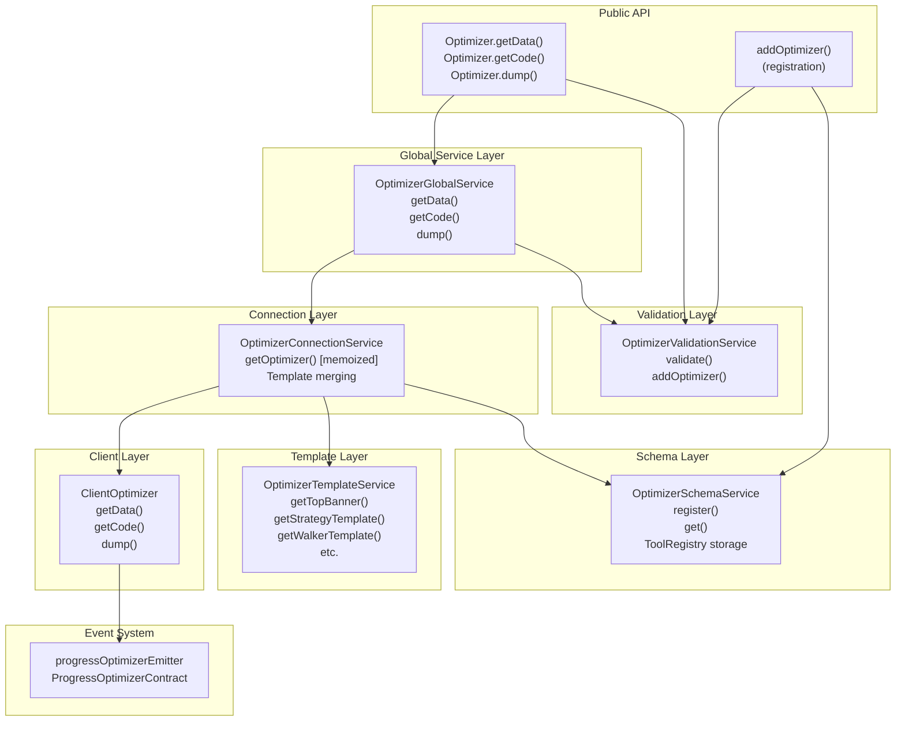
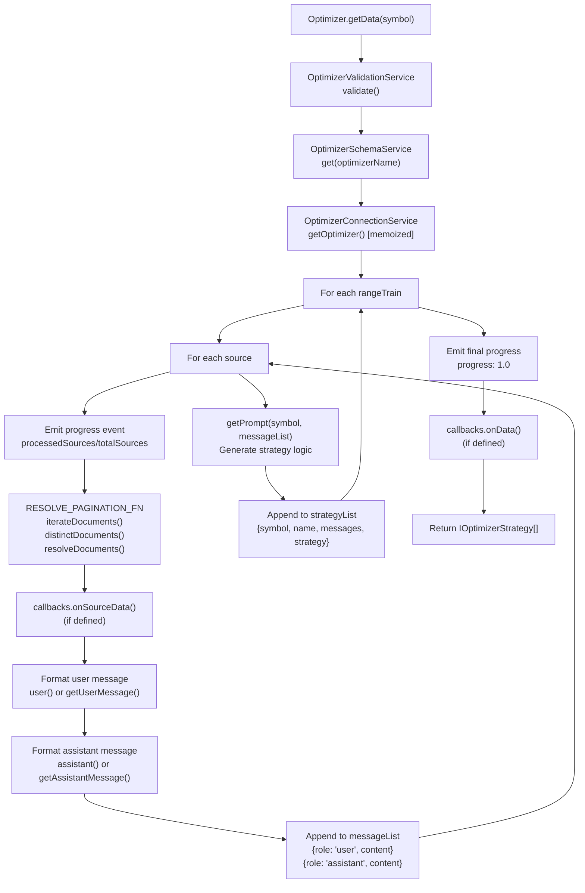
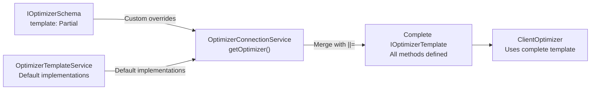
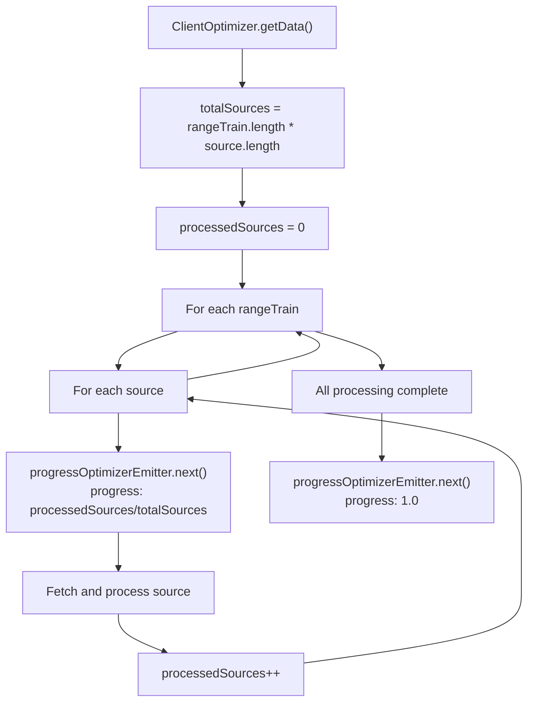

# Optimizer Mode

**Purpose**: This page documents the Optimizer execution mode, which generates executable trading strategies using Large Language Model (LLM) integration. Unlike other execution modes that run strategies directly, Optimizer Mode produces complete strategy code files by collecting multi-timeframe historical data, formatting it for LLM consumption via the Ollama API, and assembling executable `.mjs` files with integrated Walker-based backtesting.

For information about executing strategies in historical simulation, see [Backtest Mode](./17-backtest-mode.md). For comparing multiple strategies, see [Walker Mode](./19-walker-mode.md). For LLM-based strategy definition, see [Defining Strategies](./12-defining-strategies.md).

---

## Overview

Optimizer Mode is a code generation system that bridges historical market data with LLM-powered strategy logic. The system fetches data from configurable sources (such as pre-computed technical indicators), formats it into LLM conversation messages, generates strategy prompts via Ollama API, and assembles complete executable JavaScript modules.

The generated code includes:
- Exchange configuration with CCXT integration
- Training and testing frame definitions
- Multiple strategy variants (one per training period)
- Walker configuration for strategy comparison
- Event listeners and progress tracking
- Helper functions for LLM interaction and debug logging

**Key Characteristics**:
- **Generative**: Produces code artifacts rather than execution results
- **Multi-Source**: Fetches data from multiple configurable sources with pagination
- **Multi-Timeframe**: Typically processes 1m, 15m, 30m, 1h candle data
- **Template-Based**: Uses customizable templates for each code section
- **LLM-Integrated**: Communicates with Ollama API for strategy generation

---

## Optimizer Schema Registration

Optimizer configurations are registered via `addOptimizer()` function, which accepts an `IOptimizerSchema` object defining data sources, time ranges, and code generation logic.

### Registration API

```typescript
addOptimizer({
  optimizerName: "my-optimizer",
  rangeTrain: [
    {
      note: "Training period 1",
      startDate: new Date("2025-11-24T00:00:00Z"),
      endDate: new Date("2025-11-24T23:59:59Z"),
    },
    // Additional training periods...
  ],
  rangeTest: {
    note: "Testing period",
    startDate: new Date("2025-12-01T00:00:00Z"),
    endDate: new Date("2025-12-01T23:59:59Z"),
  },
  source: [
    {
      name: "1h-candles",
      fetch: async ({ symbol, startDate, endDate, limit, offset }) => {
        // Fetch paginated data with unique IDs
        return data;
      },
      user: (symbol, data, name) => {
        // Format data as user message for LLM
        return markdownTable;
      },
      assistant: () => {
        // Format acknowledgment as assistant message
        return "Data received";
      }
    }
  ],
  getPrompt: async (symbol, messages) => {
    // Generate strategy logic from conversation history
    const ollama = new Ollama({ /* ... */ });
    const response = await ollama.chat({ messages });
    return response.message.content;
  },
  template: {
    // Optional template overrides
  },
  callbacks: {
    onData: (symbol, strategyData) => { /* ... */ },
    onCode: (symbol, code) => { /* ... */ },
    onDump: (symbol, filepath) => { /* ... */ }
  }
});
```

### Schema Structure

| Field | Type | Description |
|-------|------|-------------|
| `optimizerName` | `string` | Unique identifier for this optimizer |
| `rangeTrain` | `IOptimizerRange[]` | Training time ranges (one strategy per range) |
| `rangeTest` | `IOptimizerRange` | Testing time range for Walker validation |
| `source` | `Source[]` | Data sources with fetch and format functions |
| `getPrompt` | `function` | Generates strategy logic from conversation |
| `template` | `Partial<IOptimizerTemplate>` | Optional template overrides |
| `callbacks` | `Partial<IOptimizerCallbacks>` | Lifecycle event hooks |

Each `IOptimizerRange` contains:
- `startDate`: Start of data collection period (inclusive)
- `endDate`: End of data collection period (inclusive)
- `note`: Optional description

Each `Source` can be either:
- A simple fetch function: `(args: IOptimizerFetchArgs) => Data[]`
- A full configuration object with `name`, `fetch`, `user`, `assistant` fields

### Data Source Requirements

All data returned by `fetch` functions must implement `IOptimizerData`:

```typescript
interface IOptimizerData {
  id: string | number; // Unique identifier for deduplication
}
```

The `fetch` function receives paginated query parameters:

```typescript
interface IOptimizerFetchArgs {
  symbol: string;
  startDate: Date;
  endDate: Date;
  limit: number;  // Max records per request (default: 25)
  offset: number; // Records to skip for pagination
}
```

The system automatically handles pagination using `iterateDocuments` from `functools-kit`, fetching all available data and deduplicating by `id` field.

---

## System Architecture



**Architecture Diagram: Optimizer Mode Component Structure**

The architecture follows a layered pattern:

1. **Public API**: `addOptimizer()` for registration, `Optimizer` class for operations
2. **Validation Layer**: Maintains registry and validates optimizer existence
3. **Schema Layer**: Immutable storage using `ToolRegistry` pattern
4. **Global Service**: Entry point with validation before delegation
5. **Connection Layer**: Memoized client factory with template merging
6. **Template Layer**: Default implementations for all code generation methods
7. **Client Layer**: Core business logic for data collection and code assembly
8. **Event System**: Progress tracking via `progressOptimizerEmitter`

---

## Data Collection and Processing

The optimizer collects data through a multi-stage pipeline that iterates through training ranges and data sources, building LLM conversation history.

### Data Flow Diagram



**Data Flow Diagram: Strategy Data Collection Process**

### Pagination and Deduplication

The system uses `functools-kit` utilities for efficient data fetching:

```typescript
const RESOLVE_PAGINATION_FN = async <Data extends IOptimizerData = any>(
  fetch: IOptimizerSourceFn,
  filterData: IOptimizerFilterArgs
) => {
  const iterator = iterateDocuments<Data>({
    limit: ITERATION_LIMIT,  // 25 records per request
    async createRequest({ limit, offset }) {
      return await fetch({
        symbol: filterData.symbol,
        startDate: filterData.startDate,
        endDate: filterData.endDate,
        limit,
        offset,
      });
    },
  });
  const distinct = distinctDocuments(iterator, (data) => data.id);
  return await resolveDocuments(distinct);
};
```

This approach:
- Fetches 25 records at a time (configurable via `ITERATION_LIMIT`)
- Automatically continues pagination until no more data
- Deduplicates by `id` field to handle overlapping requests
- Returns complete resolved array

### Conversation Building

For each training range, the system builds a conversation history:

1. **Iterate Sources**: Process each source sequentially
2. **Emit Progress**: Update progress before fetching each source
3. **Fetch Data**: Call `RESOLVE_PAGINATION_FN` for complete dataset
4. **Format Messages**:
   - Call `user()` or default `getUserMessage()` for user message
   - Call `assistant()` or default `getAssistantMessage()` for assistant response
5. **Append to History**: Add user/assistant message pair to `messageList`
6. **Generate Prompt**: After all sources, call `getPrompt()` with complete conversation
7. **Store Strategy**: Save `{symbol, name, messages, strategy}` to `strategyList`

---

## Template System

The template system generates executable code sections through customizable template methods. Each template method returns a string of TypeScript/JavaScript code.

### Template Interface

```typescript
interface IOptimizerTemplate {
  getTopBanner(symbol: string): string | Promise<string>;
  getUserMessage(symbol: string, data: IOptimizerData[], name: string): string | Promise<string>;
  getAssistantMessage(symbol: string, data: IOptimizerData[], name: string): string | Promise<string>;
  getWalkerTemplate(walkerName: string, exchangeName: string, frameName: string, strategies: string[]): string | Promise<string>;
  getExchangeTemplate(symbol: string, exchangeName: string): string | Promise<string>;
  getFrameTemplate(symbol: string, frameName: string, interval: CandleInterval, startDate: Date, endDate: Date): string | Promise<string>;
  getStrategyTemplate(strategyName: string, interval: string, prompt: string): string | Promise<string>;
  getLauncherTemplate(symbol: string, walkerName: string): string | Promise<string>;
  getTextTemplate(symbol: string): string | Promise<string>;
  getJsonTemplate(symbol: string): string | Promise<string>;
  getJsonDumpTemplate(symbol: string): string | Promise<string>;
}
```

### Template Merging Process



**Template Merging Diagram: How Custom and Default Templates Combine**

The `OptimizerConnectionService.getOptimizer()` method performs template merging:

```typescript
const {
  getAssistantMessage = this.optimizerTemplateService.getAssistantMessage,
  getExchangeTemplate = this.optimizerTemplateService.getExchangeTemplate,
  // ... other methods with default fallbacks
} = rawTemplate;

const template: IOptimizerTemplate = {
  getAssistantMessage,
  getExchangeTemplate,
  // ... complete template object
};
```

This allows partial overrides - any method not provided in schema falls back to `OptimizerTemplateService` defaults.

### Default Template Implementations

The `OptimizerTemplateService` provides default implementations for all template methods:

| Method | Purpose | Example Output |
|--------|---------|----------------|
| `getTopBanner()` | Imports and constants | `#!/usr/bin/env node\nimport { Ollama } from "ollama";` |
| `getUserMessage()` | LLM user prompt | `"Прочитай данные и скажи ОК\n\n" + JSON.stringify(data)` |
| `getAssistantMessage()` | LLM acknowledgment | `"ОК"` |
| `getExchangeTemplate()` | Exchange config | `addExchange({ exchangeName, getCandles: async (...) => { ... } })` |
| `getFrameTemplate()` | Frame config | `addFrame({ frameName, interval, startDate, endDate })` |
| `getStrategyTemplate()` | Strategy with LLM | `addStrategy({ strategyName, interval, getSignal: async (...) => { ... } })` |
| `getWalkerTemplate()` | Walker config | `addWalker({ walkerName, exchangeName, frameName, strategies })` |
| `getLauncherTemplate()` | Execution code | `Walker.background(symbol, { walkerName })` |
| `getTextTemplate()` | Text LLM helper | `async function text(messages) { ... }` |
| `getJsonTemplate()` | JSON LLM helper | `async function json(messages) { ... }` |
| `getJsonDumpTemplate()` | Debug logger | `async function dumpJson(...) { ... }` |

### Strategy Template Example

The `getStrategyTemplate()` method generates multi-timeframe strategy code:

```typescript
public getStrategyTemplate = async (
  strategyName: string,
  interval: string,
  prompt: string
) => {
  const escapedPrompt = String(prompt)
    .replace(/\\/g, '\\\\')
    .replace(/`/g, '\\`')
    .replace(/\$/g, '\\$');

  return [
    `addStrategy({`,
    `    strategyName: "${strategyName}",`,
    `    interval: "${interval}",`,
    `    getSignal: async (symbol) => {`,
    `        const messages = [];`,
    ``,
    `        // Загружаем данные всех таймфреймов`,
    `        const microTermCandles = await getCandles(symbol, "1m", 30);`,
    `        const mainTermCandles = await getCandles(symbol, "5m", 24);`,
    // ... message building for each timeframe
    `        messages.push({`,
    `            role: "user",`,
    `            content: [`,
    `                "Проанализируй все таймфреймы и сгенерируй торговый сигнал...",`,
    `                "",`,
    `                \`${escapedPrompt}\`,`,
    `            ].join("\\n"),`,
    `        });`,
    ``,
    `        const result = await json(messages);`,
    `        return result;`,
    `    },`,
    `});`
  ].join("\n");
};
```

Key features:
- Fetches 1m, 5m, 15m, 1h candles via `getCandles()`
- Formats each timeframe as separate user/assistant message pair
- Includes custom strategy prompt from `getPrompt()`
- Calls `json()` helper for structured LLM output
- Returns `ISignalDto` compatible object

---

## Code Generation Process

The `getCode()` method assembles all template sections into complete executable code.

### Code Assembly Flow

```mermaid
graph TB
    START["Optimizer.getCode(symbol)"]
    GET_DATA["ClientOptimizer.getData()<br/>Fetch strategy data"]
    CREATE_PREFIX["CREATE_PREFIX_FN()<br/>Generate unique prefix"]
    
    SECTIONS["sections: string[] = []"]
    
    BANNER["1. getTopBanner()<br/>Imports and constants"]
    DUMP_HELPER["2. getJsonDumpTemplate()<br/>Debug logger function"]
    TEXT_HELPER["3. getTextTemplate()<br/>LLM text helper"]
    JSON_HELPER["4. getJsonTemplate()<br/>LLM JSON helper"]
    
    EXCHANGE["5. getExchangeTemplate()<br/>CCXT exchange config"]
    
    TRAIN_FRAMES["6. Loop rangeTrain<br/>getFrameTemplate() for each"]
    TEST_FRAME["7. getFrameTemplate()<br/>Test frame"]
    
    STRATEGIES["8. Loop strategyData<br/>getStrategyTemplate() for each"]
    
    WALKER["9. getWalkerTemplate()<br/>Walker config with all strategies"]
    LAUNCHER["10. getLauncherTemplate()<br/>Walker.background() + listeners"]
    
    JOIN["sections.join('\\n')<br/>Combine all sections"]
    
    CALLBACK["callbacks.onCode()<br/>(if defined)"]
    RETURN["Return complete code string"]
    
    START --> GET_DATA
    GET_DATA --> CREATE_PREFIX
    CREATE_PREFIX --> SECTIONS
    
    SECTIONS --> BANNER
    BANNER --> DUMP_HELPER
    DUMP_HELPER --> TEXT_HELPER
    TEXT_HELPER --> JSON_HELPER
    
    JSON_HELPER --> EXCHANGE
    
    EXCHANGE --> TRAIN_FRAMES
    TRAIN_FRAMES --> TEST_FRAME
    
    TEST_FRAME --> STRATEGIES
    
    STRATEGIES --> WALKER
    WALKER --> LAUNCHER
    
    LAUNCHER --> JOIN
    JOIN --> CALLBACK
    CALLBACK --> RETURN
```



**Code Assembly Diagram: How Template Sections Are Combined**

### Naming Convention

All generated entities use a unique prefix to avoid conflicts:

```typescript
const prefix = CREATE_PREFIX_FN(); // e.g., "a7f3k2"

const exchangeName = `${prefix}_exchange`;       // "a7f3k2_exchange"
const trainFrameName = `${prefix}_train_frame-1`; // "a7f3k2_train_frame-1"
const testFrameName = `${prefix}_test_frame`;     // "a7f3k2_test_frame"
const strategyName = `${prefix}_strategy-1`;      // "a7f3k2_strategy-1"
const walkerName = `${prefix}_walker`;            // "a7f3k2_walker"
```

The prefix is generated using: `(Math.random() + 1).toString(36).substring(7)`

### Generated Code Structure

The final code has this structure:

```
#!/usr/bin/env node

// Imports (Ollama, ccxt, backtest-kit, fs, uuid, path)
import { Ollama } from "ollama";
import ccxt from "ccxt";
import { addExchange, addStrategy, addFrame, addWalker, Walker, ... } from "backtest-kit";

const WARN_KB = 100;

// Helper: dumpJson() - Saves LLM conversations to ./dump/strategy/{resultId}/
async function dumpJson(resultId, history, result, outputDir = "./dump/strategy") { ... }

// Helper: text() - LLM text generation via Ollama
async function text(messages) { ... }

// Helper: json() - LLM structured output with signal schema
async function json(messages) { ... }

// Exchange configuration
addExchange({
    exchangeName: "a7f3k2_exchange",
    getCandles: async (symbol, interval, since, limit) => { ... },
    formatPrice: async (symbol, price) => price.toFixed(2),
    formatQuantity: async (symbol, quantity) => quantity.toFixed(8),
});

// Training frames (one per rangeTrain)
addFrame({ frameName: "a7f3k2_train_frame-1", interval: "1m", startDate: ..., endDate: ... });
addFrame({ frameName: "a7f3k2_train_frame-2", interval: "1m", startDate: ..., endDate: ... });

// Test frame (from rangeTest)
addFrame({ frameName: "a7f3k2_test_frame", interval: "1m", startDate: ..., endDate: ... });

// Strategies (one per training range/source)
addStrategy({
    strategyName: "a7f3k2_strategy-1",
    interval: "5m",
    getSignal: async (symbol) => {
        // Multi-timeframe data fetching
        const microTermCandles = await getCandles(symbol, "1m", 30);
        const mainTermCandles = await getCandles(symbol, "5m", 24);
        // ... message building
        const result = await json(messages);
        return result;
    },
});
addStrategy({ strategyName: "a7f3k2_strategy-2", ... });

// Walker configuration
addWalker({
    walkerName: "a7f3k2_walker",
    exchangeName: "a7f3k2_exchange",
    frameName: "a7f3k2_test_frame",
    strategies: ["a7f3k2_strategy-1", "a7f3k2_strategy-2"],
});

// Launcher with event listeners
Walker.background("BTCUSDT", { walkerName: "a7f3k2_walker" });
listenSignalBacktest((event) => { ... });
listenWalkerComplete((results) => { ... });
```

---

## Public API Methods

The `Optimizer` class provides three main methods for interacting with the optimizer system.

### Optimizer.getData()

Fetches data from all sources and generates strategy metadata without generating code:

```typescript
const strategies = await Optimizer.getData("BTCUSDT", {
  optimizerName: "my-optimizer"
});

// Returns: IOptimizerStrategy[]
// [
//   {
//     symbol: "BTCUSDT",
//     name: "1h-candles",
//     messages: [
//       { role: "user", content: "..." },
//       { role: "assistant", content: "..." },
//       // ... more messages
//     ],
//     strategy: "Trading strategy prompt..."
//   },
//   // ... more strategies (one per training range)
// ]
```

Useful for:
- Inspecting generated strategy prompts
- Debugging data source formatting
- Validating conversation history
- Testing `getPrompt()` output

### Optimizer.getCode()

Generates complete executable strategy code as a string:

```typescript
const code = await Optimizer.getCode("BTCUSDT", {
  optimizerName: "my-optimizer"
});

// Returns: string (complete .mjs file content)
// Can be executed directly or written to file
```

This method:
1. Calls `getData()` internally
2. Generates all template sections
3. Combines sections with newlines
4. Invokes `callbacks.onCode()` if defined
5. Returns complete code string

### Optimizer.dump()

Generates code and writes it to the file system:

```typescript
await Optimizer.dump("BTCUSDT", {
  optimizerName: "my-optimizer"
}, "./output");

// Creates: ./output/my-optimizer_BTCUSDT.mjs
```

File naming: `{optimizerName}_{symbol}.mjs`

This method:
1. Calls `getCode()` internally
2. Creates output directory (recursive)
3. Writes file with UTF-8 encoding
4. Invokes `callbacks.onDump()` if defined
5. Logs success/failure via logger

Default path: `./` (current directory)

---

## Progress Monitoring

The optimizer emits progress events during data collection to track source processing.

### Progress Event Structure

```typescript
interface ProgressOptimizerContract {
  optimizerName: string;      // Optimizer being executed
  symbol: string;             // Trading symbol (e.g., "BTCUSDT")
  totalSources: number;       // Total sources to process
  processedSources: number;   // Sources processed so far
  progress: number;           // Completion (0.0 to 1.0)
}
```

### Listening to Progress

```typescript
import { listenOptimizerProgress } from "backtest-kit";

const unsubscribe = listenOptimizerProgress((event) => {
  console.log(`Progress: ${(event.progress * 100).toFixed(2)}%`);
  console.log(`Processed: ${event.processedSources} / ${event.totalSources}`);
  console.log(`Optimizer: ${event.optimizerName}, Symbol: ${event.symbol}`);
});

// Later: stop listening
unsubscribe();
```

Progress is emitted:
1. **Before each source** is fetched (start of processing)
2. **After all sources** are complete (final 100% event)

Calculation: `progress = processedSources / totalSources`

Total sources: `rangeTrain.length * source.length`

### Event Flow Diagram



**Progress Event Flow: Tracking Source Processing**

---

## Demo Application Example

The demo application at `demo/optimization` demonstrates real-world optimizer usage with pre-computed technical indicators.

### Configuration

```javascript
// Training ranges (7 days)
const TRAIN_RANGE = [
  {
    note: "24 ноября 2025",
    startDate: new Date("2025-11-24T00:00:00Z"),
    endDate: new Date("2025-11-24T23:59:59Z"),
  },
  // ... 6 more training days
];

// Testing range (1 day)
const TEST_RANGE = {
  note: "1 декабря 2025",
  startDate: new Date("2025-12-01T00:00:00Z"),
  endDate: new Date("2025-12-01T23:59:59Z"),
};

// Data sources (4 timeframes)
const SOURCE_LIST = [
  {
    name: "long-term-range",
    fetch: async ({ symbol, startDate, endDate, limit, offset }) => {
      const url = new URL(`${process.env.CCXT_DUMPER_URL}/view/long-term-range`);
      url.searchParams.set("symbol", symbol);
      url.searchParams.set("startDate", startDate.getTime());
      url.searchParams.set("endDate", endDate.getTime());
      url.searchParams.set("limit", limit || 1000);
      url.searchParams.set("offset", offset || 0);
      const { rows: data } = await fetchApi(url);
      return data;
    },
    user: (symbol, data) => 
      str.newline(
        `# 1-Hour Candles Trading Analysis for ${symbol}\n\n`,
        arrayToMarkdownTable(data),
        // ... metadata about indicators
      ),
    assistant: () => "Исторические данные 1-часовых свечей получены",
  },
  // ... 3 more sources (30m, 15m, 1m)
];
```

### Integration with CCXT Dumper

The demo relies on `CCXT_DUMPER_URL` environment variable pointing to a pre-computation service:

```
CCXT_DUMPER_URL=http://localhost:3000
OLLAMA_API_KEY=your_api_key
```

The dumper service provides endpoints for each timeframe:
- `/view/long-term-range` - 1-hour candles with indicators
- `/view/swing-term-range` - 30-minute candles with indicators
- `/view/short-term-range` - 15-minute candles with indicators
- `/view/micro-term-range` - 1-minute candles with indicators

Each endpoint returns JSON with paginated technical indicators (RSI, MACD, Bollinger Bands, etc.)

### Prompt Generation

The demo uses Ollama API to generate strategy recommendations:

```javascript
getPrompt: async (symbol, messages) => {
  const ollama = new Ollama({
    host: "https://ollama.com",
    headers: {
      Authorization: `Bearer ${process.env.OLLAMA_API_KEY}`,
    },
  });

  const response = await ollama.chat({
    model: "deepseek-v3.1:671b",
    messages: [
      {
        role: "system",
        content: [
          "В ответ напиши торговую стратегию где нет ничего лишнего,",
          "только отчёт готовый для копипасты целиком",
          "",
          "**ВАЖНО**: Не здоровайся, не говори что делаешь - только отчёт!"
        ].join("\n"),
      },
      ...messages,
      {
        role: "user",
        content: [
          `На каких условиях мне купить ${symbol}?`,
          "Дай анализ рынка на основе поддержки/сопротивления, точек входа в LONG/SHORT позиции.",
          "Какой RR ставить для позиций?",
          // ...
        ].join("\n")
      }
    ]
  });

  return response.message.content.trim()
    .replace(/\\/g, '\\\\')
    .replace(/`/g, '\\`')
    .replace(/\$/g, '\\$')
    .replace(/"/g, '\\"');
}
```

The prompt asks the LLM to:
1. Analyze multi-timeframe data
2. Identify support/resistance levels
3. Determine LONG/SHORT entry points
4. Calculate risk/reward ratios
5. Provide strategic recommendations

### Execution

```bash
cd demo/optimization
npm install
npm start
```

This:
1. Registers optimizer with `addOptimizer()`
2. Calls `Optimizer.dump("BTC/USDT", "btc-optimizer")`
3. Generates file: `./btc-optimizer_BTC/USDT.mjs`
4. Logs progress to console

---

## Key Implementation Details

### Security: String Escaping

All template methods escape user input to prevent code injection:

```typescript
// Escape special characters for safe string interpolation
const escapedStrategyName = String(strategyName)
  .replace(/\\/g, '\\\\')
  .replace(/"/g, '\\"');

const escapedPrompt = String(plainPrompt)
  .replace(/\\/g, '\\\\')
  .replace(/`/g, '\\`')
  .replace(/\$/g, '\\$');
```

This prevents malicious input in:
- Optimizer names
- Strategy names
- Exchange names
- Frame names
- Strategy prompts
- User messages

### Memory Efficiency: Generator Pattern

While optimizer doesn't use generators (returns complete code), it processes data incrementally:
- Fetches sources one at a time
- Builds conversation incrementally
- Emits progress events during processing
- Doesn't load all training data into memory simultaneously

### Memoization: Client Caching

`OptimizerConnectionService.getOptimizer()` is memoized by `optimizerName`:

```typescript
public getOptimizer = memoize(
  ([optimizerName]) => `${optimizerName}`,
  (optimizerName: OptimizerName) => {
    // ... create ClientOptimizer instance
  }
);
```

This ensures:
- One `ClientOptimizer` instance per optimizer
- Template merging happens once
- Repeated calls reuse same instance
- Memory efficient for multiple operations on same optimizer

### File System: Atomic Writes

The `dump()` method uses standard Node.js file system operations:

```typescript
const dir = join(process.cwd(), path);
await mkdir(dir, { recursive: true });

const filename = `${self.params.optimizerName}_${symbol}.mjs`;
const filepath = join(dir, filename);

await writeFile(filepath, report, "utf-8");
```

While not truly atomic, it:
- Creates directories recursively
- Writes complete file in single operation
- Uses UTF-8 encoding for cross-platform compatibility
- Logs errors for debugging

---

## Related Documentation

- For executing the generated code, see [Walker Mode](./19-walker-mode.md)
- For backtest execution mechanics, see [Backtest Mode](./17-backtest-mode.md)
- For strategy definition patterns, see [Defining Strategies](./12-defining-strategies.md)
- For data fetching and VWAP calculation, see [Exchange Configuration](./22-exchange-configuration.md)
- For event system usage, see [Event-Driven Architecture](./05-event-driven-architecture.md)

