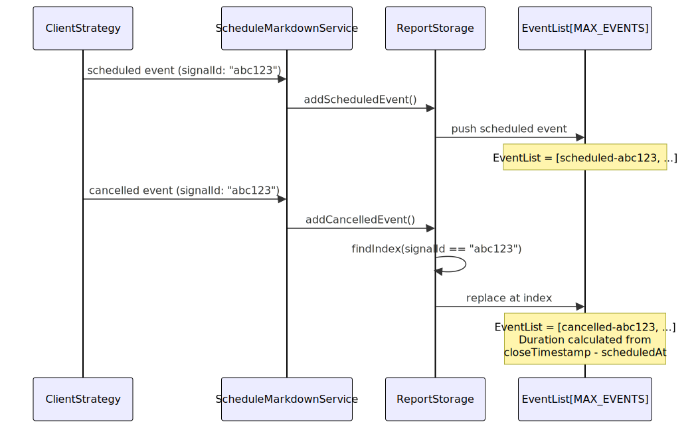

# Schedule API

## Purpose and Scope

The Schedule API provides analysis and reporting for scheduled signals (limit orders) in the backtest-kit framework. Scheduled signals are signals that specify a `priceOpen` entry price different from the current market price, requiring the strategy to wait for price activation. This API tracks scheduled signal creation, cancellation events, and provides metrics like cancellation rate and average wait time.

For information about the signal lifecycle including scheduled state transitions, see [Signal Lifecycle](./46_Signal_Lifecycle.md). For general strategy execution methods, see [Backtest API](./17_Backtest_API.md) and [Live Trading API](./18_Live_Trading_API.md).


---

## Scheduled Signal Lifecycle

Scheduled signals represent limit orders that wait for price to reach a specific entry point before activation. Unlike immediate signals that open at current market price, scheduled signals remain in a pending state until activation conditions are met or cancellation occurs.

### Lifecycle State Machine


---

## Core Methods

The Schedule API is exposed through a service interface with three primary methods for data access, report generation, and file persistence.

### Method Signatures


---

## getData Method

Retrieves statistical data for scheduled signals, including cancellation rate and average wait time for cancelled signals.

### Signature

```typescript
getData(symbol: string, strategyName: StrategyName): Promise<ScheduleStatistics>
```

### Parameters

| Parameter | Type | Description |
|-----------|------|-------------|
| `symbol` | `string` | Trading pair symbol (e.g., "BTCUSDT") |
| `strategyName` | `StrategyName` | Strategy name registered via `addStrategy` |

### Return Value

Returns `ScheduleStatistics` interface with the following fields:

| Field | Type | Description |
|-------|------|-------------|
| `eventList` | `ScheduledEvent[]` | Array of all scheduled/cancelled events |
| `totalEvents` | `number` | Total number of events (scheduled + cancelled) |
| `totalScheduled` | `number` | Count of scheduled signals created |
| `totalCancelled` | `number` | Count of cancelled signals |
| `cancellationRate` | `number \| null` | Percentage of scheduled signals that were cancelled (0-100), null if no scheduled signals |
| `avgWaitTime` | `number \| null` | Average waiting time for cancelled signals in minutes, null if no cancelled signals |

### Usage Example

```typescript
import { Schedule } from "backtest-kit";

// After running backtest or live trading with scheduled signals
const stats = await Schedule.getData("BTCUSDT", "my-strategy");

console.log(`Total scheduled: ${stats.totalScheduled}`);
console.log(`Total cancelled: ${stats.totalCancelled}`);
console.log(`Cancellation rate: ${stats.cancellationRate}%`);
console.log(`Average wait time: ${stats.avgWaitTime} minutes`);

// Access raw event data
stats.eventList.forEach(event => {
  if (event.action === "cancelled") {
    console.log(`Cancelled signal ${event.signalId} after ${event.duration} minutes`);
  }
});
```


---

## getReport Method

Generates a human-readable markdown report with detailed event tables and summary statistics.

### Signature

```typescript
getReport(symbol: string, strategyName: StrategyName): Promise<string>
```

### Parameters

| Parameter | Type | Description |
|-----------|------|-------------|
| `symbol` | `string` | Trading pair symbol |
| `strategyName` | `StrategyName` | Strategy name |

### Return Value

Returns a markdown-formatted string containing:
- Header with strategy name
- Table of all scheduled/cancelled events
- Summary statistics (total events, cancellation rate, average wait time)

### Report Format

The markdown report includes the following columns:

| Column | Description |
|--------|-------------|
| Timestamp | Event creation timestamp (ISO 8601) |
| Action | `SCHEDULED` or `CANCELLED` |
| Symbol | Trading pair |
| Signal ID | Unique signal identifier |
| Position | `LONG` or `SHORT` |
| Note | Optional signal description |
| Current Price | Market price at event time |
| Entry Price | Scheduled `priceOpen` |
| Take Profit | TP level |
| Stop Loss | SL level |
| Wait Time (min) | Duration before cancellation (cancelled events only) |

### Usage Example

```typescript
import { Schedule } from "backtest-kit";

const markdown = await Schedule.getReport("BTCUSDT", "my-strategy");
console.log(markdown);

// Example output:
// # Scheduled Signals Report: my-strategy
//
// | Timestamp | Action | Symbol | ... |
// | --- | --- | --- | ... |
// | 2024-01-01T00:00:00Z | SCHEDULED | BTCUSDT | ... |
// | 2024-01-01T01:30:00Z | CANCELLED | BTCUSDT | ... |
//
// **Total events:** 45
// **Scheduled signals:** 30
// **Cancelled signals:** 15
// **Cancellation rate:** 50.00% (lower is better)
// **Average wait time (cancelled):** 65.33 minutes
```


---

## dump Method

Saves the markdown report to disk at a specified path.

### Signature

```typescript
dump(symbol: string, strategyName: StrategyName, path?: string): Promise<void>
```

### Parameters

| Parameter | Type | Default | Description |
|-----------|------|---------|-------------|
| `symbol` | `string` | - | Trading pair symbol |
| `strategyName` | `StrategyName` | - | Strategy name |
| `path` | `string` | `"./dump/schedule"` | Directory path for report file |

### File Output

- Creates directory if it doesn't exist
- Saves report as `{strategyName}.md` in specified directory
- Example: `./dump/schedule/my-strategy.md`

### Usage Example

```typescript
import { Schedule } from "backtest-kit";

// Save to default path: ./dump/schedule/my-strategy.md
await Schedule.dump("BTCUSDT", "my-strategy");

// Save to custom path: ./reports/schedule/my-strategy.md
await Schedule.dump("BTCUSDT", "my-strategy", "./reports/schedule");
```


---

## Event Data Structure

The Schedule API tracks two types of events: scheduled signal creation and scheduled signal cancellation.

### ScheduledEvent Interface


---

## Event Tracking and Persistence

The Schedule API uses internal storage per symbol-strategy pair to accumulate events during execution.

### Storage Architecture


---

## Event Queue Management

The Schedule API maintains a bounded queue of events to prevent unbounded memory growth during long-running live trading sessions.

### Queue Behavior

| Aspect | Implementation |
|--------|----------------|
| **Max Size** | 250 events (`MAX_EVENTS` constant) |
| **Overflow** | FIFO eviction (oldest events removed first) |
| **Deduplication** | Cancelled events replace scheduled events by `signalId` |
| **Memory Safety** | Bounded memory regardless of execution duration |

### Event Replacement Logic




---

## Cancellation Reasons

Scheduled signals can be cancelled for multiple reasons before activation. The Schedule API tracks all cancellations but does not distinguish between cancellation reasons in statistics.

### Cancellation Triggers




---

## Configuration Parameters

The Schedule API behavior is influenced by global configuration parameters that control timeout durations and price validation.

### Relevant Configuration

| Parameter | Type | Default | Description |
|-----------|------|---------|-------------|
| `CC_SCHEDULE_AWAIT_MINUTES` | `number` | `120` | Maximum wait time for scheduled signal activation before timeout cancellation |
| `CC_MIN_TAKEPROFIT_DISTANCE_PERCENT` | `number` | `0.3` | Minimum TP distance to cover fees (validated at signal creation) |
| `CC_MAX_STOPLOSS_DISTANCE_PERCENT` | `number` | `20` | Maximum SL distance to prevent catastrophic losses (validated at signal creation) |

### Configuration Example

```typescript
import { setConfig } from "backtest-kit";

// Reduce scheduled signal timeout to 60 minutes
setConfig({
  CC_SCHEDULE_AWAIT_MINUTES: 60,
});
```


---

## Integration with Strategy Callbacks

The Schedule API automatically subscribes to signal events emitted by strategy execution. No manual integration is required.

### Event Flow


---

## Use Cases and Examples

### Example 1: Monitoring Cancellation Rate

Track the percentage of scheduled signals that never activate to identify issues with entry price selection.

```typescript
import { Schedule, Backtest, addStrategy, addExchange, addFrame } from "backtest-kit";

addStrategy({
  strategyName: "limit-order-strategy",
  interval: "5m",
  getSignal: async (symbol) => {
    const currentPrice = 50000;
    return {
      position: "long",
      priceOpen: 48000,  // Wait for 4% pullback
      priceTakeProfit: 51000,
      priceStopLoss: 47000,
      minuteEstimatedTime: 180,
    };
  },
});

// Run backtest
for await (const _ of Backtest.run("BTCUSDT", {
  strategyName: "limit-order-strategy",
  exchangeName: "binance",
  frameName: "1month-backtest"
})) {}

// Check cancellation rate
const stats = await Schedule.getData("BTCUSDT", "limit-order-strategy");
console.log(`Cancellation rate: ${stats.cancellationRate}%`);

if (stats.cancellationRate > 50) {
  console.warn("High cancellation rate - consider adjusting priceOpen logic");
}
```

### Example 2: Analyzing Wait Times

Understand how long scheduled signals wait before cancellation to optimize timeout configuration.

```typescript
import { Schedule } from "backtest-kit";

// After live trading session
const stats = await Schedule.getData("ETHUSDT", "my-strategy");

console.log(`Average wait time: ${stats.avgWaitTime} minutes`);
console.log(`Timeout setting: ${GLOBAL_CONFIG.CC_SCHEDULE_AWAIT_MINUTES} minutes`);

// Analyze individual events
stats.eventList
  .filter(e => e.action === "cancelled")
  .forEach(event => {
    console.log(`Signal ${event.signalId}: waited ${event.duration} minutes`);
  });
```

### Example 3: Comparing Strategies

Use Schedule API with Walker to compare scheduled signal effectiveness across multiple strategies.

```typescript
import { Schedule, Walker, addWalker } from "backtest-kit";

addWalker({
  walkerName: "schedule-comparison",
  exchangeName: "binance",
  frameName: "1week-backtest",
  strategies: ["aggressive-limits", "conservative-limits", "market-orders"],
  metric: "sharpeRatio",
});

Walker.background("BTCUSDT", { walkerName: "schedule-comparison" });

// After completion, analyze scheduled signal usage
for (const strategyName of ["aggressive-limits", "conservative-limits", "market-orders"]) {
  const stats = await Schedule.getData("BTCUSDT", strategyName);
  console.log(`${strategyName}: ${stats.totalScheduled} scheduled, ${stats.cancellationRate}% cancelled`);
}
```


---

## Relationship to Other APIs

The Schedule API complements other reporting APIs in the backtest-kit framework.

| API | Purpose | Related To Schedule API |
|-----|---------|------------------------|
| [Backtest API](./17_Backtest_API.md) | Historical simulation statistics | Schedule API tracks subset of signals (scheduled only) |
| [Live Trading API](./18_Live_Trading_API.md) | Real-time execution statistics | Schedule API works in both backtest and live modes |
| [Partial API](./20_Schedule_API.md) | Profit/loss milestone tracking | Both track signal progress, different metrics |
| [Walker API](./19_Walker_API.md) | Strategy comparison | Schedule API provides per-strategy scheduled signal metrics |


---

## Implementation Details

### Service Class Hierarchy




---

## Memory Management

The Schedule API implements bounded memory usage through queue size limits and instance memoization.

### Memory Safety Features

1. **Bounded Event Queue**: Maximum 250 events per symbol-strategy pair
2. **FIFO Eviction**: Oldest events removed when queue is full
3. **Memoized Instances**: One `ReportStorage` per unique `symbol:strategyName` pair
4. **Explicit Clearing**: `clear()` method for manual memory release

### Memory Growth Pattern



