# Schedule API


The Schedule API provides statistical tracking and reporting for **scheduled signals** (limit orders) in the backtest-kit framework. This API specifically monitors signals that specify a `priceOpen` entry point and tracks whether they activate or get cancelled before execution.

For tracking standard opened/closed signals, see [4.3 Backtest API](./17_Backtest_API.md) and [4.4 Live Trading API](./18_Live_Trading_API.md). For comprehensive signal lifecycle concepts, see [2.2 Signal Lifecycle Overview](./07_Signal_Lifecycle_Overview.md) and [8.3 Scheduled Signals](./47_Scheduled_Signals.md).

---

## Overview

The Schedule API monitors the lifecycle of **scheduled signals**—signals that wait for market price to reach a specific entry point (`priceOpen`) before activating. Unlike regular signals that execute immediately at current market price, scheduled signals remain in a pending state until either:

1. **Activation**: Price reaches `priceOpen`, signal transitions to opened state
2. **Cancellation**: Timeout expires or stop loss hit before activation

This API accumulates two event types per strategy:
- **Scheduled events**: When a new scheduled signal is created
- **Cancelled events**: When a scheduled signal fails to activate

The primary metric provided is the **cancellation rate**—the percentage of scheduled signals that never activate. A high cancellation rate indicates aggressive entry prices that rarely execute.

Sources: [src/classes/Schedule.ts:1-135](), [src/lib/services/markdown/ScheduleMarkdownService.ts:1-535]()

---

## Data Structures

### ScheduleStatistics Interface

The `ScheduleStatistics` interface returned by `Schedule.getData()` provides comprehensive metrics about scheduled signal behavior:

| Property | Type | Description |
|----------|------|-------------|
| `eventList` | `ScheduledEvent[]` | Array of all scheduled/cancelled events with full details |
| `totalEvents` | `number` | Total count of all events (scheduled + cancelled) |
| `totalScheduled` | `number` | Count of scheduled signal creation events |
| `totalCancelled` | `number` | Count of cancelled signal events |
| `cancellationRate` | `number \| null` | Percentage of scheduled signals that cancelled (0-100), null if no scheduled signals |
| `avgWaitTime` | `number \| null` | Average minutes between scheduled and cancelled timestamps, null if no cancelled signals |

**Safe Math**: All calculated metrics return `null` when calculation would produce invalid results (e.g., division by zero).

Sources: [types.d.ts:7267-7305](), [src/lib/services/markdown/ScheduleMarkdownService.ts:68-86]()

### ScheduledEvent Interface

Each event in `eventList` represents a point-in-time snapshot of a scheduled signal:

```typescript
interface ScheduledEvent {
  timestamp: number;           // scheduledAt for scheduled, closeTimestamp for cancelled
  action: "scheduled" | "cancelled";
  symbol: string;              // e.g., "BTCUSDT"
  signalId: string;            // UUID v4
  position: "long" | "short";
  note?: string;               // Optional user description
  currentPrice: number;        // VWAP at event time
  priceOpen: number;           // Entry price signal is waiting for
  takeProfit: number;          // TP target
  stopLoss: number;            // SL exit
  closeTimestamp?: number;     // Only for cancelled events
  duration?: number;           // Minutes waited (only for cancelled)
}
```

Sources: [src/lib/services/markdown/ScheduleMarkdownService.ts:15-44]()

---

## Public API Methods

The `Schedule` singleton provides four methods for interacting with scheduled signal data. All methods are asynchronous and work with per-strategy storage.

### Schedule.getData()

Retrieves statistical data for a strategy's scheduled signals.

**Signature:**
```typescript
Schedule.getData(strategyName: StrategyName): Promise<ScheduleStatistics>
```

**Parameters:**
- `strategyName` - Unique strategy identifier

**Returns:** `Promise<ScheduleStatistics>` with all metrics and event list

**Example:**
```typescript
const stats = await Schedule.getData("limit-order-strategy");
console.log(`Cancellation rate: ${stats.cancellationRate}%`);
console.log(`Avg wait time: ${stats.avgWaitTime} minutes`);
```

Sources: [src/classes/Schedule.ts:47-52](), [types.d.ts:7308-7332]()

### Schedule.getReport()

Generates a markdown-formatted report with tabular event data and summary statistics.

**Signature:**
```typescript
Schedule.getReport(strategyName: StrategyName): Promise<string>
```

**Parameters:**
- `strategyName` - Unique strategy identifier

**Returns:** `Promise<string>` containing markdown table and statistics footer

**Example:**
```typescript
const markdown = await Schedule.getReport("limit-order-strategy");
console.log(markdown);
```

Sources: [src/classes/Schedule.ts:66-71](), [types.d.ts:7334-7358]()

### Schedule.dump()

Saves the markdown report to disk.

**Signature:**
```typescript
Schedule.dump(strategyName: StrategyName, path?: string): Promise<void>
```

**Parameters:**
- `strategyName` - Unique strategy identifier
- `path` - Optional directory path (default: `"./logs/schedule"`)

**Behavior:**
- Creates directory if it doesn't exist
- Writes file as `{strategyName}.md`
- Logs success/failure to console

**Example:**
```typescript
// Default path: ./logs/schedule/limit-order-strategy.md
await Schedule.dump("limit-order-strategy");

// Custom path: ./reports/schedule/limit-order-strategy.md
await Schedule.dump("limit-order-strategy", "./reports/schedule");
```

Sources: [src/classes/Schedule.ts:88-97](), [types.d.ts:7360-7391]()

### Schedule.clear()

Clears accumulated event data from memory.

**Signature:**
```typescript
Schedule.clear(strategyName?: StrategyName): Promise<void>
```

**Parameters:**
- `strategyName` - Optional strategy name to clear specific strategy data

**Behavior:**
- If `strategyName` provided: Clears only that strategy's data
- If omitted: Clears all strategies' data

**Example:**
```typescript
// Clear specific strategy
await Schedule.clear("limit-order-strategy");

// Clear all strategies
await Schedule.clear();
```

Sources: [src/classes/Schedule.ts:115-120](), [types.d.ts:7393-7425]()

---

## Service Architecture

The Schedule API follows the framework's layered service architecture with specialized markdown reporting components.



**Architecture Layers:**

1. **Public API Layer** ([src/classes/Schedule.ts]()): Singleton wrapper providing simplified method names and logging
2. **Service Layer** ([src/lib/services/markdown/ScheduleMarkdownService.ts]()): Event subscription, storage management, statistics calculation
3. **Storage Layer**: Per-strategy `ReportStorage` instances created via memoization
4. **Event System**: Subject-based pub-sub for signal event propagation

**Key Design Patterns:**
- **Memoization**: One `ReportStorage` instance per strategy name ([src/lib/services/markdown/ScheduleMarkdownService.ts:382-385]())
- **Singleshot initialization**: Event subscription happens once ([src/lib/services/markdown/ScheduleMarkdownService.ts:528-531]())
- **Event-driven accumulation**: No polling, pure reactive data collection

Sources: [src/classes/Schedule.ts:1-135](), [src/lib/services/markdown/ScheduleMarkdownService.ts:1-535]()

---

## Event Flow and Data Accumulation

The following diagram shows how scheduled signal events flow from strategy execution through the event system to the Schedule API's storage.



**Event Processing Rules:**

1. **Scheduled Events** ([src/lib/services/markdown/ScheduleMarkdownService.ts:176-194]()):
   - Appended to `_eventList`
   - Trimmed if exceeds `MAX_EVENTS = 250`

2. **Cancelled Events** ([src/lib/services/markdown/ScheduleMarkdownService.ts:202-237]()):
   - **Replace** existing event with same `signalId` if found
   - Otherwise append as new event
   - Includes `duration` (minutes between scheduled and cancelled)

**Memory Management:**
- Fixed maximum of 250 events per strategy ([src/lib/services/markdown/ScheduleMarkdownService.ts:161]())
- FIFO removal: oldest events dropped when limit exceeded
- Separate storage per strategy via memoization key

Sources: [src/lib/services/markdown/ScheduleMarkdownService.ts:176-237](), [src/lib/services/markdown/ScheduleMarkdownService.ts:401-413]()

---

## Statistics Calculation

The `ReportStorage.getData()` method computes all metrics from the accumulated event list using safe mathematical operations.

**Calculation Logic:**

```typescript
// Cancellation Rate
cancellationRate = (totalCancelled / totalScheduled) * 100
// Returns null if totalScheduled === 0

// Average Wait Time (for cancelled signals only)
avgWaitTime = sum(cancelledEvents.duration) / totalCancelled
// Returns null if totalCancelled === 0
```

**Safe Math Implementation:**
All calculated values return `null` when the denominator would be zero, preventing `NaN` or `Infinity` results in reports.

**Empty Data Handling:**
When no events exist, `getData()` returns:
```typescript
{
  eventList: [],
  totalEvents: 0,
  totalScheduled: 0,
  totalCancelled: 0,
  cancellationRate: null,
  avgWaitTime: null
}
```

Sources: [src/lib/services/markdown/ScheduleMarkdownService.ts:244-285]()

---

## Report Generation

The markdown report contains a table of all events followed by summary statistics.

### Report Structure



**Table Columns:**

The markdown table includes 11 columns defined in the `columns` array ([src/lib/services/markdown/ScheduleMarkdownService.ts:101-158]()):

| Column | Description | Example |
|--------|-------------|---------|
| Timestamp | ISO 8601 timestamp | `2024-01-01T12:00:00.000Z` |
| Action | Event type | `SCHEDULED` or `CANCELLED` |
| Symbol | Trading pair | `BTCUSDT` |
| Signal ID | UUID v4 identifier | `a1b2c3d4-...` |
| Position | Trade direction | `LONG` or `SHORT` |
| Note | User description | `Breakout entry` |
| Current Price | VWAP at event time | `50000.12345678 USD` |
| Entry Price | Scheduled priceOpen | `49500.00000000 USD` |
| Take Profit | TP target | `52000.00000000 USD` |
| Stop Loss | SL exit | `48000.00000000 USD` |
| Wait Time (min) | Minutes waited (cancelled only) | `45` or `N/A` |

**Statistics Footer:**

```markdown
**Total events:** 10
**Scheduled signals:** 7
**Cancelled signals:** 3
**Cancellation rate:** 42.86% (lower is better)
**Average wait time (cancelled):** 38.50 minutes
```

Sources: [src/lib/services/markdown/ScheduleMarkdownService.ts:293-324](), [src/lib/services/markdown/ScheduleMarkdownService.ts:101-158]()

---

## Initialization and Event Subscription

The `ScheduleMarkdownService` automatically subscribes to signal events when first accessed using the singleshot pattern.

**Initialization Flow:**

```typescript
// ScheduleMarkdownService.init() - singleshot pattern
protected init = singleshot(async () => {
  this.loggerService.log("scheduleMarkdownService init");
  signalEmitter.subscribe(this.tick);
});
```

**Subscription Details:**
- Subscribes to `signalEmitter` (general event stream)
- Filters for `action === "scheduled"` and `action === "cancelled"` ([src/lib/services/markdown/ScheduleMarkdownService.ts:408-412]())
- Ignores `opened`, `active`, `closed`, and `idle` events
- Subscription persists for application lifetime

**Automatic Invocation:**
The `init()` method is called automatically when:
1. `Schedule.getData()` is invoked
2. `Schedule.getReport()` is invoked
3. `Schedule.dump()` is invoked

No manual initialization required by users.

Sources: [src/lib/services/markdown/ScheduleMarkdownService.ts:528-531](), [src/lib/services/markdown/ScheduleMarkdownService.ts:401-413]()

---

## Usage Patterns

### Basic Usage: Track Cancellation Rate

```typescript
import { addStrategy, Backtest, Schedule } from "backtest-kit";

// Strategy with aggressive entry prices
addStrategy({
  strategyName: "limit-scalper",
  interval: "5m",
  getSignal: async (symbol) => {
    const price = await getAveragePrice(symbol);
    return {
      position: "long",
      priceOpen: price - 100,  // Entry 100 below current
      priceTakeProfit: price + 500,
      priceStopLoss: price - 200,
      minuteEstimatedTime: 60
    };
  }
});

// Run backtest
for await (const _ of Backtest.run("BTCUSDT", {
  strategyName: "limit-scalper",
  exchangeName: "binance",
  frameName: "1week-test"
})) {}

// Check cancellation rate
const stats = await Schedule.getData("limit-scalper");
console.log(`Cancellation rate: ${stats.cancellationRate}%`);

if (stats.cancellationRate > 80) {
  console.warn("Entry prices too aggressive - 80% never activate");
}
```

Sources: [test/spec/scheduled.test.mjs:84-154]()

### Advanced Usage: Multi-Symbol Analysis

```typescript
import { Schedule } from "backtest-kit";

const symbols = ["BTCUSDT", "ETHUSDT", "SOLUSDT"];
const strategyName = "limit-scalper";

// Run backtests for all symbols...
// (Schedule automatically tracks all scheduled signals)

// Analyze cancellation patterns
const stats = await Schedule.getData(strategyName);

const cancelledBySymbol = stats.eventList
  .filter(e => e.action === "cancelled")
  .reduce((acc, event) => {
    acc[event.symbol] = (acc[event.symbol] || 0) + 1;
    return acc;
  }, {});

console.log("Cancellations by symbol:", cancelledBySymbol);

// Generate report
await Schedule.dump(strategyName);
```

Sources: [src/lib/services/markdown/ScheduleMarkdownService.ts:429-438]()

### Continuous Monitoring in Live Trading

```typescript
import { Live, Schedule, listenSignalLive } from "backtest-kit";

// Start live trading with scheduled signals
Live.background("BTCUSDT", {
  strategyName: "limit-scalper",
  exchangeName: "binance"
});

// Monitor cancellation rate every 5 minutes
setInterval(async () => {
  const stats = await Schedule.getData("limit-scalper");
  
  console.log(`Live stats:
    Scheduled: ${stats.totalScheduled}
    Cancelled: ${stats.totalCancelled}
    Rate: ${stats.cancellationRate}%
    Avg wait: ${stats.avgWaitTime} min
  `);
  
  // Auto-save report
  await Schedule.dump("limit-scalper");
}, 5 * 60 * 1000);
```

Sources: [src/classes/Schedule.ts:1-135]()

---

## Relationship to Signal Lifecycle

The Schedule API fits into the broader signal lifecycle as follows:



**API Specialization:**
- **Schedule API**: Tracks pre-activation events (`scheduled`, `cancelled`)
- **Backtest/Live APIs**: Track post-activation events (`opened`, `active`, `closed`)
- **Complete picture**: Use both APIs together for full lifecycle visibility

Sources: [types.d.ts:3829-3986](), [src/lib/services/markdown/ScheduleMarkdownService.ts:408-412]()

---

## Storage and Memory Considerations

### Per-Strategy Isolation

Each strategy maintains its own isolated `ReportStorage` instance via memoization:

```typescript
private getStorage = memoize<(strategyName: string) => ReportStorage>(
  ([strategyName]) => `${strategyName}`,
  () => new ReportStorage()
);
```

**Implications:**
- No data cross-contamination between strategies
- Multiple strategies can run concurrently without interference
- Clearing one strategy's data doesn't affect others

Sources: [src/lib/services/markdown/ScheduleMarkdownService.ts:382-385]()

### Event List Size Limits

The `_eventList` array has a fixed maximum size:

```typescript
const MAX_EVENTS = 250;

// In addScheduledEvent/addCancelledEvent
if (this._eventList.length > MAX_EVENTS) {
  this._eventList.shift();  // Remove oldest event
}
```

**Behavior:**
- Maximum 250 events stored per strategy
- FIFO eviction when limit exceeded
- Prevents unbounded memory growth in long-running processes
- Lost events don't affect statistics calculation (windowed view)

**Consideration for Live Trading:**
In production live trading with high signal frequency, 250 events may represent only recent history. Periodic dumps preserve complete historical data.

Sources: [src/lib/services/markdown/ScheduleMarkdownService.ts:161](), [src/lib/services/markdown/ScheduleMarkdownService.ts:191-194]()

---

## Testing and Validation

The test suite validates all Schedule API functionality:

### Test Coverage

| Test Case | Purpose | File Reference |
|-----------|---------|----------------|
| `Schedule.getData returns ScheduleStatistics structure` | Validates interface contract | [test/spec/scheduled.test.mjs:15-82]() |
| `Schedule.getData calculates cancellation rate` | Verifies metric calculation | [test/spec/scheduled.test.mjs:84-154]() |
| `Schedule.getData returns null for unsafe math` | Tests safe math with empty data | [test/spec/scheduled.test.mjs:156-209]() |
| `Schedule.getData tracks lifecycle` | Validates event accumulation | [test/spec/scheduled.test.mjs:211-289]() |

**Key Assertions:**
- `ScheduleStatistics` structure has all required fields
- Metrics return `null` for invalid calculations
- Events accumulate correctly in `eventList`
- Callbacks (`onSchedule`, `onCancel`) fire appropriately

Sources: [test/spec/scheduled.test.mjs:1-289]()

---

## Integration with Other APIs

### Complementary to Backtest/Live APIs

```typescript
// Track both scheduled AND opened/closed signals
for await (const result of Backtest.run("BTCUSDT", context)) {
  if (result.action === "closed") {
    // Backtest API tracks this
    console.log("Position closed:", result.pnl.pnlPercentage);
  }
}

// After backtest completes
const backtestStats = await Backtest.getData("my-strategy");
const scheduleStats = await Schedule.getData("my-strategy");

console.log(`
  Opened signals: ${backtestStats.totalSignals}
  Scheduled signals: ${scheduleStats.totalScheduled}
  Cancelled signals: ${scheduleStats.totalCancelled}
  
  Entry success rate: ${(1 - scheduleStats.cancellationRate/100) * 100}%
`);
```

Sources: [src/classes/Schedule.ts:1-135](), [src/lib/services/markdown/BacktestMarkdownService.ts:1-533]()

### Works in Both Execution Modes

The Schedule API functions identically in backtest and live modes:

| Execution Mode | Signal Detection | Cancellation Detection |
|----------------|------------------|------------------------|
| Backtest | Fast-forward candle iteration detects priceOpen activation | Timeout or SL hit during candle processing |
| Live | VWAP monitoring detects priceOpen activation | Timeout or SL hit during real-time monitoring |

**Event emission** uses the same emitters in both modes, so Schedule API receives identical event structures.

Sources: [src/lib/services/markdown/ScheduleMarkdownService.ts:528-531]()