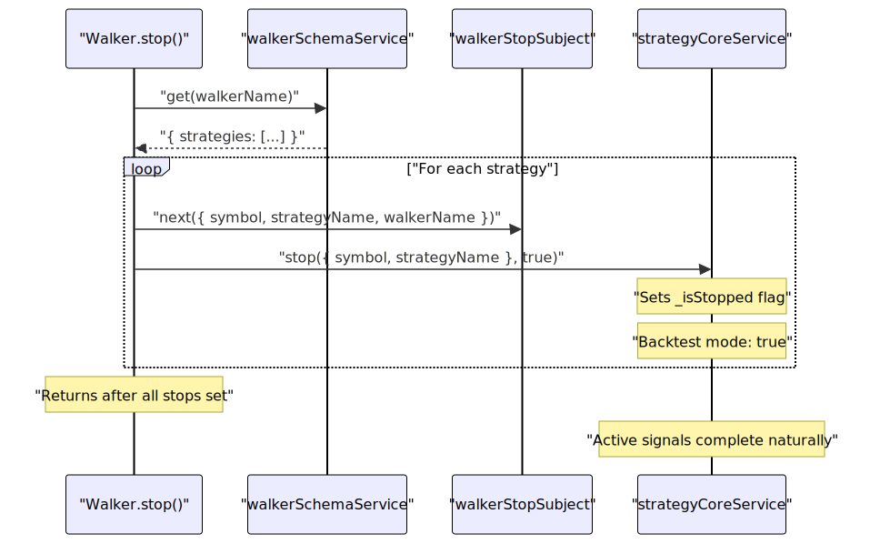

# Walker API

The Walker API provides methods for running comparative strategy backtests across multiple strategies on the same symbol. It orchestrates sequential backtest execution, aggregates results, and ranks strategies by configurable metrics (Sharpe ratio, win rate, etc.). This API reuses the backtest infrastructure internally while providing specialized methods for multi-strategy comparison and reporting.

**Related Pages**: For running individual strategy backtests, see [Backtest API](./18_Backtest_API.md). For live trading execution, see [Live Trading API](./19_Live_Trading_API.md). For detailed walker execution flow and comparison logic, see [Walker Mode](./63_Walker_Mode.md). For walker schema configuration, see [Walker Schemas](./30_Walker_Schemas.md).

---

## Architecture Overview

The Walker API follows the same architectural pattern as Backtest and Live APIs, consisting of an instance class for isolated execution and a utility class providing convenient singleton access.




---

## Class Structure

### WalkerInstance

The `WalkerInstance` class provides isolated walker execution for a specific symbol-walker pair. Each instance maintains its own state including stop flags and completion status.

| Property | Type | Description |
|----------|------|-------------|
| `id` | `string` | Randomly generated unique identifier |
| `symbol` | `string` | Trading pair symbol (e.g., "BTCUSDT") |
| `walkerName` | `WalkerName` | Walker configuration name |
| `_isStopped` | `boolean` | Internal flag indicating manual stop |
| `_isDone` | `boolean` | Internal flag indicating task completion |


### WalkerUtils

The `WalkerUtils` class provides simplified access to walker functionality with automatic validation and schema resolution. The singleton instance `Walker` is exported for convenient usage.

| Method | Return Type | Description |
|--------|-------------|-------------|
| `run()` | `AsyncGenerator<WalkerContract>` | Runs walker with progress updates |
| `background()` | `() => void` | Runs walker in background, returns cancellation |
| `stop()` | `Promise<void>` | Stops all strategies in walker |
| `getData()` | `Promise<WalkerCompleteContract>` | Gets aggregated comparison results |
| `getReport()` | `Promise<string>` | Generates markdown report |
| `dump()` | `Promise<void>` | Saves report to disk |
| `list()` | `Promise<Array<Status>>` | Lists all active walker instances |


---

## Core Methods

### run()

Runs walker comparison for a symbol, yielding progress updates after each strategy completes its backtest.

**Signature**:
```typescript
run(
  symbol: string,
  context: { walkerName: string }
): AsyncGenerator<WalkerContract, any, any>
```

**Parameters**:
- `symbol` - Trading pair symbol (e.g., "BTCUSDT")
- `context.walkerName` - Name of registered walker configuration

**Yields**: `WalkerContract` objects containing:
- `strategiesTested` - Number of strategies completed
- `totalStrategies` - Total strategies to test
- `bestStrategy` - Current best strategy by metric
- `bestMetric` - Best metric value achieved

**Behavior**:
1. Validates walker, exchange, frame, and all strategy registrations
2. Validates risk profiles for strategies that use them
3. Clears cached data for walker and all strategies
4. Orchestrates sequential backtest execution via `walkerCommandService`
5. Yields progress after each strategy completes
6. Emits `doneWalkerSubject` event upon completion

**Example**:
```typescript
for await (const progress of Walker.run("BTCUSDT", {
  walkerName: "momentum-comparison"
})) {
  console.log(
    `Progress: ${progress.strategiesTested}/${progress.totalStrategies}`
  );
  console.log(
    `Best: ${progress.bestStrategy} (${progress.bestMetric})`
  );
}
```


---

### background()

Runs walker comparison in background without yielding results. Useful for running walker for side effects only (callbacks, logging, report generation).

**Signature**:
```typescript
background(
  symbol: string,
  context: { walkerName: string }
): () => void
```

**Parameters**:
- `symbol` - Trading pair symbol
- `context.walkerName` - Name of registered walker configuration

**Returns**: Cancellation function that stops all strategies and emits completion event

**Behavior**:
1. Validates walker and all component registrations
2. Spawns background task wrapped with `singlerun` to prevent duplicate execution
3. Returns immediately with cancellation closure
4. Task executes asynchronously, consuming all progress updates
5. Errors are caught and emitted via `exitEmitter`

**Cancellation Behavior**:
- Stops all strategies in walker via `strategyCoreService.stop()`
- Emits stop signal via `walkerStopSubject` for each strategy
- Emits `doneWalkerSubject` if not already done
- Sets instance `_isStopped` and `_isDone` flags

**Example**:
```typescript
const cancel = Walker.background("BTCUSDT", {
  walkerName: "momentum-comparison"
});

// Later, to stop:
cancel();
```


---

### stop()

Stops all strategies in the walker from generating new signals. Current active signals will complete normally. Walker will stop at the next safe point.

**Signature**:
```typescript
stop(symbol: string, walkerName: WalkerName): Promise<void>
```

**Parameters**:
- `symbol` - Trading pair symbol
- `walkerName` - Walker name to stop

**Behavior**:
1. Validates walker and all strategy registrations
2. Iterates through all strategies in walker schema
3. For each strategy:
   - Emits stop signal via `walkerStopSubject`
   - Calls `strategyCoreService.stop()` to set internal stop flag
4. Does NOT force-close active signals
5. Supports multiple walkers on same symbol (filtered by `walkerName`)

**Stop Signal Flow**:


**Example**:
```typescript
// Stop walker gracefully
await Walker.stop("BTCUSDT", "momentum-comparison");

// Active signals will reach TP/SL/timeout normally
// No new signals will be generated
```


---

### getData()

Retrieves aggregated walker results data from all strategy comparisons. Data is computed by `walkerMarkdownService` based on backtest results for each strategy.

**Signature**:
```typescript
getData(
  symbol: string,
  walkerName: WalkerName
): Promise<WalkerCompleteContract>
```

**Parameters**:
- `symbol` - Trading symbol
- `walkerName` - Walker name to get data for

**Returns**: `WalkerCompleteContract` containing:
- `bestStrategy` - Best strategy by configured metric
- `bestMetric` - Best metric value
- `strategies` - Array of strategy results with per-strategy statistics
- Aggregated portfolio metrics

**Data Structure**:
```typescript
interface WalkerCompleteContract {
  bestStrategy: string;
  bestMetric: number;
  strategies: IWalkerStrategyResult[];
  // Plus aggregated portfolio stats
}

interface IWalkerStrategyResult {
  strategyName: string;
  sharpeRatio: number;
  winRate: number;
  totalTrades: number;
  pnlPercentage: number;
  // Plus other metrics
}
```

**Example**:
```typescript
const results = await Walker.getData("BTCUSDT", "momentum-comparison");

console.log(`Best: ${results.bestStrategy}`);
console.log(`Sharpe Ratio: ${results.bestMetric}`);

results.strategies.forEach(s => {
  console.log(`${s.strategyName}: ${s.sharpeRatio.toFixed(2)}`);
});
```


---

### getReport()

Generates comprehensive markdown report with all strategy comparisons, statistics, and rankings. Report includes strategy-by-strategy breakdown and aggregated metrics.

**Signature**:
```typescript
getReport(
  symbol: string,
  walkerName: WalkerName
): Promise<string>
```

**Parameters**:
- `symbol` - Trading symbol
- `walkerName` - Walker name to generate report for

**Returns**: Markdown formatted report string

**Report Contents**:
- Walker configuration summary
- Strategy rankings by metric
- Per-strategy statistics tables
- Aggregated portfolio metrics
- Best/worst performing strategies

**Example**:
```typescript
const markdown = await Walker.getReport("BTCUSDT", "momentum-comparison");
console.log(markdown);

// Output format:
// # Walker: momentum-comparison
// Symbol: BTCUSDT
// Metric: sharpeRatio
// 
// ## Rankings
// 1. ema-cross: 2.34
// 2. rsi-reversal: 1.87
// ...
```


---

### dump()

Saves walker report to disk. Default location is `./dump/walker/{walkerName}.md`.

**Signature**:
```typescript
dump(
  symbol: string,
  walkerName: WalkerName,
  path?: string
): Promise<void>
```

**Parameters**:
- `symbol` - Trading symbol
- `walkerName` - Walker name to save report for
- `path` - Optional custom directory path (default: "./dump/walker")

**File Naming**: `{walkerName}.md` in specified directory

**Example**:
```typescript
// Save to default path: ./dump/walker/momentum-comparison.md
await Walker.dump("BTCUSDT", "momentum-comparison");

// Save to custom path: ./reports/walker/momentum-comparison.md
await Walker.dump("BTCUSDT", "momentum-comparison", "./reports/walker");
```


---

### list()

Lists all active walker instances with their current execution status. Useful for monitoring multiple concurrent walker executions.

**Signature**:
```typescript
list(): Promise<Array<{
  id: string;
  symbol: string;
  walkerName: string;
  status: "ready" | "pending" | "fulfilled" | "rejected";
}>>
```

**Returns**: Array of status objects, one per active walker instance

**Status Values**:
- `"ready"` - Instance created but task not started
- `"pending"` - Task currently executing
- `"fulfilled"` - Task completed successfully
- `"rejected"` - Task failed with error

**Example**:
```typescript
const statusList = await Walker.list();

statusList.forEach(status => {
  console.log(
    `${status.symbol} - ${status.walkerName}: ${status.status}`
  );
});

// Output:
// BTCUSDT - momentum-comparison: pending
// ETHUSDT - trend-following: fulfilled
```


---

## Execution Flow

The walker orchestrates multiple strategy backtests sequentially, aggregating results and tracking the best performer by configured metric.



**Sequential Processing**: Strategies are tested one at a time to ensure deterministic results and consistent resource usage. Each backtest completes fully before the next begins.


---

## Instance Management

Walker instances are memoized by `symbol:walkerName` key to ensure isolation and prevent duplicate execution.

### Memoization Pattern



**Benefits**:
- Each symbol-walker combination maintains isolated state
- Multiple walkers can run on same symbol without interference
- Prevents duplicate execution via `singlerun` wrapper
- Efficient resource usage through instance reuse


---

## Task Management

The `task` method wraps walker execution with `singlerun` to prevent concurrent execution of the same walker instance.




---

## Validation Chain

Before execution, walker validates all component registrations to ensure configuration integrity.

| Component | Service | Validates |
|-----------|---------|-----------|
| Walker | `walkerValidationService` | Walker schema exists |
| Exchange | `exchangeValidationService` | Exchange schema exists |
| Frame | `frameValidationService` | Frame schema exists |
| Strategies | `strategyValidationService` | Each strategy schema exists |
| Risk Profiles | `riskValidationService` | Risk schemas for strategies that use them |

**Validation Example**:
```typescript
// Walker validates:
// 1. Walker schema "momentum-comparison" exists
// 2. Exchange schema "binance" exists (from walker schema)
// 3. Frame schema "1d-backtest" exists (from walker schema)
// 4. Strategy schemas ["ema-cross", "rsi-reversal"] exist
// 5. Risk schemas for strategies that define riskName

Walker.run("BTCUSDT", { walkerName: "momentum-comparison" });
```


---

## State Management

Each `WalkerInstance` maintains internal state flags to coordinate execution and stopping.

```typescript
// Instance state
class WalkerInstance {
  readonly id = randomString();      // Unique identifier
  _isStopped = false;                // Manual stop requested
  _isDone = false;                   // Execution completed
}
```

**State Transitions**:
1. **Construction**: `_isStopped = false`, `_isDone = false`
2. **Task Start**: Flags reset at beginning of execution
3. **Stop Called**: `_isStopped = true`
4. **Completion**: `_isDone = true`

**Stop Behavior**:
- Setting `_isStopped` interrupts the walker loop
- Current strategy backtest completes before stopping
- Stop signals propagate to all strategies via `walkerStopSubject`


---

## Progress Events

Walker emits progress events after each strategy completes, enabling real-time monitoring of comparison execution.

### WalkerContract Structure

```typescript
interface WalkerContract {
  strategiesTested: number;    // Strategies completed
  totalStrategies: number;     // Total to test
  currentStrategy: string;     // Currently executing
  bestStrategy: string;        // Best so far
  bestMetric: number;          // Best metric value
  // Plus additional context
}
```

### Event Flow




---

## Comparison Metrics

Walker ranks strategies using configurable metrics defined in the walker schema. The default metric is `sharpeRatio`.

| Metric | Description | Formula |
|--------|-------------|---------|
| `sharpeRatio` | Risk-adjusted return | `(avgReturn - riskFreeRate) / stdDev` |
| `winRate` | Percentage of winning trades | `wins / totalTrades` |
| `totalPnL` | Absolute profit/loss | Sum of all trade PnL |
| `pnlPercentage` | Percentage return | `(finalCapital - initialCapital) / initialCapital` |

**Metric Selection**:
```typescript
// Configure in walker schema
addWalker({
  name: "momentum-comparison",
  strategies: ["ema-cross", "rsi-reversal", "macd-divergence"],
  exchangeName: "binance",
  frameName: "1d-backtest",
  metric: "sharpeRatio"  // <-- Ranking metric
});
```


---

## Practical Examples

### Basic Walker Execution

```typescript
import { Walker } from "backtest-kit";

// Run walker and monitor progress
for await (const progress of Walker.run("BTCUSDT", {
  walkerName: "momentum-comparison"
})) {
  console.log(`Testing: ${progress.currentStrategy}`);
  console.log(`Progress: ${progress.strategiesTested}/${progress.totalStrategies}`);
  console.log(`Best: ${progress.bestStrategy} (${progress.bestMetric.toFixed(2)})`);
}

// Get final results
const results = await Walker.getData("BTCUSDT", "momentum-comparison");
console.log(`Winner: ${results.bestStrategy}`);
```

### Background Execution with Cancellation

```typescript
import { Walker } from "backtest-kit";

// Start walker in background
const cancel = Walker.background("BTCUSDT", {
  walkerName: "momentum-comparison"
});

// Listen for completion
listenDoneWalker((event) => {
  if (event.symbol === "BTCUSDT") {
    console.log("Walker completed!");
  }
});

// Cancel if needed
setTimeout(() => {
  cancel();
  console.log("Walker stopped");
}, 60000); // Stop after 1 minute
```

### Multiple Walkers on Different Symbols

```typescript
import { Walker } from "backtest-kit";

const symbols = ["BTCUSDT", "ETHUSDT", "BNBUSDT"];

// Start walkers for each symbol
const cancels = symbols.map(symbol => 
  Walker.background(symbol, {
    walkerName: "momentum-comparison"
  })
);

// Monitor all instances
setInterval(async () => {
  const statusList = await Walker.list();
  console.log("Active walkers:", statusList.length);
  
  statusList.forEach(status => {
    console.log(`${status.symbol}: ${status.status}`);
  });
}, 5000);

// Stop all on shutdown
process.on("SIGINT", () => {
  cancels.forEach(cancel => cancel());
});
```

### Generating Comparison Report

```typescript
import { Walker } from "backtest-kit";

// Run walker
Walker.background("BTCUSDT", {
  walkerName: "momentum-comparison"
});

// Wait for completion
listenDoneWalker(async (event) => {
  if (event.symbol === "BTCUSDT") {
    // Generate and save report
    await Walker.dump("BTCUSDT", "momentum-comparison");
    
    // Also get structured data
    const results = await Walker.getData("BTCUSDT", "momentum-comparison");
    
    console.log(`Best: ${results.bestStrategy}`);
    console.log(`Strategies tested: ${results.strategies.length}`);
    
    // Show top 3
    results.strategies
      .slice(0, 3)
      .forEach((s, i) => {
        console.log(`${i + 1}. ${s.strategyName}: ${s.sharpeRatio}`);
      });
  }
});
```

### Conditional Stopping

```typescript
import { Walker, listenWalker } from "backtest-kit";

Walker.background("BTCUSDT", {
  walkerName: "momentum-comparison"
});

// Stop if best strategy exceeds threshold
listenWalker((progress) => {
  if (progress.bestMetric > 3.0) {
    console.log(`Excellent strategy found: ${progress.bestStrategy}`);
    Walker.stop("BTCUSDT", "momentum-comparison");
  }
});
```


---

## Error Handling

Walker execution can fail at multiple points. Errors are handled through the framework's event system.

### Error Sources

| Error Type | Cause | Handler |
|------------|-------|---------|
| Validation Error | Component not registered | Thrown synchronously |
| Backtest Error | Strategy execution fails | `errorEmitter` |
| Fatal Error | Unrecoverable failure | `exitEmitter` |

### Error Handling Pattern

```typescript
import { Walker, listenError, listenExit } from "backtest-kit";

// Handle recoverable errors
listenError((error) => {
  console.error("Walker error:", error.message);
  // Log and continue
});

// Handle fatal errors
listenExit((error) => {
  console.error("Fatal error:", error.message);
  process.exit(1);
});

// Run walker
try {
  Walker.background("BTCUSDT", {
    walkerName: "momentum-comparison"
  });
} catch (error) {
  // Validation errors thrown synchronously
  console.error("Configuration error:", error.message);
}
```


---

## Relationship to Backtest API

Walker internally uses the Backtest API for each strategy execution. Understanding this relationship clarifies the architecture.



**Key Differences**:
- **Backtest**: Single strategy, yields all closed signals
- **Walker**: Multiple strategies, yields progress updates
- **Backtest**: Returns `IStrategyBacktestResult[]`
- **Walker**: Returns `WalkerContract` with aggregated metrics

