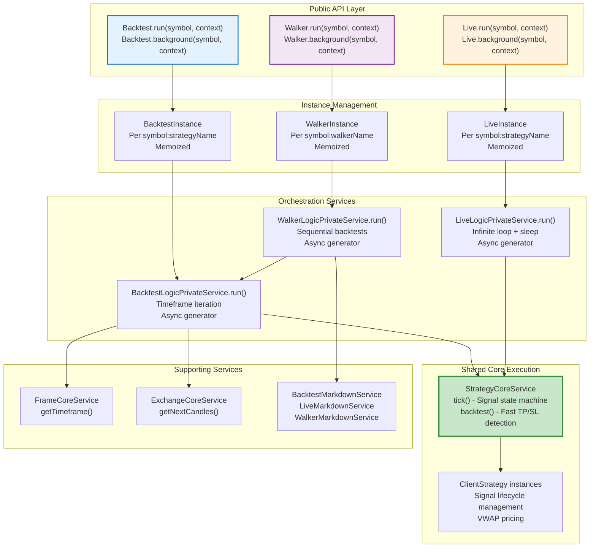
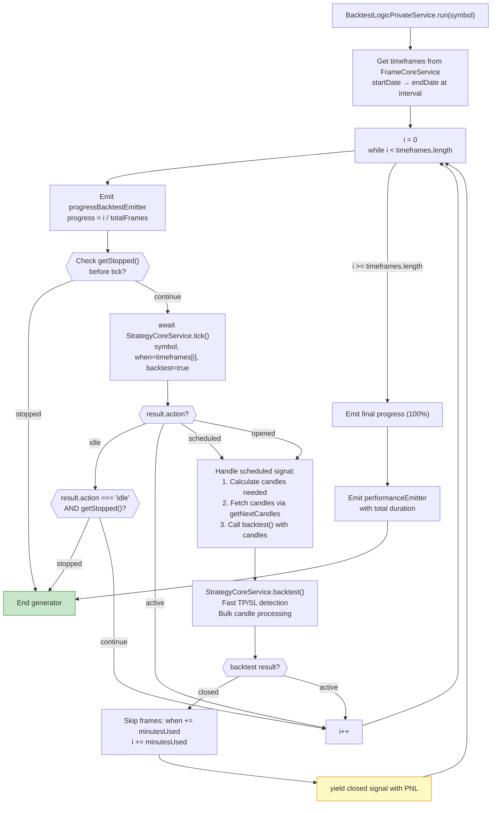
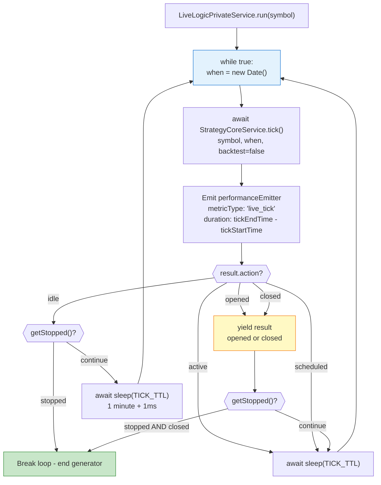
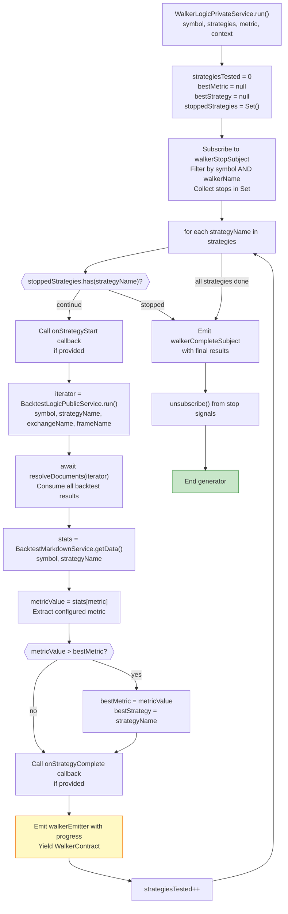
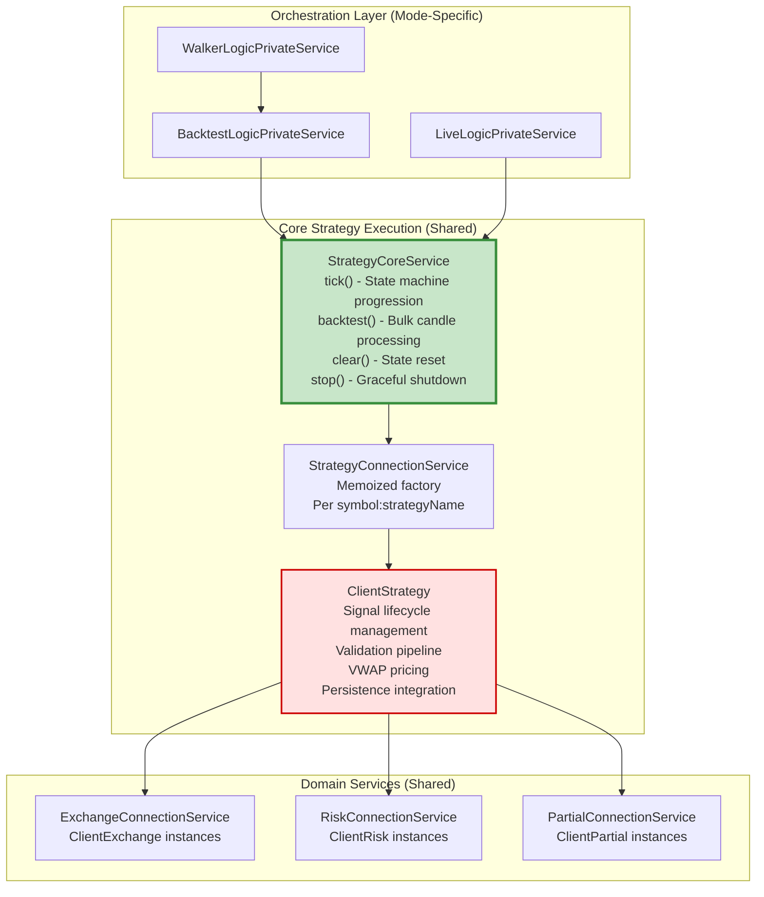

# Execution Modes

This document describes the three execution modes provided by Backtest Kit: **Backtest**, **Live**, and **Walker**. Each mode uses the same core strategy execution logic but differs in orchestration, time progression, and result streaming patterns. For details on the strategy lifecycle within these modes, see [Signals & Signal Lifecycle](./08_core-concepts.md). For information on async generator implementation details, see [Async Generator Patterns](./20_execution-modes.md).

---

## Overview

Backtest Kit provides three distinct execution modes, each optimized for different use cases:

| Mode | Purpose | Time Progression | Generator Type | Primary Output |
|------|---------|------------------|----------------|----------------|
| **Backtest** | Historical simulation | Pre-determined timeframes | Finite async generator | Closed signals with PNL |
| **Live** | Real-time trading | Real-time (`new Date()`) | Infinite async generator | Opened/closed signals |
| **Walker** | Strategy comparison | Orchestrates multiple backtests | Finite async generator | Comparative statistics |

All three modes share the same core execution components (`StrategyCoreService`, `ClientStrategy`) to ensure identical signal logic between testing and production.

**Sources:** [src/classes/Backtest.ts:1-601](), [src/classes/Live.ts:1-600](), [src/classes/Walker.ts:1-600](), Diagram 2 from high-level architecture

---

## Architecture: Mode-Specific Orchestration



**Execution Mode Architecture**

This diagram shows how each execution mode uses mode-specific orchestration services while sharing the same core strategy execution logic. Instance management ensures isolated state per symbol-strategy or symbol-walker pair.

**Sources:** [src/classes/Backtest.ts:359-600](), [src/classes/Live.ts:376-600](), [src/classes/Walker.ts:431-600](), [src/lib/services/logic/private/BacktestLogicPrivateService.ts:1-347](), [src/lib/services/logic/private/LiveLogicPrivateService.ts:1-179](), [src/lib/services/logic/private/WalkerLogicPrivateService.ts:1-235]()

---

## Backtest Mode: Historical Simulation

Backtest mode executes strategies over historical data with deterministic time progression. It iterates through pre-defined timeframes minute-by-minute, calling strategy logic at each interval.

### Entry Points

The `Backtest` singleton provides two methods for execution:

```typescript
// Async iterator pattern - yields results
for await (const result of Backtest.run(symbol, {
  strategyName, exchangeName, frameName
})) {
  console.log(result.pnl.pnlPercentage);
}

// Background execution - fire and forget
const cancel = Backtest.background(symbol, {
  strategyName, exchangeName, frameName
});
```

Both methods delegate to `BacktestInstance` which maintains isolated state per `symbol:strategyName` pair using memoization.

**Sources:** [src/classes/Backtest.ts:378-400](), [src/classes/Backtest.ts:423-443]()

### Orchestration Flow

The `BacktestLogicPrivateService.run()` method implements the core backtest loop:



**Backtest Orchestration Flow**

This diagram shows the complete backtest loop including the "fast backtest" optimization that skips timeframes while a signal is active.

**Sources:** [src/lib/services/logic/private/BacktestLogicPrivateService.ts:62-347]()

### Fast Backtest Optimization

When a signal opens, the orchestrator switches to "fast mode":

1. **Calculates candles needed:** `bufferMinutes + CC_SCHEDULE_AWAIT_MINUTES + minuteEstimatedTime + 1`
2. **Fetches bulk candles:** Via `ExchangeCoreService.getNextCandles()`
3. **Processes in one call:** `StrategyCoreService.backtest()` handles TP/SL detection across all candles
4. **Skips timeframes:** `i += minutesUsed` to jump to signal closure timestamp

This optimization dramatically improves performance for long-running signals by avoiding per-minute `tick()` calls during active signal monitoring.

**Sources:** [src/lib/services/logic/private/BacktestLogicPrivateService.ts:154-295]()

### Progress Tracking

The orchestrator emits progress events after processing each timeframe:

```typescript
await progressBacktestEmitter.next({
  exchangeName, strategyName, symbol,
  totalFrames,
  processedFrames: i,
  progress: totalFrames > 0 ? i / totalFrames : 0,
});
```

Consumer code can listen via `listenProgressBacktest()` to display real-time progress indicators.

**Sources:** [src/lib/services/logic/private/BacktestLogicPrivateService.ts:84-92]()

### Graceful Shutdown

Backtest supports graceful shutdown via `Backtest.stop(symbol, strategyName)`:

- Sets internal `stopped` flag in `StrategyCoreService`
- Checks flag at two points: **before tick** and **when idle**
- Current active signal completes normally before stopping
- Prevents partial results from incomplete backtests

**Sources:** [src/classes/Backtest.ts:254-260](), [src/lib/services/logic/private/BacktestLogicPrivateService.ts:95-111](), [src/lib/services/logic/private/BacktestLogicPrivateService.ts:132-150]()

---

## Live Trading Mode: Real-Time Execution

Live mode executes strategies continuously in real-time using an infinite loop pattern. It progresses time with `new Date()` on each iteration and includes crash-safe persistence.

### Entry Points

The `Live` singleton provides two methods:

```typescript
// Async iterator - yields opened and closed signals
for await (const result of Live.run(symbol, {
  strategyName, exchangeName
})) {
  if (result.action === "opened") {
    console.log("New signal:", result.signal.id);
  }
  if (result.action === "closed") {
    console.log("PNL:", result.pnl.pnlPercentage);
  }
}

// Background execution - infinite until stopped
const cancel = Live.background(symbol, {
  strategyName, exchangeName
});
```

Both methods delegate to `LiveInstance` which maintains isolated state per `symbol:strategyName` pair.

**Sources:** [src/classes/Live.ts:398-418](), [src/classes/Live.ts:441-459]()

### Orchestration Flow

The `LiveLogicPrivateService.run()` method implements the infinite monitoring loop:



**Live Trading Orchestration Flow**

This diagram shows the infinite loop pattern with sleep intervals and graceful shutdown checkpoints.

**Sources:** [src/lib/services/logic/private/LiveLogicPrivateService.ts:63-175]()

### Sleep Interval Configuration

The orchestrator sleeps between ticks using a constant defined at the module level:

```typescript
const TICK_TTL = 1 * 60 * 1_000 + 1; // 1 minute + 1ms
```

This interval balances responsiveness with API rate limiting. The extra 1ms prevents exact-minute boundary issues.

**Sources:** [src/lib/services/logic/private/LiveLogicPrivateService.ts:14]()

### Crash-Safe Persistence

Live mode automatically persists active signals to disk for crash recovery:

- **Signal opened:** `ClientStrategy` calls `PersistSignalAdapter.set()` to save signal state
- **Process crashes:** On restart, `ClientStrategy.waitForInit()` loads persisted signal
- **Signal closed:** `PersistSignalAdapter.delete()` removes from storage
- **Scheduled signals NOT persisted:** Only active (opened) signals are saved

This ensures crash recovery without data loss or duplicate positions.

**Sources:** Referenced in Diagram 3 from high-level architecture, implemented in ClientStrategy

### Result Streaming

Live mode yields only **opened** and **closed** results, skipping **idle**, **active**, and **scheduled** states to reduce noise:

```typescript
if (result.action === "idle") {
  await sleep(TICK_TTL);
  continue;
}
if (result.action === "active") {
  await sleep(TICK_TTL);
  continue;
}
if (result.action === "scheduled") {
  await sleep(TICK_TTL);
  continue;
}
// Yield opened, closed results
yield result as IStrategyTickResultClosed | IStrategyTickResultOpened;
```

**Sources:** [src/lib/services/logic/private/LiveLogicPrivateService.ts:141-152]()

### Graceful Shutdown

Live mode supports graceful shutdown via `Live.stop(symbol, strategyName)`:

- **When idle:** Stops immediately after setting flag
- **When active:** Waits for signal to close before stopping
- **After closed:** Checks flag and stops if set

This ensures positions close properly before the trading bot terminates.

**Sources:** [src/classes/Live.ts:261-267](), [src/lib/services/logic/private/LiveLogicPrivateService.ts:119-136](), [src/lib/services/logic/private/LiveLogicPrivateService.ts:155-171]()

---

## Walker Mode: Strategy Comparison

Walker mode orchestrates multiple backtests sequentially to compare strategy performance. It executes each strategy's backtest, collects statistics, and ranks results by a configurable metric.

### Entry Points

The `Walker` singleton provides two methods:

```typescript
// Async iterator - yields progress after each strategy
for await (const progress of Walker.run(symbol, {
  walkerName
})) {
  console.log(`${progress.strategiesTested}/${progress.totalStrategies}`);
  console.log("Best:", progress.bestStrategy, progress.bestMetric);
}

// Background execution
const cancel = Walker.background(symbol, { walkerName });
```

Walker configuration is defined via `addWalker()`:

```typescript
addWalker({
  walkerName: "optimizer-v1",
  strategies: ["strat-a", "strat-b", "strat-c"],
  exchangeName: "binance",
  frameName: "1d-backtest",
  metric: "sharpeRatio", // or "winRate", "totalPnl", etc.
});
```

**Sources:** [src/classes/Walker.ts:466-485](), [src/classes/Walker.ts:505-527]()

### Orchestration Flow

The `WalkerLogicPrivateService.run()` method iterates through strategies:



**Walker Orchestration Flow**

This diagram shows the sequential strategy testing pattern with real-time metric comparison and progressive result streaming.

**Sources:** [src/lib/services/logic/private/WalkerLogicPrivateService.ts:68-235]()

### Metric Comparison

Walker supports multiple comparison metrics defined in the walker schema:

```typescript
type WalkerMetric = 
  | "sharpeRatio"
  | "winRate" 
  | "totalPnl"
  | "avgPnl"
  | "maxDrawdown"
  | "totalTrades";
```

The orchestrator extracts the configured metric from `BacktestStatisticsModel` and tracks the best performer:

```typescript
const value = stats[metric];
const metricValue = value !== null && value !== undefined ? value : 0;

if (bestMetric === null || metricValue > bestMetric) {
  bestMetric = metricValue;
  bestStrategy = strategyName;
}
```

**Sources:** [src/lib/services/logic/private/WalkerLogicPrivateService.ts:172-188]()

### Progressive Result Streaming

Walker yields `WalkerContract` after each strategy completes, enabling real-time monitoring:

```typescript
const contract: WalkerContract = {
  symbol,
  totalStrategies: strategies.length,
  strategiesTested,
  bestStrategy,
  bestMetric,
  metric,
  strategyName: currentStrategyName,
  currentMetric: metricValue,
};

await walkerEmitter.next(contract);
yield contract;
```

Consumer code receives incremental updates as each strategy finishes.

**Sources:** [src/lib/services/logic/private/WalkerLogicPrivateService.ts:192-208]()

### Multi-Walker Stop Signals

Walker supports multiple concurrent walkers on the same symbol by filtering stop signals by both `symbol` AND `walkerName`:

```typescript
const unsubscribe = walkerStopSubject
  .filter((data) => 
    data.symbol === symbol && 
    data.walkerName === context.walkerName
  )
  .connect((data) => {
    stoppedStrategies.add(data.strategyName);
  });
```

This prevents crosstalk when running multiple optimization experiments simultaneously.

**Sources:** [src/lib/services/logic/private/WalkerLogicPrivateService.ts:98-111]()

### Strategy Callbacks

Walker supports optional callbacks for tracking progress:

```typescript
addWalker({
  walkerName: "optimizer",
  strategies: [...],
  callbacks: {
    onStrategyStart: (strategyName, symbol) => {
      console.log(`Testing ${strategyName}...`);
    },
    onStrategyComplete: (strategyName, symbol, stats) => {
      console.log(`${strategyName} Sharpe: ${stats.sharpeRatio}`);
    },
    onStrategyError: (strategyName, symbol, error) => {
      console.error(`${strategyName} failed:`, error);
    },
  },
});
```

**Sources:** [src/lib/services/logic/private/WalkerLogicPrivateService.ts:129-131](), [src/lib/services/logic/private/WalkerLogicPrivateService.ts:190-192]()

---

## Async Generator Patterns

All three execution modes use async generators for memory-efficient streaming. This section compares their generator characteristics.

### Generator Type Comparison

| Mode | Generator Type | Completion | Early Termination |
|------|---------------|------------|-------------------|
| Backtest | **Finite** - ends after last timeframe | Automatically completes when `i >= timeframes.length` | Supported via `break` in consumer or `Backtest.stop()` |
| Live | **Infinite** - never completes naturally | Only stops via graceful shutdown | Supported via `break` in consumer or `Live.stop()` |
| Walker | **Finite** - ends after last strategy | Automatically completes when all strategies tested | Supported via `break` in consumer or `Walker.stop()` |

**Sources:** [src/lib/services/logic/private/BacktestLogicPrivateService.ts:62-347](), [src/lib/services/logic/private/LiveLogicPrivateService.ts:63-175](), [src/lib/services/logic/private/WalkerLogicPrivateService.ts:68-235]()

### Memory Efficiency

Async generators enable streaming without accumulating results:

```typescript
// ❌ Memory-intensive: Accumulates all results in array
const backtestLogic = new BacktestLogicPrivateService();
const allResults = await resolveDocuments(
  backtestLogic.run(symbol)
);

// ✅ Memory-efficient: Processes results one at a time
for await (const result of backtestLogic.run(symbol)) {
  processResult(result);
  // Previous results are garbage-collected
}
```

This is critical for large backtests with thousands of signals.

**Sources:** General async generator pattern, implemented in [src/lib/services/logic/private/BacktestLogicPrivateService.ts:62]()

### Early Termination Support

All modes support early termination via consumer-side `break`:

```typescript
// Stop backtest after 10% drawdown
for await (const result of Backtest.run(symbol, context)) {
  if (result.pnl.pnlPercentage < -10) {
    console.log("Drawdown exceeded, stopping backtest");
    break; // Generator cleanup happens automatically
  }
}
```

Consumer break triggers generator cleanup (destructors, unsubscriptions) without requiring explicit shutdown.

**Sources:** [src/lib/services/logic/private/BacktestLogicPrivateService.ts:62-347]()

### Background Execution Pattern

The `background()` methods consume generators internally using `singlerun` wrapper:

```typescript
private task = singlerun(async (symbol: string, context: any) => {
  this._isStopped = false;
  this._isDone = false;
  
  for await (const _ of this.run(symbol, context)) {
    if (this._isStopped) break;
  }
  
  // Emit completion event
  await doneBacktestSubject.next({...});
  this._isDone = true;
});

public background = (symbol: string, context: any) => {
  this.task(symbol, context).catch((error) =>
    exitEmitter.next(new Error(getErrorMessage(error)))
  );
  return () => {
    this._isStopped = true;
  };
};
```

The `singlerun` wrapper from `functools-kit` ensures only one execution per instance and provides status tracking.

**Sources:** [src/classes/Backtest.ts:105-118](), [src/classes/Backtest.ts:200-235]()

---

## Shared Core Strategy Execution

Despite different orchestration patterns, all three modes delegate to the same core services for strategy execution:



**Shared Core Execution Architecture**

This diagram shows how mode-specific orchestration services converge on the same `StrategyCoreService` and `ClientStrategy` implementations.

### Key Shared Components

| Component | Purpose | Shared Behavior |
|-----------|---------|-----------------|
| `StrategyCoreService` | Strategy orchestration, state machine progression | Same `tick()` and `backtest()` logic across all modes |
| `ClientStrategy` | Signal lifecycle, validation, pricing | Identical validation rules, VWAP calculation, TP/SL logic |
| `StrategyConnectionService` | Memoized client factory | Same instance caching mechanism per `symbol:strategyName` |
| `ExchangeConnectionService` | Exchange client factory | Shared candle fetching and price formatting |
| `RiskConnectionService` | Risk client factory | Unified risk validation pipeline |

This architecture ensures **identical behavior** between backtest simulation and live trading, preventing discrepancies that could lead to unexpected production results.

**Sources:** [src/lib/services/core/StrategyCoreService.ts]() (referenced but not provided), [src/lib/services/connection/StrategyConnectionService.ts]() (referenced but not provided)

---

## API Method Comparison

The following table summarizes the public API methods across all three execution modes:

| Method | Backtest | Live | Walker | Purpose |
|--------|----------|------|--------|---------|
| `run(symbol, context)` | ✅ Returns finite async generator | ✅ Returns infinite async generator | ✅ Returns finite async generator | Primary execution method - yields results |
| `background(symbol, context)` | ✅ Returns cancellation closure | ✅ Returns cancellation closure | ✅ Returns cancellation closure | Background execution - fire and forget |
| `stop(symbol, name)` | ✅ Graceful shutdown | ✅ Graceful shutdown | ✅ Stops all strategies in walker | Sets stop flag, waits for safe point |
| `getData(symbol, name)` | ✅ Returns `BacktestStatisticsModel` | ✅ Returns `LiveStatisticsModel` | ✅ Returns `WalkerResultsModel` | Extracts accumulated statistics |
| `getReport(symbol, name, columns?)` | ✅ Markdown report | ✅ Markdown report | ✅ Markdown report | Generates formatted report string |
| `dump(symbol, name, path?, columns?)` | ✅ Saves to `./dump/backtest/` | ✅ Saves to `./dump/live/` | ✅ Saves to `./dump/walker/` | Writes report to disk |
| `list()` | ✅ Returns all instance statuses | ✅ Returns all instance statuses | ✅ Returns all instance statuses | Lists active executions |

### Context Parameter Differences

```typescript
// Backtest requires frameName for timeframe generation
Backtest.run(symbol, {
  strategyName: "strat-1",
  exchangeName: "binance",
  frameName: "1d-backtest" // Required
});

// Live does not require frameName (uses real-time)
Live.run(symbol, {
  strategyName: "strat-1",
  exchangeName: "binance"
  // No frameName needed
});

// Walker only requires walkerName (pulls config from schema)
Walker.run(symbol, {
  walkerName: "optimizer-v1"
  // exchangeName and frameName pulled from walker schema
});
```

**Sources:** [src/classes/Backtest.ts:378-400](), [src/classes/Live.ts:398-418](), [src/classes/Walker.ts:466-485]()

---

## Mode Selection Guide

Use the following criteria to choose the appropriate execution mode:

| Scenario | Recommended Mode | Rationale |
|----------|------------------|-----------|
| Testing strategy logic on historical data | **Backtest** | Fast, deterministic, complete PNL statistics |
| Validating strategy performance metrics | **Backtest** | Accurate Sharpe ratio, drawdown, win rate calculations |
| Production trading deployment | **Live** | Real-time execution, crash recovery, persistence |
| Comparing multiple strategy variants | **Walker** | Automated comparison, metric-based ranking |
| Parameter optimization | **Walker** | Sequential testing of parameter combinations |
| Strategy development iteration | **Backtest** | Fastest feedback loop during development |
| Paper trading / dry run | **Live** with mock exchange | Real-time behavior without capital risk |

**Sources:** General architectural patterns from [src/classes/Backtest.ts:1-601](), [src/classes/Live.ts:1-600](), [src/classes/Walker.ts:1-600]()