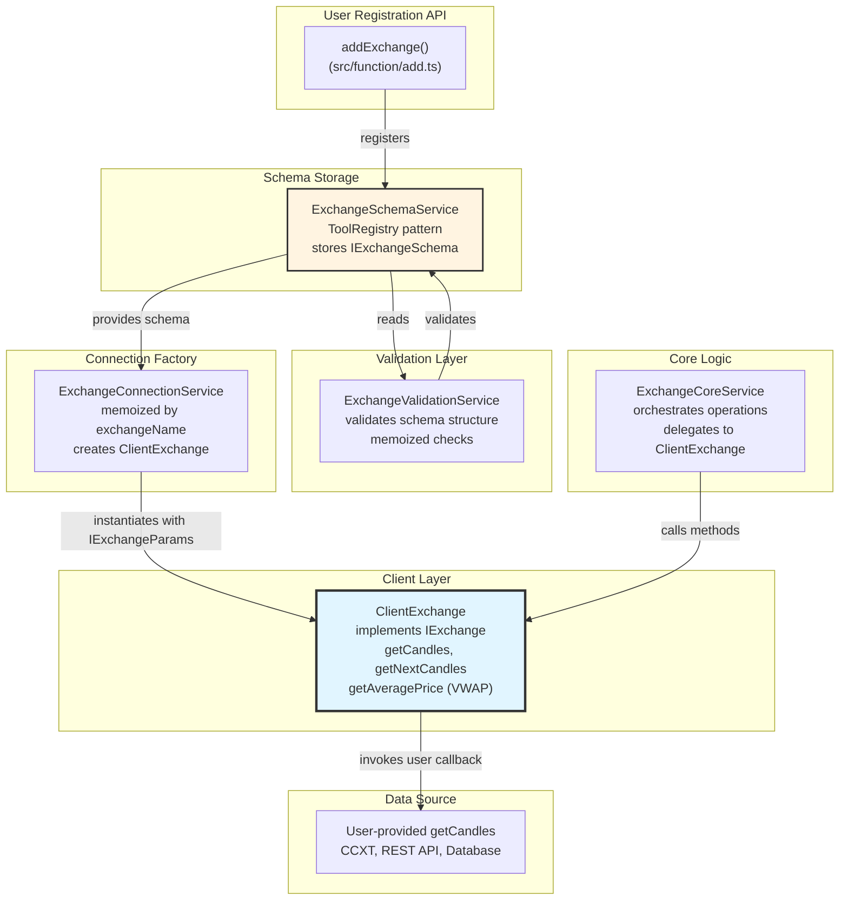
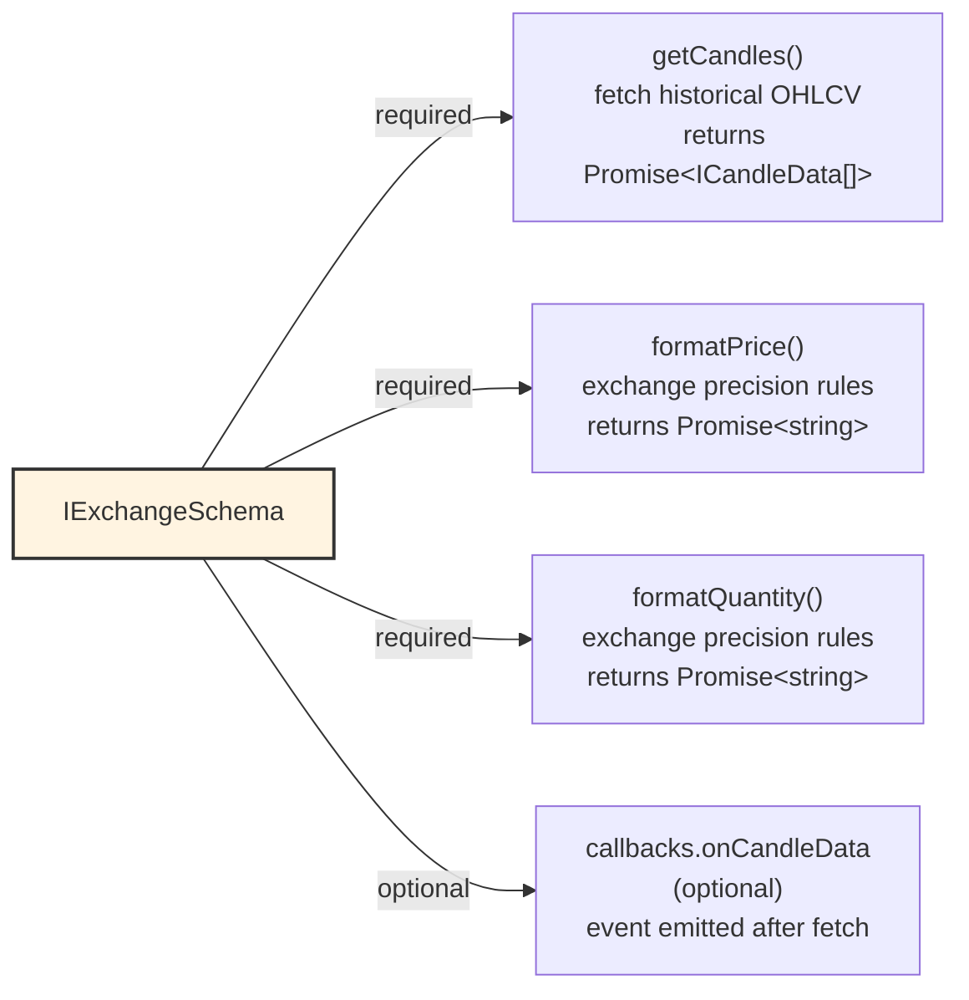
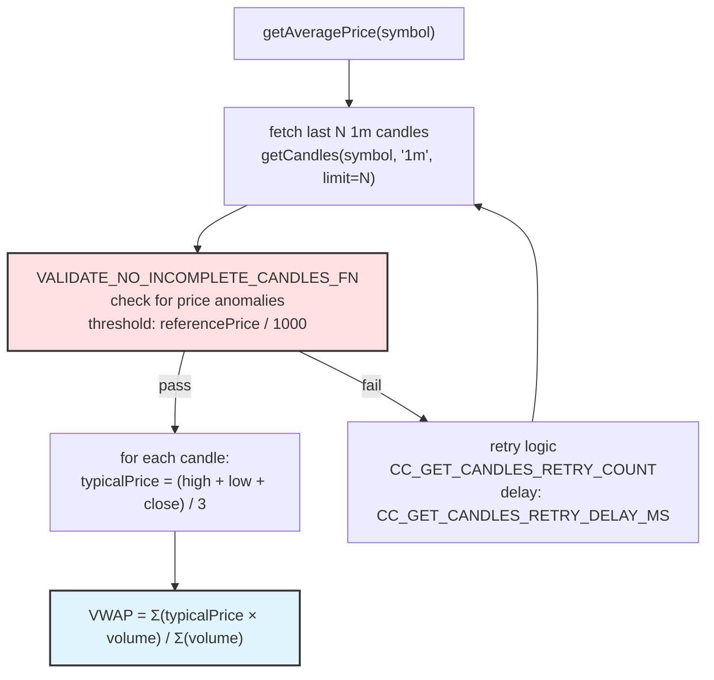
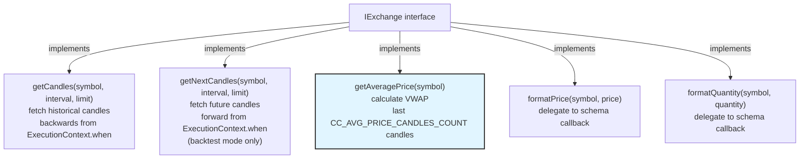
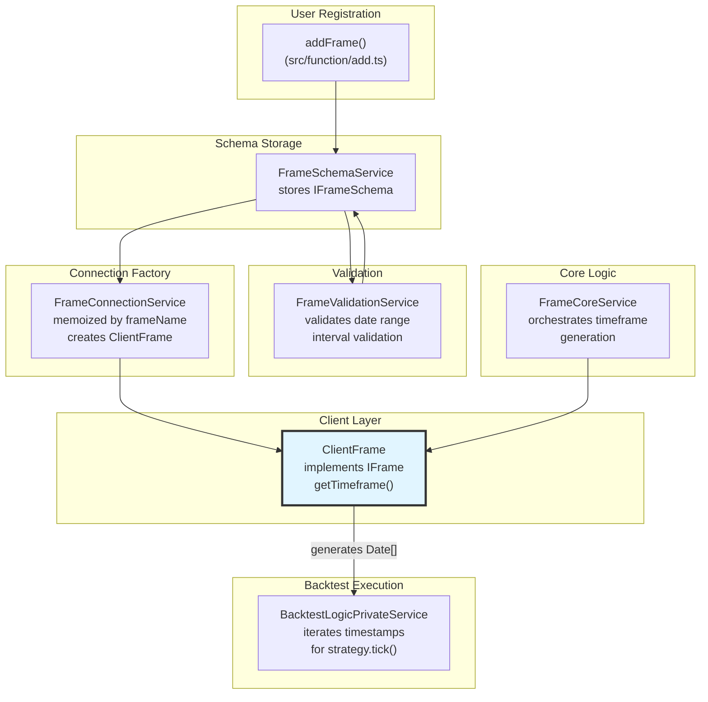
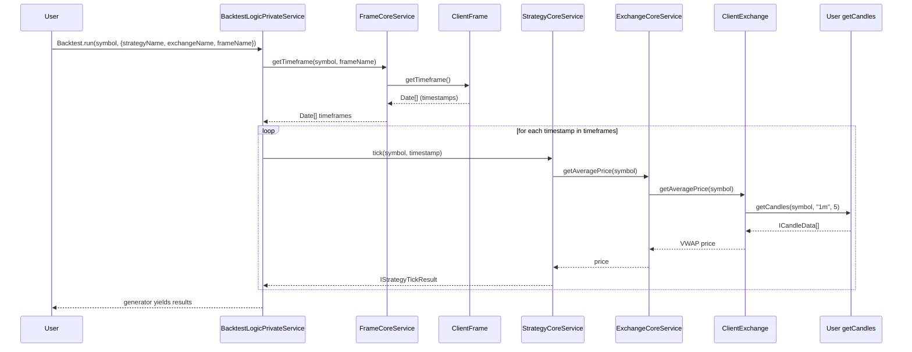
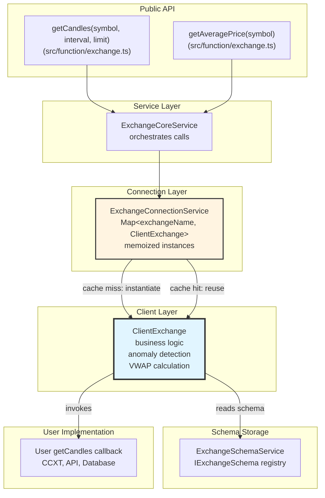

# Data and Exchanges

# Data and Exchanges

<details>
<summary>Relevant source files</summary>

The following files were used as context for generating this wiki page:

- [README.md](README.md)
- [src/config/emitters.ts](src/config/emitters.ts)
- [src/config/params.ts](src/config/params.ts)
- [src/function/event.ts](src/function/event.ts)
- [src/function/setup.ts](src/function/setup.ts)
- [src/helpers/toProfitLossDto.ts](src/helpers/toProfitLossDto.ts)
- [src/index.ts](src/index.ts)
- [src/interfaces/Heatmap.interface.ts](src/interfaces/Heatmap.interface.ts)
- [src/lib/services/validation/ConfigValidationService.ts](src/lib/services/validation/ConfigValidationService.ts)
- [test/config/setup.mjs](test/config/setup.mjs)
- [test/e2e/config.test.mjs](test/e2e/config.test.mjs)
- [test/e2e/defend.test.mjs](test/e2e/defend.test.mjs)
- [test/e2e/risk.test.mjs](test/e2e/risk.test.mjs)
- [test/e2e/sanitize.test.mjs](test/e2e/sanitize.test.mjs)
- [test/index.mjs](test/index.mjs)
- [test/mock/getMockCandles.mjs](test/mock/getMockCandles.mjs)
- [test/spec/config.test.mjs](test/spec/config.test.mjs)
- [test/spec/heat.test.mjs](test/spec/heat.test.mjs)
- [test/spec/list.test.mjs](test/spec/list.test.mjs)
- [types.d.ts](types.d.ts)

</details>


This page documents how the backtest-kit framework integrates with external data sources, fetches historical market data, calculates price metrics like VWAP, and manages timeframes for backtesting. It covers the Exchange system (data source abstraction), Frame system (timeframe generation), and the candle data structures used throughout the framework.

**Scope**: This page focuses on data acquisition and time management. For strategy execution logic, see [Strategy System](./11-strategy-system.md). For execution mode details (how Backtest/Live modes consume this data), see [Execution Modes (Detailed)](./16-execution-modes-detailed.md).

---

## Exchange System Architecture

The Exchange system provides an abstraction layer for fetching historical candle data from any source (CCXT, custom APIs, databases). The framework uses a three-tier architecture for exchange operations:



**Key Components**:

| Component | File Path | Responsibility |
|-----------|-----------|----------------|
| `IExchangeSchema` | [types.d.ts:327-363]() | Schema interface for exchange registration |
| `ExchangeSchemaService` | [src/lib/services/schema/ExchangeSchemaService.ts]() | ToolRegistry for storing exchange schemas |
| `ExchangeValidationService` | [src/lib/services/validation/ExchangeValidationService.ts]() | Validates exchange schema structure |
| `ExchangeConnectionService` | [src/lib/services/connection/ExchangeConnectionService.ts]() | Memoized factory for `ClientExchange` instances |
| `ClientExchange` | [src/lib/client/ClientExchange.ts]() | Business logic for candle fetching and VWAP |
| `ExchangeCoreService` | [src/lib/services/core/ExchangeCoreService.ts]() | High-level orchestration of exchange operations |

**Sources**: [types.d.ts:327-363](), [src/index.ts:1-195](), Diagram 1 from high-level architecture

---

## Exchange Configuration

### IExchangeSchema Structure

Exchanges are registered via `addExchange()` with a schema defining four required callbacks:



**Schema Definition** ([types.d.ts:327-363]()):

```typescript
interface IExchangeSchema {
    exchangeName: ExchangeName;  // Unique identifier
    note?: string;               // Documentation
    
    // Fetch candles from data source
    getCandles: (
        symbol: string,
        interval: CandleInterval,  // "1m" | "3m" | "5m" | ... | "8h"
        since: Date,
        limit: number
    ) => Promise<ICandleData[]>;
    
    // Format values per exchange precision
    formatQuantity: (symbol: string, quantity: number) => Promise<string>;
    formatPrice: (symbol: string, price: number) => Promise<string>;
    
    // Optional lifecycle callback
    callbacks?: Partial<IExchangeCallbacks>;
}
```

### Registration Example

```typescript
import ccxt from 'ccxt';
import { addExchange } from 'backtest-kit';

addExchange({
    exchangeName: 'binance',
    note: 'CCXT-based Binance integration',
    
    getCandles: async (symbol, interval, since, limit) => {
        const exchange = new ccxt.binance();
        const ohlcv = await exchange.fetchOHLCV(
            symbol,
            interval,
            since.getTime(),
            limit
        );
        
        return ohlcv.map(([timestamp, open, high, low, close, volume]) => ({
            timestamp, open, high, low, close, volume
        }));
    },
    
    formatPrice: async (symbol, price) => {
        const exchange = new ccxt.binance();
        await exchange.loadMarkets();
        return exchange.priceToPrecision(symbol, price);
    },
    
    formatQuantity: async (symbol, quantity) => {
        const exchange = new ccxt.binance();
        await exchange.loadMarkets();
        return exchange.amountToPrecision(symbol, quantity);
    },
    
    callbacks: {
        onCandleData: (symbol, interval, since, limit, data) => {
            console.log(`Fetched ${data.length} candles for ${symbol}`);
        }
    }
});
```

### Validation Rules

`ExchangeValidationService` enforces:
- `exchangeName` must be non-empty string
- `getCandles` must be a function
- `formatPrice` must be a function
- `formatQuantity` must be a function
- Exchange name must not already exist (checked during registration)

**Sources**: [types.d.ts:327-363](), [src/function/add.ts](), [test/spec/exchange.test.mjs](), [README.md:60-75]()

---

## Candle Data and VWAP

### ICandleData Structure

The framework uses a standard OHLCV candle structure:

```typescript
interface ICandleData {
    timestamp: number;  // Unix timestamp in milliseconds
    open: number;       // Opening price
    high: number;       // Highest price
    low: number;        // Lowest price
    close: number;      // Closing price
    volume: number;     // Trading volume
}
```

**Sources**: [types.d.ts:295-308]()

### VWAP Calculation

`ClientExchange.getAveragePrice()` calculates Volume-Weighted Average Price (VWAP) using the last N 1-minute candles, where N is configured via `CC_AVG_PRICE_CANDLES_COUNT` (default: 5).



**Implementation Details**:

1. **Fetching**: Calls `getCandles(symbol, "1m", limit)` where limit = `CC_AVG_PRICE_CANDLES_COUNT`
2. **Anomaly Detection**: Validates candles using `VALIDATE_NO_INCOMPLETE_CANDLES_FN` to detect incomplete candles from exchange APIs (e.g., Binance returning prices near $0 for incomplete candles)
3. **Typical Price**: For each candle, calculates `(high + low + close) / 3`
4. **VWAP**: `Σ(typicalPrice × volume) / Σ(volume)`
5. **Retry Logic**: On failure, retries up to `CC_GET_CANDLES_RETRY_COUNT` times with `CC_GET_CANDLES_RETRY_DELAY_MS` delay

**Configuration Parameters** ([src/config/params.ts:1-122]()):

| Parameter | Default | Description |
|-----------|---------|-------------|
| `CC_AVG_PRICE_CANDLES_COUNT` | 5 | Number of 1m candles for VWAP |
| `CC_GET_CANDLES_RETRY_COUNT` | 3 | Max retries for failed fetches |
| `CC_GET_CANDLES_RETRY_DELAY_MS` | 5000 | Delay between retries (ms) |
| `CC_GET_CANDLES_PRICE_ANOMALY_THRESHOLD_FACTOR` | 1000 | Anomaly detection threshold |
| `CC_GET_CANDLES_MIN_CANDLES_FOR_MEDIAN` | 5 | Min candles for median vs average |

### Price Anomaly Detection

`VALIDATE_NO_INCOMPLETE_CANDLES_FN` protects against incomplete candles from exchange APIs:

**Algorithm** ([src/lib/client/ClientExchange.ts]()):
1. Extract all price points (OHLC) from candles
2. Calculate reference price:
   - If `candles.length >= CC_GET_CANDLES_MIN_CANDLES_FOR_MEDIAN`: use median
   - Else: use simple average
3. For each price, check: `price < referencePrice / CC_GET_CANDLES_PRICE_ANOMALY_THRESHOLD_FACTOR`
4. If anomaly detected, throw error

**Example**: BTC at $50,000 median → threshold $50. Catches incomplete candles with prices like $0.01-$1.

**Sources**: [types.d.ts:14-106](), [src/lib/client/ClientExchange.ts](), [test/e2e/sanitize.test.mjs:666-784](), [src/config/params.ts:76-104]()

---

## ClientExchange Methods

`ClientExchange` implements the `IExchange` interface with four primary methods:



### getCandles vs getNextCandles

| Method | Direction | Use Case | Context |
|--------|-----------|----------|---------|
| `getCandles` | Backwards from `when` | Indicator calculation, VWAP | Backtest + Live |
| `getNextCandles` | Forward from `when` | Fast candle processing | Backtest only |

**Implementation** ([src/lib/client/ClientExchange.ts]()):
- Both methods call the user-provided `IExchangeSchema.getCandles` callback
- `getCandles`: `since = when - (limit * interval)`
- `getNextCandles`: `since = when`
- `ExecutionContext.when` is injected via `ExecutionContextService` (see [System Architecture](./06-system-architecture.md))

**Sources**: [types.d.ts:368-413](), [src/lib/client/ClientExchange.ts]()

---

## Timeframes and Frames

The Frame system generates timestamp arrays for backtest iteration. Each frame defines a date range and interval for generating tick timestamps.



### IFrameSchema Structure

```typescript
interface IFrameSchema {
    frameName: FrameName;       // Unique identifier
    note?: string;              // Documentation
    interval: FrameInterval;    // Timestamp granularity
    startDate: Date;            // Backtest start (inclusive)
    endDate: Date;              // Backtest end (inclusive)
    callbacks?: Partial<IFrameCallbacks>;  // onTimeframe event
}

type FrameInterval = 
    | "1m" | "3m" | "5m" | "15m" | "30m"      // Minutes
    | "1h" | "2h" | "4h" | "6h" | "8h" | "12h" // Hours
    | "1d" | "3d";                             // Days
```

**Sources**: [types.d.ts:420-502]()

### Timeframe Generation Algorithm

`ClientFrame.getTimeframe()` generates an array of `Date` objects:

**Implementation** ([src/lib/client/ClientFrame.ts]()):
```typescript
1. Parse interval to milliseconds (e.g., "1m" → 60000ms)
2. current = startDate
3. timestamps = []
4. while (current <= endDate):
       timestamps.push(new Date(current))
       current += interval_ms
5. return timestamps
```

**Example**: `interval="1m"`, `startDate="2024-01-01T00:00:00Z"`, `endDate="2024-01-01T01:00:00Z"`
- Generates 61 timestamps: 00:00, 00:01, 00:02, ..., 01:00

### Frame Registration Example

```typescript
import { addFrame } from 'backtest-kit';

addFrame({
    frameName: '30d-backtest',
    note: 'January 2024 full month',
    interval: '1m',
    startDate: new Date('2024-01-01T00:00:00Z'),
    endDate: new Date('2024-01-31T23:59:59Z'),
    callbacks: {
        onTimeframe: (timeframe, startDate, endDate, interval) => {
            console.log(`Generated ${timeframe.length} timestamps`);
            console.log(`Range: ${startDate} to ${endDate}`);
            console.log(`Interval: ${interval}`);
        }
    }
});
```

### Validation Rules

`FrameValidationService` enforces:
- `frameName` must be non-empty string
- `interval` must be valid `FrameInterval` type
- `startDate` must be valid Date
- `endDate` must be valid Date
- `endDate` must be greater than `startDate`

**Sources**: [types.d.ts:420-502](), [src/lib/client/ClientFrame.ts](), [test/spec/exchange.test.mjs]()

---

## Exchange and Frame Integration Flow

The following diagram shows how Exchange and Frame components integrate during backtest execution:



**Execution Context Injection**:
- `BacktestLogicPrivateService` sets `ExecutionContextService.when = timestamp` before each `tick()` call
- `ClientExchange.getCandles()` reads `ExecutionContext.when` to calculate `since` parameter
- This ensures all operations are scoped to the current backtest timestamp

**Sources**: [src/lib/services/logic/private/BacktestLogicPrivateService.ts](), [src/lib/services/core/ExchangeCoreService.ts](), [src/lib/services/core/FrameCoreService.ts]()

---

## Exchange Data Flow and Caching



**Memoization Strategy** ([src/lib/services/connection/ExchangeConnectionService.ts]()):
- `ClientExchange` instances are cached by `exchangeName`
- Cache key: `exchangeName` (string)
- Cache invalidation: None (instances live for application lifetime)
- Benefit: Avoids repeated schema lookups and instance creation

**Sources**: [src/function/exchange.ts](), [src/lib/services/connection/ExchangeConnectionService.ts](), [src/lib/services/core/ExchangeCoreService.ts]()

---

## Configuration Parameters Summary

All exchange and candle-related parameters are configurable via `setConfig()`:

| Parameter | Default | Range | Description |
|-----------|---------|-------|-------------|
| `CC_AVG_PRICE_CANDLES_COUNT` | 5 | Integer > 0 | VWAP candle count (1m interval) |
| `CC_GET_CANDLES_RETRY_COUNT` | 3 | Integer ≥ 0 | Max retries on fetch failure |
| `CC_GET_CANDLES_RETRY_DELAY_MS` | 5000 | Integer > 0 | Delay between retries (ms) |
| `CC_GET_CANDLES_PRICE_ANOMALY_THRESHOLD_FACTOR` | 1000 | Number > 0 | Anomaly detection divisor |
| `CC_GET_CANDLES_MIN_CANDLES_FOR_MEDIAN` | 5 | Integer > 0 | Threshold for median vs average |

**Usage**:
```typescript
import { setConfig } from 'backtest-kit';

setConfig({
    CC_AVG_PRICE_CANDLES_COUNT: 10,  // Use 10 candles for VWAP
    CC_GET_CANDLES_RETRY_COUNT: 5,   // More retries for unstable APIs
});
```

**Sources**: [src/config/params.ts:1-122](), [types.d.ts:5-239](), [test/e2e/config.test.mjs]()

---

## Error Handling and Retry Logic

Exchange operations implement robust error handling:

**Retry Mechanism** ([src/lib/client/ClientExchange.ts]()):
1. Wrap `getCandles()` call in try-catch
2. On error, log via `LoggerService`
3. Wait `CC_GET_CANDLES_RETRY_DELAY_MS` milliseconds
4. Retry up to `CC_GET_CANDLES_RETRY_COUNT` times
5. If all retries exhausted, propagate error to caller

**Error Scenarios**:
- **Network Timeout**: Retried automatically
- **Rate Limit**: User should implement exponential backoff in `getCandles` callback
- **Invalid Symbol**: Not retried (validation error)
- **Anomalous Prices**: Throws error after validation, triggers retry

**Test Coverage**: [test/e2e/sanitize.test.mjs:666-784]() demonstrates incomplete candle detection and rejection

**Sources**: [src/lib/client/ClientExchange.ts](), [src/config/params.ts:66-104]()

---

## Testing Examples

### Mock Exchange for Testing

```typescript
import { addExchange } from 'backtest-kit';

addExchange({
    exchangeName: 'mock-exchange',
    getCandles: async (symbol, interval, since, limit) => {
        const candles = [];
        const intervalMs = 60000; // 1 minute
        
        for (let i = 0; i < limit; i++) {
            const timestamp = since.getTime() + i * intervalMs;
            candles.push({
                timestamp,
                open: 42000 + i * 100,
                high: 42100 + i * 100,
                low: 41900 + i * 100,
                close: 42000 + i * 100,
                volume: 100,
            });
        }
        
        return candles;
    },
    formatPrice: async (symbol, price) => price.toFixed(8),
    formatQuantity: async (symbol, quantity) => quantity.toFixed(8),
});
```

### Anomaly Detection Test

From [test/e2e/sanitize.test.mjs:666-784]():
- Mock exchange returns incomplete candle with `open: 0.1` (anomaly)
- Normal candles have `open: 42000`
- `VALIDATE_NO_INCOMPLETE_CANDLES_FN` detects 0.1 < 42000 / 1000 = 42
- Error emitted via `errorEmitter`
- Test verifies error message contains "anomalously low price"

**Sources**: [test/mock/getMockCandles.mjs:1-42](), [test/e2e/sanitize.test.mjs:666-784](), [test/spec/exchange.test.mjs]()