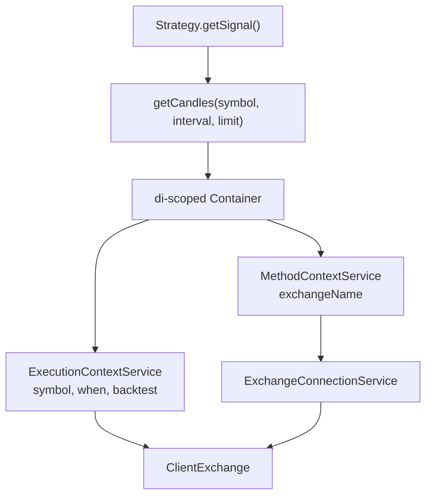
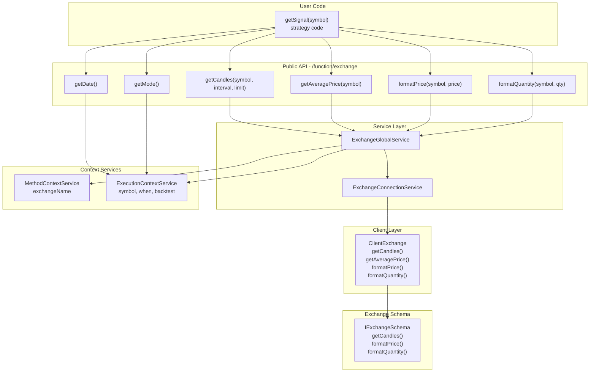
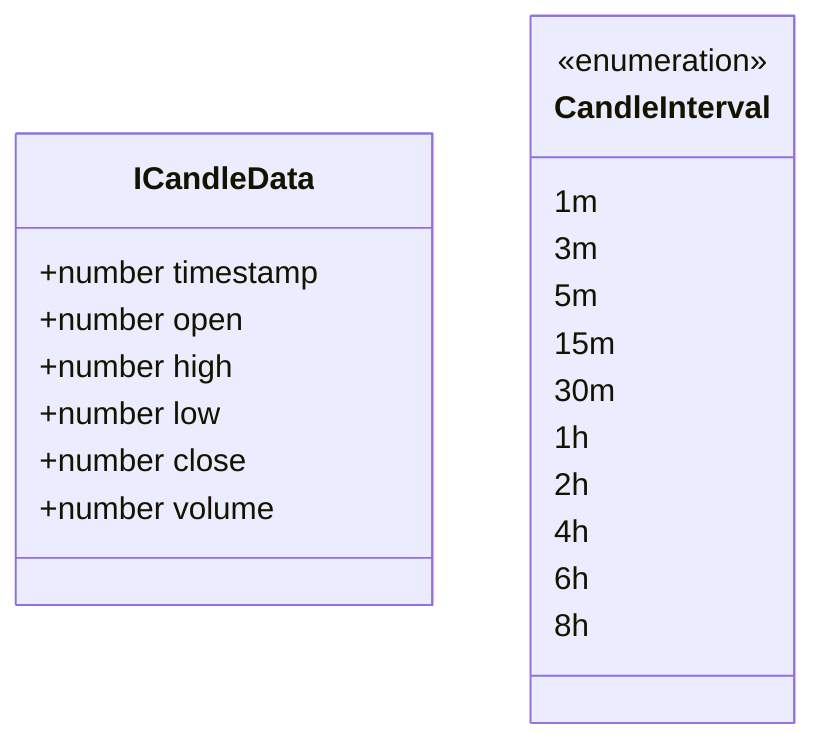
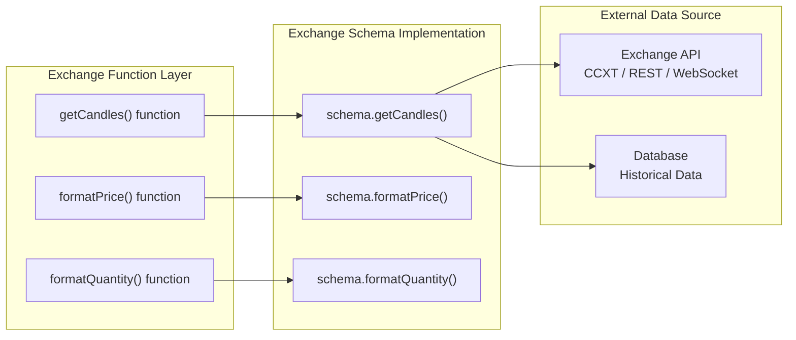

# Exchange Functions

<details>
<summary>Relevant source files</summary>

The following files were used as context for generating this wiki page:

- [docs/classes/BacktestUtils.md](docs/classes/BacktestUtils.md)
- [docs/classes/LiveUtils.md](docs/classes/LiveUtils.md)
- [docs/index.md](docs/index.md)
- [src/index.ts](src/index.ts)
- [test/index.mjs](test/index.mjs)
- [types.d.ts](types.d.ts)

</details>


## Purpose and Scope

This page documents the public utility functions for interacting with exchange data sources: `getCandles`, `getAveragePrice`, `formatPrice`, `formatQuantity`, `getDate`, and `getMode`. These functions provide a simplified API for accessing market data and exchange-specific formatting without requiring explicit context parameters.

For information about registering exchange schemas, see [Component Registration Functions](#4.2). For details about the underlying exchange client implementation, see [ClientExchange](#6.2). For defining custom exchange integrations, see [Exchange Schemas](#5.2).

**Sources:** [src/index.ts:26-32](), [types.d.ts:148-275]()

## Context Propagation Mechanism

Exchange functions leverage the framework's context propagation system to operate without explicit context parameters. When called from within a strategy's `getSignal()` function or during execution, these functions automatically resolve:

- **MethodContext**: Determines which exchange schema to use via `exchangeName`
- **ExecutionContext**: Provides runtime parameters (`symbol`, `when` timestamp, `backtest` flag)

This allows strategy authors to write clean code like `getCandles(symbol, interval, limit)` instead of passing context objects through every function call.



**Sources:** [types.d.ts:100-143](), [types.d.ts:363-402]()

---

## Function Reference

### getCandles

Fetches historical OHLCV candles from the registered exchange, looking backward from the current execution context timestamp.

**Signature:**
```typescript
function getCandles(
  symbol: string,
  interval: CandleInterval,
  limit: number
): Promise<ICandleData[]>
```

**Parameters:**

| Parameter | Type | Description |
|-----------|------|-------------|
| `symbol` | `string` | Trading pair symbol (e.g., `"BTCUSDT"`) |
| `interval` | `CandleInterval` | Candle time interval: `"1m"`, `"3m"`, `"5m"`, `"15m"`, `"30m"`, `"1h"`, `"2h"`, `"4h"`, `"6h"`, `"8h"` |
| `limit` | `number` | Maximum number of candles to fetch (fetched backward from execution time) |

**Returns:** `Promise<ICandleData[]>` - Array of candle data with `timestamp`, `open`, `high`, `low`, `close`, `volume`

**Context Requirements:**
- Must be called within a context established by `ExecutionContextService.runInContext`
- Requires valid `MethodContext` with `exchangeName`

**Example:**
```typescript
addStrategy({
  strategyName: "ema-crossover",
  interval: "1m",
  getSignal: async (symbol) => {
    // Fetch last 20 candles at 1-minute interval
    const candles = await getCandles(symbol, "1m", 20);
    
    // Calculate EMA from candles
    const closes = candles.map(c => c.close);
    const ema = calculateEMA(closes, 20);
    
    // Generate signal based on indicator
    if (ema > threshold) {
      return {
        position: "long",
        priceTakeProfit: candles[0].close * 1.02,
        priceStopLoss: candles[0].close * 0.98,
        minuteEstimatedTime: 60,
      };
    }
    return null;
  }
});
```

**Sources:** [types.d.ts:148-166](), [types.d.ts:226-235](), [src/index.ts:26-32]()

---

### getAveragePrice

Calculates the Volume-Weighted Average Price (VWAP) from the most recent 1-minute candles. Uses `CC_AVG_PRICE_CANDLES_COUNT` candles (default: 5) for calculation.

**Formula:** 
```
VWAP = Σ(Typical Price × Volume) / Σ(Volume)
where Typical Price = (High + Low + Close) / 3
```

**Signature:**
```typescript
function getAveragePrice(symbol: string): Promise<number>
```

**Parameters:**

| Parameter | Type | Description |
|-----------|------|-------------|
| `symbol` | `string` | Trading pair symbol (e.g., `"BTCUSDT"`) |

**Returns:** `Promise<number>` - Volume-weighted average price

**Context Requirements:**
- Must be called within execution context
- Automatically fetches last `CC_AVG_PRICE_CANDLES_COUNT` 1-minute candles

**Example:**
```typescript
addStrategy({
  strategyName: "vwap-strategy",
  interval: "1m",
  getSignal: async (symbol) => {
    const vwap = await getAveragePrice(symbol);
    const lastCandle = (await getCandles(symbol, "1m", 1))[0];
    
    // Entry if price is below VWAP (potential reversion)
    if (lastCandle.close < vwap * 0.995) {
      return {
        position: "long",
        priceTakeProfit: vwap * 1.01,
        priceStopLoss: vwap * 0.98,
        minuteEstimatedTime: 30,
      };
    }
    return null;
  }
});
```

**Sources:** [types.d.ts:261-270](), [types.d.ts:12-16]()

---

### formatPrice

Formats a price value according to the exchange's precision rules for a specific symbol.

**Signature:**
```typescript
function formatPrice(symbol: string, price: number): Promise<string>
```

**Parameters:**

| Parameter | Type | Description |
|-----------|------|-------------|
| `symbol` | `string` | Trading pair symbol (e.g., `"BTCUSDT"`) |
| `price` | `number` | Raw price value to format |

**Returns:** `Promise<string>` - Formatted price string with correct precision

**Context Requirements:**
- Requires valid `MethodContext` with `exchangeName`
- Delegates to exchange schema's `formatPrice` implementation

**Example:**
```typescript
addExchange({
  exchangeName: "binance",
  formatPrice: async (symbol, price) => {
    // BTCUSDT: 2 decimal places
    // ETHUSDT: 2 decimal places
    // DOGEUSDT: 5 decimal places
    const precisionMap = {
      "BTCUSDT": 2,
      "ETHUSDT": 2,
      "DOGEUSDT": 5,
    };
    const precision = precisionMap[symbol] ?? 2;
    return price.toFixed(precision);
  },
  // ... other methods
});

// Usage in strategy or reporting
const formattedPrice = await formatPrice("BTCUSDT", 45123.456789);
// Returns: "45123.46"
```

**Sources:** [types.d.ts:212-218](), [types.d.ts:252-260]()

---

### formatQuantity

Formats a quantity value according to the exchange's precision rules for a specific symbol.

**Signature:**
```typescript
function formatQuantity(symbol: string, quantity: number): Promise<string>
```

**Parameters:**

| Parameter | Type | Description |
|-----------|------|-------------|
| `symbol` | `string` | Trading pair symbol (e.g., `"BTCUSDT"`) |
| `quantity` | `number` | Raw quantity value to format |

**Returns:** `Promise<string>` - Formatted quantity string with correct precision

**Context Requirements:**
- Requires valid `MethodContext` with `exchangeName`
- Delegates to exchange schema's `formatQuantity` implementation

**Example:**
```typescript
addExchange({
  exchangeName: "binance",
  formatQuantity: async (symbol, quantity) => {
    // BTC: 6 decimal places (min 0.000001)
    // ETH: 5 decimal places (min 0.00001)
    // DOGE: 0 decimal places (whole numbers)
    const precisionMap = {
      "BTCUSDT": 6,
      "ETHUSDT": 5,
      "DOGEUSDT": 0,
    };
    const precision = precisionMap[symbol] ?? 8;
    return quantity.toFixed(precision);
  },
  // ... other methods
});

// Usage with position sizing
const quantity = 0.00123456789;
const formatted = await formatQuantity("BTCUSDT", quantity);
// Returns: "0.001235"
```

**Sources:** [types.d.ts:204-210](), [types.d.ts:246-251]()

---

### getDate

Retrieves the current execution context timestamp. Returns the historical timestamp during backtest or `Date.now()` during live trading.

**Signature:**
```typescript
function getDate(): Date
```

**Returns:** `Date` - Current execution context timestamp

**Context Requirements:**
- Must be called within `ExecutionContextService.runInContext`
- Returns `executionContext.when`

**Example:**
```typescript
addStrategy({
  strategyName: "time-based",
  interval: "1m",
  getSignal: async (symbol) => {
    const now = getDate();
    const hour = now.getHours();
    
    // Only trade during specific hours
    if (hour >= 9 && hour <= 16) {
      const candles = await getCandles(symbol, "1m", 1);
      return {
        position: "long",
        priceTakeProfit: candles[0].close * 1.01,
        priceStopLoss: candles[0].close * 0.99,
        minuteEstimatedTime: 30,
      };
    }
    return null;
  }
});
```

**Sources:** [types.d.ts:105-112]()

---

### getMode

Returns whether the current execution is in backtest mode or live trading mode.

**Signature:**
```typescript
function getMode(): boolean
```

**Returns:** `boolean` - `true` if in backtest mode, `false` if in live mode

**Context Requirements:**
- Must be called within `ExecutionContextService.runInContext`
- Returns `executionContext.backtest`

**Example:**
```typescript
addStrategy({
  strategyName: "mode-aware",
  interval: "1m",
  getSignal: async (symbol) => {
    const isBacktest = getMode();
    
    if (isBacktest) {
      // Use conservative parameters for backtest
      const multiplier = 1.01;
    } else {
      // Use aggressive parameters for live trading
      const multiplier = 1.015;
    }
    
    const candles = await getCandles(symbol, "1m", 1);
    return {
      position: "long",
      priceTakeProfit: candles[0].close * multiplier,
      priceStopLoss: candles[0].close * 0.99,
      minuteEstimatedTime: 30,
    };
  }
});
```

**Sources:** [types.d.ts:105-112]()

---

## Architecture Integration

### Data Flow Diagram



**Sources:** [src/index.ts:26-32](), [types.d.ts:168-221](), [types.d.ts:223-271]()

---

### Candle Data Structure

The `ICandleData` interface defines the structure returned by `getCandles`:



| Field | Type | Description |
|-------|------|-------------|
| `timestamp` | `number` | Unix timestamp in milliseconds when candle opened |
| `open` | `number` | Opening price at candle start |
| `high` | `number` | Highest price during candle period |
| `low` | `number` | Lowest price during candle period |
| `close` | `number` | Closing price at candle end |
| `volume` | `number` | Trading volume during candle period |

**Sources:** [types.d.ts:148-166]()

---

## Integration with Exchange Schema

Exchange functions delegate to the user-defined `IExchangeSchema` implementation registered via `addExchange()`. The schema must implement three required methods:



**Sources:** [types.d.ts:185-221]()

---

## Usage Patterns

### Pattern 1: Technical Indicator Calculation

```typescript
addStrategy({
  strategyName: "sma-crossover",
  interval: "1m",
  getSignal: async (symbol) => {
    // Fetch enough candles for both SMAs
    const candles = await getCandles(symbol, "1m", 50);
    
    // Calculate SMAs
    const closes = candles.map(c => c.close);
    const sma20 = closes.slice(0, 20).reduce((a, b) => a + b) / 20;
    const sma50 = closes.reduce((a, b) => a + b) / 50;
    
    // Crossover signal
    if (sma20 > sma50) {
      return {
        position: "long",
        priceTakeProfit: closes[0] * 1.02,
        priceStopLoss: closes[0] * 0.98,
        minuteEstimatedTime: 120,
      };
    }
    return null;
  }
});
```

**Sources:** [types.d.ts:615-633]()

---

### Pattern 2: VWAP-Based Entry

```typescript
addStrategy({
  strategyName: "vwap-reversal",
  interval: "5m",
  getSignal: async (symbol) => {
    const vwap = await getAveragePrice(symbol);
    const recentCandles = await getCandles(symbol, "1m", 5);
    
    // Entry when price deviates from VWAP
    const currentPrice = recentCandles[0].close;
    const deviation = (currentPrice - vwap) / vwap;
    
    if (deviation < -0.01) { // 1% below VWAP
      return {
        position: "long",
        priceTakeProfit: vwap, // Target: return to VWAP
        priceStopLoss: currentPrice * 0.98,
        minuteEstimatedTime: 60,
      };
    }
    return null;
  }
});
```

**Sources:** [types.d.ts:261-270]()

---

### Pattern 3: Multi-Timeframe Analysis

```typescript
addStrategy({
  strategyName: "multi-timeframe",
  interval: "1m",
  getSignal: async (symbol) => {
    // Short-term trend (5-minute candles)
    const candles5m = await getCandles(symbol, "5m", 12); // 1 hour
    const trend5m = candles5m[0].close > candles5m[11].close;
    
    // Long-term trend (1-hour candles)
    const candles1h = await getCandles(symbol, "1h", 24); // 1 day
    const trend1h = candles1h[0].close > candles1h[23].close;
    
    // Entry only if both timeframes agree
    if (trend5m && trend1h) {
      const entryPrice = candles5m[0].close;
      return {
        position: "long",
        priceTakeProfit: entryPrice * 1.03,
        priceStopLoss: entryPrice * 0.97,
        minuteEstimatedTime: 180,
      };
    }
    return null;
  }
});
```

**Sources:** [types.d.ts:148-166]()

---

### Pattern 4: Mode-Aware Precision Formatting

```typescript
addStrategy({
  strategyName: "reporting-strategy",
  interval: "1m",
  callbacks: {
    onClose: async (symbol, signal, priceClose, backtest) => {
      // Format prices for logging or external reporting
      const formattedOpen = await formatPrice(symbol, signal.priceOpen);
      const formattedClose = await formatPrice(symbol, priceClose);
      const formattedTP = await formatPrice(symbol, signal.priceTakeProfit);
      
      console.log(`Signal closed:`);
      console.log(`  Entry: ${formattedOpen}`);
      console.log(`  Exit: ${formattedClose}`);
      console.log(`  Target: ${formattedTP}`);
    }
  },
  getSignal: async (symbol) => {
    // ... signal logic
  }
});
```

**Sources:** [types.d.ts:212-218](), [types.d.ts:595-611]()

---

## Best Practices

### Candle Limit Optimization

Fetch only the minimum required candles to reduce memory usage and improve performance:

```typescript
// ❌ Bad: Fetching excessive data
const candles = await getCandles(symbol, "1m", 1000); // 1000 candles

// ✅ Good: Fetch only what's needed
const candles = await getCandles(symbol, "1m", 20); // 20 candles for EMA
```

### VWAP Usage for Entry Prices

Use `getAveragePrice()` instead of last candle close for more accurate market pricing:

```typescript
// ❌ Acceptable: Using last candle close
const candles = await getCandles(symbol, "1m", 1);
const entryPrice = candles[0].close;

// ✅ Better: Using VWAP (5-candle average)
const entryPrice = await getAveragePrice(symbol);
```

### Format Validation

Always format prices and quantities before external API calls or logging:

```typescript
// ❌ Bad: Raw float values
console.log(`Price: ${signal.priceOpen}`); // 45123.456789123

// ✅ Good: Exchange-formatted values
const formatted = await formatPrice(symbol, signal.priceOpen);
console.log(`Price: ${formatted}`); // 45123.46
```

### Context Awareness

Use `getMode()` to adjust behavior between backtest and live:

```typescript
const isBacktest = getMode();
const limit = isBacktest ? 100 : 20; // More data in backtest

const candles = await getCandles(symbol, "1m", limit);
```

**Sources:** [types.d.ts:105-112](), [types.d.ts:226-270]()

---

## Error Handling

Exchange functions may throw errors in the following scenarios:

| Error Condition | Cause | Resolution |
|----------------|-------|------------|
| **Context not established** | Functions called outside `ExecutionContextService.runInContext` | Ensure functions are called within strategy execution context |
| **Exchange not registered** | `exchangeName` in `MethodContext` does not exist | Register exchange via `addExchange()` before execution |
| **Invalid interval** | Unsupported `CandleInterval` value | Use one of the supported intervals: `1m`, `3m`, `5m`, `15m`, `30m`, `1h`, `2h`, `4h`, `6h`, `8h` |
| **Data source failure** | Exchange schema's implementation throws error | Implement error handling in exchange schema's methods |
| **Network timeout** | External API call exceeds timeout | Implement retry logic or timeout handling in schema |

**Sources:** [types.d.ts:185-221]()

---

## Performance Considerations

### Candle Caching

The framework does not cache candle data by default. For strategies that repeatedly access the same candles, consider implementing your own caching layer:

```typescript
const candleCache = new Map<string, ICandleData[]>();

async function getCachedCandles(symbol: string, interval: CandleInterval, limit: number) {
  const key = `${symbol}:${interval}:${limit}`;
  if (!candleCache.has(key)) {
    candleCache.set(key, await getCandles(symbol, interval, limit));
  }
  return candleCache.get(key)!;
}
```

### VWAP Calculation Cost

`getAveragePrice()` fetches `CC_AVG_PRICE_CANDLES_COUNT` candles and calculates VWAP on every call. For high-frequency strategies, cache the result:

```typescript
let cachedVWAP: { timestamp: number, value: number } | null = null;

async function getCachedVWAP(symbol: string): Promise<number> {
  const now = getDate().getTime();
  if (!cachedVWAP || now - cachedVWAP.timestamp > 60000) { // 1 minute cache
    cachedVWAP = {
      timestamp: now,
      value: await getAveragePrice(symbol)
    };
  }
  return cachedVWAP.value;
}
```

**Sources:** [types.d.ts:12-16](), [types.d.ts:261-270]()