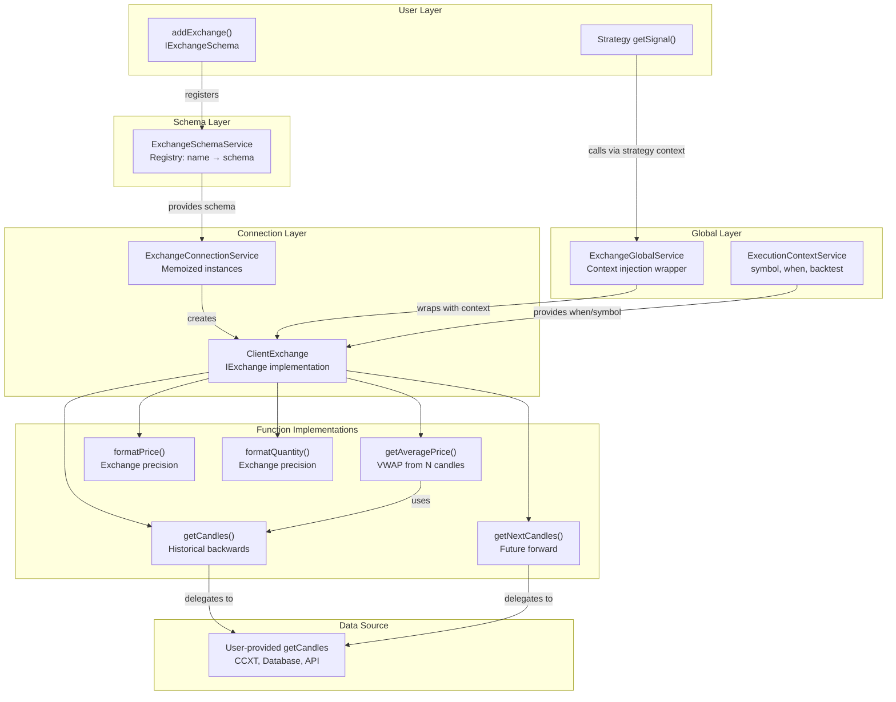
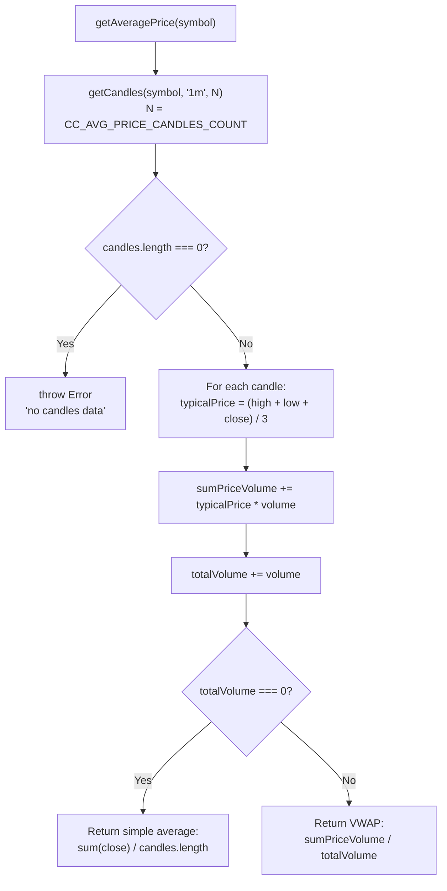
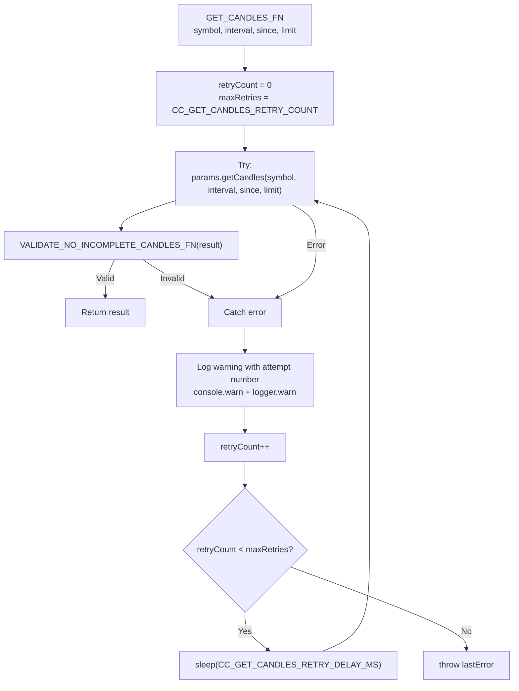
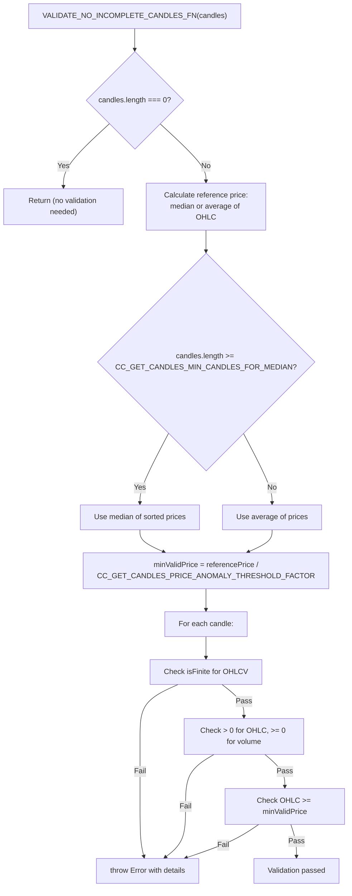
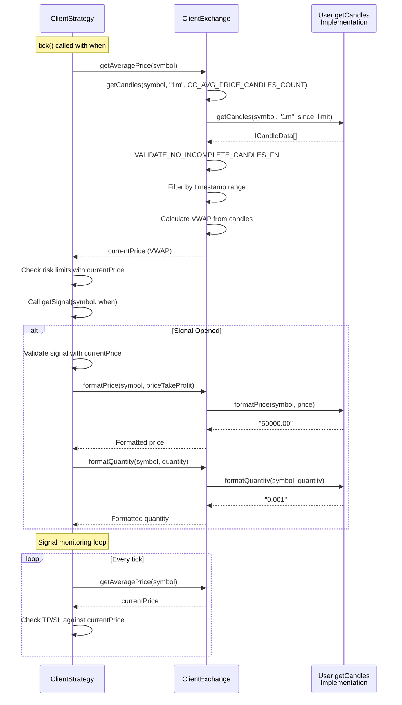

# Exchange Functions

<details>
<summary>Relevant source files</summary>

The following files were used as context for generating this wiki page:

- [src/client/ClientExchange.ts](src/client/ClientExchange.ts)
- [src/client/ClientStrategy.ts](src/client/ClientStrategy.ts)
- [src/interfaces/Strategy.interface.ts](src/interfaces/Strategy.interface.ts)
- [src/lib/services/logic/private/BacktestLogicPrivateService.ts](src/lib/services/logic/private/BacktestLogicPrivateService.ts)
- [src/lib/services/logic/private/LiveLogicPrivateService.ts](src/lib/services/logic/private/LiveLogicPrivateService.ts)
- [src/lib/services/logic/private/WalkerLogicPrivateService.ts](src/lib/services/logic/private/WalkerLogicPrivateService.ts)
- [types.d.ts](types.d.ts)

</details>


This page documents the exchange helper functions available in the public API. These functions provide standardized access to market data (candles, prices) with built-in retry logic, validation, and VWAP calculation. Exchange functions are defined in user-provided exchange schemas and accessed through the `ClientExchange` implementation.

For information about registering exchange schemas, see [Component Registration Functions](#4.2). For details on implementing custom exchange integrations, see [Custom Exchange Integration](#16.1).

---

## Function Overview

Exchange functions provide four categories of functionality:

| Function | Purpose | Mode Support | Configuration |
|----------|---------|--------------|---------------|
| `getCandles` | Fetch historical candles backwards from execution context time | Backtest, Live | `CC_AVG_PRICE_CANDLES_COUNT`, retry params |
| `getNextCandles` | Fetch future candles forward from execution context time | Backtest only | Retry params, anomaly detection |
| `getAveragePrice` | Calculate VWAP from last N 1-minute candles | Backtest, Live | `CC_AVG_PRICE_CANDLES_COUNT` |
| `formatPrice` | Format price according to exchange precision rules | Backtest, Live | User-defined in schema |
| `formatQuantity` | Format quantity according to exchange precision rules | Backtest, Live | User-defined in schema |

All functions operate within the current `ExecutionContext` (symbol, when, backtest flag) and automatically handle retries, validation, and error logging.

**Sources:** [types.d.ts:263-309](), [src/client/ClientExchange.ts:179-374]()

---

## Exchange Function Access Patterns



**Diagram: Exchange Function Call Flow and Service Layers**

This diagram shows how exchange functions are accessed through multiple service layers. User-provided implementations are wrapped with retry logic, validation, and context injection. The `ExchangeGlobalService` provides the entry point for strategy code, while `ClientExchange` implements the core logic.

**Sources:** [src/client/ClientExchange.ts:179-181](), [types.d.ts:206-259]()

---

## getCandles Function

The `getCandles` function fetches historical candles backwards from the current execution context time (`ExecutionContext.when`). It automatically calculates the correct `since` timestamp based on the requested interval and limit.

### Function Signature

```typescript
getCandles(
  symbol: string,
  interval: CandleInterval,
  limit: number
): Promise<ICandleData[]>
```

### Parameters

- **symbol**: Trading pair symbol (e.g., `"BTCUSDT"`)
- **interval**: Candle time interval - `"1m"` | `"3m"` | `"5m"` | `"15m"` | `"30m"` | `"1h"` | `"2h"` | `"4h"` | `"6h"` | `"8h"`
- **limit**: Maximum number of candles to fetch

### Return Type

```typescript
interface ICandleData {
  timestamp: number;  // Unix timestamp in milliseconds
  open: number;       // Opening price
  high: number;       // Highest price
  low: number;        // Lowest price
  close: number;      // Closing price
  volume: number;     // Trading volume
}
```

### Implementation Details

The function calculates the `since` timestamp by subtracting `(interval * limit - interval)` minutes from `ExecutionContext.when`:

```typescript
const step = INTERVAL_MINUTES[interval];
const adjust = step * limit - step;
const since = new Date(
  this.params.execution.context.when.getTime() - adjust * 60 * 1_000
);
```

After fetching candles, the function filters results to match the exact requested range:

```typescript
const filteredData = data.filter(
  (candle) =>
    candle.timestamp >= sinceTimestamp && candle.timestamp <= whenTimestamp
);
```

### Retry Logic

`getCandles` automatically retries failed requests using the `GET_CANDLES_FN` wrapper:

- Retry count: `CC_GET_CANDLES_RETRY_COUNT` (default: 3)
- Retry delay: `CC_GET_CANDLES_RETRY_DELAY_MS` (default: 5000ms)
- Validates candles after each attempt using `VALIDATE_NO_INCOMPLETE_CANDLES_FN`

**Sources:** [src/client/ClientExchange.ts:190-242](), [src/client/ClientExchange.ts:114-151]()

---

## getNextCandles Function

The `getNextCandles` function fetches future candles forward from the current execution context time. This function is **only valid in backtest mode** and returns empty array if the requested period extends beyond `Date.now()`.

### Function Signature

```typescript
getNextCandles(
  symbol: string,
  interval: CandleInterval,
  limit: number
): Promise<ICandleData[]>
```

### Backtest-Only Guard

```typescript
const step = INTERVAL_MINUTES[interval];
const endTime = since.getTime() + limit * step * 60 * 1000;

// Returns empty array if requesting future data beyond now
if (endTime > now) {
  return [];
}
```

This guard ensures that backtest simulations cannot "peek into the future" beyond the current timestamp. The function starts fetching from `ExecutionContext.when` and extends forward by `limit` intervals.

### Use Cases

The function is primarily used by backtest execution to fetch candles for signal duration:

1. **Signal Open**: When a signal opens, `BacktestLogicPrivateService` fetches `minuteEstimatedTime` candles forward
2. **Scheduled Signal**: For scheduled signals, fetches `CC_SCHEDULE_AWAIT_MINUTES + minuteEstimatedTime + 1` candles
3. **Fast-forward**: Allows backtest to skip timeframes during active signal monitoring

**Sources:** [src/client/ClientExchange.ts:254-304](), [src/lib/services/logic/private/BacktestLogicPrivateService.ts:134-140]()

---

## getAveragePrice Function (VWAP Calculation)

The `getAveragePrice` function calculates the Volume-Weighted Average Price (VWAP) from the last N 1-minute candles. The number of candles is configurable via `GLOBAL_CONFIG.CC_AVG_PRICE_CANDLES_COUNT` (default: 5).

### VWAP Calculation Flow



**Diagram: VWAP Calculation Algorithm**

### Formula

**VWAP** = Σ(Typical Price × Volume) / Σ(Volume)

Where **Typical Price** = (High + Low + Close) / 3

### Fallback Behavior

If total volume is zero (rare edge case), the function returns a simple average of close prices:

```typescript
if (totalVolume === 0) {
  const sum = candles.reduce((acc, candle) => acc + candle.close, 0);
  return sum / candles.length;
}
```

### Usage Context

`getAveragePrice` is called extensively throughout the system:

- **Signal Generation**: `ClientStrategy` uses VWAP as `currentPrice` for risk checks
- **Signal Validation**: VWAP is compared against `priceOpen`, `priceTakeProfit`, `priceStopLoss`
- **Signal Monitoring**: Active signals are monitored using VWAP for TP/SL detection
- **Callbacks**: VWAP is passed to strategy callbacks as `currentPrice` parameter

**Sources:** [src/client/ClientExchange.ts:320-355](), [src/client/ClientStrategy.ts:285-287]()

---

## Format Functions

The `formatPrice` and `formatQuantity` functions delegate to user-provided implementations in the exchange schema. These functions apply exchange-specific precision rules to ensure valid order placement.

### formatPrice

```typescript
formatPrice(symbol: string, price: number): Promise<string>
```

Formats a price value according to exchange precision rules. For example, Binance might require 2 decimal places for BTCUSDT but 8 decimals for smaller altcoins.

### formatQuantity

```typescript
formatQuantity(symbol: string, quantity: number): Promise<string>
```

Formats a quantity value according to exchange lot size and step size rules. Ensures the quantity meets minimum order size requirements.

### Implementation Pattern

Both functions are thin wrappers around user-provided implementations:

```typescript
public async formatPrice(symbol: string, price: number) {
  this.params.logger.debug("binanceService formatPrice", {
    symbol,
    price,
  });
  return await this.params.formatPrice(symbol, price);
}
```

The actual formatting logic is defined in the `IExchangeSchema` registered via `addExchange()`.

**Sources:** [src/client/ClientExchange.ts:357-371](), [types.d.ts:241-257]()

---

## Retry Logic and Error Handling



**Diagram: GET_CANDLES_FN Retry Logic Flow**

### Retry Configuration

| Parameter | Default | Purpose |
|-----------|---------|---------|
| `CC_GET_CANDLES_RETRY_COUNT` | 3 | Number of retry attempts before throwing error |
| `CC_GET_CANDLES_RETRY_DELAY_MS` | 5000 | Delay in milliseconds between retry attempts |

### Error Logging

Each retry attempt logs a warning with detailed context:

```typescript
const message = `ClientExchange GET_CANDLES_FN: attempt ${i + 1} failed for symbol=${dto.symbol}, interval=${dto.interval}, since=${since.toISOString()}, limit=${dto.limit}}`;
self.params.logger.warn(message, {
  error: errorData(err),
  message: getErrorMessage(err),
});
console.warn(message);
```

After exhausting all retries, the function throws the last error encountered.

**Sources:** [src/client/ClientExchange.ts:114-151]()

---

## Data Validation and Price Anomaly Detection

All fetched candles are validated using `VALIDATE_NO_INCOMPLETE_CANDLES_FN` to detect incomplete or anomalous data from exchange APIs (particularly common with Binance).

### Validation Checks



**Diagram: Candle Validation and Anomaly Detection Flow**

### Reference Price Calculation

The validation uses different statistical methods based on data size:

- **Large dataset** (≥ `CC_GET_CANDLES_MIN_CANDLES_FOR_MEDIAN`): Uses **median** for robust statistics
- **Small dataset** (< threshold): Uses **average** for more stable calculation

```typescript
if (candles.length >= GLOBAL_CONFIG.CC_GET_CANDLES_MIN_CANDLES_FOR_MEDIAN) {
  const sortedPrices = [...validPrices].sort((a, b) => a - b);
  referencePrice = sortedPrices[Math.floor(sortedPrices.length / 2)] || 0;
} else {
  const sum = validPrices.reduce((acc, p) => acc + p, 0);
  referencePrice = validPrices.length > 0 ? sum / validPrices.length : 0;
}
```

### Anomaly Detection

The function detects anomalously low prices (common indicator of incomplete candles):

```typescript
const minValidPrice = referencePrice / GLOBAL_CONFIG.CC_GET_CANDLES_PRICE_ANOMALY_THRESHOLD_FACTOR;

// Example with BTC at $50,000 median and factor 1000:
// minValidPrice = $50 (catches prices like $0.01-1)
```

### Validation Errors

The function throws detailed errors for three types of anomalies:

1. **Invalid numeric values**: NaN or Infinity in OHLCV fields
2. **Non-positive values**: Zero or negative prices, negative volume
3. **Anomalous prices**: Prices below threshold (likely incomplete candles)

**Sources:** [src/client/ClientExchange.ts:23-105](), [types.d.ts:45-72]()

---

## Configuration Parameters

The following global configuration parameters control exchange function behavior:

| Parameter | Default | Type | Purpose |
|-----------|---------|------|---------|
| `CC_AVG_PRICE_CANDLES_COUNT` | 5 | number | Number of 1m candles for VWAP calculation |
| `CC_GET_CANDLES_RETRY_COUNT` | 3 | number | Maximum retry attempts for failed candle fetches |
| `CC_GET_CANDLES_RETRY_DELAY_MS` | 5000 | number | Delay in milliseconds between retry attempts |
| `CC_GET_CANDLES_PRICE_ANOMALY_THRESHOLD_FACTOR` | 1000 | number | Divisor for anomaly detection threshold |
| `CC_GET_CANDLES_MIN_CANDLES_FOR_MEDIAN` | 5 | number | Minimum candles to use median vs average for reference price |

### Configuration Example

```typescript
import { setConfig } from 'backtest-kit';

await setConfig({
  CC_AVG_PRICE_CANDLES_COUNT: 10,      // Use 10 candles for VWAP
  CC_GET_CANDLES_RETRY_COUNT: 5,       // Retry 5 times
  CC_GET_CANDLES_RETRY_DELAY_MS: 3000, // Wait 3 seconds between retries
});
```

For complete configuration documentation, see [Global Configuration](#14.1).

**Sources:** [types.d.ts:5-72](), [src/client/ClientExchange.ts:325-329]()

---

## Usage in Different Execution Modes

### Backtest Mode

In backtest mode, exchange functions operate on historical data:

```typescript
// BacktestLogicPrivateService iterates through timeframes
for (const when of timeframes) {
  // tick() uses getCandles (backwards) and getAveragePrice (VWAP)
  const result = await strategyGlobalService.tick(symbol, when, true);
  
  if (result.action === "opened") {
    // backtest() uses getNextCandles (forward) for signal duration
    const candles = await exchangeGlobalService.getNextCandles(
      symbol,
      "1m",
      signal.minuteEstimatedTime,
      when,
      true
    );
    const backtestResult = await strategyGlobalService.backtest(symbol, candles, when, true);
  }
}
```

### Live Mode

In live mode, exchange functions operate on real-time data:

```typescript
// LiveLogicPrivateService uses current time
while (true) {
  const when = new Date(); // Real-time timestamp
  
  // getCandles fetches most recent historical data
  const result = await strategyGlobalService.tick(symbol, when, false);
  
  // getNextCandles would return empty array (future data unavailable)
  
  await sleep(TICK_TTL); // 61 seconds
}
```

### Context Injection

All exchange functions receive context implicitly through `ExecutionContextService`:

```typescript
// Context is injected automatically
ExecutionContextService.runInContext(
  async () => {
    // Inside this callback, exchange functions know:
    // - symbol: "BTCUSDT"
    // - when: new Date("2024-01-15T10:30:00Z")
    // - backtest: true
    const candles = await exchange.getCandles("BTCUSDT", "1m", 100);
  },
  { symbol: "BTCUSDT", when: new Date("2024-01-15T10:30:00Z"), backtest: true }
);
```

**Sources:** [src/lib/services/logic/private/BacktestLogicPrivateService.ts:62-384](), [src/lib/services/logic/private/LiveLogicPrivateService.ts:61-130]()

---

## Exchange Function Integration in Signal Lifecycle



**Diagram: Exchange Function Calls During Signal Lifecycle**

This sequence diagram shows how exchange functions are invoked during a typical signal lifecycle. The `getAveragePrice` function (which internally calls `getCandles`) is the most frequently called function, used for both signal generation and monitoring.

**Sources:** [src/client/ClientStrategy.ts:263-396](), [src/client/ClientExchange.ts:190-355]()

---

## Callback Integration

Exchange schemas can define an optional `onCandleData` callback that is invoked after every successful candle fetch:

```typescript
interface IExchangeCallbacks {
  onCandleData: (
    symbol: string,
    interval: CandleInterval,
    since: Date,
    limit: number,
    data: ICandleData[]
  ) => void;
}
```

The callback is invoked with the filtered candle data after validation:

```typescript
if (this.params.callbacks?.onCandleData) {
  this.params.callbacks.onCandleData(
    symbol,
    interval,
    since,
    limit,
    filteredData
  );
}
```

This enables users to implement custom logging, caching, or data persistence for fetched candles.

**Sources:** [types.d.ts:216-221](), [src/client/ClientExchange.ts:231-239]()