# Persistence Utilities

This page documents the persistence layer that enables crash-safe live trading in backtest-kit. The persistence utilities provide atomic file-based storage for trading state across four domains: signals, risk positions, scheduled signals, and partial profit/loss levels.

For details on crash recovery in live trading, see [Live Trading API](./19_Live_Trading_API.md). For the client implementations that use these utilities, see [Client Implementations](./32_Client_Implementations.md).

---

## Overview

The persistence utilities form a **critical differentiator** for backtest-kit, enabling production-grade live trading with automatic crash recovery. The system ensures that no trading position is ever lost, even in catastrophic failure scenarios.

**Key Features:**
- **Atomic file writes** using temp → rename pattern (all-or-nothing guarantee)
- **Multi-domain persistence** with isolated storage per entity type
- **Custom adapter support** for alternative backends (Redis, MongoDB, S3)
- **Self-healing validation** with automatic cleanup of corrupted files
- **Memoized instances** per entity for performance optimization

**Four Persistence Domains:**

| Domain | Purpose | File Location | Data Type |
|--------|---------|---------------|-----------|
| **Signal** | Active pending signals (open positions) | `./dump/data/signal/{symbol}_{strategyName}/{symbol}.json` | `ISignalRow \| null` |
| **Risk** | Portfolio-wide active positions for limit enforcement | `./dump/data/risk/{riskName}/positions.json` | `Array<[string, IRiskActivePosition]>` |
| **Schedule** | Scheduled signals awaiting price activation (limit orders) | `./dump/data/schedule/{symbol}_{strategyName}/{symbol}.json` | `IScheduledSignalRow \| null` |
| **Partial** | Profit/loss milestone levels reached per signal | `./dump/data/partial/{symbol}_{strategyName}/levels.json` | `Record<signalId, IPartialData>` |

**Backtest vs Live Mode:**
- **Backtest**: Persistence is **disabled** (purely in-memory for performance)
- **Live**: Persistence is **enabled** after every tick for crash recovery

Sources: [src/classes/Persist.ts:1-100](), [src/classes/Persist.ts:504-622](), [src/classes/Persist.ts:636-750](), [src/classes/Persist.ts:769-876](), [src/classes/Persist.ts:895-989]()

---

## Architecture Overview

**Multi-Domain Persistence System**



**Diagram 1: Multi-Domain Persistence Architecture**

Each domain has its own utility class and global singleton adapter. All four adapters extend `PersistBase` for consistent atomic write behavior. Client implementations call adapter methods, which delegate to memoized storage instances per entity (symbol, strategyName, riskName).

**Key Architectural Decisions:**
- **Separate files per entity**: Parallel writes don't block each other
- **Memoized storage instances**: One `PersistBase` instance per entity prevents redundant I/O
- **Atomic writes**: Temp file pattern ensures no partial writes or corruption
- **Domain isolation**: Each domain has dedicated directory structure

Sources: [src/classes/Persist.ts:179-501](), [src/classes/Persist.ts:514-622](), [src/classes/Persist.ts:647-750](), [src/classes/Persist.ts:769-876](), [src/classes/Persist.ts:895-989]()

---

## PersistBase Abstract Class

`PersistBase` is the foundational abstract class providing file-based persistence with atomic writes, validation, and async generator support. All four utility classes extend `PersistBase`.

**Core Features:**

| Feature | Implementation | Purpose |
|---------|----------------|---------|
| **Atomic Writes** | `writeFileAtomic` with temp → rename pattern | Prevents partial writes and corruption |
| **Auto-Validation** | JSON parsing on `waitForInit()` | Self-healing cleanup of corrupted files |
| **Async Generators** | `values()`, `keys()`, `filter()`, `take()` | Memory-efficient iteration over large datasets |
| **Retry Logic** | 5 attempts with 1-second delays | Handles filesystem race conditions |
| **Memoized Init** | `singleshot` pattern | Ensures initialization happens exactly once |

**Type Definitions:**

```typescript
// Base interface for persisted entities
interface IEntity {}

// Entity identifier - string or number
type EntityId = string | number;

// Persistence interface for CRUD operations
interface IPersistBase<Entity extends IEntity | null = IEntity> {
  waitForInit(initial: boolean): Promise<void>;
  readValue(entityId: EntityId): Promise<Entity>;
  hasValue(entityId: EntityId): Promise<boolean>;
  writeValue(entityId: EntityId, entity: Entity): Promise<void>;
  // ... plus removeValue, removeAll, values, keys, filter, take
}

// Constructor type for custom adapters
type TPersistBaseCtor<EntityName extends string = string, Entity extends IEntity | null = IEntity> = 
  new (entityName: EntityName, baseDir: string) => IPersistBase<Entity>;
```

**Constructor Signature:**

```typescript
new PersistBase(
  entityName: string,        // Unique entity type identifier (e.g., "BTCUSDT_my-strategy")
  baseDir: string = "./dump/data"  // Base directory for all entities
)
```

**File Path Pattern:**

```
{baseDir}/{entityName}/{entityId}.json
```

Example: `./dump/data/signal/BTCUSDT_my-strategy/BTCUSDT.json`

Sources: [src/classes/Persist.ts:179-501]()

---

### Atomic Write Pattern

**Crash-Safe File Writes Using Temp → Rename**



**Diagram 2: Atomic Write Sequence Ensuring Crash Safety**

The atomic write pattern ensures that:
1. Data is first written to a temporary file (`{file}.json.tmp`)
2. `fsync()` forces disk write completion
3. OS-level atomic `rename()` operation moves temp to final location
4. If process crashes during steps 1-2, old file remains intact
5. If crash occurs after rename, new file is already in place

**Implementation Reference:**

```typescript
// From writeFileAtomic utility
async function writeFileAtomic(filePath: string, data: string, encoding: string) {
  const tmpPath = `${filePath}.tmp`;
  await fs.writeFile(tmpPath, data, encoding);
  await fsync(tmpPath);  // Ensure disk write
  await fs.rename(tmpPath, filePath);  // Atomic operation
}
```

Sources: [src/classes/Persist.ts:295-314](), [src/utils/writeFileAtomic.ts]()

---

### Self-Healing Validation

**Auto-Cleanup of Corrupted Files on Initialization**



**Diagram 3: Self-Healing Validation During Initialization**

On `waitForInit()`, `PersistBase` scans all existing files and validates their JSON structure. Corrupted files are automatically deleted with retry logic (5 attempts, 1-second delays) to handle filesystem race conditions.

**Validation Logic:**

```typescript
// From PersistBase.waitForInit
for await (const key of this.keys()) {
  try {
    await this.readValue(key);  // Validates JSON parsing
  } catch {
    // File is corrupted - delete it
    await retry(
      () => fs.unlink(filePath),
      BASE_UNLINK_RETRY_COUNT,    // 5 attempts
      BASE_UNLINK_RETRY_DELAY      // 1000ms delay
    );
  }
}
```

Sources: [src/classes/Persist.ts:132-177]()

---

## Signal Persistence

`PersistSignalUtils` manages persistence of active pending signals for crash recovery in live trading. Each symbol-strategy pair maintains a single active signal at a time.

**Purpose:** Store the currently active pending signal (open position) so that live trading can resume after crashes without losing track of open trades.

**Adapter Instance:**

```typescript
export const PersistSignalAdapter = new PersistSignalUtils();
```

Global singleton instance used by `ClientStrategy`.

**Data Type:**

```typescript
type SignalData = ISignalRow | null;

// ISignalRow contains:
// - id: string (signal identifier)
// - position: "long" | "short"
// - priceOpen: number
// - priceTakeProfit: number
// - priceStopLoss: number
// - scheduledAt: number (timestamp)
// - pendingAt: number (timestamp when position opened)
// ... plus other signal metadata
```

**File Location:**

```
./dump/data/signal/{symbol}_{strategyName}/{symbol}.json
```

Example: `./dump/data/signal/BTCUSDT_my-strategy/BTCUSDT.json`

**Storage Pattern:**

- **Key**: `symbol` (e.g., "BTCUSDT")
- **Value**: `ISignalRow | null` (null when no active signal)
- **Memoization**: Cached by `${symbol}:${strategyName}` composite key

Sources: [src/classes/Persist.ts:504-622]()

---

### Methods

#### `PersistSignalAdapter.readSignalData(symbol, strategyName): Promise<ISignalRow | null>`

Reads persisted signal data for a symbol-strategy pair. Called by `ClientStrategy.waitForInit()` to restore state after crashes.

**Parameters:**
- `symbol`: Trading pair symbol (e.g., "BTCUSDT")
- `strategyName`: Strategy identifier

**Returns:** Promise resolving to signal row or `null` if no active signal

**Example:**

```typescript
import { PersistSignalAdapter } from "backtest-kit";

// Called during ClientStrategy initialization (live mode only)
const signal = await PersistSignalAdapter.readSignalData("BTCUSDT", "my-strategy");

if (signal !== null) {
  console.log(`Restored signal ${signal.id} from disk`);
  console.log(`Position: ${signal.position}, Entry: ${signal.priceOpen}`);
}
```

Sources: [src/classes/Persist.ts:560-576]()

---

#### `PersistSignalAdapter.writeSignalData(signalRow, symbol, strategyName): Promise<void>`

Writes signal data to disk with atomic file writes. Called by `ClientStrategy.setPendingSignal()` after every state change in live mode.

**Parameters:**
- `signalRow`: Signal data to persist (`ISignalRow | null`)
- `symbol`: Trading pair symbol
- `strategyName`: Strategy identifier

**Returns:** Promise that resolves when write completes

**Example:**

```typescript
import { PersistSignalAdapter } from "backtest-kit";

// Called by ClientStrategy after opening a signal (live mode only)
const signal: ISignalRow = {
  id: "abc123",
  position: "long",
  priceOpen: 50000,
  priceTakeProfit: 52000,
  priceStopLoss: 49000,
  scheduledAt: Date.now(),
  pendingAt: Date.now(),
  // ... other fields
};

await PersistSignalAdapter.writeSignalData(signal, "BTCUSDT", "my-strategy");
// Signal atomically written to ./dump/data/signal/BTCUSDT_my-strategy/BTCUSDT.json

// When signal closes, write null to clear state
await PersistSignalAdapter.writeSignalData(null, "BTCUSDT", "my-strategy");
```

Sources: [src/classes/Persist.ts:589-602]()

---

#### `PersistSignalAdapter.usePersistSignalAdapter(Ctor): void`

Registers a custom persistence adapter for signals. Enables integration with alternative backends like Redis, MongoDB, or S3.

**Parameters:**
- `Ctor`: Custom `PersistBase` constructor implementing `IPersistBase<SignalData>`

**Example:**

```typescript
import { PersistSignalAdapter, PersistBase, IPersistBase } from "backtest-kit";
import Redis from "ioredis";

// Custom Redis adapter
class RedisPersistSignal extends PersistBase {
  private redis = new Redis();
  
  async readValue(entityId: string): Promise<SignalData> {
    const json = await this.redis.get(`signal:${this.entityName}:${entityId}`);
    return json ? JSON.parse(json) : null;
  }
  
  async writeValue(entityId: string, entity: SignalData): Promise<void> {
    const key = `signal:${this.entityName}:${entityId}`;
    if (entity === null) {
      await this.redis.del(key);
    } else {
      await this.redis.set(key, JSON.stringify(entity));
    }
  }
  
  async hasValue(entityId: string): Promise<boolean> {
    const exists = await this.redis.exists(`signal:${this.entityName}:${entityId}`);
    return exists === 1;
  }
}

// Register custom adapter globally
PersistSignalAdapter.usePersistSignalAdapter(RedisPersistSignal);

// All subsequent signal persistence operations will use Redis
```

Sources: [src/classes/Persist.ts:541-548]()

---

## Risk Persistence

`PersistRiskUtils` manages persistence of portfolio-wide active positions for risk limit enforcement. Each risk profile maintains a map of active positions across all strategies.

**Purpose:** Store the `_activePositionsMap` from `ClientRisk` to enforce `maxConcurrentPositions` constraints after crashes. Without persistence, risk limits would reset to zero on restart, allowing unlimited new positions.

**Adapter Instance:**

```typescript
export const PersistRiskAdapter = new PersistRiskUtils();
```

Global singleton instance used by `ClientRisk`.

**Data Type:**

```typescript
type RiskData = Array<[string, IRiskActivePosition]>;

// Serialized form of Map<string, IRiskActivePosition>
// Each tuple: [key, value]
// Key format: "{symbol}:{strategyName}:{signalId}"

// IRiskActivePosition contains:
// - symbol: string
// - strategyName: string
// - signalId: string
// - position: "long" | "short"
// - priceOpen: number
// - quantity: number
// - addedAt: number (timestamp)
```

**File Location:**

```
./dump/data/risk/{riskName}/positions.json
```

Example: `./dump/data/risk/my-risk/positions.json`

**Storage Pattern:**

- **Key**: Fixed string `"positions"` (single file per risk profile)
- **Value**: `Array<[string, IRiskActivePosition]>` (Map entries serialized as array)
- **Memoization**: Cached by `riskName`

Sources: [src/classes/Persist.ts:627-750]()

---

### Methods

#### `PersistRiskAdapter.readPositionData(riskName): Promise<RiskData>`

Reads persisted active positions for a risk profile. Called by `ClientRisk.waitForInit()` to restore portfolio state.

**Parameters:**
- `riskName`: Risk profile identifier

**Returns:** Promise resolving to `RiskData` (empty array if no positions)

**Example:**

```typescript
import { PersistRiskAdapter } from "backtest-kit";

// Called during ClientRisk initialization (live mode only)
const positions = await PersistRiskAdapter.readPositionData("my-risk");

console.log(`Restored ${positions.length} active positions`);

// Reconstruct Map from array
const positionsMap = new Map(positions);
for (const [key, position] of positionsMap) {
  console.log(`Position: ${position.symbol} ${position.position} @ ${position.priceOpen}`);
}
```

Sources: [src/classes/Persist.ts:692-706]()

---

#### `PersistRiskAdapter.writePositionData(riskData, riskName): Promise<void>`

Writes active positions to disk with atomic file writes. Called by `ClientRisk` after `addSignal()` / `removeSignal()` operations.

**Parameters:**
- `riskData`: Risk data to persist (`RiskData`)
- `riskName`: Risk profile identifier

**Returns:** Promise that resolves when write completes

**Example:**

```typescript
import { PersistRiskAdapter } from "backtest-kit";

// Called by ClientRisk after adding/removing signals (live mode only)
const activePositionsMap = new Map([
  ["BTCUSDT:my-strategy:abc123", {
    symbol: "BTCUSDT",
    strategyName: "my-strategy",
    signalId: "abc123",
    position: "long",
    priceOpen: 50000,
    quantity: 0.1,
    addedAt: Date.now()
  }]
]);

// Convert Map to array for JSON serialization
const riskData: RiskData = Array.from(activePositionsMap.entries());

await PersistRiskAdapter.writePositionData(riskData, "my-risk");
// Positions atomically written to ./dump/data/risk/my-risk/positions.json
```

Sources: [src/classes/Persist.ts:718-731]()

---

#### `PersistRiskAdapter.usePersistRiskAdapter(Ctor): void`

Registers a custom persistence adapter for risk positions. See [Signal Persistence](#signal-persistence) for custom adapter pattern example.

Sources: [src/classes/Persist.ts:674-680]()

---

## Schedule Persistence

`PersistScheduleUtils` manages persistence of scheduled signals awaiting price activation. Each symbol-strategy pair maintains a single scheduled signal (limit order) at a time.

**Purpose:** Store signals with `priceOpen` specified that are waiting for market price to reach entry level. After crashes, scheduled signals can resume monitoring without re-generating from `getSignal()`.

**Adapter Instance:**

```typescript
export const PersistScheduleAdapter = new PersistScheduleUtils();
```

Global singleton instance used by `ClientStrategy`.

**Data Type:**

```typescript
type ScheduleData = IScheduledSignalRow | null;

// IScheduledSignalRow contains:
// - All fields from ISignalRow
// - scheduledAt: number (timestamp when signal was scheduled)
// - priceOpen: number (entry price target)
// - Awaiting: price to reach priceOpen OR timeout OR SL hit
```

**File Location:**

```
./dump/data/schedule/{symbol}_{strategyName}/{symbol}.json
```

Example: `./dump/data/schedule/BTCUSDT_my-strategy/BTCUSDT.json`

**Storage Pattern:**

- **Key**: `symbol` (e.g., "BTCUSDT")
- **Value**: `IScheduledSignalRow | null` (null when no scheduled signal)
- **Memoization**: Cached by `${symbol}:${strategyName}` composite key

Sources: [src/classes/Persist.ts:769-876]()

---

### Methods

#### `PersistScheduleAdapter.readScheduleData(symbol, strategyName): Promise<IScheduledSignalRow | null>`

Reads persisted scheduled signal data. Called by `ClientStrategy.waitForInit()` to restore scheduled signals.

**Parameters:**
- `symbol`: Trading pair symbol
- `strategyName`: Strategy identifier

**Returns:** Promise resolving to scheduled signal or `null`

**Example:**

```typescript
import { PersistScheduleAdapter } from "backtest-kit";

// Called during ClientStrategy initialization (live mode only)
const scheduled = await PersistScheduleAdapter.readScheduleData("BTCUSDT", "my-strategy");

if (scheduled !== null) {
  console.log(`Restored scheduled signal ${scheduled.id}`);
  console.log(`Waiting for price to reach ${scheduled.priceOpen}`);
}
```

Sources: [src/classes/Persist.ts:815-831]()

---

#### `PersistScheduleAdapter.writeScheduleData(scheduledSignalRow, symbol, strategyName): Promise<void>`

Writes scheduled signal data to disk. Called by `ClientStrategy.setScheduledSignal()` in live mode.

**Parameters:**
- `scheduledSignalRow`: Scheduled signal data (`IScheduledSignalRow | null`)
- `symbol`: Trading pair symbol
- `strategyName`: Strategy identifier

**Returns:** Promise that resolves when write completes

**Example:**

```typescript
import { PersistScheduleAdapter } from "backtest-kit";

// Called by ClientStrategy after scheduling a signal (live mode only)
const scheduled: IScheduledSignalRow = {
  id: "abc123",
  position: "long",
  priceOpen: 49500,  // Limit order entry price
  priceTakeProfit: 52000,
  priceStopLoss: 49000,
  scheduledAt: Date.now(),
  // ... other fields
};

await PersistScheduleAdapter.writeScheduleData(scheduled, "BTCUSDT", "my-strategy");
// Scheduled signal written to ./dump/data/schedule/BTCUSDT_my-strategy/BTCUSDT.json

// When scheduled signal activates or cancels, write null
await PersistScheduleAdapter.writeScheduleData(null, "BTCUSDT", "my-strategy");
```

Sources: [src/classes/Persist.ts:844-857]()

---

#### `PersistScheduleAdapter.usePersistScheduleAdapter(Ctor): void`

Registers a custom persistence adapter for scheduled signals. See [Signal Persistence](#signal-persistence) for custom adapter pattern example.

Sources: [src/classes/Persist.ts:796-802]()

---

## Partial Persistence

`PersistPartialUtils` manages persistence of profit/loss milestone levels reached per signal. Tracks which percentage thresholds (10%, 20%, 30%, etc) have been emitted for deduplication.

**Purpose:** Store the `profitLevels` and `lossLevels` Sets from `ClientPartial` so that milestone events are not re-emitted after crashes. Without persistence, all levels would reset and be re-emitted when price is checked again.

**Adapter Instance:**

```typescript
export const PersistPartialAdapter = new PersistPartialUtils();
```

Global singleton instance used by `ClientPartial`.

**Data Type:**

```typescript
type PartialData = Record<string, IPartialData>;

// Record mapping signal IDs to their partial state
// Key: signalId (string)
// Value: IPartialData

// IPartialData contains:
// - profitLevels: PartialLevel[] (array of reached profit levels)
// - lossLevels: PartialLevel[] (array of reached loss levels)

// PartialLevel = 10 | 20 | 30 | 40 | 50 | 60 | 70 | 80 | 90 | 100
```

**File Location:**

```
./dump/data/partial/{symbol}_{strategyName}/levels.json
```

Example: `./dump/data/partial/BTCUSDT_my-strategy/levels.json`

**Storage Pattern:**

- **Key**: Fixed string `"levels"` (single file per symbol-strategy pair)
- **Value**: `Record<signalId, IPartialData>` (all signals' partial states in one file)
- **Memoization**: Cached by `${symbol}:${strategyName}` composite key

Sources: [src/classes/Persist.ts:879-989]()

---

### Methods

#### `PersistPartialAdapter.readPartialData(symbol, strategyName): Promise<PartialData>`

Reads persisted partial data for all signals under a symbol-strategy pair. Called by `ClientPartial.waitForInit()`.

**Parameters:**
- `symbol`: Trading pair symbol
- `strategyName`: Strategy identifier

**Returns:** Promise resolving to `PartialData` (empty object if no data)

**Example:**

```typescript
import { PersistPartialAdapter } from "backtest-kit";

// Called during ClientPartial initialization (live mode only)
const partialData = await PersistPartialAdapter.readPartialData("BTCUSDT", "my-strategy");

console.log(`Restored partial state for ${Object.keys(partialData).length} signals`);

// Reconstruct Sets from arrays
for (const [signalId, data] of Object.entries(partialData)) {
  const profitLevels = new Set(data.profitLevels);
  const lossLevels = new Set(data.lossLevels);
  
  console.log(`Signal ${signalId}:`);
  console.log(`  Profit levels reached: ${Array.from(profitLevels).join(", ")}%`);
  console.log(`  Loss levels reached: ${Array.from(lossLevels).join(", ")}%`);
}
```

Sources: [src/classes/Persist.ts:941-956]()

---

#### `PersistPartialAdapter.writePartialData(partialData, symbol, strategyName): Promise<void>`

Writes partial data to disk with atomic file writes. Called by `ClientPartial._persistState()` after profit/loss level changes.

**Parameters:**
- `partialData`: Partial data to persist (`PartialData`)
- `symbol`: Trading pair symbol
- `strategyName`: Strategy identifier

**Returns:** Promise that resolves when write completes

**Example:**

```typescript
import { PersistPartialAdapter } from "backtest-kit";

// Called by ClientPartial after profit/loss levels change (live mode only)
const partialData: PartialData = {
  "abc123": {
    profitLevels: [10, 20],  // Signal reached 10% and 20% profit
    lossLevels: []
  },
  "def456": {
    profitLevels: [10],
    lossLevels: [10, 20]  // Signal reached -10% and -20% loss
  }
};

await PersistPartialAdapter.writePartialData(partialData, "BTCUSDT", "my-strategy");
// Partial state written to ./dump/data/partial/BTCUSDT_my-strategy/levels.json
```

Sources: [src/classes/Persist.ts:958-989]()

---

#### `PersistPartialAdapter.usePersistPartialAdapter(Ctor): void`

Registers a custom persistence adapter for partial data. See [Signal Persistence](#signal-persistence) for custom adapter pattern example.

Sources: [src/classes/Persist.ts:922-928]()

---

## Crash Recovery Flow

**Live Trading Restart Sequence**



**Diagram 4: Complete Crash Recovery Flow with Multi-Domain State Restoration**

When `Live.background()` is called after a crash:

1. **Strategy State Recovery**:
   - `ClientStrategy.waitForInit()` loads active signal from `PersistSignalAdapter`
   - Scheduled signals loaded from `PersistScheduleAdapter`
   - Partial levels loaded from `PersistPartialAdapter` (per signal)

2. **Risk State Recovery**:
   - `ClientRisk.waitForInit()` loads `_activePositionsMap` from `PersistRiskAdapter`
   - Portfolio limits immediately enforced with restored positions

3. **Resume Execution**:
   - `tick()` continues monitoring active signals for TP/SL/time
   - New state changes atomically persisted after each tick
   - System operates as if crash never occurred

**Critical Guarantee**: Because state is persisted after every tick, the maximum loss window is one tick interval (typically 1 minute for live mode).

Sources: [src/client/ClientStrategy.ts]() (waitForInit method), [src/client/ClientRisk.ts]() (waitForInit method), [src/client/ClientPartial.ts:199-235]()

---

### API Methods

#### `Schedule.getData(symbol: string, strategyName: string): Promise<ScheduleStatistics>`

Retrieves aggregated scheduled signal statistics for a specific symbol-strategy pair.

**Parameters:**
- `symbol`: Trading pair symbol (e.g., "BTCUSDT")
- `strategyName`: Strategy name to query

**Returns:** Promise resolving to `ScheduleStatistics` object

**Example:**

```typescript
import { Schedule } from "backtest-kit";

// After backtest or live trading execution
const stats = await Schedule.getData("BTCUSDT", "my-strategy");

console.log(`Total scheduled events: ${stats.totalEvents}`);
console.log(`Scheduled signals: ${stats.totalScheduled}`);
console.log(`Activated signals: ${stats.totalOpened}`);
console.log(`Cancelled signals: ${stats.totalCancelled}`);

if (stats.cancellationRate !== null) {
  console.log(`Cancellation rate: ${stats.cancellationRate.toFixed(2)}%`);
}

if (stats.avgActivationTime !== null) {
  console.log(`Average activation time: ${stats.avgActivationTime.toFixed(2)} minutes`);
}

// Analyze individual events
stats.eventList.forEach(event => {
  if (event.action === "cancelled") {
    console.log(`Signal ${event.signalId} cancelled after ${event.duration} minutes`);
  }
});
```

Sources: [src/lib/services/markdown/ScheduleMarkdownService.ts:492-517](), [test/spec/scheduled.test.mjs:15-82]()

---

#### `Schedule.getReport(symbol: string, strategyName: string): Promise<string>`

Generates a markdown-formatted report of all scheduled signal events.

**Parameters:**
- `symbol`: Trading pair symbol
- `strategyName`: Strategy name to generate report for

**Returns:** Promise resolving to markdown-formatted string

**Example:**

```typescript
import { Schedule } from "backtest-kit";

const markdown = await Schedule.getReport("BTCUSDT", "my-strategy");
console.log(markdown);

// Output format:
// # Scheduled Signals Report: my-strategy
// 
// | Timestamp | Action | Symbol | Signal ID | Position | Entry Price | Wait Time (min) |
// | --- | --- | --- | --- | --- | --- | --- |
// | 2024-01-01T10:00:00Z | SCHEDULED | BTCUSDT | abc123 | LONG | 94900.00 USD | N/A |
// | 2024-01-01T10:15:00Z | OPENED | BTCUSDT | abc123 | LONG | 94900.00 USD | 15 |
```

Sources: [src/lib/services/markdown/ScheduleMarkdownService.ts:519-541]()

---

#### `Schedule.dump(symbol: string, strategyName: string, path?: string): Promise<void>`

Saves the scheduled signal report to disk as a markdown file.

**Parameters:**
- `symbol`: Trading pair symbol
- `strategyName`: Strategy name to save report for
- `path`: Optional directory path (default: "./dump/schedule")

**Example:**

```typescript
import { Schedule } from "backtest-kit";

// Save to default path: ./dump/schedule/my-strategy.md
await Schedule.dump("BTCUSDT", "my-strategy");

// Save to custom path
await Schedule.dump("BTCUSDT", "my-strategy", "./reports/schedule");
```

Sources: [src/lib/services/markdown/ScheduleMarkdownService.ts:543-575]()

---

### Event Integration

The Schedule API automatically subscribes to signal events and filters for scheduled lifecycle events:



**Diagram: Schedule Event Data Flow from Signal Scheduling to Public API**

When `getSignal()` returns a signal with `priceOpen` specified, a scheduled signal is created. The framework monitors market price continuously, checking if the entry price is reached, stop loss is hit, or timeout occurs (configured via `CC_SCHEDULE_AWAIT_MINUTES`). All lifecycle events (scheduled, opened, cancelled) are emitted via `signalEmitter`. The `ScheduleMarkdownService` filters and aggregates these events, storing them in a `ReportStorage` instance accessible via the public API.

Sources: [src/lib/services/markdown/ScheduleMarkdownService.ts:424-622](), [test/spec/scheduled.test.mjs:211-362]()

---

## Comparison Table

| Feature | Partial API | Schedule API |
|---------|-------------|--------------|
| **Purpose** | Track profit/loss milestones during active signals | Track scheduled signal activation/cancellation |
| **Event Source** | `partialProfitSubject`, `partialLossSubject` | `signalEmitter` (filtered for scheduled actions) |
| **Primary Metrics** | Profit/loss milestone counts, level distribution | Activation rate, cancellation rate, wait times |
| **Applies To** | All active signals (scheduled and immediate) | Only scheduled signals (with `priceOpen`) |
| **Event Frequency** | Multiple per signal (10%, 20%, 30%...) | 1-2 per signal (scheduled → opened/cancelled) |
| **Backtest Support** | ✅ Yes | ✅ Yes |
| **Live Support** | ✅ Yes | ✅ Yes |
| **Report Location** | `./dump/partial/` | `./dump/schedule/` |

Sources: [src/lib/services/markdown/PartialMarkdownService.ts:1-520](), [src/lib/services/markdown/ScheduleMarkdownService.ts:1-625]()

---

## Service Architecture

Both APIs are implemented as markdown services that aggregate event data into queryable statistics:



**Diagram: Service Architecture Connecting Strategy Execution to Public APIs**

The `ClientStrategy` class emits events during signal monitoring. These events flow through typed subjects (`partialProfitSubject`, `partialLossSubject`, `signalEmitter`) to markdown services. Each service maintains a memoized `ReportStorage` instance per symbol-strategy pair, ensuring isolated data collection. The public API facades (`Partial`, `Schedule`) provide simplified access to the underlying service methods.

Sources: [src/lib/services/markdown/PartialMarkdownService.ts:328-520](), [src/lib/services/markdown/ScheduleMarkdownService.ts:445-622]()

---

## Usage Patterns

### Pattern 1: Post-Backtest Analysis

```typescript
import { Backtest, Partial, Schedule } from "backtest-kit";

// Run backtest
for await (const result of Backtest.run("BTCUSDT", {
  strategyName: "my-strategy",
  exchangeName: "binance",
  frameName: "1d-jan-2024"
})) {
  // Process results
}

// Analyze partial profit/loss milestones
const partialStats = await Partial.getData("BTCUSDT", "my-strategy");
console.log(`Profit milestones: ${partialStats.totalProfit}`);
console.log(`Loss milestones: ${partialStats.totalLoss}`);

// Analyze scheduled signal performance
const scheduleStats = await Schedule.getData("BTCUSDT", "my-strategy");
console.log(`Activation rate: ${scheduleStats.activationRate}%`);
console.log(`Avg activation time: ${scheduleStats.avgActivationTime} min`);

// Save reports
await Partial.dump("BTCUSDT", "my-strategy");
await Schedule.dump("BTCUSDT", "my-strategy");
```

Sources: [test/e2e/partial.test.mjs:666-794](), [test/spec/scheduled.test.mjs:15-82]()

---

### Pattern 2: Live Trading Monitoring

```typescript
import { Live, Partial, Schedule, listenSignalLive } from "backtest-kit";

// Start live trading
const cancel = await Live.background("BTCUSDT", {
  strategyName: "my-strategy",
  exchangeName: "binance"
});

// Periodic monitoring
setInterval(async () => {
  // Check partial milestone progress
  const partialStats = await Partial.getData("BTCUSDT", "my-strategy");
  if (partialStats.totalLoss > 5) {
    console.warn("Multiple loss milestones detected!");
  }
  
  // Check scheduled signal activation
  const scheduleStats = await Schedule.getData("BTCUSDT", "my-strategy");
  if (scheduleStats.cancellationRate > 50) {
    console.warn("High cancellation rate - consider adjusting entry logic");
  }
}, 60000); // Check every minute
```

Sources: [src/lib/services/markdown/PartialMarkdownService.ts:307-520](), [src/lib/services/markdown/ScheduleMarkdownService.ts:424-622]()

---

### Pattern 3: Strategy Optimization

```typescript
import { Backtest, Partial, Schedule } from "backtest-kit";

async function evaluateEntryPriceStrategy(entryOffset: number) {
  // Run backtest with specific entry price offset
  for await (const result of Backtest.run("BTCUSDT", {
    strategyName: `test-entry-${entryOffset}`,
    exchangeName: "binance",
    frameName: "1d-jan-2024"
  })) {
    // Process
  }
  
  // Analyze scheduled signal effectiveness
  const scheduleStats = await Schedule.getData("BTCUSDT", `test-entry-${entryOffset}`);
  
  return {
    entryOffset,
    activationRate: scheduleStats.activationRate,
    avgWaitTime: scheduleStats.avgActivationTime,
    cancellationRate: scheduleStats.cancellationRate
  };
}

// Test different entry price offsets
const offsets = [-50, -100, -150, -200];
const results = await Promise.all(offsets.map(evaluateEntryPriceStrategy));

// Find optimal offset
const best = results.reduce((best, curr) => 
  curr.activationRate > best.activationRate ? curr : best
);

console.log(`Optimal entry offset: ${best.entryOffset} with ${best.activationRate}% activation`);
```

Sources: [test/spec/scheduled.test.mjs:84-154]()

---

## Data Retention

Both APIs use a bounded storage mechanism to prevent memory growth:

- **Maximum Events per Storage**: 250 events per symbol-strategy pair
- **Storage Type**: FIFO queue (oldest events dropped when limit exceeded)
- **Isolation**: Each symbol-strategy pair has its own isolated storage instance
- **Persistence**: Events are only stored in memory (not persisted to disk unless `dump()` is called)

Storage instances are memoized using the pattern `${symbol}:${strategyName}` as the cache key.

Sources: [src/lib/services/markdown/PartialMarkdownService.ts:140-142](), [src/lib/services/markdown/ScheduleMarkdownService.ts:186-188]()

---

## Safe Math Handling

Both APIs implement safe math validation to handle edge cases:

- **Null for Invalid Values**: Metrics return `null` instead of `NaN`, `Infinity`, or division-by-zero results
- **Empty Data Handling**: Returns structured objects with zero counts and null metrics when no data exists
- **Percentage Calculations**: Cancellation rate, activation rate calculated only when denominator > 0

**Example:**

```typescript
const stats = await Schedule.getData("BTCUSDT", "new-strategy");

// If no scheduled signals exist yet:
// stats.totalScheduled === 0
// stats.cancellationRate === null (safe, not NaN or 0/0)
// stats.activationRate === null

// Safe to use in conditionals:
if (stats.cancellationRate !== null && stats.cancellationRate > 50) {
  console.warn("High cancellation rate!");
}
```

Sources: [src/lib/services/markdown/ScheduleMarkdownService.ts:286-352](), [src/lib/services/markdown/PartialMarkdownService.ts:217-241]()

---

## Integration with Other APIs



**Diagram: Integration of Partial and Schedule APIs with Other Framework Components**

The Partial and Schedule APIs complement the main execution APIs:
- **Backtest.getData/Live.getData**: Provide complete signal results (closed signals with PNL)
- **Partial.getData**: Provides milestone tracking during active signal execution
- **Schedule.getData**: Provides scheduled signal lifecycle analysis

All three APIs source data from the same underlying event system, but aggregate different aspects of signal behavior.

Sources: [src/lib/services/markdown/PartialMarkdownService.ts:1-520](), [src/lib/services/markdown/ScheduleMarkdownService.ts:1-625](), [src/lib/services/markdown/BacktestMarkdownService.ts:1-571](), [src/lib/services/markdown/LiveMarkdownService.ts:1-778]()

---

## Configuration Parameters

### Partial Milestones

Profit milestones: hardcoded at 10% intervals (10%, 20%, ... 90%)
Loss milestones: hardcoded at -40% and -80%

These thresholds are defined in the `ClientStrategy` monitoring logic and cannot be configured via `GLOBAL_CONFIG`.

### Schedule Timeout

Scheduled signal timeout is controlled by:

```typescript
GLOBAL_CONFIG.CC_SCHEDULE_AWAIT_MINUTES = 120; // default: 120 minutes
```

If a scheduled signal does not activate within this period, it is cancelled with `action="cancelled"`.

Sources: [src/config/params.ts](), [test/e2e/timing.test.mjs:34-201]()