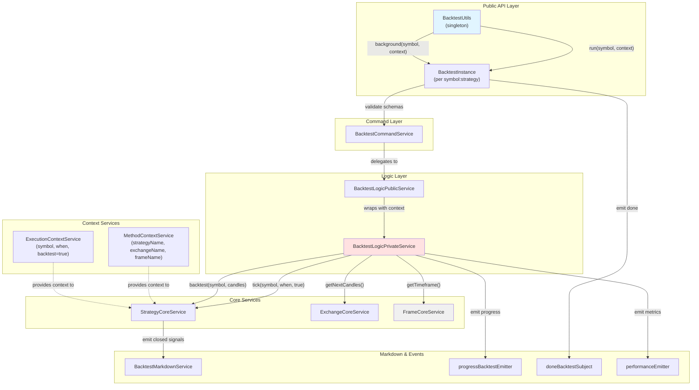
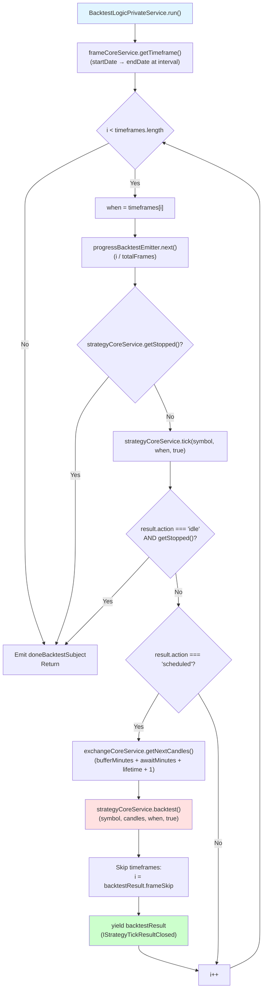
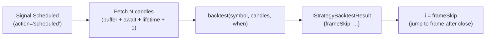
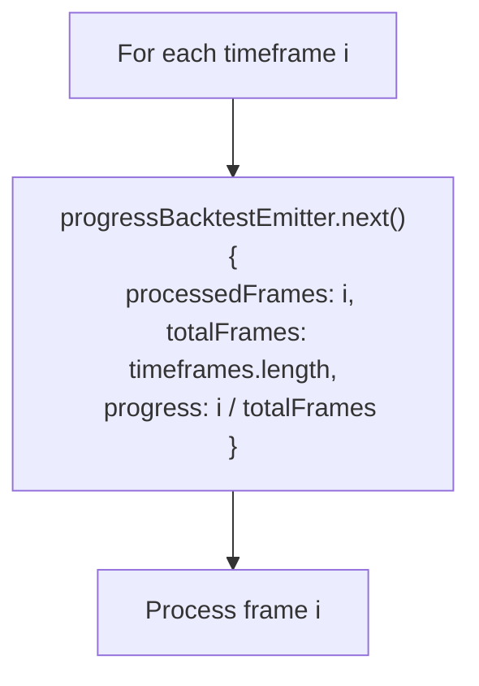
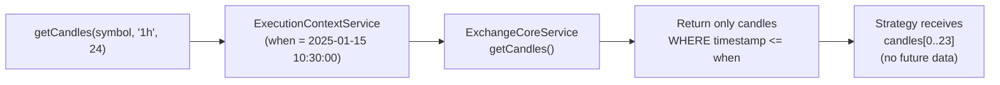
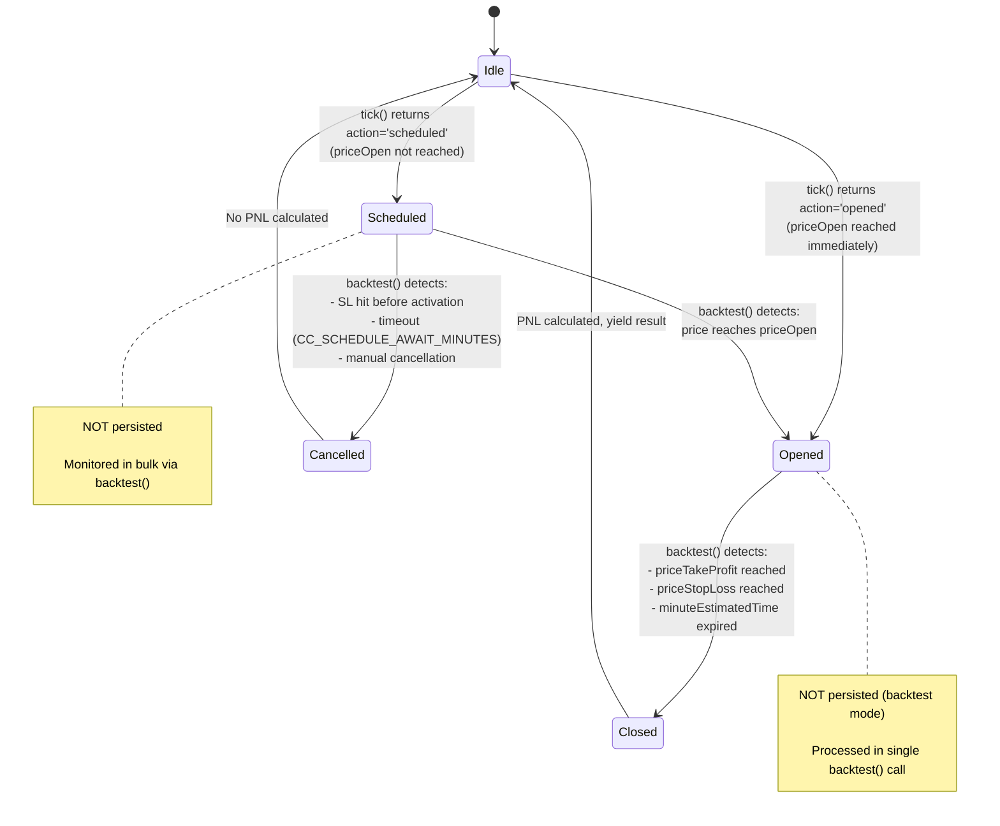
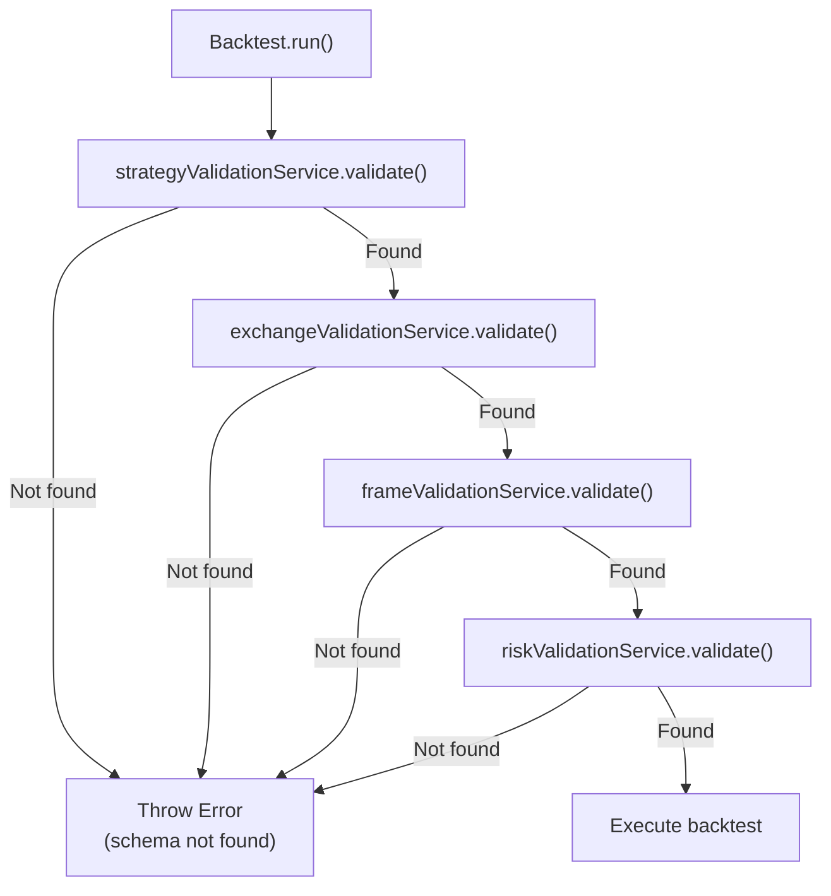
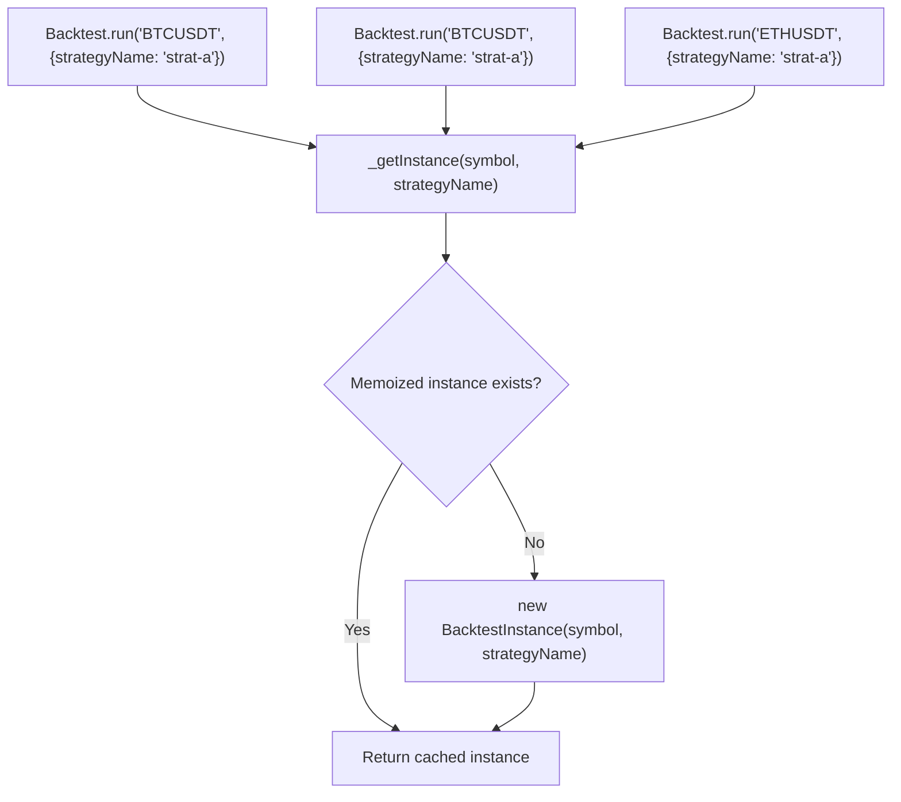

# Backtest Mode

**Purpose**: This document explains the historical simulation mode of Backtest Kit, covering timeframe iteration, fast backtest optimization, progress tracking, and deterministic execution. For real-time trading, see [Live Trading Mode](./20_execution-modes.md). For strategy comparison, see [Walker](./20_execution-modes.md).

**Scope**: Backtest mode simulates trading strategies on historical data from a defined start date to end date. It provides deterministic, reproducible results by iterating through time in discrete steps without access to future data.

---

## Overview

Backtest mode executes strategies against historical market data to evaluate performance before risking real capital. Unlike [Live Trading Mode](./20_execution-modes.md), which runs continuously with real-time data, backtest mode operates on a bounded timeframe with a known start and end.

**Key Characteristics**:

| Feature | Description |
|---------|-------------|
| **Time Model** | Discrete timeframes from `startDate` to `endDate` |
| **Data Access** | Historical candles fetched from `IExchangeSchema.getCandles` |
| **Execution** | Synchronous iteration through timeframes |
| **Completion** | Finite - terminates when all timeframes processed |
| **Persistence** | None - signals exist only in memory |
| **Results** | All closed signals returned at completion |

**Sources**: [README.md:17-29](), [src/classes/Backtest.ts:1-601]()

---

## Entry Points

Backtest mode is accessed through the `Backtest` class, which provides two execution patterns:

### Backtest.run() - Async Generator Pattern

```typescript
for await (const result of Backtest.run("BTCUSDT", {
  strategyName: "my-strategy",
  exchangeName: "binance",
  frameName: "1d-backtest"
})) {
  // result: IStrategyTickResultClosed
  console.log(result.closeReason, result.pnl.pnlPercentage);
}
```

Yields closed signals as they complete during the backtest. Useful for:
- Research and analysis requiring incremental results
- Early termination based on conditions
- Real-time processing during backtest execution

### Backtest.background() - Fire-and-Forget Pattern

```typescript
const cancel = Backtest.background("BTCUSDT", {
  strategyName: "my-strategy",
  exchangeName: "binance",
  frameName: "1d-backtest"
});

// Backtest runs in background
// Listen for completion via listenDoneBacktest()
```

Consumes results internally without yielding. Useful for:
- Running multiple backtests in parallel
- Callback-based processing via strategy callbacks
- Background batch processing

**Sources**: [src/classes/Backtest.ts:374-443](), [README.md:145-159]()

---

## Execution Architecture

The following diagram shows the class hierarchy and data flow from public API to private orchestration:



**Key Components**:

- **`BacktestUtils`**: Singleton managing `BacktestInstance` creation via memoization
- **`BacktestInstance`**: Isolated execution context per `symbol:strategyName` pair
- **`BacktestLogicPrivateService`**: Core orchestration implementing async generator pattern
- **`FrameCoreService`**: Generates discrete timeframes from `IFrameSchema`
- **`StrategyCoreService`**: Executes strategy logic with context propagation

**Sources**: [src/classes/Backtest.ts:359-601](), [src/lib/services/logic/private/BacktestLogicPrivateService.ts:1-374]()

---

## Timeframe Iteration Loop

The `BacktestLogicPrivateService.run()` method implements the core iteration logic:



**Loop Variables**:

| Variable | Type | Description |
|----------|------|-------------|
| `timeframes` | `Date[]` | Array of timestamps from `IFrameSchema` |
| `i` | `number` | Current timeframe index |
| `totalFrames` | `number` | Total timeframe count for progress |
| `when` | `Date` | Current timestamp being processed |
| `result` | `IStrategyTickResult` | Result from `tick()` call |

**Sources**: [src/lib/services/logic/private/BacktestLogicPrivateService.ts:62-374]()

---

## Fast Backtest Optimization

When a signal opens (or is scheduled), the system switches from minute-by-minute iteration to bulk candle processing. This optimization dramatically reduces execution time by:

1. **Fetching Future Candles**: Requests all candles needed for the signal's lifetime upfront
2. **Bulk Processing**: Calls `strategyCoreService.backtest()` which processes candles in a single pass
3. **Frame Skipping**: Returns `frameSkip` index to jump past processed timeframes

### Candle Request Calculation

```
candlesNeeded = bufferMinutes + awaitMinutes + signalLifetime + 1

Where:
- bufferMinutes = CC_AVG_PRICE_CANDLES_COUNT - 1  // VWAP buffer (default: 4)
- awaitMinutes = CC_SCHEDULE_AWAIT_MINUTES         // Activation timeout (default: 120)
- signalLifetime = signal.minuteEstimatedTime      // From signal DTO
- +1 = Current timeframe (when)
```

### Frame Skipping Logic



**Example**:

```typescript
// Signal opens at 2025-01-01 10:00:00
// minuteEstimatedTime = 60
// Current frame index i = 1000

// Fetch candles:
// - 4 buffer candles (VWAP)
// - 120 await candles (scheduled activation window)
// - 60 lifetime candles (signal duration)
// - 1 current candle
// Total: 185 candles

const candles = await exchangeCoreService.getNextCandles(
  symbol, "1m", 185, bufferStartTime, true
);

// Process all candles in one pass
const result = await strategyCoreService.backtest(
  symbol, candles, when, true
);

// Skip ahead: result.frameSkip = 1185 (1000 + 185)
// Next iteration processes frame 1185 instead of 1001
```

**Performance Impact**:

| Approach | Frames/Signal | Execution Time |
|----------|---------------|----------------|
| **Without Optimization** | 60 individual `tick()` calls | ~600ms |
| **With Optimization** | 1 `backtest()` call + frame skip | ~50ms |
| **Speedup** | ~12x faster | |

**Sources**: [src/lib/services/logic/private/BacktestLogicPrivateService.ts:154-255](), [README.md:187-199]()

---

## Progress Tracking

The `progressBacktestEmitter` broadcasts real-time progress updates during execution:

### Progress Event Contract

```typescript
interface ProgressBacktestContract {
  exchangeName: string;
  strategyName: string;
  symbol: string;
  totalFrames: number;
  processedFrames: number;
  progress: number;  // 0.0 to 1.0
}
```

### Emission Points



### Subscribing to Progress

```typescript
import { listenProgressBacktest } from "backtest-kit";

listenProgressBacktest((event) => {
  const percent = (event.progress * 100).toFixed(1);
  console.log(`${event.symbol}:${event.strategyName} - ${percent}% (${event.processedFrames}/${event.totalFrames})`);
});

// Run backtest
for await (const signal of Backtest.run("BTCUSDT", context)) {
  // Process signals
}
```

**Frequency**: Emitted on every frame iteration (typically 1-minute intervals). For a 24-hour backtest at 1-minute resolution, expect 1,440 progress events.

**Sources**: [src/lib/services/logic/private/BacktestLogicPrivateService.ts:82-92](), [src/config/emitters.ts]()

---

## Deterministic Execution

Backtest mode guarantees reproducible results through several mechanisms:

### Temporal Isolation

The `ExecutionContextService` ensures strategies only access data up to the current `when` timestamp:



**Mechanism**: `AsyncLocalStorage` propagates `when` context through the call stack without explicit parameters. The exchange service automatically filters candles by timestamp.

### Fixed Timeframes

The `IFrameSchema` defines immutable boundaries:

```typescript
addFrame({
  frameName: "1d-backtest",
  interval: "1m",           // 1-minute steps
  startDate: new Date("2025-01-01T00:00:00Z"),  // Fixed start
  endDate: new Date("2025-01-02T00:00:00Z")     // Fixed end
});

// Generates array: [
//   2025-01-01T00:00:00Z,
//   2025-01-01T00:01:00Z,
//   2025-01-01T00:02:00Z,
//   ...
//   2025-01-01T23:59:00Z
// ]
```

Running the same strategy on the same frame always produces:
- Same number of timeframes
- Same timestamps
- Same order of execution

### No External State

Backtest mode:
- Does NOT persist signals to disk (unlike Live mode)
- Does NOT use system clock (`new Date()`)
- Does NOT make external API calls during execution
- Uses memoized/cached exchange data

**Reproducibility Guarantee**: Given identical inputs (symbol, strategy, exchange, frame), backtest mode produces byte-identical output across runs.

**Sources**: [src/lib/services/context/ExecutionContextService.ts](), [src/lib/services/core/FrameCoreService.ts](), [README.md:187-199]()

---

## Signal Lifecycle in Backtest Mode

Signals progress through different states during backtest execution. The behavior differs from [Live Trading Mode](./20_execution-modes.md):

### State Transitions



### Key Differences from Live Mode

| Aspect | Backtest Mode | Live Mode |
|--------|---------------|-----------|
| **Persistence** | None - signals in memory only | Persisted to disk via `PersistSignalAdapter` |
| **Time Progression** | Discrete frames from `timeframes[]` | Real-time via `new Date()` |
| **Processing** | Bulk via `backtest()` | Per-tick via `tick()` |
| **Completion** | Finite - returns when frames exhausted | Infinite - runs until `stop()` |
| **Signal Monitoring** | Vectorized on candle array | Event-driven per minute |

### Backtest Method Signature

```typescript
class StrategyCoreService {
  async backtest(
    symbol: string,
    candles: ICandleData[],  // Array of future candles
    when: Date,              // Signal start timestamp
    backtest: boolean        // Always true for backtest mode
  ): Promise<IStrategyBacktestResult>
}
```

**Result**:

```typescript
interface IStrategyBacktestResult {
  action: "closed" | "cancelled";
  signal: ISignalRow;
  closeReason?: CloseReasonEnum;
  pnl?: IPnl;
  frameSkip: number;  // Next frame index to process
}
```

**Sources**: [src/lib/services/core/StrategyCoreService.ts](), [src/lib/clients/ClientStrategy.ts]()

---

## Validation and Error Handling

Before execution, the system validates all schema references:



### Runtime Error Handling

During execution, errors are caught and emitted without crashing the backtest:

```typescript
// From BacktestLogicPrivateService.run()
try {
  result = await this.strategyCoreService.tick(symbol, when, true);
} catch (error) {
  console.warn(`tick failed when=${when.toISOString()}`);
  this.loggerService.warn("tick failed, skipping timeframe", { error });
  await errorEmitter.next(error);
  i++;  // Skip to next frame
  continue;
}
```

**Error Recovery Strategy**:
1. Log error details
2. Emit to `errorEmitter` for subscribers
3. Skip problematic timeframe
4. Continue with next frame

This ensures a single bad candle or strategy error doesn't halt the entire backtest.

**Sources**: [src/classes/Backtest.ts:387-396](), [src/lib/services/logic/private/BacktestLogicPrivateService.ts:114-129]()

---

## Instance Management and Memoization

The `BacktestUtils` class uses memoization to ensure one `BacktestInstance` per `symbol:strategyName` pair:



**Memoization Key**: `${symbol}:${strategyName}`

**Lifecycle**:
- Instance created on first `run()` or `background()` call
- Cached for subsequent calls with same symbol+strategy
- Cleared manually via service layer (not exposed in public API)

**Concurrency**: Each instance can only run one backtest at a time due to `singlerun` wrapper:

```typescript
private task = singlerun(async (symbol, context) => {
  // ... backtest execution
});
```

Attempting to start a second backtest on the same instance while one is running will queue the request.

**Sources**: [src/classes/Backtest.ts:364-369](), [src/classes/Backtest.ts:105-118]()

---

## Reporting and Statistics

After completion, retrieve results via `getData()`, `getReport()`, or `dump()`:

```typescript
// Get structured data
const stats = await Backtest.getData("BTCUSDT", "my-strategy");
console.log(stats.sharpeRatio, stats.winRate, stats.maxDrawdown);

// Generate markdown report
const markdown = await Backtest.getReport("BTCUSDT", "my-strategy");
console.log(markdown);

// Save to disk: ./dump/backtest/BTCUSDT_my-strategy.md
await Backtest.dump("BTCUSDT", "my-strategy");
```

**Data Source**: The `BacktestMarkdownService` subscribes to `signalBacktestEmitter` and accumulates closed signals in `ReportStorage` (max 250 events per symbol:strategy pair).

**Statistics Calculated**:

| Metric | Description |
|--------|-------------|
| `totalTrades` | Count of closed signals |
| `winningTrades` | Signals with positive PNL |
| `losingTrades` | Signals with negative PNL |
| `winRate` | `winningTrades / totalTrades` |
| `totalPnl` | Sum of all PNL percentages |
| `avgPnl` | `totalPnl / totalTrades` |
| `maxDrawdown` | Largest peak-to-trough decline |
| `sharpeRatio` | Risk-adjusted return metric |
| `sortinoRatio` | Downside deviation adjusted return |

**Sources**: [src/classes/Backtest.ts:276-337](), [src/lib/services/markdown/BacktestMarkdownService.ts](), [src/model/BacktestStatistics.model.ts]()

---

## Related Pages

- [Live Trading Mode](./20_execution-modes.md) - Real-time execution with persistence
- [Walker (Strategy Comparison)](./20_execution-modes.md) - Sequential backtest orchestration
- [Async Generator Patterns](./20_execution-modes.md) - Memory-efficient streaming patterns
- [Signals & Signal Lifecycle](./08_core-concepts.md) - Signal state machine details
- [Time Execution Engine](./08_core-concepts.md) - Temporal context propagation
- [VWAP Pricing & Data Handling](./08_core-concepts.md) - Price calculation methodology