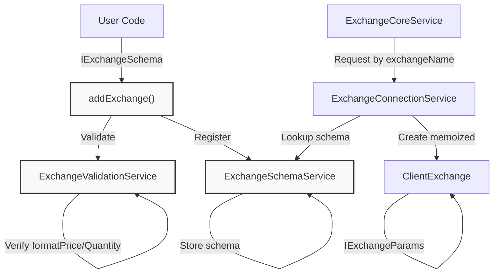
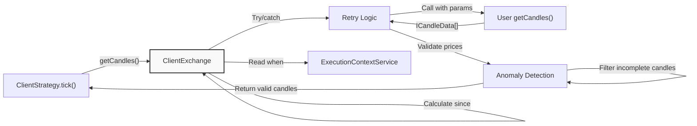
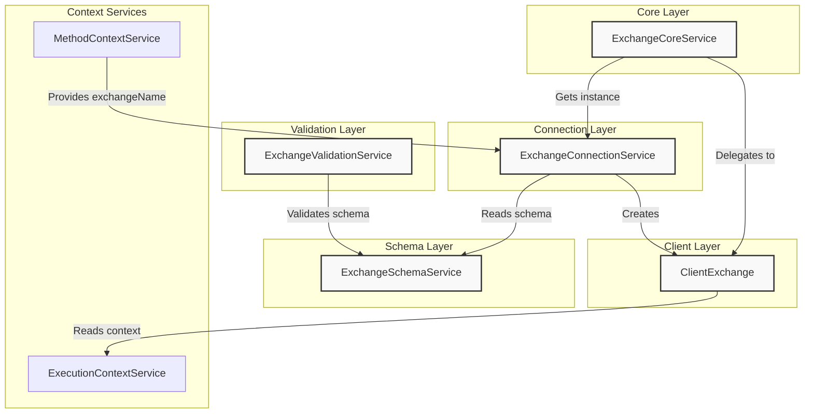

# Exchange Configuration

# Exchange Configuration

<details>
<summary>Relevant source files</summary>

The following files were used as context for generating this wiki page:

- [README.md](README.md)
- [src/config/emitters.ts](src/config/emitters.ts)
- [src/function/add.ts](src/function/add.ts)
- [src/function/event.ts](src/function/event.ts)
- [src/function/list.ts](src/function/list.ts)
- [src/index.ts](src/index.ts)
- [src/interfaces/Heatmap.interface.ts](src/interfaces/Heatmap.interface.ts)
- [src/lib/core/provide.ts](src/lib/core/provide.ts)
- [src/lib/core/types.ts](src/lib/core/types.ts)
- [src/lib/index.ts](src/lib/index.ts)
- [test/e2e/defend.test.mjs](test/e2e/defend.test.mjs)
- [test/e2e/risk.test.mjs](test/e2e/risk.test.mjs)
- [test/index.mjs](test/index.mjs)
- [test/mock/getMockCandles.mjs](test/mock/getMockCandles.mjs)
- [test/spec/heat.test.mjs](test/spec/heat.test.mjs)
- [test/spec/list.test.mjs](test/spec/list.test.mjs)
- [types.d.ts](types.d.ts)

</details>


## Purpose and Scope

This document covers the exchange configuration system, which provides market data access for backtest and live trading execution. An exchange defines how to fetch historical candle data (OHLCV), format prices and quantities according to exchange precision rules, and calculate volume-weighted average prices (VWAP) for signal generation.

For information about strategy configuration that consumes exchange data, see [Defining Strategies](./12-defining-strategies.md). For timeframe configuration that controls backtest periods, see [Timeframes and Frames](./24-timeframes-and-frames.md).

**Sources**: [types.d.ts:309-418](), [README.md:60-75]()

---

## Exchange Schema Structure

An exchange is registered via `addExchange()` with an `IExchangeSchema` object that defines:

| Field | Type | Required | Description |
|-------|------|----------|-------------|
| `exchangeName` | `ExchangeName` (string) | Yes | Unique identifier for the exchange |
| `note` | `string` | No | Optional developer documentation |
| `getCandles` | Function | Yes | Fetches historical OHLCV candle data |
| `formatPrice` | Function | Yes | Formats prices to exchange precision |
| `formatQuantity` | Function | Yes | Formats quantities to exchange precision |
| `callbacks` | `Partial<IExchangeCallbacks>` | No | Optional lifecycle event handlers |

The `getCandles` function signature:
```typescript
(symbol: string, interval: CandleInterval, since: Date, limit: number) => Promise<ICandleData[]>
```

**Sources**: [types.d.ts:327-363](), [src/function/add.ts:66-100]()

---

## Candle Data Structure

### CandleInterval Types

Supported intervals for candle fetching:

```typescript
type CandleInterval = "1m" | "3m" | "5m" | "15m" | "30m" | "1h" | "2h" | "4h" | "6h" | "8h"
```

**Sources**: [types.d.ts:290-291]()

### ICandleData Format

Each candle contains six data points:

```typescript
interface ICandleData {
  timestamp: number;  // Unix timestamp in milliseconds when candle opened
  open: number;       // Opening price at candle start
  high: number;       // Highest price during candle period
  low: number;        // Lowest price during candle period
  close: number;      // Closing price at candle end
  volume: number;     // Trading volume during candle period
}
```

**Sources**: [types.d.ts:292-308]()

---

## Registration Flow

The following diagram shows how an exchange schema flows through validation and registration layers before becoming available for use:



**Diagram: Exchange Registration and Instantiation Flow**

The registration process:

1. **Validation** - [ExchangeValidationService:128]() checks schema structure using memoized validators
2. **Storage** - [ExchangeSchemaService:21]() stores schema in registry using ToolRegistry pattern
3. **Connection** - [ExchangeConnectionService:18]() creates memoized [ClientExchange:14]() instances keyed by `exchangeName`
4. **Usage** - [ExchangeCoreService:24]() delegates to ClientExchange methods

**Sources**: [src/function/add.ts:101-113](), [src/lib/services/validation/ExchangeValidationService.ts](), [src/lib/services/schema/ExchangeSchemaService.ts](), [src/lib/services/connection/ExchangeConnectionService.ts]()

---

## Exchange Implementation Layers

### IExchange Interface

The `IExchange` interface defines methods available to strategies:

| Method | Purpose | Usage Context |
|--------|---------|---------------|
| `getCandles(symbol, interval, limit)` | Fetch historical candles **backwards** from execution context time | Backtest and live mode for indicators |
| `getNextCandles(symbol, interval, limit)` | Fetch future candles **forward** from execution context time | Backtest mode only for fast processing |
| `formatPrice(symbol, price)` | Format price to exchange precision | Signal validation, reporting |
| `formatQuantity(symbol, quantity)` | Format quantity to exchange precision | Position sizing, reporting |
| `getAveragePrice(symbol)` | Calculate VWAP from last N candles | Signal generation, execution price |

**Sources**: [types.d.ts:365-413]()

### ClientExchange Implementation

[ClientExchange:14]() wraps the user-provided schema with retry logic, anomaly detection, and context awareness:



**Diagram: ClientExchange Internal Flow**

**Sources**: [src/lib/client/ClientExchange.ts]()

---

## VWAP Calculation

The `getAveragePrice()` method calculates Volume-Weighted Average Price using the last `CC_AVG_PRICE_CANDLES_COUNT` (default: 5) 1-minute candles:

**Formula**:
```
VWAP = Σ(Typical Price × Volume) / Σ(Volume)
where Typical Price = (High + Low + Close) / 3
```

This provides realistic execution prices by accounting for volume distribution across the price range.

**Sources**: [types.d.ts:404-412](), [types.d.ts:12-15]()

---

## Retry Logic and Anomaly Detection

### Global Configuration Parameters

Exchange data fetching is protected by configurable retry and validation settings:

| Parameter | Default | Purpose |
|-----------|---------|---------|
| `CC_GET_CANDLES_RETRY_COUNT` | 3 | Number of retry attempts on failure |
| `CC_GET_CANDLES_RETRY_DELAY_MS` | 5000 | Delay between retries (milliseconds) |
| `CC_GET_CANDLES_PRICE_ANOMALY_THRESHOLD_FACTOR` | 1000 | Detects incomplete candles with near-zero prices |
| `CC_GET_CANDLES_MIN_CANDLES_FOR_MEDIAN` | 5 | Minimum candles required for median-based anomaly detection |

**Sources**: [types.d.ts:70-106]()

### Anomaly Detection Logic

Incomplete candles from exchange APIs (e.g., Binance returning $0.01 for BTC) are filtered using:

1. **Median calculation** - Compute median price from all OHLC values
2. **Threshold check** - Reject candles where `price < (median / threshold_factor)`
3. **Fallback** - Use simple average if candle count < minimum

Example: BTC at $50,000 median → threshold $50 → catches $0.01-1 anomalies

**Sources**: [types.d.ts:80-106]()

---

## Service Architecture

The following diagram maps exchange-related services to their responsibilities:



**Diagram: Exchange Service Dependency Graph**

| Service | Type | Responsibility |
|---------|------|----------------|
| ExchangeSchemaService | Schema | Stores registered exchange configurations using ToolRegistry pattern |
| ExchangeValidationService | Validation | Validates IExchangeSchema structure with memoized checks |
| ExchangeConnectionService | Connection | Creates memoized ClientExchange instances keyed by `exchangeName` |
| ExchangeCoreService | Core | Provides high-level API wrapping ClientExchange methods |
| ClientExchange | Client | Implements IExchange interface with retry/anomaly logic |

**Sources**: [src/lib/index.ts:97-117](), [src/lib/core/types.ts:20-34]()

---

## Context Injection

Exchange operations are context-aware through dependency injection:

### ExecutionContextService

Provides implicit context propagation:

```typescript
interface IExecutionContext {
  symbol: string;    // Trading pair (e.g., "BTCUSDT")
  when: Date;        // Current timestamp for operation
  backtest: boolean; // True if backtest mode, false if live mode
}
```

The `when` field determines:
- **getCandles()** - Fetches candles ending at `when` (looking backward)
- **getNextCandles()** - Fetches candles starting after `when` (looking forward, backtest only)

**Sources**: [types.d.ts:242-254](), [types.d.ts:274-285]()

### MethodContextService

Routes exchange lookup by name:

```typescript
interface IMethodContext {
  exchangeName: ExchangeName;  // Name of exchange schema to use
  strategyName: StrategyName;  // (also used for strategy routing)
  frameName: FrameName;        // (also used for frame routing)
}
```

**Sources**: [types.d.ts:505-517](), [types.d.ts:537-544]()

---

## Usage Patterns

### Basic CCXT Integration

Standard pattern for integrating CCXT exchanges:

```typescript
import ccxt from 'ccxt';
import { addExchange } from 'backtest-kit';

addExchange({
  exchangeName: 'binance',
  getCandles: async (symbol, interval, since, limit) => {
    const exchange = new ccxt.binance();
    const ohlcv = await exchange.fetchOHLCV(symbol, interval, since.getTime(), limit);
    return ohlcv.map(([timestamp, open, high, low, close, volume]) => ({
      timestamp,
      open,
      high,
      low,
      close,
      volume
    }));
  },
  formatPrice: async (symbol, price) => {
    const exchange = new ccxt.binance();
    await exchange.loadMarkets();
    const market = exchange.market(symbol);
    return exchange.priceToPrecision(symbol, price);
  },
  formatQuantity: async (symbol, quantity) => {
    const exchange = new ccxt.binance();
    await exchange.loadMarkets();
    return exchange.amountToPrecision(symbol, quantity);
  }
});
```

**Sources**: [README.md:60-75](), [types.d.ts:327-363]()

### Custom Data Source

Pattern for database or file-based data:

```typescript
import { addExchange } from 'backtest-kit';

addExchange({
  exchangeName: 'custom-db',
  getCandles: async (symbol, interval, since, limit) => {
    // Query database for candles
    const candles = await db.candles.find({
      symbol,
      interval,
      timestamp: { $gte: since.getTime() }
    })
    .sort({ timestamp: 1 })
    .limit(limit);
    
    return candles.map(c => ({
      timestamp: c.timestamp,
      open: c.open,
      high: c.high,
      low: c.low,
      close: c.close,
      volume: c.volume
    }));
  },
  formatPrice: async (symbol, price) => price.toFixed(8),
  formatQuantity: async (symbol, quantity) => quantity.toFixed(8)
});
```

**Sources**: [src/function/add.ts:66-100]()

### Lifecycle Callbacks

Optional `onCandleData` callback for monitoring:

```typescript
addExchange({
  exchangeName: 'binance',
  getCandles: async (symbol, interval, since, limit) => { /* ... */ },
  formatPrice: async (symbol, price) => price.toFixed(8),
  formatQuantity: async (symbol, quantity) => quantity.toFixed(8),
  callbacks: {
    onCandleData: (symbol, interval, since, limit, data) => {
      console.log(`Fetched ${data.length} ${interval} candles for ${symbol}`);
      console.log(`Time range: ${since.toISOString()} (limit: ${limit})`);
    }
  }
});
```

**Sources**: [types.d.ts:320-325]()

---

## Public API Functions

### Registration

```typescript
function addExchange(exchangeSchema: IExchangeSchema): void
```

Registers an exchange schema after validation. Throws error if `exchangeName` already exists or schema is invalid.

**Sources**: [src/function/add.ts:101-113]()

### Listing

```typescript
async function listExchanges(): Promise<IExchangeSchema[]>
```

Returns all registered exchange schemas. Useful for debugging or building dynamic UIs.

**Sources**: [src/function/list.ts:43-46]()

### Runtime Access

```typescript
function getCandles(symbol: string, interval: CandleInterval, limit: number): Promise<ICandleData[]>
function getAveragePrice(symbol: string): Promise<number>
function formatPrice(symbol: string, price: number): Promise<string>
function formatQuantity(symbol: string, quantity: number): Promise<string>
```

These functions access the exchange configured in the current `MethodContextService` context. Called from within strategy `getSignal()` callbacks.

**Sources**: [src/function/exchange.ts]()

---

## Validation Rules

The `ExchangeValidationService` enforces the following rules at registration:

| Rule | Check | Error Message |
|------|-------|---------------|
| Unique name | `exchangeName` not already registered | "Exchange already exists: {name}" |
| Name type | `exchangeName` is string | "exchangeName must be a string" |
| getCandles | Function exists | "getCandles must be a function" |
| formatPrice | Function exists | "formatPrice must be a function" |
| formatQuantity | Function exists | "formatQuantity must be a function" |
| Callbacks | If provided, must be object | "callbacks must be an object" |

**Sources**: [src/lib/services/validation/ExchangeValidationService.ts]()

---

## Testing Examples

### Mock Exchange for Tests

```typescript
import { addExchange } from 'backtest-kit';

addExchange({
  exchangeName: 'binance-mock-test',
  getCandles: async (symbol, interval, since, limit) => {
    const candles = [];
    const intervalMs = 60000; // 1 minute
    
    for (let i = 0; i < limit; i++) {
      const timestamp = since.getTime() + i * intervalMs;
      const basePrice = 42000 + i * 100;
      
      candles.push({
        timestamp,
        open: basePrice + 150.5,
        high: basePrice + 380.2,
        low: basePrice + 100.0,
        close: basePrice + 250.8,
        volume: 100 + i * 10
      });
    }
    
    return candles;
  },
  formatPrice: async (symbol, price) => price.toFixed(8),
  formatQuantity: async (symbol, quantity) => quantity.toFixed(8)
});
```

**Sources**: [test/mock/getMockCandles.mjs:1-42](), [test/spec/heat.test.mjs:13-28]()

---

## Error Handling

### Retry Mechanism

ClientExchange automatically retries failed `getCandles()` calls:

1. Initial attempt
2. If error thrown, wait `CC_GET_CANDLES_RETRY_DELAY_MS` (default: 5000ms)
3. Retry up to `CC_GET_CANDLES_RETRY_COUNT` (default: 3) times
4. If all retries exhausted, propagate error to caller

**Sources**: [types.d.ts:70-78]()

### Anomaly Filtering

Invalid candles are silently filtered (not errors) if:
- Price is below `median / CC_GET_CANDLES_PRICE_ANOMALY_THRESHOLD_FACTOR`
- Occurs when exchange APIs return incomplete data (e.g., $0.01 for BTC)

**Sources**: [types.d.ts:80-106]()

---

## Integration with Other Systems

### Strategy Execution

Strategies call exchange methods during signal generation:

```typescript
addStrategy({
  strategyName: 'my-strategy',
  interval: '5m',
  getSignal: async (symbol) => {
    // Get historical data for indicators
    const candles = await getCandles(symbol, '1h', 24);
    
    // Get current execution price
    const currentPrice = await getAveragePrice(symbol);
    
    // Calculate indicators and generate signal
    // ...
  }
});
```

**Sources**: [README.md:107-137]()

### Backtest Fast Processing

During backtest, `getNextCandles()` enables skip-to-close optimization:

1. Signal opens at time T
2. Fetch future candles from T to TP/SL/timeout
3. Skip intermediate ticks, jump directly to close event
4. Process only meaningful price points

**Sources**: [types.d.ts:379-386]()

### Live Trading

In live mode:
- `getCandles()` fetches recent historical data
- `getNextCandles()` throws error (not applicable to live mode)
- `getAveragePrice()` provides real-time VWAP for execution

**Sources**: [types.d.ts:369-377]()