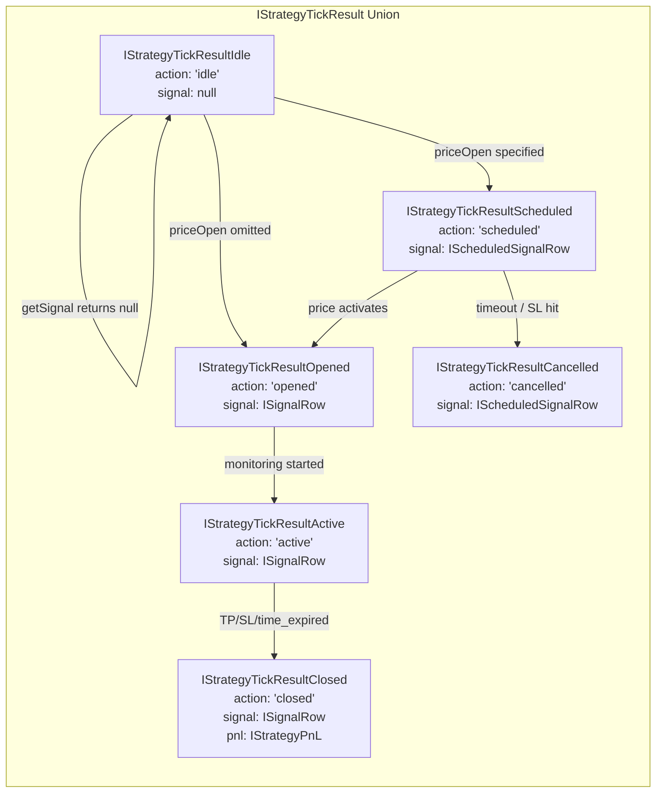
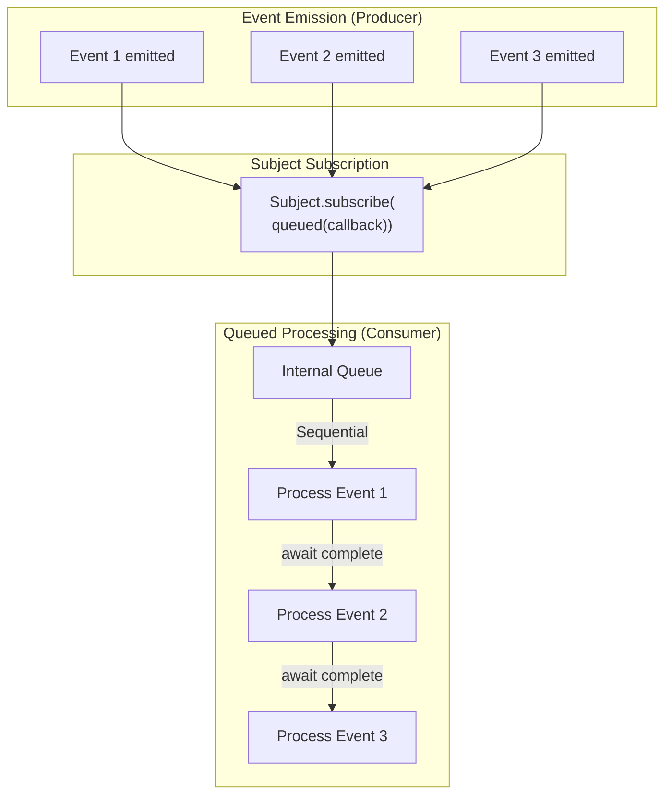

# Event Listeners

<details>
<summary>Relevant source files</summary>

The following files were used as context for generating this wiki page:

- [src/classes/Backtest.ts](src/classes/Backtest.ts)
- [src/classes/Live.ts](src/classes/Live.ts)
- [src/classes/Walker.ts](src/classes/Walker.ts)
- [src/config/emitters.ts](src/config/emitters.ts)
- [src/function/event.ts](src/function/event.ts)
- [src/index.ts](src/index.ts)
- [test/index.mjs](test/index.mjs)
- [types.d.ts](types.d.ts)

</details>


This page documents all event listener functions available in the public API for subscribing to framework events. Event listeners enable real-time monitoring of signal lifecycle, execution progress, completion events, performance metrics, and errors.

For information about the underlying event system architecture and Subject-based pub-sub pattern, see [3.4](#3.4). For details on signal lifecycle states that trigger events, see [8.1](#8.1). For execution mode differences in event emission, see [2.1](#2.1).

## Overview

The framework provides 19 event listener functions organized into five categories:

| Category | Purpose | Functions |
|----------|---------|-----------|
| **Signal Events** | Subscribe to signal lifecycle state changes | `listenSignal`, `listenSignalOnce`, `listenSignalLive`, `listenSignalLiveOnce`, `listenSignalBacktest`, `listenSignalBacktestOnce` |
| **Completion Events** | Subscribe to execution completion (done) | `listenDoneLive`, `listenDoneLiveOnce`, `listenDoneBacktest`, `listenDoneBacktestOnce`, `listenDoneWalker`, `listenDoneWalkerOnce` |
| **Progress Events** | Subscribe to execution progress updates | `listenProgress`, `listenWalker`, `listenWalkerOnce` |
| **Performance Events** | Subscribe to timing metrics for profiling | `listenPerformance` |
| **Error Events** | Subscribe to validation errors and failures | `listenError`, `listenValidation`, `listenWalkerComplete` |

All listener functions return an unsubscribe function that can be called to stop receiving events. Events are processed sequentially using a queued wrapper to prevent concurrent callback execution.

Sources: [src/function/event.ts:1-653](), [src/config/emitters.ts:1-81]()

## Event Emitter Architecture

```mermaid
graph TB
    subgraph "Subject Instances (emitters.ts)"
        signalEmitter["signalEmitter<br/>Subject&lt;IStrategyTickResult&gt;"]
        signalLiveEmitter["signalLiveEmitter<br/>Subject&lt;IStrategyTickResult&gt;"]
        signalBacktestEmitter["signalBacktestEmitter<br/>Subject&lt;IStrategyTickResult&gt;"]
        errorEmitter["errorEmitter<br/>Subject&lt;Error&gt;"]
        doneLiveSubject["doneLiveSubject<br/>Subject&lt;DoneContract&gt;"]
        doneBacktestSubject["doneBacktestSubject<br/>Subject&lt;DoneContract&gt;"]
        doneWalkerSubject["doneWalkerSubject<br/>Subject&lt;DoneContract&gt;"]
        progressEmitter["progressEmitter<br/>Subject&lt;ProgressContract&gt;"]
        performanceEmitter["performanceEmitter<br/>Subject&lt;PerformanceContract&gt;"]
        walkerEmitter["walkerEmitter<br/>Subject&lt;WalkerContract&gt;"]
        walkerCompleteSubject["walkerCompleteSubject<br/>Subject&lt;IWalkerResults&gt;"]
        validationSubject["validationSubject<br/>Subject&lt;Error&gt;"]
    end
    
    subgraph "Listener Functions (event.ts)"
        listenSignal["listenSignal()"]
        listenSignalLive["listenSignalLive()"]
        listenSignalBacktest["listenSignalBacktest()"]
        listenError["listenError()"]
        listenDoneLive["listenDoneLive()"]
        listenDoneBacktest["listenDoneBacktest()"]
        listenDoneWalker["listenDoneWalker()"]
        listenProgress["listenProgress()"]
        listenPerformance["listenPerformance()"]
        listenWalker["listenWalker()"]
        listenWalkerComplete["listenWalkerComplete()"]
        listenValidation["listenValidation()"]
    end
    
    subgraph "Event Producers"
        ClientStrategy["ClientStrategy<br/>tick() / backtest()"]
        LiveLogic["LiveLogicPrivateService"]
        BacktestLogic["BacktestLogicPrivateService"]
        WalkerLogic["WalkerLogicPrivateService"]
        ClientRisk["ClientRisk<br/>checkSignal()"]
    end
    
    ClientStrategy --> signalEmitter
    ClientStrategy --> signalLiveEmitter
    ClientStrategy --> signalBacktestEmitter
    
    LiveLogic --> doneLiveSubject
    BacktestLogic --> doneBacktestSubject
    BacktestLogic --> progressEmitter
    BacktestLogic --> performanceEmitter
    WalkerLogic --> doneWalkerSubject
    WalkerLogic --> walkerEmitter
    WalkerLogic --> walkerCompleteSubject
    
    ClientRisk --> validationSubject
    
    LiveLogic --> errorEmitter
    BacktestLogic --> errorEmitter
    WalkerLogic --> errorEmitter
    
    signalEmitter --> listenSignal
    signalLiveEmitter --> listenSignalLive
    signalBacktestEmitter --> listenSignalBacktest
    errorEmitter --> listenError
    doneLiveSubject --> listenDoneLive
    doneBacktestSubject --> listenDoneBacktest
    doneWalkerSubject --> listenDoneWalker
    progressEmitter --> listenProgress
    performanceEmitter --> listenPerformance
    walkerEmitter --> listenWalker
    walkerCompleteSubject --> listenWalkerComplete
    validationSubject --> listenValidation
```



**Event Flow**: Event producers (ClientStrategy, logic services, ClientRisk) emit events to Subject instances. Listener functions subscribe to these Subjects and forward events to user callbacks wrapped in `queued()` for sequential processing.

Sources: [src/config/emitters.ts:1-81](), [src/function/event.ts:1-653]()

## Signal Event Listeners

Signal event listeners subscribe to signal lifecycle state changes: `idle`, `scheduled`, `opened`, `active`, `closed`, `cancelled`. All signal listeners receive `IStrategyTickResult` discriminated union types.

### listenSignal

Subscribes to all signal events from both live and backtest execution modes.

**Function Signature**:
```typescript
function listenSignal(fn: (event: IStrategyTickResult) => void): () => void
```

**Parameters**:
- `fn` - Callback function receiving signal events. Callback is wrapped with `queued()` for sequential async processing.

**Returns**: Unsubscribe function to stop listening.

**Event Source**: [src/config/emitters.ts:13]() `signalEmitter`

**Usage Example**:
```typescript
const unsubscribe = listenSignal((event) => {
  if (event.action === "opened") {
    console.log("Signal opened:", event.signal.id);
  } else if (event.action === "closed") {
    console.log("Signal closed:", event.pnl.pnlPercentage);
  }
});

// Later: stop listening
unsubscribe();
```

Sources: [src/function/event.ts:56-59]()

### listenSignalOnce

Subscribes to filtered signal events with automatic one-time unsubscribe. Useful for waiting for specific signal conditions.

**Function Signature**:
```typescript
function listenSignalOnce(
  filterFn: (event: IStrategyTickResult) => boolean,
  fn: (event: IStrategyTickResult) => void
): () => void
```

**Parameters**:
- `filterFn` - Predicate function to filter events. Only matching events trigger the callback.
- `fn` - Callback function called once when filter matches.

**Returns**: Unsubscribe function to cancel before event fires.

**Event Source**: [src/config/emitters.ts:13]() `signalEmitter`

**Usage Example**:
```typescript
// Wait for first take profit hit
listenSignalOnce(
  (event) => event.action === "closed" && event.closeReason === "take_profit",
  (event) => {
    console.log("Take profit hit! PNL:", event.pnl.pnlPercentage);
  }
);
```

Sources: [src/function/event.ts:93-99]()

### listenSignalLive

Subscribes to signal events from live trading execution only. Does not receive backtest events.

**Function Signature**:
```typescript
function listenSignalLive(fn: (event: IStrategyTickResult) => void): () => void
```

**Event Source**: [src/config/emitters.ts:19]() `signalLiveEmitter`

Sources: [src/function/event.ts:121-124]()

### listenSignalLiveOnce

Filtered one-time subscription to live trading signal events.

**Function Signature**:
```typescript
function listenSignalLiveOnce(
  filterFn: (event: IStrategyTickResult) => boolean,
  fn: (event: IStrategyTickResult) => void
): () => void
```

**Event Source**: [src/config/emitters.ts:19]() `signalLiveEmitter`

Sources: [src/function/event.ts:147-153]()

### listenSignalBacktest

Subscribes to signal events from backtest execution only. Does not receive live events.

**Function Signature**:
```typescript
function listenSignalBacktest(fn: (event: IStrategyTickResult) => void): () => void
```

**Event Source**: [src/config/emitters.ts:25]() `signalBacktestEmitter`

Sources: [src/function/event.ts:175-178]()

### listenSignalBacktestOnce

Filtered one-time subscription to backtest signal events.

**Function Signature**:
```typescript
function listenSignalBacktestOnce(
  filterFn: (event: IStrategyTickResult) => boolean,
  fn: (event: IStrategyTickResult) => void
): () => void
```

**Event Source**: [src/config/emitters.ts:25]() `signalBacktestEmitter`

Sources: [src/function/event.ts:201-207]()

## Signal Event Types



**Discriminated Union**: Use `event.action` for type-safe handling. Each action type has different properties available.

Sources: [types.d.ts:654-774]()

## Completion Event Listeners

Completion event listeners subscribe to execution done events. Emitted when `background()` methods complete execution for Live, Backtest, or Walker modes.

### listenDoneLive

Subscribes to live trading background execution completion events.

**Function Signature**:
```typescript
function listenDoneLive(fn: (event: DoneContract) => void): () => void
```

**Event Source**: [src/config/emitters.ts:37]() `doneLiveSubject`

**Event Payload** (`DoneContract`):
```typescript
{
  exchangeName: string;
  strategyName: string;
  backtest: false;
  symbol: string;
}
```

**Emission Point**: [src/classes/Live.ts:123-128]() after `Live.background()` completes.

Sources: [src/function/event.ts:264-267]()

### listenDoneLiveOnce

Filtered one-time subscription to live completion events.

**Function Signature**:
```typescript
function listenDoneLiveOnce(
  filterFn: (event: DoneContract) => boolean,
  fn: (event: DoneContract) => void
): () => void
```

**Event Source**: [src/config/emitters.ts:37]() `doneLiveSubject`

Sources: [src/function/event.ts:295-301]()

### listenDoneBacktest

Subscribes to backtest background execution completion events.

**Function Signature**:
```typescript
function listenDoneBacktest(fn: (event: DoneContract) => void): () => void
```

**Event Source**: [src/config/emitters.ts:43]() `doneBacktestSubject`

**Event Payload** (`DoneContract`):
```typescript
{
  exchangeName: string;
  strategyName: string;
  backtest: true;
  symbol: string;
}
```

**Emission Point**: [src/classes/Backtest.ts:108-113]() after `Backtest.background()` completes.

Sources: [src/function/event.ts:331-334]()

### listenDoneBacktestOnce

Filtered one-time subscription to backtest completion events.

**Function Signature**:
```typescript
function listenDoneBacktestOnce(
  filterFn: (event: DoneContract) => boolean,
  fn: (event: DoneContract) => void
): () => void
```

**Event Source**: [src/config/emitters.ts:43]() `doneBacktestSubject`

Sources: [src/function/event.ts:363-369]()

### listenDoneWalker

Subscribes to walker background execution completion events.

**Function Signature**:
```typescript
function listenDoneWalker(fn: (event: DoneContract) => void): () => void
```

**Event Source**: [src/config/emitters.ts:49]() `doneWalkerSubject`

**Event Payload** (`DoneContract`):
```typescript
{
  exchangeName: string;
  strategyName: string; // walkerName
  backtest: true;
  symbol: string;
}
```

**Emission Point**: [src/classes/Walker.ts:128-133]() after `Walker.background()` completes all strategy comparisons.

Sources: [src/function/event.ts:397-400]()

### listenDoneWalkerOnce

Filtered one-time subscription to walker completion events.

**Function Signature**:
```typescript
function listenDoneWalkerOnce(
  filterFn: (event: DoneContract) => boolean,
  fn: (event: DoneContract) => void
): () => void
```

**Event Source**: [src/config/emitters.ts:49]() `doneWalkerSubject`

Sources: [src/function/event.ts:427-433]()

## Progress Event Listeners

Progress event listeners subscribe to execution progress updates during backtest and walker execution.

### listenProgress

Subscribes to backtest execution progress events. Emitted periodically during `Backtest.run()` or `Backtest.background()` to track frame processing progress.

**Function Signature**:
```typescript
function listenProgress(fn: (event: ProgressContract) => void): () => void
```

**Event Source**: [src/config/emitters.ts:55]() `progressEmitter`

**Event Payload** (`ProgressContract`):
```typescript
{
  progress: number;        // 0.0 to 1.0
  processedFrames: number;
  totalFrames: number;
  strategyName: string;
  exchangeName: string;
  symbol: string;
}
```

**Usage Example**:
```typescript
const unsubscribe = listenProgress((event) => {
  console.log(`Progress: ${(event.progress * 100).toFixed(2)}%`);
  console.log(`${event.processedFrames} / ${event.totalFrames} frames`);
});
```

Sources: [src/function/event.ts:465-468]()

### listenWalker

Subscribes to walker progress events. Emitted after each strategy completes during `Walker.run()` execution.

**Function Signature**:
```typescript
function listenWalker(fn: (event: WalkerContract) => void): () => void
```

**Event Source**: [src/config/emitters.ts:67]() `walkerEmitter`

**Event Payload** (`WalkerContract`):
```typescript
{
  strategiesTested: number;
  totalStrategies: number;
  bestStrategy: string;
  bestMetric: number;
  strategyName: string;      // current strategy
  metricValue: number;       // current strategy metric
  walkerName: string;
  exchangeName: string;
  frameName: string;
  symbol: string;
}
```

**Usage Example**:
```typescript
const unsubscribe = listenWalker((event) => {
  console.log(`Progress: ${event.strategiesTested} / ${event.totalStrategies}`);
  console.log(`Best: ${event.bestStrategy} (${event.bestMetric})`);
  console.log(`Current: ${event.strategyName} (${event.metricValue})`);
});
```

Sources: [src/function/event.ts:537-540]()

### listenWalkerOnce

Filtered one-time subscription to walker progress events.

**Function Signature**:
```typescript
function listenWalkerOnce(
  filterFn: (event: WalkerContract) => boolean,
  fn: (event: WalkerContract) => void
): () => void
```

**Event Source**: [src/config/emitters.ts:67]() `walkerEmitter`

**Usage Example**:
```typescript
// Wait for walker to complete all strategies
listenWalkerOnce(
  (event) => event.strategiesTested === event.totalStrategies,
  (event) => {
    console.log("Walker completed!");
    console.log("Best strategy:", event.bestStrategy, event.bestMetric);
  }
);
```

Sources: [src/function/event.ts:581-587]()

### listenWalkerComplete

Subscribes to walker final completion events with aggregated results. Emitted once when all strategies have been tested.

**Function Signature**:
```typescript
function listenWalkerComplete(fn: (event: IWalkerResults) => void): () => void
```

**Event Source**: [src/config/emitters.ts:73]() `walkerCompleteSubject`

**Event Payload** (`IWalkerResults`):
```typescript
{
  walkerName: string;
  bestStrategy: string;
  bestMetric: number;
  metric: WalkerMetric;         // "sharpeRatio" | "winRate" | etc
  totalStrategies: number;
  results: IWalkerStrategyResult[];  // per-strategy details
}
```

**Usage Example**:
```typescript
const unsubscribe = listenWalkerComplete((results) => {
  console.log(`Walker ${results.walkerName} completed!`);
  console.log(`Best strategy: ${results.bestStrategy}`);
  console.log(`Best ${results.metric}: ${results.bestMetric}`);
  console.log(`Tested ${results.totalStrategies} strategies`);
});
```

Sources: [src/function/event.ts:620-623]()

## Performance Event Listeners

### listenPerformance

Subscribes to performance timing metric events for profiling strategy execution. Emitted during both backtest and live execution.

**Function Signature**:
```typescript
function listenPerformance(fn: (event: PerformanceContract) => void): () => void
```

**Event Source**: [src/config/emitters.ts:61]() `performanceEmitter`

**Event Payload** (`PerformanceContract`):
```typescript
{
  metricType: PerformanceMetricType;  // "backtest_total" | "backtest_timeframe" | etc
  duration: number;                   // milliseconds
}
```

**Metric Types**:
- `backtest_total` - Total backtest execution time
- `backtest_timeframe` - Single timeframe iteration time
- `backtest_signal` - Single signal processing time
- `live_tick` - Single tick execution time

**Usage Example**:
```typescript
const unsubscribe = listenPerformance((event) => {
  console.log(`${event.metricType}: ${event.duration.toFixed(2)}ms`);
  if (event.duration > 100) {
    console.warn("Slow operation detected:", event.metricType);
  }
});
```

Sources: [src/function/event.ts:502-505]()

## Error Event Listeners

### listenError

Subscribes to background execution errors. Emitted when errors are caught in `background()` methods for Live, Backtest, or Walker execution.

**Function Signature**:
```typescript
function listenError(fn: (error: Error) => void): () => void
```

**Event Source**: [src/config/emitters.ts:31]() `errorEmitter`

**Emission Points**:
- [src/classes/Live.ts:130-132]() - Errors in `Live.background()`
- [src/classes/Backtest.ts:115-117]() - Errors in `Backtest.background()`
- [src/classes/Walker.ts:135-137]() - Errors in `Walker.background()`

**Usage Example**:
```typescript
const unsubscribe = listenError((error) => {
  console.error("Background execution error:", error.message);
  // Log to monitoring service, send alerts, etc.
});
```

Sources: [src/function/event.ts:232-235]()

### listenValidation

Subscribes to risk validation errors. Emitted when risk validation functions throw errors during signal checking in `ClientRisk.checkSignal()`.

**Function Signature**:
```typescript
function listenValidation(fn: (error: Error) => void): () => void
```

**Event Source**: [src/config/emitters.ts:79]() `validationSubject`

**Usage Example**:
```typescript
const unsubscribe = listenValidation((error) => {
  console.error("Risk validation error:", error.message);
  // Log to monitoring service for debugging
});
```

Sources: [src/function/event.ts:649-652]()

## Queued Processing Pattern

All event listener functions wrap user callbacks with `queued()` from `functools-kit` to ensure sequential async processing. This prevents concurrent execution of callbacks even if they are async functions.



**Key Behavior**:
- Events arrive in order at Subject
- `queued()` wrapper enqueues events for processing
- Each callback waits for previous callback to complete before executing
- Prevents race conditions in async callbacks
- No concurrent execution of same callback

**Implementation**: [src/function/event.ts:9]() imports `queued` from `functools-kit`. All subscription calls use pattern: `emitter.subscribe(queued(async (event) => fn(event)))`.

Sources: [src/function/event.ts:9](), [src/function/event.ts:58]()

## Event Listener Summary Table

| Function | Event Type | Emitter | Mode | Filter | Once |
|----------|-----------|---------|------|--------|------|
| `listenSignal` | `IStrategyTickResult` | `signalEmitter` | All | No | No |
| `listenSignalOnce` | `IStrategyTickResult` | `signalEmitter` | All | Yes | Yes |
| `listenSignalLive` | `IStrategyTickResult` | `signalLiveEmitter` | Live | No | No |
| `listenSignalLiveOnce` | `IStrategyTickResult` | `signalLiveEmitter` | Live | Yes | Yes |
| `listenSignalBacktest` | `IStrategyTickResult` | `signalBacktestEmitter` | Backtest | No | No |
| `listenSignalBacktestOnce` | `IStrategyTickResult` | `signalBacktestEmitter` | Backtest | Yes | Yes |
| `listenError` | `Error` | `errorEmitter` | All | No | No |
| `listenDoneLive` | `DoneContract` | `doneLiveSubject` | Live | No | No |
| `listenDoneLiveOnce` | `DoneContract` | `doneLiveSubject` | Live | Yes | Yes |
| `listenDoneBacktest` | `DoneContract` | `doneBacktestSubject` | Backtest | No | No |
| `listenDoneBacktestOnce` | `DoneContract` | `doneBacktestSubject` | Backtest | Yes | Yes |
| `listenDoneWalker` | `DoneContract` | `doneWalkerSubject` | Walker | No | No |
| `listenDoneWalkerOnce` | `DoneContract` | `doneWalkerSubject` | Walker | Yes | Yes |
| `listenProgress` | `ProgressContract` | `progressEmitter` | Backtest | No | No |
| `listenPerformance` | `PerformanceContract` | `performanceEmitter` | All | No | No |
| `listenWalker` | `WalkerContract` | `walkerEmitter` | Walker | No | No |
| `listenWalkerOnce` | `WalkerContract` | `walkerEmitter` | Walker | Yes | Yes |
| `listenWalkerComplete` | `IWalkerResults` | `walkerCompleteSubject` | Walker | No | No |
| `listenValidation` | `Error` | `validationSubject` | All | No | No |

Sources: [src/function/event.ts:1-653](), [src/config/emitters.ts:1-81]()