# Exchange Functions

This page documents the exchange helper functions provided by the framework for working with exchange data within strategy code. The primary focus is on the formatting functions `formatPrice` and `formatQuantity`, which enable strategies to display prices and quantities according to exchange-specific precision rules.

For information about implementing custom exchange integrations, see [Custom Exchange Integration](./86_Custom_Exchange_Integration.md). For information about the Exchange client implementation, see [ClientExchange](./34_ClientExchange.md). For information about exchange schemas and registration, see [Exchange Schemas](./26_Exchange_Schemas.md).

---

## Overview

The framework exports six helper functions from [src/function/exchange.ts]() that strategies can call to interact with exchange data:

| Function | Category | Purpose |
|----------|----------|---------|
| `formatPrice` | Formatting | Format price values for display |
| `formatQuantity` | Formatting | Format quantity values for display |
| `getCandles` | Market Data | Fetch historical candle data |
| `getAveragePrice` | Price Calculation | Calculate VWAP from recent candles |
| `getDate` | Context | Get current execution timestamp |
| `getMode` | Context | Check if running in backtest mode |

All functions respect **temporal isolation** via `ExecutionContextService` and **schema routing** via `MethodContextService`, ensuring strategies access the correct exchange instance and cannot peek into future data during backtests.


---

## Formatting Functions

The formatting functions delegate to exchange-specific implementations registered via `IExchangeSchema`. Each exchange defines its own precision rules (e.g., Bitcoin might display as "50123.45" while some altcoins use different decimal places).

### formatPrice Function

```typescript
formatPrice(symbol: string, price: number): Promise<string>
```

Formats a price value according to the exchange's precision rules for the specified trading pair.

**Parameters**:
- `symbol`: Trading pair symbol (e.g., "BTCUSDT")
- `price`: Raw price value to format

**Returns**: Promise resolving to formatted price string

**Example Usage**:
```typescript
import { formatPrice, getAveragePrice } from "backtest-kit";

async function myStrategy(symbol: string) {
  const currentPrice = await getAveragePrice(symbol);
  const formatted = await formatPrice(symbol, currentPrice);
  console.log(`Current price: ${formatted}`); // e.g., "50123.45"
}
```

**Implementation Flow**:
1. Reads `exchangeName` from `MethodContextService.context`
2. Routes to `ExchangeGlobalService.formatPrice()`
3. Delegates to `ClientExchange.formatPrice()`
4. Calls the `formatPrice` function from the registered `IExchangeSchema`


### formatQuantity Function

```typescript
formatQuantity(symbol: string, quantity: number): Promise<string>
```

Formats a quantity value according to the exchange's precision rules for the specified trading pair.

**Parameters**:
- `symbol`: Trading pair symbol (e.g., "BTCUSDT")
- `quantity`: Raw quantity value to format

**Returns**: Promise resolving to formatted quantity string

**Example Usage**:
```typescript
import { formatQuantity } from "backtest-kit";

async function myStrategy(symbol: string) {
  const positionSize = 0.12345678;
  const formatted = await formatQuantity(symbol, positionSize);
  console.log(`Position size: ${formatted}`); // e.g., "0.1234" (4 decimals)
}
```

**Implementation Flow**: Same as `formatPrice`, but routes to the `formatQuantity` function from `IExchangeSchema`.


---

## Service Layer Architecture

The diagram below shows how exchange helper functions integrate with the service layer and maintain temporal isolation.

**Diagram: Exchange Function Call Flow**




---

## Market Data Access Functions

These functions are documented in detail on separate pages but are mentioned here for completeness.

### getCandles

Fetches historical candle data backwards from the current execution context time. Used for technical indicator calculations.

See detailed documentation for `getCandles` function reference.

**Key Features**:
- Respects temporal isolation (cannot fetch future data in backtests)
- Returns OHLCV data (`ICandleData[]`)
- Delegates to exchange-specific implementation


### getAveragePrice

Calculates Volume Weighted Average Price (VWAP) from the last 5 one-minute candles. This is the price used for all entry/exit decisions in the framework to simulate realistic execution.

See detailed documentation for `getAveragePrice` function reference.

**Formula**: VWAP = Σ(Typical Price × Volume) / Σ(Volume)  
where Typical Price = (High + Low + Close) / 3


---

## Context Utility Functions

These functions provide read access to the current execution context without requiring explicit parameter passing.

### getDate

```typescript
getDate(): Date
```

Returns the current execution timestamp from `ExecutionContextService`. In live mode, this is `Date.now()`. In backtest mode, this is the current candle timestamp being processed.

**Returns**: Current execution timestamp as Date object

**Use Case**: Logging, calculating time-based conditions, or debugging temporal issues.


### getMode

```typescript
getMode(): boolean
```

Returns whether the current execution is running in backtest mode (`true`) or live mode (`false`).

**Returns**: Boolean indicating backtest mode

**Use Case**: Conditional logic that should behave differently in live vs backtest (e.g., reduced logging in backtest).


---

## Temporal Isolation Mechanism

The diagram below illustrates how temporal isolation is maintained when exchange functions are called during strategy execution.

**Diagram: Temporal Isolation in Exchange Functions**



**Key Points**:

1. **Context Propagation**: `ExecutionContextService` uses `AsyncLocalStorage` to propagate the current execution timestamp implicitly without manual parameter passing.

2. **Backwards Fetching**: `ClientExchange.getCandles()` always fetches data **backwards** from the current `when` timestamp, preventing look-ahead bias.

3. **Forward Fetching (Backtest Only)**: `ClientExchange.getNextCandles()` is used internally during backtests to fast-forward through candles but is not exposed to user strategy code.


---

## Memoization and Instance Management

The `ExchangeConnectionService` uses memoization to cache `ClientExchange` instances, ensuring each symbol-exchange combination has a single shared instance across all strategy executions.

**Memoization Key Format**: `{symbol}:{exchangeName}:{backtest ? 'backtest' : 'live'}`

**Example**:
- `"BTCUSDT:binance:backtest"` - Separate instance for backtesting
- `"BTCUSDT:binance:live"` - Separate instance for live trading

This separation ensures backtest and live executions maintain independent state and cannot interfere with each other.


---

## Integration with IExchangeSchema

When users register an exchange via `addExchange()`, they provide implementations for three required functions:

```typescript
interface IExchangeSchema {
  exchangeName: string;
  getCandles: (symbol: string, interval: CandleInterval, since: Date, limit: number) => Promise<ICandleData[]>;
  formatPrice: (symbol: string, price: number) => Promise<string>;
  formatQuantity: (symbol: string, quantity: number) => Promise<string>;
  callbacks?: Partial<IExchangeCallbacks>;
}
```

The helper functions documented on this page ultimately delegate to these user-defined implementations:

| Helper Function | Delegates To |
|-----------------|--------------|
| `formatPrice()` | `IExchangeSchema.formatPrice` |
| `formatQuantity()` | `IExchangeSchema.formatQuantity` |
| `getCandles()` | `IExchangeSchema.getCandles` (via `ClientExchange`) |
| `getAveragePrice()` | Uses `getCandles()` + VWAP calculation |


---

## Summary Table

| Function | Input | Output | Use Case | Temporal Isolated |
|----------|-------|--------|----------|-------------------|
| `formatPrice` | symbol, price | formatted string | Display prices in logs/reports | N/A |
| `formatQuantity` | symbol, quantity | formatted string | Display quantities in logs/reports | N/A |
| `getCandles` | symbol, interval, limit | ICandleData[] | Technical indicators | Yes |
| `getAveragePrice` | symbol | number (VWAP) | Current market price | Yes |
| `getDate` | none | Date | Current execution time | N/A |
| `getMode` | none | boolean | Check if backtesting | N/A |

